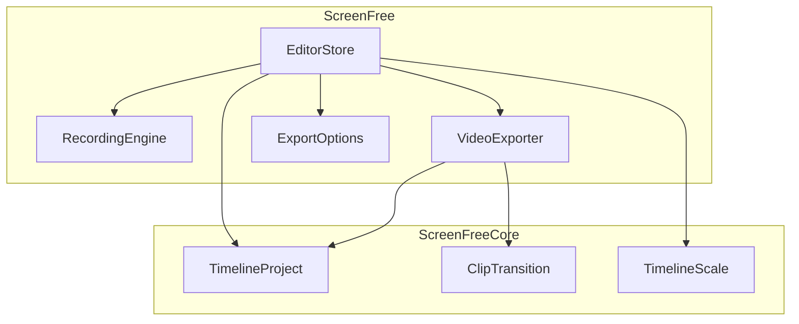
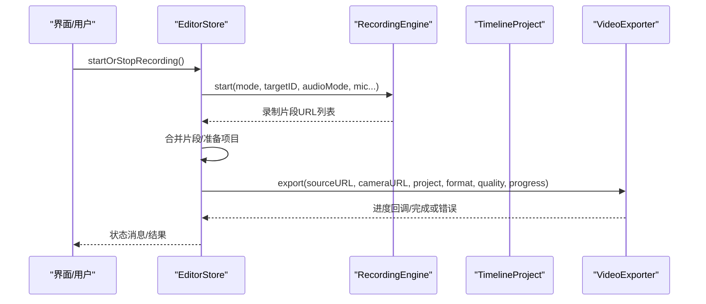
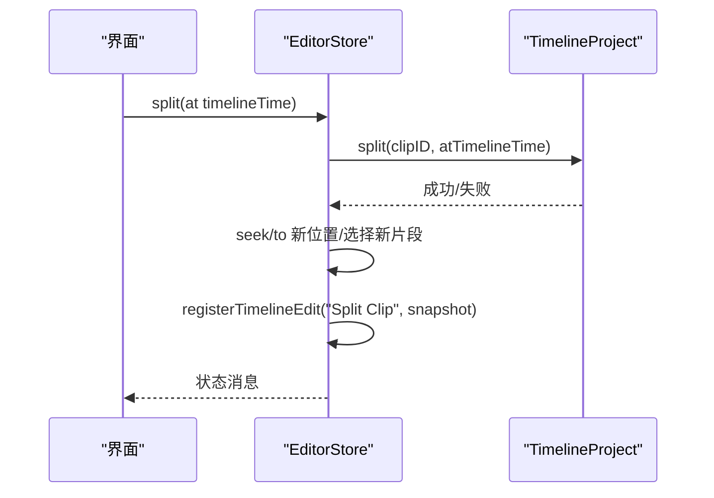
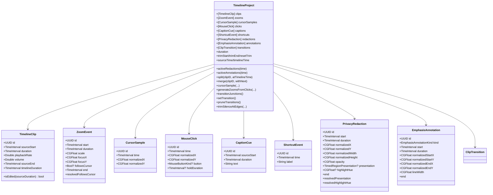
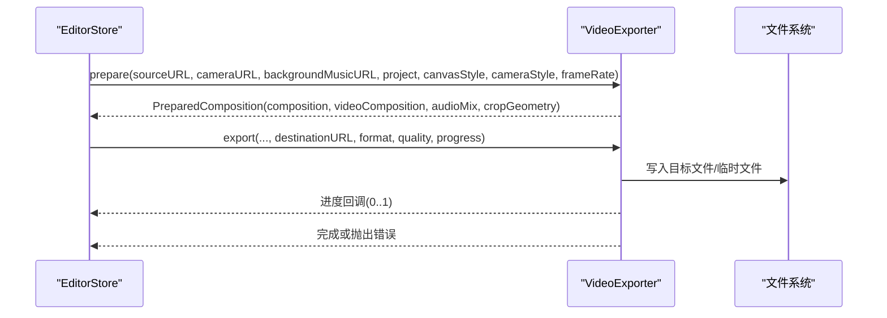
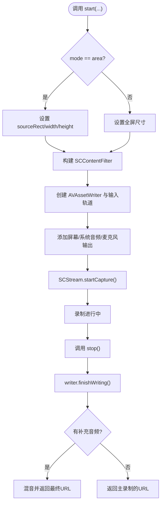
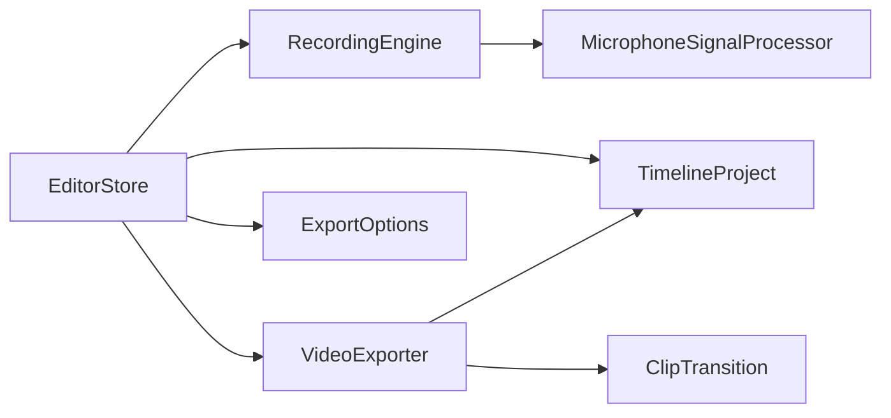

# API 参考

<cite>
**本文引用的文件**
- [EditorStore.swift](file://Sources/ScreenFree/EditorStore.swift)
- [EditorModels.swift](file://Sources/ScreenFreeCore/EditorModels.swift)
- [ClipTransition.swift](file://Sources/ScreenFreeCore/ClipTransition.swift)
- [TimelineScale.swift](file://Sources/ScreenFreeCore/TimelineScale.swift)
- [RecordingEngine.swift](file://Sources/ScreenFree/RecordingEngine.swift)
- [VideoExporter.swift](file://Sources/ScreenFree/VideoExporter.swift)
- [ExportOptions.swift](file://Sources/ScreenFree/ExportOptions.swift)
- [README.md](file://README.md)
</cite>

## 目录
1. [简介](#简介)
2. [项目结构](#项目结构)
3. [核心组件](#核心组件)
4. [架构总览](#架构总览)
5. [详细组件分析](#详细组件分析)
6. [依赖关系分析](#依赖关系分析)
7. [性能考量](#性能考量)
8. [故障排查指南](#故障排查指南)
9. [结论](#结论)
10. [附录：API 速查与示例](#附录api-速查与示例)

## 简介
本 API 参考聚焦 ScreenFree 的编辑器与导出/录制子系统，面向开发者提供 EditorStore、TimelineProject、VideoExporter、RecordingEngine 等关键接口的完整说明。内容涵盖项目状态管理、时间线操作、录制控制、导出参数与质量设置、事件与通知机制、键盘快捷键处理以及系统事件监听等，帮助快速集成与扩展功能。

## 项目结构
ScreenFree 采用模块化组织：
- ScreenFree（应用层）：EditorStore、RecordingEngine、VideoExporter、UI 协调器、导出选项等
- ScreenFreeCore（数据模型与算法）：TimelineProject、剪辑/缩放/标注等数据结构、转场与时间轴缩放工具
- Tests（测试套件）：覆盖媒体管线、时间线、导出、快捷键等
- docs/script：构建与打包脚本

图表来源
- [EditorStore.swift:1-120](file://Sources/ScreenFree/EditorStore.swift#L1-L120)
- [EditorModels.swift:274-306](file://Sources/ScreenFreeCore/EditorModels.swift#L274-L306)
- [ClipTransition.swift:1-43](file://Sources/ScreenFreeCore/ClipTransition.swift#L1-L43)
- [TimelineScale.swift:1-50](file://Sources/ScreenFreeCore/TimelineScale.swift#L1-L50)
- [RecordingEngine.swift:1-120](file://Sources/ScreenFree/RecordingEngine.swift#L1-L120)
- [VideoExporter.swift:1-120](file://Sources/ScreenFree/VideoExporter.swift#L1-L120)
- [ExportOptions.swift:1-120](file://Sources/ScreenFree/ExportOptions.swift#L1-L120)

章节来源
- [README.md:1-120](file://README.md#L1-L120)

## 核心组件
- EditorStore：应用状态中枢，负责录制、播放、时间线编辑、导出、样式与设备权限等
- TimelineProject：非破坏性时间线数据模型，包含剪辑、缩放、光标样本、点击、字幕、快捷键、隐私遮挡、标注与转场
- VideoExporter：基于 AVFoundation 的视频合成与导出，支持 MP4/GIF、画中画、背景乐、进度回调
- RecordingEngine：基于 ScreenCaptureKit 的屏幕/窗口/区域录制，支持系统音频、麦克风、摄像头分段录制与合并

章节来源
- [EditorStore.swift:30-120](file://Sources/ScreenFree/EditorStore.swift#L30-L120)
- [EditorModels.swift:274-306](file://Sources/ScreenFreeCore/EditorModels.swift#L274-L306)
- [VideoExporter.swift:95-120](file://Sources/ScreenFree/VideoExporter.swift#L95-L120)
- [RecordingEngine.swift:63-120](file://Sources/ScreenFree/RecordingEngine.swift#L63-L120)

## 架构总览
EditorStore 作为主控，协调 RecordingEngine 进行录制，使用 TimelineProject 维护时间线，通过 VideoExporter 完成导出。CanvasRenderStyle/CameraOverlayStyle 驱动渲染与合成，ExportOptions 提供格式/分辨率/质量等配置。

图表来源
- [EditorStore.swift:493-643](file://Sources/ScreenFree/EditorStore.swift#L493-L643)
- [RecordingEngine.swift:174-392](file://Sources/ScreenFree/RecordingEngine.swift#L174-L392)
- [VideoExporter.swift:488-590](file://Sources/ScreenFree/VideoExporter.swift#L488-L590)

## 详细组件分析

### EditorStore 公共接口
- 项目状态与资源
  - sourceURL/cameraURL/sourceDuration/sourcePixelSize/sourceFrameRate：当前源视频信息
  - project：TimelineProject 实例，保存所有时间线数据
  - selectedClipID/selectedZoomID/selectedRedactionID/selectedAnnotationID：当前选中对象
  - playhead/isPlaying/isRecording/isExporting/exportProgress：播放/录制/导出状态
  - exportFormat/exportResolution/exportQuality/exportFrameRate：导出参数
  - recordedAudioLayout/systemAudioVolume/microphoneAudioVolume/microphoneAudioMuted：录制音轨布局与音量
- 录制控制
  - startOrStopRecording()/startRecording()/stopRecording()/toggleRecordingPause()
  - refreshCaptureTargets()/refreshAudioApplications()
  - selectRecordingArea()
  - openMicrophoneSettings()/openCameraSettings()/requestInputMonitoringPermission()/requestScreenRecordingPermission()
- 时间线操作
  - split(at)/splitAtPlayhead()/deleteSelectedClip()/mergeSelectedClip(withNext:)
  - trimSelected(start:)/resetSelectedTrim()
  - addZoom/addZoomAtPlayhead()/updateSelectedZoom()/setZoomRange()/splitZoom()/deleteSelectedZoom()
  - addRedactionAtPlayhead()/addSpotlightAtPlayhead()/setRedactionRange()/moveSelectedRedaction()/deleteSelectedRedaction()
  - beginAnnotationTool()/addAnnotation()/setAnnotationRange()/deleteSelectedAnnotation()
  - applyTransition()/updateSelectedTransition()/removeSelectedTransition()/previewTransition()
  - smartTrimSilence()/normalizeAllAudio()
  - generateCaptions()/updateCaption()/removeAllCaptions()/removeAllShortcuts()
- 播放与导航
  - togglePlayback()/stepFrame(direction)/seek(to)/seekAndPlay(to)
  - zoomTimeline(by:)/setTimelineZoom()/fitTimeline()
- 导出与帧输出
  - presentExportSheet()/exportVideo()/cancelExport()
  - copyCurrentFrame()/saveCurrentFrame()
  - resolvedExportDimensions/exportEstimate
- 事件与快捷键
  - handleEscape()/handleDeleteKey()
  - activeClick()/activeShortcut()/cursorIsVisible()/activeCaption()
- 撤销/重做
  - undoTimelineEdit()/redoTimelineEdit()/clearTimelineHistory()

返回值与错误
- 多数方法为 async 或返回 Bool；错误通过抛出异常或设置 errorMessage/localizedErrorMessage 暴露
- 导出失败会清理临时文件并更新状态消息

章节来源
- [EditorStore.swift:120-340](file://Sources/ScreenFree/EditorStore.swift#L120-L340)
- [EditorStore.swift:493-799](file://Sources/ScreenFree/EditorStore.swift#L493-L799)
- [EditorStore.swift:1436-1509](file://Sources/ScreenFree/EditorStore.swift#L1436-L1509)
- [EditorStore.swift:1511-1599](file://Sources/ScreenFree/EditorStore.swift#L1511-L1599)
- [EditorStore.swift:1600-1799](file://Sources/ScreenFree/EditorStore.swift#L1600-L1799)
- [EditorStore.swift:1800-2399](file://Sources/ScreenFree/EditorStore.swift#L1800-L2399)
- [EditorStore.swift:2400-3199](file://Sources/ScreenFree/EditorStore.swift#L2400-L3199)
- [EditorStore.swift:2613-2744](file://Sources/ScreenFree/EditorStore.swift#L2613-L2744)
- [EditorStore.swift:2855-2911](file://Sources/ScreenFree/EditorStore.swift#L2855-L2911)

#### 时间线编辑流程（序列图）

图表来源
- [EditorStore.swift:1835-1847](file://Sources/ScreenFree/EditorStore.swift#L1835-L1847)
- [EditorModels.swift:467-489](file://Sources/ScreenFreeCore/EditorModels.swift#L467-L489)

### TimelineProject 数据模型
- 剪辑 TimelineClip：sourceStart/duration/playbackRate/volume，计算 timelineDuration/sourceEnd
- 缩放 ZoomEvent：start/duration/scale/focusX/focusY/followsCursor
- 光标样本 CursorSample：time/normalizedX/normalizedY
- 鼠标点击 MouseClick：time/normalizedX/normalizedY/button/holdDuration
- 字幕 CaptionCue：sourceStart/duration/text
- 快捷键 ShortcutEvent：time/label
- 隐私遮挡 PrivacyRedaction：start/duration/normalizedX/Y/Width/Height/opacity/presentation/highlightHue
- 强调标注 EmphasisAnnotation：kind/start/duration/normalizedStartX/Y/EndX/Y/lineWidth
- 转场 ClipTransition：leftClipID/rightClipID/style/duration
- 集合 TimelineProject：clips/zooms/cursorSamples/clicks/captions/shortcuts/redactions/annotations/transitions
- 常用方法：duration、activeRedactions/Annotations、split/merge/trimStart/trimEnd/resetTrim、generateZoomsFromClicks、cursorSample、sourceTime/timelineTime 转换、transitionJunctions/setTransition/pruneTransitions、trimSilenceAtEdges

复杂度与行为
- 裁剪/分割/合并均为 O(n) 线性扫描
- 光标插值与抖动过滤在 processedCursorSamples 中实现，含阈值与平滑策略

章节来源
- [EditorModels.swift:4-138](file://Sources/ScreenFreeCore/EditorModels.swift#L4-L138)
- [EditorModels.swift:146-273](file://Sources/ScreenFreeCore/EditorModels.swift#L146-L273)
- [EditorModels.swift:274-376](file://Sources/ScreenFreeCore/EditorModels.swift#L274-L376)
- [EditorModels.swift:377-588](file://Sources/ScreenFreeCore/EditorModels.swift#L377-L588)
- [EditorModels.swift:589-776](file://Sources/ScreenFreeCore/EditorModels.swift#L589-L776)
- [EditorModels.swift:777-800](file://Sources/ScreenFreeCore/EditorModels.swift#L777-L800)

#### 时间线数据结构类图

图表来源
- [EditorModels.swift:4-138](file://Sources/ScreenFreeCore/EditorModels.swift#L4-L138)
- [EditorModels.swift:146-273](file://Sources/ScreenFreeCore/EditorModels.swift#L146-L273)
- [EditorModels.swift:274-376](file://Sources/ScreenFreeCore/EditorModels.swift#L274-L376)
- [ClipTransition.swift:1-43](file://Sources/ScreenFreeCore/ClipTransition.swift#L1-L43)

### VideoExporter 导出 API
- prepare(...)：构建 AVMutableComposition/AVMutableVideoComposition/AVAudioMix，支持相机叠加、背景乐循环、缩放动画、画布裁剪与光标/字幕/快捷键图层
- export(...)：执行导出，支持 GIF 与 MP4，进度回调，取消与错误处理，文件大小限制
- renderFrame(...)：渲染指定时间点的单帧 CGImage，用于预览/截图/粘贴板

参数要点
- sourceURL/cameraURL/backgroundMusicURL/backgroundMusicVolume
- recordedAudioMix：按轨道增益与 clip.volume 混合
- project：时间线数据
- canvasStyle/cameraStyle：画布与相机叠加样式
- destinationURL/format/frameRate/quality/renderSizeOverride/presetName/maximumFileSizeBytes
- progress：@MainActor @Sendable (Double) -> Void

错误处理
- 抛出 VideoExportError（缺失视频轨、无法创建轨道/会话、读取帧失败、导出失败）
- 取消时清理临时文件并抛出 CancellationError

章节来源
- [VideoExporter.swift:95-120](file://Sources/ScreenFree/VideoExporter.swift#L95-L120)
- [VideoExporter.swift:103-486](file://Sources/ScreenFree/VideoExporter.swift#L103-L486)
- [VideoExporter.swift:488-590](file://Sources/ScreenFree/VideoExporter.swift#L488-L590)
- [VideoExporter.swift:592-667](file://Sources/ScreenFree/VideoExporter.swift#L592-L667)

#### 导出流程（序列图）

图表来源
- [VideoExporter.swift:103-486](file://Sources/ScreenFree/VideoExporter.swift#L103-L486)
- [VideoExporter.swift:488-590](file://Sources/ScreenFree/VideoExporter.swift#L488-L590)

### RecordingEngine 录制控制接口
- availableTargets(for mode)：获取显示/窗口/区域可捕获目标
- availableAudioApplications()：列出可捕获系统音频的应用
- thumbnail(for targetID)：生成目标缩略图
- start(mode, targetID, systemAudioMode, selectedAudioApplicationIDs, recordMicrophone, microphoneDeviceID, reduceMicrophoneNoise, normalizeMicrophoneVolume, normalizeSystemAudioVolume, normalizedArea)：开始录制
- stop()：停止录制，返回最终 URL（可能合并补充音频）

模式与配置
- CaptureMode：display/window/area
- SystemAudioCaptureMode：all/selected/off
- 支持实时音频增强（降噪/响度归一化）、独立麦克风输入、可选“选定应用”音频录制与后期混音

错误处理
- RecordingError：noSource/noAudioApplications/cannotStartWriter/cannotFinishWriter/writerFailed(details)

章节来源
- [RecordingEngine.swift:6-61](file://Sources/ScreenFree/RecordingEngine.swift#L6-L61)
- [RecordingEngine.swift:85-172](file://Sources/ScreenFree/RecordingEngine.swift#L85-L172)
- [RecordingEngine.swift:174-392](file://Sources/ScreenFree/RecordingEngine.swift#L174-L392)
- [RecordingEngine.swift:394-443](file://Sources/ScreenFree/RecordingEngine.swift#L394-L443)

#### 录制启动与停止（流程图）

图表来源
- [RecordingEngine.swift:174-392](file://Sources/ScreenFree/RecordingEngine.swift#L174-L392)
- [RecordingEngine.swift:394-443](file://Sources/ScreenFree/RecordingEngine.swift#L394-L443)

### 导出选项与估算
- ExportFormat：mp4/gif
- ExportResolution：source/4K/1080p/720p/custom，支持维度范围 320–7680 且偶数对齐
- ExportQuality：studio/social/web/webLow，影响比特率与 GIF 量化级别
- ExportFrameRateOptions：MP4 支持 24/25/30/50/60；GIF 支持 10/15/20
- ExportEstimateCalculator：估算文件大小与处理时长，并可反推目标文件大小限制

章节来源
- [ExportOptions.swift:79-125](file://Sources/ScreenFree/ExportOptions.swift#L79-L125)
- [ExportOptions.swift:103-182](file://Sources/ScreenFree/ExportOptions.swift#L103-L182)
- [ExportOptions.swift:205-291](file://Sources/ScreenFree/ExportOptions.swift#L205-L291)
- [ExportOptions.swift:293-362](file://Sources/ScreenFree/ExportOptions.swift#L293-L362)

### 时间轴缩放与跟随
- TimelineScale：统一将时间映射到水平像素坐标，支持 fitZoom=1.0、最大 64×
- TimelinePlaybackFollowPolicy：根据播放头位置与可视区域决定自动滚动跟随

章节来源
- [TimelineScale.swift:1-50](file://Sources/ScreenFreeCore/TimelineScale.swift#L1-L50)
- [TimelineScale.swift:52-115](file://Sources/ScreenFreeCore/TimelineScale.swift#L52-L115)

## 依赖关系分析
- EditorStore 依赖 RecordingEngine（录制）、VideoExporter（导出）、TimelineProject（数据）、ExportOptions（配置）
- VideoExporter 依赖 TimelineProject、ClipTransition、CanvasRenderStyle/CameraOverlayStyle
- RecordingEngine 依赖 ScreenCaptureKit/AVFoundation，内部使用 MicrophoneSignalProcessor 进行音频增强

图表来源
- [EditorStore.swift:342-359](file://Sources/ScreenFree/EditorStore.swift#L342-L359)
- [VideoExporter.swift:95-120](file://Sources/ScreenFree/VideoExporter.swift#L95-L120)
- [RecordingEngine.swift:70-82](file://Sources/ScreenFree/RecordingEngine.swift#L70-L82)

## 性能考量
- 录制路径：使用高优先级队列与锁保护，避免首帧前音频导致 writer 失败；必要时分离“选定应用”音频流以降低主路径压力
- 导出路径：prepare 阶段构建 composition/videoComposition/audioMix；export 阶段使用 AVAssetExportSession 异步导出，支持进度轮询与取消
- 时间线操作：大量线性扫描与排序，注意批量操作减少频繁刷新；撤销栈上限 100 条
- 光标处理：抖动过滤与快速变化优化可降低渲染负担；平滑插值仅在启用时生效

## 故障排查指南
- 权限问题：屏幕录制/麦克风/摄像头/输入监控权限未授予会导致 capturePermissionIssue/inputMonitoringGranted 等标志位变化，需引导至系统设置
- 录制失败：RecordingError.noSource/noAudioApplications/cannotStartWriter/cannotFinishWriter/writerFailed(details)；检查目标可用性、音频应用选择与 writer 初始化
- 导出失败：VideoExportError.missingVideoTrack/cannotCreateCompositionTrack/cannotCreateExportSession/cannotReadComposedFrame/exportFailed；确认源视频轨、导出会话创建与帧读取
- 状态反馈：errorMessage/localizedErrorMessage/statusMessage/localizedStatusMessage 提供用户可见的错误与提示

章节来源
- [EditorStore.swift:441-451](file://Sources/ScreenFree/EditorStore.swift#L441-L451)
- [RecordingEngine.swift:40-61](file://Sources/ScreenFree/RecordingEngine.swift#L40-L61)
- [VideoExporter.swift:12-33](file://Sources/ScreenFree/VideoExporter.swift#L12-L33)
- [EditorStore.swift:956-958](file://Sources/ScreenFree/EditorStore.swift#L956-L958)

## 结论
ScreenFree 的 API 围绕 EditorStore 展开，提供完整的录制、时间线编辑与导出能力。TimelineProject 以不可变数据为核心，配合 EditorStore 的状态管理与撤销/重做机制，确保编辑安全与一致性。VideoExporter 与 RecordingEngine 分别封装了 AVFoundation 与 ScreenCaptureKit 的复杂细节，对外暴露简洁、可组合的接口，便于扩展与集成。

## 附录：API 速查与示例

### EditorStore 常用调用示例（描述性步骤）
- 开始录制
  1) 设置 captureMode/targetID/systemAudioMode/microphone 等参数
  2) 调用 startRecording()
  3) 等待 isRecording=true 后进入录制状态
- 停止录制并进入编辑器
  1) 调用 stopRecording()
  2) 若 afterRecordingAction=.edit，则自动加载视频并生成自动缩放（如启用）
- 时间线分割
  1) 调用 split(at: playhead)
  2) 自动定位到新片段并记录历史
- 导出 MP4/GIF
  1) 设置 exportFormat/exportResolution/exportQuality/exportFrameRate
  2) 调用 exportVideo()
  3) 监听 exportProgress 与完成/错误回调

章节来源
- [EditorStore.swift:493-643](file://Sources/ScreenFree/EditorStore.swift#L493-L643)
- [EditorStore.swift:1835-1847](file://Sources/ScreenFree/EditorStore.swift#L1835-L1847)
- [EditorStore.swift:2613-2744](file://Sources/ScreenFree/EditorStore.swift#L2613-L2744)

### RecordingEngine 常用调用示例（描述性步骤）
- 枚举目标与应用
  1) availableTargets(for: .display/.window/.area)
  2) availableAudioApplications()
- 开始录制
  1) start(mode, targetID, systemAudioMode, selectedAudioApplicationIDs, recordMicrophone, ...)
- 停止录制
  1) stop() 返回最终 URL（可能合并补充音频）

章节来源
- [RecordingEngine.swift:85-172](file://Sources/ScreenFree/RecordingEngine.swift#L85-L172)
- [RecordingEngine.swift:174-392](file://Sources/ScreenFree/RecordingEngine.swift#L174-L392)
- [RecordingEngine.swift:394-443](file://Sources/ScreenFree/RecordingEngine.swift#L394-L443)

### VideoExporter 常用调用示例（描述性步骤）
- 准备合成
  1) prepare(sourceURL, cameraURL?, backgroundMusicURL?, backgroundMusicVolume, recordedAudioMix, project, frameRate, renderSizeOverride?, canvasStyle, cameraStyle?)
- 执行导出
  1) export(..., destinationURL, format, frameRate, quality, renderSizeOverride?, presetName, maximumFileSizeBytes?, progress:)
- 渲染单帧
  1) renderFrame(sourceURL, cameraURL?, project, timelineTime, canvasStyle, cameraStyle?, frameRate:)

章节来源
- [VideoExporter.swift:103-486](file://Sources/ScreenFree/VideoExporter.swift#L103-L486)
- [VideoExporter.swift:488-590](file://Sources/ScreenFree/VideoExporter.swift#L488-L590)
- [VideoExporter.swift:592-667](file://Sources/ScreenFree/VideoExporter.swift#L592-L667)

### 事件与通知、快捷键与系统事件
- 事件与通知
  - 播放进度：通过 AVPlayer 周期观察者更新 playhead
  - 录制计时：Timer 累计 recordingElapsed
  - 导出进度：progress 回调
- 快捷键处理
  - handleEscape()/handleDeleteKey() 控制工具切换与删除
  - 快捷键标签由 project.shortcuts 驱动，可在导出/预览中叠加显示
- 系统事件监听
  - 输入监控：CGPreflightListenEventAccess/CGRequestListenEventAccess
  - 屏幕录制：CGPreflightScreenCaptureAccess/CGRequestScreenCaptureAccess
  - 设备监控：DeviceMonitor 刷新麦克风/摄像头状态与授权

章节来源
- [EditorStore.swift:3163-3174](file://Sources/ScreenFree/EditorStore.swift#L3163-L3174)
- [EditorStore.swift:1413-1434](file://Sources/ScreenFree/EditorStore.swift#L1413-L1434)
- [EditorStore.swift:441-451](file://Sources/ScreenFree/EditorStore.swift#L441-L451)