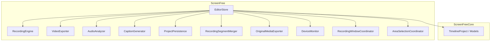
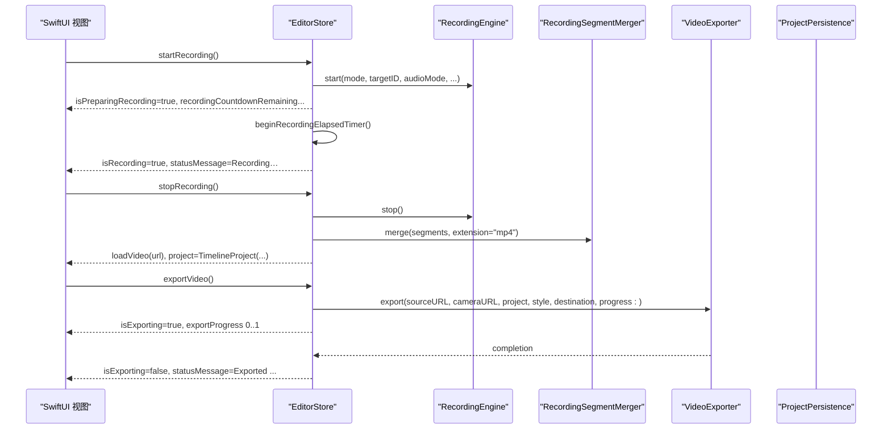
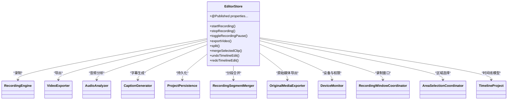
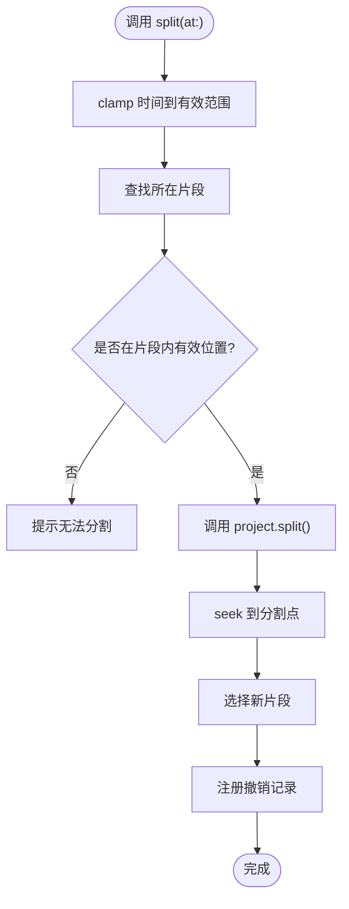
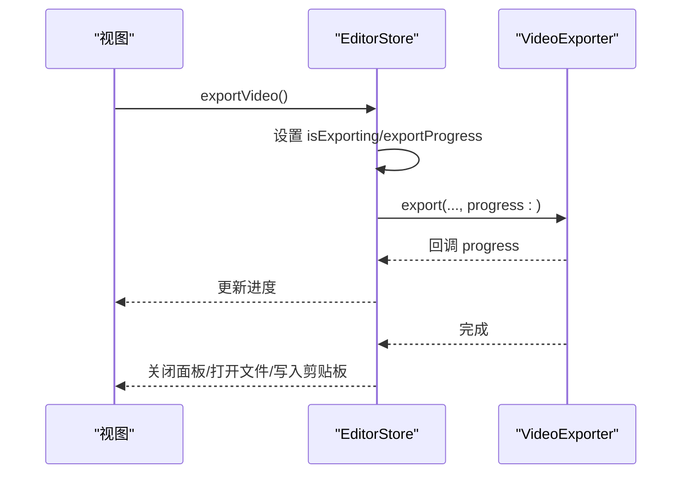

# EditorStore 状态管理 API

<cite>
**本文引用的文件**   
- [EditorStore.swift](file://Sources/ScreenFree/EditorStore.swift)
- [EditorModels.swift](file://Sources/ScreenFreeCore/EditorModels.swift)
- [EditorStoreInteractionTests.swift](file://Tests/ScreenFreeMediaTests/EditorStoreInteractionTests.swift)
</cite>

## 目录
1. [简介](#简介)
2. [项目结构](#项目结构)
3. [核心组件](#核心组件)
4. [架构总览](#架构总览)
5. [详细组件分析](#详细组件分析)
6. [依赖关系分析](#依赖关系分析)
7. [性能考量](#性能考量)
8. [故障排查指南](#故障排查指南)
9. [结论](#结论)
10. [附录：API 参考与示例](#附录api-参考与示例)

## 简介
本文件面向开发者，系统化梳理 EditorStore 作为应用核心状态管理器的公共接口。内容覆盖：
- @Published 属性分类与用途（录制、时间线、导出、画布/光标/相机/字幕等）
- 录制控制方法（startRecording、stopRecording、toggleRecordingPause）
- 时间线操作接口（分割、合并、删除、撤销/重做、缩放、隐私遮挡、标注、转场等）
- 导出功能调用（视频导出、帧导出、原始媒体导出）
- 异步方法与错误处理模式
- SwiftUI 集成方式（ObservableObject、@StateObject/@ObservedObject、Combine 响应式更新）
- 典型使用示例（监听状态变化、触发录制、管理项目数据）

## 项目结构
- EditorStore 位于 ScreenFree 模块，承担 UI 状态、录制引擎、导出器、音频分析、字幕生成、项目持久化等协调职责。
- EditorModels 定义 TimelineProject、TimelineClip、ZoomEvent、PrivacyRedaction、EmphasisAnnotation 等数据结构，供 EditorStore 使用。
- 测试用例验证了部分交互行为（如撤销/重做、工具切换、边界跳转策略等）。

图表来源
- [EditorStore.swift:342-378](file://Sources/ScreenFree/EditorStore.swift#L342-L378)
- [EditorModels.swift:274-306](file://Sources/ScreenFreeCore/EditorModels.swift#L274-L306)

章节来源
- [EditorStore.swift:342-378](file://Sources/ScreenFree/EditorStore.swift#L342-L378)
- [EditorModels.swift:274-306](file://Sources/ScreenFreeCore/EditorModels.swift#L274-L306)

## 核心组件
- EditorStore：主状态容器，暴露大量 @Published 属性与对外方法，负责录制、播放、时间线编辑、导出、样式与设置、自动保存等。
- TimelineProject：时间线模型，包含片段、缩放、标注、隐私遮挡、转场等集合及操作方法。
- 辅助服务：RecordingEngine、VideoExporter、AudioAnalyzer、CaptionGenerator、ProjectPersistence、RecordingSegmentMerger、OriginalMediaExporter、DeviceMonitor、RecordingWindowCoordinator、AreaSelectionCoordinator。

章节来源
- [EditorStore.swift:30-378](file://Sources/ScreenFree/EditorStore.swift#L30-L378)
- [EditorModels.swift:274-306](file://Sources/ScreenFreeCore/EditorModels.swift#L274-L306)

## 架构总览
EditorStore 通过 Combine 的 @Published 驱动 SwiftUI 视图响应式更新；内部以任务（Task）和回调推进耗时操作（录制、导出、分析），并通过状态属性反馈进度与结果。

图表来源
- [EditorStore.swift:503-643](file://Sources/ScreenFree/EditorStore.swift#L503-L643)
- [EditorStore.swift:653-735](file://Sources/ScreenFree/EditorStore.swift#L653-L735)
- [EditorStore.swift:2630-2744](file://Sources/ScreenFree/EditorStore.swift#L2630-L2744)

## 详细组件分析

### 1) 状态属性（@Published）分类与用途
- 录制相关
  - captureMode、captureTargets、selectedTargetID、areaInset、selectedAreaNormalized、systemAudioMode、audioApplications、selectedAudioApplicationIDs、recordMicrophone、selectedMicrophoneID、countdownSeconds、highlightRecordingArea、hideDockIconWhileRecording、hideDesktopIconsWhileRecording、hideCameraPreview、automaticallyCreateZooms、afterRecordingAction、showSpeakerNotes、speakerNotesText、capturePermissionIssue、inputMonitoringGranted、isPreparingRecording、recordingCountdownRemaining、recordingElapsed、isRecordingPaused、isTransitioningRecording、isRecording、sourceURL、cameraURL、statusMessage、errorMessage
- 时间线与播放
  - project、selectedClipID、selectedZoomID、selectedRedactionID、selectedAnnotationID、hoveredTimelineBlock、activeTimelineTool、timelineZoom、playhead、isPlaying、timelineUndoTitle、timelineRedoTitle、recordingHistory
- 导出与媒体
  - isExporting、isVideoExporting、isExportSheetPresented、exportProgress、exportDestination、exportFormat、exportResolution、exportCustomWidth、exportCustomHeight、exportQuality、exportFrameRate、backgroundMusicURL、backgroundMusicVolume、recordedAudioLayout、systemAudioVolume、microphoneAudioVolume、microphoneAudioMuted、backgroundMusicDuration、sourceDuration、sourceAspectRatio、sourcePixelSize、sourceFrameRate、audioAnalysis、isAnalyzingAudio、isGeneratingCaptions、showCaptions、captionFontSize、captionLanguage、captionVocabulary
- 画布/光标/相机/样式
  - cursorSize、cursorReplacement、showCursor、hideCursorWhenIdle、cursorIdleTimeout、cursorTailFreeze、cursorLoopToStart、removeCursorShakes、cursorShakeThreshold、optimizeRapidCursorChanges、smoothCursorMovement、clickEffectPreset、showShortcutOverlay、canvasAspectRatio、canvasContentMode、canvasPadding、cornerRadius、backgroundHue、backgroundMode、wallpaperPreset、backgroundImageURL、backgroundBlur、shadowStrength、zoomScale、zoomDuration、transitionStyle、transitionDuration、selectedTransitionID、zoomMotionPreset、zoomCustomTransitionDuration、zoomCustomX1、zoomCustomY1、zoomCustomX2、zoomCustomY2、motionBlurEnabled、motionBlurStrength、cursorMotionBlur、zoomMotionBlur、panMotionBlur、cameraSize、cameraCornerRadius、cameraMirrored、cameraPosition、appLanguage

说明
- 多数布尔或数值型配置在 didSet 中写入 UserDefaults，实现持久化。
- 与播放器相关的属性（如 backgroundMusicVolume）会联动刷新混音或播放器音量。
- 只读属性（private(set)）用于外部仅观察，例如 hoveredTimelineBlock、timelineUndoTitle、timelineRedoTitle、isVideoExporting、backgroundMusicDuration。

章节来源
- [EditorStore.swift:123-341](file://Sources/ScreenFree/EditorStore.swift#L123-L341)

### 2) 录制控制方法
- startOrStopRecording：根据当前状态决定开始/停止或取消准备。
- startRecording(microphoneSelectionConfirmed:)：权限校验、麦克风/摄像头选择与授权、倒计时、启动录制窗口、启动计时器、初始化项目与播放器等。
- stopRecording：停止录制、合并片段、根据 afterRecordingAction 执行“进入编辑/复制到剪贴板/保存到文件”等分支。
- toggleRecordingPause：暂停/恢复录制，维护累积时长与鼠标捕获。

错误处理
- 未授予屏幕录制权限时提示并打开系统设置。
- 麦克风/摄像头授权失败时设置 errorMessage 并中止流程。
- 异常路径统一将 isPreparingRecording/isRecording 复位，并清理临时状态。

章节来源
- [EditorStore.swift:493-501](file://Sources/ScreenFree/EditorStore.swift#L493-L501)
- [EditorStore.swift:503-643](file://Sources/ScreenFree/EditorStore.swift#L503-L643)
- [EditorStore.swift:653-735](file://Sources/ScreenFree/EditorStore.swift#L653-L735)
- [EditorStore.swift:737-792](file://Sources/ScreenFree/EditorStore.swift#L737-L792)

### 3) 时间线操作接口
- 分割/合并/裁剪/重置裁剪：split(at)、mergeSelectedClip(withNext:)、trimSelected(start:)、resetSelectedTrim()
- 删除：deleteCurrentSelection()、deleteSelectedClip()、deleteSelectedZoom()、deleteSelectedRedaction()、deleteSelectedAnnotation()
- 撤销/重做：undoTimelineEdit()、redoTimelineEdit()、clearTimelineHistory()
- 连续编辑：beginContinuousTimelineEdit(kind)/endContinuousTimelineEdit()，支持 clip/zoom/redaction/annotation 四类连续编辑，最终原子提交一次撤销记录
- 缩放（Zoom）：addZoom/addZoomAtPlayhead/updateSelectedZoom/moveSelectedZoomFocus/setZoomRange/splitZoom/regenerateAutomaticZooms/toggleZoomAtPlayhead
- 隐私遮挡与聚光灯：addRedactionAtPlayhead()/addSpotlightAtPlayhead()/setRedactionRange()/updateSelectedRedaction()/moveSelectedRedaction()/deleteSelectedRedaction()
- 标注：beginAnnotationTool()/addAnnotation()/setAnnotationRange()/deleteSelectedAnnotation()
- 转场：applyTransition()/updateSelectedTransition()/removeSelectedTransition()/previewTransition()
- 智能静音裁剪：smartTrimSilence()
- 音频归一化：normalizeAllAudio()
- 字幕：generateCaptions()/updateCaption()/removeAllCaptions()
- 快捷键叠加：removeAllShortcuts()

注意
- 所有修改均通过 registerTimelineEdit/registerTimelineMutation 注册到撤销栈，保持可回滚。
- 某些操作会触发 seek(to:) 与 refreshSourceAudioMix()，保证预览一致性。

章节来源
- [EditorStore.swift:1835-1851](file://Sources/ScreenFree/EditorStore.swift#L1835-L1851)
- [EditorStore.swift:1941-1972](file://Sources/ScreenFree/EditorStore.swift#L1941-L1972)
- [EditorStore.swift:2112-2126](file://Sources/ScreenFree/EditorStore.swift#L2112-L2126)
- [EditorStore.swift:2128-2150](file://Sources/ScreenFree/EditorStore.swift#L2128-L2150)
- [EditorStore.swift:2169-2280](file://Sources/ScreenFree/EditorStore.swift#L2169-L2280)
- [EditorStore.swift:2341-2376](file://Sources/ScreenFree/EditorStore.swift#L2341-L2376)
- [EditorStore.swift:2480-2575](file://Sources/ScreenFree/EditorStore.swift#L2480-L2575)
- [EditorStore.swift:1985-2055](file://Sources/ScreenFree/EditorStore.swift#L1985-L2055)
- [EditorStore.swift:1644-1670](file://Sources/ScreenFree/EditorStore.swift#L1644-L1670)
- [EditorStore.swift:1623-1642](file://Sources/ScreenFree/EditorStore.swift#L1623-L1642)

### 4) 导出功能调用
- presentExportSheet(destination:)：展示导出面板，规范化帧率。
- exportVideo(destinationOverride:)：根据目标（文件/剪贴板/可分享链接）创建临时文件或选择面板，调用 VideoExporter.export(...) 进行渲染与编码，回调更新 exportProgress，完成后根据目标类型执行后续动作（打开文件浏览器/写入剪贴板/弹出分享面板）。
- copyCurrentFrame/saveCurrentFrame：渲染当前帧为 PNG，写入剪贴板或保存文件。
- 原始媒体导出：saveOriginalScreenMedia/saveOriginalCameraMedia/saveOriginalSystemAudio/saveOriginalMicrophoneAudio，基于 OriginalMediaExporter 提取轨道。

错误处理
- 无源视频或空项目时给出提示。
- 导出失败时清理临时文件并设置 errorMessage。
- 取消导出时清空 Task 并复位状态。

章节来源
- [EditorStore.swift:2613-2628](file://Sources/ScreenFree/EditorStore.swift#L2613-L2628)
- [EditorStore.swift:2630-2744](file://Sources/ScreenFree/EditorStore.swift#L2630-L2744)
- [EditorStore.swift:2855-2911](file://Sources/ScreenFree/EditorStore.swift#L2855-L2911)
- [EditorStore.swift:1301-1339](file://Sources/ScreenFree/EditorStore.swift#L1301-L1339)

### 5) 播放与时间轴同步
- seek/to、seekAndPlay：按时间线映射到源时间，精确跳转到对应片段，必要时切换片段播放速率。
- stepFrame：按帧步进。
- 播放边界策略：当片段首尾连续时继续播放，否则重新 seek 到下一片段起始。
- 背景乐同步：根据 playhead 循环定位背景乐。

章节来源
- [EditorStore.swift:1556-1591](file://Sources/ScreenFree/EditorStore.swift#L1556-L1591)
- [EditorStore.swift:3265-3274](file://Sources/ScreenFree/EditorStore.swift#L3265-L3274)
- [EditorStore.swift:3295-3315](file://Sources/ScreenFree/EditorStore.swift#L3295-L3315)

### 6) 自动保存与恢复
- installAutosave：订阅大量 @Published 属性，去抖后持久化为 ScreenFreeProjectSnapshot。
- openProject/saveProject：打开/保存 .screenfree 项目文件。
- restore：从快照恢复项目状态，包括媒体路径、样式、字幕、转场等。

章节来源
- [EditorStore.swift:3397-3460](file://Sources/ScreenFree/EditorStore.swift#L3397-L3460)
- [EditorStore.swift:1242-1299](file://Sources/ScreenFree/EditorStore.swift#L1242-L1299)
- [EditorStore.swift:3526-3621](file://Sources/ScreenFree/EditorStore.swift#L3526-L3621)

## 依赖关系分析
- EditorStore 依赖多个子系统完成具体工作：
  - RecordingEngine：设备采集、分段录制、缩略图获取
  - VideoExporter：渲染与编码导出
  - AudioAnalyzer：音频波形与峰值分析
  - CaptionGenerator：本地语音识别生成字幕
  - ProjectPersistence：项目快照持久化
  - RecordingSegmentMerger：分段合并为完整媒体
  - OriginalMediaExporter：提取原始轨道
  - DeviceMonitor：设备枚举与权限管理
  - RecordingWindowCoordinator/AreaSelectionCoordinator：录制窗口与区域选择 UI 协调
- 数据模型集中在 ScreenFreeCore/EditorModels.swift，EditorStore 通过 TimelineProject 提供丰富的时间线操作能力。

图表来源
- [EditorStore.swift:342-378](file://Sources/ScreenFree/EditorStore.swift#L342-L378)
- [EditorModels.swift:274-306](file://Sources/ScreenFreeCore/EditorModels.swift#L274-L306)

章节来源
- [EditorStore.swift:342-378](file://Sources/ScreenFree/EditorStore.swift#L342-L378)
- [EditorModels.swift:274-306](file://Sources/ScreenFreeCore/EditorModels.swift#L274-L306)

## 性能考量
- 导出与录制均为异步任务，避免阻塞主线程；通过 exportProgress 与 isExporting 反馈进度与忙闲状态。
- 自动保存采用 debounce(650ms) 聚合变更，降低频繁 I/O。
- 音频混音计算在后台 Task 中进行，并以 generation 标记防止竞态。
- 播放边界判断与片段切换尽量减少不必要的 seek，提升流畅度。

[本节为通用指导，不直接分析具体文件]

## 故障排查指南
- 屏幕录制权限问题：检查 capturePermissionIssue 与 statusMessage，必要时引导用户开启系统设置。
- 麦克风/摄像头授权失败：查看 errorMessage 与 deviceMonitor 的状态，确保授权成功后再尝试录制。
- 导出失败：确认 sourceURL 与 project.clips 非空；检查导出目标是否可写；查看 errorMessage 与临时文件清理逻辑。
- 时间线编辑无效：确认 activeTimelineTool 与 selected*ID 是否正确；检查 split/merge 条件（连续性、速度/音量一致等）。
- 自动保存未生效：确认 installAutosave 已订阅关键属性；检查 persistence.recoveryURL 是否可写。

章节来源
- [EditorStore.swift:441-451](file://Sources/ScreenFree/EditorStore.swift#L441-L451)
- [EditorStore.swift:503-643](file://Sources/ScreenFree/EditorStore.swift#L503-L643)
- [EditorStore.swift:2630-2744](file://Sources/ScreenFree/EditorStore.swift#L2630-L2744)
- [EditorStore.swift:3397-3460](file://Sources/ScreenFree/EditorStore.swift#L3397-L3460)

## 结论
EditorStore 是 ScreenFree 的核心状态管理器，通过 @Published 与 Combine 驱动 SwiftUI 响应式界面，集中管理录制、时间线编辑、导出、样式与设置等全链路状态。其设计清晰、职责明确，借助多子系统协作完成复杂媒体处理流程。开发者可通过提供的 API 快速集成录制、编辑与导出能力，并利用撤销/重做与自动保存提升用户体验。

[本节为总结性内容，不直接分析具体文件]

## 附录：API 参考与示例

### A. SwiftUI 集成模式
- 使用 @StateObject 或 @ObservedObject 持有 EditorStore 实例，绑定 @Published 属性驱动 UI。
- 通过组合订阅（如 $project、$isRecording、$exportProgress）实现局部刷新。
- 在视图层调用 EditorStore 的方法触发状态变更，避免直接修改底层数据。

章节来源
- [EditorStore.swift:30-378](file://Sources/ScreenFree/EditorStore.swift#L30-L378)

### B. 监听状态变化（示例思路）
- 监听 isRecording 变化，动态显示录制按钮状态与倒计时。
- 监听 exportProgress 与 isExporting，显示进度条与禁用导出按钮。
- 监听 timelineUndoTitle/timelineRedoTitle，启用/禁用撤销/重做菜单项。

章节来源
- [EditorStore.swift:1615-1621](file://Sources/ScreenFree/EditorStore.swift#L1615-L1621)
- [EditorStore.swift:2687-2744](file://Sources/ScreenFree/EditorStore.swift#L2687-L2744)

### C. 触发录制操作（示例思路）
- 调用 startOrStopRecording() 或 startRecording()，处理麦克风选择弹窗与权限请求。
- 在 stopRecording() 后根据 afterRecordingAction 自动进入编辑或输出结果。

章节来源
- [EditorStore.swift:493-501](file://Sources/ScreenFree/EditorStore.swift#L493-L501)
- [EditorStore.swift:503-643](file://Sources/ScreenFree/EditorStore.swift#L503-L643)
- [EditorStore.swift:653-735](file://Sources/ScreenFree/EditorStore.swift#L653-L735)

### D. 管理项目数据（示例思路）
- 导入视频后，project 被初始化为单片段 TimelineProject，随后可进行分割、缩放、标注等操作。
- 使用 undo/redo 保障编辑安全；使用 smartTrimSilence 与 normalizeAllAudio 优化素材。

章节来源
- [EditorStore.swift:1436-1509](file://Sources/ScreenFree/EditorStore.swift#L1436-L1509)
- [EditorStore.swift:2058-2074](file://Sources/ScreenFree/EditorStore.swift#L2058-L2074)
- [EditorStore.swift:2112-2126](file://Sources/ScreenFree/EditorStore.swift#L2112-L2126)

### E. 导出功能调用（示例思路）
- 调用 presentExportSheet() 展示导出面板，或直接 exportVideo() 指定目标。
- 监听 exportProgress 与 isExporting，完成后根据目标类型执行后续动作。

章节来源
- [EditorStore.swift:2613-2628](file://Sources/ScreenFree/EditorStore.swift#L2613-L2628)
- [EditorStore.swift:2630-2744](file://Sources/ScreenFree/EditorStore.swift#L2630-L2744)

### F. 时间线操作流程图（分割）

图表来源
- [EditorStore.swift:1835-1851](file://Sources/ScreenFree/EditorStore.swift#L1835-L1851)

### G. 导出序列图（视频导出）

图表来源
- [EditorStore.swift:2630-2744](file://Sources/ScreenFree/EditorStore.swift#L2630-L2744)

### H. 测试要点参考
- 默认录制参数（系统音频、麦克风、缩放默认值）
- 多麦克风时的选择策略
- 删除键路由与撤销/重做的原子性
- 连续编辑的撤销合并
- 播放边界策略（连续片段继续播放，否则跳转）

章节来源
- [EditorStoreInteractionTests.swift:31-97](file://Tests/ScreenFreeMediaTests/EditorStoreInteractionTests.swift#L31-L97)
- [EditorStoreInteractionTests.swift:313-532](file://Tests/ScreenFreeMediaTests/EditorStoreInteractionTests.swift#L313-L532)
- [EditorStoreInteractionTests.swift:656-694](file://Tests/ScreenFreeMediaTests/EditorStoreInteractionTests.swift#L656-L694)