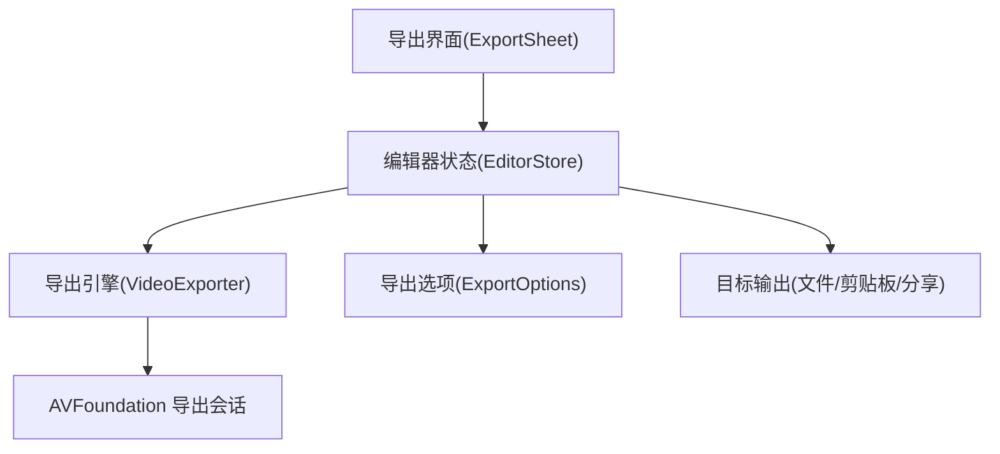
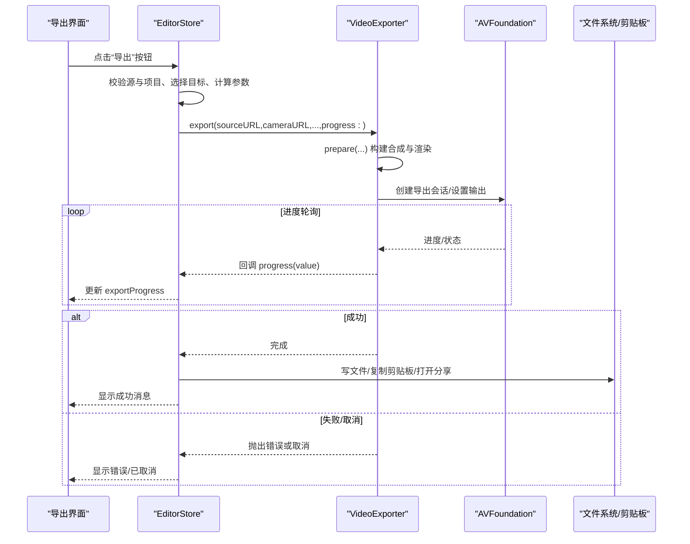
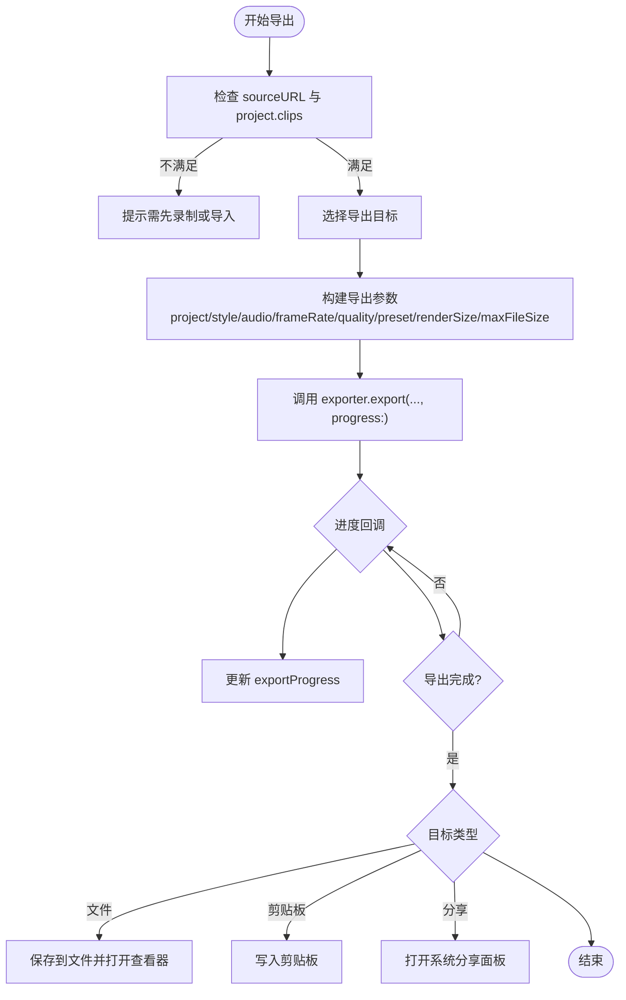
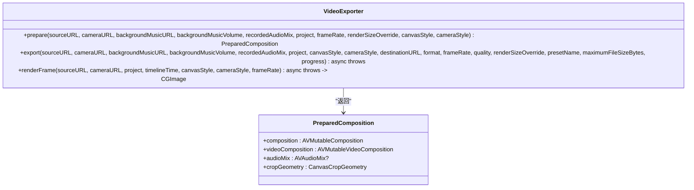
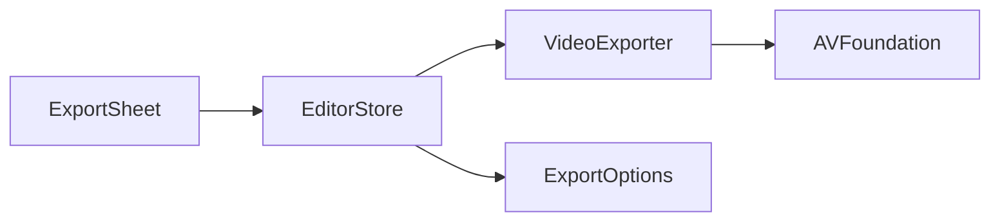

# 导出管理 API

<cite>
**本文引用的文件**
- [EditorStore.swift](file://Sources/ScreenFree/EditorStore.swift)
- [VideoExporter.swift](file://Sources/ScreenFree/VideoExporter.swift)
- [ExportOptions.swift](file://Sources/ScreenFree/ExportOptions.swift)
- [ExportSheet.swift](file://Sources/ScreenFree/ExportSheet.swift)
- [ExportOptionsTests.swift](file://Tests/ScreenFreeMediaTests/ExportOptionsTests.swift)
- [VideoExporterTests.swift](file://Tests/ScreenFreeMediaTests/VideoExporterTests.swift)
</cite>

## 目录
1. [简介](#简介)
2. [项目结构](#项目结构)
3. [核心组件](#核心组件)
4. [架构总览](#架构总览)
5. [详细组件分析](#详细组件分析)
6. [依赖关系分析](#依赖关系分析)
7. [性能考量](#性能考量)
8. [故障排查指南](#故障排查指南)
9. [结论](#结论)
10. [附录](#附录)

## 简介
本文件面向 ScreenFree 的“导出管理 API”，聚焦 EditorStore 中与视频导出相关的方法与属性，系统说明导出配置、流程控制、进度监控、结果处理、错误处理与取消机制，并覆盖支持的导出格式（MP4、GIF）与质量预设。文档同时给出与 VideoExporter 组件的交互方式、分辨率与帧率设置、以及批量导出与自定义分辨率等高级能力的使用要点与最佳实践。

## 项目结构
- EditorStore：应用状态与用户操作入口，负责导出参数聚合、任务调度、进度回调与结果分发。
- VideoExporter：底层导出引擎，封装 AVFoundation 合成、渲染、编码与 GIF 导出逻辑。
- ExportOptions：导出选项枚举与计算工具（分辨率、帧率、质量、目标文件大小估算）。
- ExportSheet：导出界面视图，绑定 EditorStore 的发布属性，驱动导出流程。
- 测试用例：验证导出选项、分辨率、帧率、质量估算与导出行为。

图表来源
- [ExportSheet.swift](file://Sources/ScreenFree/ExportSheet.swift)
- [EditorStore.swift](file://Sources/ScreenFree/EditorStore.swift)
- [VideoExporter.swift](file://Sources/ScreenFree/VideoExporter.swift)
- [ExportOptions.swift](file://Sources/ScreenFree/ExportOptions.swift)

章节来源
- [EditorStore.swift](file://Sources/ScreenFree/EditorStore.swift)
- [VideoExporter.swift](file://Sources/ScreenFree/VideoExporter.swift)
- [ExportOptions.swift](file://Sources/ScreenFree/ExportOptions.swift)
- [ExportSheet.swift](file://Sources/ScreenFree/ExportSheet.swift)

## 核心组件
- EditorStore 导出相关属性
  - 导出状态：isExporting、isVideoExporting、exportProgress、isExportSheetPresented
  - 导出配置：exportDestination、exportFormat、exportResolution、exportQuality、exportFrameRate、exportCustomWidth、exportCustomHeight
  - 源信息：sourceURL、cameraURL、project、backgroundMusicURL、backgroundMusicVolume、recordedAudioLayout、systemAudioVolume、microphoneAudioVolume、microphoneAudioMuted
- EditorStore 导出方法
  - presentExportSheet(destination:)：打开导出面板，规范化帧率
  - exportVideo(destinationOverride:)：启动导出任务，选择目标、构建参数、调用 VideoExporter、更新进度与结果
  - cancelExport()：取消当前导出任务
  - copyCurrentFrame()/saveCurrentFrame()：单帧导出（PNG），用于截图与预览
- VideoExporter 关键接口
  - prepare(...)：准备合成（时间线剪辑、缩放、字幕、遮罩、相机叠加、音频混合）
  - export(..., progress:)：执行 MP4/GIF 导出，支持进度回调与取消
  - renderFrame(...)：按时间线时间点渲染一帧图像（用于缩略图/截图）
- ExportOptions 关键类型
  - ExportFormat：mp4、gif
  - ExportResolution：source、p4K、p1080、p720、custom；提供 presetName 与 dimensions 计算
  - ExportQuality：studio、social、web、webLow；提供 presetName、压缩参数与解释文案
  - ExportFrameRateOptions：支持帧率集合与归一化
  - ExportEstimateCalculator：估算文件大小与处理时长，目标文件大小限制

章节来源
- [EditorStore.swift](file://Sources/ScreenFree/EditorStore.swift)
- [VideoExporter.swift](file://Sources/ScreenFree/VideoExporter.swift)
- [ExportOptions.swift](file://Sources/ScreenFree/ExportOptions.swift)

## 架构总览
导出流程由 UI 触发，EditorStore 聚合参数并调度 VideoExporter 完成实际导出，期间通过进度回调更新 UI，并在完成后根据目标类型进行文件保存、剪贴板写入或分享。

图表来源
- [EditorStore.swift](file://Sources/ScreenFree/EditorStore.swift)
- [VideoExporter.swift](file://Sources/ScreenFree/VideoExporter.swift)
- [ExportOptions.swift](file://Sources/ScreenFree/ExportOptions.swift)

## 详细组件分析

### EditorStore 导出属性与方法
- 导出属性
  - isExporting、isVideoExporting：全局与视频导出状态
  - exportProgress：0~1 的进度值
  - exportDestination/exportFormat/exportResolution/exportQuality/exportFrameRate：导出配置
  - exportCustomWidth/exportCustomHeight：自定义分辨率宽高
  - sourceURL/cameraURL/project/backgroundMusicURL/backgroundMusicVolume/recordedAudioLayout/systemAudioVolume/microphoneAudioVolume/microphoneAudioMuted：参与导出的媒体与混音数据
- 导出方法
  - presentExportSheet(destination:)：展示导出面板，自动将帧率归一化为所选格式支持的值
  - exportVideo(destinationOverride:)：核心导出入口
    - 选择目标：文件保存面板、临时剪贴板路径、临时分享路径
    - 构建参数：project、canvasStyle、cameraStyle、audioMix、frameRate、quality、presetName、renderSizeOverride、maximumFileSizeBytes
    - 调用 exporter.export(...) 并订阅 progress 回调
    - 成功后根据 destination 执行写文件/复制到剪贴板/打开分享
    - 失败或取消时清理临时文件并上报错误
  - cancelExport()：取消 Task 以中断导出
  - copyCurrentFrame()/saveCurrentFrame()：基于 exporter.renderFrame(...) 渲染当前帧并写入剪贴板或 PNG 文件

图表来源
- [EditorStore.swift](file://Sources/ScreenFree/EditorStore.swift)

章节来源
- [EditorStore.swift](file://Sources/ScreenFree/EditorStore.swift)

### VideoExporter 导出引擎
- prepare(...)：将 TimelineProject 的剪辑、缩放、转场、字幕、隐私遮挡、动画模糊、鼠标轨迹、快捷键提示等效果合成为 AVMutableComposition 与 AVMutableVideoComposition，并生成 AVAudioMix
- export(..., progress:)：
  - 若 format == .gif：走 GIF 专用导出路径（限制帧率、量化级别、图像压缩质量）
  - 否则：使用 AVAssetExportSession 进行 MP4 导出，支持 fileLengthLimit、shouldOptimizeForNetworkUse
  - 通过 SendableExportSession 包装 session 状态，周期性读取 progress 并通过回调返回
  - 支持取消：onCancel 中调用 cancelExport()，并清理临时文件
- renderFrame(...)：按 timelineTime 渲染一帧 CGImage，用于缩略图/截图

图表来源
- [VideoExporter.swift](file://Sources/ScreenFree/VideoExporter.swift)

章节来源
- [VideoExporter.swift](file://Sources/ScreenFree/VideoExporter.swift)

### ExportOptions 导出选项与估算
- ExportFormat：mp4、gif
- ExportResolution：source、p4K、p1080、p720、custom；提供 presetName 映射到 AVAssetExportPreset*，并根据 canvasAspectRatio 计算最终尺寸
- ExportQuality：studio、social、web、webLow；提供 presetName、每像素比特率、GIF 量化级别、图像压缩质量
- ExportFrameRateOptions：支持帧率集合与归一化（GIF 最高 20 FPS）
- ExportEstimateCalculator：estimate(...) 估算文件大小与处理时长；targetFileLength(...) 为非 studio 质量提供目标文件大小上限

章节来源
- [ExportOptions.swift](file://Sources/ScreenFree/ExportOptions.swift)
- [ExportOptionsTests.swift](file://Tests/ScreenFreeMediaTests/ExportOptionsTests.swift)

### ExportSheet 导出界面
- 绑定 store 的导出属性，提供格式、帧率、分辨率、压缩质量、目标选择等控件
- 在导出进行中禁用关闭，显示进度条
- 底部按钮：取消导出（正在导出时调用 store.cancelExport()）、确认导出（调用 store.exportVideo()）

章节来源
- [ExportSheet.swift](file://Sources/ScreenFree/ExportSheet.swift)

## 依赖关系分析
- EditorStore 依赖 VideoExporter 完成实际的合成与编码
- EditorStore 依赖 ExportOptions 确定分辨率、帧率、质量与估算
- ExportSheet 依赖 EditorStore 的状态与方法驱动 UI 与流程
- VideoExporter 依赖 AVFoundation 进行媒体读写与导出

图表来源
- [ExportSheet.swift](file://Sources/ScreenFree/ExportSheet.swift)
- [EditorStore.swift](file://Sources/ScreenFree/EditorStore.swift)
- [VideoExporter.swift](file://Sources/ScreenFree/VideoExporter.swift)
- [ExportOptions.swift](file://Sources/ScreenFree/ExportOptions.swift)

章节来源
- [ExportSheet.swift](file://Sources/ScreenFree/ExportSheet.swift)
- [EditorStore.swift](file://Sources/ScreenFree/EditorStore.swift)
- [VideoExporter.swift](file://Sources/ScreenFree/VideoExporter.swift)
- [ExportOptions.swift](file://Sources/ScreenFree/ExportOptions.swift)

## 性能考量
- 帧率与分辨率对导出时长与体积影响显著：高帧率与高分辨率会增加处理时间与文件大小
- GIF 导出限制帧率（最高 20 FPS）与量化级别，避免过大文件与过长渲染时间
- 非 studio 质量可启用 targetFileLength 限制，控制输出文件大小
- 进度轮询间隔约 100ms，平衡 UI 流畅性与系统开销
- 背景乐循环拼接、多轨道混音会增加合成复杂度，建议合理设置音量与时长

[本节为通用指导，无需特定文件引用]

## 故障排查指南
- 常见错误
  - 缺少视频轨道：检查 sourceURL 是否有效且包含视频轨
  - 无法创建导出会话：检查 AVAssetExportSession 初始化与 presetName 是否合法
  - 无法读取合成帧：检查 composition 是否正确构建与输出
  - 导出失败：查看 session.error 或捕获的异常
- 取消导出
  - 调用 store.cancelExport() 会取消 Task 并清理临时文件
- 剪贴板/分享失败
  - 剪贴板写入失败：检查权限与平台限制
  - 分享失败：确保文件存在且可用

章节来源
- [VideoExporter.swift](file://Sources/ScreenFree/VideoExporter.swift)
- [EditorStore.swift](file://Sources/ScreenFree/EditorStore.swift)

## 结论
EditorStore 作为导出管理的统一入口，聚合用户配置与媒体数据，委托 VideoExporter 完成高质量的视频与 GIF 导出。ExportOptions 提供一致的分辨率、帧率与质量模型，并结合估算工具优化用户体验。通过清晰的进度回调、错误处理与取消机制，导出流程稳定可靠，适用于文件保存、剪贴板复制与系统分享等多种场景。

[本节为总结性内容，无需特定文件引用]

## 附录

### 支持的导出格式与质量预设
- 导出格式
  - MP4：适合存档与编辑，支持高质量与网络优化
  - GIF：适合短片段分享，限制帧率与量化级别
- 质量预设
  - Studio：最高保真度，适合编辑与归档
  - Social：平衡质量与体积，适合社交平台
  - Web/Web(Low)：更小体积，适合网页与快速分享

章节来源
- [ExportOptions.swift](file://Sources/ScreenFree/ExportOptions.swift)

### 代码示例（路径指引）
- 配置导出参数并启动导出
  - 参考：[EditorStore.exportVideo](file://Sources/ScreenFree/EditorStore.swift)
- 监听导出进度
  - 参考：[EditorStore.exportVideo 中的 progress 回调](file://Sources/ScreenFree/EditorStore.swift)
- 处理导出结果（文件/剪贴板/分享）
  - 参考：[EditorStore.exportVideo 的结果分支](file://Sources/ScreenFree/EditorStore.swift)
- 与 VideoExporter 交互
  - 参考：[VideoExporter.prepare](file://Sources/ScreenFree/VideoExporter.swift)、[VideoExporter.export](file://Sources/ScreenFree/VideoExporter.swift)、[VideoExporter.renderFrame](file://Sources/ScreenFree/VideoExporter.swift)
- 自定义分辨率与帧率
  - 参考：[ExportResolution.dimensions](file://Sources/ScreenFree/ExportOptions.swift)、[ExportFrameRateOptions.normalized](file://Sources/ScreenFree/ExportOptions.swift)
- 取消导出
  - 参考：[EditorStore.cancelExport](file://Sources/ScreenFree/EditorStore.swift)

### 高级功能
- 批量导出
  - 当前实现为单次导出；如需批量，可在上层循环调用 exportVideo，并管理并发与队列
- 自定义分辨率
  - 使用 exportResolution = .custom，并设置 exportCustomWidth/exportCustomHeight
- 帧率设置
  - 使用 exportFrameRate，并由 ExportFrameRateOptions.normalized 归一化为支持值（GIF 最高 20 FPS）

章节来源
- [EditorStore.swift](file://Sources/ScreenFree/EditorStore.swift)
- [ExportOptions.swift](file://Sources/ScreenFree/ExportOptions.swift)