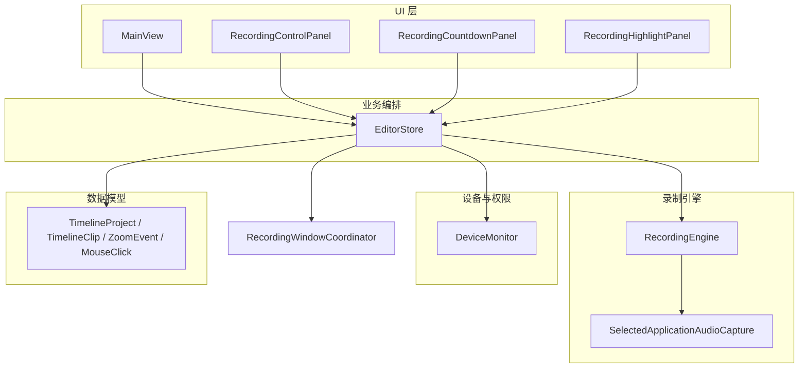
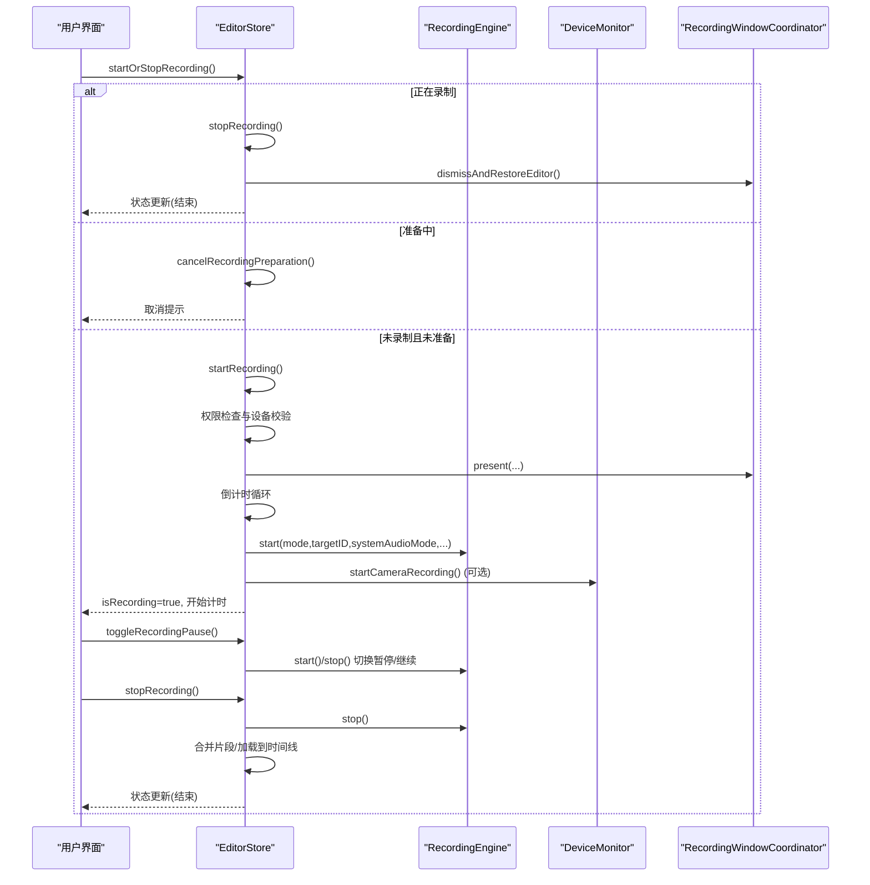
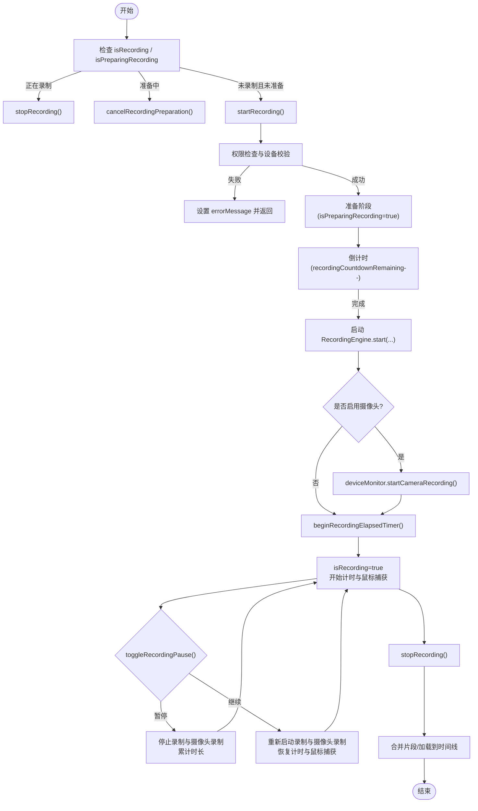
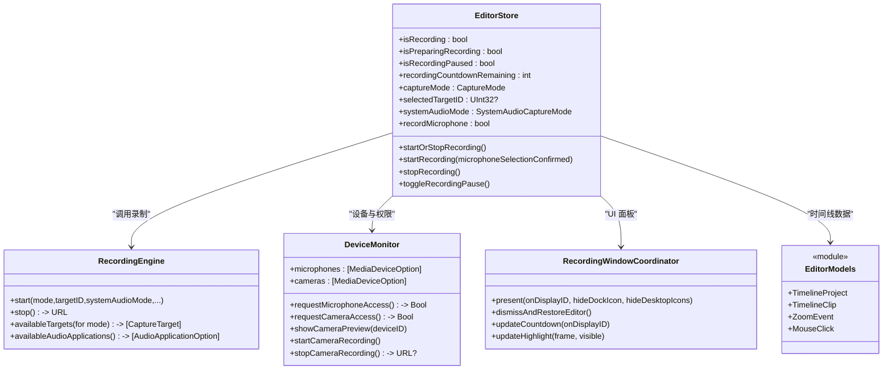

# 录制控制 API

<cite>
**本文引用的文件**   
- [EditorStore.swift](file://Sources/ScreenFree/EditorStore.swift)
- [RecordingEngine.swift](file://Sources/ScreenFree/RecordingEngine.swift)
- [DeviceMonitor.swift](file://Sources/ScreenFree/DeviceMonitor.swift)
- [RecordingWindowCoordinator.swift](file://Sources/ScreenFree/RecordingWindowCoordinator.swift)
- [EditorModels.swift](file://Sources/ScreenFreeCore/EditorModels.swift)
</cite>

## 目录
1. [简介](#简介)
2. [项目结构](#项目结构)
3. [核心组件](#核心组件)
4. [架构总览](#架构总览)
5. [详细组件分析](#详细组件分析)
6. [依赖关系分析](#依赖关系分析)
7. [性能考量](#性能考量)
8. [故障排查指南](#故障排查指南)
9. [结论](#结论)
10. [附录：调用示例与生命周期管理](#附录调用示例与生命周期管理)

## 简介
本文件面向“录制控制 API”的完整说明，聚焦 EditorStore 中的录制相关方法与状态属性，包括 startRecording()、stopRecording()、toggleRecordingPause()、startOrStopRecording() 等核心接口；详细说明录制状态属性（isRecording、isPreparingRecording、isRecordingPaused、recordingCountdownRemaining 等）的用途与更新机制；解释录制参数配置（captureMode、selectedTargetID、systemAudioMode、recordMicrophone 等）对录制行为的影响；并给出权限检查流程、麦克风选择策略、摄像头画中画集成、错误处理与状态恢复逻辑。文档同时提供时序图、流程图与类图，帮助读者快速理解系统设计与实现细节。

## 项目结构
围绕录制控制的代码主要分布在以下模块：
- EditorStore：录制控制入口、状态管理与 UI 交互协调
- RecordingEngine：屏幕/窗口/区域捕获、音视频写入与混合
- DeviceMonitor：设备枚举、权限请求、麦克风电平监测、摄像头预览与录制
- RecordingWindowCoordinator：录制面板、倒计时、高亮框、演讲者备注等浮动面板管理
- EditorModels：时间线数据结构（剪辑、缩放事件、鼠标点击等），用于录制后自动处理

图表来源
- [EditorStore.swift:30-375](file://Sources/ScreenFree/EditorStore.swift#L30-L375)
- [RecordingEngine.swift:63-120](file://Sources/ScreenFree/RecordingEngine.swift#L63-L120)
- [DeviceMonitor.swift:44-100](file://Sources/ScreenFree/DeviceMonitor.swift#L44-L100)
- [RecordingWindowCoordinator.swift:5-20](file://Sources/ScreenFree/RecordingWindowCoordinator.swift#L5-L20)
- [EditorModels.swift:274-306](file://Sources/ScreenFreeCore/EditorModels.swift#L274-L306)

章节来源
- [EditorStore.swift:30-375](file://Sources/ScreenFree/EditorStore.swift#L30-L375)
- [RecordingEngine.swift:63-120](file://Sources/ScreenFree/RecordingEngine.swift#L63-L120)
- [DeviceMonitor.swift:44-100](file://Sources/ScreenFree/DeviceMonitor.swift#L44-L100)
- [RecordingWindowCoordinator.swift:5-20](file://Sources/ScreenFree/RecordingWindowCoordinator.swift#L5-L20)
- [EditorModels.swift:274-306](file://Sources/ScreenFreeCore/EditorModels.swift#L274-L306)

## 核心组件
- EditorStore：对外暴露录制控制方法，维护录制状态与 UI 联动，协调 RecordingEngine、DeviceMonitor、RecordingWindowCoordinator 完成录制全流程。
- RecordingEngine：基于 ScreenCaptureKit 与 AVFoundation，负责屏幕/窗口/区域捕获、系统音频与麦克风采集、AVAssetWriter 写入、可选的指定应用音频录制与混音。
- DeviceMonitor：管理麦克风和摄像头设备列表、权限请求、麦克风电平监测、摄像头预览与独立录制输出。
- RecordingWindowCoordinator：管理录制控制面板、倒计时、高亮框、演讲者备注等浮动面板，以及桌面图标隐藏与恢复。
- EditorModels：定义时间线数据结构，支持录制结束后自动生成缩放、记录鼠标点击等。

章节来源
- [EditorStore.swift:30-375](file://Sources/ScreenFree/EditorStore.swift#L30-L375)
- [RecordingEngine.swift:63-120](file://Sources/ScreenFree/RecordingEngine.swift#L63-L120)
- [DeviceMonitor.swift:44-100](file://Sources/ScreenFree/DeviceMonitor.swift#L44-L100)
- [RecordingWindowCoordinator.swift:5-20](file://Sources/ScreenFree/RecordingWindowCoordinator.swift#L5-L20)
- [EditorModels.swift:274-306](file://Sources/ScreenFreeCore/EditorModels.swift#L274-L306)

## 架构总览
录制控制的核心流程由 EditorStore 驱动，依次进行权限检查、设备准备、倒计时、启动 RecordingEngine、可选摄像头录制、计时与鼠标捕获、停止时合并片段与后续动作（编辑/剪贴板/保存文件）。

图表来源
- [EditorStore.swift:493-643](file://Sources/ScreenFree/EditorStore.swift#L493-L643)
- [EditorStore.swift:653-735](file://Sources/ScreenFree/EditorStore.swift#L653-L735)
- [EditorStore.swift:737-792](file://Sources/ScreenFree/EditorStore.swift#L737-L792)
- [RecordingEngine.swift:174-392](file://Sources/ScreenFree/RecordingEngine.swift#L174-L392)
- [DeviceMonitor.swift:252-284](file://Sources/ScreenFree/DeviceMonitor.swift#L252-L284)
- [RecordingWindowCoordinator.swift:19-73](file://Sources/ScreenFree/RecordingWindowCoordinator.swift#L19-L73)

## 详细组件分析

### EditorStore 录制控制方法
- startOrStopRecording()
  - 根据当前 isRecording 与 isPreparingRecording 决定调用 stopRecording()、cancelRecordingPreparation() 或 startRecording()。
- startRecording(microphoneSelectionConfirmed:)
  - 权限检查：屏幕录制权限、麦克风权限、摄像头权限（若启用画中画）。
  - 麦克风选择策略：当 recordMicrophone 为真且存在多个麦克风且未确认选择时，弹出选择面板。
  - 设备准备：刷新设备列表、确保默认麦克风、必要时显示摄像头预览。
  - 录制准备：重置状态、初始化音频布局、设置倒计时、展示录制面板、执行倒计时。
  - 启动录制：调用 RecordingEngine.start(...)，按 captureMode、systemAudioMode、recordMicrophone 等参数配置。
  - 可选摄像头录制：若 selectedCameraID 存在，则启动摄像头录制。
  - 进入录制状态：isRecording=true，开始计时与鼠标捕获，清理时间线历史。
- stopRecording()
  - 非录制状态：尝试取消准备。
  - 录制中：结束鼠标捕获与计时器，若非暂停则追加已录片段；合并主视频与可选摄像头片段；根据 afterRecordingAction 执行编辑/剪贴板/保存文件；恢复编辑器窗口。
- toggleRecordingPause()
  - 在录制中切换暂停/继续：暂停时停止录制与摄像头录制，累计时长；继续时重新调用 RecordingEngine.start(...) 并恢复计时与鼠标捕获。
- cancelRecordingPreparation()
  - 取消准备阶段，清理状态并恢复编辑器。

章节来源
- [EditorStore.swift:493-643](file://Sources/ScreenFree/EditorStore.swift#L493-L643)
- [EditorStore.swift:653-735](file://Sources/ScreenFree/EditorStore.swift#L653-L735)
- [EditorStore.swift:737-792](file://Sources/ScreenFree/EditorStore.swift#L737-L792)
- [EditorStore.swift:794-801](file://Sources/ScreenFree/EditorStore.swift#L794-L801)

### 录制状态属性与更新机制
- isRecording：是否处于录制中。在 startRecording() 成功后置 true，在 stopRecording() 后置 false。
- isPreparingRecording：是否处于准备阶段（权限检查、设备准备、倒计时）。在 startRecording() 开始时置 true，倒计时完成后置 false；取消准备时也会置 false。
- isRecordingPaused：是否处于暂停状态。在 toggleRecordingPause() 暂停时置 true，继续时置 false。
- recordingCountdownRemaining：倒计时剩余秒数。在 startRecording() 倒计时循环中逐秒递减，结束时归零。
- recordingElapsed：录制累计时长。通过计时器递增，暂停时停止，继续时从上次累计值继续。
- capturePermissionIssue、inputMonitoringGranted：权限问题与输入监听授权状态，影响录制可用性。
- statusMessage、errorMessage：状态与错误消息，供 UI 展示。

章节来源
- [EditorStore.swift:223-248](file://Sources/ScreenFree/EditorStore.swift#L223-L248)
- [EditorStore.swift:564-635](file://Sources/ScreenFree/EditorStore.swift#L564-L635)
- [EditorStore.swift:664-735](file://Sources/ScreenFree/EditorStore.swift#L664-L735)
- [EditorStore.swift:737-792](file://Sources/ScreenFree/EditorStore.swift#L737-L792)

### 录制参数配置与行为影响
- captureMode：捕获模式（display/window/area）。影响 RecordingEngine 的内容过滤与分辨率设置。
- selectedTargetID：目标显示 ID 或窗口 ID。决定录制源。
- systemAudioMode：系统音频模式（all/selected/off）。all 时直接捕获系统音频；selected 时仅捕获指定应用的音频；off 时不捕获系统音频。
- recordMicrophone：是否录制麦克风。macOS 15+ 可用；需要麦克风权限与设备选择。
- selectedMicrophoneID：选择的麦克风设备 ID。若无默认或无效，将回退到默认或首个可用设备。
- reduceMicrophoneNoise、normalizeMicrophoneVolume、normalizeSystemAudioVolume：降噪与音量标准化开关，影响音频信号处理器。
- selectedAreaNormalized：区域捕获时的归一化矩形，影响 sourceRect 与最终分辨率。
- hideDockIconWhileRecording、hideDesktopIconsWhileRecording、hideCameraPreview：录制期间 UI 行为（隐藏 Dock 图标、桌面图标、摄像头预览）。
- countdownSeconds：倒计时秒数。
- automaticallyCreateZooms、afterRecordingAction：录制后自动处理策略（生成缩放、编辑/剪贴板/保存文件）。

章节来源
- [RecordingEngine.swift:174-392](file://Sources/ScreenFree/RecordingEngine.swift#L174-L392)
- [EditorStore.swift:124-206](file://Sources/ScreenFree/EditorStore.swift#L124-L206)
- [EditorStore.swift:503-643](file://Sources/ScreenFree/EditorStore.swift#L503-L643)

### 权限检查流程与麦克风选择策略
- 屏幕录制权限：CGPreflightScreenCaptureAccess() 检查；若无权限，调用 requestScreenRecordingPermission() 引导用户开启。
- 输入监听权限：CGPreflightListenEventAccess() 检查，影响自动点击缩放功能。
- 麦克风权限：AVCaptureDevice.requestAccess(for: .audio)；若未授权，提示用户并在失败时返回错误。
- 摄像头权限：AVCaptureDevice.requestAccess(for: .video)；若未授权，提示用户并在失败时返回错误。
- 麦克风选择策略：MicrophoneSelectionPolicy.requiresPrompt(recordsMicrophone, availableMicrophoneCount, selectionWasConfirmed)。当启用麦克风录制且存在多个麦克风且未确认选择时，弹出选择面板。

章节来源
- [EditorStore.swift:441-451](file://Sources/ScreenFree/EditorStore.swift#L441-L451)
- [EditorStore.swift:512-545](file://Sources/ScreenFree/EditorStore.swift#L512-L545)
- [DeviceMonitor.swift:102-112](file://Sources/ScreenFree/DeviceMonitor.swift#L102-L112)
- [DeviceMonitor.swift:13-23](file://Sources/ScreenFree/DeviceMonitor.swift#L13-L23)

### 摄像头画中画集成
- 若 selectedCameraID 存在，则在 startRecording() 中调用 deviceMonitor.showCameraPreview(deviceID:) 以显示预览。
- 启动录制后，调用 deviceMonitor.startCameraRecording() 开始摄像头录制；停止时调用 stopCameraRecording() 获取摄像头片段 URL。
- 摄像头片段在主视频停止后可选合并，用于画中画合成。

章节来源
- [EditorStore.swift:546-560](file://Sources/ScreenFree/EditorStore.swift#L546-L560)
- [EditorStore.swift:616-623](file://Sources/ScreenFree/EditorStore.swift#L616-L623)
- [DeviceMonitor.swift:188-250](file://Sources/ScreenFree/DeviceMonitor.swift#L188-L250)
- [DeviceMonitor.swift:252-284](file://Sources/ScreenFree/DeviceMonitor.swift#L252-L284)

### 错误处理与状态恢复
- 权限错误：capturePermissionIssue、errorMessage 更新，并引导用户打开系统设置。
- 设备错误：DeviceMonitorError.cameraNotReady 等，提示摄像头未就绪。
- 录制失败：RecordingError.cannotStartWriter、cannotFinishWriter、writerFailed(details) 等，统一在 catch 块中清理状态并恢复编辑器。
- 状态恢复：在异常路径中确保 isPreparingRecording=false、recordingCountdownRemaining=0、activeRecordingAudioLayout=nil、dismissAndRestoreEditor() 被调用。

章节来源
- [RecordingEngine.swift:40-61](file://Sources/ScreenFree/RecordingEngine.swift#L40-L61)
- [EditorStore.swift:636-643](file://Sources/ScreenFree/EditorStore.swift#L636-L643)
- [EditorStore.swift:727-735](file://Sources/ScreenFree/EditorStore.swift#L727-L735)
- [DeviceMonitor.swift:32-41](file://Sources/ScreenFree/DeviceMonitor.swift#L32-L41)

### 录制生命周期流程图

图表来源
- [EditorStore.swift:493-643](file://Sources/ScreenFree/EditorStore.swift#L493-L643)
- [EditorStore.swift:653-735](file://Sources/ScreenFree/EditorStore.swift#L653-L735)
- [EditorStore.swift:737-792](file://Sources/ScreenFree/EditorStore.swift#L737-L792)

## 依赖关系分析
- EditorStore 依赖 RecordingEngine 进行实际录制，依赖 DeviceMonitor 处理设备与权限，依赖 RecordingWindowCoordinator 管理 UI 面板。
- RecordingEngine 依赖 ScreenCaptureKit 与 AVFoundation，内部使用 AVAssetWriter 写入媒体数据，并可选择使用 SelectedApplicationAudioCapture 单独录制指定应用音频。
- DeviceMonitor 依赖 AVFoundation 进行麦克风电平监测与摄像头会话管理。
- EditorModels 提供时间线数据结构，用于录制后的自动处理（如自动生成缩放、记录点击）。

图表来源
- [EditorStore.swift:30-375](file://Sources/ScreenFree/EditorStore.swift#L30-L375)
- [RecordingEngine.swift:63-120](file://Sources/ScreenFree/RecordingEngine.swift#L63-L120)
- [DeviceMonitor.swift:44-100](file://Sources/ScreenFree/DeviceMonitor.swift#L44-L100)
- [RecordingWindowCoordinator.swift:5-20](file://Sources/ScreenFree/RecordingWindowCoordinator.swift#L5-L20)
- [EditorModels.swift:274-306](file://Sources/ScreenFreeCore/EditorModels.swift#L274-L306)

章节来源
- [EditorStore.swift:30-375](file://Sources/ScreenFree/EditorStore.swift#L30-L375)
- [RecordingEngine.swift:63-120](file://Sources/ScreenFree/RecordingEngine.swift#L63-L120)
- [DeviceMonitor.swift:44-100](file://Sources/ScreenFree/DeviceMonitor.swift#L44-L100)
- [RecordingWindowCoordinator.swift:5-20](file://Sources/ScreenFree/RecordingWindowCoordinator.swift#L5-L20)
- [EditorModels.swift:274-306](file://Sources/ScreenFreeCore/EditorModels.swift#L274-L306)

## 性能考量
- 录制队列与锁：RecordingEngine 使用专用队列 captureQueue 与 NSLock 保证线程安全，避免并发写入冲突。
- 帧率与码率：SCStreamConfiguration.minimumFrameInterval 设置为 1/60，AVAssetWriter 压缩属性设置平均码率为 width*height*4，确保高质量输出。
- 音频处理：MicrophoneSignalProcessor 用于降噪与音量标准化，减少 CPU 占用与提升音质。
- 资源释放：deinit 中移除观察者、停止计时器、取消导出任务，防止内存泄漏。

章节来源
- [RecordingEngine.swift:64-82](file://Sources/ScreenFree/RecordingEngine.swift#L64-L82)
- [RecordingEngine.swift:193-207](file://Sources/ScreenFree/RecordingEngine.swift#L193-L207)
- [RecordingEngine.swift:284-326](file://Sources/ScreenFree/RecordingEngine.swift#L284-L326)
- [EditorStore.swift:421-427](file://Sources/ScreenFree/EditorStore.swift#L421-L427)

## 故障排查指南
- 屏幕录制权限不足：检查 capturePermissionIssue，调用 openScreenRecordingSettings() 引导用户开启权限。
- 麦克风权限不足：检查 microphoneAuthorization，调用 requestMicrophoneAccess() 并提示用户。
- 摄像头未就绪：DeviceMonitorError.cameraNotReady，确保 previewingCameraID 存在且 cameraSession.isRunning。
- 录制失败：查看 errorMessage 与 RecordingError 类型，检查 writer 状态与流停止原因。
- 状态不一致：在异常路径中确保 isPreparingRecording=false、recordingCountdownRemaining=0、activeRecordingAudioLayout=nil、dismissAndRestoreEditor() 被调用。

章节来源
- [EditorStore.swift:1423-1434](file://Sources/ScreenFree/EditorStore.swift#L1423-L1434)
- [DeviceMonitor.swift:32-41](file://Sources/ScreenFree/DeviceMonitor.swift#L32-L41)
- [RecordingEngine.swift:40-61](file://Sources/ScreenFree/RecordingEngine.swift#L40-L61)
- [EditorStore.swift:636-643](file://Sources/ScreenFree/EditorStore.swift#L636-L643)

## 结论
EditorStore 作为录制控制的核心，提供了完善的录制生命周期管理与状态同步机制。结合 RecordingEngine、DeviceMonitor 与 RecordingWindowCoordinator，实现了从权限检查、设备准备、倒计时、录制、暂停/继续、停止到后期处理的完整流程。通过合理的错误处理与状态恢复逻辑，确保了系统的健壮性与用户体验。

## 附录：调用示例与生命周期管理
- 基本调用顺序
  - 调用 startOrStopRecording() 触发录制或停止。
  - 如需精确控制，可直接调用 startRecording() 与 stopRecording()。
  - 在录制过程中调用 toggleRecordingPause() 实现暂停/继续。
- 异步操作处理
  - 所有录制相关方法均为 async，需使用 await 或 Task 包裹。
  - 在权限请求与设备准备阶段可能出现异步等待，需妥善处理回调与错误。
- 生命周期管理
  - 准备阶段：isPreparingRecording=true，recordingCountdownRemaining 递减。
  - 录制阶段：isRecording=true，recordingElapsed 递增，鼠标捕获开始。
  - 暂停阶段：isRecordingPaused=true，停止录制与摄像头录制，累计时长。
  - 停止阶段：合并片段，根据 afterRecordingAction 执行后续操作，恢复编辑器。

章节来源
- [EditorStore.swift:493-643](file://Sources/ScreenFree/EditorStore.swift#L493-L643)
- [EditorStore.swift:653-735](file://Sources/ScreenFree/EditorStore.swift#L653-L735)
- [EditorStore.swift:737-792](file://Sources/ScreenFree/EditorStore.swift#L737-L792)