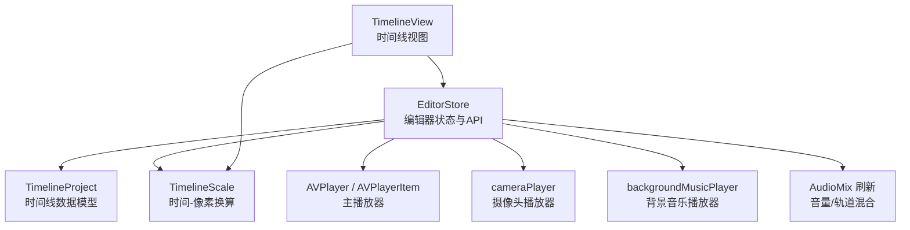
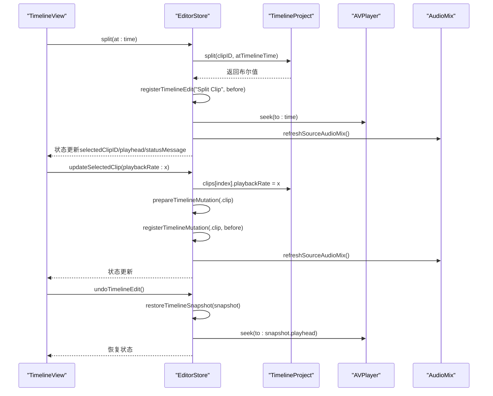
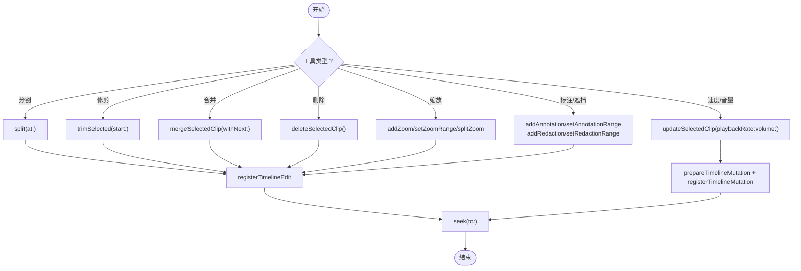
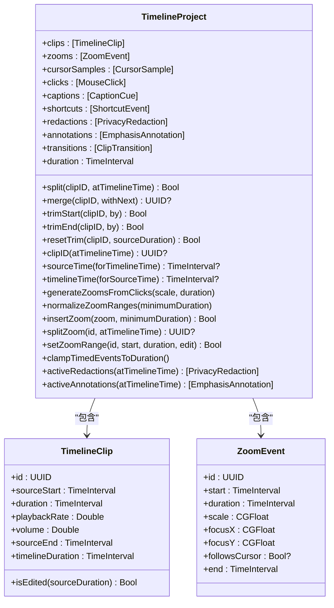
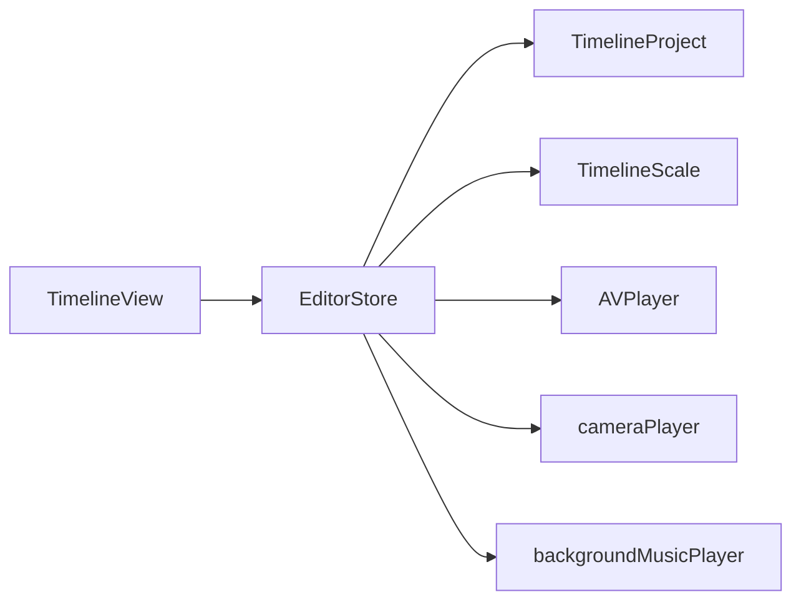

# 时间线操作 API

<cite>
**本文引用的文件**   
- [EditorStore.swift](file://Sources/ScreenFree/EditorStore.swift)
- [EditorModels.swift](file://Sources/ScreenFreeCore/EditorModels.swift)
- [TimelineScale.swift](file://Sources/ScreenFreeCore/TimelineScale.swift)
- [TimelineView.swift](file://Sources/ScreenFree/TimelineView.swift)
- [EditorStoreInteractionTests.swift](file://Tests/ScreenFreeMediaTests/EditorStoreInteractionTests.swift)
- [TimelineProjectTests.swift](file://Tests/ScreenFreeCoreTests/TimelineProjectTests.swift)
</cite>

## 目录
1. [简介](#简介)
2. [项目结构](#项目结构)
3. [核心组件](#核心组件)
4. [架构总览](#架构总览)
5. [详细组件分析](#详细组件分析)
6. [依赖关系分析](#依赖关系分析)
7. [性能考量](#性能考量)
8. [故障排查指南](#故障排查指南)
9. [结论](#结论)
10. [附录：API 速查与示例](#附录api-速查与示例)

## 简介
本文件面向“时间线操作 API”的开发者与使用者，系统化梳理 EditorStore 中的时间线编辑能力、TimelineProject 数据模型操作方法、撤销重做机制、选中状态管理、连续编辑模式、工具切换、时间线缩放、以及与 AVPlayer 播放同步和渲染更新。文档以循序渐进的方式组织内容，并配合图示帮助理解代码级实现与数据流。

## 项目结构
- EditorStore：时间线编辑的状态中心与对外 API，负责剪辑分割、修剪、合并、删除、转场、字幕、隐私遮挡、标注、缩放范围等；同时维护撤销/重做栈、连续编辑、播放同步、音频混音刷新等。
- TimelineProject：时间线数据模型（剪辑、缩放事件、鼠标点击、光标采样、字幕、快捷键、隐私遮挡、标注、转场），提供剪辑拆分/修剪/合并、时间映射、缩放归一化等操作。
- TimelineScale：时间线与像素坐标转换、自动跟随策略。
- TimelineView：SwiftUI 时间线视图，处理用户交互（拖拽、缩放、工具切换）、调用 EditorStore API。
- 测试用例：覆盖撤销/重做原子性、连续编辑聚合、裁剪重置等关键行为。

**图表来源** 
- [EditorStore.swift:31-3725](file://Sources/ScreenFree/EditorStore.swift#L31-L3725)
- [EditorModels.swift:274-1031](file://Sources/ScreenFreeCore/EditorModels.swift#L274-L1031)
- [TimelineScale.swift:1-115](file://Sources/ScreenFreeCore/TimelineScale.swift#L1-L115)
- [TimelineView.swift:1-800](file://Sources/ScreenFree/TimelineView.swift#L1-L800)

**章节来源**
- [EditorStore.swift:31-3725](file://Sources/ScreenFree/EditorStore.swift#L31-L3725)
- [EditorModels.swift:274-1031](file://Sources/ScreenFreeCore/EditorModels.swift#L274-L1031)
- [TimelineScale.swift:1-115](file://Sources/ScreenFreeCore/TimelineScale.swift#L1-L115)
- [TimelineView.swift:1-800](file://Sources/ScreenFree/TimelineView.swift#L1-L800)

## 核心组件
- EditorStore 关键属性
  - project: TimelineProject，当前时间线数据。
  - selectedClipID / selectedZoomID / selectedRedactionID / selectedAnnotationID：当前选中对象 ID。
  - activeTimelineTool：当前时间线工具（选择、分割、标注）。
  - timelineZoom：时间线缩放比例。
  - playhead：播放头位置（秒）。
  - isPlaying：是否正在播放。
  - hoveredTimelineBlock：悬停块目标（剪辑/缩放/隐私/标注）。
  - inspectorPanel：右侧检查面板类型。
  - backgroundMusicURL / backgroundMusicVolume：背景乐与音量。
  - sourceDuration / sourcePixelSize / sourceFrameRate：源媒体元信息。
  - audioAnalysis：音频分析结果（波形、RMS、峰值包络等）。
- EditorStore 关键方法（节选）
  - 分割/修剪/合并/删除：split(at:)、splitAtPlayhead()、trimSelected(start:)、mergeSelectedClip(withNext:)、deleteSelectedClip()。
  - 缩放范围：addZoom(start:duration:)、setZoomRange(id:start:duration:edit:)、splitZoom(id:at:)、updateSelectedZoom(...)。
  - 隐私遮挡/标注：addRedactionAtPlayhead()、setRedactionRange(...)、addAnnotation(...)、setAnnotationRange(...)。
  - 速度/音量：updateSelectedClip(playbackRate:volume:)、normalizeAllAudio()。
  - 转场：applyTransition(...), updateSelectedTransition(...), removeSelectedTransition(), previewTransition()。
  - 播放控制：seek(to:)、seekAndPlay(to:)、togglePlayback()、stepFrame(_:)。
  - 撤销/重做：undoTimelineEdit()、redoTimelineEdit()、clearTimelineHistory()。
  - 连续编辑：beginContinuousTimelineEdit(kind)、endContinuousTimelineEdit()。
  - 工具切换：toggleSplitTool()、cancelTimelineTool()、handleEscape()。
  - 时间线缩放：zoomTimeline(by:)、setTimelineZoom(zoom:)、fitTimeline()。
  - 音频混音刷新：refreshSourceAudioMix()。
  - 播放同步：installPlayerObserver()、updatePlayhead(fromSourceTime:)、playbackBoundaryAction(...)。

**章节来源**
- [EditorStore.swift:231-3725](file://Sources/ScreenFree/EditorStore.swift#L231-L3725)

## 架构总览
时间线编辑的核心流程由 UI 触发 EditorStore API，EditorStore 修改 TimelineProject 数据，并通过 AVPlayer 进行播放同步与预览。撤销/重做通过快照栈管理，连续编辑将多次变更聚合成一次原子操作。

**图表来源** 
- [EditorStore.swift:1835-1847](file://Sources/ScreenFree/EditorStore.swift#L1835-L1847)
- [EditorStore.swift:2093-2110](file://Sources/ScreenFree/EditorStore.swift#L2093-L2110)
- [EditorStore.swift:1644-1670](file://Sources/ScreenFree/EditorStore.swift#L1644-L1670)
- [EditorStore.swift:3163-3263](file://Sources/ScreenFree/EditorStore.swift#L3163-L3263)

## 详细组件分析

### EditorStore：时间线编辑 API
- 分割剪辑
  - split(at:)：根据时间线时间定位到对应剪辑并拆分，记录历史，移动播放头，更新选中剪辑。
  - splitAtPlayhead()：在播放头处分割。
- 修剪剪辑
  - trimSelected(start:)：按固定步长从开始或结束修剪，更新时长与时间线事件边界。
  - resetSelectedTrim()：恢复到可用源范围。
- 合并剪辑
  - mergeSelectedClip(withNext:)：仅当相邻且速度/音量一致时合并。
- 删除剪辑
  - deleteSelectedClip()：至少保留一个剪辑，删除后调整选中项与播放头。
- 缩放范围
  - addZoom(start:duration:)：插入缩放区间，避免重叠，默认焦点跟随光标。
  - setZoomRange(id:start:duration:edit:)：支持移动、调整前/后端。
  - splitZoom(id:at:)：在范围内拆分。
  - updateSelectedZoom(...)：调整缩放倍率、时长、是否跟随光标。
- 隐私遮挡与标注
  - addRedactionAtPlayhead()/addSpotlightAtPlayhead()：添加隐私遮挡或聚光灯。
  - setRedactionRange(...)、moveSelectedRedaction(...)：调整范围与位置。
  - addAnnotation(...)、setAnnotationRange(...)：绘制强调标注。
- 速度与音量
  - updateSelectedClip(playbackRate:volume:)：支持连续编辑聚合。
  - normalizeAllAudio()：基于 RMS 推荐增益统一音量。
- 转场
  - applyTransition(...), updateSelectedTransition(...), removeSelectedTransition(), previewTransition()。
- 播放与同步
  - seek(to:)、seekAndPlay(to:)、togglePlayback()、stepFrame(_)。
  - installPlayerObserver()：周期性回调更新播放头。
  - updatePlayhead(fromSourceTime:)：计算当前/下一剪辑，处理边界跳转与速率切换。
  - playbackBoundaryAction(...)：判断是否无缝继续或重新 seek。
- 撤销/重做与连续编辑
  - beginContinuousTimelineEdit(kind)/endContinuousTimelineEdit()：将多次变更聚合成一次撤销单元。
  - undoTimelineEdit()/redoTimelineEdit()：快照恢复，清理 redo 栈。
  - clearTimelineHistory()：清空历史。
- 工具切换与缩放
  - toggleSplitTool()/cancelTimelineTool()/handleEscape()。
  - zoomTimeline(by:)/setTimelineZoom(zoom:)/fitTimeline()。

**图表来源** 
- [EditorStore.swift:1835-1972](file://Sources/ScreenFree/EditorStore.swift#L1835-L1972)
- [EditorStore.swift:2169-2339](file://Sources/ScreenFree/EditorStore.swift#L2169-L2339)
- [EditorStore.swift:2480-2575](file://Sources/ScreenFree/EditorStore.swift#L2480-L2575)
- [EditorStore.swift:2093-2126](file://Sources/ScreenFree/EditorStore.swift#L2093-L2126)
- [EditorStore.swift:1644-1754](file://Sources/ScreenFree/EditorStore.swift#L1644-L1754)

**章节来源**
- [EditorStore.swift:1600-2399](file://Sources/ScreenFree/EditorStore.swift#L1600-L2399)
- [EditorStore.swift:2400-3199](file://Sources/ScreenFree/EditorStore.swift#L2400-L3199)
- [EditorStore.swift:3200-3725](file://Sources/ScreenFree/EditorStore.swift#L3200-L3725)

### TimelineProject：数据模型与操作
- 数据结构
  - clips: [TimelineClip]，每个剪辑包含 sourceStart、duration、playbackRate、volume。
  - zooms: [ZoomEvent]，start/duration/scale/focusX/Y/followsCursor。
  - cursorSamples/clicks/captions/shortcuts/redactions/annotations/transitions。
- 关键方法
  - split(clipID:atTimelineTime:)：按时间线时间拆分剪辑。
  - trimStart/trimEnd/resetTrim：修剪与重置。
  - merge(clipID:withNext:)：相邻且速度/音量一致的合并。
  - clipID(atTimelineTime:)：时间线时间到剪辑 ID 映射。
  - sourceTime(forTimelineTime:)/timelineTime(forSourceTime:)：双向时间映射。
  - generateZoomsFromClicks()：基于点击自动生成缩放。
  - normalizeZoomRanges()/insertZoom()/splitZoom()/setZoomRange()：缩放范围管理与校验。
  - clampTimedEventsToDuration()：裁剪越界的时间事件。
  - activeRedactions(activeAnnotations)：查询当前激活的遮挡/标注。

**图表来源** 
- [EditorModels.swift:274-1031](file://Sources/ScreenFreeCore/EditorModels.swift#L274-L1031)

**章节来源**
- [EditorModels.swift:274-1031](file://Sources/ScreenFreeCore/EditorModels.swift#L274-L1031)

### TimelineScale：时间-像素换算与自动跟随
- contentWidth(viewportWidth:)：根据缩放计算内容宽度。
- x(forTime:duration:contentWidth:)/time(atX:duration:contentWidth:)：时间与像素互转。
- timeDelta(forPointDistance:duration:contentWidth:)：像素距离转时间差。
- TimelinePlaybackFollowPolicy.resolve(...)：播放时自动滚动跟随策略。

**章节来源**
- [TimelineScale.swift:1-115](file://Sources/ScreenFreeCore/TimelineScale.swift#L1-L115)

### TimelineView：交互与调用
- 拖拽与点击：拖动设置播放头，点击播放。
- 捏合缩放：调节 timelineZoom。
- 工具切换：进入分割模式，显示十字光标。
- 上下文菜单：设置速度/音量、删除、分割、合并、重置修剪。
- 缩放轨道：创建/编辑缩放范围，调用 store.addZoom/setZoomRange/splitZoom。
- 过渡标记：点击应用转场或拖放样式。

**章节来源**
- [TimelineView.swift:1-800](file://Sources/ScreenFree/TimelineView.swift#L1-L800)

## 依赖关系分析
- EditorStore 依赖 TimelineProject 进行数据层操作，依赖 TimelineScale 进行 UI 换算，依赖 AVPlayer 系列进行播放同步。
- TimelineView 依赖 EditorStore 暴露的 API，不直接操作 TimelineProject。
- 撤销/重做依赖内部快照栈，连续编辑依赖 ActiveTimelineContinuousEdit 聚合。

**图表来源** 
- [EditorStore.swift:31-3725](file://Sources/ScreenFree/EditorStore.swift#L31-L3725)
- [TimelineView.swift:1-800](file://Sources/ScreenFree/TimelineView.swift#L1-L800)

**章节来源**
- [EditorStore.swift:31-3725](file://Sources/ScreenFree/EditorStore.swift#L31-L3725)
- [TimelineView.swift:1-800](file://Sources/ScreenFree/TimelineView.swift#L1-L800)

## 性能考量
- 播放头更新使用周期观察者（约 30fps），避免频繁 UI 刷新。
- 音频混音刷新采用异步任务与生成号去抖，防止竞态。
- 撤销栈上限 100，避免内存膨胀。
- 时间线缩放最大 64x，保证长时间素材仍可流畅浏览。
- 自动跟随策略减少播放时的滚动抖动。

[本节为通用指导，无需具体文件引用]

## 故障排查指南
- 无法分割：确保点击位于剪辑内部（距两端至少 0.05s）。
- 无法合并：相邻剪辑必须速度/音量一致且源端点连续。
- 撤销无效：确认未处于连续编辑中，或先 endContinuousTimelineEdit()。
- 播放不同步：检查 clipContext 与 playbackBoundaryAction 逻辑，确认 seek 参数与 rate 设置。
- 音频无变化：确认 refreshSourceAudioMix() 被调用且 track 存在。

**章节来源**
- [EditorStore.swift:1835-1972](file://Sources/ScreenFree/EditorStore.swift#L1835-L1972)
- [EditorStore.swift:3163-3263](file://Sources/ScreenFree/EditorStore.swift#L3163-L3263)

## 结论
EditorStore 提供了完整的时间线编辑 API，结合 TimelineProject 的数据模型与 TimelineScale 的换算能力，实现了剪辑分割、修剪、合并、删除、缩放范围、隐私遮挡、标注、转场、字幕、快捷键等丰富功能。撤销/重做与连续编辑保证了操作的原子性与用户体验。与 AVPlayer 的同步机制确保了播放与时间线的精确一致。

[本节为总结，无需具体文件引用]

## 附录：API 速查与示例

### 常用 API 列表（路径参考）
- 分割
  - split(at:) [EditorStore.swift:1835-1847]
  - splitAtPlayhead() [EditorStore.swift:1849-1851]
- 修剪
  - trimSelected(start:) [EditorStore.swift:1960-1972]
  - resetSelectedTrim() [EditorStore.swift:2076-2091]
- 合并
  - mergeSelectedClip(withNext:) [EditorStore.swift:1941-1958]
- 删除
  - deleteSelectedClip() [EditorStore.swift:1853-1876]
- 缩放范围
  - addZoom(start:duration:) [EditorStore.swift:2169-2204]
  - setZoomRange(id:start:duration:edit:) [EditorStore.swift:2282-2297]
  - splitZoom(id:at:) [EditorStore.swift:2299-2316]
  - updateSelectedZoom(...) [EditorStore.swift:2223-2253]
- 隐私遮挡/标注
  - addRedactionAtPlayhead()/addSpotlightAtPlayhead() [EditorStore.swift:2341-2376]
  - setRedactionRange(...) [EditorStore.swift:2384-2397]
  - addAnnotation(...) [EditorStore.swift:2489-2521]
  - setAnnotationRange(...) [EditorStore.swift:2548-2561]
- 速度与音量
  - updateSelectedClip(playbackRate:volume:) [EditorStore.swift:2093-2110]
  - normalizeAllAudio() [EditorStore.swift:2112-2126]
- 转场
  - applyTransition(...), updateSelectedTransition(...), removeSelectedTransition(), previewTransition() [EditorStore.swift:1976-2055]
- 播放
  - seek(to:)/seekAndPlay(to:)/togglePlayback()/stepFrame(_) [EditorStore.swift:1556-1591][EditorStore.swift:1511-1542]
- 撤销/重做
  - undoTimelineEdit()/redoTimelineEdit()/clearTimelineHistory() [EditorStore.swift:1644-1677]
- 连续编辑
  - beginContinuousTimelineEdit(kind)/endContinuousTimelineEdit() [EditorStore.swift:1623-1642]
- 工具与缩放
  - toggleSplitTool()/cancelTimelineTool()/handleEscape() [EditorStore.swift:1593-1613]
  - zoomTimeline(by:)/setTimelineZoom(zoom:)/fitTimeline() [EditorStore.swift:1544-1554]

### 示例场景（步骤说明）
- 分割剪辑并在播放头处继续编辑
  1) 调用 split(at: playhead) 完成分割。
  2) 调用 updateSelectedClip(playbackRate: 1.5) 调整速度。
  3) 如需撤销，调用 undoTimelineEdit()。
- 添加缩放范围并调整焦点
  1) addZoom(start: playhead, duration: 3.0)。
  2) setZoomRange(id: zoom.id, start: ..., duration: ..., edit: .resizeTrailing)。
  3) moveSelectedZoomFocus(x: 0.5, y: 0.5) 调整焦点。
- 智能静音修剪
  1) smartTrimSilence() 自动去除首尾静音片段。
- 应用转场
  1) applyTransition(style, toJunction: junction)。
  2) previewTransition() 预览效果。

[本节为操作指引，无需具体文件引用]