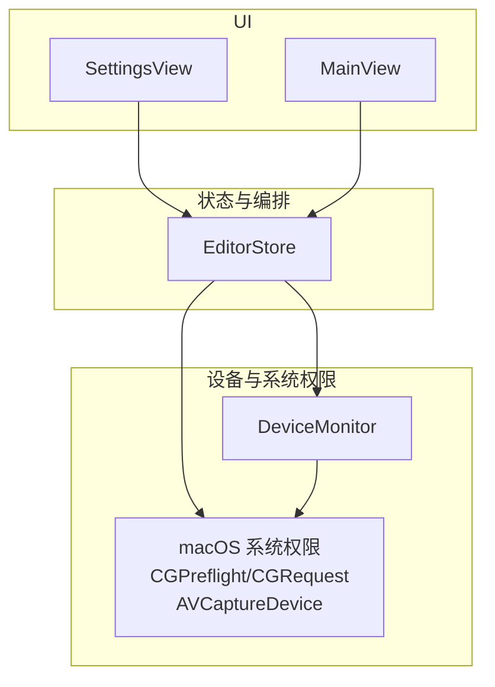
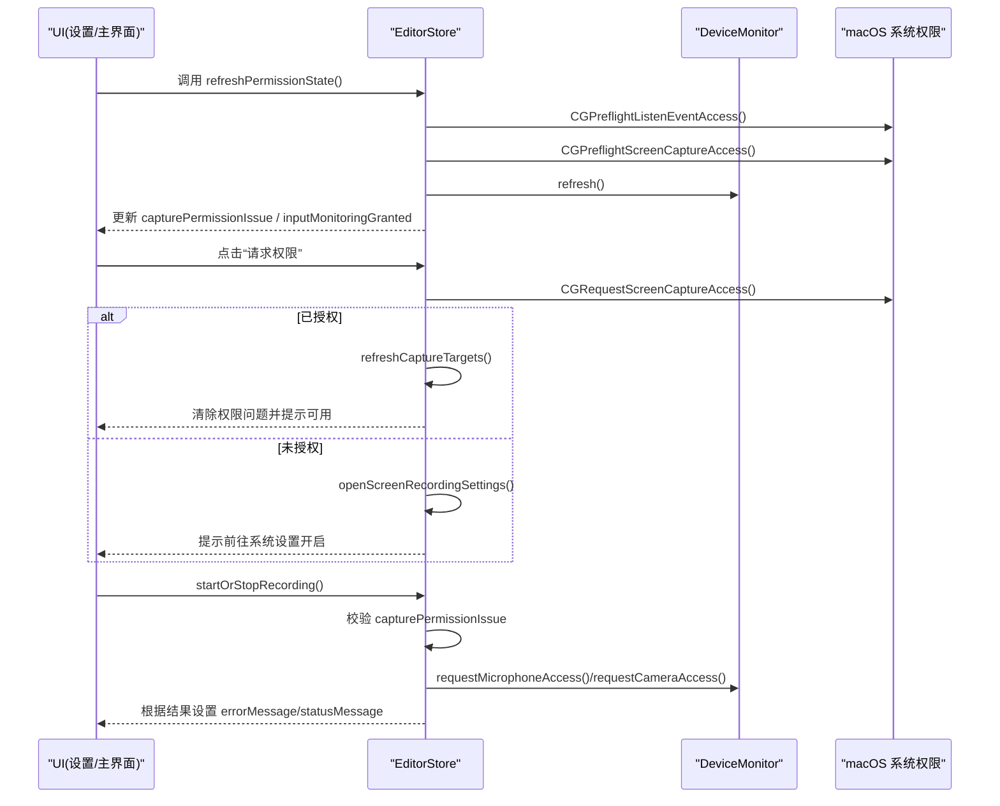
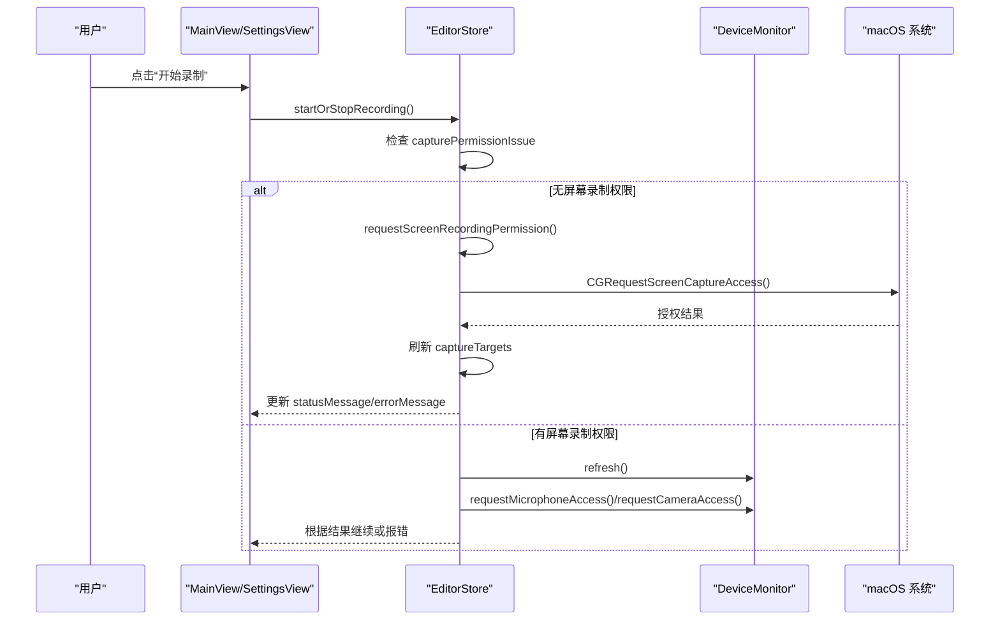
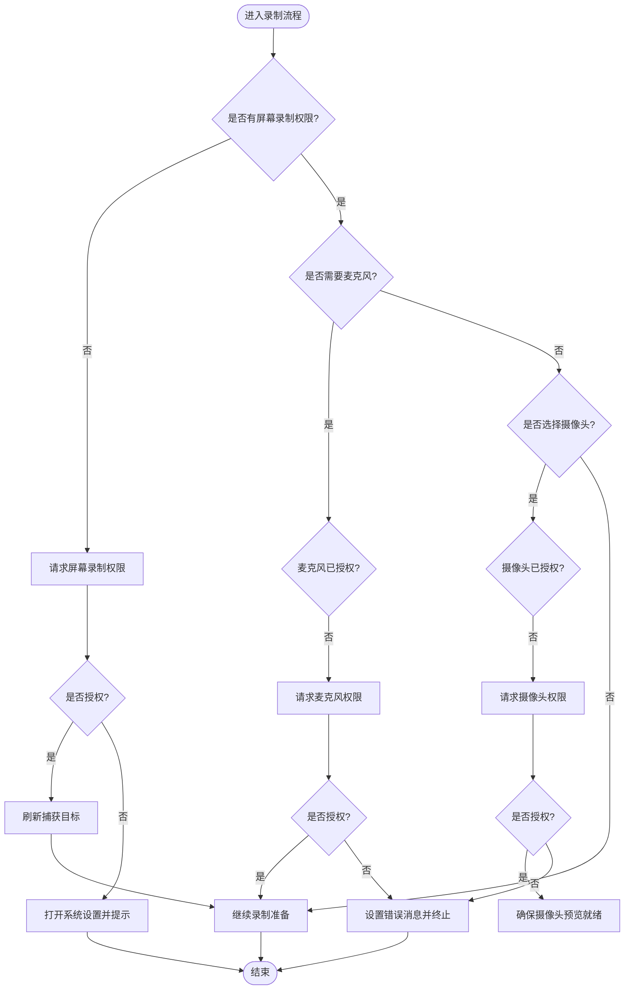
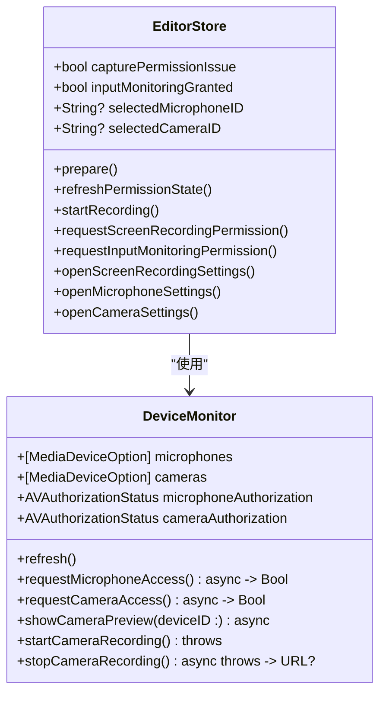

# 设备权限管理 API

<cite>
**本文引用的文件**   
- [EditorStore.swift](file://Sources/ScreenFree/EditorStore.swift)
- [DeviceMonitor.swift](file://Sources/ScreenFree/DeviceMonitor.swift)
- [SettingsView.swift](file://Sources/ScreenFree/SettingsView.swift)
- [MainView.swift](file://Sources/ScreenFree/MainView.swift)
</cite>

## 目录
1. [简介](#简介)
2. [项目结构](#项目结构)
3. [核心组件](#核心组件)
4. [架构总览](#架构总览)
5. [详细组件分析](#详细组件分析)
6. [依赖关系分析](#依赖关系分析)
7. [性能与可用性考虑](#性能与可用性考虑)
8. [故障排查指南](#故障排查指南)
9. [结论](#结论)

## 简介
本文件面向 ScreenFree 的“设备权限管理”能力，聚焦 EditorStore 中与权限相关的属性与方法，以及 DeviceMonitor 对麦克风、摄像头等设备的授权状态管理与请求流程。文档涵盖：
- 权限状态属性：capturePermissionIssue、inputMonitoringGranted、selectedMicrophoneID、selectedCameraID 等
- 权限检查与请求方法：refreshPermissionState()、requestScreenRecordingPermission()、deviceMonitor.requestMicrophoneAccess()、deviceMonitor.requestCameraAccess()
- 不同设备权限类型（屏幕录制、麦克风、摄像头）及授权状态管理
- 权限状态变化时的 UI 更新机制、错误提示显示、用户引导流程
- 设备枚举与选择功能的实现方式
- 具体使用示例（以代码片段路径形式引用）

## 项目结构
与设备权限管理直接相关的核心文件：
- EditorStore.swift：应用状态中心，负责权限状态、设备选择、启动录制前的权限校验与引导
- DeviceMonitor.swift：设备枚举、授权状态查询、麦克风/摄像头访问请求与预览/录制控制
- SettingsView.swift：设置界面展示各权限状态并提供刷新入口
- MainView.swift：主界面在缺少权限时提供“请求权限”和“打开设置”按钮

图表来源
- [EditorStore.swift:450-460](file://Sources/ScreenFree/EditorStore.swift#L450-L460)
- [DeviceMonitor.swift:69-112](file://Sources/ScreenFree/DeviceMonitor.swift#L69-L112)
- [SettingsView.swift:26-45](file://Sources/ScreenFree/SettingsView.swift#L26-L45)
- [MainView.swift:1491-1504](file://Sources/ScreenFree/MainView.swift#L1491-L1504)

章节来源
- [EditorStore.swift:450-460](file://Sources/ScreenFree/EditorStore.swift#L450-L460)
- [DeviceMonitor.swift:69-112](file://Sources/ScreenFree/DeviceMonitor.swift#L69-L112)
- [SettingsView.swift:26-45](file://Sources/ScreenFree/SettingsView.swift#L26-L45)
- [MainView.swift:1491-1504](file://Sources/ScreenFree/MainView.swift#L1491-L1504)

## 核心组件
- EditorStore：集中管理所有与录制相关的状态，包括权限问题标志、输入监控授权、选中的麦克风和摄像头 ID、录制准备与执行流程、错误消息与状态提示等
- DeviceMonitor：封装 AVFoundation 的设备发现、授权状态查询与请求、麦克风音量监测、摄像头预览与录制会话管理

章节来源
- [EditorStore.swift:129-236](file://Sources/ScreenFree/EditorStore.swift#L129-L236)
- [DeviceMonitor.swift:44-112](file://Sources/ScreenFree/DeviceMonitor.swift#L44-L112)

## 架构总览
权限管理的整体流程由 EditorStore 驱动，结合 DeviceMonitor 完成设备枚举与授权请求，并通过 SwiftUI 视图进行状态展示与用户引导。

图表来源
- [EditorStore.swift:450-460](file://Sources/ScreenFree/EditorStore.swift#L450-L460)
- [EditorStore.swift:1432-1443](file://Sources/ScreenFree/EditorStore.swift#L1432-L1443)
- [DeviceMonitor.swift:102-112](file://Sources/ScreenFree/DeviceMonitor.swift#L102-L112)
- [MainView.swift:1491-1504](file://Sources/ScreenFree/MainView.swift#L1491-L1504)

## 详细组件分析

### EditorStore 中的权限相关属性与方法
- 权限状态属性
  - capturePermissionIssue：布尔值，表示是否存在屏幕录制权限问题
  - inputMonitoringGranted：布尔值，表示是否已获得输入监控权限（用于自动点击缩放等功能）
  - selectedMicrophoneID：可选字符串，当前选择的麦克风设备 ID
  - selectedCameraID：可选字符串，当前选择的摄像头设备 ID
  - statusMessage、errorMessage：用于向 UI 反馈当前状态或错误信息
- 关键方法
  - prepare()：应用初始化后调用，恢复桌面图标、安装播放器观察者、刷新录制历史、刷新权限状态与音频应用列表，并默认选中麦克风
  - refreshPermissionState()：检查输入监控与屏幕录制权限，刷新设备列表，设置 capturePermissionIssue 与状态提示
  - refreshCaptureTargets()：获取可用的捕获目标（显示器/窗口/区域），失败时标记权限问题
  - startRecording(microphoneSelectionConfirmed:)：启动录制前校验权限与设备，必要时弹出麦克风选择或请求权限；若摄像头被选中则确保预览就绪
  - requestScreenRecordingPermission()：请求屏幕录制权限，成功则刷新目标，失败则引导至系统设置
  - requestInputMonitoringPermission()：请求输入监控权限，并根据结果给出提示或跳转设置
  - openScreenRecordingSettings()/openMicrophoneSettings()/openCameraSettings()：打开对应隐私设置页面
  - openPrivacySettings(anchor:)：通用隐私设置跳转实现

章节来源
- [EditorStore.swift:129-236](file://Sources/ScreenFree/EditorStore.swift#L129-L236)
- [EditorStore.swift:438-460](file://Sources/ScreenFree/EditorStore.swift#L438-L460)
- [EditorStore.swift:466-500](file://Sources/ScreenFree/EditorStore.swift#L466-L500)
- [EditorStore.swift:512-570](file://Sources/ScreenFree/EditorStore.swift#L512-L570)
- [EditorStore.swift:1406-1443](file://Sources/ScreenFree/EditorStore.swift#L1406-L1443)
- [EditorStore.swift:3816-3823](file://Sources/ScreenFree/EditorStore.swift#L3816-L3823)

### DeviceMonitor 中的设备与权限管理
- 设备枚举
  - microphones：麦克风设备列表（包含 id、name、isDefault）
  - cameras：摄像头设备列表（包含 id、name、isDefault）
  - refresh()：刷新设备列表与授权状态（麦克风/摄像头）
- 授权状态与请求
  - microphoneAuthorization/cameraAuthorization：AVAuthorizationStatus
  - requestMicrophoneAccess()：请求麦克风权限并刷新状态
  - requestCameraAccess()：请求摄像头权限并刷新状态
- 麦克风监测
  - startMicrophoneMeter()/stopMicrophoneMeter()：启动/停止麦克风音量监测，计算 RMS 与峰值
  - isMonitoringMicrophone/microphoneLevel/peakLevel：监测状态与音量指标
- 摄像头预览与录制
  - showCameraPreview(deviceID:)：配置 AVCaptureSession 并启动预览
  - stopCameraPreview()：停止预览并清理输入输出
  - startCameraRecording()/stopCameraRecording()：开始/停止摄像头录制，返回临时文件 URL

章节来源
- [DeviceMonitor.swift:44-112](file://Sources/ScreenFree/DeviceMonitor.swift#L44-L112)
- [DeviceMonitor.swift:127-186](file://Sources/ScreenFree/DeviceMonitor.swift#L127-L186)
- [DeviceMonitor.swift:188-250](file://Sources/ScreenFree/DeviceMonitor.swift#L188-L250)
- [DeviceMonitor.swift:252-284](file://Sources/ScreenFree/DeviceMonitor.swift#L252-L284)

### 权限类型与授权状态管理
- 屏幕录制权限（CGPreflight/CGRequest）
  - 检查：CGPreflightScreenCaptureAccess()
  - 请求：CGRequestScreenCaptureAccess()
  - 影响：capturePermissionIssue 与 captureTargets 刷新
- 输入监控权限（CGPreflight/CGRequest）
  - 检查：CGPreflightListenEventAccess()
  - 请求：CGRequestListenEventAccess()
  - 影响：inputMonitoringGranted 与自动点击缩放功能可用性
- 麦克风权限（AVCaptureDevice）
  - 检查：AVCaptureDevice.authorizationStatus(for: .audio)
  - 请求：AVCaptureDevice.requestAccess(for: .audio)
  - 影响：microphoneAuthorization 与录音流程
- 摄像头权限（AVCaptureDevice）
  - 检查：AVCaptureDevice.authorizationStatus(for: .video)
  - 请求：AVCaptureDevice.requestAccess(for: .video)
  - 影响：cameraAuthorization 与摄像头预览/录制流程

章节来源
- [EditorStore.swift:450-460](file://Sources/ScreenFree/EditorStore.swift#L450-L460)
- [EditorStore.swift:1422-1443](file://Sources/ScreenFree/EditorStore.swift#L1422-L1443)
- [DeviceMonitor.swift:69-112](file://Sources/ScreenFree/DeviceMonitor.swift#L69-L112)

### 设备枚举与选择流程
- 麦克风选择
  - 通过 deviceMonitor.refresh() 获取设备列表
  - 若存在多个麦克风且未确认选择，则弹出选择界面（isMicrophoneSelectionPresented）
  - 默认选择 isDefault 的麦克风，否则选择第一个可用设备
- 摄像头选择
  - 通过 deviceMonitor.refresh() 获取设备列表
  - 若 selectedCameraID 存在，则在录制前确保预览就绪（showCameraPreview）
  - 若预览设备不匹配或不可用，设置错误提示

章节来源
- [EditorStore.swift:521-570](file://Sources/ScreenFree/EditorStore.swift#L521-L570)
- [DeviceMonitor.swift:69-100](file://Sources/ScreenFree/DeviceMonitor.swift#L69-L100)

### UI 更新机制与用户引导
- 设置界面（SettingsView）
  - 显示“屏幕访问”“麦克风”“摄像头”三项权限状态，使用绿色/橙色标签区分
  - “刷新来源”按钮触发 store.refreshPermissionState()
- 主界面（MainView）
  - 当 capturePermissionIssue 为真时，显示“请求权限”和“打开设置”按钮
  - 点击“请求权限”调用 store.requestScreenRecordingPermission()
  - 点击“打开设置”调用 store.openScreenRecordingSettings()
- 状态与错误提示
  - statusMessage：用于提示当前操作状态（如“正在请求屏幕录制权限…”、“权限已授予，请选择源并开始录制。”）
  - errorMessage：用于提示错误（如“启用麦克风录制需要 macOS 15 或更高版本”、“未检测到麦克风”、“摄像头权限不足”等）

章节来源
- [SettingsView.swift:26-45](file://Sources/ScreenFree/SettingsView.swift#L26-L45)
- [MainView.swift:1491-1504](file://Sources/ScreenFree/MainView.swift#L1491-L1504)
- [EditorStore.swift:1432-1443](file://Sources/ScreenFree/EditorStore.swift#L1432-L1443)

### 权限检查与请求的典型流程（序列图）

图表来源
- [EditorStore.swift:512-570](file://Sources/ScreenFree/EditorStore.swift#L512-L570)
- [EditorStore.swift:1432-1443](file://Sources/ScreenFree/EditorStore.swift#L1432-L1443)
- [DeviceMonitor.swift:102-112](file://Sources/ScreenFree/DeviceMonitor.swift#L102-L112)

### 权限拒绝处理与用户引导（流程图）

图表来源
- [EditorStore.swift:512-570](file://Sources/ScreenFree/EditorStore.swift#L512-L570)
- [EditorStore.swift:1432-1443](file://Sources/ScreenFree/EditorStore.swift#L1432-L1443)
- [DeviceMonitor.swift:102-112](file://Sources/ScreenFree/DeviceMonitor.swift#L102-L112)

## 依赖关系分析
- EditorStore 依赖 DeviceMonitor 进行设备枚举与权限请求
- EditorStore 通过 CGPreflight/CGRequest 与 macOS 系统交互，完成屏幕录制与输入监控权限的检查与请求
- DeviceMonitor 通过 AVFoundation 的 AVCaptureDevice 完成麦克风与摄像头的权限检查与请求
- UI 层（SettingsView、MainView）通过 @Published 属性与 EditorStore 双向绑定，实时反映权限状态与提示信息

图表来源
- [EditorStore.swift:129-236](file://Sources/ScreenFree/EditorStore.swift#L129-L236)
- [DeviceMonitor.swift:44-112](file://Sources/ScreenFree/DeviceMonitor.swift#L44-L112)

章节来源
- [EditorStore.swift:129-236](file://Sources/ScreenFree/EditorStore.swift#L129-L236)
- [DeviceMonitor.swift:44-112](file://Sources/ScreenFree/DeviceMonitor.swift#L44-L112)

## 性能与可用性考虑
- 权限检查与设备枚举应在后台异步执行，避免阻塞 UI
- 麦克风音量监测使用低采样缓冲与平滑滤波，减少 CPU 占用
- 摄像头预览与录制使用独立的 AVCaptureSession，避免与系统其他媒体会话冲突
- 权限请求失败时应立即反馈给用户，并提供直达系统设置的快捷入口

## 故障排查指南
- 屏幕录制权限缺失
  - 现象：capturePermissionIssue 为真，无法列出捕获目标
  - 处理：调用 requestScreenRecordingPermission()，若失败则打开系统设置 Privacy_ScreenCapture
- 麦克风权限缺失
  - 现象：microphoneAuthorization 非 authorized，无法录音
  - 处理：调用 deviceMonitor.requestMicrophoneAccess()，失败则提示用户并在设置中开启
- 摄像头权限缺失
  - 现象：cameraAuthorization 非 authorized，无法预览或录制摄像头
  - 处理：调用 deviceMonitor.requestCameraAccess()，失败则提示用户并在设置中开启
- 输入监控权限缺失
  - 现象：inputMonitoringGranted 为假，自动点击缩放不可用
  - 处理：调用 requestInputMonitoringPermission()，失败则打开 Privacy_ListenEvent

章节来源
- [EditorStore.swift:1406-1443](file://Sources/ScreenFree/EditorStore.swift#L1406-L1443)
- [DeviceMonitor.swift:102-112](file://Sources/ScreenFree/DeviceMonitor.swift#L102-L112)

## 结论
ScreenFree 的设备权限管理以 EditorStore 为核心，结合 DeviceMonitor 完成设备枚举与授权请求，并通过 SwiftUI 视图提供直观的状态展示与用户引导。该设计清晰分离了权限检查、设备管理与 UI 展示，便于扩展与维护。实际使用中应严格遵循权限检查与请求流程，确保用户体验与系统安全。