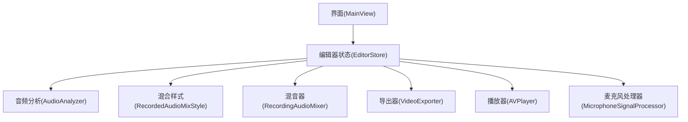
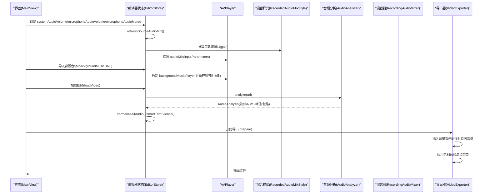
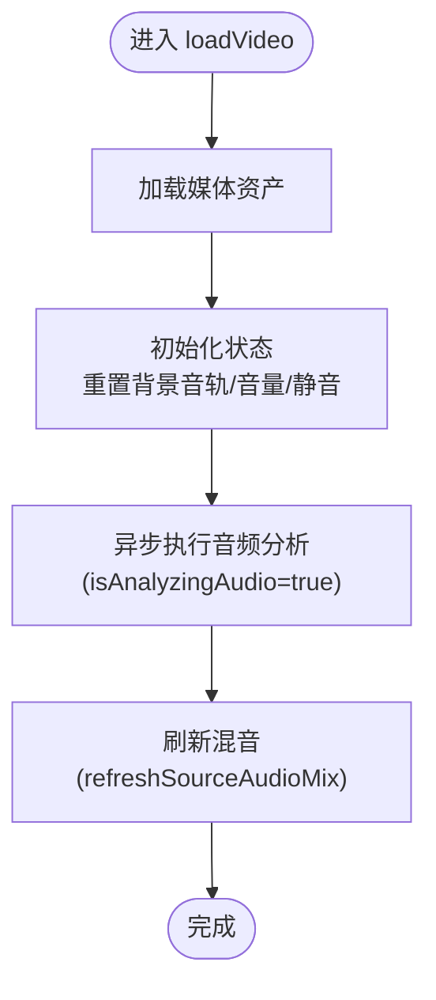
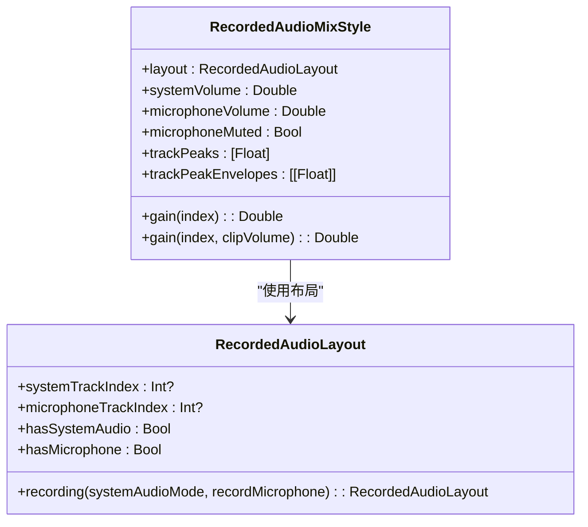
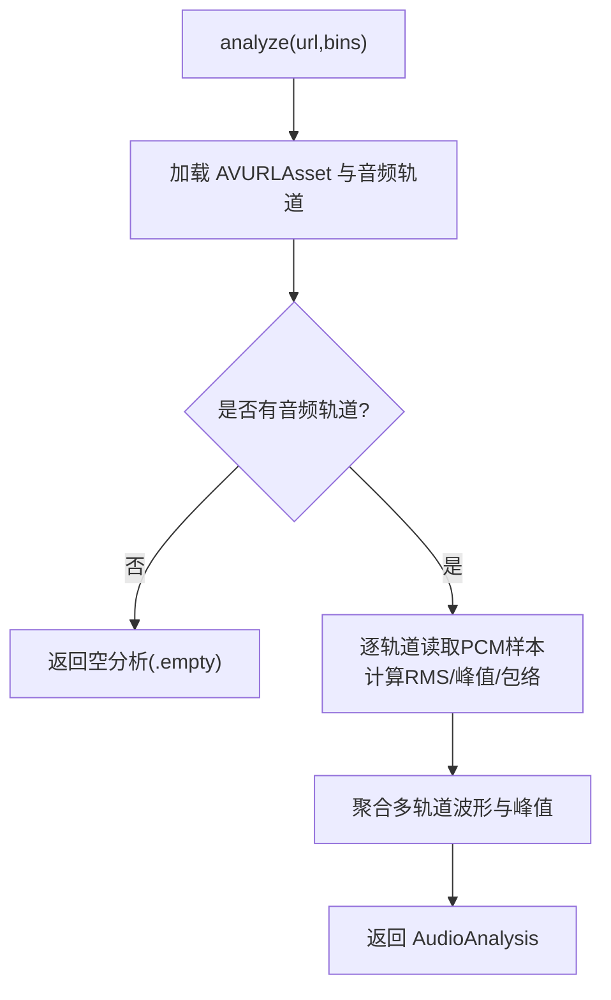
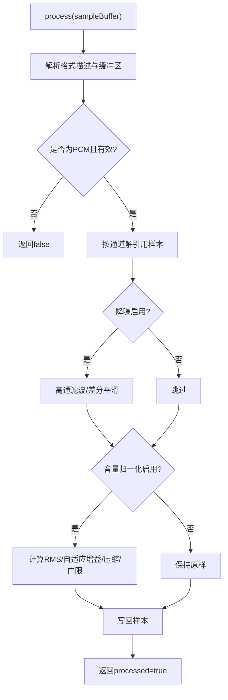
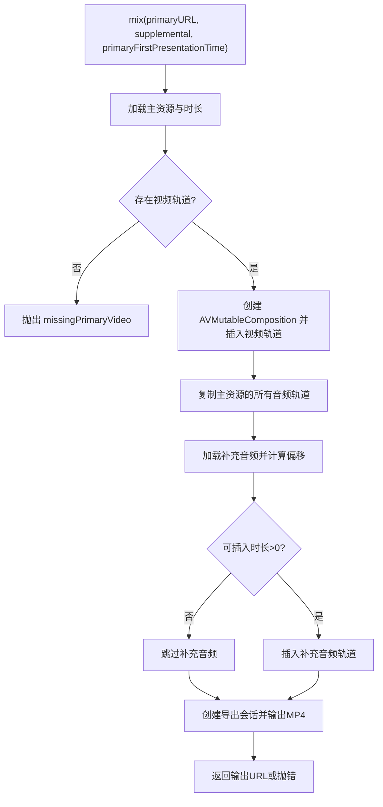
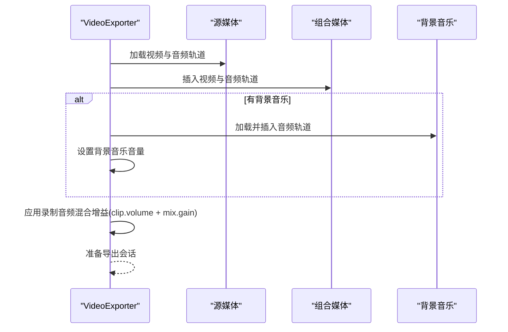
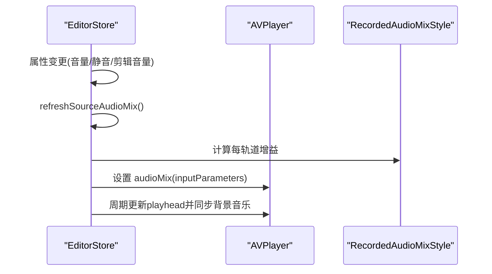
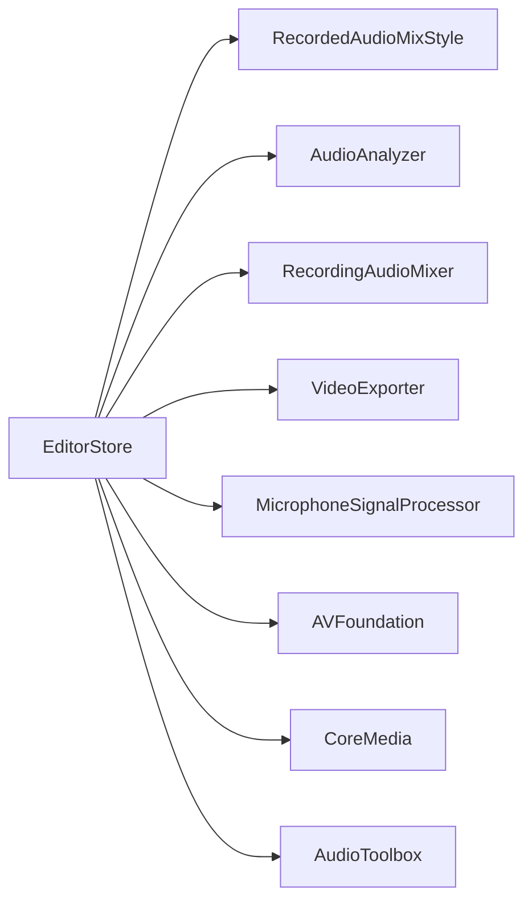

# 音频管理 API

<cite>
**本文引用的文件**   
- [EditorStore.swift](file://Sources/ScreenFree/EditorStore.swift)
- [RecordingAudioMixer.swift](file://Sources/ScreenFree/RecordingAudioMixer.swift)
- [AudioAnalyzer.swift](file://Sources/ScreenFree/AudioAnalyzer.swift)
- [MicrophoneSignalProcessor.swift](file://Sources/ScreenFree/MicrophoneSignalProcessor.swift)
- [RecordedAudioLayout.swift](file://Sources/ScreenFree/RecordedAudioLayout.swift)
- [VideoExporter.swift](file://Sources/ScreenFree/VideoExporter.swift)
- [MainView.swift](file://Sources/ScreenFree/MainView.swift)
</cite>

## 目录
1. [简介](#简介)
2. [项目结构](#项目结构)
3. [核心组件](#核心组件)
4. [架构总览](#架构总览)
5. [详细组件分析](#详细组件分析)
6. [依赖关系分析](#依赖关系分析)
7. [性能考量](#性能考量)
8. [故障排查指南](#故障排查指南)
9. [结论](#结论)
10. [附录：使用示例与最佳实践](#附录使用示例与最佳实践)

## 简介
本文件面向“音频管理 API”，聚焦 EditorStore 中与音频相关的属性与方法，系统与应用音频的区别、麦克风降噪与音量归一化、背景音轨管理、音频分析与实时预览更新机制，以及导出时的混音处理。文档以循序渐进的方式解释各模块职责、数据流与交互流程，并给出可操作的示例路径，帮助开发者快速集成与调试。

## 项目结构
围绕音频管理的核心代码分布在以下文件中：
- EditorStore：编辑器状态中心，暴露音频控制属性（系统音量、麦克风音量/静音、背景音乐音量）、触发音频分析、维护播放与混音刷新。
- RecordedAudioLayout：记录录制时系统/麦克风的轨道布局，计算混合增益策略。
- AudioAnalyzer：对媒体进行波形、RMS、峰值与包络分析，用于智能修剪与自动增益建议。
- MicrophoneSignalProcessor：实时麦克风信号增强（降噪、自动增益、压缩、门限）。
- RecordingAudioMixer：将主视频与补充音频（如应用音频）混入输出。
- VideoExporter：导出阶段构建组合媒体，注入背景音乐与源音频的音量参数。
- MainView：UI 层提供背景音乐的导入、替换、移除与音量滑块。

图表来源
- [EditorStore.swift:266-291](file://Sources/ScreenFree/EditorStore.swift#L266-L291)
- [RecordedAudioLayout.swift:52-81](file://Sources/ScreenFree/RecordedAudioLayout.swift#L52-L81)
- [AudioAnalyzer.swift:110-192](file://Sources/ScreenFree/AudioAnalyzer.swift#L110-L192)
- [RecordingAudioMixer.swift:29-136](file://Sources/ScreenFree/RecordingAudioMixer.swift#L29-L136)
- [VideoExporter.swift:103-200](file://Sources/ScreenFree/VideoExporter.swift#L103-L200)
- [MicrophoneSignalProcessor.swift:78-106](file://Sources/ScreenFree/MicrophoneSignalProcessor.swift#L78-L106)
- [MainView.swift:2728-2766](file://Sources/ScreenFree/MainView.swift#L2728-L2766)

章节来源
- [EditorStore.swift:266-291](file://Sources/ScreenFree/EditorStore.swift#L266-L291)
- [RecordedAudioLayout.swift:1-50](file://Sources/ScreenFree/RecordedAudioLayout.swift#L1-L50)
- [AudioAnalyzer.swift:1-45](file://Sources/ScreenFree/AudioAnalyzer.swift#L1-L45)
- [RecordingAudioMixer.swift:1-28](file://Sources/ScreenFree/RecordingAudioMixer.swift#L1-L28)
- [VideoExporter.swift:1-33](file://Sources/ScreenFree/VideoExporter.swift#L1-L33)
- [MicrophoneSignalProcessor.swift:1-77](file://Sources/ScreenFree/MicrophoneSignalProcessor.swift#L1-L77)
- [MainView.swift:2728-2766](file://Sources/ScreenFree/MainView.swift#L2728-L2766)

## 核心组件
- EditorStore
  - 音频控制属性：systemAudioVolume、microphoneAudioVolume、microphoneAudioMuted、backgroundMusicVolume。
  - 音频分析：audioAnalysis、isAnalyzingAudio。
  - 播放与混音：refreshSourceAudioMix() 动态为 AVPlayer 设置 AVMutableAudioMix，按剪辑与轨道角色计算增益。
  - 背景音轨：importBackgroundMusic()/removeBackgroundMusic()，配合 backgroundMusicPlayer 循环对齐时间轴。
- RecordedAudioLayout / RecordedAudioMixStyle
  - 定义系统/麦克风轨道索引与混合策略，考虑同时峰值避免削波，支持静音与音量限制。
- AudioAnalyzer
  - 生成波形、RMS、峰值、每轨道峰值包络；推荐增益 recommendedGain。
- MicrophoneSignalProcessor
  - 实时降噪、自动增益、压缩与门限，支持 16bit/32bit PCM 输入。
- RecordingAudioMixer
  - 将主视频与补充音频（如应用音频）合并输出 MP4。
- VideoExporter
  - 导出时插入背景音乐轨道并设置音量，应用录制音频混合增益。

章节来源
- [EditorStore.swift:266-291](file://Sources/ScreenFree/EditorStore.swift#L266-L291)
- [RecordedAudioLayout.swift:52-195](file://Sources/ScreenFree/RecordedAudioLayout.swift#L52-L195)
- [AudioAnalyzer.swift:110-192](file://Sources/ScreenFree/AudioAnalyzer.swift#L110-L192)
- [MicrophoneSignalProcessor.swift:78-106](file://Sources/ScreenFree/MicrophoneSignalProcessor.swift#L78-L106)
- [RecordingAudioMixer.swift:29-136](file://Sources/ScreenFree/RecordingAudioMixer.swift#L29-L136)
- [VideoExporter.swift:103-200](file://Sources/ScreenFree/VideoExporter.swift#L103-L200)

## 架构总览
下图展示从用户操作到最终导出的音频数据流与控制流。

图表来源
- [EditorStore.swift:3202-3246](file://Sources/ScreenFree/EditorStore.swift#L3202-L3246)
- [EditorStore.swift:3455-3494](file://Sources/ScreenFree/EditorStore.swift#L3455-L3494)
- [EditorStore.swift:1445-1519](file://Sources/ScreenFree/EditorStore.swift#L1445-L1519)
- [VideoExporter.swift:103-200](file://Sources/ScreenFree/VideoExporter.swift#L103-L200)
- [RecordingAudioMixer.swift:29-136](file://Sources/ScreenFree/RecordingAudioMixer.swift#L29-L136)

## 详细组件分析

### EditorStore 音频属性与方法
- 属性
  - systemAudioVolume：系统音频音量，变化时触发 refreshSourceAudioMix()。
  - microphoneAudioVolume：麦克风音量，变化时触发 refreshSourceAudioMix()。
  - microphoneAudioMuted：麦克风静音开关，变化时触发 refreshSourceAudioMix()。
  - backgroundMusicVolume：背景音乐音量，直接映射到 backgroundMusicPlayer.volume。
  - audioAnalysis：当前媒体的音频分析结果（波形、RMS、峰值、包络）。
  - isAnalyzingAudio：是否正在执行音频分析。
- 方法
  - loadVideo(url)：加载媒体后异步执行音频分析，完成后刷新混音。
  - refreshSourceAudioMix()：根据 RecordedAudioMixStyle 与每个剪辑的 volume，为 AVPlayer 设置 AVMutableAudioMix。
  - importBackgroundMusic()/removeBackgroundMusic()：管理背景音轨与播放器。
  - seekBackgroundMusic(to:force:)：背景音乐随时间轴循环对齐。
  - normalizeAllAudio()：基于 audioAnalysis.recommendedGain 统一调整所有剪辑音量。
  - smartTrimSilence()：利用波形在首尾去除静音片段。

图表来源
- [EditorStore.swift:1445-1519](file://Sources/ScreenFree/EditorStore.swift#L1445-L1519)
- [EditorStore.swift:3202-3246](file://Sources/ScreenFree/EditorStore.swift#L3202-L3246)

章节来源
- [EditorStore.swift:266-291](file://Sources/ScreenFree/EditorStore.swift#L266-L291)
- [EditorStore.swift:3202-3246](file://Sources/ScreenFree/EditorStore.swift#L3202-L3246)
- [EditorStore.swift:3455-3494](file://Sources/ScreenFree/EditorStore.swift#L3455-L3494)
- [EditorStore.swift:1445-1519](file://Sources/ScreenFree/EditorStore.swift#L1445-L1519)

### 录制音频布局与混合策略（RecordedAudioLayout / RecordedAudioMixStyle）
- RecordedAudioLayout：根据录制模式（系统音频 all/selected/off 与是否录制麦克风）确定系统/麦克风轨道索引。
- RecordedAudioMixStyle：
  - baseGain：按轨道角色返回基础增益（系统/麦克风/其他），支持静音。
  - concurrentPeakAtUnity：按时间分箱统计多轨道同时峰值，避免叠加削波。
  - sharedHeadroom：根据 clipVolume 提升目标峰值上限，计算共享余量。
  - gain(forTrackAt, clipVolume)：综合基础增益与共享余量，输出最终增益。

图表来源
- [RecordedAudioLayout.swift:1-50](file://Sources/ScreenFree/RecordedAudioLayout.swift#L1-L50)
- [RecordedAudioLayout.swift:52-195](file://Sources/ScreenFree/RecordedAudioLayout.swift#L52-L195)

章节来源
- [RecordedAudioLayout.swift:1-50](file://Sources/ScreenFree/RecordedAudioLayout.swift#L1-L50)
- [RecordedAudioLayout.swift:52-195](file://Sources/ScreenFree/RecordedAudioLayout.swift#L52-L195)

### 音频分析（AudioAnalyzer）
- 功能：读取媒体音频轨道，计算 RMS、峰值、波形与每轨道峰值包络；提供 recommendedGain 建议。
- 使用场景：
  - 智能修剪首尾静音（smartTrimSilence）。
  - 自动统一音量（normalizeAllAudio）。
  - 显示波形与峰值信息辅助编辑。

图表来源
- [AudioAnalyzer.swift:110-192](file://Sources/ScreenFree/AudioAnalyzer.swift#L110-L192)
- [AudioAnalyzer.swift:194-332](file://Sources/ScreenFree/AudioAnalyzer.swift#L194-L332)

章节来源
- [AudioAnalyzer.swift:1-45](file://Sources/ScreenFree/AudioAnalyzer.swift#L1-L45)
- [AudioAnalyzer.swift:110-192](file://Sources/ScreenFree/AudioAnalyzer.swift#L110-L192)
- [AudioAnalyzer.swift:194-332](file://Sources/ScreenFree/AudioAnalyzer.swift#L194-L332)

### 麦克风信号处理（MicrophoneSignalProcessor）
- 能力：降噪（高通滤波）、自动增益（RMS 自适应）、压缩（软限幅）、门限（低电平衰减）。
- 输入：CMSampleBuffer（支持 32bit float 与 16bit int），输出原位修改样本。
- 配置：MicrophoneEnhancementSettings 支持 reduceNoise、normalizeVolume、targetRMS、阈值与压缩比等。

图表来源
- [MicrophoneSignalProcessor.swift:78-106](file://Sources/ScreenFree/MicrophoneSignalProcessor.swift#L78-L106)
- [MicrophoneSignalProcessor.swift:224-318](file://Sources/ScreenFree/MicrophoneSignalProcessor.swift#L224-L318)

章节来源
- [MicrophoneSignalProcessor.swift:1-77](file://Sources/ScreenFree/MicrophoneSignalProcessor.swift#L1-L77)
- [MicrophoneSignalProcessor.swift:78-106](file://Sources/ScreenFree/MicrophoneSignalProcessor.swift#L78-L106)
- [MicrophoneSignalProcessor.swift:224-318](file://Sources/ScreenFree/MicrophoneSignalProcessor.swift#L224-L318)

### 录制音频混音器（RecordingAudioMixer）
- 作用：将主视频与补充音频（例如单独捕获的应用音频）合并输出 MP4。
- 关键点：
  - 复制主视频轨道与所有音频轨道。
  - 根据首帧呈现时间差计算偏移，裁剪与拼接补充音频。
  - 使用 AVAssetExportSession 输出 mp4。

图表来源
- [RecordingAudioMixer.swift:29-136](file://Sources/ScreenFree/RecordingAudioMixer.swift#L29-L136)

章节来源
- [RecordingAudioMixer.swift:1-28](file://Sources/ScreenFree/RecordingAudioMixer.swift#L1-L28)
- [RecordingAudioMixer.swift:29-136](file://Sources/ScreenFree/RecordingAudioMixer.swift#L29-L136)

### 导出阶段的音频混音（VideoExporter）
- 行为：
  - 复制源视频的音频轨道到组合轨道。
  - 若存在背景音乐，插入其轨道并按 backgroundMusicVolume 设置音量。
  - 应用 RecordedAudioMixStyle 计算的每轨道增益（结合剪辑音量）。

图表来源
- [VideoExporter.swift:103-200](file://Sources/ScreenFree/VideoExporter.swift#L103-L200)
- [VideoExporter.swift:283-300](file://Sources/ScreenFree/VideoExporter.swift#L283-L300)

章节来源
- [VideoExporter.swift:1-33](file://Sources/ScreenFree/VideoExporter.swift#L1-L33)
- [VideoExporter.swift:103-200](file://Sources/ScreenFree/VideoExporter.swift#L103-L200)
- [VideoExporter.swift:283-300](file://Sources/ScreenFree/VideoExporter.swift#L283-L300)

### 实时预览更新机制
- 播放过程中，EditorStore 通过时间观察者周期性更新 playhead，并在切换剪辑边界时同步背景音乐位置。
- 任何影响混音的属性变化（系统/麦克风音量、静音、剪辑音量）都会触发 refreshSourceAudioMix()，重新为 AVPlayer 设置 AVMutableAudioMix。

图表来源
- [EditorStore.swift:3202-3246](file://Sources/ScreenFree/EditorStore.swift#L3202-L3246)
- [EditorStore.swift:3342-3442](file://Sources/ScreenFree/EditorStore.swift#L3342-L3442)

章节来源
- [EditorStore.swift:3202-3246](file://Sources/ScreenFree/EditorStore.swift#L3202-L3246)
- [EditorStore.swift:3342-3442](file://Sources/ScreenFree/EditorStore.swift#L3342-L3442)

## 依赖关系分析
- EditorStore 依赖：
  - RecordedAudioMixStyle：计算混合增益。
  - AudioAnalyzer：分析媒体音频。
  - RecordingAudioMixer：合并主视频与补充音频。
  - VideoExporter：导出阶段注入背景音乐与混合增益。
  - MicrophoneSignalProcessor：录制时实时增强麦克风信号。
- 外部依赖：
  - AVFoundation（AVPlayer、AVAsset、AVMutableAudioMix、AVAssetExportSession）。
  - CoreMedia（CMSampleBuffer、CMTime）。
  - AudioToolbox（音频缓冲处理）。

图表来源
- [EditorStore.swift:356-366](file://Sources/ScreenFree/EditorStore.swift#L356-L366)
- [RecordedAudioLayout.swift:52-195](file://Sources/ScreenFree/RecordedAudioLayout.swift#L52-L195)
- [AudioAnalyzer.swift:110-192](file://Sources/ScreenFree/AudioAnalyzer.swift#L110-L192)
- [RecordingAudioMixer.swift:29-136](file://Sources/ScreenFree/RecordingAudioMixer.swift#L29-L136)
- [VideoExporter.swift:103-200](file://Sources/ScreenFree/VideoExporter.swift#L103-L200)
- [MicrophoneSignalProcessor.swift:78-106](file://Sources/ScreenFree/MicrophoneSignalProcessor.swift#L78-L106)

章节来源
- [EditorStore.swift:356-366](file://Sources/ScreenFree/EditorStore.swift#L356-L366)
- [RecordedAudioLayout.swift:52-195](file://Sources/ScreenFree/RecordedAudioLayout.swift#L52-L195)
- [AudioAnalyzer.swift:110-192](file://Sources/ScreenFree/AudioAnalyzer.swift#L110-L192)
- [RecordingAudioMixer.swift:29-136](file://Sources/ScreenFree/RecordingAudioMixer.swift#L29-L136)
- [VideoExporter.swift:103-200](file://Sources/ScreenFree/VideoExporter.swift#L103-L200)
- [MicrophoneSignalProcessor.swift:78-106](file://Sources/ScreenFree/MicrophoneSignalProcessor.swift#L78-L106)

## 性能考量
- 音频分析在后台任务中执行，避免阻塞主线程；分析结束后立即刷新混音。
- 混音刷新采用 generation 标记防止竞态条件，确保只应用最新的结果。
- 背景音乐播放器按时间轴循环对齐，减少不必要的 seek 频率。
- 麦克风信号处理在采样级进行，注意 16bit/32bit 转换开销，尽量复用缓冲区。

[本节为通用指导，不直接分析具体文件]

## 故障排查指南
- 无音频轨道：
  - 导入背景音乐时检查是否存在可用音频轨道（AudioBackgroundError.missingAudioTrack）。
  - 录制音频混音时检查主视频是否包含视频轨道（RecordingAudioMixError.missingPrimaryVideo）。
- 权限问题：
  - 屏幕录制权限不足会导致无法获取目标与缩略图。
  - 麦克风权限未授权时，需提示用户开启。
- 导出失败：
  - 检查 AVAssetExportSession 的状态与错误信息。
  - 确认背景音乐时长与插入时间正确。

章节来源
- [EditorStore.swift:1033-1056](file://Sources/ScreenFree/EditorStore.swift#L1033-L1056)
- [RecordingAudioMixer.swift:4-22](file://Sources/ScreenFree/RecordingAudioMixer.swift#L4-L22)
- [VideoExporter.swift:12-33](file://Sources/ScreenFree/VideoExporter.swift#L12-L33)

## 结论
EditorStore 作为音频管理的中枢，提供了完善的系统/麦克风音量与静音控制、背景音轨管理与实时预览更新机制。结合 RecordedAudioMixStyle 的智能增益策略、AudioAnalyzer 的分析能力、MicrophoneSignalProcessor 的实时增强与 RecordingAudioMixer/VideoExporter 的导出混音，形成从录制到导出的完整音频管线。开发者可通过这些 API 实现精细化的音频控制与高质量的导出效果。

[本节为总结性内容，不直接分析具体文件]

## 附录：使用示例与最佳实践
- 调整系统/麦克风音量与静音
  - 设置 systemAudioVolume、microphoneAudioVolume、microphoneAudioMuted，观察 refreshSourceAudioMix() 生效。
  - 参考路径：[EditorStore.swift:277-285](file://Sources/ScreenFree/EditorStore.swift#L277-L285)
- 背景音轨管理
  - 导入背景音轨：调用 importBackgroundMusic()，随后通过 backgroundMusicVolume 调节音量。
  - 移除背景音轨：调用 removeBackgroundMusic()。
  - 参考路径：[EditorStore.swift:1033-1056](file://Sources/ScreenFree/EditorStore.swift#L1033-L1056)、[EditorStore.swift:3455-3494](file://Sources/ScreenFree/EditorStore.swift#L3455-L3494)
- 音频分析操作
  - 加载视频后自动执行音频分析，isAnalyzingAudio 指示进行中。
  - 使用 audioAnalysis.waveform/rms/peak 进行智能修剪或自动增益。
  - 参考路径：[EditorStore.swift:1445-1519](file://Sources/ScreenFree/EditorStore.swift#L1445-L1519)、[AudioAnalyzer.swift:110-192](file://Sources/ScreenFree/AudioAnalyzer.swift#L110-L192)
- 系统音频与应用音频的区别
  - 系统音频：来自操作系统桌面音频（all/selected 模式）。
  - 应用音频：当选择特定应用音频时，由 RecordingAudioMixer 合并到主视频。
  - 参考路径：[RecordedAudioLayout.swift:15-49](file://Sources/ScreenFree/RecordedAudioLayout.swift#L15-L49)、[RecordingAudioMixer.swift:29-136](file://Sources/ScreenFree/RecordingAudioMixer.swift#L29-L136)
- 麦克风降噪与音量归一化
  - 启用 reduceMicrophoneNoise 与 normalizeMicrophoneVolume，MicrophoneSignalProcessor 会进行降噪、自动增益与压缩。
  - 参考路径：[MicrophoneSignalProcessor.swift:78-106](file://Sources/ScreenFree/MicrophoneSignalProcessor.swift#L78-L106)、[MicrophoneSignalProcessor.swift:224-318](file://Sources/ScreenFree/MicrophoneSignalProcessor.swift#L224-L318)
- 导出时的混音处理
  - VideoExporter 在导出阶段插入背景音乐并应用录制音频混合增益。
  - 参考路径：[VideoExporter.swift:103-200](file://Sources/ScreenFree/VideoExporter.swift#L103-L200)、[VideoExporter.swift:283-300](file://Sources/ScreenFree/VideoExporter.swift#L283-L300)

章节来源
- [EditorStore.swift:277-285](file://Sources/ScreenFree/EditorStore.swift#L277-L285)
- [EditorStore.swift:1033-1056](file://Sources/ScreenFree/EditorStore.swift#L1033-L1056)
- [EditorStore.swift:1445-1519](file://Sources/ScreenFree/EditorStore.swift#L1445-L1519)
- [RecordedAudioLayout.swift:15-49](file://Sources/ScreenFree/RecordedAudioLayout.swift#L15-L49)
- [RecordingAudioMixer.swift:29-136](file://Sources/ScreenFree/RecordingAudioMixer.swift#L29-L136)
- [MicrophoneSignalProcessor.swift:78-106](file://Sources/ScreenFree/MicrophoneSignalProcessor.swift#L78-L106)
- [MicrophoneSignalProcessor.swift:224-318](file://Sources/ScreenFree/MicrophoneSignalProcessor.swift#L224-L318)
- [VideoExporter.swift:103-200](file://Sources/ScreenFree/VideoExporter.swift#L103-L200)
- [VideoExporter.swift:283-300](file://Sources/ScreenFree/VideoExporter.swift#L283-L300)