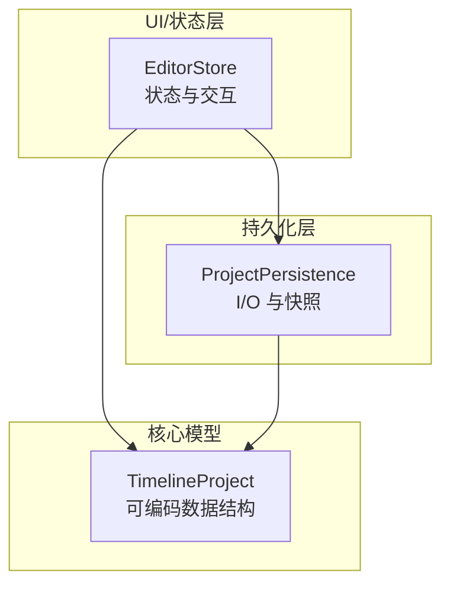
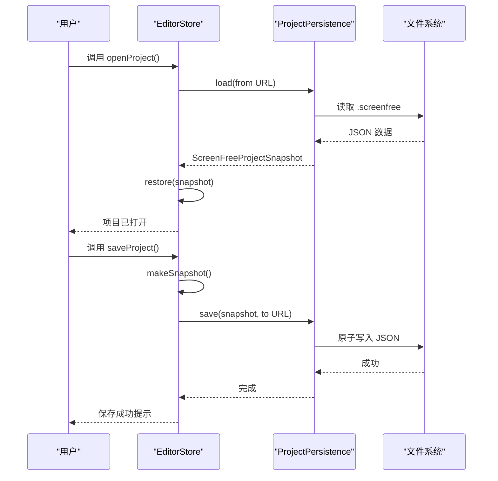
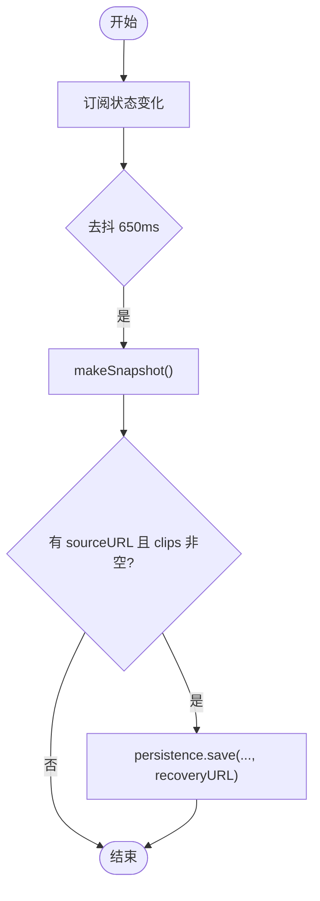
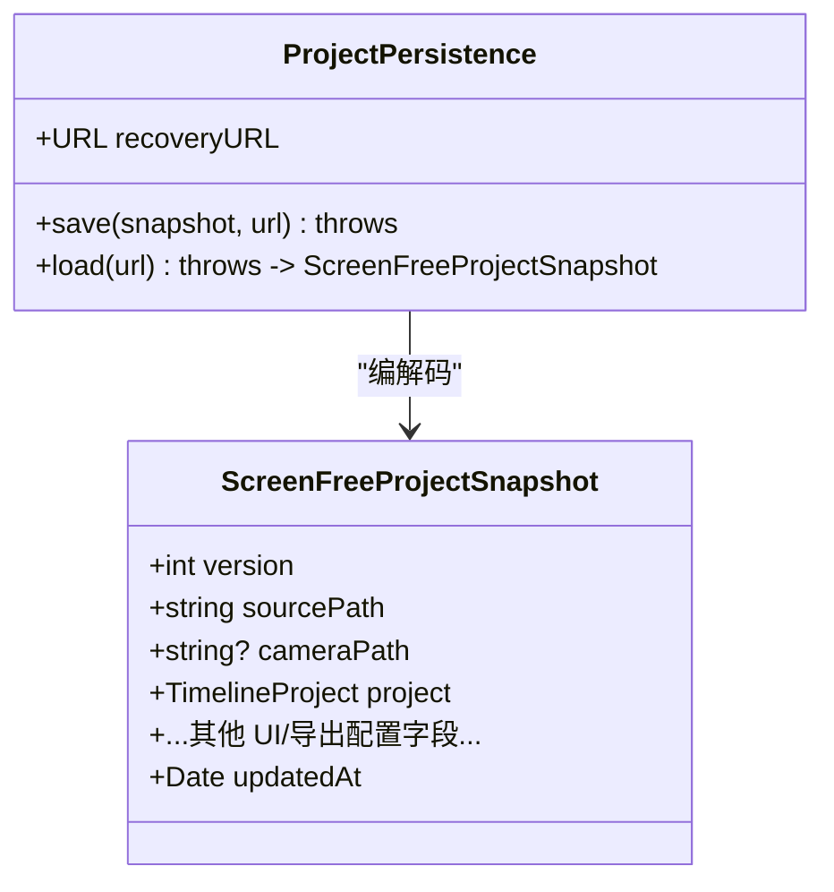
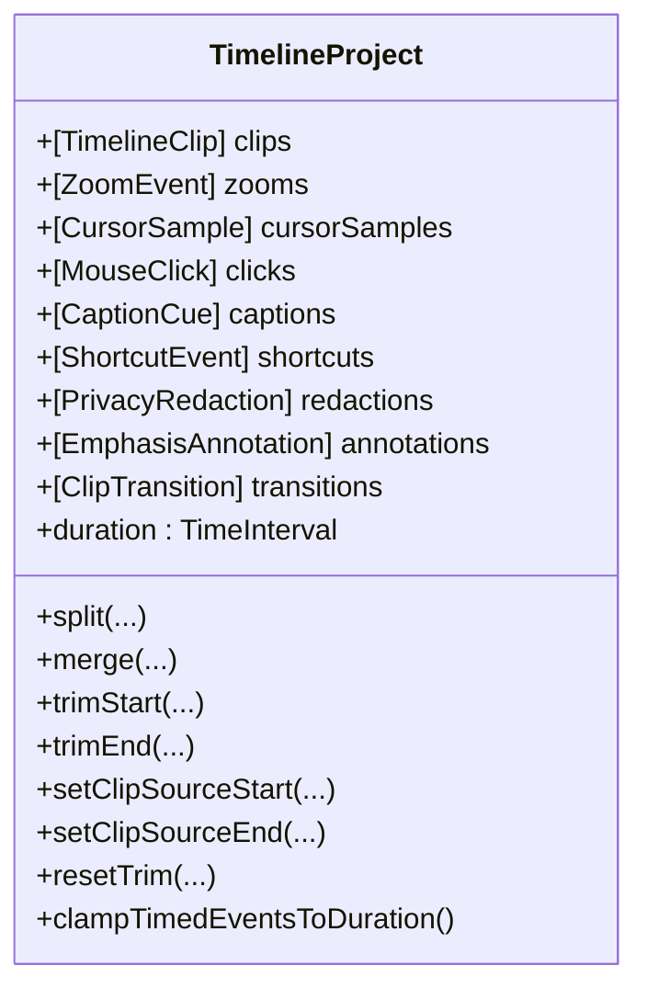
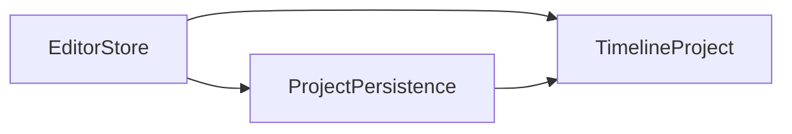

# 项目持久化 API

<cite>
**本文引用的文件**   
- [EditorStore.swift](file://Sources/ScreenFree/EditorStore.swift)
- [ProjectPersistence.swift](file://Sources/ScreenFree/ProjectPersistence.swift)
- [EditorModels.swift](file://Sources/ScreenFreeCore/EditorModels.swift)
- [TimelineProjectTests.swift](file://Tests/ScreenFreeCoreTests/TimelineProjectTests.swift)
</cite>

## 目录
1. [简介](#简介)
2. [项目结构](#项目结构)
3. [核心组件](#核心组件)
4. [架构总览](#架构总览)
5. [详细组件分析](#详细组件分析)
6. [依赖关系分析](#依赖关系分析)
7. [性能考量](#性能考量)
8. [故障排查指南](#故障排查指南)
9. [结论](#结论)
10. [附录](#附录)

## 简介
本文件面向 ScreenFree 项目的“项目持久化”能力，聚焦 EditorStore 中与项目保存、加载、自动保存相关的接口，以及 ProjectPersistence 组件的集成方式与项目文件格式规范。文档同时说明 TimelineProject 数据结构的序列化与反序列化机制，并提供手动保存、加载现有项目、处理版本兼容性的示例路径；解释自动保存策略、备份与恢复流程；记录项目文件的存储位置、命名规则、元数据管理；并总结文件系统操作的错误处理与用户反馈机制。

## 项目结构
与项目持久化相关的关键代码分布在以下模块：
- EditorStore：编辑器状态中心，负责 UI 交互、媒体加载、项目快照生成、自动保存安装、打开/保存项目入口等。
- ProjectPersistence：项目文件 I/O 封装，定义项目快照结构、JSON 编解码、版本校验、源文件存在性检查、恢复文件路径。
- EditorModels（ScreenFreeCore）：TimelineProject 及其子类型（剪辑、缩放事件、光标采样、点击、字幕、快捷键、隐私遮罩、标注、转场等），提供 Codable 自定义实现与时间轴操作。
- 测试用例：验证 TimelineProject 的 JSON 往返与向后兼容性。

图表来源
- [EditorStore.swift:3576-3703](file://Sources/ScreenFree/EditorStore.swift#L3576-L3703)
- [ProjectPersistence.swift:81-120](file://Sources/ScreenFree/ProjectPersistence.swift#L81-L120)
- [EditorModels.swift:274-372](file://Sources/ScreenFreeCore/EditorModels.swift#L274-L372)

章节来源
- [EditorStore.swift:3576-3703](file://Sources/ScreenFree/EditorStore.swift#L3576-L3703)
- [ProjectPersistence.swift:81-120](file://Sources/ScreenFree/ProjectPersistence.swift#L81-L120)
- [EditorModels.swift:274-372](file://Sources/ScreenFreeCore/EditorModels.swift#L274-L372)

## 核心组件
- EditorStore
  - 提供 openProject/saveProject/openExternalURL/loadVideo 等入口方法。
  - 通过 makeSnapshot 生成 ScreenFreeProjectSnapshot，并通过 persistence.save 写入磁盘。
  - 通过 installAutosave 订阅状态变化，防抖后写入恢复文件。
  - restore 将快照还原为运行时状态。
- ProjectPersistence
  - 定义 ScreenFreeProjectSnapshot（包含 version、sourcePath、cameraPath、project 及大量 UI/导出配置）。
  - save/load 使用 JSONEncoder/Decoder，原子写入，ISO8601 日期格式。
  - 加载时进行版本校验与源文件存在性校验，抛出明确错误。
  - recoveryURL 指向应用支持目录下的 Recovery.screenfree。
- TimelineProject（EditorModels）
  - 包含 clips、zooms、cursorSamples、clicks、captions、shortcuts、redactions、annotations、transitions。
  - 自定义 CodingKeys 与 decode/encode，确保字段缺失时的向后兼容。
  - 提供时间轴裁剪、分割、合并、范围钳制等方法。

章节来源
- [EditorStore.swift:1251-1308](file://Sources/ScreenFree/EditorStore.swift#L1251-L1308)
- [EditorStore.swift:3576-3703](file://Sources/ScreenFree/EditorStore.swift#L3576-L3703)
- [ProjectPersistence.swift:4-120](file://Sources/ScreenFree/ProjectPersistence.swift#L4-L120)
- [EditorModels.swift:274-372](file://Sources/ScreenFreeCore/EditorModels.swift#L274-L372)

## 架构总览
项目持久化的整体流程如下：
- 保存：EditorStore.makeSnapshot 收集当前状态 -> ProjectPersistence.save 原子写入 JSON。
- 加载：EditorStore.openProject/openExternalURL -> ProjectPersistence.load 校验版本与源文件 -> EditorStore.restore 重建运行时状态。
- 自动保存：EditorStore.installAutosave 订阅多属性变化 -> debounce(650ms) -> 写入 recoveryURL。
- 恢复：崩溃或异常后可从 recoveryURL 恢复最近一次快照。

图表来源
- [EditorStore.swift:1251-1308](file://Sources/ScreenFree/EditorStore.swift#L1251-L1308)
- [ProjectPersistence.swift:94-119](file://Sources/ScreenFree/ProjectPersistence.swift#L94-L119)

## 详细组件分析

### EditorStore：项目持久化接口与自动保存
- 打开项目
  - openProject：弹出选择器，筛选 .screenfree，调用 persistence.load 后 restore。
  - openExternalURL：支持 .screenfree 直接恢复，或导入视频。
- 保存项目
  - saveProject：生成快照，弹出保存面板，调用 persistence.save。
- 自动保存
  - installAutosave：订阅 project、sourceURL、cameraURL、画布与样式、音频布局与音量、点击效果、字幕、缩放、运动模糊、相机等属性的变化，去抖 650ms 后写入 recoveryURL。
  - 在 isRestoringProject 期间不触发自动保存，避免循环写盘。
- 恢复
  - restore：先 loadVideo(sourcePath)，再批量赋值 snapshot 中的各项配置，必要时加载 camera 与 background music，最后 seek 到 0。

图表来源
- [EditorStore.swift:3576-3639](file://Sources/ScreenFree/EditorStore.swift#L3576-L3639)
- [EditorStore.swift:3641-3703](file://Sources/ScreenFree/EditorStore.swift#L3641-L3703)

章节来源
- [EditorStore.swift:1251-1308](file://Sources/ScreenFree/EditorStore.swift#L1251-L1308)
- [EditorStore.swift:3576-3703](file://Sources/ScreenFree/EditorStore.swift#L3576-L3703)

### ProjectPersistence：项目文件格式与 I/O
- 项目快照结构 ScreenFreeProjectSnapshot
  - 字段包括 version、sourcePath、cameraPath、project(TimelineProject)、画布与背景、光标、音乐、录制音频布局、音量、点击效果、字幕、缩放、运动模糊、相机、转场、更新时间 updatedAt 等。
  - currentVersion=1，用于版本控制。
- 保存
  - 创建目录，JSONEncoder 启用 prettyPrinted、sortedKeys，日期 ISO8601，原子写入。
- 加载
  - JSONDecoder 设置 ISO8601 日期策略，解码后校验 version <= currentVersion，校验 sourcePath 存在，否则抛出对应错误。
- 恢复文件路径
  - recoveryURL = ApplicationSupportDirectory/ScreenFree/Recovery.screenfree。

图表来源
- [ProjectPersistence.swift:4-120](file://Sources/ScreenFree/ProjectPersistence.swift#L4-L120)

章节来源
- [ProjectPersistence.swift:4-120](file://Sources/ScreenFree/ProjectPersistence.swift#L4-L120)

### TimelineProject：数据结构与序列化/反序列化
- 数据结构
  - clips、zooms、cursorSamples、clicks、captions、shortcuts、redactions、annotations、transitions。
- 序列化/反序列化
  - 自定义 CodingKeys，decode 时使用 decodeIfPresent 保证旧版缺失字段兼容。
  - encode 按字段顺序输出。
- 时间轴操作
  - split、merge、trimStart/End、setClipSourceStart/End、resetTrim、clampTimedEventsToDuration 等。
- 兼容性
  - 测试覆盖旧版 JSON 缺少 shortcuts/redactions 字段时的降级行为。

图表来源
- [EditorModels.swift:274-372](file://Sources/ScreenFreeCore/EditorModels.swift#L274-L372)

章节来源
- [EditorModels.swift:274-372](file://Sources/ScreenFreeCore/EditorModels.swift#L274-L372)
- [TimelineProjectTests.swift:548-608](file://Tests/ScreenFreeCoreTests/TimelineProjectTests.swift#L548-L608)

## 依赖关系分析
- EditorStore 依赖 ProjectPersistence 进行 I/O，依赖 TimelineProject 作为核心数据模型。
- ProjectPersistence 依赖 Foundation 的 JSONEncoder/Decoder 与 FileManager。
- TimelineProject 依赖 CoreGraphics/Foundation 基础类型，并在 EditorModels 中实现 Codable。

图表来源
- [EditorStore.swift:3576-3703](file://Sources/ScreenFree/EditorStore.swift#L3576-L3703)
- [ProjectPersistence.swift:81-120](file://Sources/ScreenFree/ProjectPersistence.swift#L81-L120)
- [EditorModels.swift:274-372](file://Sources/ScreenFreeCore/EditorModels.swift#L274-L372)

章节来源
- [EditorStore.swift:3576-3703](file://Sources/ScreenFree/EditorStore.swift#L3576-L3703)
- [ProjectPersistence.swift:81-120](file://Sources/ScreenFree/ProjectPersistence.swift#L81-L120)
- [EditorModels.swift:274-372](file://Sources/ScreenFreeCore/EditorModels.swift#L274-L372)

## 性能考量
- 自动保存去抖：debounce 650ms，避免频繁写盘。
- 原子写入：write(options: .atomic) 防止部分写入导致损坏。
- 只写恢复文件：自动保存仅写入 recoveryURL，减少主项目文件 IO 压力。
- 大对象序列化：TimelineProject 可能较大，建议在后台任务中进行耗时操作（如缩略图生成已在独立 Task 中）。

## 故障排查指南
- 打开项目失败
  - unsupportedVersion：项目由更高版本创建，需升级应用或迁移。
  - missingSource：原始录制文件不存在，需确认 sourcePath 有效。
- 保存失败
  - 权限不足或路径不可写：检查目标目录权限与可用空间。
- 自动保存未生效
  - 检查是否在 isRestoringProject 期间（不会触发）。
  - 检查是否有 sourceURL 且 project.clips 非空（makeSnapshot 返回 nil 则不保存）。
- 恢复失败
  - 检查 recoveryURL 是否存在且可读。
  - 检查 sourcePath/cameraPath/backgroundMusicPath 是否仍有效。

章节来源
- [ProjectPersistence.swift:67-120](file://Sources/ScreenFree/ProjectPersistence.swift#L67-L120)
- [EditorStore.swift:3576-3703](file://Sources/ScreenFree/EditorStore.swift#L3576-L3703)

## 结论
ScreenFree 的项目持久化以 EditorStore 为中心，结合 ProjectPersistence 的 JSON 快照与 TimelineProject 的可编码模型，实现了可靠的保存、加载与自动保存机制。通过版本校验与源文件存在性检查，保证了数据一致性与向后兼容。自动保存策略采用去抖与原子写入，兼顾性能与安全。恢复文件位于应用支持目录，便于崩溃恢复。

## 附录

### 项目文件格式规范（ScreenFreeProjectSnapshot）
- 文件扩展名：.screenfree（JSON）
- 关键元数据
  - version：当前为 1
  - sourcePath：主录制文件绝对路径
  - cameraPath：可选，画中画录制文件路径
  - project：TimelineProject 完整内容
  - 画布与背景：aspectRatio、contentMode、padding、cornerRadius、backgroundHue、backgroundMode、wallpaperPreset、backgroundImagePath、backgroundBlur、shadowStrength
  - 光标：size、replacementStyle、show、hideWhenIdle、idleTimeout、tailFreeze、loopToStart、removeShakes、shakeThreshold、optimizeRapidChanges、smoothMovement
  - 音乐：backgroundMusicPath、backgroundMusicVolume
  - 音频布局：recordedAudioLayout、systemAudioVolume、microphoneAudioVolume、microphoneAudioMuted
  - 点击效果：showClickRipple、clickEffectPreset
  - 快捷键叠加：showShortcutOverlay
  - 字幕：showCaptions、captionFontSize、captionLanguage、captionVocabulary
  - 缩放：zoomScale、zoomDuration、zoomMotionPreset、zoomCustomTransitionDuration、zoomCustomX1、zoomCustomY1、zoomCustomX2、zoomCustomY2
  - 运动模糊：motionBlurEnabled、motionBlurStrength、cursorMotionBlur、zoomMotionBlur、panMotionBlur
  - 相机：cameraSize、cameraCornerRadius、cameraMirrored、cameraPosition
  - 转场：transitionStyle、transitionDuration
  - updatedAt：快照时间戳（ISO8601）

章节来源
- [ProjectPersistence.swift:4-65](file://Sources/ScreenFree/ProjectPersistence.swift#L4-L65)
- [EditorStore.swift:3641-3703](file://Sources/ScreenFree/EditorStore.swift#L3641-L3703)

### 存储位置与命名规则
- 恢复文件路径：ApplicationSupportDirectory/ScreenFree/Recovery.screenfree
- 项目文件命名：用户通过保存面板决定，默认建议 Untitled.screenfree
- 原录制文件：由 recording 流程生成，路径由 sourceURL/cameraURL 管理

章节来源
- [ProjectPersistence.swift:84-92](file://Sources/ScreenFree/ProjectPersistence.swift#L84-L92)
- [EditorStore.swift:1291-1308](file://Sources/ScreenFree/EditorStore.swift#L1291-L1308)

### 手动保存与加载示例（步骤指引）
- 手动保存项目
  - 调用 EditorStore.saveProject()，选择 .screenfree 目标路径，完成写入。
  - 参考路径：[EditorStore.swift:1291-1308](file://Sources/ScreenFree/EditorStore.swift#L1291-L1308)
- 加载现有项目
  - 调用 EditorStore.openProject()，选择 .screenfree 文件，内部执行 persistence.load 与 restore。
  - 参考路径：[EditorStore.swift:1251-1268](file://Sources/ScreenFree/EditorStore.swift#L1251-L1268)
- 处理版本兼容性
  - 若 ProjectPersistence.load 抛出 unsupportedVersion，提示用户升级或回退版本。
  - 若 missingSource，提示用户重新定位源录制文件。
  - 参考路径：[ProjectPersistence.swift:105-119](file://Sources/ScreenFree/ProjectPersistence.swift#L105-L119)

### 自动保存策略与恢复流程
- 自动保存
  - 订阅 EditorStore 的多项 @Published 属性变化，去抖 650ms 后写入 recoveryURL。
  - 参考路径：[EditorStore.swift:3576-3639](file://Sources/ScreenFree/EditorStore.swift#L3576-L3639)
- 恢复流程
  - 启动时检查 recoveryURL，若存在则尝试 restore，重建项目状态。
  - 参考路径：[EditorStore.swift:3705-3800](file://Sources/ScreenFree/EditorStore.swift#L3705-L3800)

### 错误处理与用户反馈
- 错误类型
  - ProjectPersistenceError.unsupportedVersion / missingSource
  - 本地化错误消息通过 errorMessage/statusMessage 展示
- 用户反馈
  - statusMessage 显示“Opened/Saved/Exported...”等状态
  - errorMessage 显示具体错误信息
- 参考路径
  - [ProjectPersistence.swift:67-79](file://Sources/ScreenFree/ProjectPersistence.swift#L67-L79)
  - [EditorStore.swift:1251-1308](file://Sources/ScreenFree/EditorStore.swift#L1251-L1308)