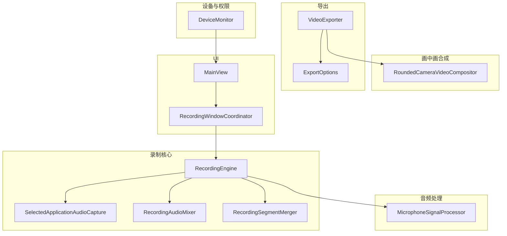
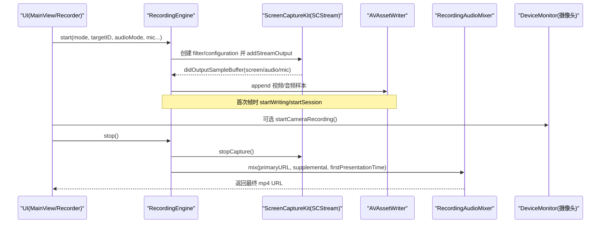
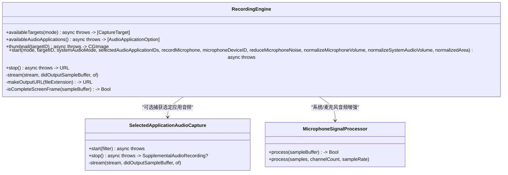
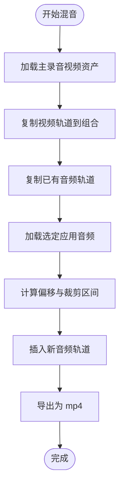
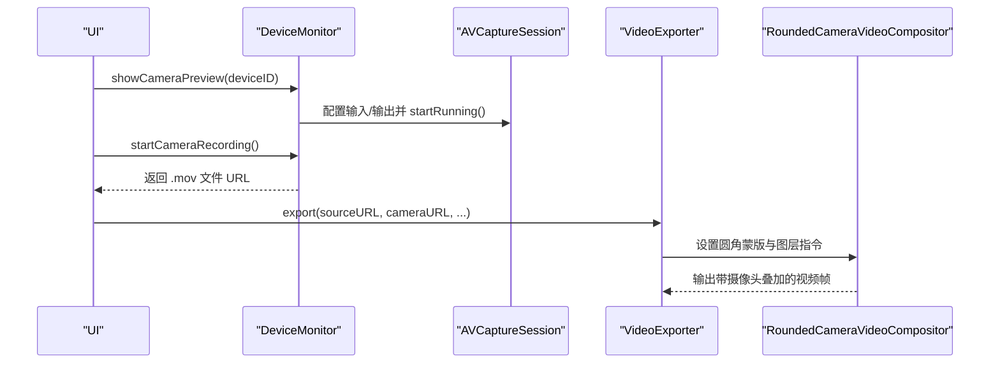
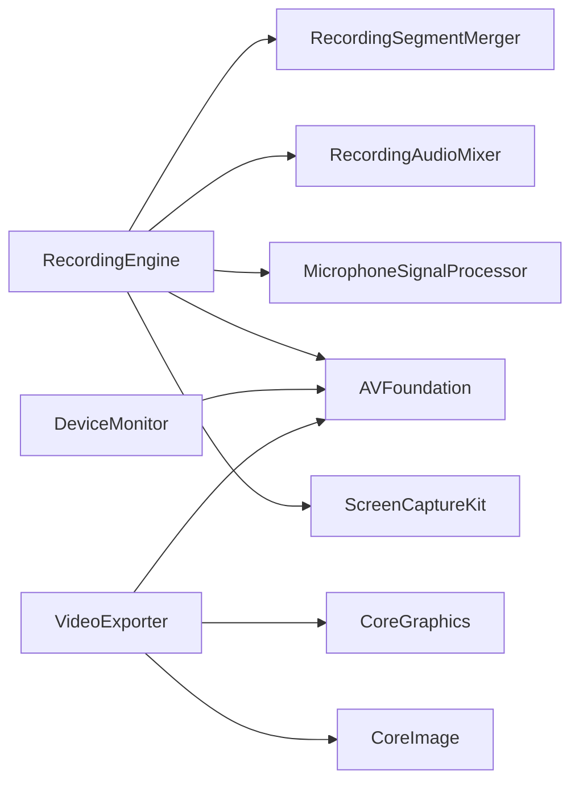

# RecordingEngine 录制 API

<cite>
**本文引用的文件**   
- [RecordingEngine.swift](file://Sources/ScreenFree/RecordingEngine.swift)
- [RecordingSegmentMerger.swift](file://Sources/ScreenFree/RecordingSegmentMerger.swift)
- [RecordingAudioMixer.swift](file://Sources/ScreenFree/RecordingAudioMixer.swift)
- [MicrophoneSignalProcessor.swift](file://Sources/ScreenFree/MicrophoneSignalProcessor.swift)
- [DeviceMonitor.swift](file://Sources/ScreenFree/DeviceMonitor.swift)
- [CameraOverlayStyle.swift](file://Sources/ScreenFree/CameraOverlayStyle.swift)
- [RoundedCameraVideoCompositor.swift](file://Sources/ScreenFree/RoundedCameraVideoCompositor.swift)
- [ExportOptions.swift](file://Sources/ScreenFree/ExportOptions.swift)
- [VideoExporter.swift](file://Sources/ScreenFree/VideoExporter.swift)
- [MainView.swift](file://Sources/ScreenFree/MainView.swift)
- [RecordingWindowCoordinator.swift](file://Sources/ScreenFree/RecordingWindowCoordinator.swift)
</cite>

## 目录
1. [简介](#简介)
2. [项目结构](#项目结构)
3. [核心组件](#核心组件)
4. [架构总览](#架构总览)
5. [详细组件分析](#详细组件分析)
6. [依赖关系分析](#依赖关系分析)
7. [性能考量](#性能考量)
8. [故障排查指南](#故障排查指南)
9. [结论](#结论)
10. [附录：API 与使用示例](#附录api-与使用示例)

## 简介
本文件为 RecordingEngine 录制引擎的完整 API 文档，面向开发者与高级用户。内容涵盖：
- 屏幕录制核心接口：显示器、窗口、自由区域三种模式
- 目标设备管理：显示设备、窗口列表、音频应用选择
- 音频配置：系统音频（全部或选定应用）、麦克风输入、降噪与音量归一化
- 录制控制：开始、停止、暂停恢复（由上层协调）
- 摄像头画中画集成：实时预览、录制段合并、最终合成
- 权限检查、设备检测、错误处理实现细节
- 与 ScreenCaptureKit 和 AVFoundation 的集成方式
- 代码级流程图与时序图，便于理解数据流与控制流

## 项目结构
围绕录制能力的相关模块分布如下：
- 录制核心：RecordingEngine（SCStream + AVAssetWriter）
- 音频增强：MicrophoneSignalProcessor（降噪、自动增益、压缩）
- 音频混合：RecordingAudioMixer（主录音视频 + 选定应用音频混音）
- 段落合并：RecordingSegmentMerger（多段录制拼接）
- 设备与权限：DeviceMonitor（麦克风/摄像头权限、预览、录制）
- 画中画合成：RoundedCameraVideoCompositor（圆角摄像头叠加）
- 导出与格式：ExportOptions、VideoExporter（导出参数、帧率、质量、GIF/MP4）
- UI 集成：MainView、RecordingWindowCoordinator（录制入口、状态、倒计时）

图表来源
- [RecordingEngine.swift:63-531](file://Sources/ScreenFree/RecordingEngine.swift#L63-L531)
- [RecordingAudioMixer.swift:29-136](file://Sources/ScreenFree/RecordingAudioMixer.swift#L29-L136)
- [RecordingSegmentMerger.swift:24-120](file://Sources/ScreenFree/RecordingSegmentMerger.swift#L24-L120)
- [MicrophoneSignalProcessor.swift:78-356](file://Sources/ScreenFree/MicrophoneSignalProcessor.swift#L78-L356)
- [DeviceMonitor.swift:44-361](file://Sources/ScreenFree/DeviceMonitor.swift#L44-L361)
- [RoundedCameraVideoCompositor.swift:45-178](file://Sources/ScreenFree/RoundedCameraVideoCompositor.swift#L45-L178)
- [ExportOptions.swift:79-362](file://Sources/ScreenFree/ExportOptions.swift#L79-L362)
- [VideoExporter.swift:95-590](file://Sources/ScreenFree/VideoExporter.swift#L95-L590)
- [MainView.swift:1410-1515](file://Sources/ScreenFree/MainView.swift#L1410-L1515)
- [RecordingWindowCoordinator.swift:441-476](file://Sources/ScreenFree/RecordingWindowCoordinator.swift#L441-L476)

章节来源
- [RecordingEngine.swift:63-531](file://Sources/ScreenFree/RecordingEngine.swift#L63-L531)
- [RecordingAudioMixer.swift:29-136](file://Sources/ScreenFree/RecordingAudioMixer.swift#L29-L136)
- [RecordingSegmentMerger.swift:24-120](file://Sources/ScreenFree/RecordingSegmentMerger.swift#L24-L120)
- [MicrophoneSignalProcessor.swift:78-356](file://Sources/ScreenFree/MicrophoneSignalProcessor.swift#L78-L356)
- [DeviceMonitor.swift:44-361](file://Sources/ScreenFree/DeviceMonitor.swift#L44-L361)
- [RoundedCameraVideoCompositor.swift:45-178](file://Sources/ScreenFree/RoundedCameraVideoCompositor.swift#L45-L178)
- [ExportOptions.swift:79-362](file://Sources/ScreenFree/ExportOptions.swift#L79-L362)
- [VideoExporter.swift:95-590](file://Sources/ScreenFree/VideoExporter.swift#L95-L590)
- [MainView.swift:1410-1515](file://Sources/ScreenFree/MainView.swift#L1410-L1515)
- [RecordingWindowCoordinator.swift:441-476](file://Sources/ScreenFree/RecordingWindowCoordinator.swift#L441-L476)

## 核心组件
- RecordingEngine：基于 ScreenCaptureKit 的 SCStream 采集屏幕/窗口/区域，通过 AVAssetWriter 写入 MP4；支持系统音频（全部或选定应用）与麦克风；内置音频信号处理器用于降噪与音量归一化。
- SelectedApplicationAudioCapture：独立捕获“选定应用”的系统音频，生成 m4a 片段，供后期混音。
- RecordingAudioMixer：将主录音视频与“选定应用音频”按时间对齐并混音输出 mp4。
- RecordingSegmentMerger：将多个录制片段（如多次录制）合并为一个视频。
- MicrophoneSignalProcessor：对 PCM 音频进行降噪、自动增益、压缩等处理。
- DeviceMonitor：管理麦克风和摄像头权限、设备枚举、实时预览与摄像头录制。
- RoundedCameraVideoCompositor：在导出阶段将摄像头画面以圆角形式叠加到屏幕视频上。
- ExportOptions / VideoExporter：导出参数定义与视频导出流程（含 GIF/MP4、分辨率、帧率、质量）。

章节来源
- [RecordingEngine.swift:63-531](file://Sources/ScreenFree/RecordingEngine.swift#L63-L531)
- [RecordingAudioMixer.swift:29-136](file://Sources/ScreenFree/RecordingAudioMixer.swift#L29-L136)
- [RecordingSegmentMerger.swift:24-120](file://Sources/ScreenFree/RecordingSegmentMerger.swift#L24-L120)
- [MicrophoneSignalProcessor.swift:78-356](file://Sources/ScreenFree/MicrophoneSignalProcessor.swift#L78-L356)
- [DeviceMonitor.swift:44-361](file://Sources/ScreenFree/DeviceMonitor.swift#L44-L361)
- [RoundedCameraVideoCompositor.swift:45-178](file://Sources/ScreenFree/RoundedCameraVideoCompositor.swift#L45-L178)
- [ExportOptions.swift:79-362](file://Sources/ScreenFree/ExportOptions.swift#L79-L362)
- [VideoExporter.swift:95-590](file://Sources/ScreenFree/VideoExporter.swift#L95-L590)

## 架构总览
录制引擎采用“采集-处理-写入-混音-导出”的分层架构：
- 采集层：SCStream 负责屏幕/窗口/区域与音频（系统/麦克风）采样
- 处理层：MicrophoneSignalProcessor 做实时音频增强
- 写入层：AVAssetWriter 写入 MP4（视频+音频轨）
- 混音层：RecordingAudioMixer 将“选定应用音频”与主录音视频混音
- 导出层：VideoExporter 根据项目与样式进行合成与导出

图表来源
- [RecordingEngine.swift:174-443](file://Sources/ScreenFree/RecordingEngine.swift#L174-L443)
- [RecordingAudioMixer.swift:30-134](file://Sources/ScreenFree/RecordingAudioMixer.swift#L30-L134)
- [DeviceMonitor.swift:252-284](file://Sources/ScreenFree/DeviceMonitor.swift#L252-L284)

## 详细组件分析

### RecordingEngine 类与 API
- 录制模式
  - CaptureMode：display（显示器）、window（窗口）、area（自由区域）
  - SystemAudioCaptureMode：all（全部应用）、selected（选定应用）、off（关闭）
- 目标设备管理
  - availableTargets(for:)：获取可用显示器/窗口列表
  - availableAudioApplications()：获取可捕获系统音频的应用列表
  - thumbnail(for:)：为目标显示器生成缩略图
- 录制控制
  - start(...)：配置 SCStream、AVAssetWriter、音频输入、信号处理器，启动采集
  - stop()：停止采集、结束写入、可选混音，返回最终 URL
- 回调与数据流
  - stream(_:didOutputSampleBuffer:of:)：接收屏幕/音频/麦克风样本，写入对应轨道
  - isCompleteScreenFrame(...)：过滤非完整帧
- 内部辅助
  - makeOutputURL(fileExtension:)：生成输出路径（Movies/ScreenFree 或临时目录）
  - SelectedApplicationAudioCapture：单独捕获选定应用音频并写 m4a

图表来源
- [RecordingEngine.swift:63-531](file://Sources/ScreenFree/RecordingEngine.swift#L63-L531)
- [RecordingEngine.swift:533-674](file://Sources/ScreenFree/RecordingEngine.swift#L533-L674)
- [MicrophoneSignalProcessor.swift:78-356](file://Sources/ScreenFree/MicrophoneSignalProcessor.swift#L78-L356)

章节来源
- [RecordingEngine.swift:63-531](file://Sources/ScreenFree/RecordingEngine.swift#L63-L531)
- [RecordingEngine.swift:533-674](file://Sources/ScreenFree/RecordingEngine.swift#L533-L674)

### 音频处理与混音
- MicrophoneSignalProcessor
  - 支持降噪（低通滤波）、自动增益（RMS 目标值）、压缩（阈值/比率/上限）
  - 支持 16bit/32bit float PCM 输入，多通道处理
- RecordingAudioMixer
  - 将主录音视频与“选定应用音频”按首帧时间戳对齐，插入新轨道并导出 mp4
  - 处理偏移与裁剪，确保时长匹配
- RecordingSegmentMerger
  - 将多个片段（mp4/mov）合并，保持视频与多音频轨道顺序一致

图表来源
- [RecordingAudioMixer.swift:30-134](file://Sources/ScreenFree/RecordingAudioMixer.swift#L30-L134)
- [RecordingSegmentMerger.swift:25-118](file://Sources/ScreenFree/RecordingSegmentMerger.swift#L25-L118)

章节来源
- [MicrophoneSignalProcessor.swift:78-356](file://Sources/ScreenFree/MicrophoneSignalProcessor.swift#L78-L356)
- [RecordingAudioMixer.swift:29-136](file://Sources/ScreenFree/RecordingAudioMixer.swift#L29-L136)
- [RecordingSegmentMerger.swift:24-120](file://Sources/ScreenFree/RecordingSegmentMerger.swift#L24-L120)

### 摄像头画中画与实时预览
- DeviceMonitor
  - 管理麦克风/摄像头权限、设备枚举、实时预览、摄像头录制
  - 提供 startCameraRecording()/stopCameraRecording() 生命周期
- RoundedCameraVideoCompositor
  - 导出阶段将摄像头画面以圆角蒙版叠加到屏幕视频上
- CameraOverlayStyle
  - 定义摄像头位置、尺寸比例、镜像、圆角半径等样式

图表来源
- [DeviceMonitor.swift:188-284](file://Sources/ScreenFree/DeviceMonitor.swift#L188-L284)
- [RoundedCameraVideoCompositor.swift:45-178](file://Sources/ScreenFree/RoundedCameraVideoCompositor.swift#L45-L178)
- [VideoExporter.swift:352-456](file://Sources/ScreenFree/VideoExporter.swift#L352-L456)

章节来源
- [DeviceMonitor.swift:44-361](file://Sources/ScreenFree/DeviceMonitor.swift#L44-L361)
- [CameraOverlayStyle.swift:1-27](file://Sources/ScreenFree/CameraOverlayStyle.swift#L1-L27)
- [RoundedCameraVideoCompositor.swift:45-178](file://Sources/ScreenFree/RoundedCameraVideoCompositor.swift#L45-L178)

### 权限检查与设备检测
- 麦克风权限：AVCaptureDevice.requestAccess(for: .audio)，失败则提示
- 摄像头权限：AVCaptureDevice.requestAccess(for: .video)，失败则提示
- 设备枚举：DiscoverySession 获取麦克风/摄像头列表，标记默认设备
- 音频信号监测：AVAudioEngine 输入节点 Tap，计算 RMS 与峰值，判断静音/削波

章节来源
- [DeviceMonitor.swift:102-112](file://Sources/ScreenFree/DeviceMonitor.swift#L102-L112)
- [DeviceMonitor.swift:127-186](file://Sources/ScreenFree/DeviceMonitor.swift#L127-L186)

### 错误处理
- RecordingError：无源、无音频应用、无法启动/结束写入器、写入失败详情
- RecordingSegmentMergeError：无可合并片段、无法创建轨道/导出会话、导出失败
- RecordingAudioMixError：缺少主视频、无法创建轨道/导出会话、导出失败
- DeviceMonitorError：摄像头未就绪
- VideoExportError：缺失视频轨道、无法创建组合/导出会话、读取帧失败、导出失败

章节来源
- [RecordingEngine.swift:40-61](file://Sources/ScreenFree/RecordingEngine.swift#L40-L61)
- [RecordingSegmentMerger.swift:4-22](file://Sources/ScreenFree/RecordingSegmentMerger.swift#L4-L22)
- [RecordingAudioMixer.swift:4-22](file://Sources/ScreenFree/RecordingAudioMixer.swift#L4-L22)
- [DeviceMonitor.swift:32-41](file://Sources/ScreenFree/DeviceMonitor.swift#L32-L41)
- [VideoExporter.swift:12-33](file://Sources/ScreenFree/VideoExporter.swift#L12-L33)

## 依赖关系分析
- RecordingEngine 依赖 ScreenCaptureKit（SCStream/SCContentFilter/SCShareableContent）与 AVFoundation（AVAssetWriter/AVAssetWriterInput）
- 音频增强依赖 AudioToolbox/CoreMedia 进行 PCM 处理
- 混音与合并依赖 AVFoundation 的 AVMutableComposition/AVAssetExportSession
- 摄像头预览/录制依赖 AVFoundation 的 AVCaptureSession/AVCaptureMovieFileOutput
- 导出依赖 AVFoundation 与 CoreImage/CoreGraphics 进行合成与渲染

图表来源
- [RecordingEngine.swift:1-5](file://Sources/ScreenFree/RecordingEngine.swift#L1-L5)
- [MicrophoneSignalProcessor.swift:1-4](file://Sources/ScreenFree/MicrophoneSignalProcessor.swift#L1-L4)
- [DeviceMonitor.swift:1-5](file://Sources/ScreenFree/DeviceMonitor.swift#L1-L5)
- [VideoExporter.swift:1-10](file://Sources/ScreenFree/VideoExporter.swift#L1-L10)

章节来源
- [RecordingEngine.swift:1-5](file://Sources/ScreenFree/RecordingEngine.swift#L1-L5)
- [MicrophoneSignalProcessor.swift:1-4](file://Sources/ScreenFree/MicrophoneSignalProcessor.swift#L1-L4)
- [DeviceMonitor.swift:1-5](file://Sources/ScreenFree/DeviceMonitor.swift#L1-L5)
- [VideoExporter.swift:1-10](file://Sources/ScreenFree/VideoExporter.swift#L1-L10)

## 性能考量
- 采集队列：captureQueue 设置为 userInteractive QoS，保证低延迟
- 帧间隔与队列深度：minimumFrameInterval=1/60s，queueDepth=8，平衡吞吐与内存
- 像素格式：kCVPixelFormatType_32BGRA，减少转换开销
- 编码器设置：H.264，动态码率（宽度*高度*4），最大关键帧间隔 120
- 音频采样：48kHz 双声道 AAC，比特率 192kbps
- 信号处理：仅在启用降噪/归一化时运行，避免不必要的 CPU 消耗
- 导出优化：shouldOptimizeForNetworkUse=true，按需选择导出预设

章节来源
- [RecordingEngine.swift:192-300](file://Sources/ScreenFree/RecordingEngine.swift#L192-L300)
- [RecordingEngine.swift:301-326](file://Sources/ScreenFree/RecordingEngine.swift#L301-L326)
- [VideoExporter.swift:536-590](file://Sources/ScreenFree/VideoExporter.swift#L536-L590)

## 故障排查指南
- 无可用源：检查显示器/窗口是否可见且满足最小尺寸要求
- 无音频应用：当选择“选定应用”时，至少选择一个应用
- 无法启动写入器：确认 AVAssetWriter.canAdd(input) 成功
- 无法结束写入：检查 writer.finishWriting 状态与错误信息
- 摄像头未就绪：确保已授权并处于预览运行状态
- 导出失败：检查 composition 轨道插入、export session 状态与错误

章节来源
- [RecordingEngine.swift:40-61](file://Sources/ScreenFree/RecordingEngine.swift#L40-L61)
- [DeviceMonitor.swift:32-41](file://Sources/ScreenFree/DeviceMonitor.swift#L32-L41)
- [VideoExporter.swift:12-33](file://Sources/ScreenFree/VideoExporter.swift#L12-L33)

## 结论
RecordingEngine 提供了完整的屏幕录制能力，结合 ScreenCaptureKit 与 AVFoundation，实现了高保真、可扩展的录制管线。通过模块化设计（音频增强、混音、段落合并、画中画合成、导出），开发者可以灵活配置不同录制模式与输出格式，同时具备良好的错误处理与性能优化。

## 附录：API 与使用示例

### 录制模式与目标设备
- 显示器模式：availableTargets(.display) 获取显示器列表，选择 displayID
- 窗口模式：availableTargets(.window) 过滤 on-screen 且尺寸足够的窗口
- 自由区域：availableTargets(.area) 同显示器，start 时传入 normalizedArea

章节来源
- [RecordingEngine.swift:85-117](file://Sources/ScreenFree/RecordingEngine.swift#L85-L117)
- [RecordingEngine.swift:145-172](file://Sources/ScreenFree/RecordingEngine.swift#L145-L172)

### 音频配置
- 系统音频：systemAudioMode=all 时开启 capturesAudio；selected 时通过 selectedAudioApplicationIDs 指定
- 麦克风：recordMicrophone=true 时启用 captureMicrophone，可指定设备 ID
- 降噪与归一化：reduceMicrophoneNoise/normalizeMicrophoneVolume/normalizeSystemAudioVolume

章节来源
- [RecordingEngine.swift:174-210](file://Sources/ScreenFree/RecordingEngine.swift#L174-L210)
- [RecordingEngine.swift:264-281](file://Sources/ScreenFree/RecordingEngine.swift#L264-L281)
- [RecordingEngine.swift:333-346](file://Sources/ScreenFree/RecordingEngine.swift#L333-L346)

### 开始/停止录制
- 开始：调用 start(...) 完成 SCStream 配置与 AVAssetWriter 初始化，启动采集
- 停止：调用 stop() 停止采集、结束写入，必要时混音并返回最终 URL

章节来源
- [RecordingEngine.swift:174-392](file://Sources/ScreenFree/RecordingEngine.swift#L174-L392)
- [RecordingEngine.swift:394-443](file://Sources/ScreenFree/RecordingEngine.swift#L394-L443)

### 摄像头画中画集成
- 预览：DeviceMonitor.showCameraPreview(deviceID)
- 录制：DeviceMonitor.startCameraRecording()/stopCameraRecording()
- 合成：VideoExporter.prepare/export 中设置 cameraURL 与 CameraOverlayStyle，使用 RoundedCameraVideoCompositor 圆角叠加

章节来源
- [DeviceMonitor.swift:188-284](file://Sources/ScreenFree/DeviceMonitor.swift#L188-L284)
- [VideoExporter.swift:352-456](file://Sources/ScreenFree/VideoExporter.swift#L352-L456)
- [RoundedCameraVideoCompositor.swift:45-178](file://Sources/ScreenFree/RoundedCameraVideoCompositor.swift#L45-L178)

### 录制段落合并
- 使用 RecordingSegmentMerger.merge(urls, fileExtension) 将多个片段合并为单一视频

章节来源
- [RecordingSegmentMerger.swift:25-118](file://Sources/ScreenFree/RecordingSegmentMerger.swift#L25-L118)

### 导出选项与格式
- 分辨率：ExportResolution（source/4K/1080p/720p/custom）
- 帧率：ExportFrameRateOptions（MP4/GIF 支持不同帧率）
- 质量：ExportQuality（studio/social/web/webLow）
- 格式：ExportFormat（mp4/gif）

章节来源
- [ExportOptions.swift:79-362](file://Sources/ScreenFree/ExportOptions.swift#L79-L362)

### UI 集成要点
- MainView 提供录制模式选择、系统音频配置、麦克风开关等
- RecordingWindowCoordinator 管理录制窗口、倒计时、状态指示

章节来源
- [MainView.swift:1410-1515](file://Sources/ScreenFree/MainView.swift#L1410-L1515)
- [RecordingWindowCoordinator.swift:441-476](file://Sources/ScreenFree/RecordingWindowCoordinator.swift#L441-L476)