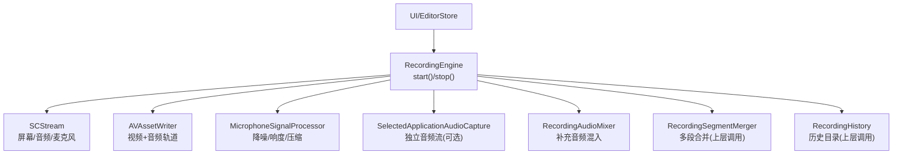
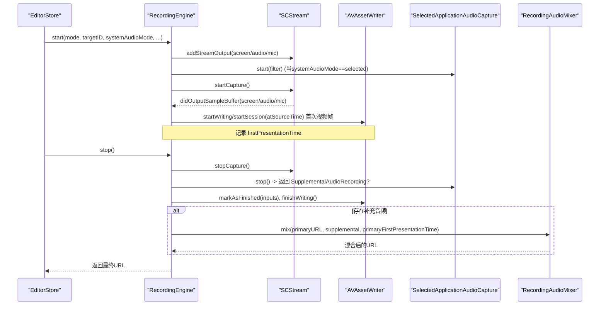
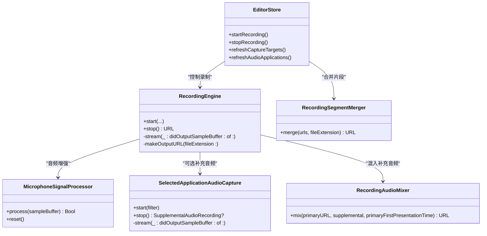

# 录制控制接口

<cite>
**本文引用的文件**
- [RecordingEngine.swift](file://Sources/ScreenFree/RecordingEngine.swift)
- [RecordingAudioMixer.swift](file://Sources/ScreenFree/RecordingAudioMixer.swift)
- [MicrophoneSignalProcessor.swift](file://Sources/ScreenFree/MicrophoneSignalProcessor.swift)
- [EditorStore.swift](file://Sources/ScreenFree/EditorStore.swift)
- [RecordingSegmentMerger.swift](file://Sources/ScreenFree/RecordingSegmentMerger.swift)
- [RecordingHistory.swift](file://Sources/ScreenFree/RecordingHistory.swift)
</cite>

## 目录
1. [简介](#简介)
2. [项目结构](#项目结构)
3. [核心组件](#核心组件)
4. [架构总览](#架构总览)
5. [详细组件分析](#详细组件分析)
6. [依赖关系分析](#依赖关系分析)
7. [性能考量](#性能考量)
8. [故障排查指南](#故障排查指南)
9. [结论](#结论)
10. [附录：调用示例与最佳实践](#附录调用示例与最佳实践)

## 简介
本文件面向“录制控制接口”的完整说明，聚焦于 RecordingEngine 的 start() 与 stop() 方法、录制过程中的状态管理（特别是 firstPresentationTime 的时间同步）、错误处理策略（RecordingError 枚举及混合阶段错误）、以及从初始化到完成的录制生命周期。文档同时给出基于 EditorStore 的调用流程与异常处理建议，帮助开发者正确集成并稳定使用录制能力。

## 项目结构
与录制控制相关的关键源码位于 Sources/ScreenFree 下：
- RecordingEngine.swift：录制引擎，封装屏幕/窗口捕获、系统音频与麦克风采集、AVAssetWriter 写入、时间同步与停止收尾。
- RecordingAudioMixer.swift：将“指定应用音频”作为补充音轨混入主视频，处理时间偏移对齐。
- MicrophoneSignalProcessor.swift：对系统音频或麦克风音频进行降噪、响度归一化、压缩等增强处理。
- EditorStore.swift：上层业务编排，负责权限检查、目标选择、倒计时、暂停/恢复、分段合并与历史更新。
- RecordingSegmentMerger.swift：多段录制片段合并为最终文件。
- RecordingHistory.swift：录制历史目录扫描与删除。

图表来源
- [RecordingEngine.swift:174-392](file://Sources/ScreenFree/RecordingEngine.swift#L174-L392)
- [RecordingEngine.swift:394-443](file://Sources/ScreenFree/RecordingEngine.swift#L394-L443)
- [RecordingAudioMixer.swift:29-135](file://Sources/ScreenFree/RecordingAudioMixer.swift#L29-L135)
- [MicrophoneSignalProcessor.swift:78-356](file://Sources/ScreenFree/MicrophoneSignalProcessor.swift#L78-L356)
- [EditorStore.swift:512-653](file://Sources/ScreenFree/EditorStore.swift#L512-L653)
- [RecordingSegmentMerger.swift:24-119](file://Sources/ScreenFree/RecordingSegmentMerger.swift#L24-L119)
- [RecordingHistory.swift:17-99](file://Sources/ScreenFree/RecordingHistory.swift#L17-L99)

章节来源
- [RecordingEngine.swift:1-691](file://Sources/ScreenFree/RecordingEngine.swift#L1-L691)
- [RecordingAudioMixer.swift:1-136](file://Sources/ScreenFree/RecordingAudioMixer.swift#L1-L136)
- [MicrophoneSignalProcessor.swift:1-356](file://Sources/ScreenFree/MicrophoneSignalProcessor.swift#L1-L356)
- [EditorStore.swift:512-774](file://Sources/ScreenFree/EditorStore.swift#L512-L774)
- [RecordingSegmentMerger.swift:1-119](file://Sources/ScreenFree/RecordingSegmentMerger.swift#L1-L119)
- [RecordingHistory.swift:1-99](file://Sources/ScreenFree/RecordingHistory.swift#L1-L99)

## 核心组件
- 录制模式与目标
  - CaptureMode：display/window/area 三种模式，分别对应全屏显示、窗口、区域录制。
  - CaptureTarget：包含 id、title、kind、frame、isPrimary 等信息，用于选择具体显示或窗口。
  - SystemAudioCaptureMode：all/selected/off 三种系统音频采集模式。
  - AudioApplicationOption：可被选中的系统音频应用列表。

- 录制引擎
  - RecordingEngine：实现 SCStreamOutput/SCStreamDelegate，维护 SCStream、AVAssetWriter、音视频输入轨道、信号处理器、firstPresentationTime、输出 URL、finishing 标志等。
  - SelectedApplicationAudioCapture：在 selected 模式下单独捕获指定应用的音频，生成 m4a 文件供后续混入。

- 音频增强
  - MicrophoneSignalProcessor：支持降噪、响度归一化、压缩，提供系统音频与麦克风的增强配置。

- 混音与合并
  - RecordingAudioMixer：将主视频与补充音频按时间偏移对齐后导出。
  - RecordingSegmentMerger：将多次录制片段合并为一个文件。

- 历史记录
  - RecordingHistoryCatalog：列出/删除 ScreenFree 目录下的录制文件。

章节来源
- [RecordingEngine.swift:6-117](file://Sources/ScreenFree/RecordingEngine.swift#L6-L117)
- [RecordingEngine.swift:119-172](file://Sources/ScreenFree/RecordingEngine.swift#L119-L172)
- [RecordingEngine.swift:533-674](file://Sources/ScreenFree/RecordingEngine.swift#L533-L674)
- [MicrophoneSignalProcessor.swift:6-76](file://Sources/ScreenFree/MicrophoneSignalProcessor.swift#L6-L76)
- [RecordingAudioMixer.swift:24-135](file://Sources/ScreenFree/RecordingAudioMixer.swift#L24-L135)
- [RecordingSegmentMerger.swift:24-119](file://Sources/ScreenFree/RecordingSegmentMerger.swift#L24-L119)
- [RecordingHistory.swift:17-99](file://Sources/ScreenFree/RecordingHistory.swift#L17-L99)

## 架构总览
录制控制的核心交互如下：
- 上层 EditorStore 负责用户交互、权限检查、参数准备与生命周期编排。
- RecordingEngine.start() 完成：
  - 构建 SCContentFilter 与 SCStreamConfiguration（像素格式、帧率、队列深度、是否捕获系统/麦克风音频）。
  - 创建 AVAssetWriter 与视频/系统音频/麦克风输入轨道。
  - 根据 systemAudioMode 决定是否启动 SelectedApplicationAudioCapture。
  - 注册 SCStreamOutput 回调，开始 capture。
- 录制过程中：
  - stream(_:didOutputSampleBuffer:of:) 接收屏幕/系统音频/麦克风样本，首次视频帧时启动 writer session 并记录 firstPresentationTime。
  - 音频样本可选择经过 MicrophoneSignalProcessor 增强后再写入。
- 录制结束：
  - RecordingEngine.stop() 停止 SCStream 与可选的 SelectedApplicationAudioCapture，标记 inputs 为 finished，等待 writer.finishWriting。
  - 若存在补充音频，调用 RecordingAudioMixer.mix() 将补充音频按 firstPresentationTime 对齐混入主视频。
  - 返回最终文件 URL。

图表来源
- [RecordingEngine.swift:174-392](file://Sources/ScreenFree/RecordingEngine.swift#L174-L392)
- [RecordingEngine.swift:394-443](file://Sources/ScreenFree/RecordingEngine.swift#L394-L443)
- [RecordingEngine.swift:445-509](file://Sources/ScreenFree/RecordingEngine.swift#L445-L509)
- [RecordingAudioMixer.swift:29-135](file://Sources/ScreenFree/RecordingAudioMixer.swift#L29-L135)

## 详细组件分析

### start() 方法参数与行为
- 参数说明
  - mode: CaptureMode（display/window/area）
  - targetID: UInt32?（显示 ID 或窗口 ID；nil 表示默认）
  - systemAudioMode: SystemAudioCaptureMode（all/selected/off）
  - selectedAudioApplicationIDs: Set<String>（selected 模式下需至少一个应用）
  - recordMicrophone: Bool（是否录制麦克风）
  - microphoneDeviceID: String?（麦克风设备标识，macOS 15+ 可用）
  - reduceMicrophoneNoise: Bool（麦克风降噪开关）
  - normalizeMicrophoneVolume: Bool（麦克风响度归一化）
  - normalizeSystemAudioVolume: Bool（系统音频响度归一化）
  - normalizedArea: CGRect（area 模式的相对区域，归一化坐标）

- 关键行为
  - 构建 SCContentFilter 与 SCStreamConfiguration：
    - 像素格式 kCVPixelFormatType_32BGRA
    - minimumFrameInterval=1/60s，queueDepth=8
    - showsCursor=false（光标由编辑器以元数据方式处理）
    - capturesAudio 取决于 systemAudioMode
    - sampleRate=48kHz，channelCount=2，excludesCurrentProcessAudio=true
    - macOS 15+ 时 captureMicrophone 与 microphoneCaptureDeviceID 生效
  - 根据 mode 设置 sourceRect/width/height（area 模式按 normalizedArea 计算），记录 sourceFrame
  - 创建 AVAssetWriter 与视频输入轨道（H.264，动态码率，最大 GOP=120）
  - 按需创建系统音频与麦克风输入轨道（AAC，48kHz，立体声，192kbps）
  - 根据增强设置初始化 MicrophoneSignalProcessor（系统音频与麦克风各自独立）
  - 若 systemAudioMode==selected，创建并启动 SelectedApplicationAudioCapture，输出 m4a 文件
  - 注册 SCStreamOutput 回调并开始 capture

章节来源
- [RecordingEngine.swift:174-392](file://Sources/ScreenFree/RecordingEngine.swift#L174-L392)
- [RecordingEngine.swift:282-351](file://Sources/ScreenFree/RecordingEngine.swift#L282-L351)
- [RecordingEngine.swift:352-392](file://Sources/ScreenFree/RecordingEngine.swift#L352-L392)

### stop() 方法与资源清理
- 步骤概览
  - 停止 SCStream 并清空引用
  - 停止 SelectedApplicationAudioCapture（如有），获取 SupplementalAudioRecording（含 url 与 firstPresentationTime）
  - 锁定内部状态，标记 finishing=true，释放信号处理器引用，收集 writer/inputs/url
  - 对所有 input 调用 markAsFinished()
  - 异步等待 writer.finishWriting()，成功则返回 primaryURL；失败抛出 writerFailed
  - 若存在 supplemental，调用 recordingAudioMixer.mix() 将补充音频按 primaryFirstPresentationTime 对齐混入，返回混合结果

- 资源清理要点
  - stream=nil，selectedAudioCapture=nil
  - systemAudioSignalProcessor/microphoneSignalProcessor=nil
  - inputs.markAsFinished() 确保所有轨道写入完成
  - writer.finishWriting() 完成后才返回 URL

章节来源
- [RecordingEngine.swift:394-443](file://Sources/ScreenFree/RecordingEngine.swift#L394-L443)

### 录制过程中的状态管理与时间同步
- firstPresentationTime 机制
  - 首次收到 .screen 样本且 writer.startWriting() 成功后，调用 writer.startSession(atSourceTime: presentationTime)，并将该时间保存为 firstPresentationTime
  - 后续样本需满足 presentationTime >= firstPresentationTime，否则丢弃（避免音频早于首帧导致 writer 永久失败）
  - 在混音阶段，primaryFirstPresentationTime 用于计算补充音频的插入偏移，保证音画同步

- 其他状态
  - finishing：防止在收尾阶段继续写入
  - outputURL：记录输出路径
  - sourceFrame：记录当前录制源矩形（用于 UI 高亮等）

章节来源
- [RecordingEngine.swift:445-509](file://Sources/ScreenFree/RecordingEngine.swift#L445-L509)
- [RecordingAudioMixer.swift:84-113](file://Sources/ScreenFree/RecordingAudioMixer.swift#L84-L113)

### 错误处理策略
- RecordingError 枚举
  - noSource：未找到可录制的显示或窗口
  - noAudioApplications：selected 模式下未选择任何应用
  - cannotStartWriter：无法添加输入轨道或启动 writer
  - cannotFinishWriter：无法完成录制收尾
  - writerFailed(details)：writer 完成阶段失败，附带详情

- 混合阶段错误（RecordingAudioMixError）
  - missingPrimaryVideo：主视频无视频轨道
  - cannotCreateTrack：无法创建组合轨道
  - cannotCreateExportSession：无法创建导出会话
  - exportFailed：导出失败

- 分段合并错误（RecordingSegmentMergeError）
  - noSegments：无可合并片段
  - cannotCreateTrack：无法创建组合轨道
  - cannotCreateExportSession：无法创建导出会话
  - exportFailed：导出失败

- 处理建议
  - 在 start() 前校验 availableTargets/availableAudioApplications
  - 捕获 cannotStartWriter/cannotFinishWriter 并提示用户重试或检查权限
  - 混合/合并失败时回滚临时文件，提示用户重新录制或导出

章节来源
- [RecordingEngine.swift:40-61](file://Sources/ScreenFree/RecordingEngine.swift#L40-L61)
- [RecordingEngine.swift:282-351](file://Sources/ScreenFree/RecordingEngine.swift#L282-L351)
- [RecordingEngine.swift:394-443](file://Sources/ScreenFree/RecordingEngine.swift#L394-L443)
- [RecordingAudioMixer.swift:4-22](file://Sources/ScreenFree/RecordingAudioMixer.swift#L4-L22)
- [RecordingSegmentMerger.swift:4-22](file://Sources/ScreenFree/RecordingSegmentMerger.swift#L4-L22)

### 录制生命周期管理（从初始化到完成）
- 初始化与准备
  - EditorStore.refreshCaptureTargets() 获取可用显示/窗口
  - EditorStore.refreshAudioApplications() 获取可捕获的应用列表
  - 用户选择模式、目标、音频选项、麦克风设备等

- 开始录制
  - EditorStore.startRecording() 执行倒计时、展示录制面板、调用 recorder.start(...)
  - RecordingEngine.start() 完成 SCStream/AVAssetWriter 初始化与回调注册

- 录制中
  - 回调持续写入样本，必要时进行音频增强
  - EditorStore 维护计时器、暂停/恢复逻辑

- 停止录制
  - EditorStore.stopRecording() 调用 recorder.stop()，合并片段，刷新历史，进入编辑流程

- 完成
  - 返回最终文件 URL，UI 加载并进入时间线编辑

章节来源
- [EditorStore.swift:466-510](file://Sources/ScreenFree/EditorStore.swift#L466-L510)
- [EditorStore.swift:512-653](file://Sources/ScreenFree/EditorStore.swift#L512-L653)
- [EditorStore.swift:662-700](file://Sources/ScreenFree/EditorStore.swift#L662-L700)
- [RecordingSegmentMerger.swift:24-119](file://Sources/ScreenFree/RecordingSegmentMerger.swift#L24-L119)
- [RecordingHistory.swift:40-78](file://Sources/ScreenFree/RecordingHistory.swift#L40-L78)

## 依赖关系分析
- RecordingEngine 依赖
  - ScreenCaptureKit：SCStream、SCContentFilter、SCShareableContent
  - AVFoundation：AVAssetWriter、AVAssetWriterInput、AVAssetExportSession
  - CoreMedia：CMTime、CMSampleBuffer
  - MicrophoneSignalProcessor：音频增强
  - RecordingAudioMixer：补充音频混入
  - SelectedApplicationAudioCapture：独立音频捕获

- EditorStore 依赖
  - RecordingEngine：录制控制
  - RecordingSegmentMerger：片段合并
  - DeviceMonitor：摄像头录制（可选）
  - RecordingHistoryCatalog：历史管理

图表来源
- [RecordingEngine.swift:63-82](file://Sources/ScreenFree/RecordingEngine.swift#L63-L82)
- [RecordingEngine.swift:533-674](file://Sources/ScreenFree/RecordingEngine.swift#L533-L674)
- [MicrophoneSignalProcessor.swift:78-356](file://Sources/ScreenFree/MicrophoneSignalProcessor.swift#L78-L356)
- [RecordingAudioMixer.swift:29-135](file://Sources/ScreenFree/RecordingAudioMixer.swift#L29-L135)
- [RecordingSegmentMerger.swift:24-119](file://Sources/ScreenFree/RecordingSegmentMerger.swift#L24-L119)
- [EditorStore.swift:512-774](file://Sources/ScreenFree/EditorStore.swift#L512-L774)

## 性能考量
- 队列与线程
  - captureQueue 设置为 userInteractive QoS，确保低延迟采样处理
  - SelectedApplicationAudioCapture 使用 userInitiated QoS 队列
- 帧率与缓冲
  - minimumFrameInterval=1/60s，queueDepth=8，平衡吞吐与内存占用
  - 窗口模式 width/height 放大 2x 以提升清晰度
- 编码参数
  - H.264 视频，动态码率基于分辨率估算，GOP 上限 120
  - AAC 音频 48kHz/立体声/192kbps
- 音频增强
  - 降噪与响度归一化仅在启用时运行，减少 CPU 开销
  - 自动增益平滑响应，避免突变

[本节为通用指导，不直接分析具体文件]

## 故障排查指南
- 常见问题
  - 无可用源：检查 CGPreflightScreenCaptureAccess 权限与 availableTargets 结果
  - 未选择应用：selected 模式下必须选择至少一个应用
  - 无法启动 writer：确认 canAdd(input) 成功，检查磁盘空间与权限
  - 无法完成收尾：检查 writer.status，查看 writer.error 详情
  - 混合失败：确认主视频有视频轨道，补充音频存在且时间戳有效
  - 合并失败：确保片段非空且格式一致

- 调试建议
  - 打印 firstPresentationTime 与样本时间戳，验证时序
  - 在 stop() 中捕获 writerFailed 并记录详细信息
  - 检查临时文件是否被清理（m4a 补充音频）

章节来源
- [RecordingEngine.swift:40-61](file://Sources/ScreenFree/RecordingEngine.swift#L40-L61)
- [RecordingEngine.swift:394-443](file://Sources/ScreenFree/RecordingEngine.swift#L394-L443)
- [RecordingAudioMixer.swift:4-22](file://Sources/ScreenFree/RecordingAudioMixer.swift#L4-L22)
- [RecordingSegmentMerger.swift:4-22](file://Sources/ScreenFree/RecordingSegmentMerger.swift#L4-L22)

## 结论
RecordingEngine 提供了完整的录制控制能力，涵盖多种录制模式、灵活的音频采集与增强、严格的时间同步与完善的错误处理。配合 EditorStore 的生命周期编排与 RecordingSegmentMerger/RecordingAudioMixer 的后处理，可实现稳定高效的屏幕录制体验。开发者应重点关注权限检查、参数校验、firstPresentationTime 同步与错误分支处理，以确保录制过程健壮可靠。

[本节为总结性内容，不直接分析具体文件]

## 附录：调用示例与最佳实践
- 基本调用流程（伪代码描述）
  - 初始化 EditorStore，刷新可用目标与音频应用
  - 用户选择模式、目标、音频选项、麦克风设备
  - 调用 startRecording() 执行倒计时与录制启动
  - 录制中可暂停/恢复，EditorStore 会重新调用 recorder.start(...)
  - 调用 stopRecording() 停止录制，合并片段，刷新历史
  - 处理可能的错误：noSource、noAudioApplications、cannotStartWriter、cannotFinishWriter、writerFailed

- 异常处理策略
  - 捕获 RecordingError 并提示用户（如权限不足、无可用源、未选择应用）
  - 捕获混合/合并错误，提示用户重试或重新录制
  - 在 stop() 失败时清理临时文件，避免残留

- 最佳实践
  - 始终先校验 availableTargets/availableAudioApplications
  - 合理设置 area 模式的 normalizedArea，避免过小区域影响质量
  - 启用麦克风增强时权衡音质与 CPU 占用
  - 在 selected 模式下确保至少选择一个应用
  - 记录 firstPresentationTime 与样本时间戳以便调试时序问题

章节来源
- [EditorStore.swift:466-510](file://Sources/ScreenFree/EditorStore.swift#L466-L510)
- [EditorStore.swift:512-653](file://Sources/ScreenFree/EditorStore.swift#L512-L653)
- [EditorStore.swift:662-700](file://Sources/ScreenFree/EditorStore.swift#L662-L700)
- [RecordingEngine.swift:174-392](file://Sources/ScreenFree/RecordingEngine.swift#L174-L392)
- [RecordingEngine.swift:394-443](file://Sources/ScreenFree/RecordingEngine.swift#L394-L443)
- [RecordingSegmentMerger.swift:24-119](file://Sources/ScreenFree/RecordingSegmentMerger.swift#L24-L119)
- [RecordingHistory.swift:40-78](file://Sources/ScreenFree/RecordingHistory.swift#L40-L78)