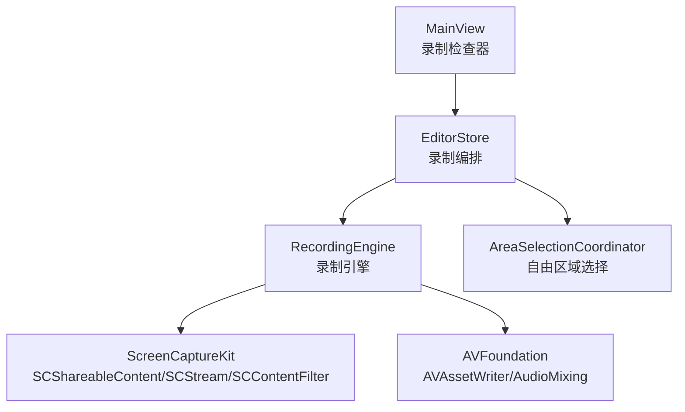
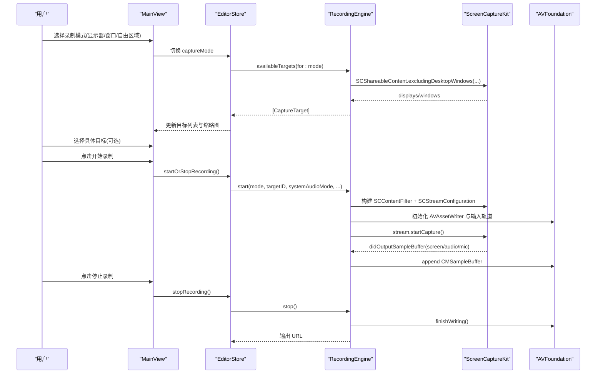
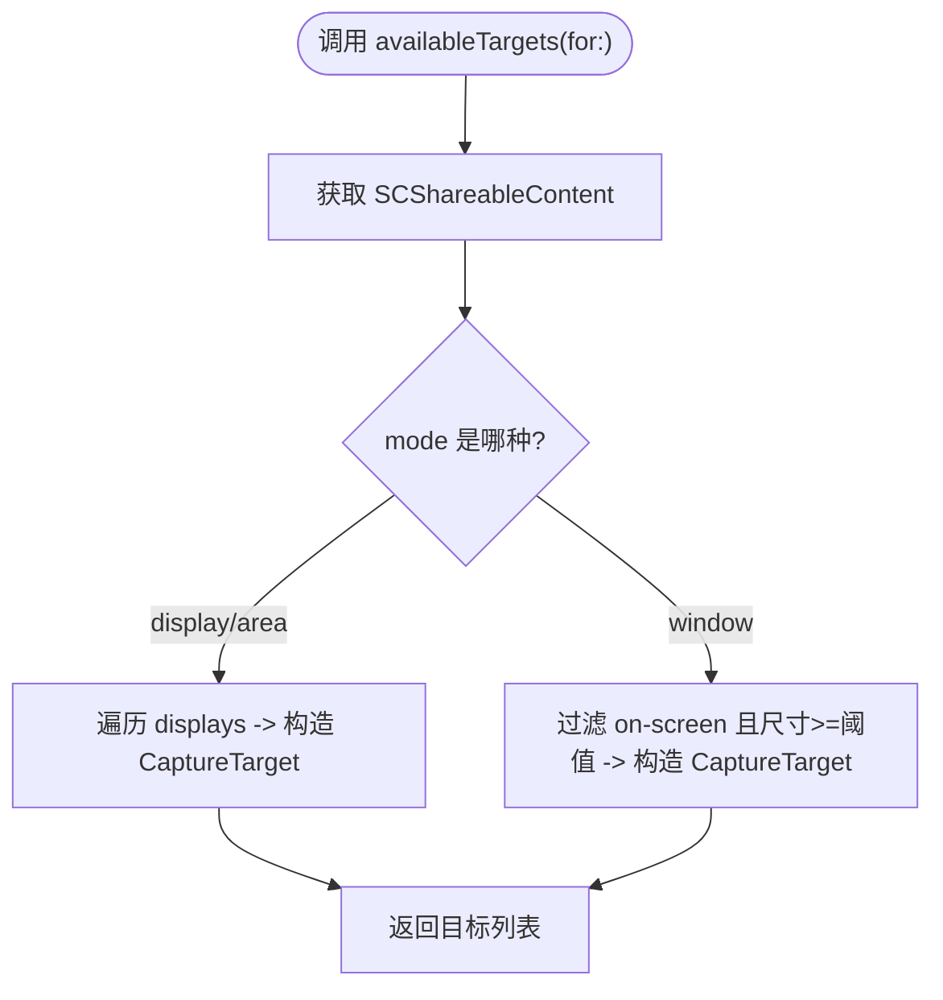
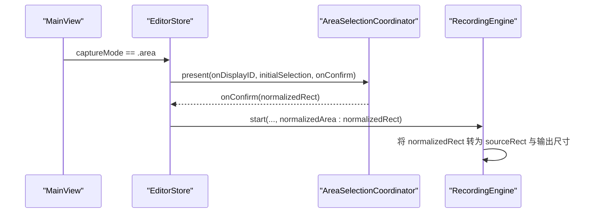
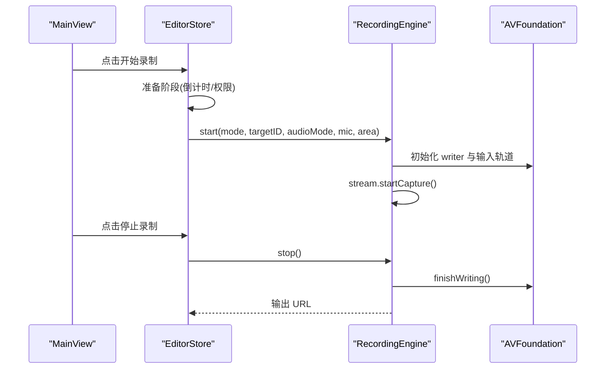
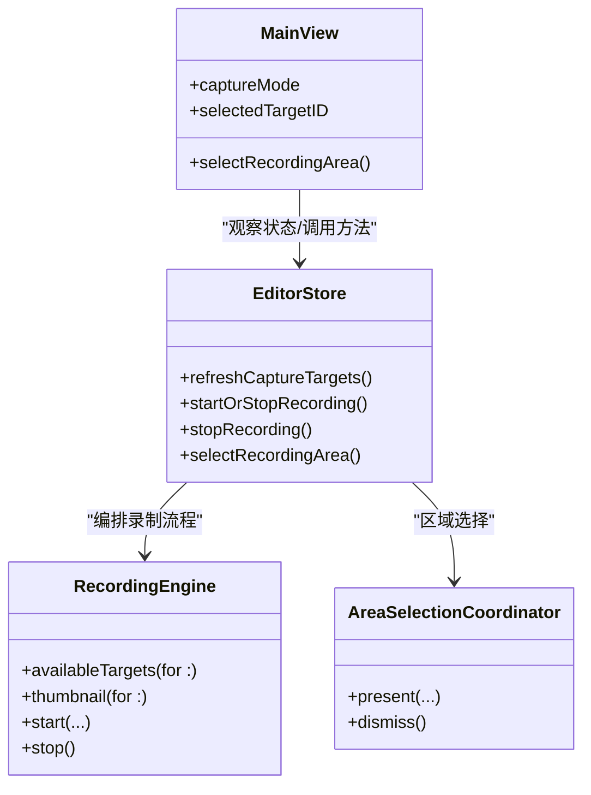

# 录制模式配置

<cite>
**本文引用的文件**   
- [RecordingEngine.swift](file://Sources/ScreenFree/RecordingEngine.swift)
- [EditorStore.swift](file://Sources/ScreenFree/EditorStore.swift)
- [MainView.swift](file://Sources/ScreenFree/MainView.swift)
- [AreaSelectionCoordinator.swift](file://Sources/ScreenFree/AreaSelectionCoordinator.swift)
</cite>

## 目录
1. [简介](#简介)
2. [项目结构](#项目结构)
3. [核心组件](#核心组件)
4. [架构总览](#架构总览)
5. [详细组件分析](#详细组件分析)
6. [依赖关系分析](#依赖关系分析)
7. [性能考量](#性能考量)
8. [故障排查指南](#故障排查指南)
9. [结论](#结论)
10. [附录](#附录)

## 简介
本文件面向屏幕录制功能的“录制模式配置”，围绕三种录制模式（显示器、窗口、自由区域）展开，详细说明：
- CaptureMode 枚举的含义与适用场景
- 可用目标设备检测 API availableTargets(for:) 的用法
- 不同模式下 SCContentFilter 的创建方式与关键配置项
- 如何根据用户需求选择录制模式、处理设备变更事件以及错误处理策略
- 自由区域选择的交互流程与参数传递

## 项目结构
与录制模式配置直接相关的代码主要分布在以下模块：
- RecordingEngine：封装 ScreenCaptureKit 的流式采集、SCContentFilter 构建、AVAssetWriter 写入、音频混合等核心逻辑
- EditorStore：UI 状态与业务编排，负责刷新目标列表、启动/停止录制、调用 AreaSelectionCoordinator 进行区域选择
- MainView：录制检查器 UI，提供模式切换、目标选择、权限提示与刷新按钮
- AreaSelectionCoordinator：全屏覆盖面板，用于拖拽选择自由区域并返回归一化矩形

图表来源 
- [RecordingEngine.swift:1-120](file://Sources/ScreenFree/RecordingEngine.swift#L1-L120)
- [EditorStore.swift:453-618](file://Sources/ScreenFree/EditorStore.swift#L453-L618)
- [MainView.swift:1409-1457](file://Sources/ScreenFree/MainView.swift#L1409-L1457)
- [AreaSelectionCoordinator.swift:1-72](file://Sources/ScreenFree/AreaSelectionCoordinator.swift#L1-L72)

章节来源
- [RecordingEngine.swift:1-120](file://Sources/ScreenFree/RecordingEngine.swift#L1-L120)
- [EditorStore.swift:453-618](file://Sources/ScreenFree/EditorStore.swift#L453-L618)
- [MainView.swift:1409-1457](file://Sources/ScreenFree/MainView.swift#L1409-L1457)
- [AreaSelectionCoordinator.swift:1-72](file://Sources/ScreenFree/AreaSelectionCoordinator.swift#L1-L72)

## 核心组件
- CaptureMode 枚举：定义三种录制模式（显示器、窗口、自由区域），作为 UI 与录制引擎之间的模式契约
- CaptureTarget：描述可录制的显示或窗口目标，包含 id、标题、类型、帧与是否主屏等元数据
- RecordingEngine：实现 availableTargets(for:)、thumbnail(for:)、start(...)、stop() 等核心方法，负责 SCContentFilter 构建与媒体写入
- EditorStore：维护 captureMode、selectedTargetID、selectedAreaNormalized、systemAudioMode 等状态，协调 UI 与录制引擎
- AreaSelectionCoordinator：提供全屏区域选择面板，返回归一化的 CGRect 供录制引擎使用

章节来源
- [RecordingEngine.swift:6-38](file://Sources/ScreenFree/RecordingEngine.swift#L6-L38)
- [RecordingEngine.swift:85-117](file://Sources/ScreenFree/RecordingEngine.swift#L85-L117)
- [EditorStore.swift:124-138](file://Sources/ScreenFree/EditorStore.swift#L124-L138)
- [AreaSelectionCoordinator.swift:5-42](file://Sources/ScreenFree/AreaSelectionCoordinator.swift#L5-L42)

## 架构总览
下图展示从用户选择录制模式到实际开始录制的完整调用链，包括可用目标获取、SCContentFilter 构建、流输出与写入。

图表来源 
- [MainView.swift:1409-1457](file://Sources/ScreenFree/MainView.swift#L1409-L1457)
- [EditorStore.swift:453-618](file://Sources/ScreenFree/EditorStore.swift#L453-L618)
- [RecordingEngine.swift:85-117](file://Sources/ScreenFree/RecordingEngine.swift#L85-L117)
- [RecordingEngine.swift:174-392](file://Sources/ScreenFree/RecordingEngine.swift#L174-L392)

## 详细组件分析

### CaptureMode 与适用场景
- 显示器（Display）：适用于整屏录制，适合演示、会议、教程等需要完整桌面内容的场景
- 窗口（Window）：适用于仅录制某个应用窗口，避免无关内容进入画面，适合软件操作演示
- 自由区域（Area）：适用于仅需录制屏幕某一部分的场景，如局部界面、弹窗、特定控件

章节来源
- [RecordingEngine.swift:6-12](file://Sources/ScreenFree/RecordingEngine.swift#L6-L12)
- [MainView.swift:1409-1427](file://Sources/ScreenFree/MainView.swift#L1409-L1427)

### 可用目标检测 API availableTargets(for:)
- 通过 SCShareableContent.excludingDesktopWindows(false, onScreenWindowsOnly: true) 获取当前可用的显示与窗口
- 当 mode 为 .display 或 .area 时，返回所有显示器信息（id、标题、frame、是否主屏）
- 当 mode 为 .window 时，过滤出在屏且尺寸满足最小阈值的窗口，生成 CaptureTarget 列表
- 该方法由 EditorStore.refreshCaptureTargets() 调用，并在失败时设置权限问题标志

图表来源 
- [RecordingEngine.swift:85-117](file://Sources/ScreenFree/RecordingEngine.swift#L85-L117)
- [EditorStore.swift:457-480](file://Sources/ScreenFree/EditorStore.swift#L457-L480)

章节来源
- [RecordingEngine.swift:85-117](file://Sources/ScreenFree/RecordingEngine.swift#L85-L117)
- [EditorStore.swift:457-480](file://Sources/ScreenFree/EditorStore.swift#L457-L480)

### SCContentFilter 的创建与配置选项
- 显示器/自由区域模式：
  - 使用 display 构造 SCContentFilter，排除自身进程以避免自录
  - 自由区域模式额外设置 sourceRect 与 width/height，限定捕获区域与输出分辨率
- 窗口模式：
  - 使用 desktopIndependentWindow(window) 构造 SCContentFilter，仅捕获该窗口
- 系统音频模式：
  - all：启用 capturesAudio=true，同时添加系统音频输出轨道
  - selected：基于所选应用集合构造 SCContentFilter，单独录制选定应用的音频
  - off：不捕获系统音频
- 其他配置：
  - pixelFormat、minimumFrameInterval、queueDepth、showsCursor=false、sampleRate=48k、channelCount=2、excludesCurrentProcessAudio=true
  - macOS 15+ 支持麦克风捕获与设备 ID 指定

章节来源
- [RecordingEngine.swift:174-262](file://Sources/ScreenFree/RecordingEngine.swift#L174-L262)
- [RecordingEngine.swift:264-280](file://Sources/ScreenFree/RecordingEngine.swift#L264-L280)
- [RecordingEngine.swift:191-207](file://Sources/ScreenFree/RecordingEngine.swift#L191-L207)

### 自由区域选择流程与参数
- 当 captureMode 切换到 .area 时，EditorStore.selectRecordingArea() 会调用 AreaSelectionCoordinator.present(...)
- 全屏面板允许用户在屏幕上拖拽绘制矩形，返回归一化的 CGRect（相对屏幕宽高）
- 录制引擎在 start(...) 中将归一化区域映射为绝对像素坐标，设置 sourceRect 与输出尺寸

图表来源 
- [MainView.swift:1409-1427](file://Sources/ScreenFree/MainView.swift#L1409-L1427)
- [AreaSelectionCoordinator.swift:8-42](file://Sources/ScreenFree/AreaSelectionCoordinator.swift#L8-L42)
- [RecordingEngine.swift:228-247](file://Sources/ScreenFree/RecordingEngine.swift#L228-L247)

章节来源
- [AreaSelectionCoordinator.swift:8-42](file://Sources/ScreenFree/AreaSelectionCoordinator.swift#L8-L42)
- [RecordingEngine.swift:228-247](file://Sources/ScreenFree/RecordingEngine.swift#L228-L247)

### 录制启动与停止序列
- 启动：
  - EditorStore.startOrStopRecording() 判断当前状态，若未录制则进入准备阶段（倒计时、权限检查）
  - 调用 RecordingEngine.start(...) 构建 filter 与 configuration，初始化 AVAssetWriter 与输入轨道
  - 根据 systemAudioMode 决定是否添加系统音频与麦克风轨道
- 停止：
  - EditorStore.stopRecording() 调用 recorder.stop()，合并片段，必要时混音相机与系统音频
  - 最终输出 URL，并根据 afterRecordingAction 执行编辑、保存或剪贴板复制

图表来源 
- [EditorStore.swift:493-618](file://Sources/ScreenFree/EditorStore.swift#L493-L618)
- [RecordingEngine.swift:174-392](file://Sources/ScreenFree/RecordingEngine.swift#L174-L392)

章节来源
- [EditorStore.swift:493-618](file://Sources/ScreenFree/EditorStore.swift#L493-L618)
- [RecordingEngine.swift:174-392](file://Sources/ScreenFree/RecordingEngine.swift#L174-L392)

### 错误处理策略
- 无可用源：availableTargets(for:) 或 start(...) 找不到目标时抛出 noSource
- 音频应用为空：selected 模式但未选择任何应用时抛出 noAudioApplications
- 写入器异常：无法启动或结束写入时抛出 cannotStartWriter/cannotFinishWriter/writerFailed(details)
- UI 层：EditorStore.refreshCaptureTargets() 捕获权限错误并设置 capturePermissionIssue，提示用户开启权限

章节来源
- [RecordingEngine.swift:40-61](file://Sources/ScreenFree/RecordingEngine.swift#L40-L61)
- [RecordingEngine.swift:85-117](file://Sources/ScreenFree/RecordingEngine.swift#L85-L117)
- [RecordingEngine.swift:264-280](file://Sources/ScreenFree/RecordingEngine.swift#L264-L280)
- [EditorStore.swift:457-480](file://Sources/ScreenFree/EditorStore.swift#L457-L480)

## 依赖关系分析
- MainView 依赖 EditorStore 的状态与行为，驱动录制检查器的 UI 交互
- EditorStore 依赖 RecordingEngine 进行实际的屏幕与音频采集，依赖 AreaSelectionCoordinator 进行区域选择
- RecordingEngine 依赖 ScreenCaptureKit 与 AVFoundation，完成内容过滤、流式采集与媒体写入
- 各组件之间通过明确的方法签名与数据结构（CaptureMode、CaptureTarget、CGRect）解耦

图表来源 
- [MainView.swift:1409-1457](file://Sources/ScreenFree/MainView.swift#L1409-L1457)
- [EditorStore.swift:453-618](file://Sources/ScreenFree/EditorStore.swift#L453-L618)
- [RecordingEngine.swift:85-117](file://Sources/ScreenFree/RecordingEngine.swift#L85-L117)
- [AreaSelectionCoordinator.swift:8-42](file://Sources/ScreenFree/AreaSelectionCoordinator.swift#L8-L42)

章节来源
- [MainView.swift:1409-1457](file://Sources/ScreenFree/MainView.swift#L1409-L1457)
- [EditorStore.swift:453-618](file://Sources/ScreenFree/EditorStore.swift#L453-L618)
- [RecordingEngine.swift:85-117](file://Sources/ScreenFree/RecordingEngine.swift#L85-L117)
- [AreaSelectionCoordinator.swift:8-42](file://Sources/ScreenFree/AreaSelectionCoordinator.swift#L8-L42)

## 性能考量
- 帧率与队列深度：minimumFrameInterval=1/60s，queueDepth=8，平衡延迟与吞吐
- 像素格式与分辨率：BGRA 格式，窗口模式输出尺寸按窗口大小×2限制，避免过大内存占用
- 音频采样：48kHz、双声道，AAC 编码，比特率 192kbps
- 光标处理：source 视频不包含光标，光标以独立元数据轨记录，便于后期编辑与缩放
- 麦克风与系统音频：可选降噪与音量归一化，减少噪声与动态范围波动

章节来源
- [RecordingEngine.swift:191-207](file://Sources/ScreenFree/RecordingEngine.swift#L191-L207)
- [RecordingEngine.swift:250-262](file://Sources/ScreenFree/RecordingEngine.swift#L250-L262)
- [RecordingEngine.swift:301-326](file://Sources/ScreenFree/RecordingEngine.swift#L301-L326)

## 故障排查指南
- 权限问题：
  - 现象：availableTargets(for:) 抛错，UI 显示“需要屏幕录制权限”
  - 处理：引导用户打开系统设置中的屏幕录制权限，或调用请求权限接口
- 无可用源：
  - 现象：start(...) 抛出 noSource
  - 处理：确认目标存在且处于前台；窗口模式需确保窗口尺寸满足最小阈值
- 音频问题：
  - 现象：selected 模式未选择任何应用，抛出 noAudioApplications
  - 处理：至少选择一个应用；或在 all 模式下启用系统音频
- 写入失败：
  - 现象：cannotStartWriter/cannotFinishWriter/writerFailed(details)
  - 处理：检查磁盘空间与权限；查看 writer.status 与 error 详情

章节来源
- [RecordingEngine.swift:40-61](file://Sources/ScreenFree/RecordingEngine.swift#L40-L61)
- [EditorStore.swift:457-480](file://Sources/ScreenFree/EditorStore.swift#L457-L480)

## 结论
通过 CaptureMode 与 availableTargets(for:) 的组合，用户可以灵活选择显示器、窗口或自由区域的录制模式。RecordingEngine 在不同模式下正确构建 SCContentFilter 与 SCStreamConfiguration，配合 AVFoundation 完成高质量的视频与音频录制。EditorStore 与 MainView 协同提供直观的 UI 与完善的错误处理，确保录制流程稳定可靠。

## 附录
- 常用配置项速查：
  - 像素格式：kCVPixelFormatType_32BGRA
  - 帧间隔：CMTime(value: 1, timescale: 60)
  - 队列深度：8
  - 音频采样率：48000Hz，通道数：2
  - 编码器：H.264（视频）、AAC（音频）
- 自由区域参数：
  - normalizedArea：归一化 CGRect（相对屏幕宽高）
  - sourceRect：绝对像素坐标，由 normalizedArea 映射得到

章节来源
- [RecordingEngine.swift:191-207](file://Sources/ScreenFree/RecordingEngine.swift#L191-L207)
- [RecordingEngine.swift:228-247](file://Sources/ScreenFree/RecordingEngine.swift#L228-L247)