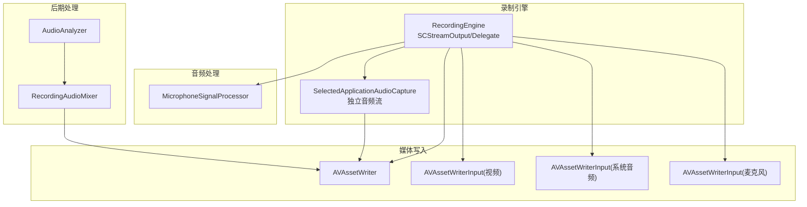
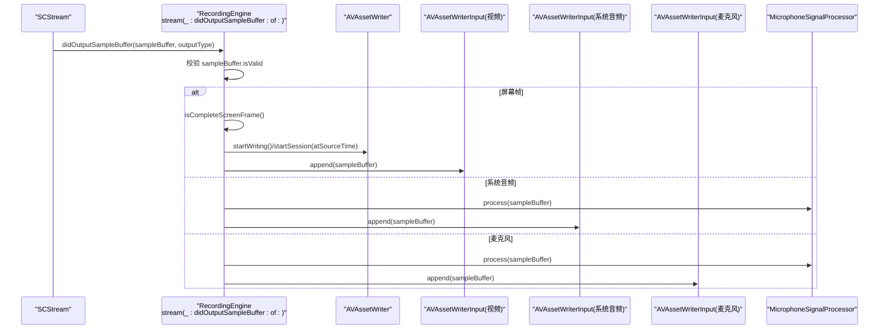
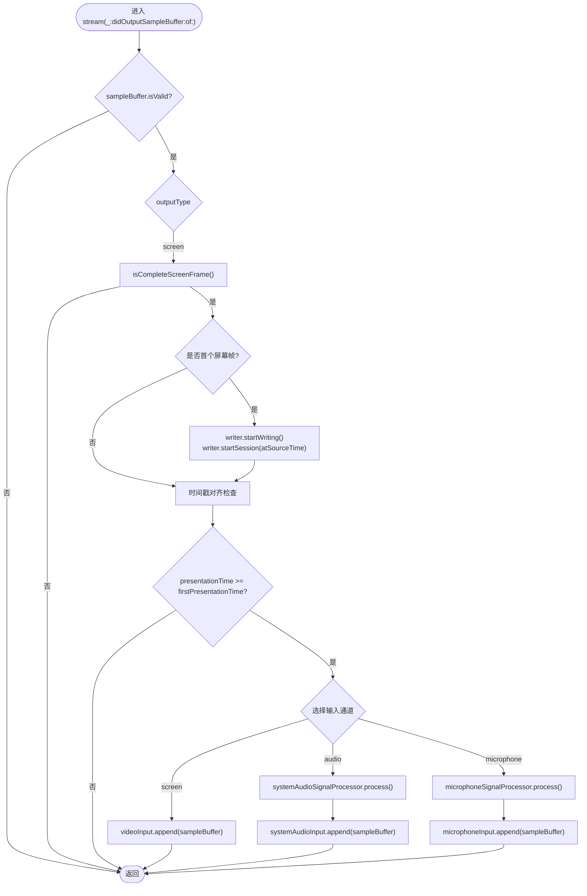
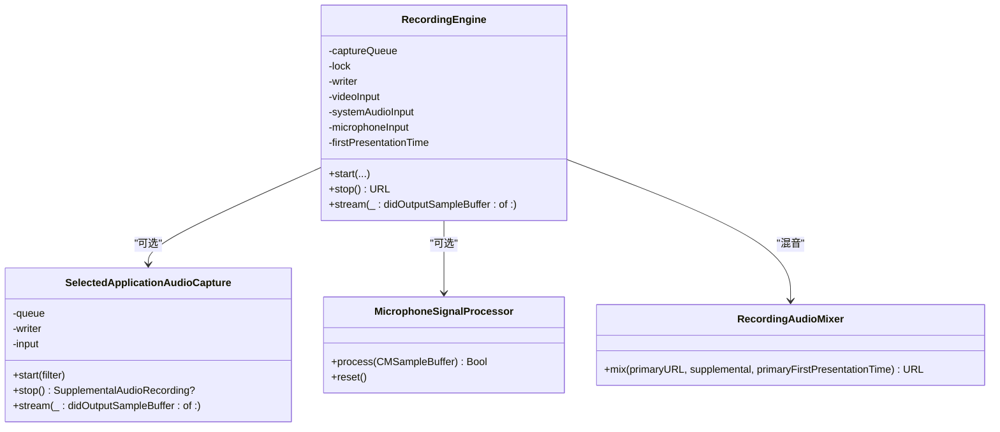

# 流输出处理

<cite>
**本文引用的文件**   
- [RecordingEngine.swift](file://Sources/ScreenFree/RecordingEngine.swift)
- [MicrophoneSignalProcessor.swift](file://Sources/ScreenFree/MicrophoneSignalProcessor.swift)
- [AudioAnalyzer.swift](file://Sources/ScreenFree/AudioAnalyzer.swift)
- [RecordingAudioMixer.swift](file://Sources/ScreenFree/RecordingAudioMixer.swift)
- [README.md](file://README.md)
</cite>

## 目录
1. [简介](#简介)
2. [项目结构](#项目结构)
3. [核心组件](#核心组件)
4. [架构总览](#架构总览)
5. [详细组件分析](#详细组件分析)
6. [依赖关系分析](#依赖关系分析)
7. [性能考量](#性能考量)
8. [故障排查指南](#故障排查指南)
9. [结论](#结论)
10. [附录：自定义流处理器与调优示例](#附录自定义流处理器与调优示例)

## 简介
本文件聚焦于屏幕录制应用中的“流输出处理”机制，重点解析 stream(_:didOutputSampleBuffer:of:) 的实现原理与数据路径。内容涵盖：
- 屏幕、系统音频、麦克风三类媒体流的采集与写入流程
- CMSampleBuffer 的处理要点：时间戳管理、帧完整性检查、数据写入
- AVAssetWriterInput 的使用方式与不同输出类型的输入通道选择
- 实时数据处理的关键技术：队列管理、线程安全、性能优化
- 流中断与错误恢复机制
- 自定义流处理器实现思路与性能调优技巧

## 项目结构
本项目采用模块化组织，核心录制逻辑集中在 ScreenFree 模块中：
- RecordingEngine：统一编排 SCStream 的屏幕/系统音频/麦克风流，维护 AVAssetWriter 及多个 AVAssetWriterInput，并实现 stream(_:didOutputSampleBuffer:of:) 回调
- MicrophoneSignalProcessor：对 PCM 音频进行降噪、自动增益、压缩等实时处理
- AudioAnalyzer：离线分析已录制音频的波形、RMS、峰值包络等
- RecordingAudioMixer：将主录制的视频与可选的“选定应用音频”混音合成最终 MP4

图表来源
- [RecordingEngine.swift:63-531](file://Sources/ScreenFree/RecordingEngine.swift#L63-L531)
- [RecordingEngine.swift:533-674](file://Sources/ScreenFree/RecordingEngine.swift#L533-L674)
- [RecordingAudioMixer.swift:29-136](file://Sources/ScreenFree/RecordingAudioMixer.swift#L29-L136)
- [AudioAnalyzer.swift:110-332](file://Sources/ScreenFree/AudioAnalyzer.swift#L110-L332)

章节来源
- [RecordingEngine.swift:63-531](file://Sources/ScreenFree/RecordingEngine.swift#L63-L531)
- [RecordingEngine.swift:533-674](file://Sources/ScreenFree/RecordingEngine.swift#L533-L674)
- [RecordingAudioMixer.swift:29-136](file://Sources/ScreenFree/RecordingAudioMixer.swift#L29-L136)
- [AudioAnalyzer.swift:110-332](file://Sources/ScreenFree/AudioAnalyzer.swift#L110-L332)

## 核心组件
- RecordingEngine：负责创建 SCStream、配置像素格式/帧率/音频采样率、初始化 AVAssetWriter 与多路 AVAssetWriterInput（视频、系统音频、麦克风），并在 stream(_:didOutputSampleBuffer:of:) 中完成时间戳对齐、帧完整性校验与写入。
- SelectedApplicationAudioCapture：当选择“仅特定应用音频”时，单独启动一个 SCStream 捕获该应用的音频，独立写入 M4A，最后通过 RecordingAudioMixer 与主视频混音。
- MicrophoneSignalProcessor：在音频进入编码器前进行实时信号处理（降噪、自动增益、压缩限幅）。
- RecordingAudioMixer：使用 AVMutableComposition 将主视频与补充音频轨道合并导出为最终 MP4。
- AudioAnalyzer：用于离线分析音频的 RMS、峰值、波形包络，辅助 UI 显示与后续处理。

章节来源
- [RecordingEngine.swift:174-392](file://Sources/ScreenFree/RecordingEngine.swift#L174-L392)
- [RecordingEngine.swift:445-509](file://Sources/ScreenFree/RecordingEngine.swift#L445-L509)
- [RecordingEngine.swift:533-674](file://Sources/ScreenFree/RecordingEngine.swift#L533-L674)
- [MicrophoneSignalProcessor.swift:78-356](file://Sources/ScreenFree/MicrophoneSignalProcessor.swift#L78-L356)
- [RecordingAudioMixer.swift:29-136](file://Sources/ScreenFree/RecordingAudioMixer.swift#L29-L136)
- [AudioAnalyzer.swift:110-332](file://Sources/ScreenFree/AudioAnalyzer.swift#L110-L332)

## 架构总览
下图展示了从 SCStream 到 AVAssetWriter 的完整数据流，以及三种输出类型（屏幕、系统音频、麦克风）的路由与处理分支。

图表来源
- [RecordingEngine.swift:445-509](file://Sources/ScreenFree/RecordingEngine.swift#L445-L509)
- [RecordingEngine.swift:491-504](file://Sources/ScreenFree/RecordingEngine.swift#L491-L504)
- [MicrophoneSignalProcessor.swift:95-207](file://Sources/ScreenFree/MicrophoneSignalProcessor.swift#L95-L207)

## 详细组件分析

### stream(_:didOutputSampleBuffer:of:) 实现原理
- 入口参数：CMSampleBuffer 与 SCStreamOutputType（.screen/.audio/.microphone）
- 基本校验：sampleBuffer.isValid；屏幕帧需满足 isCompleteScreenFrame()
- 首次帧与时间戳：
  - 首个屏幕帧触发 writer.startWriting() 与 writer.startSession(atSourceTime:)
  - 记录 firstPresentationTime，用于后续时间戳对齐
- 时间戳对齐：
  - 若 sampleBuffer.presentationTimeStamp < firstPresentationTime，直接丢弃，避免 AVAssetWriter 因早于会话起始时间而永久失败
- 路由与写入：
  - .screen → videoInput
  - .audio → systemAudioInput（可经 systemAudioSignalProcessor 处理）
  - .microphone → microphoneInput（可经 microphoneSignalProcessor 处理）
  - 写入前检查 input.isReadyForMoreMediaData，避免阻塞或丢帧
- 并发与锁：
  - 使用 NSLock 保护 writer/input 状态与 firstPresentationTime
  - 所有回调在同一 captureQueue 上执行，降低竞态风险

图表来源
- [RecordingEngine.swift:445-509](file://Sources/ScreenFree/RecordingEngine.swift#L445-L509)
- [RecordingEngine.swift:491-504](file://Sources/ScreenFree/RecordingEngine.swift#L491-L504)

章节来源
- [RecordingEngine.swift:445-509](file://Sources/ScreenFree/RecordingEngine.swift#L445-L509)
- [RecordingEngine.swift:491-504](file://Sources/ScreenFree/RecordingEngine.swift#L491-L504)

### CMSampleBuffer 处理流程
- 有效性检查：isValid
- 屏幕帧完整性：isCompleteScreenFrame() 通过 CMSampleBufferGetSampleAttachmentsArray 获取 SCStreamFrameInfo.status，确保为 complete
- 时间戳管理：
  - 首个屏幕帧决定 writer.startSession(atSourceTime:)
  - 后续样本必须满足 presentationTimeStamp >= firstPresentationTime
- 数据写入：input.append(sampleBuffer)，仅在 isReadyForMoreMediaData 为真时写入

章节来源
- [RecordingEngine.swift:445-509](file://Sources/ScreenFree/RecordingEngine.swift#L445-L509)
- [RecordingEngine.swift:491-504](file://Sources/ScreenFree/RecordingEngine.swift#L491-L504)

### AVAssetWriterInput 的使用与通道选择
- 视频输入：H.264，分辨率与比特率根据配置动态计算，expectsMediaDataInRealTime = true
- 系统音频输入：AAC，48kHz 立体声，比特率 192kbps，expectsMediaDataInRealTime = true
- 麦克风输入：同系统音频设置，expectsMediaDataInRealTime = true
- 选择策略：
  - 根据 outputType 选择对应 input
  - 系统音频与麦克风可分别接入不同的信号处理器

章节来源
- [RecordingEngine.swift:284-326](file://Sources/ScreenFree/RecordingEngine.swift#L284-L326)
- [RecordingEngine.swift:473-488](file://Sources/ScreenFree/RecordingEngine.swift#L473-L488)

### 实时数据处理机制
- 队列管理：
  - captureQueue 用于 SCStream 回调，QoS.userInteractive，保证低延迟
  - SelectedApplicationAudioCapture 使用独立 queue（userInitiated）
- 线程安全：
  - NSLock 保护共享状态（writer、inputs、firstPresentationTime、finishing）
  - SendableAssetWriter 包装 AVAssetWriter 以跨异步边界传递
- 性能优化：
  - minimumFrameInterval 控制最小帧间隔（屏幕 60fps，音频 1s）
  - queueDepth 控制缓冲深度（屏幕 8，音频 3）
  - expectsMediaDataInRealTime 启用实时模式
  - 仅在 isReadyForMoreMediaData 时写入，避免阻塞

章节来源
- [RecordingEngine.swift:64-68](file://Sources/ScreenFree/RecordingEngine.swift#L64-L68)
- [RecordingEngine.swift:192-207](file://Sources/ScreenFree/RecordingEngine.swift#L192-L207)
- [RecordingEngine.swift:579-609](file://Sources/ScreenFree/RecordingEngine.swift#L579-L609)
- [RecordingEngine.swift:676-690](file://Sources/ScreenFree/RecordingEngine.swift#L676-L690)

### 流中断与错误恢复
- 流停止回调：stream(_:didStopWithError:) 不直接处理错误，错误在 stop() 中通过 AVAssetWriter.finishWriting 的状态与 error 上报
- 停止流程：
  - 调用 stream.stopCapture()
  - 标记 inputs.markAsFinished()
  - 等待 finishWriting 完成，若 status != .completed，抛出 RecordingError.writerFailed
- 异常路径：
  - 若未生成任何帧（无 firstPresentationTime），清理临时文件并返回空结果
  - 混合阶段失败则抛出 RecordingAudioMixError

章节来源
- [RecordingEngine.swift:394-443](file://Sources/ScreenFree/RecordingEngine.swift#L394-L443)
- [RecordingEngine.swift:506-509](file://Sources/ScreenFree/RecordingEngine.swift#L506-L509)
- [RecordingEngine.swift:611-645](file://Sources/ScreenFree/RecordingEngine.swift#L611-L645)
- [RecordingAudioMixer.swift:29-136](file://Sources/ScreenFree/RecordingAudioMixer.swift#L29-L136)

## 依赖关系分析
- RecordingEngine 依赖：
  - SCStream（屏幕/音频/麦克风采集）
  - AVAssetWriter/AVAssetWriterInput（编码写入）
  - MicrophoneSignalProcessor（音频增强）
  - SelectedApplicationAudioCapture（可选的独立音频流）
  - RecordingAudioMixer（混音导出）
- 内部耦合：
  - 录制引擎与写入器强耦合（状态同步、时间戳对齐）
  - 音频处理器与输入通道解耦（通过可选 processor 注入）
- 外部依赖：
  - ScreenCaptureKit（SCStream/SCContentFilter）
  - AVFoundation（AVAssetWriter/AVAssetExportSession）
  - CoreMedia（CMTime/CMSampleBuffer）

图表来源
- [RecordingEngine.swift:63-531](file://Sources/ScreenFree/RecordingEngine.swift#L63-L531)
- [RecordingEngine.swift:533-674](file://Sources/ScreenFree/RecordingEngine.swift#L533-L674)
- [MicrophoneSignalProcessor.swift:78-356](file://Sources/ScreenFree/MicrophoneSignalProcessor.swift#L78-L356)
- [RecordingAudioMixer.swift:29-136](file://Sources/ScreenFree/RecordingAudioMixer.swift#L29-L136)

章节来源
- [RecordingEngine.swift:63-531](file://Sources/ScreenFree/RecordingEngine.swift#L63-L531)
- [RecordingEngine.swift:533-674](file://Sources/ScreenFree/RecordingEngine.swift#L533-L674)
- [MicrophoneSignalProcessor.swift:78-356](file://Sources/ScreenFree/MicrophoneSignalProcessor.swift#L78-L356)
- [RecordingAudioMixer.swift:29-136](file://Sources/ScreenFree/RecordingAudioMixer.swift#L29-L136)

## 性能考量
- 帧率与间隔：minimumFrameInterval 设置为 1/60s，避免过高频率导致 CPU 压力
- 队列深度：queueDepth=8（屏幕）与 3（音频），平衡延迟与稳定性
- 实时模式：expectsMediaDataInRealTime=true，减少缓冲抖动
- 写入节流：isReadyForMoreMediaData 检查，防止编码器拥塞
- 音频处理：MicrophoneSignalProcessor 使用原地指针操作，避免额外分配
- 资源释放：stop() 后清空 processor 引用，避免内存泄漏

[本节为通用指导，无需代码引用]

## 故障排查指南
- 常见问题：
  - 无法开始写入：检查 writer.canAdd(input) 与 fileType 匹配
  - 时间戳错误：确认首个屏幕帧正确设置 startSession(atSourceTime:)
  - 音频早于视频：丢弃 presentationTimeStamp < firstPresentationTime 的样本
  - 流中断：查看 AVAssetWriter.error 与 status
- 调试建议：
  - 打印 sampleBuffer.isValid 与 frame status
  - 监控 isReadyForMoreMediaData 变化
  - 分离系统音频与麦克风路径，逐步定位问题

章节来源
- [RecordingEngine.swift:394-443](file://Sources/ScreenFree/RecordingEngine.swift#L394-L443)
- [RecordingEngine.swift:445-509](file://Sources/ScreenFree/RecordingEngine.swift#L445-L509)

## 结论
本项目的流输出处理通过 SCStream 与 AVAssetWriter 的组合，实现了屏幕、系统音频、麦克风的统一录制与写入。关键设计包括：
- 严格的时间戳管理与帧完整性检查
- 多输入通道的动态选择与实时处理
- 线程安全的队列与锁机制
- 完善的错误恢复与资源管理
这些实践确保了高保真、低延迟的录制体验，并为扩展自定义流处理器提供了清晰接口。

[本节为总结，无需代码引用]

## 附录：自定义流处理器与性能调优示例

### 自定义流处理器实现思路
- 目标：处理特殊格式的媒体数据（如非标准 PCM、带元数据的帧）
- 步骤：
  1. 在 stream(_:didOutputSampleBuffer:of:) 中识别 outputType
  2. 提取 CMSampleBuffer 的格式描述与数据缓冲区
  3. 应用自定义算法（如重采样、滤镜、元数据注入）
  4. 将处理后的样本写入对应 AVAssetWriterInput
- 注意事项：
  - 保持时间戳连续性
  - 避免阻塞回调队列
  - 合理管理内存分配

章节来源
- [RecordingEngine.swift:445-509](file://Sources/ScreenFree/RecordingEngine.swift#L445-L509)
- [MicrophoneSignalProcessor.swift:95-207](file://Sources/ScreenFree/MicrophoneSignalProcessor.swift#L95-L207)

### 性能调优技巧
- 调整 queueDepth 与 minimumFrameInterval 以适应不同硬件
- 使用 prefersSoftwareEncoding=false 启用硬件加速（如支持）
- 批量处理音频样本以减少函数调用开销
- 监控 CPU 使用率与丢帧率，动态调整参数

[本节为通用指导，无需代码引用]