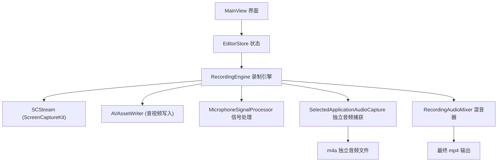
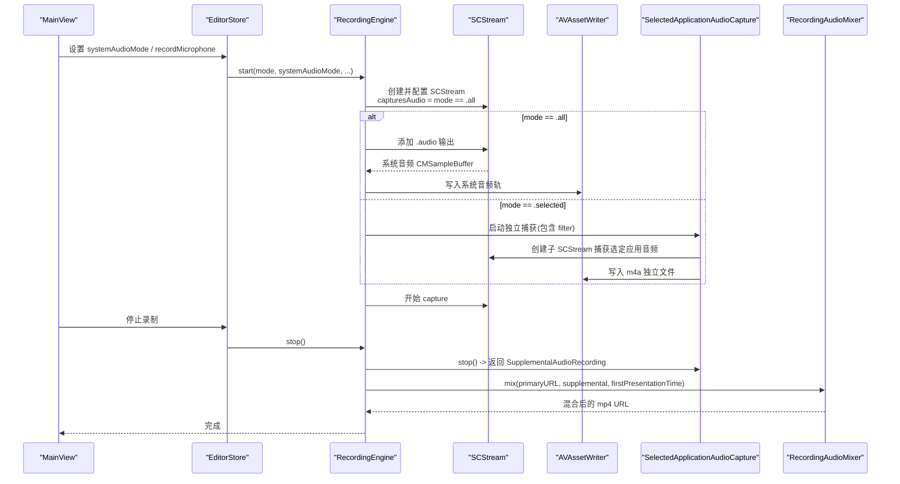
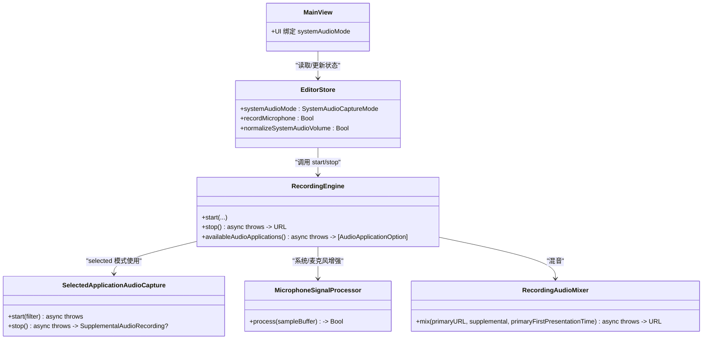

# 系统音频录制

<cite>
**本文引用的文件**   
- [RecordingEngine.swift](file://Sources/ScreenFree/RecordingEngine.swift)
- [MicrophoneSignalProcessor.swift](file://Sources/ScreenFree/MicrophoneSignalProcessor.swift)
- [RecordingAudioMixer.swift](file://Sources/ScreenFree/RecordingAudioMixer.swift)
- [EditorStore.swift](file://Sources/ScreenFree/EditorStore.swift)
- [MainView.swift](file://Sources/ScreenFree/MainView.swift)
</cite>

## 目录
1. [简介](#简介)
2. [项目结构](#项目结构)
3. [核心组件](#核心组件)
4. [架构总览](#架构总览)
5. [详细组件分析](#详细组件分析)
6. [依赖关系分析](#依赖关系分析)
7. [性能考虑](#性能考虑)
8. [故障排查指南](#故障排查指南)
9. [结论](#结论)
10. [附录：配置示例与最佳实践](#附录配置示例与最佳实践)

## 简介
本文件围绕“系统音频录制”能力进行系统化说明，重点覆盖以下方面：
- SystemAudioCaptureMode 枚举的三种模式（all、selected、off）的配置方法和使用场景
- capturesAudio 属性的设置原理及如何通过 SCStreamConfiguration 控制系统音频录制
- availableAudioApplications() 的实现细节：获取可录制应用列表、过滤当前进程与重复项的逻辑
- SelectedApplicationAudioCapture 类的实现：特定应用的音频流捕获、音量归一化、独立文件输出
- 不同模式的配置示例、处理音频权限问题的最佳实践，以及音频质量优化设置

## 项目结构
与系统音频录制相关的代码主要分布在 ScreenFree 模块中：
- RecordingEngine.swift：定义 SystemAudioCaptureMode、封装录制引擎、控制 SCStream 与 AVAssetWriter、协调多路音频输入
- MicrophoneSignalProcessor.swift：提供麦克风与系统音频的降噪、自动增益、压缩等信号处理
- RecordingAudioMixer.swift：将主视频与“选定应用”的独立音频轨道混音合并为最终输出
- EditorStore.swift：管理用户设置（如 systemAudioMode、recordMicrophone、normalizeSystemAudioVolume 等），并驱动 UI 状态
- MainView.swift：呈现系统音频选择界面（all/selected/off）、刷新应用列表、显示提示与按钮

图表来源
- [RecordingEngine.swift:174-392](file://Sources/ScreenFree/RecordingEngine.swift#L174-L392)
- [RecordingAudioMixer.swift:29-134](file://Sources/ScreenFree/RecordingAudioMixer.swift#L29-L134)
- [MainView.swift:1536-1604](file://Sources/ScreenFree/MainView.swift#L1536-L1604)
- [EditorStore.swift:141-169](file://Sources/ScreenFree/EditorStore.swift#L141-L169)

章节来源
- [RecordingEngine.swift:1-691](file://Sources/ScreenFree/RecordingEngine.swift#L1-L691)
- [RecordingAudioMixer.swift:1-136](file://Sources/ScreenFree/RecordingAudioMixer.swift#L1-L136)
- [MainView.swift:1530-1729](file://Sources/ScreenFree/MainView.swift#L1530-L1729)
- [EditorStore.swift:130-329](file://Sources/ScreenFree/EditorStore.swift#L130-L329)

## 核心组件
- SystemAudioCaptureMode：定义系统音频录制的三种模式
  - all：录制全部系统音频
  - selected：仅录制用户选定的应用音频
  - off：关闭系统音频录制
- RecordingEngine：负责创建 SCStream、配置 capturesAudio、添加音频输出、处理回调、写入 AVAssetWriter，并在 selected 模式下启动独立的 SelectedApplicationAudioCapture
- SelectedApplicationAudioCapture：基于 SCStream 捕获指定应用的音频，使用 AVAssetWriter 写入 m4a 文件，支持可选的音量归一化处理
- MicrophoneSignalProcessor：对音频样本执行降噪、自动增益、压缩等处理，适用于系统音频与麦克风两种路径
- RecordingAudioMixer：在录制结束后，将主视频与“选定应用”的独立音频轨道按时间对齐并混音导出为 mp4

章节来源
- [RecordingEngine.swift:14-20](file://Sources/ScreenFree/RecordingEngine.swift#L14-L20)
- [RecordingEngine.swift:174-392](file://Sources/ScreenFree/RecordingEngine.swift#L174-L392)
- [RecordingEngine.swift:533-674](file://Sources/ScreenFree/RecordingEngine.swift#L533-L674)
- [MicrophoneSignalProcessor.swift:6-76](file://Sources/ScreenFree/MicrophoneSignalProcessor.swift#L6-L76)
- [RecordingAudioMixer.swift:29-134](file://Sources/ScreenFree/RecordingAudioMixer.swift#L29-L134)

## 架构总览
下图展示了系统音频录制在不同模式下的数据流与控制流。

图表来源
- [RecordingEngine.swift:174-392](file://Sources/ScreenFree/RecordingEngine.swift#L174-L392)
- [RecordingEngine.swift:533-674](file://Sources/ScreenFree/RecordingEngine.swift#L533-L674)
- [RecordingAudioMixer.swift:29-134](file://Sources/ScreenFree/RecordingAudioMixer.swift#L29-L134)

## 详细组件分析

### SystemAudioCaptureMode 的三种模式与配置
- all（全部应用）
  - 通过 SCStreamConfiguration.capturesAudio = true 启用系统音频录制
  - 同时向 SCStream 添加 .audio 输出，并将 CMSampleBuffer 写入 AVAssetWriter 的系统音频轨
  - 可选开启 normalizeSystemAudioVolume，使用 MicrophoneSignalProcessor 进行自动增益与压缩
- selected（选择的应用）
  - capturesAudio 不设置为 true；改为构建 SCContentFilter 限定到指定应用集合
  - 启动 SelectedApplicationAudioCapture，单独创建 SCStream 与 AVAssetWriter，输出 m4a 文件
  - 录制结束时由 RecordingAudioMixer 将主视频与 m4a 轨道混音为 mp4
- off（关闭）
  - capturesAudio = false，不添加 .audio 输出，也不启动 SelectedApplicationAudioCapture

章节来源
- [RecordingEngine.swift:200-207](file://Sources/ScreenFree/RecordingEngine.swift#L200-L207)
- [RecordingEngine.swift:264-280](file://Sources/ScreenFree/RecordingEngine.swift#L264-L280)
- [RecordingEngine.swift:358-391](file://Sources/ScreenFree/RecordingEngine.swift#L358-L391)

### capturesAudio 的设置原理与 SCStreamConfiguration 控制
- 当 systemAudioMode == .all 时，设置 configuration.capturesAudio = true，并配置 sampleRate=48kHz、channelCount=2、excludesCurrentProcessAudio=true
- 当 systemAudioMode == .selected 时，不设置 capturesAudio，而是通过 SCContentFilter 限定应用范围，并使用独立的 SelectedApplicationAudioCapture
- 对于 macOS 15.0+，可通过 configuration.captureMicrophone 与 microphoneCaptureDeviceID 控制麦克风录制

章节来源
- [RecordingEngine.swift:192-207](file://Sources/ScreenFree/RecordingEngine.swift#L192-L207)
- [RecordingEngine.swift:365-371](file://Sources/ScreenFree/RecordingEngine.swift#L365-L371)

### availableAudioApplications() 的实现细节
- 使用 SCShareableContent.excludingDesktopWindows(false, onScreenWindowsOnly: true) 获取当前屏幕上的应用列表
- 过滤条件：
  - 排除自身 bundleIdentifier
  - 排除空标识符
  - 去重（使用 Set 记录已见标识符）
- 结果转换为 AudioApplicationOption（id、name），并按名称本地化排序

章节来源
- [RecordingEngine.swift:119-143](file://Sources/ScreenFree/RecordingEngine.swift#L119-L143)

### SelectedApplicationAudioCapture 类实现
- 职责：针对 selected 模式，捕获指定应用的音频流，写入独立 m4a 文件，支持可选的音量归一化
- 关键流程：
  - init：创建 AVAssetWriter（m4a）与 AVAssetWriterInput（AAC 48kHz 立体声），可选初始化 MicrophoneSignalProcessor（systemAudioLoudness 预设）
  - start(filter)：创建 SCStreamConfiguration（capturesAudio=true、sampleRate=48k、channelCount=2、excludesCurrentProcessAudio=true），注册 .audio 输出，启动 capture
  - stream(_:didOutputSampleBuffer:of:)：首次帧时启动 writer 会话，后续将样本经信号处理器后写入 input
  - stop()：停止 capture，finishWriting 并返回 SupplementalAudioRecording（url、firstPresentationTime）
- 音量归一化：使用 MicrophoneSignalProcessor.systemAudioLoudness 预设，提升低音量并限制峰值防削波

章节来源
- [RecordingEngine.swift:533-674](file://Sources/ScreenFree/RecordingEngine.swift#L533-L674)
- [MicrophoneSignalProcessor.swift:44-76](file://Sources/ScreenFree/MicrophoneSignalProcessor.swift#L44-L76)

### 混音与最终输出
- 当 selected 模式存在独立 m4a 音频时，stop() 会调用 RecordingAudioMixer.mix()
- mix() 流程：
  - 加载主视频资产，复制视频轨与已有音频轨
  - 加载 m4a 资产，计算偏移量（基于 firstPresentationTime 与 primaryFirstPresentationTime），插入对应时间段
  - 使用 AVAssetExportSession 以 passthrough 预设导出 mp4

章节来源
- [RecordingEngine.swift:394-443](file://Sources/ScreenFree/RecordingEngine.swift#L394-L443)
- [RecordingAudioMixer.swift:29-134](file://Sources/ScreenFree/RecordingAudioMixer.swift#L29-L134)

### UI 与状态绑定
- MainView 提供系统音频选择器（Picker），展示 all/selected/off 三种模式
- selected 模式下，列出可用应用供勾选，并提供“刷新应用”按钮
- 用户切换 normalizeSystemAudioVolume 时，影响 RecordingEngine 中的信号处理器配置

章节来源
- [MainView.swift:1536-1604](file://Sources/ScreenFree/MainView.swift#L1536-L1604)
- [EditorStore.swift:141-169](file://Sources/ScreenFree/EditorStore.swift#L141-L169)

## 依赖关系分析
- RecordingEngine 依赖：
  - ScreenCaptureKit 的 SCStream、SCContentFilter、SCShareableContent
  - AVFoundation 的 AVAssetWriter、AVAssetWriterInput
  - MicrophoneSignalProcessor 用于音频增强
  - RecordingAudioMixer 用于后期混音
- EditorStore 暴露 systemAudioMode、recordMicrophone、normalizeSystemAudioVolume 等状态，驱动 UI 与录制引擎
- MainView 通过 Picker/Toggle 绑定这些状态，提供用户交互入口

图表来源
- [RecordingEngine.swift:174-392](file://Sources/ScreenFree/RecordingEngine.swift#L174-L392)
- [RecordingEngine.swift:533-674](file://Sources/ScreenFree/RecordingEngine.swift#L533-L674)
- [RecordingAudioMixer.swift:29-134](file://Sources/ScreenFree/RecordingAudioMixer.swift#L29-L134)
- [EditorStore.swift:141-169](file://Sources/ScreenFree/EditorStore.swift#L141-L169)
- [MainView.swift:1536-1604](file://Sources/ScreenFree/MainView.swift#L1536-L1604)

章节来源
- [RecordingEngine.swift:1-691](file://Sources/ScreenFree/RecordingEngine.swift#L1-L691)
- [RecordingAudioMixer.swift:1-136](file://Sources/ScreenFree/RecordingAudioMixer.swift#L1-L136)
- [EditorStore.swift:130-329](file://Sources/ScreenFree/EditorStore.swift#L130-L329)
- [MainView.swift:1530-1729](file://Sources/ScreenFree/MainView.swift#L1530-L1729)

## 性能考虑
- 采样率与通道数：统一使用 48kHz 立体声，保证高质量音频且兼容主流编码器
- 队列深度与帧间隔：SCStreamConfiguration.queueDepth=8，minimumFrameInterval=1/60s，平衡吞吐与延迟
- 实时写入：AVAssetWriterInput.expectsMediaDataInRealTime=true，避免缓冲堆积
- 信号处理：MicrophoneSignalProcessor 仅在启用降噪或音量归一化时运行，减少 CPU 开销
- 混音阶段：使用 AVAssetExportSession.presetPassthrough，尽量无损拼接，降低二次编码损耗

[本节为通用指导，不直接分析具体文件]

## 故障排查指南
- 无可用应用（selected 模式）
  - 现象：抛出 noAudioApplications 错误
  - 原因：未选择任何应用或所选应用在过滤后被移除
  - 解决：确保至少选择一个应用，点击“刷新应用”重新扫描
- 无法启动写入器
  - 现象：cannotStartWriter 错误
  - 原因：AVAssetWriter.canAdd(input) 失败或格式不支持
  - 解决：检查输出格式（mp4/m4a）、编码器参数（AAC 48kHz 立体声）
- 无法完成写入
  - 现象：cannotFinishWriter 或 writerFailed
  - 原因：writer.finishWriting 状态非 completed
  - 解决：检查是否有早于首帧的音频样本被追加，确保 session 起始时间正确
- 麦克风权限问题
  - 现象：设备错误或提示需要授权
  - 解决：引导用户打开系统偏好设置授予麦克风权限，或在 UI 中提供跳转按钮

章节来源
- [RecordingEngine.swift:40-61](file://Sources/ScreenFree/RecordingEngine.swift#L40-L61)
- [RecordingEngine.swift:394-443](file://Sources/ScreenFree/RecordingEngine.swift#L394-L443)
- [MainView.swift:1695-1718](file://Sources/ScreenFree/MainView.swift#L1695-L1718)

## 结论
本系统通过灵活的 SystemAudioCaptureMode 与 SCStreamConfiguration 的组合，实现了三种系统音频录制模式：全量系统音频、选定应用音频与关闭。selected 模式通过独立的 SelectedApplicationAudioCapture 捕获并输出 m4a，再由 RecordingAudioMixer 与主视频混音为 mp4。配合 MicrophoneSignalProcessor 的降噪与自动增益，可在保证音质的同时提升听感一致性。合理的队列深度、采样率与实时写入策略确保了录制过程的稳定与高效。

[本节为总结性内容，不直接分析具体文件]

## 附录：配置示例与最佳实践

### 不同模式的配置方法
- all 模式
  - 设置 systemAudioMode = .all
  - 启用 configuration.capturesAudio = true
  - 添加 .audio 输出到 SCStream
  - 可选开启 normalizeSystemAudioVolume，使用 systemAudioLoudness 预设进行自动增益与压缩
- selected 模式
  - 设置 systemAudioMode = .selected
  - 构建 SCContentFilter 限定到 selectedAudioApplicationIDs
  - 启动 SelectedApplicationAudioCapture，输出 m4a 文件
  - 录制结束调用 RecordingAudioMixer.mix() 混音为 mp4
- off 模式
  - 设置 systemAudioMode = .off
  - 不启用 capturesAudio，不添加 .audio 输出

章节来源
- [RecordingEngine.swift:200-207](file://Sources/ScreenFree/RecordingEngine.swift#L200-L207)
- [RecordingEngine.swift:264-280](file://Sources/ScreenFree/RecordingEngine.swift#L264-L280)
- [RecordingEngine.swift:358-391](file://Sources/ScreenFree/RecordingEngine.swift#L358-L391)
- [RecordingAudioMixer.swift:29-134](file://Sources/ScreenFree/RecordingAudioMixer.swift#L29-L134)

### 处理音频权限问题的最佳实践
- 在 UI 层检测并提示设备权限问题，提供跳转到系统设置的快捷方式
- 对于麦克风录制，确保在 macOS 15.0+ 上正确设置 captureMicrophone 与 microphoneCaptureDeviceID
- 若 selected 模式无可用应用，及时给出明确提示并引导用户刷新应用列表

章节来源
- [MainView.swift:1695-1718](file://Sources/ScreenFree/MainView.swift#L1695-L1718)
- [RecordingEngine.swift:365-371](file://Sources/ScreenFree/RecordingEngine.swift#L365-L371)

### 音频质量优化设置
- 统一采样率 48kHz、立体声，编码器 AAC 192kbps
- 合理设置 queueDepth 与 minimumFrameInterval，避免丢帧与卡顿
- 启用 MicrophoneSignalProcessor 的降噪与自动增益，提升弱音清晰度并防止削波
- 混音阶段使用 passthrough 预设，减少二次编码带来的质量损失

章节来源
- [RecordingEngine.swift:192-207](file://Sources/ScreenFree/RecordingEngine.swift#L192-L207)
- [MicrophoneSignalProcessor.swift:44-76](file://Sources/ScreenFree/MicrophoneSignalProcessor.swift#L44-L76)
- [RecordingAudioMixer.swift:120-134](file://Sources/ScreenFree/RecordingAudioMixer.swift#L120-L134)