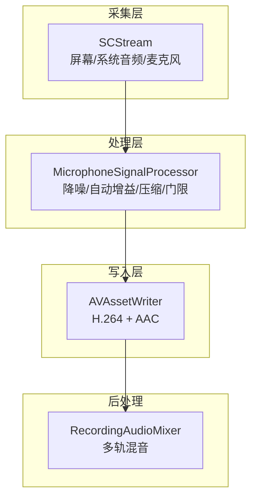
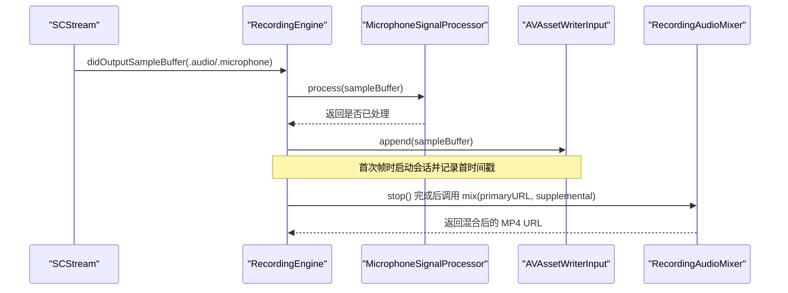
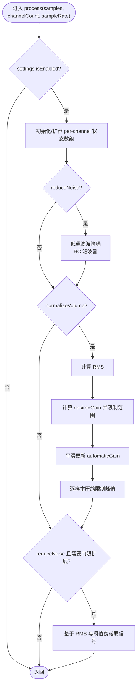
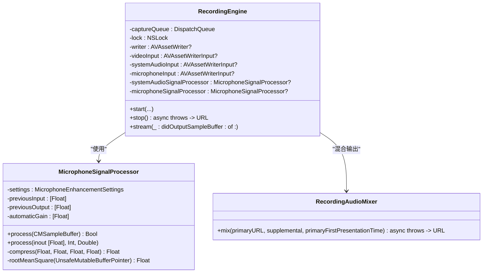
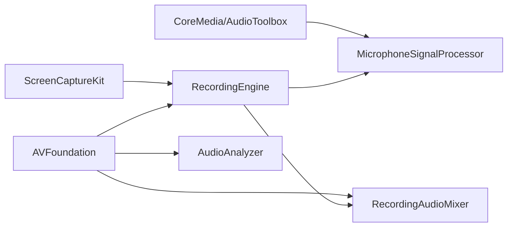

# 音频信号处理

<cite>
**本文引用的文件**   
- [MicrophoneSignalProcessor.swift](file://Sources/ScreenFree/MicrophoneSignalProcessor.swift)
- [AudioAnalyzer.swift](file://Sources/ScreenFree/AudioAnalyzer.swift)
- [RecordingEngine.swift](file://Sources/ScreenFree/RecordingEngine.swift)
- [RecordingAudioMixer.swift](file://Sources/ScreenFree/RecordingAudioMixer.swift)
- [MicrophoneSignalProcessorTests.swift](file://Tests/ScreenFreeMediaTests/MicrophoneSignalProcessorTests.swift)
- [AudioAnalyzerTests.swift](file://Tests/ScreenFreeMediaTests/AudioAnalyzerTests.swift)
</cite>

## 目录
1. [简介](#简介)
2. [项目结构](#项目结构)
3. [核心组件](#核心组件)
4. [架构总览](#架构总览)
5. [详细组件分析](#详细组件分析)
6. [依赖关系分析](#依赖关系分析)
7. [性能考虑](#性能考虑)
8. [故障排查指南](#故障排查指南)
9. [结论](#结论)
10. [附录](#附录)

## 简介
本文件面向音频信号处理与实时录制管线，重点阐述 MicrophoneSignalProcessor 的实现原理与使用方式，包括：
- 音频样本缓冲区处理、实时分析与效果应用
- 降噪算法机制（背景噪声检测、频谱相关处理与噪声抑制）
- 音量归一化（动态范围压缩、峰值检测与标准化）
- systemAudioLoudness 与 microphoneLoudness 预设差异与适用场景
- 音频处理管道架构（队列管理、线程安全与性能优化）
- 自定义效果、参数调整、状态监控与格式转换/同步实践

## 项目结构
本项目在 Sources/ScreenFree 中提供音频采集、处理与录制的核心实现；Tests/ScreenFreeMediaTests 包含针对音频处理器与分析器的单元测试。关键文件职责如下：
- MicrophoneSignalProcessor.swift：麦克风/系统音频的实时信号处理（降噪、自动增益、压缩、门限扩展）
- AudioAnalyzer.swift：离线音频分析（波形、RMS、峰值、包络）
- RecordingEngine.swift：屏幕/窗口/区域录制引擎，集成系统音频与麦克风采集，串联信号处理器与写入器
- RecordingAudioMixer.swift：将主视频与补充音频轨道混合输出
- 测试用例：验证降噪、归一化、预设行为与波形归一化策略

图表来源
- [RecordingEngine.swift](file://Sources/ScreenFree/RecordingEngine.swift)
- [MicrophoneSignalProcessor.swift](file://Sources/ScreenFree/MicrophoneSignalProcessor.swift)
- [RecordingAudioMixer.swift](file://Sources/ScreenFree/RecordingAudioMixer.swift)

章节来源
- [RecordingEngine.swift](file://Sources/ScreenFree/RecordingEngine.swift)
- [MicrophoneSignalProcessor.swift](file://Sources/ScreenFree/MicrophoneSignalProcessor.swift)
- [RecordingAudioMixer.swift](file://Sources/ScreenFree/RecordingAudioMixer.swift)

## 核心组件
- MicrophoneEnhancementSettings：增强配置（降噪开关、归一化开关、目标RMS、最小/最大增益、初始增益、输出上限、压缩阈值与比例）。提供 disabled、systemAudioLoudness、microphoneLoudness(reduceNoise, normalizeVolume) 三种预设。
- MicrophoneSignalProcessor：实时音频处理类，支持 CMSampleBuffer 与 Float 数组两种输入路径，内部维护每通道状态（上一输入/输出、自动增益），按顺序执行：低通滤波降噪 → 自动增益与压缩 → 基于 RMS 的门限扩展。
- AudioAnalyzer：离线分析工具，计算波形、RMS、峰值与时间对齐的峰值包络，并提供波形归一化策略（自适应静音门限、相对归一化与平方根曲线）。

章节来源
- [MicrophoneSignalProcessor.swift](file://Sources/ScreenFree/MicrophoneSignalProcessor.swift)
- [AudioAnalyzer.swift](file://Sources/ScreenFree/AudioAnalyzer.swift)

## 架构总览
录音与处理的整体数据流：
- 采集：SCStream 从屏幕、系统音频或麦克风产出 CMSampleBuffer
- 处理：根据输出类型选择对应的 MicrophoneSignalProcessor 实例进行实时处理
- 写入：AVAssetWriterInput 接收处理后的样本缓冲并编码为 AAC/H.264
- 混合：可选的 SelectedApplicationAudioCapture 生成补充音频，最终由 RecordingAudioMixer 与主视频合成

图表来源
- [RecordingEngine.swift](file://Sources/ScreenFree/RecordingEngine.swift)
- [RecordingAudioMixer.swift](file://Sources/ScreenFree/RecordingAudioMixer.swift)
- [MicrophoneSignalProcessor.swift](file://Sources/ScreenFree/MicrophoneSignalProcessor.swift)

章节来源
- [RecordingEngine.swift](file://Sources/ScreenFree/RecordingEngine.swift)
- [RecordingAudioMixer.swift](file://Sources/ScreenFree/RecordingAudioMixer.swift)

## 详细组件分析

### MicrophoneSignalProcessor 类详解
- 输入适配
  - CMSampleBuffer 路径：解析 AudioStreamBasicDescription，支持 32-bit float 与 16-bit signed integer 两种 PCM 格式，非交错/交错通道均兼容
  - Float[] 路径：直接对内存缓冲进行处理，便于测试与离线批处理
- 状态管理
  - previousInput/previousOutput：用于低通滤波的通道级历史状态
  - automaticGain：每通道平滑自动增益，避免突变
- 处理流程
  1) 低通滤波降噪：截止频率约 80Hz，RC 滤波器系数按采样率动态计算，抑制极低频噪声
  2) 自动增益与压缩：
     - 计算当前块 RMS，推导期望增益并限制在最小/最大范围内
     - 以不同响应速度平滑更新自动增益（下降更快，上升更慢）
     - 通过软压缩函数限制峰值，防止削波
  3) 门限扩展（Expander/Gate）：
     - 若启用降噪且未先做归一化，则使用固定阈值；若先做了自动增益，则阈值随自动增益动态调整
     - 低于阈值的片段按比例衰减，抑制底噪
- 压缩函数
  - 使用 tanh 软限幅，保证超过阈值的幅度被平滑压缩到输出上限以内
- 复杂度
  - 每样本 O(1)，整体线性于样本数；内存分配集中在 BufferList 获取阶段，后续零拷贝处理

图表来源
- [MicrophoneSignalProcessor.swift](file://Sources/ScreenFree/MicrophoneSignalProcessor.swift)

章节来源
- [MicrophoneSignalProcessor.swift](file://Sources/ScreenFree/MicrophoneSignalProcessor.swift)

### 降噪算法机制
- 背景噪声检测
  - 采用低通滤波器（截止约 80Hz）滤除低频噪声，同时结合后续门限扩展抑制弱信号段
- 频谱分析
  - 未使用 FFT 等频域方法，而是时域 RC 滤波与 RMS 能量估计，兼顾实时性与低开销
- 噪声抑制技术
  - 低通滤波 + 基于 RMS 的门限扩展：当块 RMS 低于阈值时按平方比例衰减，避免误伤弱语音
  - 降噪与自动增益的顺序设计：先自动增益再扩展，确保弱语音能被提升后再进行门限控制

章节来源
- [MicrophoneSignalProcessor.swift](file://Sources/ScreenFree/MicrophoneSignalProcessor.swift)

### 音量归一化功能
- 动态范围压缩
  - 使用软压缩函数（tanh）限制超过阈值的幅度，避免硬削波
- 峰值检测
  - 逐样本比较绝对值，配合压缩上限输出 ceiling
- 音量标准化算法
  - 计算块 RMS，推导目标增益 = targetRMS / rms，限制在 minimumGain..maximumGain
  - 自动增益平滑更新：下降响应更快，上升响应更慢，减少“呼吸效应”
  - 输出上限 ceiling 限制最终峰值，保障不溢出

章节来源
- [MicrophoneSignalProcessor.swift](file://Sources/ScreenFree/MicrophoneSignalProcessor.swift)

### 预设配置对比：systemAudioLoudness vs microphoneLoudness
- systemAudioLoudness
  - 特点：targetRMS 较高、minimumGain/initialGain 较大、compressionThreshold 较低、ratio 较高
  - 适用：系统音频对话内容偏小，需快速提升响度并压制瞬态峰值
- microphoneLoudness
  - 特点：targetRMS 适中、maximumGain 更高、compressionThreshold 略高、ratio 中等
  - 适用：麦克风拾音环境复杂，允许更大动态范围，可配合降噪使用

章节来源
- [MicrophoneSignalProcessor.swift](file://Sources/ScreenFree/MicrophoneSignalProcessor.swift)

### 音频处理管道架构
- 队列管理
  - captureQueue：用户交互优先级的串行队列，承载 SCStream 回调，保证同一时刻只处理一个样本缓冲
  - 专用队列：SelectedApplicationAudioCapture 使用独立队列隔离处理
- 线程安全
  - @unchecked Sendable 标记与 NSLock 保护关键临界区（writer、inputs、firstPresentationTime、finishing）
  - 首次帧启动 writer 会话并记录 firstPresentationTime，避免早到的音频时间戳导致失败
- 性能优化
  - 零拷贝处理：CMSampleBuffer 直接绑定内存指针，避免额外复制
  - 按需格式转换：仅在 16-bit 路径上转换为 Float 处理，随后写回
  - 合理的 queueDepth：屏幕与音频队列深度平衡吞吐与延迟

图表来源
- [RecordingEngine.swift](file://Sources/ScreenFree/RecordingEngine.swift)
- [MicrophoneSignalProcessor.swift](file://Sources/ScreenFree/MicrophoneSignalProcessor.swift)
- [RecordingAudioMixer.swift](file://Sources/ScreenFree/RecordingAudioMixer.swift)

章节来源
- [RecordingEngine.swift](file://Sources/ScreenFree/RecordingEngine.swift)
- [RecordingAudioMixer.swift](file://Sources/ScreenFree/RecordingAudioMixer.swift)

### 音频分析器（AudioAnalyzer）
- 功能
  - 读取 AVAsset 音频轨，输出波形、RMS、峰值与时间对齐的峰值包络
  - 波形归一化：自适应静音门限、相对归一化与平方根曲线，避免静音段被放大
- 异步与并发
  - analyze(url:) 在 utility 优先级任务中执行，避免阻塞 UI
- 多轨合并
  - 合并各轨波形与峰值包络，估算并发峰值，提高可视化准确性

章节来源
- [AudioAnalyzer.swift](file://Sources/ScreenFree/AudioAnalyzer.swift)

## 依赖关系分析
- 模块耦合
  - RecordingEngine 依赖 MicrophoneSignalProcessor 进行实时增强，依赖 AVAssetWriter 进行编码写入
  - RecordingAudioMixer 依赖 AVFoundation 完成多轨合成与导出
  - AudioAnalyzer 依赖 AVFoundation 进行离线分析
- 外部依赖
  - CoreMedia/AudioToolbox：PCM 格式描述、BlockBuffer、SampleBuffer 操作
  - AVFoundation：媒体读写、编解码、导出
  - ScreenCaptureKit：屏幕/应用音频捕获

图表来源
- [RecordingEngine.swift](file://Sources/ScreenFree/RecordingEngine.swift)
- [MicrophoneSignalProcessor.swift](file://Sources/ScreenFree/MicrophoneSignalProcessor.swift)
- [RecordingAudioMixer.swift](file://Sources/ScreenFree/RecordingAudioMixer.swift)
- [AudioAnalyzer.swift](file://Sources/ScreenFree/AudioAnalyzer.swift)

章节来源
- [RecordingEngine.swift](file://Sources/ScreenFree/RecordingEngine.swift)
- [MicrophoneSignalProcessor.swift](file://Sources/ScreenFree/MicrophoneSignalProcessor.swift)
- [RecordingAudioMixer.swift](file://Sources/ScreenFree/RecordingAudioMixer.swift)
- [AudioAnalyzer.swift](file://Sources/ScreenFree/AudioAnalyzer.swift)

## 性能考虑
- 实时性
  - 使用用户交互优先队列，降低延迟
  - 零拷贝处理与就地修改缓冲，减少内存分配
- 稳定性
  - 严格的格式检查与错误分支，避免非法样本导致崩溃
  - 平滑自动增益与软压缩，避免突变与削波
- 可扩展性
  - 模块化设置（MicrophoneEnhancementSettings）便于新增效果链
  - 分离采集、处理、写入与混合，利于并行与替换

[本节为通用指导，无需特定文件引用]

## 故障排查指南
- 常见问题
  - 音频时间戳早于首帧：RecordingEngine 会丢弃早到的音频缓冲，确保会话已启动
  - 格式不支持：仅支持 Linear PCM 32-bit float 与 16-bit signed integer，其他格式将被跳过
  - 输出被截断：检查 outputCeiling 与 compressionThreshold 设置，避免过度压缩
- 调试建议
  - 使用测试用例中的 makeSine/rms/makeFloatSampleBuffer 构造样本，验证降噪与归一化效果
  - 观察 RMS 与峰值变化，确认自动增益与压缩是否按预期工作
  - 检查队列深度与 QoS，避免卡顿或丢帧

章节来源
- [MicrophoneSignalProcessorTests.swift](file://Tests/ScreenFreeMediaTests/MicrophoneSignalProcessorTests.swift)
- [AudioAnalyzerTests.swift](file://Tests/ScreenFreeMediaTests/AudioAnalyzerTests.swift)
- [RecordingEngine.swift](file://Sources/ScreenFree/RecordingEngine.swift)

## 结论
MicrophoneSignalProcessor 提供了轻量高效的实时音频增强能力，结合 RecordingEngine 的采集与写入管线，以及 RecordingAudioMixer 的多轨混合，形成完整的音频处理解决方案。通过合理配置 systemAudioLoudness 与 microphoneLoudness 预设，可在不同场景下获得稳定、清晰、响度一致的音频输出。

[本节为总结，无需特定文件引用]

## 附录

### 如何自定义音频处理效果
- 扩展 MicrophoneEnhancementSettings：新增效果开关与参数
- 在 MicrophoneSignalProcessor.process 中添加处理步骤：
  - 插入新的效果函数（如均衡、去混响）
  - 保持顺序：降噪 → 自动增益/压缩 → 门限扩展
- 示例参考路径：
  - [MicrophoneSignalProcessor.swift](file://Sources/ScreenFree/MicrophoneSignalProcessor.swift)

### 如何调整处理参数
- 目标 RMS：影响自动增益强度
- 最小/最大增益：限制动态范围
- 压缩阈值与比例：控制峰值抑制程度
- 输出上限：防止削波
- 示例参考路径：
  - [MicrophoneSignalProcessor.swift](file://Sources/ScreenFree/MicrophoneSignalProcessor.swift)

### 如何监控处理状态
- 使用 AudioAnalyzer 分析录制结果，查看波形、RMS、峰值与包络
- 在 UI 中展示实时 RMS 与峰值，辅助调参
- 示例参考路径：
  - [AudioAnalyzer.swift](file://Sources/ScreenFree/AudioAnalyzer.swift)

### 音频格式转换与数据同步
- 支持 32-bit float 与 16-bit signed integer 的 PCM 格式转换
- 非交错/交错通道处理
- 时间戳对齐：记录 firstPresentationTime，确保音视频同步
- 示例参考路径：
  - [MicrophoneSignalProcessor.swift](file://Sources/ScreenFree/MicrophoneSignalProcessor.swift)
  - [RecordingEngine.swift](file://Sources/ScreenFree/RecordingEngine.swift)