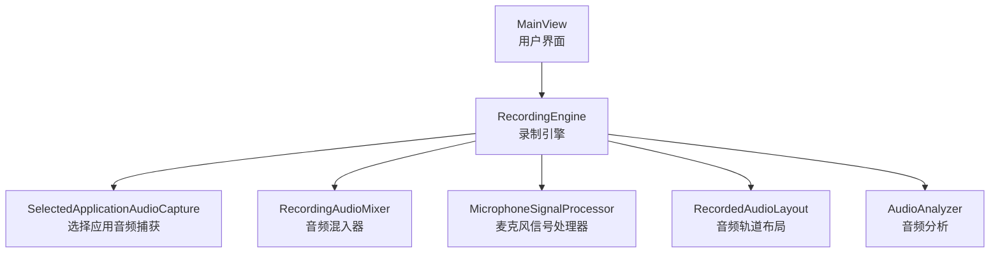
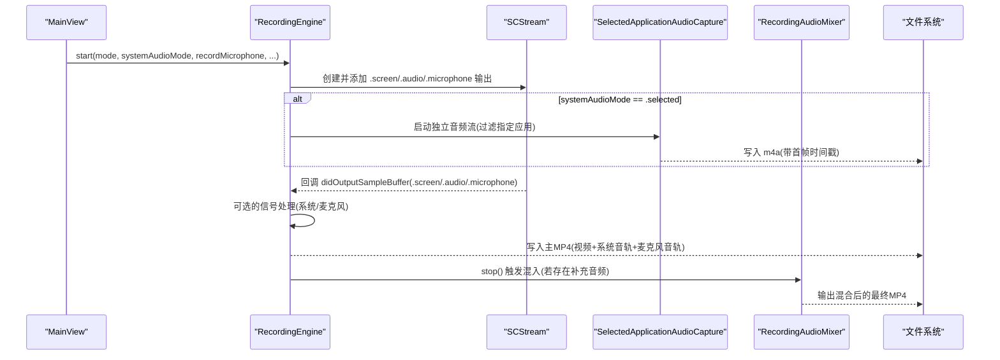
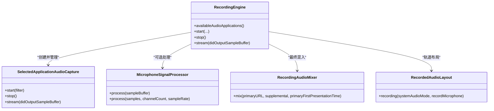

# 音频录制配置

<cite>
**本文引用的文件**   
- [RecordingEngine.swift](file://Sources/ScreenFree/RecordingEngine.swift)
- [RecordedAudioLayout.swift](file://Sources/ScreenFree/RecordedAudioLayout.swift)
- [MicrophoneSignalProcessor.swift](file://Sources/ScreenFree/MicrophoneSignalProcessor.swift)
- [RecordingAudioMixer.swift](file://Sources/ScreenFree/RecordingAudioMixer.swift)
- [MainView.swift](file://Sources/ScreenFree/MainView.swift)
- [AudioAnalyzer.swift](file://Sources/ScreenFree/AudioAnalyzer.swift)
- [VideoExporterTests.swift](file://Tests/ScreenFreeMediaTests/VideoExporterTests.swift)
</cite>

## 目录
1. [简介](#简介)
2. [项目结构](#项目结构)
3. [核心组件](#核心组件)
4. [架构总览](#架构总览)
5. [详细组件分析](#详细组件分析)
6. [依赖关系分析](#依赖关系分析)
7. [性能考量](#性能考量)
8. [故障排查指南](#故障排查指南)
9. [结论](#结论)
10. [附录：配置示例与最佳实践](#附录配置示例与最佳实践)

## 简介
本文件面向 ScreenFree 的音频录制能力，系统性说明系统音频录制与麦克风录制的独立控制机制，详解 SystemAudioCaptureMode 枚举的三种模式（全部应用、选择的应用、关闭）的配置方法，解释 availableAudioApplications() 的使用方式以获取可录制的应用程序列表，并深入介绍音频信号处理功能（降噪、音量归一化等增强选项）。同时给出 SelectedApplicationAudioCapture 的实现要点，以及不同录制场景的配置示例、权限处理与质量优化建议。

## 项目结构
与音频录制相关的核心代码分布在以下模块：
- 录制引擎与流式采集：RecordingEngine.swift
- 音频布局与混音样式：RecordedAudioLayout.swift
- 麦克风信号处理与增强：MicrophoneSignalProcessor.swift
- 选择应用的独立音频捕获与混入：RecordingAudioMixer.swift、SelectedApplicationAudioCapture（内部类）
- UI 配置入口与交互：MainView.swift
- 音频分析与波形：AudioAnalyzer.swift
- 行为验证用例：VideoExporterTests.swift

图表来源 
- [RecordingEngine.swift:119-143](file://Sources/ScreenFree/RecordingEngine.swift#L119-L143)
- [RecordingEngine.swift:533-674](file://Sources/ScreenFree/RecordingEngine.swift#L533-L674)
- [RecordingAudioMixer.swift:29-136](file://Sources/ScreenFree/RecordingAudioMixer.swift#L29-L136)
- [MicrophoneSignalProcessor.swift:6-76](file://Sources/ScreenFree/MicrophoneSignalProcessor.swift#L6-L76)
- [RecordedAudioLayout.swift:3-49](file://Sources/ScreenFree/RecordedAudioLayout.swift#L3-L49)
- [AudioAnalyzer.swift:110-192](file://Sources/ScreenFree/AudioAnalyzer.swift#L110-L192)

章节来源
- [RecordingEngine.swift:119-143](file://Sources/ScreenFree/RecordingEngine.swift#L119-L143)
- [MainView.swift:1491-1567](file://Sources/ScreenFree/MainView.swift#L1491-L1567)

## 核心组件
- SystemAudioCaptureMode：定义系统音频的三种录制模式（全部应用、选择的应用、关闭），用于控制是否录制系统音频以及如何筛选应用。
- AudioApplicationOption：描述一个可录制的应用（id、name），由 availableAudioApplications() 返回。
- RecordedAudioLayout：根据系统音频模式与麦克风开关决定系统音轨与麦克风雨道在输出中的索引位置。
- MicrophoneSignalProcessor：对 PCM 音频进行降噪、自动增益、压缩与限幅等增强处理。
- RecordingAudioMixer：将主录制的音视频与“选择应用”的独立音频轨道合并为最终 MP4。
- SelectedApplicationAudioCapture：基于 ScreenCaptureKit 的独立音频流，按时间戳对齐写入 m4a，供混入器使用。

章节来源
- [RecordingEngine.swift:14-26](file://Sources/ScreenFree/RecordingEngine.swift#L14-L26)
- [RecordedAudioLayout.swift:3-49](file://Sources/ScreenFree/RecordedAudioLayout.swift#L3-L49)
- [MicrophoneSignalProcessor.swift:6-76](file://Sources/ScreenFree/MicrophoneSignalProcessor.swift#L6-L76)
- [RecordingAudioMixer.swift:24-28](file://Sources/ScreenFree/RecordingAudioMixer.swift#L24-L28)
- [RecordingEngine.swift:533-674](file://Sources/ScreenFree/RecordingEngine.swift#L533-L674)

## 架构总览
下图展示了从用户配置到最终输出的完整流程，包括系统音频与麦克风的独立路径，以及“选择应用”模式的额外捕获与混入环节。

图表来源 
- [RecordingEngine.swift:174-392](file://Sources/ScreenFree/RecordingEngine.swift#L174-L392)
- [RecordingEngine.swift:445-489](file://Sources/ScreenFree/RecordingEngine.swift#L445-L489)
- [RecordingEngine.swift:533-674](file://Sources/ScreenFree/RecordingEngine.swift#L533-L674)
- [RecordingAudioMixer.swift:29-136](file://Sources/ScreenFree/RecordingAudioMixer.swift#L29-L136)

## 详细组件分析

### SystemAudioCaptureMode 与可用应用列表
- 三种模式
  - all：录制所有应用系统音频（通过 SCStream 的 .audio 输出）。
  - selected：仅录制用户勾选的应用（通过独立的 SelectedApplicationAudioCapture 捕获，再混入）。
  - off：不录制系统音频。
- 获取可录制应用列表
  - 调用 availableAudioApplications()，内部通过 SCShareableContent.excludingDesktopWindows 枚举当前屏幕上的应用，排除自身进程并按名称排序返回 AudioApplicationOption 数组。
- UI 绑定
  - MainView 中提供 Picker 展示 SystemAudioCaptureMode；当选择 selected 时，渲染应用列表供勾选，并提供刷新按钮。

章节来源
- [RecordingEngine.swift:14-20](file://Sources/ScreenFree/RecordingEngine.swift#L14-L20)
- [RecordingEngine.swift:119-143](file://Sources/ScreenFree/RecordingEngine.swift#L119-L143)
- [MainView.swift:1491-1567](file://Sources/ScreenFree/MainView.swift#L1491-L1567)

### 系统音频与麦克风独立控制机制
- 录制入口参数
  - systemAudioMode：控制系统音频录制策略。
  - recordMicrophone：控制是否开启麦克风录制（macOS 15+ 通过 configuration.captureMicrophone）。
- 轨道布局
  - RecordedAudioLayout.recording(systemAudioMode, recordMicrophone) 决定系统音轨与麦克风音轨在输出中的索引顺序，保证确定性。
- 信号处理
  - 系统音频：可选择启用 MicrophoneSignalProcessor（settings.systemAudioLoudness）进行响度归一化。
  - 麦克风：可选择启用降噪与音量归一化（settings.microphoneLoudness）。

章节来源
- [RecordingEngine.swift:174-210](file://Sources/ScreenFree/RecordingEngine.swift#L174-L210)
- [RecordedAudioLayout.swift:15-49](file://Sources/ScreenFree/RecordedAudioLayout.swift#L15-L49)
- [RecordingEngine.swift:333-346](file://Sources/ScreenFree/RecordingEngine.swift#L333-L346)

### SelectedApplicationAudioCapture 实现要点
- 职责
  - 基于 SCStream 的 .audio 输出，针对用户选择的 App 集合进行过滤捕获，单独写入 m4a。
- 关键流程
  - start(filter)：创建 SCStreamConfiguration（capturesAudio=true、sampleRate=48kHz、channelCount=2、excludesCurrentProcessAudio=true），注册 .audio 输出并开始 capture。
  - stream(_:didOutputSampleBuffer:of:)：接收 CMSampleBuffer，必要时经信号处理器后写入 AVAssetWriterInput。
  - stop()：结束 capture，完成 writer 写入，返回 SupplementalAudioRecording（包含 URL 与首帧时间戳），供混入器对齐。
- 与主录制的关系
  - 主录制仍写入 MP4（含视频、系统音轨、麦克风音轨），而选择应用的音频作为补充轨道，最终由 RecordingAudioMixer 合并。

章节来源
- [RecordingEngine.swift:533-674](file://Sources/ScreenFree/RecordingEngine.swift#L533-L674)
- [RecordingAudioMixer.swift:24-28](file://Sources/ScreenFree/RecordingAudioMixer.swift#L24-L28)

### 音频信号处理（降噪、音量归一化等）
- 增强设置
  - MicrophoneEnhancementSettings 支持 reduceNoise、normalizeVolume 及多项增益/压缩参数。
  - 内置预设：disabled、systemAudioLoudness、microphoneLoudness(reduceNoise, normalizeVolume)。
- 处理管线
  - 输入格式：支持 Float32 与 Int16 的 PCM 数据，非交错/交错均可。
  - 降噪：80Hz 高通滤波 + 低电平自适应门限衰减。
  - 自动增益：基于 RMS 的目标响度（targetRMS）动态调整增益，响应速度分快慢通道。
  - 压缩与限幅：阈值与比率可调，输出上限（outputCeiling）防止削波。
- 适用场景
  - 系统音频：通常只启用音量归一化（systemAudioLoudness）。
  - 麦克风：可按需开启降噪与归一化（microphoneLoudness）。

章节来源
- [MicrophoneSignalProcessor.swift:6-76](file://Sources/ScreenFree/MicrophoneSignalProcessor.swift#L6-L76)
- [MicrophoneSignalProcessor.swift:224-318](file://Sources/ScreenFree/MicrophoneSignalProcessor.swift#L224-L318)
- [RecordingEngine.swift:333-346](file://Sources/ScreenFree/RecordingEngine.swift#L333-L346)

### 音频分析与混音样式
- 音频分析
  - AudioAnalyzer 读取媒体文件的各音轨，计算波形、RMS、峰值与包络，用于可视化与混音参考。
- 混音样式
  - RecordedAudioMixStyle 根据 layout、各轨道音量与峰值包络，计算每轨增益，避免多轨并发峰值导致削波。

章节来源
- [AudioAnalyzer.swift:110-192](file://Sources/ScreenFree/AudioAnalyzer.swift#L110-L192)
- [RecordedAudioLayout.swift:52-195](file://Sources/ScreenFree/RecordedAudioLayout.swift#L52-L195)

## 依赖关系分析
- RecordingEngine 依赖：
  - ScreenCaptureKit：SCShareableContent、SCStream、SCContentFilter。
  - AVFoundation：AVAssetWriter、AVAssetWriterInput、AVAssetExportSession。
  - 内部组件：MicrophoneSignalProcessor、RecordingAudioMixer、SelectedApplicationAudioCapture。
- 数据流向：
  - 屏幕/窗口/区域 -> 视频输入
  - 系统音频 -> 可选信号处理 -> 系统音轨
  - 麦克风 -> 可选信号处理 -> 麦克风音轨
  - 选择应用音频 -> 独立 m4a -> 混入器合并

图表来源 
- [RecordingEngine.swift:174-392](file://Sources/ScreenFree/RecordingEngine.swift#L174-L392)
- [RecordingEngine.swift:533-674](file://Sources/ScreenFree/RecordingEngine.swift#L533-L674)
- [RecordingAudioMixer.swift:29-136](file://Sources/ScreenFree/RecordingAudioMixer.swift#L29-L136)
- [MicrophoneSignalProcessor.swift:94-207](file://Sources/ScreenFree/MicrophoneSignalProcessor.swift#L94-L207)
- [RecordedAudioLayout.swift:15-49](file://Sources/ScreenFree/RecordedAudioLayout.swift#L15-L49)

章节来源
- [RecordingEngine.swift:174-392](file://Sources/ScreenFree/RecordingEngine.swift#L174-L392)
- [RecordingAudioMixer.swift:29-136](file://Sources/ScreenFree/RecordingAudioMixer.swift#L29-L136)

## 性能考量
- 采样率与编码
  - 统一 48kHz、立体声、AAC 192kbps，兼顾音质与体积。
- 实时处理
  - 信号处理在专用队列执行，降低阻塞风险；CMSampleBuffer 直接操作，减少拷贝。
- 混入阶段
  - 使用 AVAssetExportSession Passthrough 快速合成，避免重编码。
- 峰值保护
  - RecordedAudioMixStyle 基于并发峰值包络计算共享余量，避免多轨叠加削波。

[本节为通用指导，不直接分析具体文件]

## 故障排查指南
- 无可用源或无音频应用
  - 检查 SCShareableContent 枚举结果，确保至少选择一个应用（selected 模式）。
- 无法启动 Writer
  - 确认 AVAssetWriter.canAdd(input) 成功；检查输出目录权限。
- 停止失败
  - 确保所有 input.markAsFinished() 被调用；检查 writer.finishWriting 状态。
- 权限问题
  - 麦克风录制需要 macOS 15+ 的 Stream API；未满足条件时应明确拒绝而非静默失败。
- 应用列表为空
  - 刷新 availableAudioApplications()；确认 onScreenWindowsOnly 与 excludingDesktopWindows 设置。

章节来源
- [RecordingEngine.swift:40-61](file://Sources/ScreenFree/RecordingEngine.swift#L40-L61)
- [RecordingEngine.swift:413-443](file://Sources/ScreenFree/RecordingEngine.swift#L413-L443)
- [RecordingEngine.swift:119-143](file://Sources/ScreenFree/RecordingEngine.swift#L119-L143)

## 结论
ScreenFree 的音频录制体系将系统音频与麦克风录制解耦，通过明确的模式枚举与轨道布局保证输出一致性；“选择应用”模式借助独立捕获与时间戳对齐，实现灵活的多源音频融合。信号处理模块提供降噪与响度归一化，配合混音样式与峰值保护，确保高质量且稳定的最终输出。

[本节为总结性内容，不直接分析具体文件]

## 附录：配置示例与最佳实践

### 配置不同音频录制场景
- 全部应用 + 麦克风
  - systemAudioMode = .all
  - recordMicrophone = true
  - 系统音频可启用音量归一化（systemAudioLoudness）
- 选择的应用 + 麦克风
  - systemAudioMode = .selected
  - recordMicrophone = true
  - 先调用 availableAudioApplications() 获取列表，用户勾选若干应用
  - 选择应用音频独立捕获，最终与主录制混入
- 关闭系统音频 + 麦克风
  - systemAudioMode = .off
  - recordMicrophone = true
  - 仅录制麦克风

章节来源
- [RecordedAudioLayout.swift:15-49](file://Sources/ScreenFree/RecordedAudioLayout.swift#L15-L49)
- [RecordingEngine.swift:174-210](file://Sources/ScreenFree/RecordingEngine.swift#L174-L210)
- [RecordingEngine.swift:119-143](file://Sources/ScreenFree/RecordingEngine.swift#L119-L143)

### 处理音频权限问题
- 麦克风权限
  - macOS 15+ 才支持 configuration.captureMicrophone；旧版本应提示不可用。
- 应用录制权限
  - 使用 SCShareableContent 枚举时需用户授权；如列表为空，引导刷新或检查系统设置。

章节来源
- [RecordingEngine.swift:204-207](file://Sources/ScreenFree/RecordingEngine.swift#L204-L207)
- [RecordingEngine.swift:119-143](file://Sources/ScreenFree/RecordingEngine.swift#L119-L143)

### 音频质量优化设置
- 系统音频
  - 推荐启用音量归一化（systemAudioLoudness），抑制弱音并限制峰值。
- 麦克风
  - 根据环境噪声情况选择 reduceNoise；如需提升人声清晰度，开启 normalizeVolume。
- 混音与峰值保护
  - 使用 RecordedAudioMixStyle 的 gain(forTrackAt:) 计算每轨增益，避免并发峰值削波。

章节来源
- [MicrophoneSignalProcessor.swift:44-71](file://Sources/ScreenFree/MicrophoneSignalProcessor.swift#L44-L71)
- [RecordedAudioLayout.swift:184-195](file://Sources/ScreenFree/RecordedAudioLayout.swift#L184-L195)

### 行为验证参考
- 轨道布局测试覆盖多种组合（all/selected/off 与麦克风开关），确保系统音轨与麦克风音轨索引符合预期。

章节来源
- [VideoExporterTests.swift:366-405](file://Tests/ScreenFreeMediaTests/VideoExporterTests.swift#L366-L405)