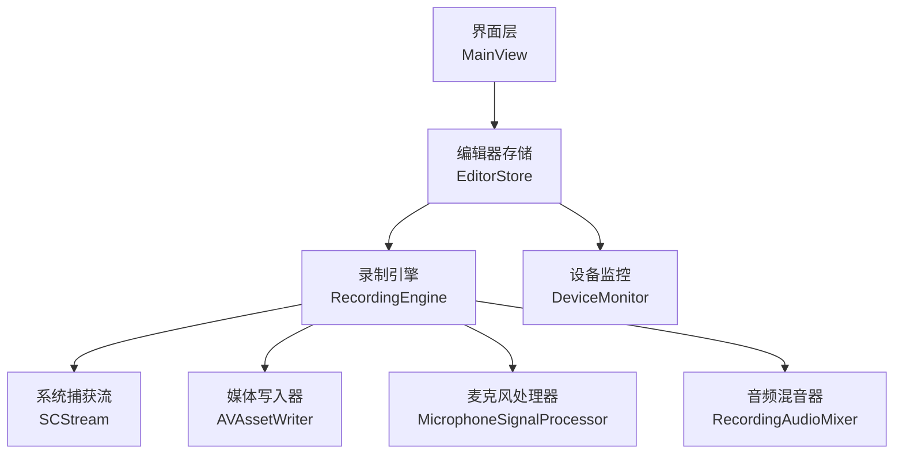
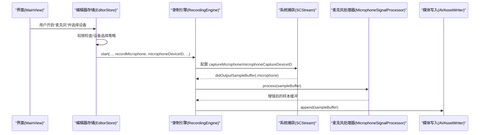
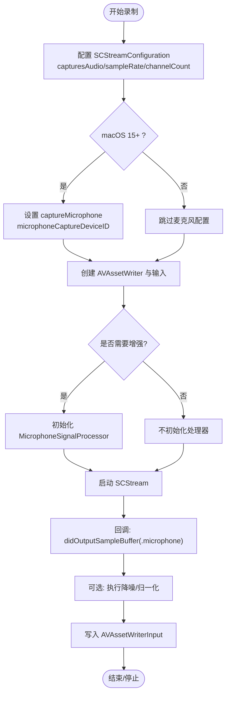
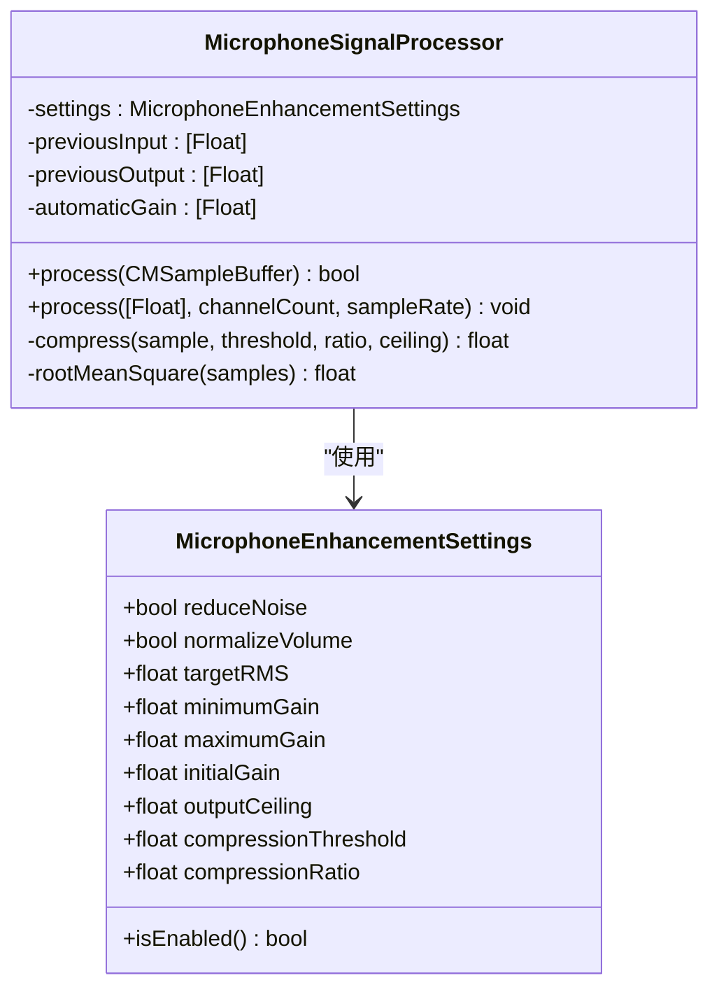
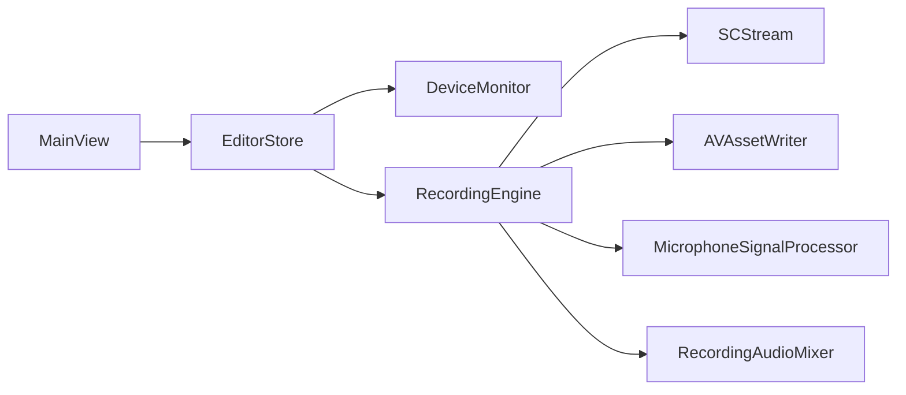

# 麦克风音频录制

<cite>
**本文引用的文件**   
- [RecordingEngine.swift](file://Sources/ScreenFree/RecordingEngine.swift)
- [MicrophoneSignalProcessor.swift](file://Sources/ScreenFree/MicrophoneSignalProcessor.swift)
- [DeviceMonitor.swift](file://Sources/ScreenFree/DeviceMonitor.swift)
- [MainView.swift](file://Sources/ScreenFree/MainView.swift)
- [EditorStore.swift](file://Sources/ScreenFree/EditorStore.swift)
- [RecordingAudioMixer.swift](file://Sources/ScreenFree/RecordingAudioMixer.swift)
- [AudioAnalyzer.swift](file://Sources/ScreenFree/AudioAnalyzer.swift)
- [MicrophoneSignalProcessorTests.swift](file://Tests/ScreenFreeMediaTests/MicrophoneSignalProcessorTests.swift)
</cite>

## 目录
1. [简介](#简介)
2. [项目结构](#项目结构)
3. [核心组件](#核心组件)
4. [架构总览](#架构总览)
5. [详细组件分析](#详细组件分析)
6. [依赖关系分析](#依赖关系分析)
7. [性能考量](#性能考量)
8. [故障排查指南](#故障排查指南)
9. [结论](#结论)
10. [附录](#附录)

## 简介
本文件围绕“麦克风音频录制”能力，系统说明以下要点：
- recordMicrophone 参数的使用方法与行为
- 如何通过 captureMicrophone 属性启用麦克风录制
- microphoneDeviceID 的作用与设备选择流程
- MicrophoneEnhancementSettings 的配置项（reduceNoise、normalizeVolume 等）及其实现原理
- 麦克风音频信号处理管道（实时处理、降噪算法、音量标准化技术）
- 配置示例路径、权限处理与常见问题解决方案
- 音频质量优化建议

## 项目结构
本项目将麦克风录制的核心逻辑分布在多个模块中：
- RecordingEngine：负责屏幕/窗口捕获、系统音频与麦克风音频的采集与写入，以及增强处理器的挂载
- MicrophoneSignalProcessor：提供降噪与音量归一化等实时音频增强
- DeviceMonitor：设备枚举、权限请求、麦克风电平监测
- MainView：UI 开关与设备选择器
- EditorStore：录制启动流程编排、参数传递与状态管理
- RecordingAudioMixer：可选的系统应用音频混音
- AudioAnalyzer：离线音频分析与波形生成（辅助质量评估）

图表来源
- [MainView.swift:1606-1640](file://Sources/ScreenFree/MainView.swift#L1606-L1640)
- [EditorStore.swift:512-627](file://Sources/ScreenFree/EditorStore.swift#L512-L627)
- [RecordingEngine.swift:174-392](file://Sources/ScreenFree/RecordingEngine.swift#L174-L392)
- [RecordingAudioMixer.swift:29-136](file://Sources/ScreenFree/RecordingAudioMixer.swift#L29-L136)

章节来源
- [MainView.swift:1606-1640](file://Sources/ScreenFree/MainView.swift#L1606-L1640)
- [EditorStore.swift:512-627](file://Sources/ScreenFree/EditorStore.swift#L512-L627)
- [RecordingEngine.swift:174-392](file://Sources/ScreenFree/RecordingEngine.swift#L174-L392)

## 核心组件
- 录制引擎（RecordingEngine）
  - 通过 SCStreamConfiguration 设置 capturesAudio、sampleRate、channelCount、excludesCurrentProcessAudio
  - macOS 15+ 时设置 captureMicrophone 与 microphoneCaptureDeviceID
  - 创建并添加视频与音频输入（系统音频、麦克风），必要时附加 MicrophoneSignalProcessor
  - 在 stream(_:didOutputSampleBuffer:of:) 回调中将样本缓冲写入对应输入
- 麦克风信号处理器（MicrophoneSignalProcessor）
  - 支持 reduceNoise（低通滤波 + 静音扩展门限）与 normalizeVolume（RMS 自动增益 + 压缩限制）
  - 内部维护每通道状态（previousInput/previousOutput/automaticGain）
- 设备监控（DeviceMonitor）
  - 枚举麦克风设备、请求权限、监听麦克风电平（RMS/Peak）
  - 提供 MicrophoneSelectionPolicy 策略以在多设备场景提示用户选择
- 编辑器存储（EditorStore）
  - startRecording 方法串联权限检查、设备选择、倒计时、调用 RecordingEngine.start
- 音频混音（RecordingAudioMixer）
  - 将系统应用音频与主视频混合输出

章节来源
- [RecordingEngine.swift:174-392](file://Sources/ScreenFree/RecordingEngine.swift#L174-L392)
- [MicrophoneSignalProcessor.swift:6-76](file://Sources/ScreenFree/MicrophoneSignalProcessor.swift#L6-L76)
- [DeviceMonitor.swift:43-135](file://Sources/ScreenFree/DeviceMonitor.swift#L43-L135)
- [EditorStore.swift:512-627](file://Sources/ScreenFree/EditorStore.swift#L512-L627)
- [RecordingAudioMixer.swift:29-136](file://Sources/ScreenFree/RecordingAudioMixer.swift#L29-L136)

## 架构总览
下图展示从 UI 到录制与处理的端到端数据流。

图表来源
- [MainView.swift:1606-1640](file://Sources/ScreenFree/MainView.swift#L1606-L1640)
- [EditorStore.swift:512-627](file://Sources/ScreenFree/EditorStore.swift#L512-L627)
- [RecordingEngine.swift:174-392](file://Sources/ScreenFree/RecordingEngine.swift#L174-L392)
- [MicrophoneSignalProcessor.swift:94-207](file://Sources/ScreenFree/MicrophoneSignalProcessor.swift#L94-L207)

## 详细组件分析

### 录制引擎（RecordingEngine）
- 关键职责
  - 根据 CaptureMode 构建 SCContentFilter 与 SCStreamConfiguration
  - 设置 capturesAudio、sampleRate=48kHz、channelCount=2、excludesCurrentProcessAudio=true
  - macOS 15+ 设置 captureMicrophone=recordMicrophone 与 microphoneCaptureDeviceID=microphoneDeviceID
  - 创建 AVAssetWriter 与音视频输入；当需要时创建 MicrophoneSignalProcessor
  - 在回调中将 CMSampleBuffer 写入对应输入（屏幕/系统音频/麦克风）
- 重要参数
  - recordMicrophone：是否启用麦克风输入
  - microphoneDeviceID：指定麦克风设备的唯一标识（uniqueID）
  - reduceMicrophoneNoise / normalizeMicrophoneVolume：控制麦克风增强开关
  - normalizeSystemAudioVolume：系统音频是否使用 .systemAudioLoudness 预设进行增强

图表来源
- [RecordingEngine.swift:174-392](file://Sources/ScreenFree/RecordingEngine.swift#L174-L392)
- [RecordingEngine.swift:445-489](file://Sources/ScreenFree/RecordingEngine.swift#L445-L489)

章节来源
- [RecordingEngine.swift:174-392](file://Sources/ScreenFree/RecordingEngine.swift#L174-L392)
- [RecordingEngine.swift:445-489](file://Sources/ScreenFree/RecordingEngine.swift#L445-L489)

### 麦克风信号处理器（MicrophoneSignalProcessor）
- 数据结构
  - MicrophoneEnhancementSettings：包含 reduceNoise、normalizeVolume、targetRMS、minimumGain、maximumGain、initialGain、outputCeiling、compressionThreshold、compressionRatio
  - 内置预设：disabled、systemAudioLoudness、microphoneLoudness(reduceNoise, normalizeVolume)
- 处理流程
  - 解析 CMSampleBuffer 为 Float 或 Int16 缓冲
  - reduceNoise：一阶低通滤波 + 基于 RMS 的静音扩展门限（在自动增益之后）
  - normalizeVolume：计算 RMS，动态调整自动增益（平滑响应），随后进行软压缩限制峰值
  - 按通道维护 previousInput/previousOutput/automaticGain 状态

图表来源
- [MicrophoneSignalProcessor.swift:6-76](file://Sources/ScreenFree/MicrophoneSignalProcessor.swift#L6-L76)
- [MicrophoneSignalProcessor.swift:78-356](file://Sources/ScreenFree/MicrophoneSignalProcessor.swift#L78-L356)

章节来源
- [MicrophoneSignalProcessor.swift:6-76](file://Sources/ScreenFree/MicrophoneSignalProcessor.swift#L6-L76)
- [MicrophoneSignalProcessor.swift:94-207](file://Sources/ScreenFree/MicrophoneSignalProcessor.swift#L94-L207)
- [MicrophoneSignalProcessor.swift:224-318](file://Sources/ScreenFree/MicrophoneSignalProcessor.swift#L224-L318)
- [MicrophoneSignalProcessor.swift:320-356](file://Sources/ScreenFree/MicrophoneSignalProcessor.swift#L320-L356)

### 设备监控与权限（DeviceMonitor）
- 功能
  - 枚举麦克风设备（uniqueID/localizedName/isDefault）
  - 请求麦克风权限（AVCaptureDevice.requestAccess(for: .audio)）
  - 启动麦克风电平监测（RMS/Peak），暴露 audioSignalState（unavailable/silent/good/clipping）
  - MicrophoneSelectionPolicy.requiresPrompt：多设备且未确认时提示用户选择
- 与录制流程的关系
  - EditorStore 在 startRecording 前检查权限与设备选择策略
  - 若需要，弹出“选择麦克风”对话框，确认后继续录制

章节来源
- [DeviceMonitor.swift:43-135](file://Sources/ScreenFree/DeviceMonitor.swift#L43-L135)
- [DeviceMonitor.swift:114-171](file://Sources/ScreenFree/DeviceMonitor.swift#L114-L171)
- [EditorStore.swift:512-627](file://Sources/ScreenFree/EditorStore.swift#L512-L627)

### 界面与配置（MainView）
- 提供“麦克风”开关、设备选择器、降噪与音量归一化开关
- 显示麦克风电平指示与错误提示
- 文本提示“麦克风增强在录制期间写入独立音轨”

章节来源
- [MainView.swift:1606-1640](file://Sources/ScreenFree/MainView.swift#L1606-L1640)

### 录制编排（EditorStore）
- startRecording 方法
  - 检查系统版本（macOS 15+）
  - 刷新设备列表并校验 selectedMicrophoneID
  - 依据 MicrophoneSelectionPolicy 决定是否弹出选择对话框
  - 请求麦克风权限（如未授权）
  - 启动麦克风电平监测
  - 调用 RecordingEngine.start，传入 recordMicrophone、microphoneDeviceID、降噪/归一化开关等

章节来源
- [EditorStore.swift:512-627](file://Sources/ScreenFree/EditorStore.swift#L512-L627)

### 音频混音（RecordingAudioMixer）
- 将主视频与系统应用音频（m4a）合并为最终 mp4
- 基于首帧时间戳对齐，避免偏移

章节来源
- [RecordingAudioMixer.swift:29-136](file://Sources/ScreenFree/RecordingAudioMixer.swift#L29-L136)

## 依赖关系分析
- EditorStore 依赖 DeviceMonitor（设备与权限）、RecordingEngine（录制）、RecordingWindowCoordinator（录制窗口）
- RecordingEngine 依赖 SCStream（系统捕获）、AVAssetWriter（写入）、MicrophoneSignalProcessor（增强）
- MicrophoneSignalProcessor 依赖 CoreMedia/AudioToolbox（PCM 缓冲与格式描述）
- MainView 依赖 DeviceMonitor（设备列表与电平）

图表来源
- [MainView.swift:1606-1640](file://Sources/ScreenFree/MainView.swift#L1606-L1640)
- [EditorStore.swift:512-627](file://Sources/ScreenFree/EditorStore.swift#L512-L627)
- [RecordingEngine.swift:174-392](file://Sources/ScreenFree/RecordingEngine.swift#L174-L392)

章节来源
- [RecordingEngine.swift:174-392](file://Sources/ScreenFree/RecordingEngine.swift#L174-L392)
- [EditorStore.swift:512-627](file://Sources/ScreenFree/EditorStore.swift#L512-L627)

## 性能考量
- 采样率与通道：统一 48kHz、立体声，降低转换开销
- 实时队列：captureQueue 设置为 userInteractive，确保低延迟
- 缓冲区与队列深度：SCStreamConfiguration.queueDepth 合理设置，避免丢帧
- 处理器开销：MicrophoneSignalProcessor 仅对必要通道与格式进行处理，避免多余拷贝
- 压缩与峰值限制：使用软压缩与输出上限防止削波，减少后处理成本

[本节为通用指导，无需引用具体文件]

## 故障排查指南
- 无麦克风设备或未检测到
  - 现象：startRecording 报错“未检测到麦克风”
  - 排查：确认 DeviceMonitor.refresh 返回的设备列表非空；检查系统权限
- 权限被拒绝
  - 现象：提示“需要麦克风权限”
  - 排查：调用 requestMicrophoneAccess；在系统设置中授予权限
- 多设备未选择
  - 现象：弹出“选择麦克风”对话框
  - 排查：使用 MicrophoneSelectionPolicy.requiresPrompt 判断；选择后再开始录制
- 录音无声或过小
  - 现象：录制后声音极小
  - 排查：开启 normalizeMicrophoneVolume；检查目标 RMS 与增益范围
- 爆音或削波
  - 现象：出现削波失真
  - 排查：检查 outputCeiling 与压缩阈值；适当降低输入增益
- 系统应用音频缺失
  - 现象：系统音频未录制
  - 排查：确认 systemAudioMode 与 selectedAudioApplicationIDs；检查 excludesCurrentProcessAudio

章节来源
- [DeviceMonitor.swift:114-171](file://Sources/ScreenFree/DeviceMonitor.swift#L114-L171)
- [EditorStore.swift:512-627](file://Sources/ScreenFree/EditorStore.swift#L512-L627)
- [RecordingEngine.swift:174-392](file://Sources/ScreenFree/RecordingEngine.swift#L174-L392)

## 结论
本项目实现了完整的麦克风录制与增强管线：通过 EditorStore 编排流程、RecordingEngine 驱动系统捕获与写入、MicrophoneSignalProcessor 提供降噪与音量归一化、DeviceMonitor 处理设备与权限。结合合理的参数配置与质量优化建议，可在不同环境下获得稳定、清晰的麦克风音频录制效果。

[本节为总结性内容，无需引用具体文件]

## 附录

### 参数与配置速查
- recordMicrophone：布尔值，控制是否启用麦克风输入
- captureMicrophone：SCStreamConfiguration 的属性，macOS 15+ 生效
- microphoneDeviceID：麦克风的 uniqueID，用于指定特定设备
- reduceMicrophoneNoise：是否启用降噪（低通滤波 + 静音扩展）
- normalizeMicrophoneVolume：是否启用音量归一化（RMS 自动增益 + 压缩）
- MicrophoneEnhancementSettings：降噪与归一化的综合配置对象

章节来源
- [RecordingEngine.swift:174-392](file://Sources/ScreenFree/RecordingEngine.swift#L174-L392)
- [MicrophoneSignalProcessor.swift:6-76](file://Sources/ScreenFree/MicrophoneSignalProcessor.swift#L6-L76)

### 代码示例路径（不含具体代码）
- 配置麦克风录制与增强
  - [EditorStore.swift:512-627](file://Sources/ScreenFree/EditorStore.swift#L512-L627)
  - [RecordingEngine.swift:174-392](file://Sources/ScreenFree/RecordingEngine.swift#L174-L392)
- 选择特定麦克风设备
  - [DeviceMonitor.swift:43-135](file://Sources/ScreenFree/DeviceMonitor.swift#L43-L135)
  - [MainView.swift:1606-1640](file://Sources/ScreenFree/MainView.swift#L1606-L1640)
- 处理麦克风权限问题
  - [DeviceMonitor.swift:114-171](file://Sources/ScreenFree/DeviceMonitor.swift#L114-L171)
  - [EditorStore.swift:512-627](file://Sources/ScreenFree/EditorStore.swift#L512-L627)
- 验证降噪与归一化效果
  - [MicrophoneSignalProcessorTests.swift:1-271](file://Tests/ScreenFreeMediaTests/MicrophoneSignalProcessorTests.swift#L1-L271)

### 音频质量优化建议
- 选择合适的麦克风设备（优先默认设备或外接高质量设备）
- 合理设置 targetRMS、minimumGain、maximumGain，避免过强或过弱增益
- 启用 normalizeMicrophoneVolume 提升语音清晰度
- 在安静环境录制以减少降噪负担
- 避免输入过载，必要时降低前置增益或提高 outputCeiling

[本节为通用指导，无需引用具体文件]