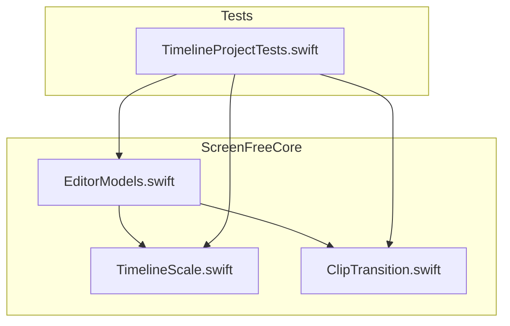
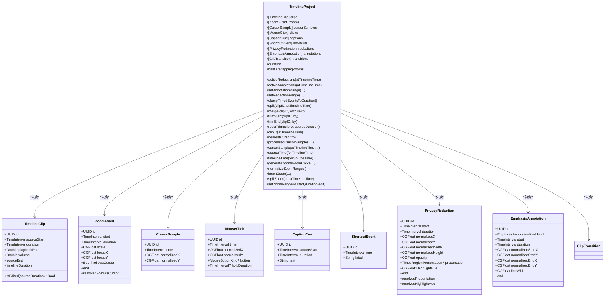
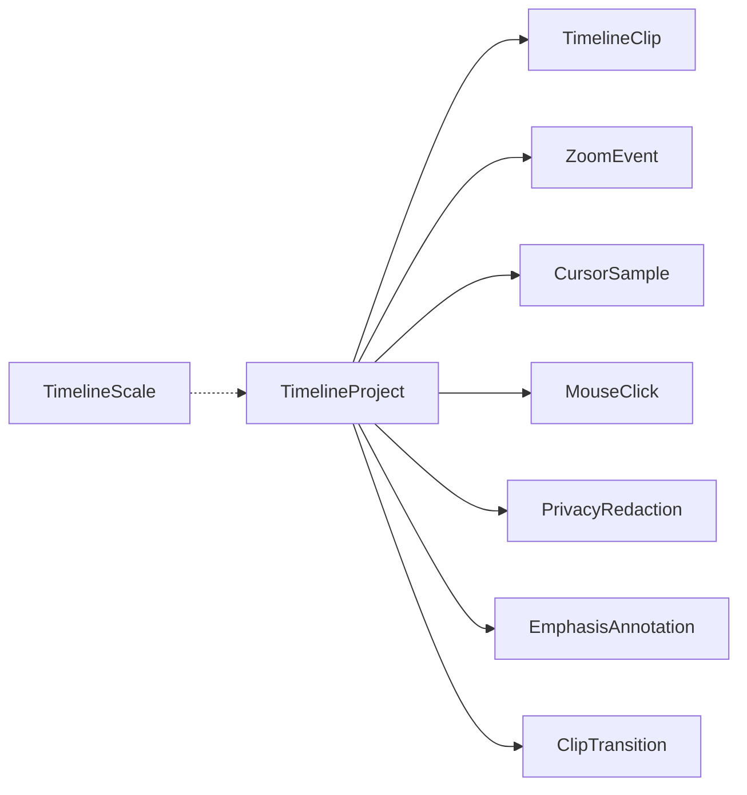

# TimelineProject 数据模型 API

<cite>
**本文引用的文件**   
- [EditorModels.swift](file://Sources/ScreenFreeCore/EditorModels.swift)
- [TimelineScale.swift](file://Sources/ScreenFreeCore/TimelineScale.swift)
- [ClipTransition.swift](file://Sources/ScreenFreeCore/ClipTransition.swift)
- [TimelineProjectTests.swift](file://Tests/ScreenFreeCoreTests/TimelineProjectTests.swift)
</cite>

## 目录
1. [简介](#简介)
2. [项目结构](#项目结构)
3. [核心组件](#核心组件)
4. [架构总览](#架构总览)
5. [详细组件分析](#详细组件分析)
6. [依赖关系分析](#依赖关系分析)
7. [性能考虑](#性能考虑)
8. [故障排查指南](#故障排查指南)
9. [结论](#结论)
10. [附录：常用操作示例与最佳实践](#附录常用操作示例与最佳实践)

## 简介
本文件为 TimelineProject 数据模型的权威 API 文档，覆盖时间线数据结构、剪辑对象（TimelineClip）、缩放事件（ZoomEvent）、光标样本（CursorSample）、隐私遮罩（PrivacyRedaction）、注释（EmphasisAnnotation）等核心类型的定义与字段说明；并详细说明时间线操作方法（添加剪辑、分割剪辑、调整时长、设置缩放点等）、缩放比例计算逻辑、播放头位置管理、撤销重做机制建议、数据验证规则与约束条件、性能优化建议，以及常见编辑功能的代码示例路径。

## 项目结构
- ScreenFreeCore 模块提供时间线核心数据模型与算法：
  - EditorModels.swift：定义 TimelineProject、TimelineClip、ZoomEvent、CursorSample、MouseClick、CaptionCue、ShortcutEvent、PrivacyRedaction、EmphasisAnnotation 等类型及 TimelineProject 的编辑方法。
  - TimelineScale.swift：时间线缩放与像素-时间转换、播放跟随策略。
  - ClipTransition.swift：剪辑间转场模板、转场帧计算、静音边缘裁剪等扩展。
- Tests/ScreenFreeCoreTests/TimelineProjectTests.swift：对时间线行为、缩放范围、光标处理、自动缩放生成等进行全面测试，可作为使用示例参考。

图表来源
- [EditorModels.swift:1-1031](file://Sources/ScreenFreeCore/EditorModels.swift#L1-L1031)
- [TimelineScale.swift:1-115](file://Sources/ScreenFreeCore/TimelineScale.swift#L1-L115)
- [ClipTransition.swift:1-258](file://Sources/ScreenFreeCore/ClipTransition.swift#L1-L258)
- [TimelineProjectTests.swift:1-876](file://Tests/ScreenFreeCoreTests/TimelineProjectTests.swift#L1-L876)

章节来源
- [EditorModels.swift:1-1031](file://Sources/ScreenFreeCore/EditorModels.swift#L1-L1031)
- [TimelineScale.swift:1-115](file://Sources/ScreenFreeCore/TimelineScale.swift#L1-L115)
- [ClipTransition.swift:1-258](file://Sources/ScreenFreeCore/ClipTransition.swift#L1-L258)
- [TimelineProjectTests.swift:1-876](file://Tests/ScreenFreeCoreTests/TimelineProjectTests.swift#L1-L876)

## 核心组件
- TimelineClip：表示一个时间线上的剪辑片段，包含源起始时间、持续时间、播放速率、音量，并提供是否被编辑过的判断。
- CursorSample：记录某一时刻的光标归一化坐标，用于回放时展示鼠标轨迹。
- MouseClick：记录一次鼠标点击事件（含按钮类型与按住时长），用于自动生成缩放事件。
- ZoomEvent：表示一段缩放区间，包含开始时间、持续时间、缩放倍率、焦点坐标、是否跟随光标。
- CaptionCue：字幕提示条，包含源起始时间与文本内容。
- ShortcutEvent：快捷键事件，用于在时间线上显示快捷键提示。
- PrivacyRedaction：隐私遮罩区域，包含时间区间、归一化矩形、透明度、呈现模式与高亮色相。
- EmphasisAnnotation：强调注释（矩形或线段），包含时间区间与起止坐标、线宽。
- TimelineProject：时间线项目，聚合上述所有数据，并提供丰富的编辑方法与查询方法。

章节来源
- [EditorModels.swift:4-273](file://Sources/ScreenFreeCore/EditorModels.swift#L4-L273)
- [EditorModels.swift:274-1024](file://Sources/ScreenFreeCore/EditorModels.swift#L274-L1024)

## 架构总览
TimelineProject 作为中心数据容器，维护多类时间相关事件与剪辑序列，并通过一系列方法完成剪辑分割、合并、修剪、时间映射、光标插值、自动缩放生成、缩放范围规范化等操作。TimelineScale 负责将时间轴上的时间点转换为屏幕像素坐标，并支持播放跟随策略。ClipTransition 提供剪辑间的转场模板与帧级效果计算，同时扩展了静音边缘裁剪能力。

图表来源
- [EditorModels.swift:4-273](file://Sources/ScreenFreeCore/EditorModels.swift#L4-L273)
- [EditorModels.swift:274-1024](file://Sources/ScreenFreeCore/EditorModels.swift#L274-L1024)
- [ClipTransition.swift:1-258](file://Sources/ScreenFreeCore/ClipTransition.swift#L1-L258)

## 详细组件分析

### TimelineClip 剪辑对象
- 字段
  - id：唯一标识
  - sourceStart：在原始素材中的起始时间
  - duration：在应用播放速率前的持续时间
  - playbackRate：播放速率（影响 timelineDuration）
  - volume：音量
- 关键属性与方法
  - sourceEnd：sourceStart + duration
  - timelineDuration：duration / max(0.01, playbackRate)，确保非零分母
  - isEdited(sourceDuration)：判断是否被裁剪、分割、变速或调音

章节来源
- [EditorModels.swift:4-45](file://Sources/ScreenFreeCore/EditorModels.swift#L4-L45)

### CursorSample 光标样本
- 字段
  - id：唯一标识
  - time：时间戳（对应源时间）
  - normalizedX/Y：归一化坐标（0..1）
- 用途：回放时展示鼠标移动轨迹，支持最近邻与插值两种模式

章节来源
- [EditorModels.swift:47-64](file://Sources/ScreenFreeCore/EditorModels.swift#L47-L64)

### MouseClick 鼠标点击事件
- 字段
  - id：唯一标识
  - time：时间戳
  - normalizedX/Y：归一化坐标
  - button：可选的鼠标按键类型（左/右）
  - holdDuration：可选的按住时长（秒）
- 用途：自动生成缩放事件（ZoomEvent），右键长按可延长缩放保持

章节来源
- [EditorModels.swift:66-94](file://Sources/ScreenFreeCore/EditorModels.swift#L66-L94)

### ZoomEvent 缩放事件
- 字段
  - id：唯一标识
  - start/duration：时间区间
  - scale：缩放倍率
  - focusX/focusY：焦点坐标（归一化）
  - followsCursor：是否跟随光标（默认 true）
- 关键属性
  - end：start + duration
  - resolvedFollowsCursor：解析后的布尔值

章节来源
- [EditorModels.swift:109-138](file://Sources/ScreenFreeCore/EditorModels.swift#L109-L138)

### PrivacyRedaction 隐私遮罩
- 字段
  - id：唯一标识
  - start/duration：时间区间
  - normalizedX/Y/Width/Height：归一化矩形
  - opacity：透明度
  - presentation：呈现模式（redaction/spotlight）
  - highlightHue：高亮色相
- 关键属性
  - end：start + duration
  - resolvedPresentation：默认 redaction
  - resolvedHighlightHue：默认色相并钳制到 0..1

章节来源
- [EditorModels.swift:188-231](file://Sources/ScreenFreeCore/EditorModels.swift#L188-L231)

### EmphasisAnnotation 强调注释
- 字段
  - id：唯一标识
  - kind：rectangle/line
  - start/duration：时间区间
  - normalizedStartX/Y、normalizedEndX/Y：起止坐标
  - lineWidth：线宽
- 关键属性
  - end：start + duration

章节来源
- [EditorModels.swift:238-272](file://Sources/ScreenFreeCore/EditorModels.swift#L238-L272)

### TimelineProject 时间线项目
- 字段
  - clips、zooms、cursorSamples、clicks、captions、shortcuts、redactions、annotations、transitions
- 关键方法（剪辑操作）
  - split(clipID, atTimelineTime)：按时间分割剪辑，保持源连续性与总时长不变
  - merge(clipID, withNext)：合并相邻且参数一致的剪辑
  - trimStart(clipID, by)/trimEnd(clipID, by)：裁剪首尾
  - resetTrim(clipID, sourceDuration)：恢复到可用源范围内最大可能区间
  - clipID(atTimelineTime)：根据时间返回所属剪辑 ID
- 关键方法（时间映射）
  - sourceTime(forTimelineTime)：时间线时间 -> 源时间
  - timelineTime(forSourceTime)：源时间 -> 时间线时间
- 关键方法（光标处理）
  - nearestCursor(to)：最近样本
  - processedCursorSamples(removeShakes, shakeThreshold, optimizeRapidChanges)：抖动过滤与快速变化平滑
  - cursorSample(atTimelineTime, freezeBeforeEnd, loopToStart, removeShakes, shakeThreshold, optimizeRapidChanges, smoothMovement)：综合获取光标样本（支持冻结尾部、循环回起点、平滑插值）
- 关键方法（自动缩放生成）
  - generateZoomsFromClicks(scale, duration, minimumSpacing)：基于点击事件生成缩放事件，支持右键长按延长
- 关键方法（缩放范围管理）
  - hasOverlappingZooms：检测重叠
  - normalizeZoomRanges(minimumDuration)：规范化去重、排序、裁剪至时间线边界
  - insertZoom(zoom, minimumDuration)：插入新缩放（拒绝冲突）
  - splitZoom(id, atTimelineTime, minimumSegmentDuration)：分割缩放区间
  - setZoomRange(id, start, duration, edit, minimumDuration)：移动/调整前/后边界，受邻居边界限制
- 关键方法（隐私与注释）
  - activeRedactions/atTimelineTime、activeAnnotations/atTimelineTime：查询当前激活的事件
  - setAnnotationRange/setRedactionRange：设置时间范围并钳制到项目时长
  - clampTimedEventsToDuration：将所有定时事件裁剪到项目时长内
- 其他
  - duration：所有剪辑 timelineDuration 之和
  - transitionJunctions()/setTransition()/pruneTransitions()：转场管理（见 ClipTransition 扩展）

章节来源
- [EditorModels.swift:274-1024](file://Sources/ScreenFreeCore/EditorModels.swift#L274-L1024)

### TimelineScale 时间线缩放与像素-时间转换
- 常量
  - fitZoom=1.0：适配视图的缩放
  - maximumZoom=64.0：最大缩放，保证长视频每像素小于 0.1 秒
  - stepFactor=sqrt(2)：步进因子
- 方法
  - contentWidth(viewportWidth)：内容宽度 = viewportWidth * zoom
  - x(forTime, duration, contentWidth)：时间 -> 像素 X
  - time(atX, duration, contentWidth)：像素 X -> 时间
  - timeDelta(forPointDistance, duration, contentWidth)：像素距离 -> 时间差
- 播放跟随策略
  - TimelinePlaybackFollowPolicy.resolve(playheadX, visibleMinX, viewportWidth, contentWidth, isPlaying, wasFollowing)：决定是否需要滚动以跟踪播放头

章节来源
- [TimelineScale.swift:1-115](file://Sources/ScreenFreeCore/TimelineScale.swift#L1-L115)

### ClipTransition 转场模板与帧计算
- 类型
  - ClipTransitionStyle：fade/flash/zoom
  - ClipTransition：锚定在两个相邻剪辑之间的转场（leftClipID/rightClipID/style/duration）
  - TransitionJunction：剪辑交界处的元信息（左右剪辑 ID、时间、转场）
  - ClipTransitionFrame：单帧转场效果（黑/白淡入淡出、缩放增强）
- 方法
  - ClipTransitionResolver.frame(junctions, at time)：根据时间计算转场帧
  - TimelineProject.transitionJunctions()：遍历剪辑生成交界列表
  - TimelineProject.setTransition()：插入或更新转场
  - TimelineProject.pruneTransitions()：清理不再相邻的转场
  - TimelineProject.trimSilenceAtEdges(waveform, sourceDuration, padding)：去除首尾静音段

章节来源
- [ClipTransition.swift:1-258](file://Sources/ScreenFreeCore/ClipTransition.swift#L1-L258)

## 依赖关系分析
- TimelineProject 依赖多种事件与剪辑类型，形成强内聚的数据模型。
- TimelineScale 独立于项目数据，仅负责时间-像素转换与播放跟随决策。
- ClipTransition 通过扩展 TimelineProject 提供转场与静音裁剪能力。
- 测试文件覆盖了大部分核心行为，可作为 API 使用的权威示例。

图表来源
- [EditorModels.swift:274-1024](file://Sources/ScreenFreeCore/EditorModels.swift#L274-L1024)
- [TimelineScale.swift:1-115](file://Sources/ScreenFreeCore/TimelineScale.swift#L1-L115)
- [ClipTransition.swift:1-258](file://Sources/ScreenFreeCore/ClipTransition.swift#L1-L258)

## 性能考虑
- 光标样本处理
  - processedCursorSamples 会先排序再线性扫描，复杂度 O(n log n)；建议在批量处理前进行采样或降频。
  - 抖动过滤与快速变化平滑仅在样本数 >= 3 时生效，避免无意义开销。
- 时间映射
  - sourceTime/timelineTime 采用线性扫描，复杂度 O(n)；若频繁查询，可对 clips 建立索引或二分查找。
- 缩放范围规范化
  - normalizeZoomRanges 会排序与合并重叠区间，复杂度 O(m log m)；批量插入时应尽量一次性提交以减少多次规范化。
- 播放跟随
  - TimelinePlaybackFollowPolicy.resolve 的计算为常数时间，适合高频调用。
- 内存与序列化
  - TimelineProject 实现 Codable，便于持久化；注意大项目序列化时的内存峰值。

[本节为通用指导，不直接分析具体文件]

## 故障排查指南
- 分割失败
  - 检查分割点是否在剪辑内部且满足最小阈值（约 0.05 秒）。
  - 参考测试用例：testSplitPreservesDurationAndSourceContinuity。
- 合并失败
  - 相邻剪辑需满足源连续性、播放速率与音量一致。
  - 参考测试用例：testMergeRestoresContiguousClipsWithoutLosingSettings。
- 缩放范围冲突
  - 插入新缩放时需避免与现有区间重叠；可使用 hasOverlappingZooms 检测。
  - 参考测试用例：testInsertingZoomRejectsOccupiedStartAndStopsAtNextBoundary。
- 隐私/注释越界
  - setRedactionRange/setAnnotationRange 会自动钳制到项目时长；必要时调用 clampTimedEventsToDuration。
  - 参考测试用例：testPrivacyRedactionRangeResizesAndClampsToTimeline。
- 光标回放异常
  - 确认 cursorSamples 已按时间排序；smoothMovement 启用时会进行插值。
  - 参考测试用例：testCursorTailFreezeAndReturnUseResolvedPositions。

章节来源
- [TimelineProjectTests.swift:610-712](file://Tests/ScreenFreeCoreTests/TimelineProjectTests.swift#L610-L712)
- [TimelineProjectTests.swift:312-455](file://Tests/ScreenFreeCoreTests/TimelineProjectTests.swift#L312-L455)
- [TimelineProjectTests.swift:487-546](file://Tests/ScreenFreeCoreTests/TimelineProjectTests.swift#L487-L546)
- [TimelineProjectTests.swift:199-310](file://Tests/ScreenFreeCoreTests/TimelineProjectTests.swift#L199-L310)

## 结论
TimelineProject 提供了完整的时间线数据模型与编辑能力，涵盖剪辑、缩放、光标、隐私遮罩、注释与转场等关键功能。其方法设计注重边界安全与数据一致性，配合 TimelineScale 的像素-时间转换与播放跟随策略，能够支撑高效的交互式编辑体验。通过测试用例可快速掌握常见操作与约束条件。

[本节为总结性内容，不直接分析具体文件]

## 附录：常用操作示例与最佳实践

### 时间线缩放比例计算与像素-时间转换
- 使用 TimelineScale 将时间映射到像素坐标，或将像素拖拽距离转换为时间差。
- 参考测试用例：testTimelineScaleFitsZoomsAndPreservesDragMapping、testMaximumTimelineZoomAllowsSubTenthSecondEditingForLongVideo。

章节来源
- [TimelineScale.swift:18-50](file://Sources/ScreenFreeCore/TimelineScale.swift#L18-L50)
- [TimelineProjectTests.swift:47-112](file://Tests/ScreenFreeCoreTests/TimelineProjectTests.swift#L47-L112)

### 播放头位置管理与跟随策略
- 使用 TimelinePlaybackFollowPolicy.resolve 决定是否滚动以跟踪播放头，避免不必要的滚动。
- 参考测试用例：testPlaybackFollowMovesTheViewportAndReleasesItWhenPaused、testPlaybackFollowReturnsToTheBeginningAfterReplay。

章节来源
- [TimelineScale.swift:65-114](file://Sources/ScreenFreeCore/TimelineScale.swift#L65-L114)
- [TimelineProjectTests.swift:114-197](file://Tests/ScreenFreeCoreTests/TimelineProjectTests.swift#L114-L197)

### 撤销/重做机制建议
- 由于 TimelineProject 及其成员均为值类型（struct），可通过保存快照实现撤销/重做：
  - 在每次编辑前复制一份 TimelineProject 快照。
  - 将快照推入历史栈；撤销时恢复上一个快照。
- 该策略简单可靠，适用于大多数编辑场景。

[本节为概念性指导，不直接分析具体文件]

### 常见编辑功能示例（路径引用）
- 分割剪辑并保持时长与源连续性：
  - 参考测试用例：testSplitPreservesDurationAndSourceContinuity
- 合并相邻剪辑并保留设置：
  - 参考测试用例：testMergeRestoresContiguousClipsWithoutLosingSettings
- 调整剪辑首尾：
  - 参考测试用例：testTrimStartMovesSourceAndShortensClip
- 重置裁剪到可用源范围：
  - 参考测试用例：testResetTrimRestoresOnlyTheAvailableSourceRange
- 自动生成缩放事件（基于点击）：
  - 参考测试用例：testAutomaticZoomsFollowClicksAndCoalesceBursts、testRightMouseHoldKeepsAutomaticZoomActiveUntilRelease
- 设置与规范化缩放范围：
  - 参考测试用例：testZoomRangeCanResizeFromEitherEdgeAndClampsToTimeline、testZoomRangeEditsStopAtNeighborBoundaries、testLegacyOverlappingZoomsNormalizeToAdjacentRanges
- 隐私遮罩与注释范围设置：
  - 参考测试用例：testPrivacyRedactionRangeResizesAndClampsToTimeline、testAnnotationRoundTripActivationAndRangeClamping
- 光标回放与平滑：
  - 参考测试用例：testCursorTailFreezeAndReturnUseResolvedPositions

章节来源
- [TimelineProjectTests.swift:610-846](file://Tests/ScreenFreeCoreTests/TimelineProjectTests.swift#L610-L846)