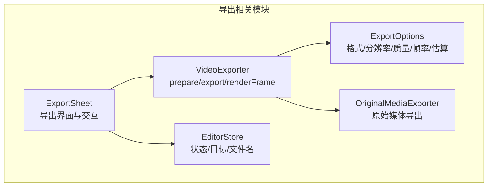
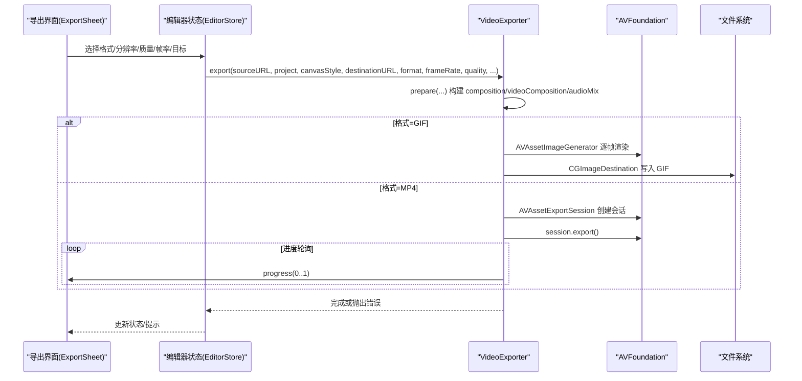
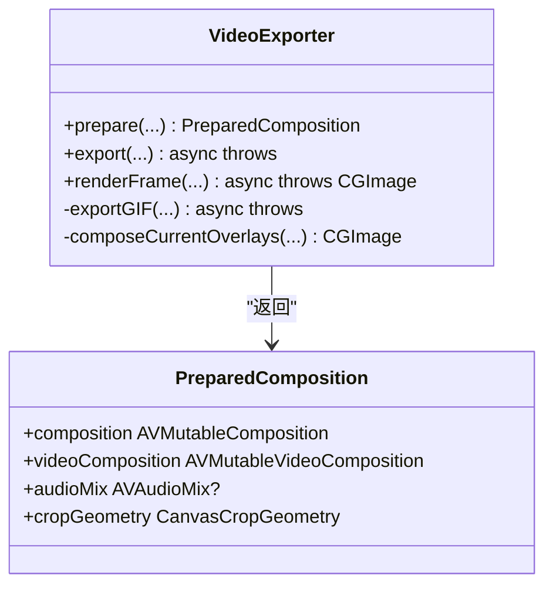
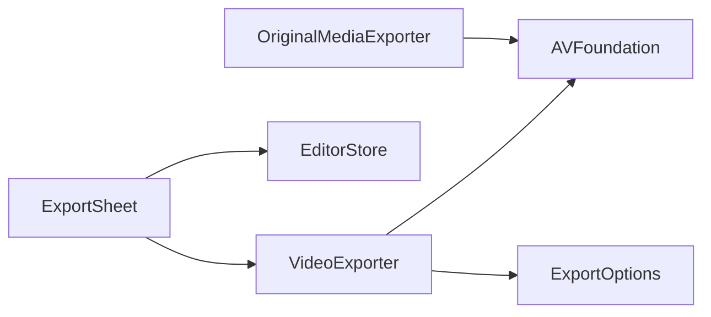

# VideoExporter 导出 API

<cite>
**本文引用的文件**   
- [VideoExporter.swift](file://Sources/ScreenFree/VideoExporter.swift)
- [ExportOptions.swift](file://Sources/ScreenFree/ExportOptions.swift)
- [ExportSheet.swift](file://Sources/ScreenFree/ExportSheet.swift)
- [OriginalMediaExporter.swift](file://Sources/ScreenFree/OriginalMediaExporter.swift)
- [EditorStore.swift](file://Sources/ScreenFree/EditorStore.swift)
- [VideoExporterTests.swift](file://Tests/ScreenFreeMediaTests/VideoExporterTests.swift)
- [ExportOptionsTests.swift](file://Tests/ScreenFreeMediaTests/ExportOptionsTests.swift)
</cite>

## 目录
1. [简介](#简介)
2. [项目结构](#项目结构)
3. [核心组件](#核心组件)
4. [架构总览](#架构总览)
5. [详细组件分析](#详细组件分析)
6. [依赖关系分析](#依赖关系分析)
7. [性能考量](#性能考量)
8. [故障排查指南](#故障排查指南)
9. [结论](#结论)
10. [附录](#附录)

## 简介
本文件面向使用与扩展 VideoExporter 视频导出能力的开发者，系统化说明导出引擎的公共接口、支持的导出格式（MP4、GIF）、分辨率设置、质量预设、帧率配置、进度回调、错误处理策略，以及导出选项的配置方法（自定义宽高比、编码参数、音频设置等）。同时覆盖批量导出、后台导出、取消导出的实现方式，并提供与 AVFoundation 集成的要点和性能优化技巧。

## 项目结构
- Sources/ScreenFree/VideoExporter.swift：导出引擎核心实现，包含 prepare、export、renderFrame 及 GIF 导出等关键逻辑。
- Sources/ScreenFree/ExportOptions.swift：导出格式、分辨率、质量、帧率、尺寸估算等配置枚举与工具。
- Sources/ScreenFree/ExportSheet.swift：导出 UI 入口，展示并驱动导出流程。
- Sources/ScreenFree/OriginalMediaExporter.swift：原始媒体导出（如提取单条音轨）辅助能力。
- Sources/ScreenFree/EditorStore.swift：编辑器状态管理，负责导出目标类型、文件名、UI 交互等。
- Tests/ScreenFreeMediaTests/VideoExporterTests.swift：导出功能测试用例，覆盖缩放、模糊、隐私遮罩、背景乐循环等。
- Tests/ScreenFreeMediaTests/ExportOptionsTests.swift：导出选项计算与边界校验测试。

图表来源
- [VideoExporter.swift:95-590](file://Sources/ScreenFree/VideoExporter.swift#L95-L590)
- [ExportOptions.swift:79-362](file://Sources/ScreenFree/ExportOptions.swift#L79-L362)
- [ExportSheet.swift:1-395](file://Sources/ScreenFree/ExportSheet.swift#L1-L395)
- [OriginalMediaExporter.swift:24-82](file://Sources/ScreenFree/OriginalMediaExporter.swift#L24-L82)
- [EditorStore.swift:2641-2643](file://Sources/ScreenFree/EditorStore.swift#L2641-L2643)

章节来源
- [VideoExporter.swift:95-590](file://Sources/ScreenFree/VideoExporter.swift#L95-L590)
- [ExportOptions.swift:79-362](file://Sources/ScreenFree/ExportOptions.swift#L79-L362)
- [ExportSheet.swift:1-395](file://Sources/ScreenFree/ExportSheet.swift#L1-L395)
- [OriginalMediaExporter.swift:24-82](file://Sources/ScreenFree/OriginalMediaExporter.swift#L24-L82)
- [EditorStore.swift:2641-2643](file://Sources/ScreenFree/EditorStore.swift#L2641-L2643)

## 核心组件
- VideoExporter：提供 prepare、export、renderFrame 三个主要方法；内部封装了 Composition 构建、视频/音频混合、图层指令、缩放/转场、画布样式、光标与字幕合成、GIF 导出等。
- ExportOptions：定义 ExportFormat（MP4、GIF）、ExportResolution（源/4K/1080p/720p/自定义）、ExportQuality（Studio/Social/Web/Web Low）、ExportDimensions、ExportEstimateCalculator 等。
- ExportSheet：用户选择导出格式、帧率、分辨率、压缩质量、目标位置，触发导出并显示进度。
- OriginalMediaExporter：从多轨素材中提取指定音轨为独立音频文件。
- EditorStore：维护导出状态、文件名、目标类型（文件/剪贴板/分享链接），驱动 UI 与导出流程。

章节来源
- [VideoExporter.swift:95-590](file://Sources/ScreenFree/VideoExporter.swift#L95-L590)
- [ExportOptions.swift:79-362](file://Sources/ScreenFree/ExportOptions.swift#L79-L362)
- [ExportSheet.swift:1-395](file://Sources/ScreenFree/ExportSheet.swift#L1-L395)
- [OriginalMediaExporter.swift:24-82](file://Sources/ScreenFree/OriginalMediaExporter.swift#L24-L82)
- [EditorStore.swift:2641-2643](file://Sources/ScreenFree/EditorStore.swift#L2641-L2643)

## 架构总览
导出流程以 VideoExporter.prepare 构建可编辑的 AVMutableComposition 与 AVMutableVideoComposition，再根据格式分支：
- MP4：通过 AVAssetExportSession 输出，支持最大文件大小限制、网络优化、进度轮询与取消。
- GIF：通过 CGImageDestination + AVAssetImageGenerator 逐帧生成，支持色阶量化与延迟控制。

图表来源
- [VideoExporter.swift:488-590](file://Sources/ScreenFree/VideoExporter.swift#L488-L590)
- [VideoExporter.swift:1189-1264](file://Sources/ScreenFree/VideoExporter.swift#L1189-L1264)
- [ExportSheet.swift:245-277](file://Sources/ScreenFree/ExportSheet.swift#L245-L277)

## 详细组件分析

### VideoExporter 类与方法
- prepare(sourceURL, cameraURL?, backgroundMusicURL?, backgroundMusicVolume, recordedAudioMix, project, frameRate, renderSizeOverride?, canvasStyle, cameraStyle) -> PreparedComposition
  - 加载源视频/音频轨道，构建 AVMutableComposition，插入时间范围，按 clip.playbackRate 缩放时间。
  - 可选相机轨道叠加，计算相机缩放与位置，支持圆角合成器。
  - 应用缩放动画、画布样式、光标、字幕、快捷键、隐私遮罩、标注、运动模糊等。
  - 返回 PreparedComposition（composition、videoComposition、audioMix、cropGeometry）。
- export(sourceURL, cameraURL?, backgroundMusicURL?, backgroundMusicVolume, recordedAudioMix, project, canvasStyle, cameraStyle?, destinationURL, format, frameRate, quality, renderSizeOverride?, presetName, maximumFileSizeBytes?, progress?)
  - 先调用 prepare 获取 PreparedComposition。
  - 若 format == .gif，走 exportGIF 路径；否则创建 AVAssetExportSession，设置输出 URL、类型、videoComposition、audioMix、网络优化、文件大小上限，启动导出并轮询进度。
  - 支持取消：任务取消时调用 session.cancelExport()，清理临时文件并抛出 CancellationError。
- renderFrame(sourceURL, cameraURL?, project, timelineTime, canvasStyle, cameraStyle?, frameRate) -> CGImage
  - 基于 PreparedComposition 使用 AVAssetReader + AVAssetReaderVideoCompositionOutput 读取单帧像素缓冲，转换为 CGImage，并叠加当前时刻的光标、点击效果、字幕、快捷键、隐私遮罩、标注等。

图表来源
- [VideoExporter.swift:95-101](file://Sources/ScreenFree/VideoExporter.swift#L95-L101)
- [VideoExporter.swift:103-486](file://Sources/ScreenFree/VideoExporter.swift#L103-L486)
- [VideoExporter.swift:488-590](file://Sources/ScreenFree/VideoExporter.swift#L488-L590)
- [VideoExporter.swift:592-667](file://Sources/ScreenFree/VideoExporter.swift#L592-L667)
- [VideoExporter.swift:1189-1264](file://Sources/ScreenFree/VideoExporter.swift#L1189-L1264)

章节来源
- [VideoExporter.swift:95-486](file://Sources/ScreenFree/VideoExporter.swift#L95-L486)
- [VideoExporter.swift:488-590](file://Sources/ScreenFree/VideoExporter.swift#L488-L590)
- [VideoExporter.swift:592-667](file://Sources/ScreenFree/VideoExporter.swift#L592-L667)
- [VideoExporter.swift:1189-1264](file://Sources/ScreenFree/VideoExporter.swift#L1189-L1264)

### 导出选项与配置（ExportOptions）
- ExportFormat：mp4、gif。
- ExportResolution：source、p4K、p1080、p720、custom；提供 presetName 映射到 AVAssetExportPreset*。
- ExportDimensions：宽/高，自动对齐偶数像素，范围 320..7680。
- ExportQuality：studio、social、web、webLow；提供 imageCompressionQuality、gifPosterizeLevels、videoBitsPerPixelPerFrame、gifBytesPerPixelPerFrame 等。
- ExportFrameRateOptions：支持帧率集合与归一化（GIF 最高 20 FPS）。
- ExportEstimateCalculator：估算文件大小与处理时长，支持 targetFileLength（仅非 studio 的 MP4）。

章节来源
- [ExportOptions.swift:79-362](file://Sources/ScreenFree/ExportOptions.swift#L79-L362)

### 导出 UI（ExportSheet）
- 提供格式、帧率、分辨率、压缩质量、目标位置的选择。
- 动态限制 GIF 帧率上限，显示预估大小与耗时。
- 导出进行中禁用关闭，支持取消导出。

章节来源
- [ExportSheet.swift:1-395](file://Sources/ScreenFree/ExportSheet.swift#L1-L395)

### 原始媒体导出（OriginalMediaExporter）
- extractAudio(sourceURL, trackIndex, destinationURL)：从多轨素材中抽取指定索引的音轨，输出为 m4a 文件。

章节来源
- [OriginalMediaExporter.swift:24-82](file://Sources/ScreenFree/OriginalMediaExporter.swift#L24-L82)

### 编辑器状态（EditorStore）
- 决定导出目标类型（文件/剪贴板/分享链接），设置允许的文件类型与默认文件名（gif/mp4）。
- 驱动导出按钮与取消操作。

章节来源
- [EditorStore.swift:2641-2643](file://Sources/ScreenFree/EditorStore.swift#L2641-L2643)

## 依赖关系分析
- VideoExporter 依赖 AVFoundation（AVMutableComposition、AVAssetExportSession、AVAssetImageGenerator、CGImageDestination 等）进行媒体处理。
- ExportOptions 提供导出参数的标准化与估算，被 UI 与导出流程共同使用。
- ExportSheet 作为 UI 层，将用户选择转化为参数并调用 VideoExporter。
- OriginalMediaExporter 与 ExportOptions 配合，用于原始媒体导出与尺寸/质量估算。

图表来源
- [VideoExporter.swift:488-590](file://Sources/ScreenFree/VideoExporter.swift#L488-L590)
- [ExportOptions.swift:79-362](file://Sources/ScreenFree/ExportOptions.swift#L79-L362)
- [ExportSheet.swift:1-395](file://Sources/ScreenFree/ExportSheet.swift#L1-L395)
- [OriginalMediaExporter.swift:24-82](file://Sources/ScreenFree/OriginalMediaExporter.swift#L24-L82)

章节来源
- [VideoExporter.swift:488-590](file://Sources/ScreenFree/VideoExporter.swift#L488-L590)
- [ExportOptions.swift:79-362](file://Sources/ScreenFree/ExportOptions.swift#L79-L362)
- [ExportSheet.swift:1-395](file://Sources/ScreenFree/ExportSheet.swift#L1-L395)
- [OriginalMediaExporter.swift:24-82](file://Sources/ScreenFree/OriginalMediaExporter.swift#L24-L82)

## 性能考量
- 帧率与分辨率：更高的帧率与分辨率会显著增加处理时长与文件大小。ExportEstimateCalculator 已提供估算模型。
- GIF 导出：帧率限制在 20 FPS，支持色阶量化（posterize）降低颜色深度，减少体积。
- MP4 导出：启用 shouldOptimizeForNetworkUse，合理设置 fileLengthLimit 避免过大文件。
- 渲染优化：CIContext 禁用中间缓存，减少内存占用；逐帧渲染时及时检查取消，避免无效计算。
- 音频混合：按需合并音轨，避免不必要的重采样与混音开销。

[本节为通用指导，不直接分析具体文件]

## 故障排查指南
- 常见错误类型：
  - missingVideoTrack：源不包含视频轨道。
  - cannotCreateCompositionTrack：无法创建可编辑轨道。
  - cannotCreateExportSession：无法创建导出会话。
  - cannotReadComposedFrame：无法读取合成帧。
  - exportFailed：导出失败。
- 取消导出：
  - 在 export 中使用 Task.checkCancellation 与 withTaskCancellationHandler，取消时清理输出文件并抛出 CancellationError。
- 进度回调：
  - MP4：轮询 session.progress 并通过 @MainActor @Sendable 回调。
  - GIF：每添加一帧即回调进度。
- 文件清理：
  - 失败或取消时删除目标文件，确保无残留。
- 测试验证：
  - 参考 VideoExporterTests 中的缩放、模糊、隐私遮罩、背景乐循环等用例，定位问题。

章节来源
- [VideoExporter.swift:12-33](file://Sources/ScreenFree/VideoExporter.swift#L12-L33)
- [VideoExporter.swift:554-590](file://Sources/ScreenFree/VideoExporter.swift#L554-L590)
- [VideoExporter.swift:1189-1264](file://Sources/ScreenFree/VideoExporter.swift#L1189-L1264)
- [VideoExporterTests.swift:42-224](file://Tests/ScreenFreeMediaTests/VideoExporterTests.swift#L42-L224)

## 结论
VideoExporter 提供了完整的视频导出能力，涵盖 MP4 与 GIF 两种格式，支持丰富的导出选项（分辨率、质量、帧率、画布样式、音频混合等），具备进度回调、取消导出与错误处理机制。结合 ExportOptions 与 ExportSheet，可实现从用户配置到实际导出的完整闭环。通过合理的性能优化与完善的测试覆盖，可在保证质量的同时提升导出效率与用户体验。

[本节为总结性内容，不直接分析具体文件]

## 附录

### 导出方法与参数说明
- prepare(...)
  - 输入：源视频 URL、可选相机/背景音乐 URL、录制音频混音、时间线项目、帧率、渲染尺寸覆盖、画布样式、相机样式。
  - 输出：PreparedComposition（composition、videoComposition、audioMix、cropGeometry）。
- export(...)
  - 输入：同 prepare，加上 destinationURL、format、quality、presetName、maximumFileSizeBytes、progress 回调。
  - 行为：准备后按格式分支导出，支持进度与取消。
- renderFrame(...)
  - 输入：同 prepare，加上 timelineTime。
  - 输出：CGImage（含当前时刻叠加层）。

章节来源
- [VideoExporter.swift:103-486](file://Sources/ScreenFree/VideoExporter.swift#L103-L486)
- [VideoExporter.swift:488-590](file://Sources/ScreenFree/VideoExporter.swift#L488-L590)
- [VideoExporter.swift:592-667](file://Sources/ScreenFree/VideoExporter.swift#L592-L667)

### 导出选项配置
- 格式：ExportFormat.mp4 / .gif。
- 分辨率：ExportResolution.source/p4K/p1080/p720/custom，custom 需设置 ExportDimensions。
- 质量：ExportQuality.studio/social/web/webLow，影响压缩与 GIF 色阶。
- 帧率：ExportFrameRateOptions.supported(for:)，GIF 最高 20。
- 估算：ExportEstimateCalculator.estimate(...) 与 targetFileLength(...)。

章节来源
- [ExportOptions.swift:79-362](file://Sources/ScreenFree/ExportOptions.swift#L79-L362)

### 批量导出、后台导出、取消导出
- 批量导出：多次调用 export(...)，每次传入不同 destinationURL；注意并发与资源占用，建议串行或限流。
- 后台导出：export 为 async 方法，可在后台任务中调用；进度回调使用 @MainActor 确保 UI 安全。
- 取消导出：在 export 中监听任务取消，调用 session.cancelExport() 并清理文件。

章节来源
- [VideoExporter.swift:554-590](file://Sources/ScreenFree/VideoExporter.swift#L554-L590)
- [ExportSheet.swift:245-277](file://Sources/ScreenFree/ExportSheet.swift#L245-L277)

### 代码示例路径（不含代码内容）
- MP4 导出：参见 [VideoExporter.swift:488-590](file://Sources/ScreenFree/VideoExporter.swift#L488-L590)。
- GIF 导出：参见 [VideoExporter.swift:1189-1264](file://Sources/ScreenFree/VideoExporter.swift#L1189-L1264)。
- 进度回调：参见 [VideoExporter.swift:554-590](file://Sources/ScreenFree/VideoExporter.swift#L554-L590)。
- 取消导出：参见 [VideoExporter.swift:554-590](file://Sources/ScreenFree/VideoExporter.swift#L554-L590)。
- 单帧渲染：参见 [VideoExporter.swift:592-667](file://Sources/ScreenFree/VideoExporter.swift#L592-L667)。
- 导出选项：参见 [ExportOptions.swift:79-362](file://Sources/ScreenFree/ExportOptions.swift#L79-L362)。
- 导出 UI：参见 [ExportSheet.swift:1-395](file://Sources/ScreenFree/ExportSheet.swift#L1-L395)。
- 原始媒体导出：参见 [OriginalMediaExporter.swift:24-82](file://Sources/ScreenFree/OriginalMediaExporter.swift#L24-L82)。

### 与 AVFoundation 集成要点
- Composition 构建：AVMutableComposition 插入时间范围，按播放速率缩放。
- 视频合成：AVMutableVideoComposition + 图层指令，支持缩放、转场、画布样式。
- 音频混合：AVAudioMixInputParameters 设置音量与淡入淡出。
- 导出会话：AVAssetExportSession 设置输出类型、视频组合、音频混合、网络优化、文件大小限制。
- GIF 生成：AVAssetImageGenerator 逐帧渲染，CGImageDestination 写入 GIF，支持延迟与压缩质量。

章节来源
- [VideoExporter.swift:103-486](file://Sources/ScreenFree/VideoExporter.swift#L103-L486)
- [VideoExporter.swift:488-590](file://Sources/ScreenFree/VideoExporter.swift#L488-L590)
- [VideoExporter.swift:1189-1264](file://Sources/ScreenFree/VideoExporter.swift#L1189-L1264)

### 性能优化技巧
- 合理设置帧率与分辨率，避免过高导致处理缓慢。
- GIF 导出使用 posterize 降低颜色深度，限制帧率。
- MP4 导出启用网络优化，设置文件大小上限。
- 渲染阶段禁用中间缓存，减少内存峰值。
- 及时检查取消，避免无效计算。

[本节为通用指导，不直接分析具体文件]