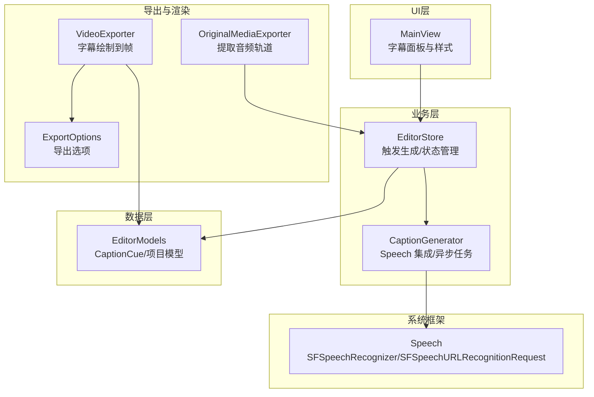
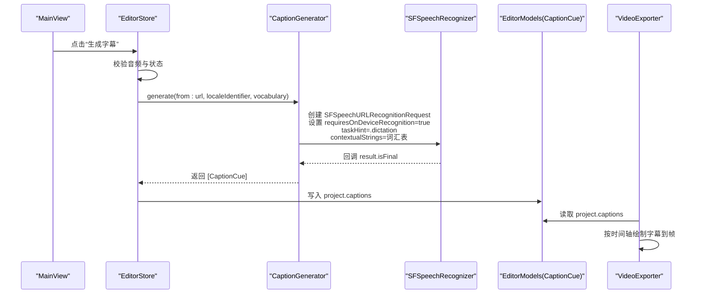
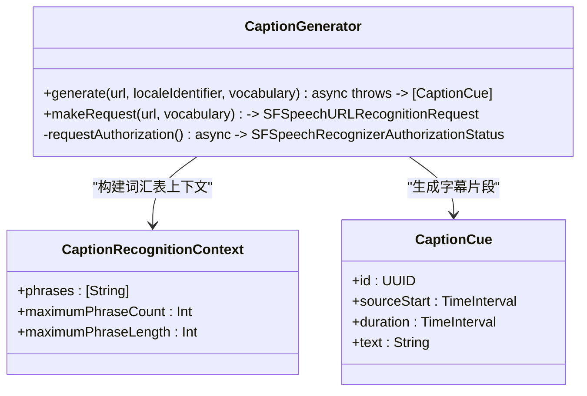
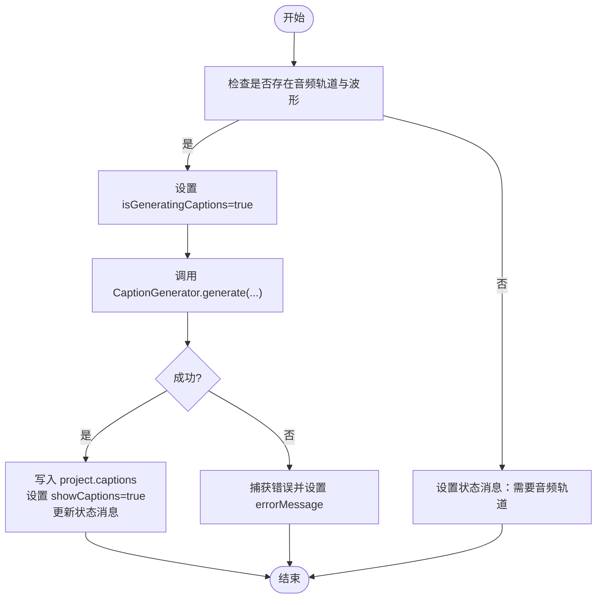
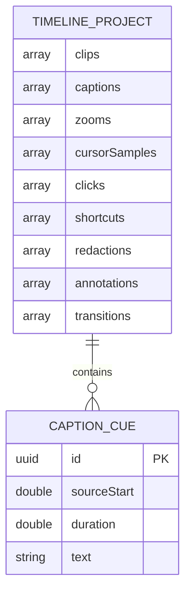
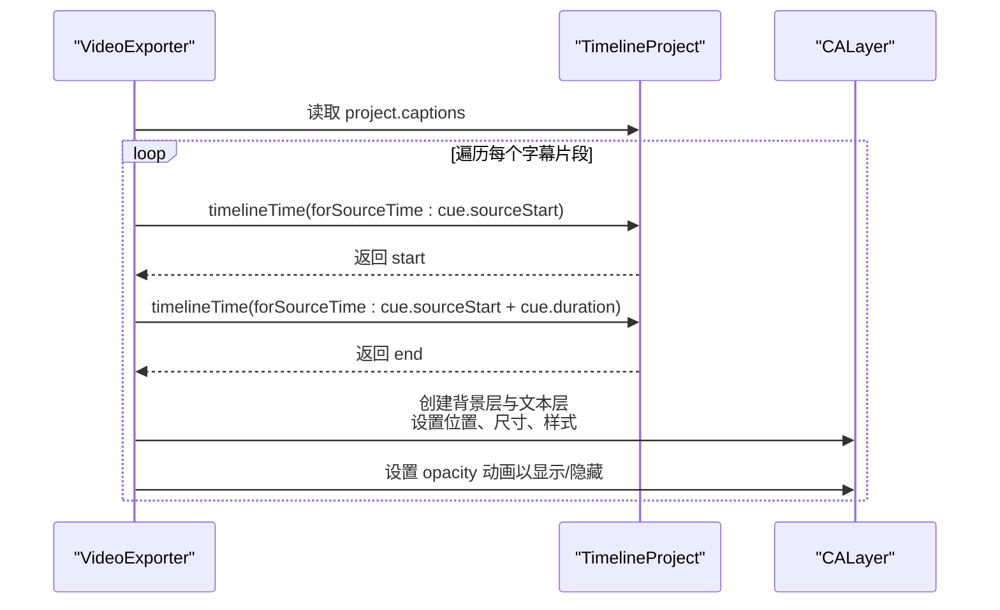
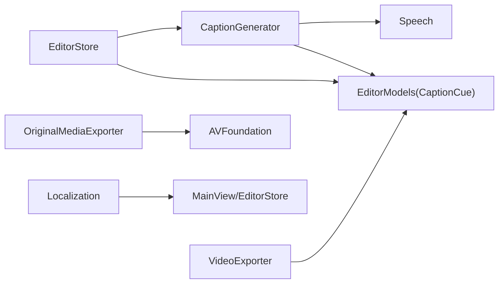

# 字幕生成 API

<cite>
**本文引用的文件**   
- [CaptionGenerator.swift](file://Sources/ScreenFree/CaptionGenerator.swift)
- [EditorModels.swift](file://Sources/ScreenFreeCore/EditorModels.swift)
- [EditorStore.swift](file://Sources/ScreenFree/EditorStore.swift)
- [MainView.swift](file://Sources/ScreenFree/MainView.swift)
- [ExportOptions.swift](file://Sources/ScreenFree/ExportOptions.swift)
- [OriginalMediaExporter.swift](file://Sources/ScreenFree/OriginalMediaExporter.swift)
- [VideoExporter.swift](file://Sources/ScreenFree/VideoExporter.swift)
- [Localization.swift](file://Sources/ScreenFree/Localization.swift)
- [CaptionGeneratorTests.swift](file://Tests/ScreenFreeMediaTests/CaptionGeneratorTests.swift)
</cite>

## 目录
1. [简介](#简介)
2. [项目结构](#项目结构)
3. [核心组件](#核心组件)
4. [架构总览](#架构总览)
5. [详细组件分析](#详细组件分析)
6. [依赖关系分析](#依赖关系分析)
7. [性能考量](#性能考量)
8. [故障排查指南](#故障排查指南)
9. [结论](#结论)
10. [附录](#附录)

## 简介
本文件面向“基于 Apple Speech 框架的字幕生成功能”的 API 文档，覆盖语音识别配置、语言设置、词汇表定制、异步处理与回调机制、错误处理策略、字幕数据结构与时间轴对齐、文本编辑能力、多语言支持和本地化、字幕样式设置，以及与 Speech 框架的集成方式。同时提供性能优化建议与常见问题解决方案，并给出调用示例的路径引用以便快速定位实现。

## 项目结构
- 字幕生成核心逻辑位于 ScreenFree 模块的 CaptionGenerator.swift，封装了权限检查、SFSpeechRecognizer 初始化、请求构建、异步任务与结果回调。
- 字幕数据模型定义在 ScreenFreeCore 模块的 EditorModels.swift，包含 CaptionCue 等关键类型。
- 编辑器状态与用户交互入口在 EditorStore.swift，负责触发字幕生成、管理语言与词汇表参数、更新 UI 状态。
- 界面展示与样式设置在 MainView.swift，包括识别语言选择、是否显示字幕、字号控制等。
- 导出与渲染涉及 VideoExporter.swift，将字幕按时间轴绘制到视频帧上；ExportOptions.swift 提供导出相关选项；OriginalMediaExporter.swift 用于提取原始音频轨道。
- 本地化能力由 Localization.swift 提供，统一语言切换与文案格式化。
- 单元测试 CaptionGeneratorTests.swift 验证词汇表清洗与请求配置。

图表来源
- [MainView.swift](file://Sources/ScreenFree/MainView.swift)
- [EditorStore.swift](file://Sources/ScreenFree/EditorStore.swift)
- [CaptionGenerator.swift](file://Sources/ScreenFree/CaptionGenerator.swift)
- [EditorModels.swift](file://Sources/ScreenFreeCore/EditorModels.swift)
- [VideoExporter.swift](file://Sources/ScreenFree/VideoExporter.swift)
- [ExportOptions.swift](file://Sources/ScreenFree/ExportOptions.swift)
- [OriginalMediaExporter.swift](file://Sources/ScreenFree/OriginalMediaExporter.swift)

章节来源
- [CaptionGenerator.swift:1-140](file://Sources/ScreenFree/CaptionGenerator.swift#L1-L140)
- [EditorModels.swift:146-163](file://Sources/ScreenFreeCore/EditorModels.swift#L146-L163)
- [EditorStore.swift:2128-2150](file://Sources/ScreenFree/EditorStore.swift#L2128-L2150)
- [MainView.swift:2503-2523](file://Sources/ScreenFree/MainView.swift#L2503-L2523)
- [VideoExporter.swift:1771-1808](file://Sources/ScreenFree/VideoExporter.swift#L1771-L1808)
- [ExportOptions.swift:1-362](file://Sources/ScreenFree/ExportOptions.swift#L1-L362)
- [OriginalMediaExporter.swift:1-82](file://Sources/ScreenFree/OriginalMediaExporter.swift#L1-L82)
- [Localization.swift:1-52](file://Sources/ScreenFree/Localization.swift#L1-L52)
- [CaptionGeneratorTests.swift:1-37](file://Tests/ScreenFreeMediaTests/CaptionGeneratorTests.swift#L1-L37)

## 核心组件
- CaptionGenerator：封装 Apple Speech 的 URL 识别流程，包含权限检查、设备端识别强制、词汇表上下文注入、异步任务包装与结果映射为字幕片段。
- CaptionCue：字幕片段数据模型，包含源时间起点、时长与文本内容，便于时间轴对齐与编辑。
- EditorStore：编辑器状态中心，暴露字幕语言、词汇表、显示开关、字号等属性，并提供 generateCaptions() 启动生成流程。
- MainView：提供字幕识别语言选择、显示开关、字号滑块等 UI 控件，驱动 EditorStore 的属性变化。
- VideoExporter：在导出阶段根据项目时间轴将字幕片段渲染到视频帧，保证时间与位置一致。
- OriginalMediaExporter：从媒体文件中提取指定音频轨道，供后续分析与字幕生成使用。
- ExportOptions：导出格式、分辨率、质量等选项，影响最终输出。
- Localization：应用级语言枚举与本地化文本格式化，确保错误与状态信息符合当前语言。

章节来源
- [CaptionGenerator.swift:1-140](file://Sources/ScreenFree/CaptionGenerator.swift#L1-L140)
- [EditorModels.swift:146-163](file://Sources/ScreenFreeCore/EditorModels.swift#L146-L163)
- [EditorStore.swift:2128-2150](file://Sources/ScreenFree/EditorStore.swift#L2128-L2150)
- [MainView.swift:2503-2523](file://Sources/ScreenFree/MainView.swift#L2503-L2523)
- [VideoExporter.swift:1771-1808](file://Sources/ScreenFree/VideoExporter.swift#L1771-L1808)
- [OriginalMediaExporter.swift:1-82](file://Sources/ScreenFree/OriginalMediaExporter.swift#L1-L82)
- [ExportOptions.swift:1-362](file://Sources/ScreenFree/ExportOptions.swift#L1-L362)
- [Localization.swift:1-52](file://Sources/ScreenFree/Localization.swift#L1-L52)

## 架构总览
下图展示了从 UI 触发到 Speech 识别、再到字幕数据写入与导出的完整流程。

图表来源
- [EditorStore.swift:2128-2150](file://Sources/ScreenFree/EditorStore.swift#L2128-L2150)
- [CaptionGenerator.swift:50-104](file://Sources/ScreenFree/CaptionGenerator.swift#L50-L104)
- [EditorModels.swift:146-163](file://Sources/ScreenFreeCore/EditorModels.swift#L146-L163)
- [VideoExporter.swift:1771-1808](file://Sources/ScreenFree/VideoExporter.swift#L1771-L1808)

## 详细组件分析

### CaptionGenerator（字幕生成器）
- 功能要点
  - 权限检查：通过 SFSpeechRecognizer.requestAuthorization 获取授权状态，未授权抛出权限错误。
  - 识别器可用性：构造 Locale 并检查 isAvailable 与 supportsOnDeviceRecognition，不满足则抛出不可用错误。
  - 请求构建：SFSpeechURLRecognitionRequest 设置为仅设备端识别、关闭部分结果报告、任务提示为 dictation，并将清洗后的词汇表作为 contextualStrings。
  - 异步任务：使用 withCheckedThrowingContinuation 包装回调式 recognitionTask，安全地将结果映射为 [CaptionCue]。
  - 最小时长保护：对每个片段的 duration 设置下限，避免过短导致显示异常。
- 词汇表清洗
  - 分隔符支持中英文标点与换行，去重、截断长度上限、忽略空项，限制最大短语数量。
- 错误处理
  - 明确区分权限拒绝与识别器不可用两种错误，便于上层提示与恢复。

图表来源
- [CaptionGenerator.swift:19-104](file://Sources/ScreenFree/CaptionGenerator.swift#L19-L104)
- [EditorModels.swift:146-163](file://Sources/ScreenFreeCore/EditorModels.swift#L146-L163)

章节来源
- [CaptionGenerator.swift:1-140](file://Sources/ScreenFree/CaptionGenerator.swift#L1-L140)
- [CaptionGeneratorTests.swift:1-37](file://Tests/ScreenFreeMediaTests/CaptionGeneratorTests.swift#L1-L37)

### EditorStore（编辑器状态与触发）
- 功能要点
  - 暴露 captionLanguage、captionVocabulary、showCaptions、captionFontSize 等属性，驱动 UI 与生成流程。
  - generateCaptions() 方法：校验存在音频轨道与波形数据，设置生成中状态，调用 CaptionGenerator.generate，成功后写入 project.captions 并更新状态消息。
  - 错误处理：捕获异常并转换为 localized 错误消息，反馈给 UI。
- 与 UI 联动
  - MainView 中的语言选择、显示开关、字号滑块直接绑定到 store 属性，实时生效。

图表来源
- [EditorStore.swift:2128-2150](file://Sources/ScreenFree/EditorStore.swift#L2128-L2150)

章节来源
- [EditorStore.swift:2128-2150](file://Sources/ScreenFree/EditorStore.swift#L2128-L2150)
- [MainView.swift:2503-2523](file://Sources/ScreenFree/MainView.swift#L2503-L2523)

### 字幕数据模型与时间轴对齐（EditorModels）
- CaptionCue：包含 sourceStart、duration、text，表示源时间轴上的片段区间与文本。
- TimelineProject：聚合 clips、captions 等，提供 timelineTime(forSourceTime:) 与 sourceTime(forTimelineTime:) 进行时间轴双向转换，确保字幕与剪辑时间线对齐。
- 编辑能力：项目模型支持裁剪、合并、分割等操作，字幕片段可随时间轴变换保持一致性。

图表来源
- [EditorModels.swift:146-163](file://Sources/ScreenFreeCore/EditorModels.swift#L146-L163)
- [EditorModels.swift:274-306](file://Sources/ScreenFreeCore/EditorModels.swift#L274-L306)

章节来源
- [EditorModels.swift:146-163](file://Sources/ScreenFreeCore/EditorModels.swift#L146-L163)
- [EditorModels.swift:274-306](file://Sources/ScreenFreeCore/EditorModels.swift#L274-L306)

### 导出与渲染（VideoExporter）
- 功能要点
  - addCaptions(project, style, to:, renderSize, videoFrame)：遍历 project.captions，计算每个片段在时间线上的起止时间，创建背景层与文本层，按样式设置绘制字幕。
  - drawCurrentCaption(...)：具体绘制单个字幕文本，包括背景圆角、透明度、字体大小与位置。
- 时间轴对齐
  - 使用 project.timelineTime(forSourceTime:) 将源时间转换为时间线时间，确保字幕与剪辑播放同步。

图表来源
- [VideoExporter.swift:1771-1808](file://Sources/ScreenFree/VideoExporter.swift#L1771-L1808)
- [EditorModels.swift:274-306](file://Sources/ScreenFreeCore/EditorModels.swift#L274-L306)

章节来源
- [VideoExporter.swift:1771-1808](file://Sources/ScreenFree/VideoExporter.swift#L1771-L1808)

### 多语言支持与本地化（Localization）
- AppLanguage：枚举系统、英文、简体中文三种语言，提供 locale 与 displayName。
- L10n.text：按当前语言与参数格式化文案，确保错误与状态信息本地化。
- 测试覆盖：LocalizationTests 验证动态语言切换后状态消息的正确性。

章节来源
- [Localization.swift:1-52](file://Sources/ScreenFree/Localization.swift#L1-L52)
- [LocalizationTests.swift:1-39](file://Tests/ScreenFreeMediaTests/LocalizationTests.swift#L1-L39)

### 原始音频提取（OriginalMediaExporter）
- 功能要点
  - extractAudio(sourceURL, trackIndex, destinationURL)：加载媒体文件的音频轨道，创建 AVMutableComposition 插入指定轨道，导出为 m4a 并复制到目标路径。
  - 错误处理：缺失音频轨道、无法创建轨道或导出会话、导出失败等。

章节来源
- [OriginalMediaExporter.swift:1-82](file://Sources/ScreenFree/OriginalMediaExporter.swift#L1-L82)

### 导出选项（ExportOptions）
- 功能要点
  - 支持 MP4/GIF 格式、多种分辨率与质量预设，估算文件大小与处理时长。
  - 与字幕渲染无关，但影响最终输出质量与体积。

章节来源
- [ExportOptions.swift:1-362](file://Sources/ScreenFree/ExportOptions.swift#L1-L362)

## 依赖关系分析
- CaptionGenerator 依赖 Speech 框架进行 URL 识别，依赖 EditorModels 的 CaptionCue 作为输出类型。
- EditorStore 依赖 CaptionGenerator 执行生成，依赖 EditorModels 的项目模型存储结果。
- VideoExporter 依赖 EditorModels 的时间轴转换方法与项目字幕数据。
- OriginalMediaExporter 依赖 AVFoundation 进行音频轨道提取。
- Localization 为全局本地化服务，被 UI 与状态消息使用。

图表来源
- [CaptionGenerator.swift:1-140](file://Sources/ScreenFree/CaptionGenerator.swift#L1-L140)
- [EditorModels.swift:146-163](file://Sources/ScreenFreeCore/EditorModels.swift#L146-L163)
- [EditorStore.swift:2128-2150](file://Sources/ScreenFree/EditorStore.swift#L2128-L2150)
- [VideoExporter.swift:1771-1808](file://Sources/ScreenFree/VideoExporter.swift#L1771-L1808)
- [OriginalMediaExporter.swift:1-82](file://Sources/ScreenFree/OriginalMediaExporter.swift#L1-L82)
- [Localization.swift:1-52](file://Sources/ScreenFree/Localization.swift#L1-L52)

章节来源
- [CaptionGenerator.swift:1-140](file://Sources/ScreenFree/CaptionGenerator.swift#L1-L140)
- [EditorModels.swift:146-163](file://Sources/ScreenFreeCore/EditorModels.swift#L146-L163)
- [EditorStore.swift:2128-2150](file://Sources/ScreenFree/EditorStore.swift#L2128-L2150)
- [VideoExporter.swift:1771-1808](file://Sources/ScreenFree/VideoExporter.swift#L1771-L1808)
- [OriginalMediaExporter.swift:1-82](file://Sources/ScreenFree/OriginalMediaExporter.swift#L1-L82)
- [Localization.swift:1-52](file://Sources/ScreenFree/Localization.swift#L1-L52)

## 性能考量
- 设备端识别：强制 requiresOnDeviceRecognition=true，减少网络延迟与隐私风险，提升响应速度。
- 关闭部分结果：shouldReportPartialResults=false，降低回调频率，提高稳定性。
- 词汇表限制：maximumPhraseCount 与 maximumPhraseLength 限制上下文规模，避免过大输入影响识别性能。
- 最小时长保护：对片段 duration 设置下限，减少过多碎片导致的渲染与编辑开销。
- 音频分析：AudioAnalyzer 使用分块采样与峰值包络估计，适合大文件分析；字幕生成前确保有有效音频信号。
- 导出估算：ExportEstimateCalculator 预估文件大小与处理时长，帮助 UI 反馈进度与资源规划。

[本节为通用指导，不直接分析具体文件]

## 故障排查指南
- 权限问题
  - 现象：抛出权限拒绝错误。
  - 解决：引导用户开启语音识别权限，重试生成。
- 识别器不可用
  - 现象：设备端识别不可用或语言不支持。
  - 解决：更换语言或检查系统设置，确认设备支持离线识别。
- 无音频轨道
  - 现象：生成前检查失败，提示需要音频轨道。
  - 解决：使用 OriginalMediaExporter 提取音频轨道或重新录制含音轨的媒体。
- 导出失败
  - 现象：导出会话创建失败或导出完成状态非成功。
  - 解决：检查文件格式、存储空间与权限，重试导出。
- 本地化异常
  - 现象：状态消息未按当前语言显示。
  - 解决：确认 AppLanguage 设置与 L10n.text 调用正确，检查本地化资源文件。

章节来源
- [CaptionGenerator.swift:5-17](file://Sources/ScreenFree/CaptionGenerator.swift#L5-L17)
- [OriginalMediaExporter.swift:4-22](file://Sources/ScreenFree/OriginalMediaExporter.swift#L4-L22)
- [Localization.swift:37-51](file://Sources/ScreenFree/Localization.swift#L37-L51)

## 结论
该字幕生成 API 基于 Apple Speech 框架，采用设备端识别与严格的请求配置，确保隐私与性能。通过 EditorStore 统一管理状态与参数，结合 EditorModels 的时间轴模型，实现字幕片段与剪辑时间线的精确对齐。导出阶段将字幕渲染到视频帧，支持多语言与本地化。整体架构清晰、职责分明，易于扩展与维护。

[本节为总结性内容，不直接分析具体文件]

## 附录
- 调用示例路径
  - 启动字幕生成：参见 [EditorStore.generateCaptions:2128-2150](file://Sources/ScreenFree/EditorStore.swift#L2128-L2150)
  - 构建识别请求：参见 [CaptionGenerator.makeRequest:92-104](file://Sources/ScreenFree/CaptionGenerator.swift#L92-L104)
  - 处理识别结果：参见 [CaptionGenerator.generate 回调映射:71-90](file://Sources/ScreenFree/CaptionGenerator.swift#L71-L90)
  - 字幕数据模型：参见 [CaptionCue:146-163](file://Sources/ScreenFreeCore/EditorModels.swift#L146-L163)
  - 时间轴对齐：参见 [TimelineProject 时间转换:766-787](file://Sources/ScreenFreeCore/EditorModels.swift#L766-L787)
  - 导出绘制字幕：参见 [VideoExporter.addCaptions:1771-1808](file://Sources/ScreenFree/VideoExporter.swift#L1771-L1808)
  - 本地化文案：参见 [L10n.text:37-51](file://Sources/ScreenFree/Localization.swift#L37-L51)
  - 词汇表清洗测试：参见 [CaptionGeneratorTests:1-37](file://Tests/ScreenFreeMediaTests/CaptionGeneratorTests.swift#L1-L37)

[本节为参考路径汇总，不直接分析具体文件]