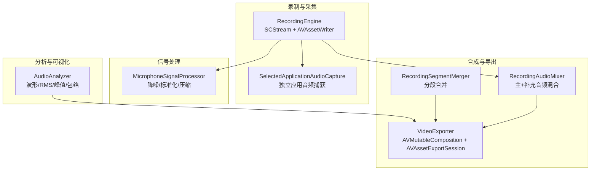
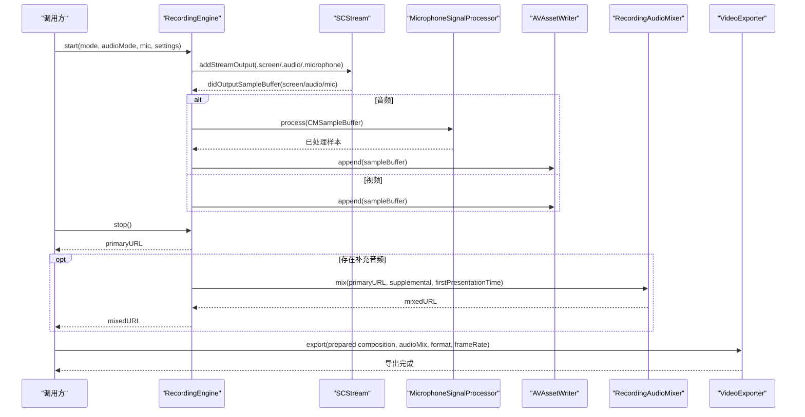
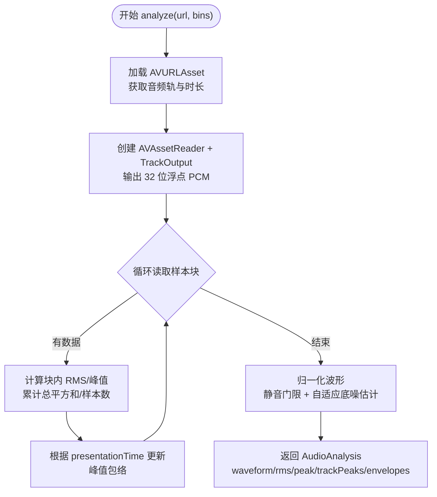
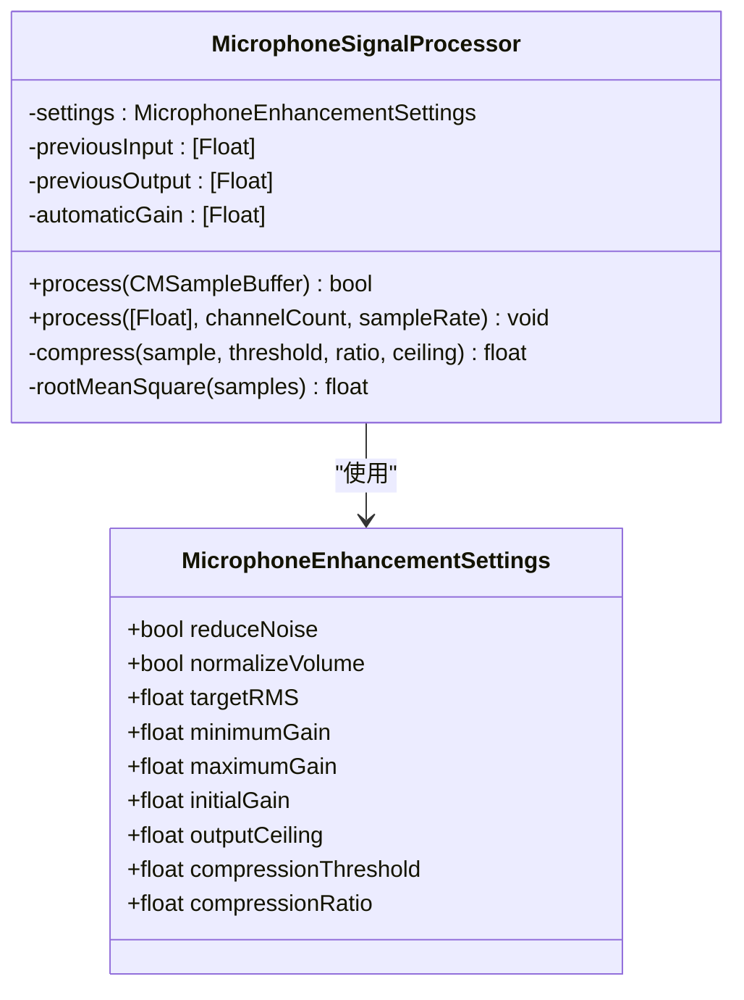
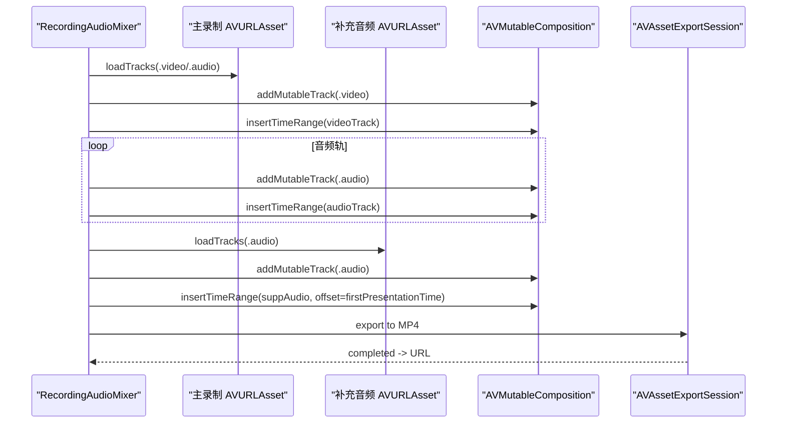
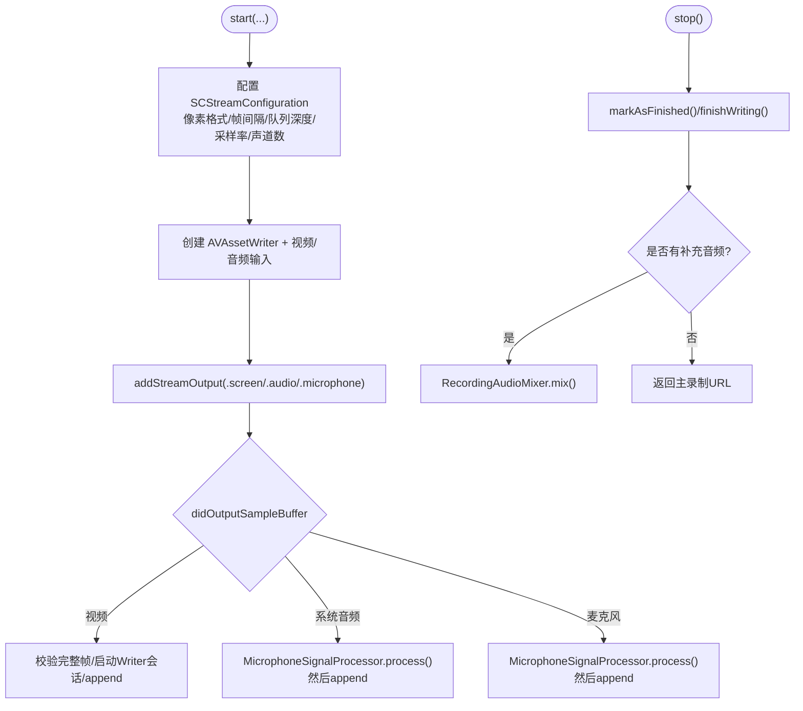
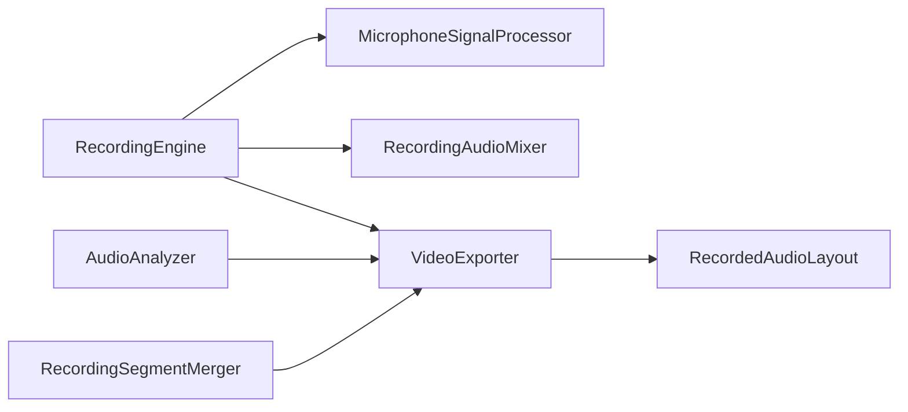

# 音频处理 API

<cite>
**本文引用的文件**   
- [AudioAnalyzer.swift](file://Sources/ScreenFree/AudioAnalyzer.swift)
- [MicrophoneSignalProcessor.swift](file://Sources/ScreenFree/MicrophoneSignalProcessor.swift)
- [RecordingAudioMixer.swift](file://Sources/ScreenFree/RecordingAudioMixer.swift)
- [RecordingEngine.swift](file://Sources/ScreenFree/RecordingEngine.swift)
- [RecordingSegmentMerger.swift](file://Sources/ScreenFree/RecordingSegmentMerger.swift)
- [RecordedAudioLayout.swift](file://Sources/ScreenFree/RecordedAudioLayout.swift)
- [VideoExporter.swift](file://Sources/ScreenFree/VideoExporter.swift)
- [AudioAnalyzerTests.swift](file://Tests/ScreenFreeMediaTests/AudioAnalyzerTests.swift)
- [MicrophoneSignalProcessorTests.swift](file://Tests/ScreenFreeMediaTests/MicrophoneSignalProcessorTests.swift)
</cite>

## 目录
1. [简介](#简介)
2. [项目结构](#项目结构)
3. [核心组件](#核心组件)
4. [架构总览](#架构总览)
5. [详细组件分析](#详细组件分析)
6. [依赖关系分析](#依赖关系分析)
7. [性能与内存优化](#性能与内存优化)
8. [故障排查指南](#故障排查指南)
9. [结论](#结论)
10. [附录：API 参考与示例路径](#附录api-参考与示例路径)

## 简介
本文件面向开发者，系统化梳理本项目中的音频处理 API，覆盖以下能力：
- 音频分析：波形生成、RMS/峰值统计、静音识别、多轨峰值包络对齐。
- 麦克风信号处理：降噪、音量标准化、自动增益、压缩限幅、实时流处理。
- 音频混音器：多音轨混合、音量调节、静音控制、基于时间轴的同步与裁剪。
- 格式转换与采样率：统一 PCM 读取、AAC 编码输出、导出会话配置。
- 与 Core Audio / AVFoundation 集成：SCStream 采集、AVAssetReader/Writer、AVMutableComposition 合成。
- 性能与内存最佳实践：零拷贝缓冲、队列优先级、锁与并发安全、错误处理策略。

## 项目结构
与音频相关的核心代码集中在 Sources/ScreenFree 下，测试位于 Tests/ScreenFreeMediaTests。关键模块职责如下：
- 音频分析：AudioAnalyzer.swift
- 麦克风信号处理：MicrophoneSignalProcessor.swift
- 录制引擎与流式写入：RecordingEngine.swift
- 辅助音频混音（系统应用音频补充）：RecordingAudioMixer.swift
- 片段合并：RecordingSegmentMerger.swift
- 录制轨道布局与增益计算：RecordedAudioLayout.swift
- 视频导出与音频混音参数注入：VideoExporter.swift

图表来源
- [RecordingEngine.swift:174-392](file://Sources/ScreenFree/RecordingEngine.swift#L174-L392)
- [MicrophoneSignalProcessor.swift:78-207](file://Sources/ScreenFree/MicrophoneSignalProcessor.swift#L78-L207)
- [AudioAnalyzer.swift:118-192](file://Sources/ScreenFree/AudioAnalyzer.swift#L118-L192)
- [RecordingAudioMixer.swift:30-134](file://Sources/ScreenFree/RecordingAudioMixer.swift#L30-L134)
- [RecordingSegmentMerger.swift:25-118](file://Sources/ScreenFree/RecordingSegmentMerger.swift#L25-L118)
- [VideoExporter.swift:103-486](file://Sources/ScreenFree/VideoExporter.swift#L103-L486)

章节来源
- [RecordingEngine.swift:174-392](file://Sources/ScreenFree/RecordingEngine.swift#L174-L392)
- [RecordingAudioMixer.swift:30-134](file://Sources/ScreenFree/RecordingAudioMixer.swift#L30-L134)
- [RecordingSegmentMerger.swift:25-118](file://Sources/ScreenFree/RecordingSegmentMerger.swift#L25-L118)
- [VideoExporter.swift:103-486](file://Sources/ScreenFree/VideoExporter.swift#L103-L486)

## 核心组件
- 音频分析器（AudioAnalyzer）
  - 输入：媒体 URL；输出：波形数组、RMS、峰值、各轨峰值包络。
  - 使用 AVAssetReader 以 32 位浮点 PCM 读取，按时间轴对齐构建包络。
- 麦克风信号处理器（MicrophoneSignalProcessor）
  - 支持 CMSampleBuffer 直接处理，兼容 Float32/Int16、交错/非交错。
  - 降噪（RC 低通）、自动增益（平滑响应）、压缩限幅（tanh 软限幅）。
- 录制引擎（RecordingEngine）
  - 通过 SCStream 采集屏幕/窗口/区域与系统音频，可选麦克风。
  - 将样本经 MicrophoneSignalProcessor 处理后写入 AVAssetWriter。
- 音频混音器（RecordingAudioMixer）
  - 将“主录制”与“补充应用音频”按首帧展示时间对齐混合为 MP4。
- 片段合并器（RecordingSegmentMerger）
  - 将多个分段音视频拼接为单一文件，保持多轨对齐。
- 录制轨道布局与增益（RecordedAudioLayout）
  - 根据系统/麦克风轨道布局计算每轨增益，避免叠加削波。
- 视频导出（VideoExporter）
  - 组装 AVMutableComposition，注入 AVAudioMix 音量曲线，设置帧率与渲染尺寸。

章节来源
- [AudioAnalyzer.swift:118-192](file://Sources/ScreenFree/AudioAnalyzer.swift#L118-L192)
- [MicrophoneSignalProcessor.swift:78-207](file://Sources/ScreenFree/MicrophoneSignalProcessor.swift#L78-L207)
- [RecordingEngine.swift:174-392](file://Sources/ScreenFree/RecordingEngine.swift#L174-L392)
- [RecordingAudioMixer.swift:30-134](file://Sources/ScreenFree/RecordingAudioMixer.swift#L30-L134)
- [RecordingSegmentMerger.swift:25-118](file://Sources/ScreenFree/RecordingSegmentMerger.swift#L25-L118)
- [RecordedAudioLayout.swift:15-49](file://Sources/ScreenFree/RecordedAudioLayout.swift#L15-L49)
- [VideoExporter.swift:103-486](file://Sources/ScreenFree/VideoExporter.swift#L103-L486)

## 架构总览
下图展示了从采集到导出的端到端流程，以及各组件之间的数据流向与依赖关系。

图表来源
- [RecordingEngine.swift:445-489](file://Sources/ScreenFree/RecordingEngine.swift#L445-L489)
- [RecordingEngine.swift:394-443](file://Sources/ScreenFree/RecordingEngine.swift#L394-L443)
- [RecordingAudioMixer.swift:30-134](file://Sources/ScreenFree/RecordingAudioMixer.swift#L30-L134)
- [VideoExporter.swift:488-590](file://Sources/ScreenFree/VideoExporter.swift#L488-L590)

## 详细组件分析

### 音频分析接口（波形、音量、静音识别）
- 波形生成
  - 对每个样本块计算 RMS 作为分箱电平，再经归一化与自适应静音门限得到可视波形。
  - 支持 bins 参数控制分辨率，默认 2048。
- 音量检测
  - 提供全局 RMS 与峰值；推荐增益 computed from target RMS 与峰值上限，防止削波。
- 静音识别
  - 绝对静音阈值低于 -80 dBFS 的残差被过滤；自适应噪声底估计用于区分真实语音/音乐与底噪。
- 多轨峰值包络
  - 依据 presentation time 与资产时长映射到 bins，构建每轨峰值包络，便于后续混音时预测叠加峰值。

图表来源
- [AudioAnalyzer.swift:118-192](file://Sources/ScreenFree/AudioAnalyzer.swift#L118-L192)
- [AudioAnalyzer.swift:194-331](file://Sources/ScreenFree/AudioAnalyzer.swift#L194-L331)

章节来源
- [AudioAnalyzer.swift:118-192](file://Sources/ScreenFree/AudioAnalyzer.swift#L118-L192)
- [AudioAnalyzer.swift:194-331](file://Sources/ScreenFree/AudioAnalyzer.swift#L194-L331)
- [AudioAnalyzerTests.swift:5-63](file://Tests/ScreenFreeMediaTests/AudioAnalyzerTests.swift#L5-L63)

### 麦克风信号处理（降噪、音量标准化、实时流）
- 输入格式
  - 支持 Float32 与 Int16，交错与非交错缓冲；自动推导通道数与声道偏移。
- 降噪
  - RC 低通滤波（截止约 80 Hz），抑制低频噪声。
- 音量标准化
  - 计算当前块 RMS，目标 RMS 驱动自动增益；响应速度随增益变化动态调整。
- 压缩限幅
  - tanh 软限幅，阈值与比率可配，输出天花板限制防削波。
- 静音扩展
  - 在自动增益后执行，按 RMS 相对阈值衰减，避免弱语音被误切。

图表来源
- [MicrophoneSignalProcessor.swift:6-76](file://Sources/ScreenFree/MicrophoneSignalProcessor.swift#L6-L76)
- [MicrophoneSignalProcessor.swift:78-207](file://Sources/ScreenFree/MicrophoneSignalProcessor.swift#L78-L207)
- [MicrophoneSignalProcessor.swift:224-318](file://Sources/ScreenFree/MicrophoneSignalProcessor.swift#L224-L318)
- [MicrophoneSignalProcessor.swift:320-355](file://Sources/ScreenFree/MicrophoneSignalProcessor.swift#L320-L355)

章节来源
- [MicrophoneSignalProcessor.swift:78-207](file://Sources/ScreenFree/MicrophoneSignalProcessor.swift#L78-L207)
- [MicrophoneSignalProcessor.swift:224-318](file://Sources/ScreenFree/MicrophoneSignalProcessor.swift#L224-L318)
- [MicrophoneSignalProcessorTests.swift:7-150](file://Tests/ScreenFreeMediaTests/MicrophoneSignalProcessorTests.swift#L7-L150)

### 音频混音器（多音轨混合、音量、静音）
- 主录制与补充音频混合
  - 复制主录制的视频轨与所有音频轨；将补充音频按首帧展示时间偏移插入，确保时间对齐。
  - 输出 MP4，使用 Passthrough 预设避免二次转码。
- 录制轨道布局与增益
  - 根据 systemTrackIndex 与 microphoneTrackIndex 决定轨道角色。
  - 计算每轨基础增益（用户音量/静音），结合峰值包络预测叠加峰值，共享余量避免削波。

图表来源
- [RecordingAudioMixer.swift:30-134](file://Sources/ScreenFree/RecordingAudioMixer.swift#L30-L134)
- [RecordedAudioLayout.swift:15-49](file://Sources/ScreenFree/RecordedAudioLayout.swift#L15-L49)
- [RecordedAudioLayout.swift:64-194](file://Sources/ScreenFree/RecordedAudioLayout.swift#L64-L194)

章节来源
- [RecordingAudioMixer.swift:30-134](file://Sources/ScreenFree/RecordingAudioMixer.swift#L30-L134)
- [RecordedAudioLayout.swift:15-49](file://Sources/ScreenFree/RecordedAudioLayout.swift#L15-L49)
- [RecordedAudioLayout.swift:64-194](file://Sources/ScreenFree/RecordedAudioLayout.swift#L64-L194)

### 录制引擎（SCStream + AVAssetWriter）
- 采集模式
  - 显示/窗口/区域三种模式；系统音频“全部/选定应用/关闭”；可选麦克风。
- 实时写入
  - 首次视频帧到来时启动 AVAssetWriter 并开启会话；音频样本先经 MicrophoneSignalProcessor 处理再写入。
- 时间同步
  - 记录首个 presentationTime，保证音频不早于视频会话起始写入。
- 选择应用音频
  - 单独捕获并写入 m4a，停止时由 RecordingAudioMixer 与主录制混合。

图表来源
- [RecordingEngine.swift:174-392](file://Sources/ScreenFree/RecordingEngine.swift#L174-L392)
- [RecordingEngine.swift:445-489](file://Sources/ScreenFree/RecordingEngine.swift#L445-L489)
- [RecordingEngine.swift:394-443](file://Sources/ScreenFree/RecordingEngine.swift#L394-L443)

章节来源
- [RecordingEngine.swift:174-392](file://Sources/ScreenFree/RecordingEngine.swift#L174-L392)
- [RecordingEngine.swift:445-489](file://Sources/ScreenFree/RecordingEngine.swift#L445-L489)
- [RecordingEngine.swift:394-443](file://Sources/ScreenFree/RecordingEngine.swift#L394-L443)

### 片段合并（多段录音拼接）
- 将多个分段音视频按顺序插入 AVMutableComposition，保持多轨对齐。
- 输出 MP4/MOV，使用 Passthrough 避免重编码。

章节来源
- [RecordingSegmentMerger.swift:25-118](file://Sources/ScreenFree/RecordingSegmentMerger.swift#L25-L118)

### 视频导出与音频同步
- 准备阶段
  - 创建 AVMutableComposition，插入源视频/音频轨，必要时缩放时间范围。
  - 构建 AVAudioMix 为每条音轨设置音量曲线（含 recordedAudioMix 计算的增益）。
- 导出阶段
  - 使用 AVAssetExportSession，设置输出格式、帧率、渲染尺寸与进度回调。
- 单帧渲染
  - 通过 AVAssetReaderVideoCompositionOutput 读取合成后的像素缓冲，用于预览或截图。

章节来源
- [VideoExporter.swift:103-486](file://Sources/ScreenFree/VideoExporter.swift#L103-L486)
- [VideoExporter.swift:488-590](file://Sources/ScreenFree/VideoExporter.swift#L488-L590)

## 依赖关系分析
- 组件耦合
  - RecordingEngine 依赖 MicrophoneSignalProcessor 进行实时处理，依赖 RecordingAudioMixer 进行后期混合。
  - VideoExporter 依赖 RecordedAudioLayout 提供的增益计算结果，形成最终混音。
  - AudioAnalyzer 为离线分析工具，输出供 UI 与混音策略使用。
- 外部框架
  - AVFoundation：AVAssetReader/Writer、AVMutableComposition、AVAssetExportSession、AVAudioMix。
  - Core Media：CMSampleBuffer、CMBlockBuffer、CMTime 等。
  - ScreenCaptureKit：SCStream、SCContentFilter、SCShareableContent。
  - AudioToolbox：AudioStreamBasicDescription、kAudioFormat* 常量。

图表来源
- [RecordingEngine.swift:174-392](file://Sources/ScreenFree/RecordingEngine.swift#L174-L392)
- [RecordingAudioMixer.swift:30-134](file://Sources/ScreenFree/RecordingAudioMixer.swift#L30-L134)
- [VideoExporter.swift:103-486](file://Sources/ScreenFree/VideoExporter.swift#L103-L486)
- [RecordingSegmentMerger.swift:25-118](file://Sources/ScreenFree/RecordingSegmentMerger.swift#L25-L118)
- [AudioAnalyzer.swift:118-192](file://Sources/ScreenFree/AudioAnalyzer.swift#L118-L192)

章节来源
- [RecordingEngine.swift:174-392](file://Sources/ScreenFree/RecordingEngine.swift#L174-L392)
- [RecordingAudioMixer.swift:30-134](file://Sources/ScreenFree/RecordingAudioMixer.swift#L30-L134)
- [VideoExporter.swift:103-486](file://Sources/ScreenFree/VideoExporter.swift#L103-L486)
- [RecordingSegmentMerger.swift:25-118](file://Sources/ScreenFree/RecordingSegmentMerger.swift#L25-L118)
- [AudioAnalyzer.swift:118-192](file://Sources/ScreenFree/AudioAnalyzer.swift#L118-L192)

## 性能与内存优化
- 零拷贝与缓冲管理
  - AVAssetReaderTrackOutput 设置 alwaysCopiesSampleData=false，减少不必要的数据拷贝。
  - 使用 UnsafeRawPointer/UnsafeMutableBufferPointer 直接绑定内存，避免中间数组分配。
- 队列与优先级
  - 录制队列使用 userInteractive QoS，保证低延迟；专用队列处理选择应用音频。
- 并发安全
  - 使用 NSLock 保护 writer/inputs/url 等状态；Sendable 包装跨线程访问。
- 编码器与格式
  - 统一 48kHz/立体声 AAC 输出，降低转码复杂度；Passthrough 导出避免二次编码。
- 峰值与静音门限
  - 自适应噪声底估计与静音门限避免无效内容放大，提升波形可读性与混音稳定性。

[本节为通用指导，无需特定文件引用]

## 故障排查指南
- 常见问题定位
  - 无视频轨：检查 sourceAsset.loadTracks(.video) 是否返回空。
  - 无法创建轨道/导出会话：确认 canAdd(input)/export session 初始化成功。
  - 音频早于视频写入：确保首个 presentationTime 后再写入音频。
  - 补充音频未对齐：核对 firstPresentationTime 与 offset 计算。
- 错误类型
  - RecordingError：录制相关错误（无源、无法启动/结束 writer）。
  - RecordingAudioMixError：混音失败（缺少视频轨、无法创建轨道/会话、导出失败）。
  - RecordingSegmentMergeError：分段合并失败（无片段、无法创建轨道/会话、导出失败）。
  - VideoExportError：导出失败（缺失视频轨、无法创建组合轨/会话、读取帧失败）。

章节来源
- [RecordingEngine.swift:40-61](file://Sources/ScreenFree/RecordingEngine.swift#L40-L61)
- [RecordingAudioMixer.swift:4-22](file://Sources/ScreenFree/RecordingAudioMixer.swift#L4-L22)
- [RecordingSegmentMerger.swift:4-22](file://Sources/ScreenFree/RecordingSegmentMerger.swift#L4-L22)
- [VideoExporter.swift:12-33](file://Sources/ScreenFree/VideoExporter.swift#L12-L33)

## 结论
本项目围绕 AVFoundation 与 ScreenCaptureKit 构建了完整的音频处理管线：从实时采集与增强，到离线分析与多轨混合，再到高质量导出。通过严格的格式规范、时间同步与峰值预测，实现了稳定可靠的音频体验。建议在实际使用中遵循本文的性能与内存优化建议，并结合测试用例验证行为一致性。

[本节为总结性内容，无需特定文件引用]

## 附录：API 参考与示例路径
- 音频分析
  - 接口：analyze(url: URL, bins: Int) async throws -> AudioAnalysis
  - 示例路径：[AudioAnalyzer.swift:118-122](file://Sources/ScreenFree/AudioAnalyzer.swift#L118-L122)
  - 单元测试：[AudioAnalyzerTests.swift:5-63](file://Tests/ScreenFreeMediaTests/AudioAnalyzerTests.swift#L5-L63)
- 麦克风信号处理
  - 接口：process(_ sampleBuffer: CMSampleBuffer) -> Bool
  - 接口：process(_ samples: inout [Float], channelCount: Int, sampleRate: Double)
  - 示例路径：[MicrophoneSignalProcessor.swift:94-207](file://Sources/ScreenFree/MicrophoneSignalProcessor.swift#L94-L207)
  - 单元测试：[MicrophoneSignalProcessorTests.swift:7-150](file://Tests/ScreenFreeMediaTests/MicrophoneSignalProcessorTests.swift#L7-L150)
- 录制引擎
  - 接口：start(mode, targetID, systemAudioMode, selectedAudioApplicationIDs, recordMicrophone, ...)
  - 接口：stop() async throws -> URL
  - 示例路径：[RecordingEngine.swift:174-392](file://Sources/ScreenFree/RecordingEngine.swift#L174-L392)
  - 示例路径：[RecordingEngine.swift:394-443](file://Sources/ScreenFree/RecordingEngine.swift#L394-L443)
- 音频混音
  - 接口：mix(primaryURL: URL, supplemental: SupplementalAudioRecording, primaryFirstPresentationTime: CMTime?) async throws -> URL
  - 示例路径：[RecordingAudioMixer.swift:30-134](file://Sources/ScreenFree/RecordingAudioMixer.swift#L30-L134)
- 片段合并
  - 接口：merge(_ urls: [URL], fileExtension: String) async throws -> URL
  - 示例路径：[RecordingSegmentMerger.swift:25-118](file://Sources/ScreenFree/RecordingSegmentMerger.swift#L25-L118)
- 视频导出与音频同步
  - 接口：prepare(sourceURL, cameraURL?, backgroundMusicURL?, backgroundMusicVolume, recordedAudioMix, project, frameRate, renderSizeOverride, canvasStyle, cameraStyle) async throws -> PreparedComposition
  - 接口：export(sourceURL, ..., destinationURL, format, frameRate, quality, renderSizeOverride, presetName, maximumFileSizeBytes, progress) async throws
  - 示例路径：[VideoExporter.swift:103-486](file://Sources/ScreenFree/VideoExporter.swift#L103-L486)
  - 示例路径：[VideoExporter.swift:488-590](file://Sources/ScreenFree/VideoExporter.swift#L488-L590)

章节来源
- [AudioAnalyzer.swift:118-122](file://Sources/ScreenFree/AudioAnalyzer.swift#L118-L122)
- [MicrophoneSignalProcessor.swift:94-207](file://Sources/ScreenFree/MicrophoneSignalProcessor.swift#L94-L207)
- [RecordingEngine.swift:174-392](file://Sources/ScreenFree/RecordingEngine.swift#L174-L392)
- [RecordingEngine.swift:394-443](file://Sources/ScreenFree/RecordingEngine.swift#L394-L443)
- [RecordingAudioMixer.swift:30-134](file://Sources/ScreenFree/RecordingAudioMixer.swift#L30-L134)
- [RecordingSegmentMerger.swift:25-118](file://Sources/ScreenFree/RecordingSegmentMerger.swift#L25-L118)
- [VideoExporter.swift:103-486](file://Sources/ScreenFree/VideoExporter.swift#L103-L486)
- [VideoExporter.swift:488-590](file://Sources/ScreenFree/VideoExporter.swift#L488-L590)