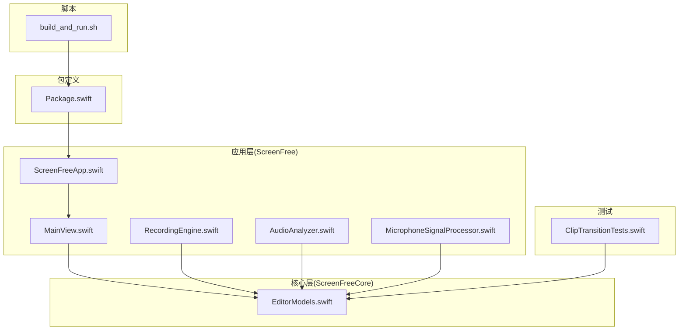
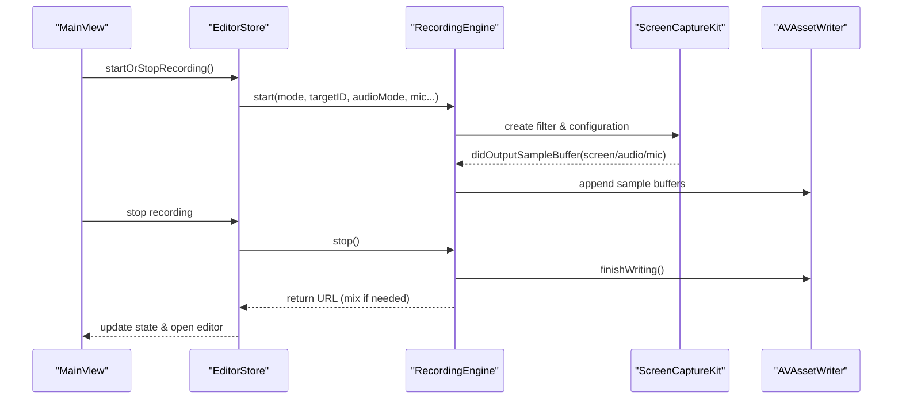
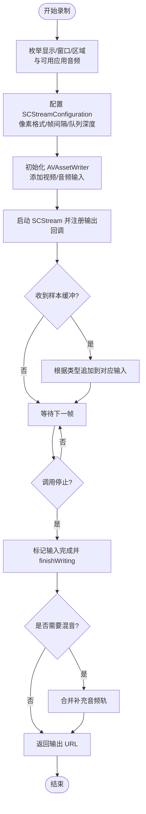
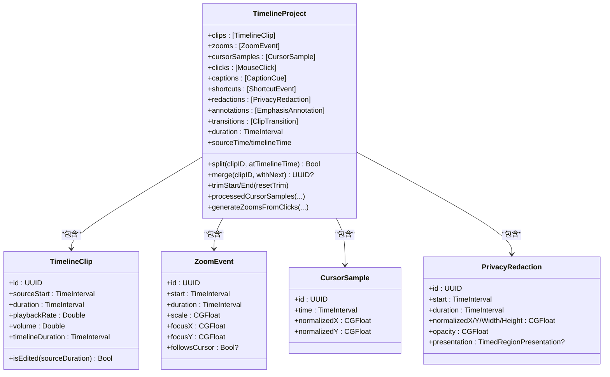
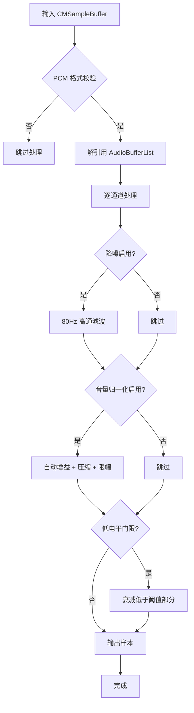
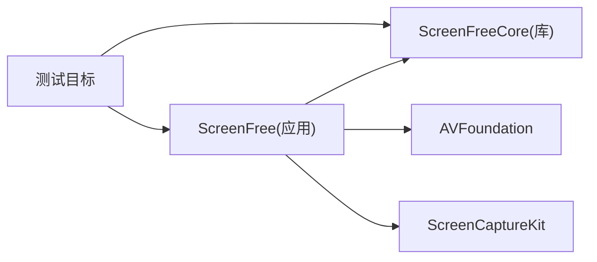

# 代码规范

<cite>
**本文引用的文件**   
- [README.md](file://README.md)
- [Package.swift](file://Package.swift)
- [ScreenFreeApp.swift](file://Sources/ScreenFree/ScreenFreeApp.swift)
- [MainView.swift](file://Sources/ScreenFree/MainView.swift)
- [RecordingEngine.swift](file://Sources/ScreenFree/RecordingEngine.swift)
- [EditorModels.swift](file://Sources/ScreenFreeCore/EditorModels.swift)
- [AudioAnalyzer.swift](file://Sources/ScreenFree/AudioAnalyzer.swift)
- [MicrophoneSignalProcessor.swift](file://Sources/ScreenFree/MicrophoneSignalProcessor.swift)
- [ClipTransitionTests.swift](file://Tests/ScreenFreeCoreTests/ClipTransitionTests.swift)
- [build_and_run.sh](file://script/build_and_run.sh)
- [PRODUCT_REQUIREMENTS.md](file://docs/PRODUCT_REQUIREMENTS.md)
</cite>

## 目录
1. [简介](#简介)
2. [项目结构](#项目结构)
3. [核心组件](#核心组件)
4. [架构总览](#架构总览)
5. [详细组件分析](#详细组件分析)
6. [依赖关系分析](#依赖关系分析)
7. [性能与并发注意事项](#性能与并发注意事项)
8. [错误处理与资源管理](#错误处理与资源管理)
9. [Swift 代码风格与命名规范](#swift-代码风格与命名规范)
10. [SwiftUI 编写规范](#swiftui-编写规范)
11. [AVFoundation 与 ScreenCaptureKit 使用规范](#avfoundation-与-screencapturekit-使用规范)
12. [Git 工作流与提交消息格式](#git-工作流与提交消息格式)
13. [代码质量检查与测试](#代码质量检查与测试)
14. [常见反模式与重构建议](#常见反模式与重构建议)
15. [新贡献者入门与环境设置](#新贡献者入门与环境设置)
16. [结论](#结论)

## 简介
本规范面向 ScreenFree 项目的 Swift/macOS 开发，覆盖代码风格、命名约定、文件组织、注释标准、SwiftUI 组件编写、状态管理与性能优化、AVFoundation 与 ScreenCaptureKit 的使用规范（含错误处理、资源管理、线程安全）、Git 分支策略与提交规范、代码质量工具配置与测试实践，以及常见反模式的避免与重构建议。目标是让新老贡献者在统一标准下高效协作，保证媒体管线稳定、可维护与可扩展。

## 项目结构
- 顶层采用 Swift Package Manager 组织：
  - 可执行目标 ScreenFree（应用入口与 UI）
  - 库目标 ScreenFreeCore（时间线模型、剪辑、转场等核心数据结构）
  - 测试目标 ScreenFreeCoreTests、ScreenFreeMediaTests
- 资源与本地化位于 Sources/ScreenFree/Resources，支持多语言与隐私清单
- 构建脚本位于 script/，提供开发与打包流程

**图示来源** 
- [Package.swift:1-35](file://Package.swift#L1-L35)
- [ScreenFreeApp.swift:111-140](file://Sources/ScreenFree/ScreenFreeApp.swift#L111-L140)
- [MainView.swift:1-120](file://Sources/ScreenFree/MainView.swift#L1-L120)
- [RecordingEngine.swift:1-120](file://Sources/ScreenFree/RecordingEngine.swift#L1-L120)
- [EditorModels.swift:1-120](file://Sources/ScreenFreeCore/EditorModels.swift#L1-L120)
- [ClipTransitionTests.swift:1-60](file://Tests/ScreenFreeCoreTests/ClipTransitionTests.swift#L1-L60)
- [build_and_run.sh:1-40](file://script/build_and_run.sh#L1-L40)

**章节来源**
- [Package.swift:1-35](file://Package.swift#L1-L35)
- [README.md:95-124](file://README.md#L95-L124)

## 核心组件
- 应用入口与命令路由：ScreenFreeApp 负责 App 生命周期、键盘事件拦截、命令菜单绑定与全局通知分发
- 主界面与预览合成：MainView 组织工具栏、面板轨道、预览区、播放条与时间线，并驱动各种叠加层（字幕、快捷键提示、点击特效、光标、隐私遮罩、聚光灯高亮）
- 录制引擎：RecordingEngine 基于 ScreenCaptureKit 采集屏幕/窗口/区域与系统/麦克风音频，通过 AVAssetWriter 写入 MP4，支持可选的独立应用音频捕获与混音
- 时间线与媒体模型：EditorModels 定义 TimelineProject、TimelineClip、ZoomEvent、CaptionCue、PrivacyRedaction、EmphasisAnnotation 等不可变/可序列化数据
- 音频分析与增强：AudioAnalyzer 计算波形、RMS、峰值与通道峰值包络；MicrophoneSignalProcessor 实现降噪、自动增益、压缩与限幅

**章节来源**
- [ScreenFreeApp.swift:111-230](file://Sources/ScreenFree/ScreenFreeApp.swift#L111-L230)
- [MainView.swift:1-200](file://Sources/ScreenFree/MainView.swift#L1-L200)
- [RecordingEngine.swift:1-120](file://Sources/ScreenFree/RecordingEngine.swift#L1-L120)
- [EditorModels.swift:1-120](file://Sources/ScreenFreeCore/EditorModels.swift#L1-L120)
- [AudioAnalyzer.swift:1-120](file://Sources/ScreenFree/AudioAnalyzer.swift#L1-L120)
- [MicrophoneSignalProcessor.swift:1-80](file://Sources/ScreenFree/MicrophoneSignalProcessor.swift#L1-L80)

## 架构总览
应用采用“UI + Store + Core”分层：
- UI 层（SwiftUI）仅持有 @ObservedObject/@State 并通过 EditorStore 驱动状态变化
- Store 层封装业务逻辑与 Undo/Redo、权限检查、导出流程
- Core 层提供纯数据模型与算法（时间线、转场、光标插值、静音裁剪等）
- 媒体管线通过 RecordingEngine 将 SCStream 输出桥接至 AVAssetWriter，并在停止时进行混音与收尾

**图示来源** 
- [MainView.swift:280-330](file://Sources/ScreenFree/MainView.swift#L280-L330)
- [RecordingEngine.swift:174-392](file://Sources/ScreenFree/RecordingEngine.swift#L174-L392)
- [RecordingEngine.swift:394-443](file://Sources/ScreenFree/RecordingEngine.swift#L394-L443)

## 详细组件分析

### 录制引擎（RecordingEngine）
- 职责：枚举可录制目标、创建 SCStream、配置像素格式/帧间隔/队列深度、初始化 AVAssetWriter 输入（视频、系统音频、麦克风），回调中追加样本缓冲，停止时完成写入与可选混音
- 线程与同步：使用专用 captureQueue 与 NSLock 保护 writer/inputs/state 访问；对 AVAssetWriter 的 finishWriting 使用 CheckedContinuation 确保异步完成
- 错误处理：定义 RecordingError 枚举，涵盖无源、无法启动/结束写入、writer 失败等；在异常路径清理临时文件与资源
- 资源管理：输出目录按用户 Movies 或临时目录组织，文件名包含时间与 UUID；选择的应用音频单独记录为 M4A 后混入主文件

**图示来源** 
- [RecordingEngine.swift:174-392](file://Sources/ScreenFree/RecordingEngine.swift#L174-L392)
- [RecordingEngine.swift:394-443](file://Sources/ScreenFree/RecordingEngine.swift#L394-L443)

**章节来源**
- [RecordingEngine.swift:1-120](file://Sources/ScreenFree/RecordingEngine.swift#L1-L120)
- [RecordingEngine.swift:174-392](file://Sources/ScreenFree/RecordingEngine.swift#L174-L392)
- [RecordingEngine.swift:394-443](file://Sources/ScreenFree/RecordingEngine.swift#L394-L443)

### 时间线与媒体模型（EditorModels）
- 数据结构：TimelineProject 聚合 clips、zooms、cursorSamples、clicks、captions、shortcuts、redactions、annotations、transitions
- 关键算法：
  - 剪辑拆分/合并/修剪/重置修剪，保持相邻边界与速度/音量一致性
  - 光标样本去抖与快速变化平滑，支持帧率无关插值
  - 时间轴与源时间的双向映射
  - 自动生成缩放事件（基于点击策略）
- 序列化：Codable 支持项目持久化与迁移

**图示来源** 
- [EditorModels.swift:1-120](file://Sources/ScreenFreeCore/EditorModels.swift#L1-L120)
- [EditorModels.swift:274-372](file://Sources/ScreenFreeCore/EditorModels.swift#L274-L372)
- [EditorModels.swift:467-573](file://Sources/ScreenFreeCore/EditorModels.swift#L467-L573)
- [EditorModels.swift:590-758](file://Sources/ScreenFreeCore/EditorModels.swift#L590-L758)

**章节来源**
- [EditorModels.swift:1-120](file://Sources/ScreenFreeCore/EditorModels.swift#L1-L120)
- [EditorModels.swift:274-372](file://Sources/ScreenFreeCore/EditorModels.swift#L274-L372)
- [EditorModels.swift:467-573](file://Sources/ScreenFreeCore/EditorModels.swift#L467-L573)
- [EditorModels.swift:590-758](file://Sources/ScreenFreeCore/EditorModels.swift#L590-L758)

### 音频分析与信号处理
- AudioAnalyzer：从 AVAssetReader 读取 PCM，计算 RMS、峰值、波形与通道峰值包络，支持多轨合并与对齐
- MicrophoneSignalProcessor：对 CMSampleBuffer 进行 Float32/Int16 处理，实现 80Hz 高通、自适应门限、自动增益、压缩与限幅，支持通道扩展与状态缓存

**图示来源** 
- [AudioAnalyzer.swift:118-192](file://Sources/ScreenFree/AudioAnalyzer.swift#L118-L192)
- [MicrophoneSignalProcessor.swift:94-207](file://Sources/ScreenFree/MicrophoneSignalProcessor.swift#L94-L207)
- [MicrophoneSignalProcessor.swift:224-318](file://Sources/ScreenFree/MicrophoneSignalProcessor.swift#L224-L318)

**章节来源**
- [AudioAnalyzer.swift:1-120](file://Sources/ScreenFree/AudioAnalyzer.swift#L1-L120)
- [MicrophoneSignalProcessor.swift:1-80](file://Sources/ScreenFree/MicrophoneSignalProcessor.swift#L1-L80)

### SwiftUI 主视图与交互
- MainView 组合工具栏、面板轨道、预览区、播放条与时间线，响应键盘事件（Esc/Delete/Undo/Redo）
- 全屏预览模式切换，语言切换、历史记录弹出、导入/导出按钮与禁用状态控制
- 预览叠加层包括背景、原生播放器、摄像头画中画、过渡效果、快捷键标签、字幕、点击特效、光标替换、隐私遮罩与强调标注

**章节来源**
- [MainView.swift:1-200](file://Sources/ScreenFree/MainView.swift#L1-L200)
- [MainView.swift:200-336](file://Sources/ScreenFree/MainView.swift#L200-L336)

## 依赖关系分析
- ScreenFree 依赖 ScreenFreeCore 提供时间线模型与算法
- RecordingEngine 依赖 ScreenCaptureKit 与 AVFoundation 进行采集与写入
- UI 层通过 EditorStore（未在本文直接分析）协调 Store 与 Core 数据
- 测试目标覆盖核心模型与媒体管线行为

**图示来源** 
- [Package.swift:1-35](file://Package.swift#L1-L35)

**章节来源**
- [Package.swift:1-35](file://Package.swift#L1-L35)

## 性能与并发注意事项
- 录制回调队列：使用专用 DispatchQueue 降低 UI 阻塞风险，合理设置 queueDepth 与 minimumFrameInterval
- 锁粒度：NSLock 保护 writer/inputs 状态变更，避免竞态；withLock 封装简化临界区
- 异步收尾：finishWriting 使用 CheckedContinuation 确保状态一致性与错误传播
- 音频处理：避免频繁分配，复用缓冲区与状态数组；对大数组操作注意内存拷贝与绑定指针的安全
- 渲染路径：预览中使用 NativePlayerView 与 Core Animation 滤镜，减少不必要的重绘与层级嵌套

[本节为通用指导，不直接分析具体文件]

## 错误处理与资源管理
- 录制错误：RecordingError 枚举集中描述无源、无法启动/结束写入、writer 失败等，便于 UI 展示与日志追踪
- 资源清理：在异常路径删除临时文件、释放 stream 引用、重置处理器状态；停止时确保 markAsFinished 与 finishWriting 顺序正确
- 权限与可用性：设备发现与授权失败时给出明确错误信息，必要时引导用户开启权限
- 国际化错误：LocalizedError 与 L10n 结合，确保错误文案随语言切换

**章节来源**
- [RecordingEngine.swift:40-61](file://Sources/ScreenFree/RecordingEngine.swift#L40-L61)
- [RecordingEngine.swift:394-443](file://Sources/ScreenFree/RecordingEngine.swift#L394-L443)
- [Localization.swift:1-51](file://Sources/ScreenFree/Localization.swift#L1-L51)

## Swift 代码风格与命名规范
- 命名
  - 类型与枚举：PascalCase（如 CaptureMode、SystemAudioCaptureMode、TimelineProject）
  - 变量与函数：camelCase（如 availableTargets、start、stop）
  - 常量：全大写或语义化常量（如 absoluteSilenceFloor、supportedRange）
  - 私有成员：前缀下划线或 private 作用域限制
- 文件组织
  - 单一职责：每个文件聚焦一个主题（如 RecordingEngine、AudioAnalyzer、MicrophoneSignalProcessor）
  - 扩展与协议：将相关功能以 extension 形式组织，避免巨型文件
  - 资源与本地化：Resources 目录下按 .lproj 分组，统一使用 Bundle.module
- 注释标准
  - 公共 API 提供清晰文档注释，说明参数、返回值与副作用
  - 复杂算法（如光标插值、音频处理）附简要思路与边界条件说明
  - 错误路径与资源清理需注释原因与影响

[本节为通用指导，不直接分析具体文件]

## SwiftUI 编写规范
- 状态管理
  - 使用 @State 管理局部视图状态，@ObservedObject 订阅外部状态对象
  - 避免在 View 内执行耗时任务，使用 Task 与 async/await
  - 通过 environment 传递 locale 与主题，保持 UI 一致性
- 视图组合
  - 将复杂 UI 拆分为小组件（如 panelRail、toolbar、preview）
  - 使用 ZStack/VStack/HStack 组合布局，避免过深嵌套
  - 动画与过渡使用 withAnimation 与内置修饰符
- 性能优化
  - 减少不必要的 recompute，使用 @StateObject/@ObservableObject 精确更新
  - 图片与图像资源使用 .resizable/.interpolation 优化
  - 避免在 onReceive/onTapGesture 中执行重型计算

**章节来源**
- [ScreenFreeApp.swift:111-230](file://Sources/ScreenFree/ScreenFreeApp.swift#L111-L230)
- [MainView.swift:1-200](file://Sources/ScreenFree/MainView.swift#L1-L200)

## AVFoundation 与 ScreenCaptureKit 使用规范
- 采集
  - 使用 SCShareableContent 枚举显示/窗口/应用，过滤桌面窗口与自身进程
  - 配置 SCStreamConfiguration 指定像素格式、帧间隔、队列深度、是否捕获音频与麦克风
- 写入
  - AVAssetWriter 初始化后验证 canAdd，设置 expectsMediaDataInRealTime
  - 首次视频帧到来时 startWriting 与 startSession，确保时间戳对齐
  - 音频样本按类型追加到对应输入，处理首帧时间戳差异
- 错误处理
  - 捕获 SCStream 与 AVAssetWriter 错误，统一转换为 RecordingError
  - 在异常路径清理临时文件与释放资源
- 线程安全
  - 所有样本处理在专用队列执行，使用 NSLock 保护共享状态
  - 异步收尾使用 CheckedContinuation 确保结果回传

**章节来源**
- [RecordingEngine.swift:174-392](file://Sources/ScreenFree/RecordingEngine.swift#L174-L392)
- [RecordingEngine.swift:445-504](file://Sources/ScreenFree/RecordingEngine.swift#L445-L504)
- [RecordingEngine.swift:533-674](file://Sources/ScreenFree/RecordingEngine.swift#L533-L674)

## Git 工作流与提交消息格式
- 分支策略
  - main：稳定发布分支
  - develop：集成开发分支
  - feature/*：新功能分支
  - fix/*：缺陷修复分支
  - release/*：预发布分支
- 提交消息
  - 格式：<type>(<scope>): <subject>
  - type：feat、fix、docs、style、refactor、test、chore
  - scope：模块名（如 recording、editor、export、audio）
  - subject：简洁描述变更内容
- 代码审查
  - 所有 PR 至少一名 reviewer 批准
  - CI 通过（构建、测试、静态检查）
  - 变更需附带测试用例或验证步骤

[本节为通用指导，不直接分析具体文件]

## 代码质量检查与测试
- 构建与运行
  - 使用 script/build_and_run.sh 进行开发与打包
  - 支持 run、package、debug、logs、telemetry、verify 等模式
- 测试套件
  - swift test 运行核心模型与媒体管线测试
  - ClipTransitionTests 覆盖转场解析、修剪静音、边缘裁剪等行为
  - 媒体测试生成真实 H.264/AAC 输入，验证导出、回放与像素一致性
- 静态检查
  - 建议使用 SwiftLint、SourceKitten 进行风格与复杂度检查
  - 在 CI 中集成 lint 与测试，阻断不合格提交

**章节来源**
- [build_and_run.sh:1-49](file://script/build_and_run.sh#L1-L49)
- [ClipTransitionTests.swift:1-60](file://Tests/ScreenFreeCoreTests/ClipTransitionTests.swift#L1-L60)
- [README.md:117-141](file://README.md#L117-L141)

## 常见反模式与重构建议
- 反模式
  - 在 View 中直接操作底层媒体资源（应通过 Store 抽象）
  - 在主线程执行耗时 I/O 或解码（应使用后台队列与异步 API）
  - 忽略错误路径与资源清理（应统一错误枚举与 defer 清理）
  - 过度耦合 UI 与 Core（应通过数据模型与接口隔离）
- 重构建议
  - 将录制逻辑进一步拆分为 CaptureSession、AudioMixer、VideoWriter
  - 引入统一的配置对象（如 RecordingConfig、ExportConfig）
  - 使用 Result/AsyncSequence 替代回调地狱
  - 增加单元测试覆盖率，特别是边界条件与异常路径

[本节为通用指导，不直接分析具体文件]

## 新贡献者入门与环境设置
- 环境要求
  - macOS 14+，Xcode 与 Swift 工具链
  - 必要的系统权限（屏幕录制、麦克风、相机、语音识别）
- 克隆与构建
  - git clone 仓库后运行 ./script/build_and_run.sh
  - 构建产物位于 dist/ScreenFree.app
- 运行与调试
  - 使用 --debug 模式启动 lldb
  - 使用 --logs/--telemetry 查看系统日志
- 测试与验证
  - 运行 swift test 执行全部测试
  - 参考 docs/PRODUCT_REQUIREMENTS.md 进行功能验证

**章节来源**
- [README.md:95-124](file://README.md#L95-L124)
- [build_and_run.sh:1-49](file://script/build_and_run.sh#L1-L49)
- [PRODUCT_REQUIREMENTS.md:1-40](file://docs/PRODUCT_REQUIREMENTS.md#L1-L40)

## 结论
本规范为 ScreenFree 项目提供了统一的代码风格、架构指引与最佳实践，确保媒体管线稳定、UI 响应流畅、团队协作高效。贡献者应遵循命名与文件组织约定，重视错误处理与资源管理，利用测试与静态检查保障质量。通过持续重构与优化，项目将保持高可维护性与可扩展性。