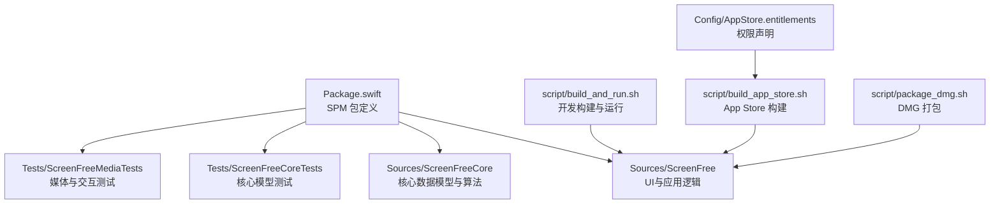
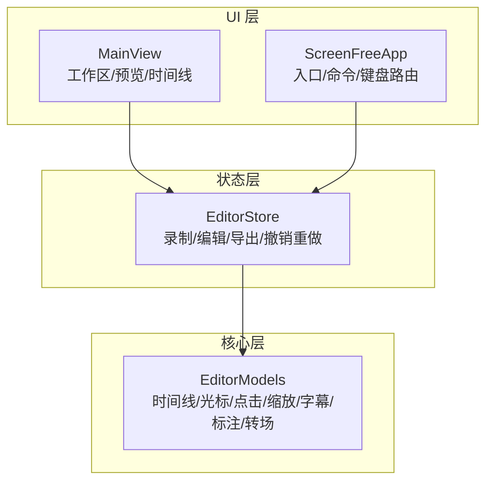
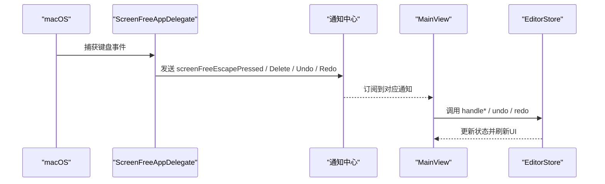
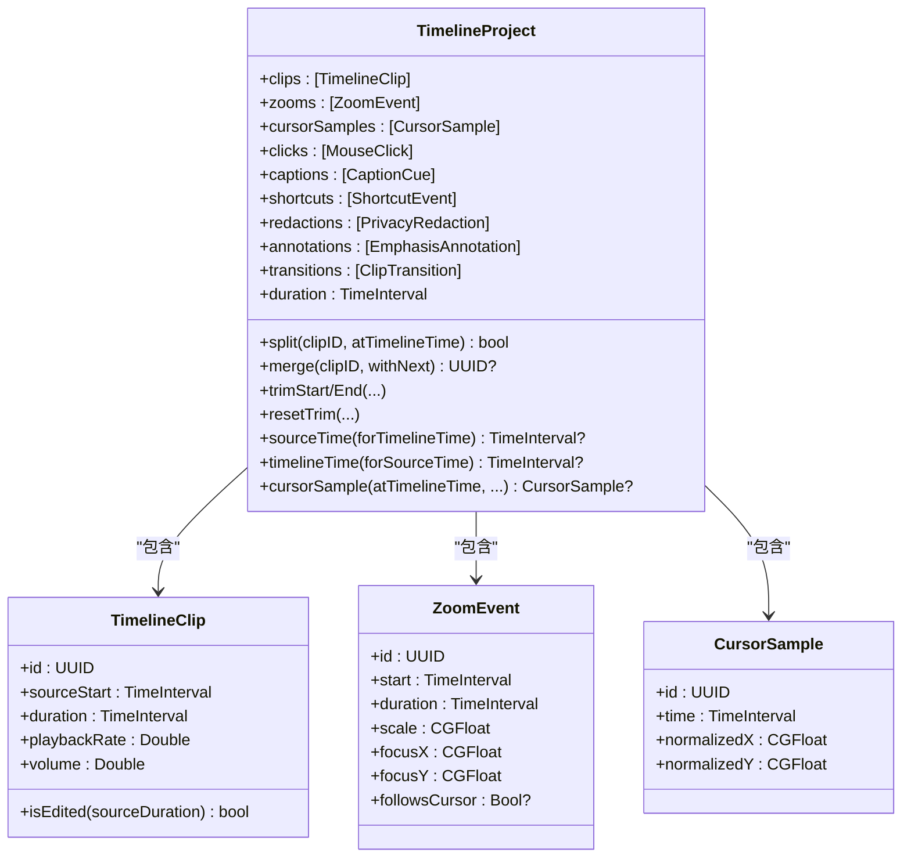
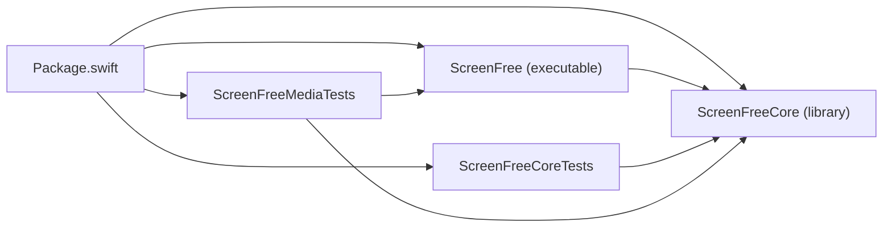
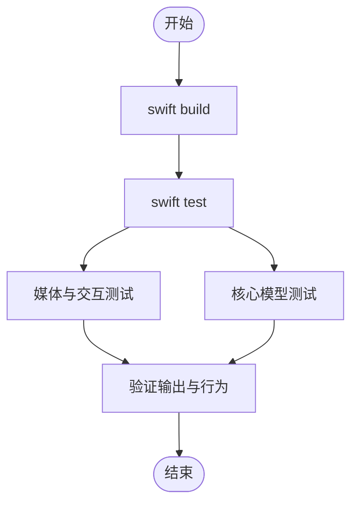

# 开发指南

<cite>
**本文引用的文件**   
- [Package.swift](file://Package.swift)
- [README.md](file://README.md)
- [ScreenFreeApp.swift](file://Sources/ScreenFree/ScreenFreeApp.swift)
- [MainView.swift](file://Sources/ScreenFree/MainView.swift)
- [EditorStore.swift](file://Sources/ScreenFree/EditorStore.swift)
- [EditorModels.swift](file://Sources/ScreenFreeCore/EditorModels.swift)
- [AudioAnalyzerTests.swift](file://Tests/ScreenFreeMediaTests/AudioAnalyzerTests.swift)
- [ClipTransitionTests.swift](file://Tests/ScreenFreeCoreTests/ClipTransitionTests.swift)
- [build_and_run.sh](file://script/build_and_run.sh)
- [build_app_store.sh](file://script/build_app_store.sh)
- [package_dmg.sh](file://script/package_dmg.sh)
- [AppStore.entitlements](file://Config/AppStore.entitlements)
- [PRODUCT_REQUIREMENTS.md](file://docs/PRODUCT_REQUIREMENTS.md)
</cite>

## 目录
1. [简介](#简介)
2. [项目结构](#项目结构)
3. [核心组件](#核心组件)
4. [架构总览](#架构总览)
5. [详细组件分析](#详细组件分析)
6. [依赖关系分析](#依赖关系分析)
7. [性能与构建优化](#性能与构建优化)
8. [测试策略与实践](#测试策略与实践)
9. [调试技巧与工具](#调试技巧与工具)
10. [代码规范与贡献流程](#代码规范与贡献流程)
11. [常见问题与故障排除](#常见问题与故障排除)
12. [结论](#结论)

## 简介
ScreenFree 是一款原生 macOS 屏幕录制与非破坏性视频编辑器，基于 SwiftUI、AppKit、ScreenCaptureKit 与 AVFoundation 实现。本开发指南面向开发者，系统说明项目的目录组织、构建系统（Swift Package Manager）、自定义脚本、测试策略、调试方法、代码规范与贡献流程，并给出常见问题的解决方案。

## 项目结构
- Sources：源代码根目录
  - ScreenFree：应用层 UI、状态管理、导出与录制逻辑等
  - ScreenFreeCore：时间线模型、转场、缩放等核心数据模型与算法
  - ScreenFreeiOS：预留 iOS 目标（当前未使用）
- Tests：测试套件
  - ScreenFreeCoreTests：针对核心模型的单元测试
  - ScreenFreeMediaTests：媒体管线与交互的集成测试
- Config：打包与权限配置
  - AppStore.entitlements：Mac App Store 沙箱与设备权限声明
- AppStore：上架物料与元数据
  - Assets/Metadata/Screenshots 等
- script：构建与发布脚本
  - build_and_run.sh：本地开发与打包运行
  - build_app_store.sh：生成 Mac App Store 安装包
  - package_dmg.sh：将 .app 打包为 DMG
- docs：产品需求与研究文档
- 根级配置文件
  - Package.swift：SPM 包定义与目标
  - README.md：功能说明、运行与验证命令

图表来源
- [Package.swift:1-35](file://Package.swift#L1-L35)
- [build_and_run.sh:1-180](file://script/build_and_run.sh#L1-L180)
- [build_app_store.sh:1-165](file://script/build_app_store.sh#L1-L165)
- [package_dmg.sh:1-34](file://script/package_dmg.sh#L1-L34)
- [AppStore.entitlements:1-19](file://Config/AppStore.entitlements#L1-L19)

章节来源
- [Package.swift:1-35](file://Package.swift#L1-L35)
- [README.md:95-124](file://README.md#L95-L124)

## 核心组件
- 应用入口与生命周期
  - ScreenFreeApp：应用主入口、菜单命令、键盘事件路由、语言切换、设置页
- 主界面与工作区
  - MainView：工作区布局、预览、播放控制、时间线、检查器面板
- 状态管理与业务编排
  - EditorStore：全局状态、录制/编辑/导出流程、撤销重做、权限与设备监控
- 核心数据模型
  - EditorModels：时间线片段、鼠标轨迹、点击、缩放事件、字幕、快捷键、隐私遮罩、标注、转场等

章节来源
- [ScreenFreeApp.swift:1-230](file://Sources/ScreenFree/ScreenFreeApp.swift#L1-L230)
- [MainView.swift:1-200](file://Sources/ScreenFree/MainView.swift#L1-L200)
- [EditorStore.swift:1-200](file://Sources/ScreenFree/EditorStore.swift#L1-L200)
- [EditorModels.swift:1-800](file://Sources/ScreenFreeCore/EditorModels.swift#L1-L800)

## 架构总览
应用采用“UI + Store + Core”的分层结构：
- UI 层（ScreenFree）负责视图与用户交互
- Store 层（EditorStore）集中管理状态与业务流程
- Core 层（ScreenFreeCore）提供不可变或可序列化的数据模型与纯函数式算法
- SPM 管理产物与依赖，脚本统一构建、签名与打包

图表来源
- [ScreenFreeApp.swift:1-230](file://Sources/ScreenFree/ScreenFreeApp.swift#L1-L230)
- [MainView.swift:1-200](file://Sources/ScreenFree/MainView.swift#L1-L200)
- [EditorStore.swift:1-200](file://Sources/ScreenFree/EditorStore.swift#L1-L200)
- [EditorModels.swift:1-800](file://Sources/ScreenFreeCore/EditorModels.swift#L1-L800)

## 详细组件分析

### 应用入口与键盘事件路由
- 作用
  - 注册 NSApplicationDelegate，监听全局按键（Esc、Delete、Undo/Redo），通过通知中心分发给 UI 层
  - 根据首响应者类型决定是否将撤销/删除路由到时间线
- 关键点
  - 使用 Notification.Name 扩展暴露内部事件名
  - 对文本输入控件进行特殊处理，避免误拦截

图表来源
- [ScreenFreeApp.swift:1-230](file://Sources/ScreenFree/ScreenFreeApp.swift#L1-L230)
- [MainView.swift:1-200](file://Sources/ScreenFree/MainView.swift#L1-L200)

章节来源
- [ScreenFreeApp.swift:1-230](file://Sources/ScreenFree/ScreenFreeApp.swift#L1-L230)
- [MainView.swift:1-200](file://Sources/ScreenFree/MainView.swift#L1-L200)

### 时间线与核心模型
- 作用
  - 定义 TimelineProject、TimelineClip、ZoomEvent、CursorSample、MouseClick、CaptionCue、ShortcutEvent、PrivacyRedaction、EmphasisAnnotation、ClipTransition 等
  - 提供剪辑拆分、合并、修剪、重置、时间映射、光标插值与平滑、自动缩放生成等算法
- 关键点
  - 所有模型均支持 Codable/Sendable，便于持久化与并发安全
  - 时间线操作具备边界保护与兼容性校验（如合并需源时间、速度、音量一致）

图表来源
- [EditorModels.swift:1-800](file://Sources/ScreenFreeCore/EditorModels.swift#L1-L800)

章节来源
- [EditorModels.swift:1-800](file://Sources/ScreenFreeCore/EditorModels.swift#L1-L800)

### 状态管理与业务流程（EditorStore）
- 作用
  - 统一管理录制参数、设备选择、时间线编辑、导出选项、语言与权限状态
  - 协调 UI 与 Core 层，驱动撤销/重做历史栈
- 关键点
  - 大量 @Published 属性驱动 SwiftUI 响应式更新
  - 与 DeviceMonitor、MicrophoneSignalProcessor、VideoExporter 等协作完成端到端流程

章节来源
- [EditorStore.swift:1-200](file://Sources/ScreenFree/EditorStore.swift#L1-L200)

## 依赖关系分析
- SPM 包结构
  - 可执行目标 ScreenFree，依赖库 ScreenFreeCore
  - 两个测试目标分别依赖不同范围的目标
- 资源与本地化
  - ScreenFree 目标包含 Resources 目录，构建时复制至 .app 包内

图表来源
- [Package.swift:1-35](file://Package.swift#L1-L35)

章节来源
- [Package.swift:1-35](file://Package.swift#L1-L35)

## 性能与构建优化
- 构建系统
  - 使用 Swift Package Manager，默认平台 macOS 14+
  - 开发构建与发布构建通过脚本区分
- 自定义脚本
  - build_and_run.sh：编译、组装 .app、拷贝资源、签名、启动、调试、日志流
  - build_app_store.sh：生成 App Store 包，注入 entitlements 与 provisioning profile，签名与校验
  - package_dmg.sh：将 .app 打包为 DMG，附带 Applications 快捷方式
- 建议
  - 开发阶段使用 debug 模式快速迭代；发布前使用 release 模式
  - 使用 --logs/--telemetry 模式配合 log stream 定位问题
  - 在 CI 中复用脚本确保一致性

章节来源
- [build_and_run.sh:1-180](file://script/build_and_run.sh#L1-L180)
- [build_app_store.sh:1-165](file://script/build_app_store.sh#L1-L165)
- [package_dmg.sh:1-34](file://script/package_dmg.sh#L1-L34)
- [Package.swift:1-35](file://Package.swift#L1-L35)

## 测试策略与实践
- 测试组织
  - ScreenFreeCoreTests：核心模型与算法的单元测试（如转场解析、静音裁剪）
  - ScreenFreeMediaTests：媒体管线与交互的集成测试（音频波形、导出、设备策略）
- 执行命令
  - swift test：运行全部测试套件
- 最佳实践
  - 使用真实媒体与设备能力进行端到端验证（H.264/AAC、MP4/GIF 输出、回放校验）
  - 覆盖边界条件与异常路径（取消导出、权限缺失、多麦克风选择）
  - 保持测试幂等与可重复性，避免外部状态污染

图表来源
- [README.md:117-141](file://README.md#L117-L141)
- [AudioAnalyzerTests.swift:1-64](file://Tests/ScreenFreeMediaTests/AudioAnalyzerTests.swift#L1-L64)
- [ClipTransitionTests.swift:1-290](file://Tests/ScreenFreeCoreTests/ClipTransitionTests.swift#L1-L290)

章节来源
- [README.md:117-141](file://README.md#L117-L141)
- [AudioAnalyzerTests.swift:1-64](file://Tests/ScreenFreeMediaTests/AudioAnalyzerTests.swift#L1-L64)
- [ClipTransitionTests.swift:1-290](file://Tests/ScreenFreeCoreTests/ClipTransitionTests.swift#L1-L290)

## 调试技巧与工具
- 日志收集
  - 使用 ./script/build_and_run.sh --logs 启动应用并过滤进程日志
  - 使用 --telemetry 按子系统过滤诊断信息
- 调试器
  - 使用 --debug 以 lldb 启动二进制，设置断点与变量观察
- 性能分析
  - 结合 Instruments 与 Xcode 的性能分析工具，关注渲染与编码路径
- 内存泄漏检测
  - 使用 Leaks 工具定位强引用循环与未释放对象
- 权限与设备
  - 使用 Studio Check 预检屏幕访问、输入监控、存储、相机与麦克风信号

章节来源
- [build_and_run.sh:153-179](file://script/build_and_run.sh#L153-L179)
- [PRODUCT_REQUIREMENTS.md:72-82](file://docs/PRODUCT_REQUIREMENTS.md#L72-L82)

## 代码规范与贡献流程
- 命名约定
  - 类与结构体使用大驼峰；方法与属性小驼峰；常量全大写
  - 通知名称使用扩展静态属性，语义清晰
- 文件组织
  - UI 与业务逻辑分离，Store 集中管理状态，Core 层保持无副作用与可测试性
- 提交消息格式
  - 建议采用“模块: 简述变更”，例如“时间线: 修复剪辑合并边界条件”
- 贡献流程
  - 分支开发 -> 自测（swift test）-> 提交 PR -> 代码审查 -> 合入主干

[本节为通用指导，不直接分析具体文件]

## 常见问题与故障排除
- 无法录制屏幕或麦克风
  - 检查系统权限与 Studio Check 结果
  - 确认 macOS 版本与 API 支持（麦克风原生录制要求 macOS 15+）
- 导出失败或输出不完整
  - 检查磁盘空间与目标路径权限
  - 使用 --logs 查看错误日志，必要时重试或更换输出路径
- 多麦克风选择提示频繁
  - 首次启用麦克风且存在多个设备时需明确选择，后续会记忆
- 时间线操作无效或崩溃
  - 检查剪辑相邻性与兼容参数（速度、音量、源时间）
  - 使用模型测试用例作为参考，确保边界条件正确

章节来源
- [PRODUCT_REQUIREMENTS.md:72-82](file://docs/PRODUCT_REQUIREMENTS.md#L72-L82)
- [EditorModels.swift:467-522](file://Sources/ScreenFreeCore/EditorModels.swift#L467-L522)

## 结论
ScreenFree 采用清晰的分层架构与完善的构建/测试体系，适合持续迭代与团队协作。遵循本指南的组织原则、构建与测试流程、调试方法与代码规范，可高效地添加新功能、修复问题并保证质量。建议在 CI 中固化脚本与测试，确保交付一致性。