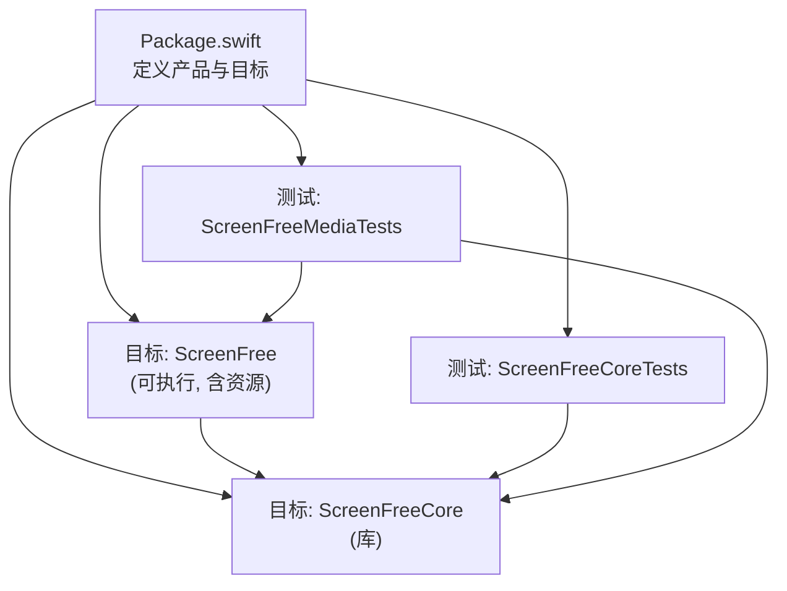
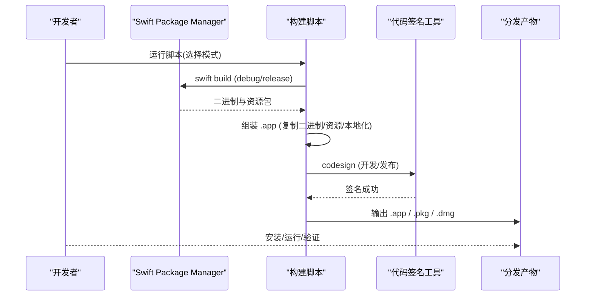
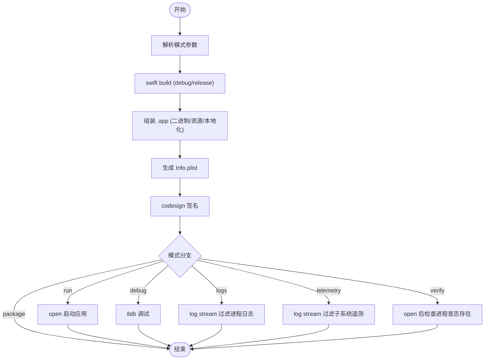
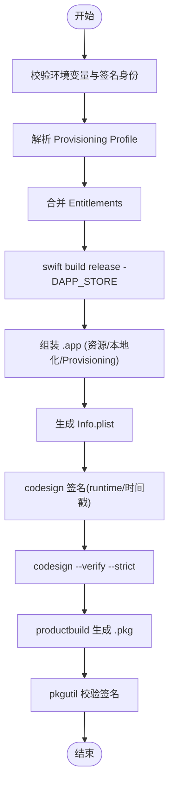
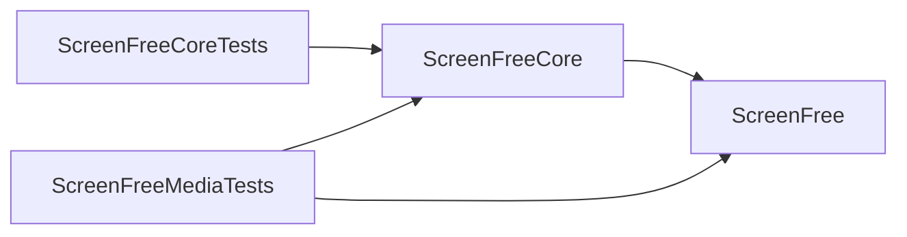

# 构建系统

<cite>
**本文引用的文件**   
- [Package.swift](file://Package.swift)
- [build_and_run.sh](file://script/build_and_run.sh)
- [build_app_store.sh](file://script/build_app_store.sh)
- [package_dmg.sh](file://script/package_dmg.sh)
- [AppStore.entitlements](file://Config/AppStore.entitlements)
- [README.md](file://README.md)
</cite>

## 目录
1. [简介](#简介)
2. [项目结构](#项目结构)
3. [核心组件](#核心组件)
4. [架构总览](#架构总览)
5. [详细组件分析](#详细组件分析)
6. [依赖关系分析](#依赖关系分析)
7. [性能考量](#性能考量)
8. [故障排查指南](#故障排查指南)
9. [结论](#结论)
10. [附录](#附录)

## 简介
本文件面向 ScreenFree 的构建系统，系统性说明 Swift Package Manager（SPM）配置与使用方式、三个构建脚本的职责与工作流、不同构建模式的使用方法，以及代码签名、资源打包、Info.plist 生成等关键环节。同时提供常见问题的解决方案、性能优化建议与最佳实践，帮助开发者高效完成本地开发、调试、发布与分发。

## 项目结构
ScreenFree 采用 SPM 管理包与目标：
- 可执行目标 ScreenFree：应用入口，包含 UI 与业务逻辑，并声明资源处理。
- 库目标 ScreenFreeCore：供应用与测试共享的核心模型与算法。
- 测试目标 ScreenFreeCoreTests、ScreenFreeMediaTests：覆盖核心逻辑与媒体管线。

图表来源
- [Package.swift:1-35](file://Package.swift#L1-L35)

章节来源
- [Package.swift:1-35](file://Package.swift#L1-L35)

## 核心组件
- SPM 配置（Package.swift）
  - 指定工具版本、默认本地化、平台要求（macOS 14+）。
  - 定义产品：可执行 ScreenFree、库 ScreenFreeCore。
  - 定义目标与依赖：ScreenFree 依赖 ScreenFreeCore；测试目标分别依赖对应库或应用。
  - 资源处理：ScreenFree 目标通过 .process("Resources") 将资源目录纳入构建产物。
  - Swift 语言模式：兼容 v5。

- 构建脚本
  - build_and_run.sh：开发与调试主脚本，支持 run、debug、logs、telemetry、verify、package 模式。
  - build_app_store.sh：App Store 构建与打包，生成 .pkg 安装包。
  - package_dmg.sh：将 dist/ScreenFree.app 打包为 DMG，便于分发。

章节来源
- [Package.swift:1-35](file://Package.swift#L1-L35)
- [build_and_run.sh:1-180](file://script/build_and_run.sh#L1-L180)
- [build_app_store.sh:1-165](file://script/build_app_store.sh#L1-L165)
- [package_dmg.sh:1-34](file://script/package_dmg.sh#L1-L34)

## 架构总览
下图展示了从 SPM 到构建脚本再到最终产物的整体流程，包括资源打包、权限与签名、日志与验证路径。

图表来源
- [build_and_run.sh:27-49](file://script/build_and_run.sh#L27-L49)
- [build_and_run.sh:141-147](file://script/build_and_run.sh#L141-L147)
- [build_app_store.sh:73-91](file://script/build_app_store.sh#L73-L91)
- [build_app_store.sh:152-161](file://script/build_app_store.sh#L152-L161)
- [package_dmg.sh:22-31](file://script/package_dmg.sh#L22-L31)

## 详细组件分析

### SPM 配置与依赖管理（Package.swift）
- 平台与本地化
  - 平台限制 macOS 14+，确保运行时能力可用。
  - 默认本地化为 en，配合 Resources/*.lproj 实现多语言。
- 产品与目标
  - 可执行 ScreenFree：入口应用，声明资源处理。
  - 库 ScreenFreeCore：被应用与测试复用。
  - 测试目标：ScreenFreeCoreTests 仅依赖库；ScreenFreeMediaTests 依赖应用与库，覆盖媒体管线。
- 资源处理
  - 通过 .process("Resources") 将资源目录纳入构建产物，脚本在组装 .app 时复制生成的 bundle 与本地化目录。

章节来源
- [Package.swift:1-35](file://Package.swift#L1-L35)

### 开发与调试构建脚本（build_and_run.sh）
职责概览
- 解析模式参数：run、package、debug、logs、telemetry、verify。
- 构建产物：调用 swift build 生成二进制与资源包。
- 组装 .app：创建 Contents/MacOS、Contents/Resources，拷贝二进制、资源 bundle、本地化、图标与隐私清单。
- 生成 Info.plist：动态写入 Bundle ID、版本、文档类型、最小系统版本、权限描述等。
- 代码签名：开发环境使用临时签名标识进行深度签名。
- 运行与诊断：根据模式启动应用、进入 lldb 调试、实时查看日志或遥测、验证进程存活。

关键流程（简化）

图表来源
- [build_and_run.sh:4-12](file://script/build_and_run.sh#L4-L12)
- [build_and_run.sh:27-49](file://script/build_and_run.sh#L27-L49)
- [build_and_run.sh:51-139](file://script/build_and_run.sh#L51-L139)
- [build_and_run.sh:141-147](file://script/build_and_run.sh#L141-L147)
- [build_and_run.sh:153-179](file://script/build_and_run.sh#L153-L179)

章节来源
- [build_and_run.sh:1-180](file://script/build_and_run.sh#L1-L180)

### App Store 构建脚本（build_app_store.sh）
职责概览
- 校验环境变量：APP_SIGN_IDENTITY、INSTALLER_SIGN_IDENTITY、PROVISIONING_PROFILE。
- 解析 Provisioning Profile：提取应用标识与团队标识，校验与 BUNDLE_ID 匹配。
- 合并 Entitlements：基于 Config/AppStore.entitlements 注入应用标识与团队标识。
- 构建与资源：release 模式构建，拷贝资源 bundle、本地化、图标、隐私清单与嵌入的 provisioning profile。
- 生成 Info.plist：设置营销版本、构建号、文档类型、权限描述等。
- 签名与验证：启用 runtime 选项、时间戳、严格校验，打印 entitlements 信息。
- 打包与校验：productbuild 生成 .pkg，pkgutil 校验签名。

关键流程（简化）

图表来源
- [build_app_store.sh:25-49](file://script/build_app_store.sh#L25-L49)
- [build_app_store.sh:52-71](file://script/build_app_store.sh#L52-L71)
- [build_app_store.sh:73-91](file://script/build_app_store.sh#L73-L91)
- [build_app_store.sh:93-150](file://script/build_app_store.sh#L93-L150)
- [build_app_store.sh:152-161](file://script/build_app_store.sh#L152-L161)

章节来源
- [build_app_store.sh:1-165](file://script/build_app_store.sh#L1-L165)
- [AppStore.entitlements:1-19](file://Config/AppStore.entitlements#L1-L19)

### DMG 打包脚本（package_dmg.sh）
职责概览
- 前置检查：确认 dist/ScreenFree.app 存在（需先执行 build_and_run.sh --package）。
- 读取版本：从 Info.plist 获取 CFBundleShortVersionString。
- 创建临时目录：复制 .app 并添加 Applications 软链接。
- 生成 DMG：hdiutil 压缩为 UDZO 格式，输出到 dist/ScreenFree-<版本>.dmg。

章节来源
- [package_dmg.sh:1-34](file://script/package_dmg.sh#L1-L34)

### 代码签名与权限（Entitlements）
- 开发签名：build_and_run.sh 使用临时签名标识对 .app 进行深度签名，便于本地运行与调试。
- 发布签名：build_app_store.sh 使用正式签名身份与 runtime 选项，结合 Provisioning Profile 与 Entitlements 完成沙盒与设备访问权限。
- Entitlements 内容：包含沙盒、音频输入、相机、电影读写、用户选择文件读写、书签等权限。

章节来源
- [build_and_run.sh:141-147](file://script/build_and_run.sh#L141-L147)
- [build_app_store.sh:152-157](file://script/build_app_store.sh#L152-L157)
- [AppStore.entitlements:1-19](file://Config/AppStore.entitlements#L1-L19)

### 资源打包与 Info.plist 生成
- 资源打包：
  - 复制构建产物中的 ScreenFree_ScreenFree.bundle。
  - 拷贝 Sources/ScreenFree/Resources/*.lproj 本地化目录。
  - 拷贝图标与 PrivacyInfo.xcprivacy。
  - App Store 构建额外嵌入 embedded.provisionprofile。
- Info.plist 生成：
  - 动态写入 CFBundleExecutable、CFBundleIdentifier、名称、显示名、版本、包类型、图标、分类、文档类型、UTType、最小系统版本、主类、高分屏支持、加密声明、权限描述等。
  - App Store 构建使用营销版本与构建号变量。

章节来源
- [build_and_run.sh:31-49](file://script/build_and_run.sh#L31-L49)
- [build_and_run.sh:51-139](file://script/build_and_run.sh#L51-L139)
- [build_app_store.sh:77-91](file://script/build_app_store.sh#L77-L91)
- [build_app_store.sh:93-150](file://script/build_app_store.sh#L93-L150)

### 构建模式与使用方法
- 开发模式（默认）：./script/build_and_run.sh
  - 构建 debug 配置，组装 .app，签名并打开应用。
- 打包模式：./script/build_and_run.sh --package
  - 构建 release 配置，生成 dist/ScreenFree.app。
- 调试模式：./script/build_and_run.sh --debug
  - 使用 lldb 调试二进制。
- 日志模式：./script/build_and_run.sh --logs
  - 打开应用并实时过滤进程日志。
- 遥测模式：./script/build_and_run.sh --telemetry
  - 打开应用并实时过滤子系统遥测。
- 验证模式：./script/build_and_run.sh --verify
  - 打开应用并检查进程是否存活。
- App Store 构建：./script/build_app_store.sh
  - 需要设置 APP_SIGN_IDENTITY、INSTALLER_SIGN_IDENTITY、PROVISIONING_PROFILE。
- DMG 打包：./script/package_dmg.sh
  - 依赖 dist/ScreenFree.app 已存在。

章节来源
- [build_and_run.sh:4-12](file://script/build_and_run.sh#L4-L12)
- [build_and_run.sh:153-179](file://script/build_and_run.sh#L153-L179)
- [build_app_store.sh:25-49](file://script/build_app_store.sh#L25-L49)
- [package_dmg.sh:11-14](file://script/package_dmg.sh#L11-L14)

## 依赖关系分析
- 目标依赖
  - ScreenFree 依赖 ScreenFreeCore。
  - ScreenFreeMediaTests 依赖 ScreenFree 与 ScreenFreeCore。
  - ScreenFreeCoreTests 依赖 ScreenFreeCore。
- 构建依赖
  - 所有脚本均依赖 swift build 与 macOS 工具链（codesign、plutil、security、productbuild、hdiutil）。
- 外部集成点
  - Provisioning Profile 与签名身份用于 App Store 构建。
  - 系统权限与隐私清单用于运行时权限请求。

图表来源
- [Package.swift:15-31](file://Package.swift#L15-L31)

章节来源
- [Package.swift:15-31](file://Package.swift#L15-L31)

## 性能考量
- 构建阶段
  - 开发时使用 debug 配置以获得更快的增量编译与更好的调试体验。
  - 发布时使用 release 配置以启用优化，减少二进制体积与提升运行性能。
- 资源与本地化
  - 仅拷贝必要的资源与本地化目录，避免冗余。
  - 合理组织 Resources 目录，减少不必要的拷贝与扫描。
- 签名与验证
  - 开发签名使用快速路径；发布签名启用时间戳与严格校验，确保合规性。
- 日志与遥测
  - 使用 log stream 过滤进程或子系统，降低无关日志开销。

[本节为通用指导，不直接分析具体文件]

## 故障排查指南
常见问题与解决思路
- 缺少 Provisioning Profile 或签名身份
  - 现象：App Store 构建失败，提示未找到文件或签名身份不存在。
  - 解决：确保 PROVISIONING_PROFILE 路径正确，且 APP_SIGN_IDENTITY、INSTALLER_SIGN_IDENTITY 已安装并可被 security 工具识别。
- 配置文件不匹配
  - 现象：Profile 中的应用标识与 BUNDLE_ID 不一致导致构建失败。
  - 解决：核对 BUNDLE_ID 与 Profile 中 com.apple.application-identifier 一致。
- 资源缺失
  - 现象：应用启动崩溃或功能异常，缺少图标、本地化或隐私清单。
  - 解决：确认 Sources/ScreenFree/Resources 下相关文件存在并被脚本正确拷贝。
- 签名失败
  - 现象：codesign 报错，无法签名或验证失败。
  - 解决：检查签名身份、entitlements 与时间戳选项；发布构建需启用 runtime 与严格校验。
- 日志与遥测无输出
  - 现象：--logs 或 --telemetry 模式下无日志。
  - 解决：确认应用使用了正确的子系统标识与进程名；检查权限与日志级别。

章节来源
- [build_app_store.sh:25-49](file://script/build_app_store.sh#L25-L49)
- [build_app_store.sh:52-71](file://script/build_app_store.sh#L52-L71)
- [build_app_store.sh:152-161](file://script/build_app_store.sh#L152-L161)
- [build_and_run.sh:141-147](file://script/build_and_run.sh#L141-L147)

## 结论
ScreenFree 的构建系统以 SPM 为核心，配合三个 Bash 脚本覆盖开发、调试、发布与分发的全流程。通过清晰的依赖管理、严格的签名与权限控制、完善的资源与 Info.plist 生成机制，开发者可以高效地迭代与交付高质量应用。遵循本文的最佳实践与故障排查建议，能够显著降低构建与发布过程中的问题率，提升团队协作效率。

[本节为总结性内容，不直接分析具体文件]

## 附录
- 快速命令参考
  - 开发运行：./script/build_and_run.sh
  - 打包发布：./script/build_and_run.sh --package
  - 调试：./script/build_and_run.sh --debug
  - 日志：./script/build_and_run.sh --logs
  - 遥测：./script/build_and_run.sh --telemetry
  - 验证：./script/build_and_run.sh --verify
  - App Store 构建：./script/build_app_store.sh
  - DMG 打包：./script/package_dmg.sh

章节来源
- [README.md:95-101](file://README.md#L95-L101)
- [build_and_run.sh:153-179](file://script/build_and_run.sh#L153-L179)
- [build_app_store.sh:159-165](file://script/build_app_store.sh#L159-L165)
- [package_dmg.sh:26-33](file://script/package_dmg.sh#L26-L33)