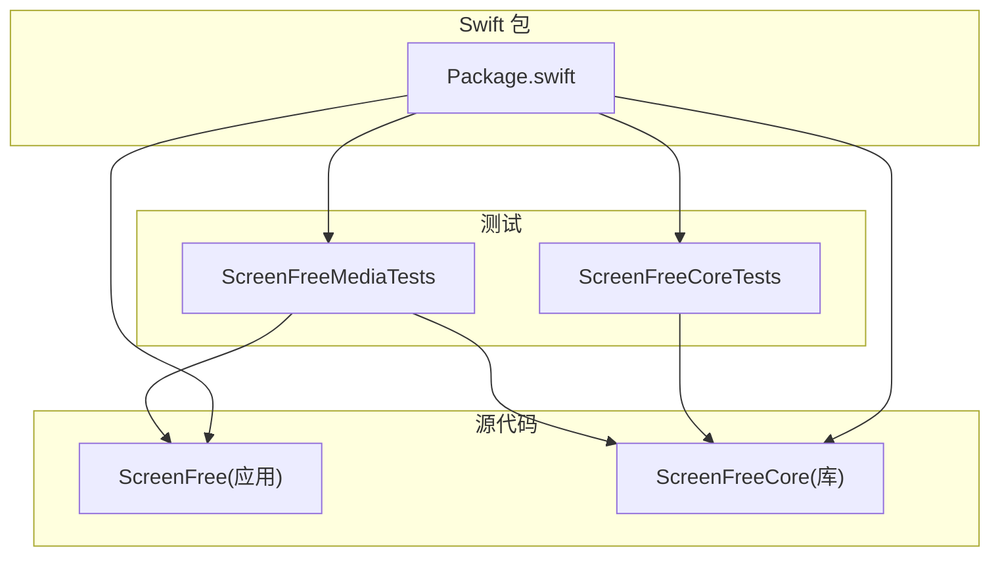
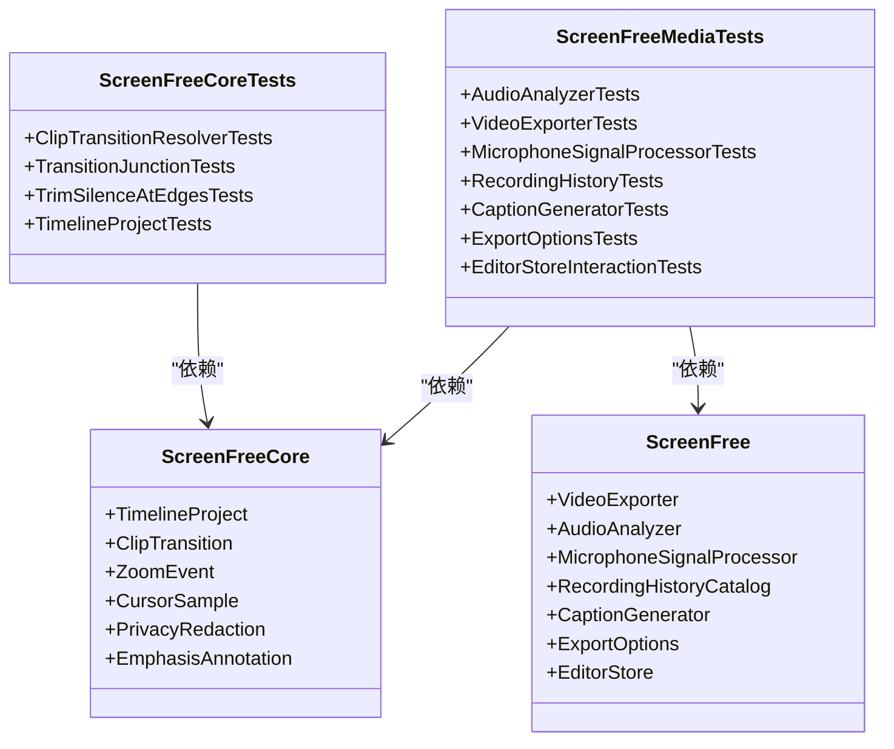
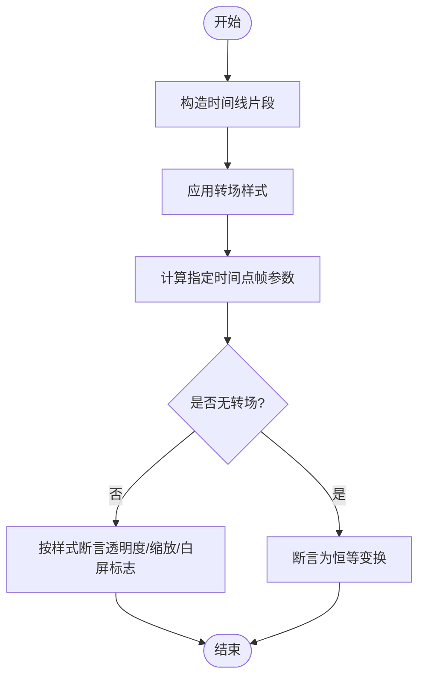
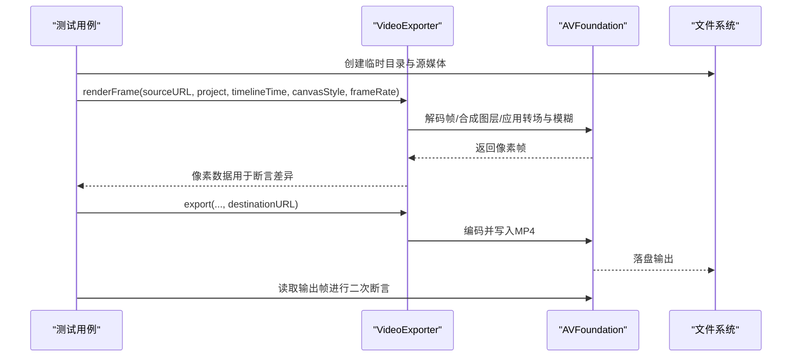
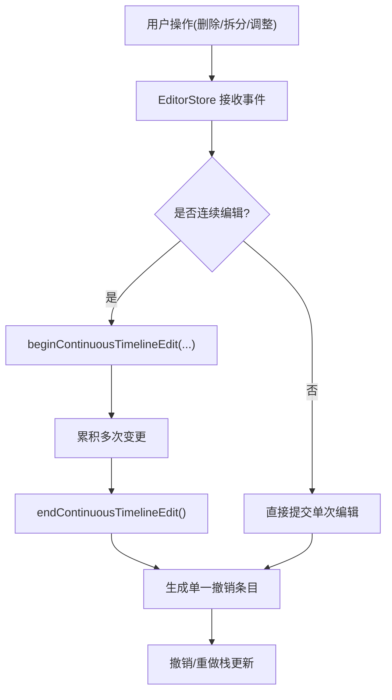
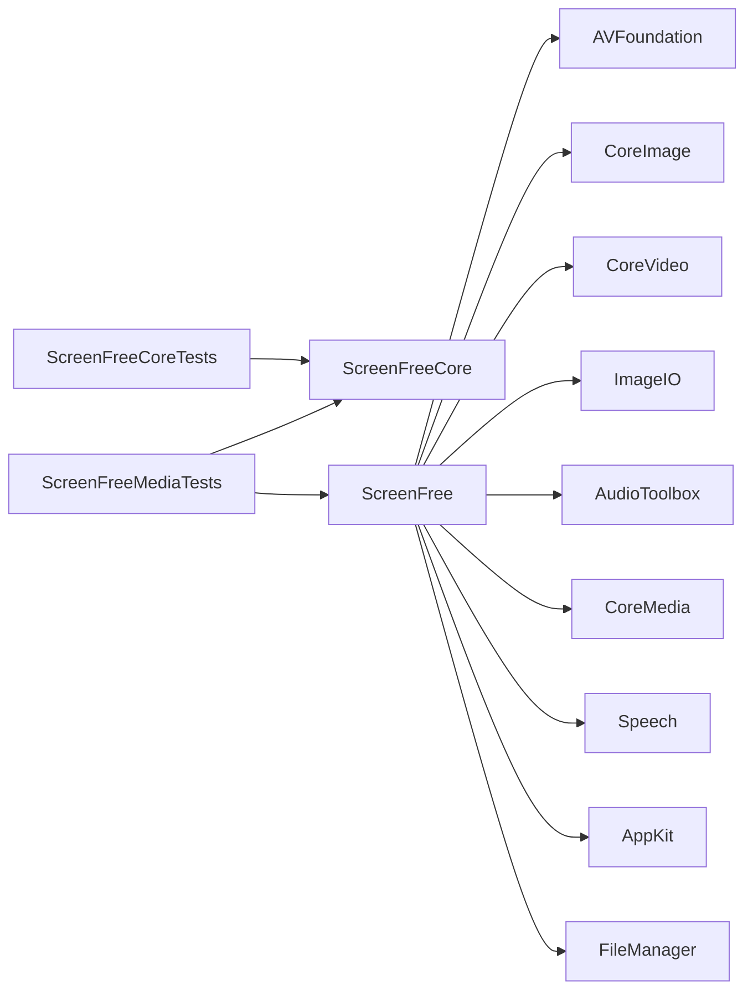

# 测试指南

<cite>
**本文引用的文件**   
- [Package.swift](file://Package.swift)
- [ClipTransitionTests.swift](file://Tests/ScreenFreeCoreTests/ClipTransitionTests.swift)
- [TimelineProjectTests.swift](file://Tests/ScreenFreeCoreTests/TimelineProjectTests.swift)
- [AudioAnalyzerTests.swift](file://Tests/ScreenFreeMediaTests/AudioAnalyzerTests.swift)
- [VideoExporterTests.swift](file://Tests/ScreenFreeMediaTests/VideoExporterTests.swift)
- [EditorStoreInteractionTests.swift](file://Tests/ScreenFreeMediaTests/EditorStoreInteractionTests.swift)
- [MicrophoneSignalProcessorTests.swift](file://Tests/ScreenFreeMediaTests/MicrophoneSignalProcessorTests.swift)
- [RecordingHistoryTests.swift](file://Tests/ScreenFreeMediaTests/RecordingHistoryTests.swift)
- [CaptionGeneratorTests.swift](file://Tests/ScreenFreeMediaTests/CaptionGeneratorTests.swift)
- [ExportOptionsTests.swift](file://Tests/ScreenFreeMediaTests/ExportOptionsTests.swift)
- [build_and_run.sh](file://script/build_and_run.sh)
</cite>

## 目录
1. [简介](#简介)
2. [项目结构](#项目结构)
3. [核心组件](#核心组件)
4. [架构总览](#架构总览)
5. [详细组件分析](#详细组件分析)
6. [依赖分析](#依赖分析)
7. [性能考虑](#性能考虑)
8. [故障排查指南](#故障排查指南)
9. [结论](#结论)
10. [附录](#附录)

## 简介
本指南面向 ScreenFree 项目的测试实践，系统性说明测试策略与架构、测试包职责划分（ScreenFreeCoreTests 与 ScreenFreeMediaTests）、在 Xcode 与命令行中运行测试的方法、最佳实践（命名约定、Mock 使用、异步测试）、常见场景示例、覆盖率收集与报告生成、失败调试方法与性能测试技巧。内容基于仓库中的 Package.swift 与 Tests 目录下的实际测试实现进行归纳总结。

## 项目结构
- 顶层通过 Swift Package Manager 管理目标与测试：
  - 产品：可执行目标 ScreenFree 与库目标 ScreenFreeCore
  - 测试目标：ScreenFreeCoreTests、ScreenFreeMediaTests
- 测试组织方式：
  - ScreenFreeCoreTests：聚焦时间线、转场、缩放等纯数据与算法逻辑
  - ScreenFreeMediaTests：覆盖媒体处理、导出、音频分析、UI 交互、历史记录、字幕等集成与系统能力相关测试

图表来源
- [Package.swift:1-35](file://Package.swift#L1-L35)

章节来源
- [Package.swift:1-35](file://Package.swift#L1-L35)

## 核心组件
- 测试框架：XCTest
- 测试目标与依赖：
  - ScreenFreeCoreTests 依赖 ScreenFreeCore
  - ScreenFreeMediaTests 依赖 ScreenFree 与 ScreenFreeCore
- 测试类型：
  - 单元测试：对纯函数、数据结构、状态机等进行断言
  - 集成测试：涉及文件系统、AVFoundation、剪贴板、语音识别等系统 API 的端到端验证

章节来源
- [Package.swift:15-31](file://Package.swift#L15-L31)

## 架构总览
测试架构围绕“分层隔离”原则：
- 核心逻辑层（ScreenFreeCore）由 ScreenFreeCoreTests 直接测试，保证时间线、转场、缩放、标注等基础能力稳定
- 媒体与应用层（ScreenFree）由 ScreenFreeMediaTests 测试，涵盖导出、混音、麦克风信号处理、历史记录、字幕生成、UI 交互等
- 测试用例通过 @testable import 访问内部类型与方法，便于精确断言

图表来源
- [Package.swift:15-31](file://Package.swift#L15-L31)
- [ClipTransitionTests.swift:1-10](file://Tests/ScreenFreeCoreTests/ClipTransitionTests.swift#L1-L10)
- [TimelineProjectTests.swift:1-10](file://Tests/ScreenFreeCoreTests/TimelineProjectTests.swift#L1-L10)
- [AudioAnalyzerTests.swift:1-10](file://Tests/ScreenFreeMediaTests/AudioAnalyzerTests.swift#L1-L10)
- [VideoExporterTests.swift:1-10](file://Tests/ScreenFreeMediaTests/VideoExporterTests.swift#L1-L10)
- [EditorStoreInteractionTests.swift:1-10](file://Tests/ScreenFreeMediaTests/EditorStoreInteractionTests.swift#L1-L10)
- [MicrophoneSignalProcessorTests.swift:1-10](file://Tests/ScreenFreeMediaTests/MicrophoneSignalProcessorTests.swift#L1-L10)
- [RecordingHistoryTests.swift:1-10](file://Tests/ScreenFreeMediaTests/RecordingHistoryTests.swift#L1-L10)
- [CaptionGeneratorTests.swift:1-10](file://Tests/ScreenFreeMediaTests/CaptionGeneratorTests.swift#L1-L10)
- [ExportOptionsTests.swift:1-10](file://Tests/ScreenFreeMediaTests/ExportOptionsTests.swift#L1-L10)

## 详细组件分析

### ScreenFreeCoreTests：时间线与转场核心逻辑
- 关注点：
  - 转场解析器在不同样式（淡入淡出、闪白、缩放）下的帧变换计算
  - 时间线剪辑分割、合并、静音裁剪、注释与隐私遮罩范围编辑
  - 播放跟随策略、光标轨迹平滑与抖动过滤
- 典型断言模式：
  - 数值精度断言（accuracy）
  - 边界条件与兼容性（旧版本 JSON 反序列化）
  - 一致性校验（如相邻缩放无缝衔接）

图表来源
- [ClipTransitionTests.swift:31-106](file://Tests/ScreenFreeCoreTests/ClipTransitionTests.swift#L31-L106)

章节来源
- [ClipTransitionTests.swift:1-290](file://Tests/ScreenFreeCoreTests/ClipTransitionTests.swift#L1-L290)
- [TimelineProjectTests.swift:1-800](file://Tests/ScreenFreeCoreTests/TimelineProjectTests.swift#L1-L800)

### ScreenFreeMediaTests：媒体处理与导出
- 关注点：
  - 视频导出帧渲染差异（快速/柔和缩放、自定义贝塞尔曲线、运动模糊）
  - 多轨音频混合与音量增益控制、峰值保护
  - 背景乐循环与音量设置
  - 隐私遮罩与聚光灯效果在帧与 MP4 中的持久化
  - 历史录制目录扫描、删除与权限校验
  - 本地语音识别词汇清洗与请求构建
  - 导出分辨率、帧率、尺寸估算与格式支持

图表来源
- [VideoExporterTests.swift:42-224](file://Tests/ScreenFreeMediaTests/VideoExporterTests.swift#L42-L224)
- [VideoExporterTests.swift:299-497](file://Tests/ScreenFreeMediaTests/VideoExporterTests.swift#L299-L497)
- [VideoExporterTests.swift:571-772](file://Tests/ScreenFreeMediaTests/VideoExporterTests.swift#L571-L772)

章节来源
- [VideoExporterTests.swift:1-800](file://Tests/ScreenFreeMediaTests/VideoExporterTests.swift#L1-L800)
- [ExportOptionsTests.swift:1-304](file://Tests/ScreenFreeMediaTests/ExportOptionsTests.swift#L1-L304)
- [AudioAnalyzerTests.swift:1-64](file://Tests/ScreenFreeMediaTests/AudioAnalyzerTests.swift#L1-L64)
- [MicrophoneSignalProcessorTests.swift:1-271](file://Tests/ScreenFreeMediaTests/MicrophoneSignalProcessorTests.swift#L1-L271)
- [RecordingHistoryTests.swift:1-134](file://Tests/ScreenFreeMediaTests/RecordingHistoryTests.swift#L1-L134)
- [CaptionGeneratorTests.swift:1-38](file://Tests/ScreenFreeMediaTests/CaptionGeneratorTests.swift#L1-L38)

### EditorStoreInteractionTests：UI 交互与撤销重做
- 关注点：
  - 撤销路由到可编辑文本响应者
  - 录音默认配置与麦克风选择策略
  - 连续编辑原子性（拆分、缩放、隐私块、注释）
  - 删除命令优先级与撤销恢复一致性
  - 播放边界行为（连续与非连续片段）

图表来源
- [EditorStoreInteractionTests.swift:313-696](file://Tests/ScreenFreeMediaTests/EditorStoreInteractionTests.swift#L313-L696)

章节来源
- [EditorStoreInteractionTests.swift:1-696](file://Tests/ScreenFreeMediaTests/EditorStoreInteractionTests.swift#L1-L696)

## 依赖分析
- 测试目标依赖关系：
  - ScreenFreeCoreTests → ScreenFreeCore
  - ScreenFreeMediaTests → ScreenFree、ScreenFreeCore
- 外部系统依赖：
  - AVFoundation（音视频编解码、资产读取）
  - CoreImage/CoreVideo/ImageIO（图像处理）
  - AudioToolbox/CoreMedia（音频缓冲与格式描述）
  - Speech（本地语音识别）
  - AppKit（剪贴板、文本视图）
  - FileManager（文件系统操作）

图表来源
- [Package.swift:15-31](file://Package.swift#L15-L31)
- [VideoExporterTests.swift:1-10](file://Tests/ScreenFreeMediaTests/VideoExporterTests.swift#L1-L10)
- [MicrophoneSignalProcessorTests.swift:1-10](file://Tests/ScreenFreeMediaTests/MicrophoneSignalProcessorTests.swift#L1-L10)
- [CaptionGeneratorTests.swift:1-10](file://Tests/ScreenFreeMediaTests/CaptionGeneratorTests.swift#L1-L10)
- [EditorStoreInteractionTests.swift:1-10](file://Tests/ScreenFreeMediaTests/EditorStoreInteractionTests.swift#L1-L10)

章节来源
- [Package.swift:15-31](file://Package.swift#L15-L31)

## 性能考虑
- 渲染差异对比：通过像素级差异阈值判断不同缩放风格与运动模糊的效果差异，避免主观判断
- 导出时长估计：根据分辨率、帧率、质量等级估算文件大小与处理时长，辅助 UI 提示与资源规划
- 音频峰值保护：在多轨混音时依据峰值包络动态分配增益，防止削波并保持听感一致
- 光标轨迹优化：去除抖动与快速变化，减少不必要的插值开销

章节来源
- [VideoExporterTests.swift:42-224](file://Tests/ScreenFreeMediaTests/VideoExporterTests.swift#L42-L224)
- [ExportOptionsTests.swift:170-227](file://Tests/ScreenFreeMediaTests/ExportOptionsTests.swift#L170-L227)
- [EditorStoreInteractionTests.swift:99-292](file://Tests/ScreenFreeMediaTests/EditorStoreInteractionTests.swift#L99-L292)
- [TimelineProjectTests.swift:199-310](file://Tests/ScreenFreeCoreTests/TimelineProjectTests.swift#L199-L310)

## 故障排查指南
- 常见问题定位：
  - 导出失败：检查临时目录权限、源媒体可用性、目标路径可写性
  - 音频异常：确认多轨布局与索引、音量增益与峰值保护逻辑
  - 字幕识别失败：核对词汇清洗与本地识别上下文长度限制
  - 历史记录错误：确保仅操作目录内文件，拒绝越权删除
- 调试建议：
  - 使用 XCTest 断言失败堆栈定位具体步骤
  - 针对异步任务使用 async/await 与超时控制
  - 借助日志流查看运行时信息（脚本提供日志模式）

章节来源
- [RecordingHistoryTests.swift:67-133](file://Tests/ScreenFreeMediaTests/RecordingHistoryTests.swift#L67-L133)
- [CaptionGeneratorTests.swift:6-37](file://Tests/ScreenFreeMediaTests/CaptionGeneratorTests.swift#L6-L37)
- [build_and_run.sh:162-168](file://script/build_and_run.sh#L162-L168)

## 结论
ScreenFree 的测试体系以 Swift Package Manager 为核心，将核心逻辑与媒体应用层测试清晰分离。通过 XCTest 与丰富的系统 API 集成，覆盖了从时间线编辑、转场渲染到导出、混音、字幕生成的全链路功能。遵循良好的命名约定、异步测试与 Mock 策略，结合覆盖率与性能断言，可有效保障代码质量与用户体验。

## 附录

### 测试策略与职责划分
- ScreenFreeCoreTests
  - 专注纯数据与算法：时间线剪辑、转场、缩放、注释、隐私遮罩、光标轨迹
  - 断言重点：数值精度、边界条件、兼容性与一致性
- ScreenFreeMediaTests
  - 专注媒体与系统集成：导出、混音、麦克风处理、历史记录、字幕、UI 交互
  - 断言重点：像素差异、音频峰值、文件落盘、系统 API 行为

章节来源
- [Package.swift:24-31](file://Package.swift#L24-L31)
- [ClipTransitionTests.swift:1-106](file://Tests/ScreenFreeCoreTests/ClipTransitionTests.swift#L1-L106)
- [VideoExporterTests.swift:1-224](file://Tests/ScreenFreeMediaTests/VideoExporterTests.swift#L1-L224)

### 如何在 Xcode 中运行测试
- 打开项目或包后，选择对应测试目标（ScreenFreeCoreTests 或 ScreenFreeMediaTests）
- 点击运行按钮执行全部测试；或在测试导航器中选择单个测试类/方法运行
- 使用“运行并显示结果”查看断言详情与堆栈

[本节为通用指导，不直接分析具体文件]

### 如何在命令行中运行测试
- 使用 SwiftPM 运行全部测试：swift test
- 运行特定测试目标：swift test --filter ScreenFreeCoreTests
- 运行单个测试类或方法：swift test --filter "ClassName/testMethodName"
- 生成覆盖率报告（需启用）：swift test --enable-code-coverage

[本节为通用指导，不直接分析具体文件]

### 测试最佳实践
- 命名约定
  - 测试类名以被测试类型结尾（如 ClipTransitionResolverTests）
  - 测试方法以 test 开头，描述预期行为（如 testFadePeaksAtCutAndIsZeroOutsideWindow）
- Mock 对象的使用
  - 对于系统 API（如 FileManager、AVAsset），优先使用临时目录与合成媒体，避免真实设备依赖
  - 对复杂对象（如 CMSampleBuffer）通过工具函数构造最小可用实例
- 异步测试的处理
  - 使用 async/await 与 try XCTUnwrap 处理可能抛出的错误
  - 合理设置超时与容差（accuracy）避免时序波动导致的不稳定

章节来源
- [ClipTransitionTests.swift:31-106](file://Tests/ScreenFreeCoreTests/ClipTransitionTests.swift#L31-L106)
- [MicrophoneSignalProcessorTests.swift:152-271](file://Tests/ScreenFreeMediaTests/MicrophoneSignalProcessorTests.swift#L152-L271)
- [VideoExporterTests.swift:42-224](file://Tests/ScreenFreeMediaTests/VideoExporterTests.swift#L42-L224)

### 常见测试场景示例
- 媒体处理测试
  - 导出帧渲染差异与运动模糊效果验证
  - 多轨音频混合与音量增益、峰值保护
- UI 交互测试
  - 撤销/重做原子性、删除命令优先级、播放边界行为
- 状态管理测试
  - 时间线剪辑分割/合并、静音裁剪、注释与隐私遮罩范围编辑

章节来源
- [VideoExporterTests.swift:299-497](file://Tests/ScreenFreeMediaTests/VideoExporterTests.swift#L299-L497)
- [EditorStoreInteractionTests.swift:313-696](file://Tests/ScreenFreeMediaTests/EditorStoreInteractionTests.swift#L313-L696)
- [TimelineProjectTests.swift:610-712](file://Tests/ScreenFreeCoreTests/TimelineProjectTests.swift#L610-L712)

### 测试覆盖率收集与报告生成
- 启用覆盖率：swift test --enable-code-coverage
- 生成 HTML 报告：xcrun llvm-cov show <测试产物路径> -format=html -o coverage_report
- 在 CI 中集成覆盖率门禁，确保关键模块覆盖率达标

[本节为通用指导，不直接分析具体文件]

### 调试测试失败的方法
- 查看断言失败位置与期望值差异
- 针对异步任务增加日志与超时控制
- 使用脚本的日志模式捕获运行时信息

章节来源
- [build_and_run.sh:162-168](file://script/build_and_run.sh#L162-L168)

### 性能测试技巧
- 像素差异阈值比较：量化不同渲染风格的差异
- 导出时长估算：根据分辨率、帧率、质量等级预估处理时间与文件大小
- 音频峰值保护：依据包络动态调整增益，避免削波

章节来源
- [VideoExporterTests.swift:42-224](file://Tests/ScreenFreeMediaTests/VideoExporterTests.swift#L42-L224)
- [ExportOptionsTests.swift:170-227](file://Tests/ScreenFreeMediaTests/ExportOptionsTests.swift#L170-L227)