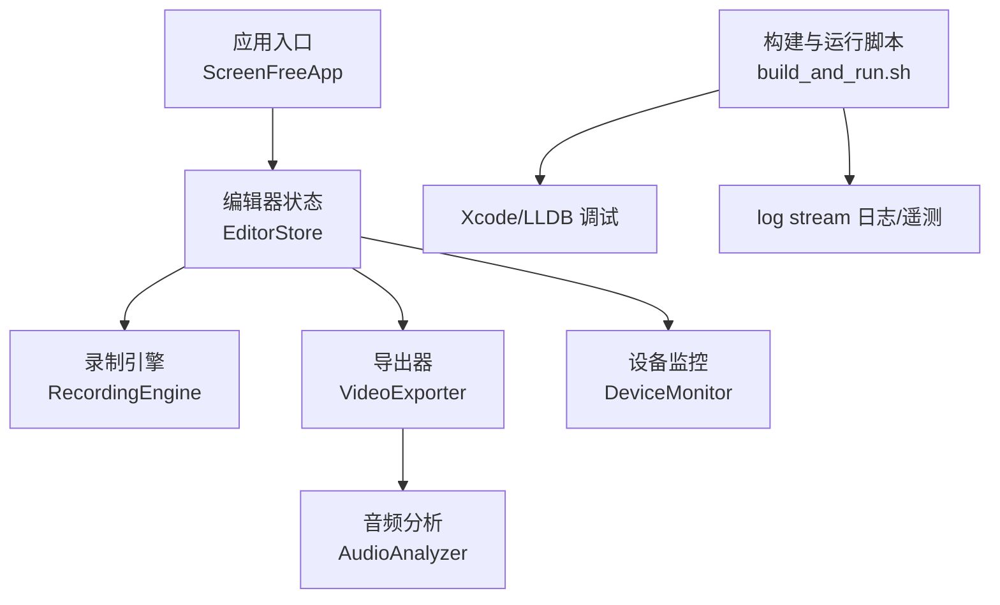
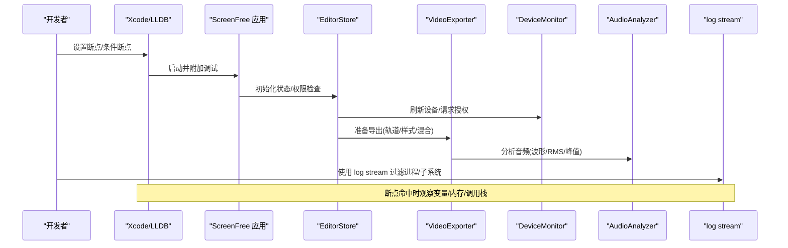
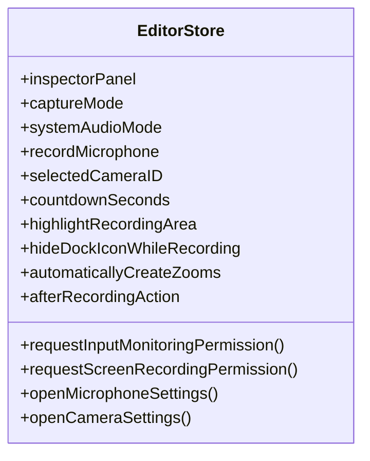
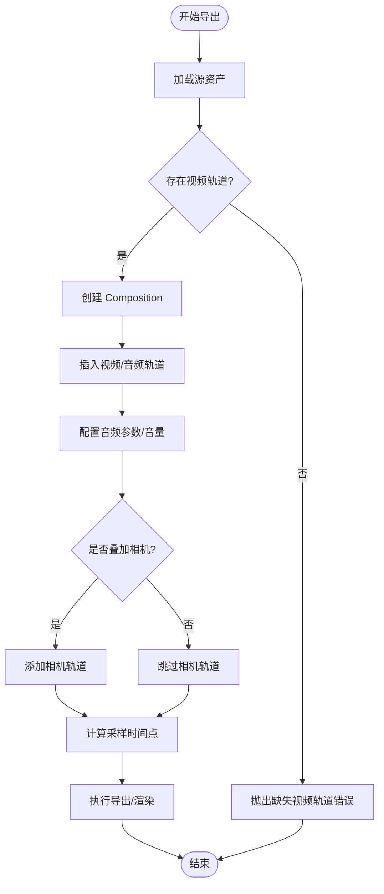
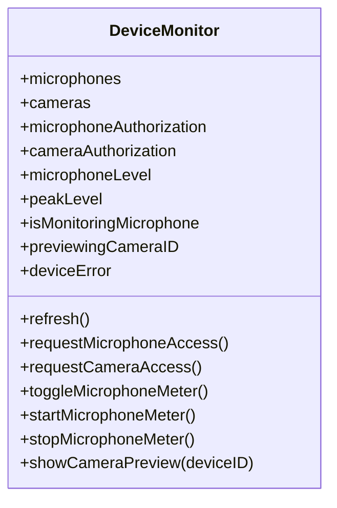
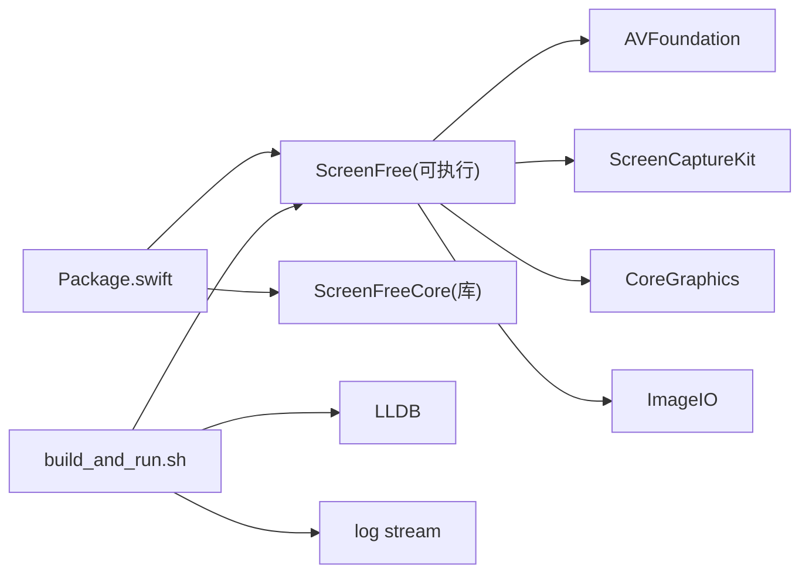

# 调试工具

<cite>
**本文引用的文件**   
- [README.md](file://README.md)
- [Package.swift](file://Package.swift)
- [build_and_run.sh](file://script/build_and_run.sh)
- [EditorStore.swift](file://Sources/ScreenFree/EditorStore.swift)
- [VideoExporter.swift](file://Sources/ScreenFree/VideoExporter.swift)
- [DeviceMonitor.swift](file://Sources/ScreenFree/DeviceMonitor.swift)
- [AudioAnalyzer.swift](file://Sources/ScreenFree/AudioAnalyzer.swift)
- [LocalizationTests.swift](file://Tests/ScreenFreeMediaTests/LocalizationTests.swift)
- [Product Requirements](file://docs/PRODUCT_REQUIREMENTS.md)
</cite>

## 目录
1. [简介](#简介)
2. [项目结构](#项目结构)
3. [核心组件](#核心组件)
4. [架构总览](#架构总览)
5. [详细组件分析](#详细组件分析)
6. [依赖关系分析](#依赖关系分析)
7. [性能注意事项](#性能注意事项)
8. [故障排查指南](#故障排查指南)
9. [结论](#结论)
10. [附录](#附录)

## 简介
本指南面向 ScreenFree 的开发者与测试人员，系统讲解如何在 Xcode 中进行断点调试、变量监视与内存分析；如何使用 LLDB 命令行完成条件断点、表达式求值与内存查看等高级操作；如何收集与分析应用日志与遥测数据；如何使用 Instruments（Time Profiler、Allocations、Leaks）进行性能分析与问题定位。同时提供常见调试场景的解决方案与最佳实践，帮助你快速定位并解决问题。

## 项目结构
ScreenFree 是一个基于 SwiftUI/AppKit 的 macOS 原生录屏与非破坏性视频编辑应用，核心模块包括录制、音频分析、导出渲染、设备监控与编辑器状态管理等。构建与运行由脚本统一管理，支持 debug/release 两种模式，并提供 lldb 启动、日志流过滤与遥测过滤等便捷入口。

图表来源
- [build_and_run.sh:153-179](file://script/build_and_run.sh#L153-L179)
- [EditorStore.swift:31-121](file://Sources/ScreenFree/EditorStore.swift#L31-L121)
- [VideoExporter.swift:95-118](file://Sources/ScreenFree/VideoExporter.swift#L95-L118)
- [DeviceMonitor.swift:44-100](file://Sources/ScreenFree/DeviceMonitor.swift#L44-L100)
- [AudioAnalyzer.swift:1-45](file://Sources/ScreenFree/AudioAnalyzer.swift#L1-L45)

章节来源
- [README.md:1-120](file://README.md#L1-L120)
- [Package.swift:1-35](file://Package.swift#L1-L35)
- [build_and_run.sh:1-180](file://script/build_and_run.sh#L1-L180)

## 核心组件
- EditorStore：编辑器全局状态与交互中枢，管理权限、录制选项、时间线编辑、样式预设、快捷键捕获等。
- VideoExporter：负责将时间线与媒体素材组合为可导出的视频，处理轨道插入、音量参数、相机叠加等。
- DeviceMonitor：设备发现与授权、麦克风实时电平监测、摄像头预览与录制控制。
- AudioAnalyzer：对音频样本进行波形、RMS、峰值与包络分析，用于可视化与自动增益建议。

章节来源
- [EditorStore.swift:31-121](file://Sources/ScreenFree/EditorStore.swift#L31-L121)
- [VideoExporter.swift:95-118](file://Sources/ScreenFree/VideoExporter.swift#L95-L118)
- [DeviceMonitor.swift:44-100](file://Sources/ScreenFree/DeviceMonitor.swift#L44-L100)
- [AudioAnalyzer.swift:1-45](file://Sources/ScreenFree/AudioAnalyzer.swift#L1-L45)

## 架构总览
下图展示了从录制到导出的关键流程，以及调试与日志采集在其中的接入点。

图表来源
- [EditorStore.swift:1405-1434](file://Sources/ScreenFree/EditorStore.swift#L1405-L1434)
- [VideoExporter.swift:103-118](file://Sources/ScreenFree/VideoExporter.swift#L103-L118)
- [DeviceMonitor.swift:69-100](file://Sources/ScreenFree/DeviceMonitor.swift#L69-L100)
- [AudioAnalyzer.swift:118-131](file://Sources/ScreenFree/AudioAnalyzer.swift#L118-L131)
- [build_and_run.sh:162-168](file://script/build_and_run.sh#L162-L168)

## 详细组件分析

### 编辑器状态与输入捕获（EditorStore）
- 功能要点：管理录制目标、系统/麦克风音频模式、相机选择、倒计时、高亮区域、Dock/桌面图标策略、快捷键捕获、权限请求与引导。
- 调试关注点：权限判断分支、事件监听回调、状态变更触发 UI 更新。
- 典型断点位置：权限请求方法、全局事件监听注册处、状态属性 setter。

图表来源
- [EditorStore.swift:31-121](file://Sources/ScreenFree/EditorStore.swift#L31-L121)
- [EditorStore.swift:1405-1434](file://Sources/ScreenFree/EditorStore.swift#L1405-L1434)

章节来源
- [EditorStore.swift:1405-1434](file://Sources/ScreenFree/EditorStore.swift#L1405-L1434)
- [EditorStore.swift:3344-3377](file://Sources/ScreenFree/EditorStore.swift#L3344-L3377)

### 视频导出管线（VideoExporter）
- 功能要点：创建 Composition、插入音视频轨道、配置音量参数、相机叠加、采样时间点生成、错误类型定义。
- 调试关注点：轨道插入失败、导出会话创建失败、帧读取异常、采样时间边界处理。
- 典型断点位置：prepare 方法入口、insertTimeRange 调用处、错误抛出点。

图表来源
- [VideoExporter.swift:103-118](file://Sources/ScreenFree/VideoExporter.swift#L103-L118)
- [VideoExporter.swift:126-146](file://Sources/ScreenFree/VideoExporter.swift#L126-L146)
- [VideoExporter.swift:2320-2343](file://Sources/ScreenFree/VideoExporter.swift#L2320-L2343)

章节来源
- [VideoExporter.swift:12-33](file://Sources/ScreenFree/VideoExporter.swift#L12-L33)
- [VideoExporter.swift:103-118](file://Sources/ScreenFree/VideoExporter.swift#L103-L118)
- [VideoExporter.swift:2320-2343](file://Sources/ScreenFree/VideoExporter.swift#L2320-L2343)

### 设备监控与音频信号（DeviceMonitor）
- 功能要点：设备发现、授权状态、麦克风实时电平监测、摄像头预览与录制控制、错误提示。
- 调试关注点：授权失败路径、音频引擎启动异常、电平计算逻辑。
- 典型断点位置：startMicrophoneMeter、stopMicrophoneMeter、refresh、showCameraPreview。

图表来源
- [DeviceMonitor.swift:44-100](file://Sources/ScreenFree/DeviceMonitor.swift#L44-L100)
- [DeviceMonitor.swift:127-171](file://Sources/ScreenFree/DeviceMonitor.swift#L127-L171)

章节来源
- [DeviceMonitor.swift:69-100](file://Sources/ScreenFree/DeviceMonitor.swift#L69-L100)
- [DeviceMonitor.swift:127-171](file://Sources/ScreenFree/DeviceMonitor.swift#L127-L171)

### 音频分析（AudioAnalyzer）
- 功能要点：波形生成、RMS/峰值计算、多轨合并、推荐增益计算。
- 调试关注点：空样本处理、静音阈值、峰值包络对齐。
- 典型断点位置：analyze(url)、combine(analyses)、recommendedGain。

章节来源
- [AudioAnalyzer.swift:1-45](file://Sources/ScreenFree/AudioAnalyzer.swift#L1-L45)
- [AudioAnalyzer.swift:118-131](file://Sources/ScreenFree/AudioAnalyzer.swift#L118-L131)

## 依赖关系分析
- 构建产物与目标：Package.swift 定义了可执行目标 ScreenFree 与库目标 ScreenFreeCore，以及测试目标。
- 运行与调试：build_and_run.sh 统一构建、打包、签名、启动、lldb 附加、日志流过滤与遥测过滤。
- 运行时依赖：AVFoundation、ScreenCaptureKit、CoreGraphics、ImageIO 等系统框架。

图表来源
- [Package.swift:1-35](file://Package.swift#L1-L35)
- [build_and_run.sh:153-179](file://script/build_and_run.sh#L153-L179)

章节来源
- [Package.swift:1-35](file://Package.swift#L1-L35)
- [build_and_run.sh:153-179](file://script/build_and_run.sh#L153-L179)

## 性能注意事项
- 录制与导出阶段 CPU/GPU 占用较高，优先使用 Time Profiler 定位热点函数（如合成、滤镜、编码）。
- 内存方面重点关注临时缓冲区与像素缓冲区的分配释放，使用 Allocations 与 Leaks 检测泄漏与峰值。
- 音频处理路径中避免频繁对象创建，复用缓冲区与格式对象，减少主线程阻塞。
- 导出进度与取消路径需保证资源清理，避免部分输出残留。

[本节为通用指导，不直接分析具体文件]

## 故障排查指南

### 使用 Xcode 进行断点调试与变量监视
- 在关键路径设置断点：权限请求、事件监听注册、导出准备、音频分析、设备监控。
- 使用变量监视观察状态变化：EditorStore 的属性、DeviceMonitor 的电平与授权状态、VideoExporter 的 Composition 与轨道信息。
- 使用控制台打印关键路径的中间结果，结合日志流过滤缩小范围。

章节来源
- [EditorStore.swift:1405-1434](file://Sources/ScreenFree/EditorStore.swift#L1405-L1434)
- [DeviceMonitor.swift:127-171](file://Sources/ScreenFree/DeviceMonitor.swift#L127-L171)
- [VideoExporter.swift:103-118](file://Sources/ScreenFree/VideoExporter.swift#L103-L118)

### LLDB 命令行高级用法
- 条件断点：在权限判断或导出失败分支设置条件，仅当特定状态满足时中断。
- 表达式求值：在运行时查询 EditorStore 的状态属性、DeviceMonitor 的设备列表与授权状态。
- 内存查看：查看像素缓冲、音频缓冲区指针与长度，验证数据完整性。
- 调用栈分析：在崩溃或卡顿时回溯调用链，定位问题源头。

章节来源
- [build_and_run.sh:159-161](file://script/build_and_run.sh#L159-L161)

### 日志收集与分析（log stream）
- 应用日志：通过进程名过滤，聚焦 ScreenFree 的日志输出。
- 遥测数据：通过子系统过滤，获取自定义遥测信息。
- 建议在导出、权限请求、设备监控的关键路径增加结构化日志，便于检索与关联。

章节来源
- [build_and_run.sh:162-168](file://script/build_and_run.sh#L162-L168)

### 性能分析（Instruments）
- Time Profiler：定位录制与导出阶段的热点函数，优化算法与并行化。
- Allocations：追踪内存分配峰值，识别未释放的对象与重复分配。
- Leaks：检测内存泄漏，确保资源在生命周期结束时正确释放。
- 针对音频路径，使用 Custom Metrics 或 Instruments 插件监控缓冲区大小与采样率变化。

[本节为通用指导，不直接分析具体文件]

### 常见调试场景与解决方案
- 录制问题排查：检查屏幕访问权限、输入监控权限、存储容量、摄像头与麦克风授权；在 EditorStore 的权限请求方法设置断点，观察返回状态。
- 导出失败诊断：在 VideoExporter 的 prepare 与 insertTimeRange 处设置断点，检查轨道是否存在、Composition 创建是否成功、错误类型是否为缺失视频轨道或导出会话失败。
- 内存泄漏检测：使用 Leaks 工具定位未释放的像素缓冲与音频缓冲区，确保在导出完成后释放相关资源。
- 音频信号异常：在 DeviceMonitor 的 startMicrophoneMeter 中检查音频引擎启动异常，观察 microphoneLevel 与 peakLevel 的变化是否符合预期。

章节来源
- [EditorStore.swift:1405-1434](file://Sources/ScreenFree/EditorStore.swift#L1405-L1434)
- [VideoExporter.swift:12-33](file://Sources/ScreenFree/VideoExporter.swift#L12-L33)
- [DeviceMonitor.swift:127-171](file://Sources/ScreenFree/DeviceMonitor.swift#L127-L171)

### 调试技巧与最佳实践
- 在权限请求与设备监控路径增加结构化日志，便于快速定位问题。
- 使用条件断点减少无关中断，提高调试效率。
- 在导出与音频处理路径避免在主线程进行耗时操作，确保 UI 响应性。
- 定期使用 Instruments 进行性能基线对比，确保优化效果可量化。

[本节为通用指导，不直接分析具体文件]

## 结论
通过 Xcode 断点调试、LLDB 命令行、log stream 日志分析与 Instruments 性能分析，可以高效定位 ScreenFree 在录制、导出、设备监控与音频处理中的问题。结合项目的模块化结构与清晰的错误类型定义，能够快速缩小问题范围并实施修复。建议在日常开发中建立性能基线与调试清单，提升问题定位效率与代码质量。

[本节为总结，不直接分析具体文件]

## 附录
- 构建与运行：使用 script/build_and_run.sh 进行 debug/release 构建与启动，支持 lldb 附加与日志流过滤。
- 权限说明：屏幕与系统音频录制、麦克风、摄像头、输入监控、语音识别等权限需在系统设置中启用。
- 测试套件：swift test 覆盖模型与媒体管道测试，验证导出、音频混合、本地化与设备行为。

章节来源
- [build_and_run.sh:1-180](file://script/build_and_run.sh#L1-L180)
- [README.md:95-116](file://README.md#L95-L116)
- [README.md:117-146](file://README.md#L117-L146)
- [Product Requirements:72-126](file://docs/PRODUCT_REQUIREMENTS.md#L72-L126)