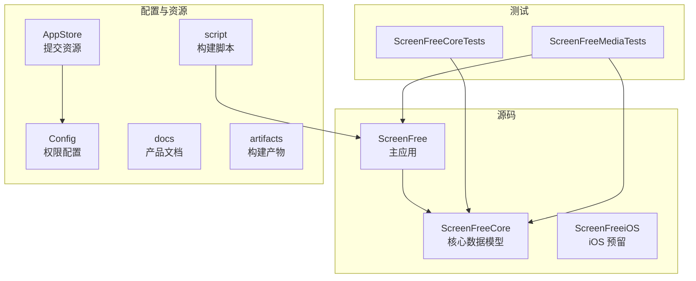
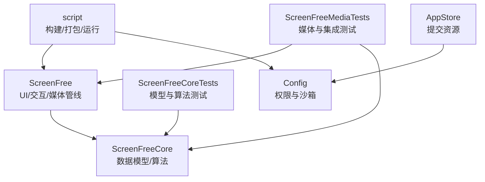
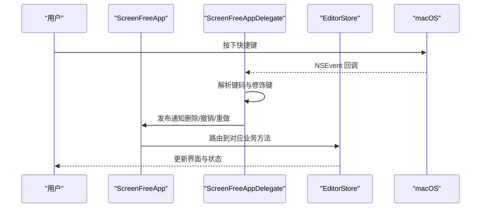
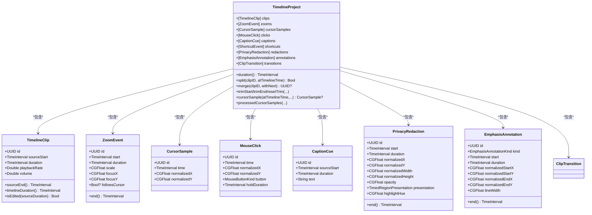
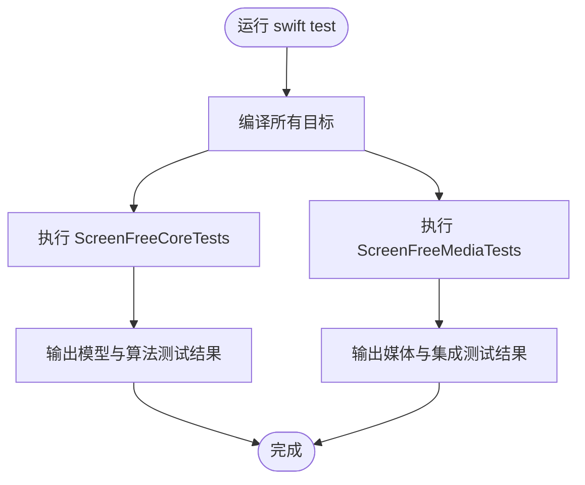
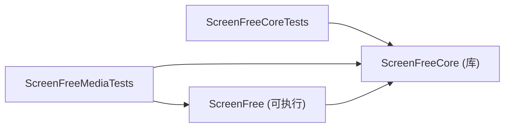

# 项目结构

<cite>
**本文引用的文件**   
- [README.md](file://README.md)
- [Package.swift](file://Package.swift)
- [ScreenFreeApp.swift](file://Sources/ScreenFree/ScreenFreeApp.swift)
- [EditorModels.swift](file://Sources/ScreenFreeCore/EditorModels.swift)
- [ClipTransition.swift](file://Sources/ScreenFreeCore/ClipTransition.swift)
- [TimelineScale.swift](file://Sources/ScreenFreeCore/TimelineScale.swift)
- [AudioAnalyzerTests.swift](file://Tests/ScreenFreeMediaTests/AudioAnalyzerTests.swift)
- [TimelineProjectTests.swift](file://Tests/ScreenFreeCoreTests/TimelineProjectTests.swift)
- [AppStore.entitlements](file://Config/AppStore.entitlements)
- [SUBMISSION_CHECKLIST.md](file://AppStore/SUBMISSION_CHECKLIST.md)
- [build_and_run.sh](file://script/build_and_run.sh)
- [build_app_store.sh](file://script/build_app_store.sh)
- [package_dmg.sh](file://script/package_dmg.sh)
- [PRODUCT_REQUIREMENTS.md](file://docs/PRODUCT_REQUIREMENTS.md)
</cite>

## 目录
1. [简介](#简介)
2. [项目结构](#项目结构)
3. [核心组件](#核心组件)
4. [架构总览](#架构总览)
5. [详细组件分析](#详细组件分析)
6. [依赖关系分析](#依赖关系分析)
7. [性能考量](#性能考量)
8. [故障排查指南](#故障排查指南)
9. [结论](#结论)
10. [附录](#附录)

## 简介
ScreenFree 是一款原生 macOS 屏幕录制与非破坏性视频编辑器，基于 SwiftUI、AppKit、ScreenCaptureKit 与 AVFoundation 实现。仓库采用 Swift Package Manager 组织多目标工程，包含主应用、核心数据模型库、iOS 预留模块、测试套件、App Store 提交资源、构建脚本与产品文档等。

本说明聚焦于顶级目录职责与 Sources 下三大模块的职责划分，解释 Tests 的测试组织方式，并说明 Config、AppStore、script 的作用，帮助新开发者快速理解项目布局与开发流程。

**章节来源**
- [README.md:1-211](file://README.md#L1-L211)

## 项目结构
仓库采用“按功能域分层 + 平台扩展预留”的组织方式：
- Sources：源代码主体，分为 ScreenFree（主应用）、ScreenFreeCore（核心数据模型）、ScreenFreeiOS（iOS 预留）三个模块。
- Tests：测试代码，按被测目标划分为 ScreenFreeCoreTests 与 ScreenFreeMediaTests。
- Config：权限与沙箱配置，如 App Store 提交的 entitlements。
- AppStore：App Store 元数据、截图、图标与提交清单等资源。
- docs：产品需求与研究文档。
- script：构建、打包与运行脚本。
- artifacts：构建产物占位目录。

**图表来源**
- [Package.swift:1-35](file://Package.swift#L1-L35)

**章节来源**
- [Package.swift:1-35](file://Package.swift#L1-L35)
- [README.md:95-123](file://README.md#L95-L123)

## 核心组件
- ScreenFree（主应用）
  - 入口与 UI：SwiftUI 应用入口、菜单命令、设置页、录制控制器、时间轴视图、导出面板等。
  - 媒体管线：音频分析、麦克风信号处理、录制引擎、相机合成、导出器、历史管理等。
  - 交互与主题：区域选择、光标艺术、样式预设、本地化、缩放动效等。
- ScreenFreeCore（核心数据模型）
  - 时间轴与剪辑：剪辑、缩放事件、光标采样、点击、快捷键事件、字幕提示、隐私遮罩、强调标注、转场等。
  - 项目模型：TimelineProject 聚合所有轨道与效果，提供裁剪、合并、重置、缩放范围归一化、时间映射等能力。
  - 工具类：时间轴缩放与播放跟随策略、转场定义等。
- ScreenFreeiOS（iOS 预留）
  - 当前为空目录，为未来 iOS 版本或共享逻辑预留位置。

**章节来源**
- [ScreenFreeApp.swift:1-230](file://Sources/ScreenFree/ScreenFreeApp.swift#L1-L230)
- [EditorModels.swift:1-800](file://Sources/ScreenFreeCore/EditorModels.swift#L1-L800)
- [ClipTransition.swift](file://Sources/ScreenFreeCore/ClipTransition.swift)
- [TimelineScale.swift](file://Sources/ScreenFreeCore/TimelineScale.swift)

## 架构总览
整体架构遵循“UI 层（ScreenFree）+ 领域模型（ScreenFreeCore）”的分层设计。主应用负责用户交互、系统 API 调用与媒体管线编排；核心库专注数据结构与算法，不依赖 UI 框架，便于在测试与不同平台复用。

**图表来源**
- [Package.swift:1-35](file://Package.swift#L1-L35)
- [build_and_run.sh:1-180](file://script/build_and_run.sh#L1-L180)
- [build_app_store.sh:1-165](file://script/build_app_store.sh#L1-L165)

## 详细组件分析

### ScreenFree（主应用）
- 应用生命周期与键盘事件
  - 通过 NSApplicationDelegate 监听全局按键，转发到通知中心供 UI 消费，支持撤销/重做、删除、退出等快捷操作。
- 命令菜单与状态管理
  - 集中定义“打开/保存项目、导入视频/音乐、风格预设、录制控制、编辑工具、导出、语言切换”等命令，统一由 EditorStore 驱动。
- 国际化与权限检查
  - 动态切换语言环境，启动时刷新权限状态，并在需要时引导用户至系统设置页面。

**图表来源**
- [ScreenFreeApp.swift:1-230](file://Sources/ScreenFree/ScreenFreeApp.swift#L1-L230)

**章节来源**
- [ScreenFreeApp.swift:1-230](file://Sources/ScreenFree/ScreenFreeApp.swift#L1-L230)

### ScreenFreeCore（核心数据模型）
- 关键数据结构
  - TimelineClip：剪辑片段，含源起始时间、时长、播放速率、音量，以及是否被编辑的判断。
  - CursorSample/MouseClick/ShortcutEvent：光标轨迹、鼠标点击、快捷键事件。
  - ZoomEvent：自动/手动缩放区间与焦点。
  - CaptionCue/PrivacyRedaction/EmphasisAnnotation：字幕、隐私遮罩、强调标注。
  - ClipTransition：剪辑间转场。
  - TimelineProject：聚合所有轨道与效果，提供时间映射、裁剪、合并、重置、缩放范围归一化、光标插值与平滑等。
- 复杂度与优化点
  - 光标处理：排序与滑动窗口去抖、速度阈值判断、三次样条插值可选，避免频繁抖动影响预览与导出一致性。
  - 时间轴缩放：内容宽度与像素-时间双向映射，支持最大缩放保证子 0.1 秒编辑精度。
  - 剪辑合并：仅当相邻且速率/音量一致时允许合并，确保无损与可逆。

**图表来源**
- [EditorModels.swift:1-800](file://Sources/ScreenFreeCore/EditorModels.swift#L1-L800)
- [ClipTransition.swift](file://Sources/ScreenFreeCore/ClipTransition.swift)

**章节来源**
- [EditorModels.swift:1-800](file://Sources/ScreenFreeCore/EditorModels.swift#L1-L800)

### ScreenFreeiOS（iOS 预留）
- 当前为空目录，用于未来 iOS 平台适配或共享逻辑抽取。

**章节来源**
- [Package.swift:1-35](file://Package.swift#L1-L35)

### Tests 测试组织
- ScreenFreeCoreTests
  - 针对核心数据模型与算法进行单元测试，覆盖时间轴缩放、播放跟随、光标尾冻结与回退、剪辑拆分/合并/重置、转场与注释范围钳制等。
- ScreenFreeMediaTests
  - 面向媒体管线与 UI 集成的测试，包括音频波形归一化、设备监控、导出选项、本地化、录制历史、快捷键捕获、缩放手势、视频导出、运动模糊等。

**图表来源**
- [Package.swift:1-35](file://Package.swift#L1-L35)
- [README.md:117-146](file://README.md#L117-L146)

**章节来源**
- [TimelineProjectTests.swift:1-200](file://Tests/ScreenFreeCoreTests/TimelineProjectTests.swift#L1-L200)
- [AudioAnalyzerTests.swift:1-64](file://Tests/ScreenFreeMediaTests/AudioAnalyzerTests.swift#L1-L64)

## 依赖关系分析
- 包结构与依赖
  - ScreenFree（可执行目标）依赖 ScreenFreeCore（库）。
  - ScreenFreeCoreTests 仅依赖 ScreenFreeCore。
  - ScreenFreeMediaTests 同时依赖 ScreenFree 与 ScreenFreeCore。
- 构建与资源
  - 主应用将 Resources 目录作为资源包处理，包含本地化字符串与隐私清单。
- 权限与沙箱
  - App Store 构建使用 Config/AppStore.entitlements 声明沙箱能力（音频输入、摄像头、影片读写、用户选文件、书签作用域等）。

**图表来源**
- [Package.swift:1-35](file://Package.swift#L1-L35)

**章节来源**
- [Package.swift:1-35](file://Package.swift#L1-L35)

## 性能考量
- 媒体渲染与导出
  - 使用 AVFoundation 进行 H.264/AAC 编码与 GIF 生成，支持进度轮询与取消清理，避免产生不完整输出。
- 时间轴缩放与交互
  - 支持最高 64× 缩放，保证长视频的精细编辑；时间-像素映射与拖拽增量计算需保持高精度。
- 光标处理
  - 可选插值与平滑，减少抖动与快速变化带来的视觉噪声；最终帧与导出保持一致的插值规则。
- 音频处理
  - 实时降噪、AGC、峰值限制仅在麦克风通道生效，系统音轨直通；波形归一化提升可视化可读性。

[本节为通用指导，无需特定文件引用]

## 故障排查指南
- 权限问题
  - 屏幕录制、麦克风、摄像头、语音识别等权限需在系统设置中开启；应用内提供 Studio Check 预检并跳转系统设置页面。
- 构建与签名
  - 开发构建使用 script/build_and_run.sh；App Store 构建需准备签名身份与描述文件，使用 script/build_app_store.sh 生成 .pkg。
- 常见问题定位
  - 使用 --debug 模式启动 lldb 调试；使用 --logs/--telemetry 查看系统日志过滤；--verify 验证进程存活。

**章节来源**
- [README.md:103-116](file://README.md#L103-L116)
- [build_and_run.sh:1-180](file://script/build_and_run.sh#L1-L180)
- [build_app_store.sh:1-165](file://script/build_app_store.sh#L1-L165)

## 结论
ScreenFree 以清晰的分层架构与完善的测试体系支撑了复杂的屏幕录制与编辑功能。ScreenFreeCore 提供稳定可靠的数据模型与算法，ScreenFree 聚焦 UI 与媒体管线编排，配合完善的构建脚本与 App Store 资源，形成从开发到发布的完整闭环。新开发者可依据本说明快速上手，按模块逐步深入。

[本节为总结，无需特定文件引用]

## 附录

### 顶级目录职责与组织原则
- Sources
  - ScreenFree：主应用，包含 UI、命令、录制、导出、本地化、主题等。
  - ScreenFreeCore：核心数据模型与算法，独立于 UI，便于测试与跨平台复用。
  - ScreenFreeiOS：iOS 预留目录，当前为空。
- Tests
  - ScreenFreeCoreTests：模型与算法单元测试。
  - ScreenFreeMediaTests：媒体管线与 UI 集成测试。
- Config
  - AppStore.entitlements：App Store 沙箱权限模板。
- AppStore
  - 元数据、截图、图标、隐私政策与提交清单等资源。
- docs
  - 产品需求与研究文档，指导功能实现与验收。
- script
  - build_and_run.sh：开发与调试构建、打包、运行、日志与验证。
  - build_app_store.sh：App Store 签名与打包流程。
  - package_dmg.sh：生成 DMG 安装包。
- artifacts
  - 构建产物占位目录。

**章节来源**
- [Package.swift:1-35](file://Package.swift#L1-L35)
- [AppStore.entitlements:1-19](file://Config/AppStore.entitlements#L1-L19)
- [SUBMISSION_CHECKLIST.md:1-49](file://AppStore/SUBMISSION_CHECKLIST.md#L1-L49)
- [build_and_run.sh:1-180](file://script/build_and_run.sh#L1-L180)
- [build_app_store.sh:1-165](file://script/build_app_store.sh#L1-L165)
- [package_dmg.sh:1-34](file://script/package_dmg.sh#L1-L34)
- [PRODUCT_REQUIREMENTS.md:1-126](file://docs/PRODUCT_REQUIREMENTS.md#L1-L126)