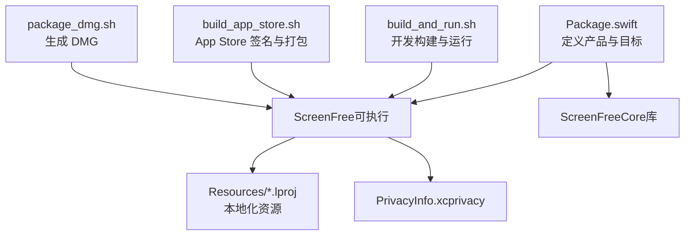
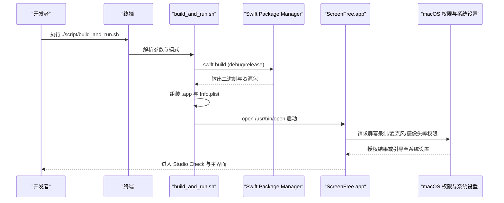
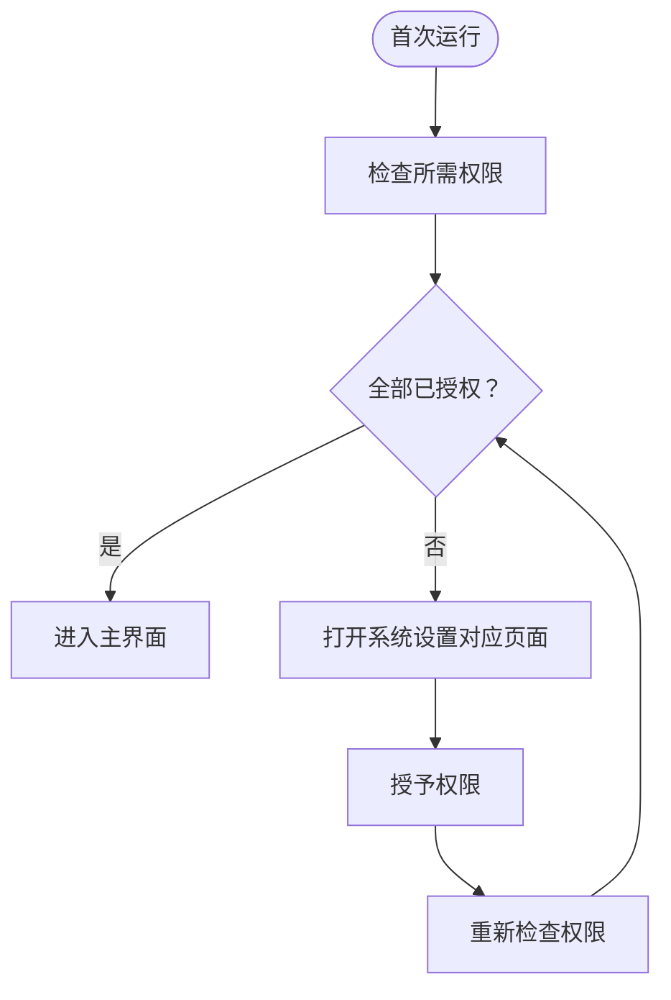
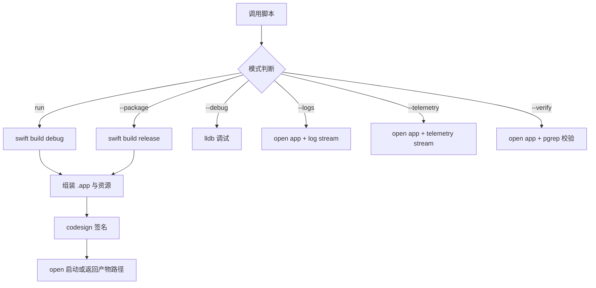
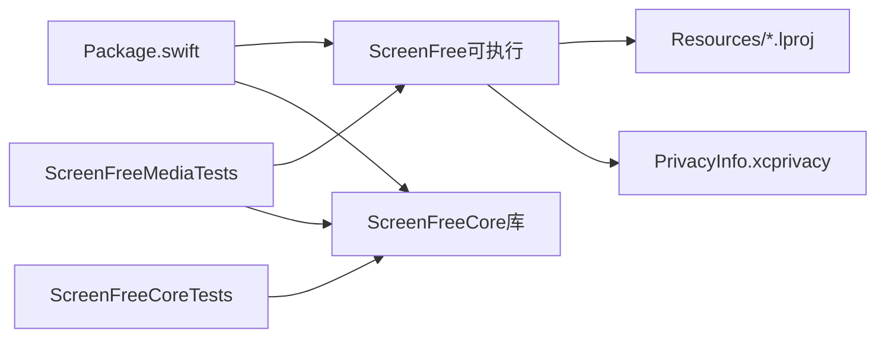

# 快速开始

<cite>
**本文引用的文件**
- [README.md](file://README.md)
- [Package.swift](file://Package.swift)
- [script/build_and_run.sh](file://script/build_and_run.sh)
- [script/build_app_store.sh](file://script/build_app_store.sh)
- [script/package_dmg.sh](file://script/package_dmg.sh)
- [Config/AppStore.entitlements](file://Config/AppStore.entitlements)
- [Sources/ScreenFree/Resources/PrivacyInfo.xcprivacy](file://Sources/ScreenFree/Resources/PrivacyInfo.xcprivacy)
- [Sources/ScreenFree/DeviceMonitor.swift](file://Sources/ScreenFree/DeviceMonitor.swift)
- [Sources/ScreenFree/EditorStore.swift](file://Sources/ScreenFree/EditorStore.swift)
</cite>

## 目录
1. [简介](#简介)
2. [项目结构](#项目结构)
3. [核心组件](#核心组件)
4. [架构总览](#架构总览)
5. [详细组件分析](#详细组件分析)
6. [依赖关系分析](#依赖关系分析)
7. [性能与兼容性注意事项](#性能与兼容性注意事项)
8. [故障排查指南](#故障排查指南)
9. [结论](#结论)
10. [附录](#附录)

## 简介
本快速开始指南面向首次接触 ScreenFree 的开发者，目标是在最短时间内完成环境搭建、权限配置、构建运行与验证。ScreenFree 是一个原生 macOS 屏幕录制与非破坏性视频编辑器，基于 SwiftUI、AppKit、ScreenCaptureKit 与 AVFoundation 实现。

## 项目结构
- 包管理与平台要求由 Swift Package Manager 管理，最低支持 macOS 14。
- 开发构建与打包通过脚本自动化：
  - 开发与运行：build_and_run.sh
  - App Store 发布构建：build_app_store.sh
  - DMG 分发打包：package_dmg.sh
- 权限与隐私声明：
  - Info.plist 用途说明在构建脚本中动态生成
  - 沙盒能力与 entitlements 模板位于 Config/AppStore.entitlements
  - 隐私清单 PrivacyInfo.xcprivacy 位于 Sources/ScreenFree/Resources

图表来源
- [Package.swift:1-35](file://Package.swift#L1-L35)
- [script/build_and_run.sh:1-180](file://script/build_and_run.sh#L1-L180)
- [script/build_app_store.sh:1-165](file://script/build_app_store.sh#L1-L165)
- [script/package_dmg.sh:1-34](file://script/package_dmg.sh#L1-L34)

章节来源
- [Package.swift:1-35](file://Package.swift#L1-L35)
- [README.md:95-123](file://README.md#L95-L123)

## 核心组件
- 包与目标
  - 可执行目标：ScreenFree
  - 库目标：ScreenFreeCore
  - 测试目标：ScreenFreeCoreTests、ScreenFreeMediaTests
- 构建产物
  - 开发应用包：dist/ScreenFree.app
  - App Store 产物：AppStore/Build/*.pkg
  - 分发 DMG：dist/ScreenFree-*.dmg

章节来源
- [Package.swift:11-32](file://Package.swift#L11-L32)
- [README.md:95-101](file://README.md#L95-L101)

## 架构总览
下图展示了从命令行到应用运行的关键流程，以及权限检查与系统设置跳转路径。

图表来源
- [script/build_and_run.sh:27-151](file://script/build_and_run.sh#L27-L151)
- [README.md:95-115](file://README.md#L95-L115)

## 详细组件分析

### 开发环境与工具链
- Xcode 与 Swift 工具链
  - 使用 Swift Package Manager 进行构建，Package.swift 指定 swift-tools-version 与最低平台 macOS 14。
  - 建议安装与系统版本匹配的 Xcode 命令行工具，确保 swift 可用。
- 必要命令
  - 构建与运行：./script/build_and_run.sh
  - 验证测试：swift test

章节来源
- [Package.swift:1-10](file://Package.swift#L1-L10)
- [README.md:95-123](file://README.md#L95-L123)

### 权限与隐私配置
- 运行时权限（首次运行会提示或在 Studio Check 中引导）
  - 屏幕与系统音频录制：用于显示/窗口捕获
  - 麦克风：启用麦克风录制或输入表计时器时需要；原生麦克风录制需 macOS 15+
  - 摄像头：选择摄像头时启用
  - 输入监控：自动点击触发缩放需要；手动缩放与光标轨迹仍可用
  - 语音识别：仅在生成字幕时请求
- 隐私清单与用途说明
  - Info.plist 中的用途说明由构建脚本注入
  - PrivacyInfo.xcprivacy 声明隐私访问 API 类别与原因
- 沙盒与 Entitlements（App Store 构建）
  - AppStore.entitlements 包含沙盒、音频输入、摄像头、影片读写、用户选择文件读写与应用范围书签等能力

图表来源
- [script/build_and_run.sh:129-137](file://script/build_and_run.sh#L129-L137)
- [Sources/ScreenFree/Resources/PrivacyInfo.xcprivacy:1-48](file://Sources/ScreenFree/Resources/PrivacyInfo.xcprivacy#L1-L48)
- [Config/AppStore.entitlements:1-19](file://Config/AppStore.entitlements#L1-L19)
- [README.md:103-115](file://README.md#L103-L115)

章节来源
- [README.md:103-115](file://README.md#L103-L115)
- [Sources/ScreenFree/DeviceMonitor.swift:102-112](file://Sources/ScreenFree/DeviceMonitor.swift#L102-L112)
- [Sources/ScreenFree/EditorStore.swift:503-534](file://Sources/ScreenFree/EditorStore.swift#L503-L534)

### 构建与运行脚本详解
- build_and_run.sh
  - 默认模式 run：以 debug 构建并打开 dist/ScreenFree.app
  - --package：以 release 构建（不自动打开）
  - --debug：用 lldb 调试二进制
  - --logs：启动应用并流式输出进程日志
  - --telemetry：启动应用并过滤子系统遥测日志
  - --verify：启动后校验进程是否存活
- build_app_store.sh
  - 需要 APP_SIGN_IDENTITY、INSTALLER_SIGN_IDENTITY、PROVISIONING_PROFILE
  - 生成签名 .pkg，并输出构建产物路径
- package_dmg.sh
  - 将 dist/ScreenFree.app 打包为带 Applications 快捷方式的 DMG

图表来源
- [script/build_and_run.sh:4-179](file://script/build_and_run.sh#L4-L179)
- [script/build_app_store.sh:25-165](file://script/build_app_store.sh#L25-L165)
- [script/package_dmg.sh:1-34](file://script/package_dmg.sh#L1-L34)

章节来源
- [script/build_and_run.sh:1-180](file://script/build_and_run.sh#L1-L180)
- [script/build_app_store.sh:1-165](file://script/build_app_store.sh#L1-L165)
- [script/package_dmg.sh:1-34](file://script/package_dmg.sh#L1-L34)

### 首次运行与权限配置指引
- 启动应用后，若缺少权限，Studio Check 会直接打开系统设置对应页面，避免静默降级。
- 常见权限项：
  - 屏幕与系统音频录制：用于捕获显示器或窗口
  - 麦克风：启用麦克风录制或输入表计时器时需要；原生麦克风录制需 macOS 15+
  - 摄像头：选择摄像头预览或录制时需要
  - 输入监控：自动点击触发缩放需要；手动缩放与光标轨迹不受影响
  - 语音识别：仅在生成字幕时请求

章节来源
- [README.md:103-115](file://README.md#L103-L115)
- [Sources/ScreenFree/DeviceMonitor.swift:102-112](file://Sources/ScreenFree/DeviceMonitor.swift#L102-L112)
- [Sources/ScreenFree/EditorStore.swift:503-534](file://Sources/ScreenFree/EditorStore.swift#L503-L534)

### 验证安装是否成功
- 快速验证
  - 运行 ./script/build_and_run.sh 后，确认 dist/ScreenFree.app 存在并可正常启动
  - 使用 --verify 模式验证进程是否存活
- 完整验证
  - 运行 swift test 执行模型与媒体管线测试套件，覆盖导出、回放、时间线缩放、快捷键、多显示器几何等场景

章节来源
- [README.md:95-123](file://README.md#L95-L123)
- [script/build_and_run.sh:170-174](file://script/build_and_run.sh#L170-L174)

## 依赖关系分析
- 包依赖
  - ScreenFree 可执行目标依赖 ScreenFreeCore 库
  - 测试目标分别依赖库与可执行目标
- 资源依赖
  - 本地化资源 *.lproj、图标、隐私清单在构建时被复制到应用包 Resources
- 外部依赖
  - 构建过程依赖 Swift 工具链与系统代码签名工具

图表来源
- [Package.swift:11-32](file://Package.swift#L11-L32)

章节来源
- [Package.swift:11-32](file://Package.swift#L11-L32)

## 性能与兼容性注意事项
- 最低系统版本
  - 包与构建脚本均声明最低 macOS 14
  - 原生麦克风录制功能需 macOS 15+，否则会在启动录制前给出明确错误提示
- 渲染与导出
  - 媒体管线通过真实 H.264/AAC 编码与 GIF 渲染进行端到端验证，保证预览与导出一致性
- 多显示器与几何
  - 测试覆盖多显示器布局下的 Quartz-to-AppKit 坐标映射

章节来源
- [Package.swift:8-10](file://Package.swift#L8-L10)
- [script/build_and_run.sh:121-122](file://script/build_and_run.sh#L121-L122)
- [Sources/ScreenFree/EditorStore.swift:513-516](file://Sources/ScreenFree/EditorStore.swift#L513-L516)
- [README.md:117-146](file://README.md#L117-L146)

## 故障排查指南
- 无法启动或找不到应用
  - 确认已执行 ./script/build_and_run.sh，产物位于 dist/ScreenFree.app
  - 使用 --verify 模式检查进程是否存在
- 权限相关报错
  - 通过 Studio Check 打开系统设置对应页面，逐项授予“屏幕录制”“麦克风”“摄像头”“输入监控”“语音识别”
  - 注意：原生麦克风录制需 macOS 15+
- 构建失败
  - 确保 swift 可用且版本匹配；必要时重装 Xcode 命令行工具
  - App Store 构建需正确设置签名身份与描述文件
- 日志与诊断
  - 使用 --logs 查看进程日志
  - 使用 --telemetry 查看子系统遥测日志
  - 使用 --debug 进入 lldb 调试

章节来源
- [script/build_and_run.sh:159-174](file://script/build_and_run.sh#L159-L174)
- [README.md:103-115](file://README.md#L103-L115)
- [script/build_app_store.sh:25-49](file://script/build_app_store.sh#L25-L49)

## 结论
通过以上步骤，你可以在最短时间内完成 ScreenFree 的开发环境搭建、权限配置与运行验证。建议在首次运行后使用 Studio Check 完成权限自检，并通过 swift test 验证媒体管线与核心功能。遇到权限或构建问题时，优先参考本指南的故障排查部分。

## 附录
- 常用命令速查
  - 开发与运行：./script/build_and_run.sh
  - 打包 Release：./script/build_and_run.sh --package
  - 调试：./script/build_and_run.sh --debug
  - 查看日志：./script/build_and_run.sh --logs
  - 遥测日志：./script/build_and_run.sh --telemetry
  - 进程验证：./script/build_and_run.sh --verify
  - 生成 DMG：./script/package_dmg.sh
  - 运行测试：swift test
- 权限清单
  - 屏幕与系统音频录制、麦克风、摄像头、输入监控、语音识别
- 最低系统要求
  - macOS 14（基础功能），macOS 15（原生麦克风录制）