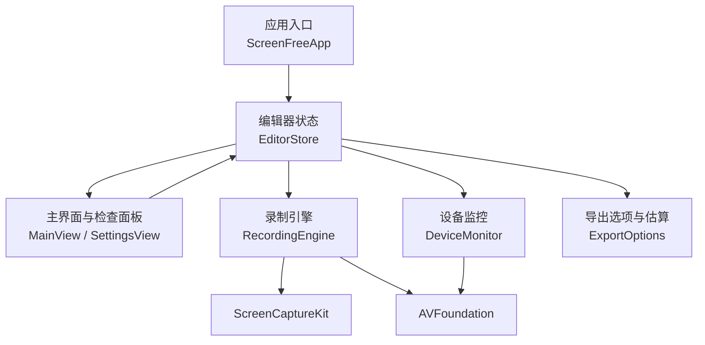
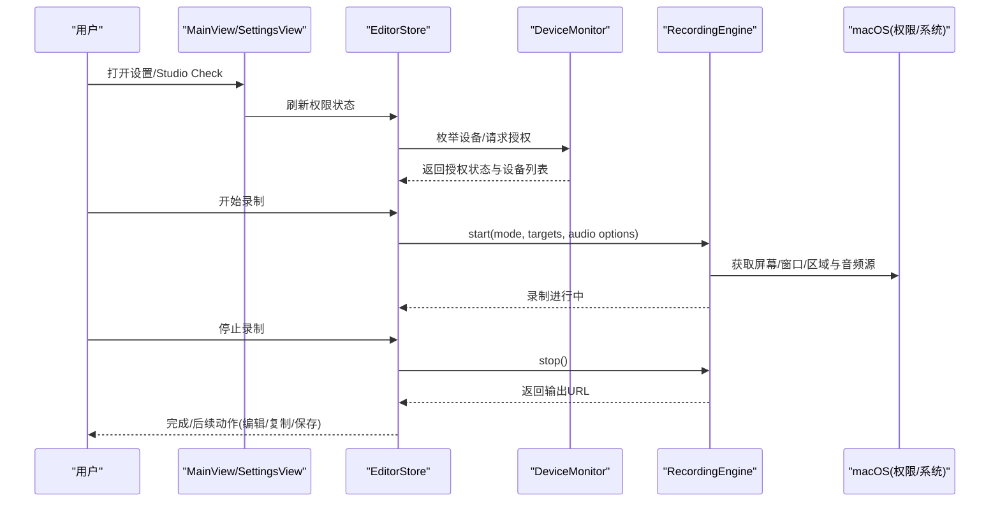
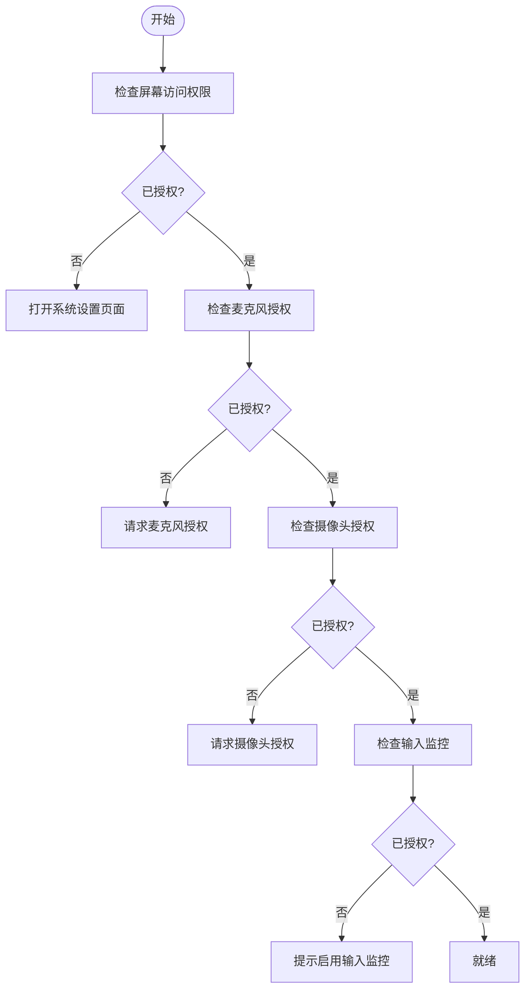
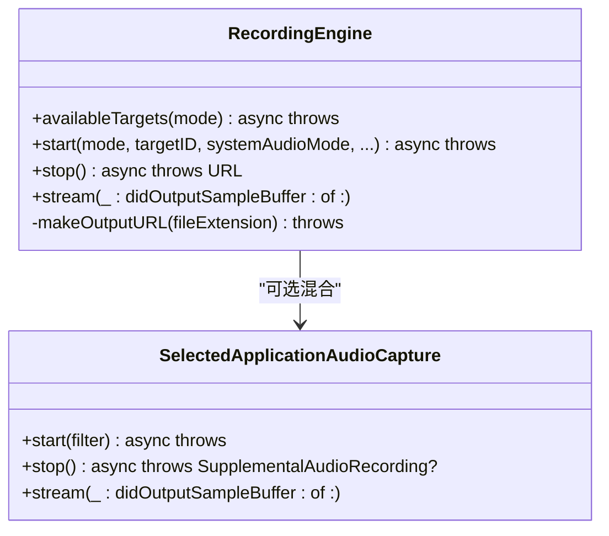
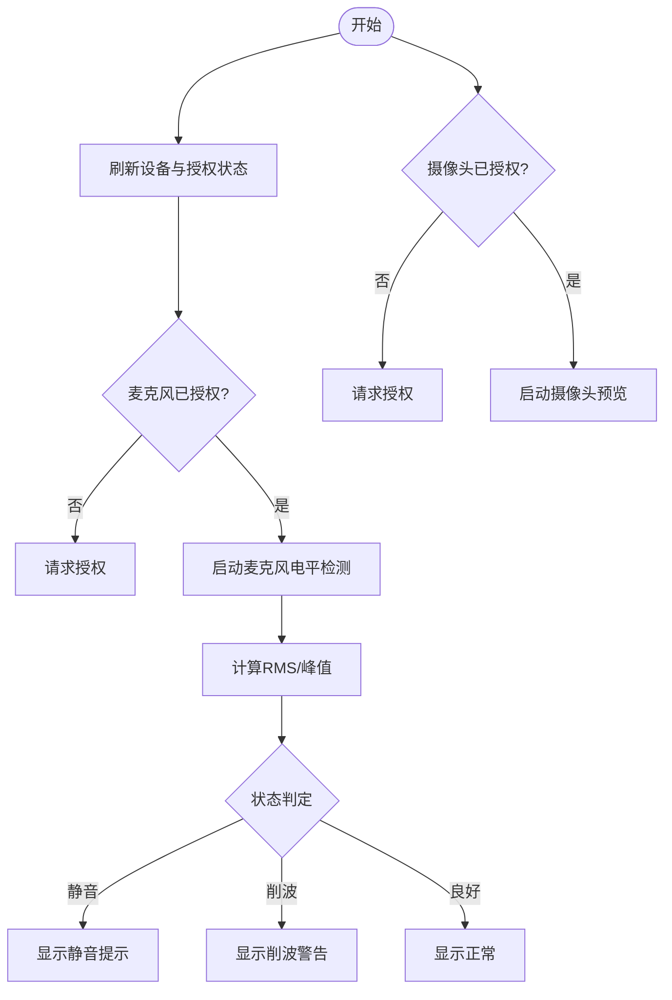
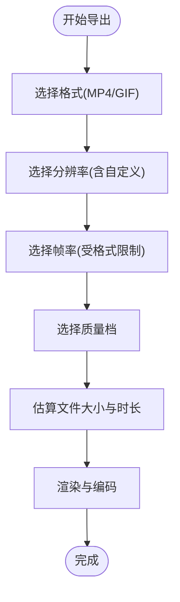
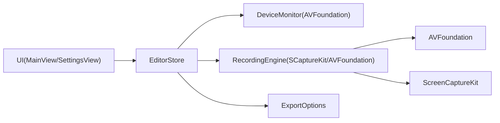

# 故障排除

<cite>
**本文引用的文件**   
- [README.md](file://README.md)
- [ScreenFreeApp.swift](file://Sources/ScreenFree/ScreenFreeApp.swift)
- [RecordingEngine.swift](file://Sources/ScreenFree/RecordingEngine.swift)
- [DeviceMonitor.swift](file://Sources/ScreenFree/DeviceMonitor.swift)
- [ExportOptions.swift](file://Sources/ScreenFree/ExportOptions.swift)
- [MainView.swift](file://Sources/ScreenFree/MainView.swift)
- [SettingsView.swift](file://Sources/ScreenFree/SettingsView.swift)
- [EditorStore.swift](file://Sources/ScreenFree/EditorStore.swift)
- [build_and_run.sh](file://script/build_and_run.sh)
- [PRODUCT_REQUIREMENTS.md](file://docs/PRODUCT_REQUIREMENTS.md)
</cite>

## 目录
1. [简介](#简介)
2. [项目结构](#项目结构)
3. [核心组件](#核心组件)
4. [架构总览](#架构总览)
5. [详细组件分析](#详细组件分析)
6. [依赖关系分析](#依赖关系分析)
7. [性能注意事项](#性能注意事项)
8. [故障排除指南](#故障排除指南)
9. [结论](#结论)
10. [附录](#附录)

## 简介
本指南面向 ScreenFree 用户与技术支持人员，聚焦于权限问题、性能问题、兼容性问题以及诊断与修复方法。内容涵盖：
- 使用 Studio Check 进行系统能力验证
- 权限配置问题的诊断与修复
- 日志收集与崩溃报告分析方法
- 已知限制与变通方案（如特定硬件、第三方软件冲突）
- 性能优化建议与最佳实践
- 社区支持与问题反馈渠道

## 项目结构
ScreenFree 为原生 macOS 应用，采用 SwiftUI/AppKit 构建 UI，基于 ScreenCaptureKit 与 AVFoundation 实现录制与导出。关键模块包括：
- 应用入口与全局快捷键处理
- 录制引擎（屏幕/窗口/区域、系统音频、麦克风、摄像头）
- 设备监控（麦克风/摄像头授权与信号检测）
- 导出选项与估算（分辨率、帧率、质量、格式）
- 设置界面与权限状态展示
- Studio Check 预检面板

**图表来源** 
- [ScreenFreeApp.swift:1-230](file://Sources/ScreenFree/ScreenFreeApp.swift#L1-L230)
- [MainView.swift:2019-2131](file://Sources/ScreenFree/MainView.swift#L2019-L2131)
- [SettingsView.swift:1-63](file://Sources/ScreenFree/SettingsView.swift#L1-L63)
- [RecordingEngine.swift:1-691](file://Sources/ScreenFree/RecordingEngine.swift#L1-L691)
- [DeviceMonitor.swift:1-361](file://Sources/ScreenFree/DeviceMonitor.swift#L1-L361)
- [ExportOptions.swift:1-362](file://Sources/ScreenFree/ExportOptions.swift#L1-L362)

**章节来源**
- [README.md:1-211](file://README.md#L1-L211)

## 核心组件
- 录制引擎 RecordingEngine：负责屏幕/窗口/区域捕获、系统音频与麦克风采集、AVAssetWriter 写入、暂停/恢复与最终化。
- 设备监控 DeviceMonitor：枚举麦克风/摄像头、请求授权、实时音量/峰值检测、摄像头预览与录制。
- 导出选项 ExportOptions：定义导出格式、分辨率、帧率、质量档位、文件大小与处理时长估算。
- 设置与检查 SettingsView / MainView：展示权限状态、提供 Studio Check 面板，引导开启缺失权限。
- 应用入口 ScreenFreeApp：初始化应用、监听通知、绑定命令菜单与语言切换。

**章节来源**
- [RecordingEngine.swift:1-691](file://Sources/ScreenFree/RecordingEngine.swift#L1-L691)
- [DeviceMonitor.swift:1-361](file://Sources/ScreenFree/DeviceMonitor.swift#L1-L361)
- [ExportOptions.swift:1-362](file://Sources/ScreenFree/ExportOptions.swift#L1-L362)
- [SettingsView.swift:1-63](file://Sources/ScreenFree/SettingsView.swift#L1-L63)
- [MainView.swift:2019-2131](file://Sources/ScreenFree/MainView.swift#L2019-L2131)
- [ScreenFreeApp.swift:1-230](file://Sources/ScreenFree/ScreenFreeApp.swift#L1-L230)

## 架构总览
ScreenFree 的运行时交互流程如下：
- 用户在设置或 Studio Check 中确认权限与设备可用性
- 启动录制时，EditorStore 协调权限校验、设备准备与录制引擎启动
- 录制过程中，SCStream 输出视频与音频样本，经 AVAssetWriter 写入 MP4/M4A
- 停止录制后，可选混合独立系统音频轨道并合并时间戳对齐
- 导出阶段，根据选择的质量与分辨率生成目标文件，支持进度与取消

**图表来源** 
- [MainView.swift:2019-2131](file://Sources/ScreenFree/MainView.swift#L2019-L2131)
- [SettingsView.swift:1-63](file://Sources/ScreenFree/SettingsView.swift#L1-L63)
- [EditorStore.swift:533-561](file://Sources/ScreenFree/EditorStore.swift#L533-L561)
- [RecordingEngine.swift:174-392](file://Sources/ScreenFree/RecordingEngine.swift#L174-L392)

## 详细组件分析

### 权限与授权管理
- 屏幕与系统音频录制：需要“屏幕与系统音频录制”权限；用于显示/窗口捕获。
- 麦克风：仅在启用麦克风录制或输入表时请求；原生麦克风录制需 macOS 15+。
- 摄像头：仅在选中摄像头时请求。
- 输入监控：自动点击触发缩放需要；手动缩放与可编辑光标路径无需此权限。
- 语音识别：仅在生成字幕时请求。

权限状态在设置界面与 Studio Check 中展示，并提供一键跳转系统设置的入口。

**图表来源** 
- [README.md:103-116](file://README.md#L103-L116)
- [SettingsView.swift:26-62](file://Sources/ScreenFree/SettingsView.swift#L26-L62)
- [MainView.swift:2019-2131](file://Sources/ScreenFree/MainView.swift#L2019-L2131)

**章节来源**
- [README.md:103-116](file://README.md#L103-L116)
- [SettingsView.swift:26-62](file://Sources/ScreenFree/SettingsView.swift#L26-L62)
- [MainView.swift:2019-2131](file://Sources/ScreenFree/MainView.swift#L2019-L2131)

### 录制引擎与错误处理
- 录制模式：显示、窗口、区域；支持系统音频（全部/选定应用/关闭）与麦克风。
- 写入器：AVAssetWriter 负责 H.264/AAC 编码；失败时抛出明确错误类型。
- 流回调：按输出类型（屏幕/音频/麦克风）分发样本缓冲，确保首帧时间与顺序正确。
- 停止流程：标记输入结束、等待 writer.finishWriting，必要时混合补充音频轨道。

常见错误与定位：
- 无可用源：检查目标显示/窗口是否存在且可见。
- 无音频应用：选定应用模式下至少选择一个应用。
- 无法启动写入器：检查磁盘空间与编码器设置。
- 无法完成写入：检查 writer.status 与错误信息。

**图表来源** 
- [RecordingEngine.swift:85-392](file://Sources/ScreenFree/RecordingEngine.swift#L85-L392)
- [RecordingEngine.swift:533-674](file://Sources/ScreenFree/RecordingEngine.swift#L533-L674)

**章节来源**
- [RecordingEngine.swift:40-61](file://Sources/ScreenFree/RecordingEngine.swift#L40-L61)
- [RecordingEngine.swift:174-392](file://Sources/ScreenFree/RecordingEngine.swift#L174-L392)
- [RecordingEngine.swift:394-443](file://Sources/ScreenFree/RecordingEngine.swift#L394-L443)

### 设备监控与信号检测
- 麦克风：枚举设备、请求授权、安装 tap 计算 RMS/峰值，判断静音/削波/良好。
- 摄像头：枚举设备、请求授权、创建 AVCaptureSession 预览与录制。
- 错误提示：当未授权或设备不可用时，设置 deviceError 并在 UI 展示。

**图表来源** 
- [DeviceMonitor.swift:69-100](file://Sources/ScreenFree/DeviceMonitor.swift#L69-L100)
- [DeviceMonitor.swift:114-186](file://Sources/ScreenFree/DeviceMonitor.swift#L114-L186)
- [DeviceMonitor.swift:188-250](file://Sources/ScreenFree/DeviceMonitor.swift#L188-L250)

**章节来源**
- [DeviceMonitor.swift:25-41](file://Sources/ScreenFree/DeviceMonitor.swift#L25-L41)
- [DeviceMonitor.swift:114-186](file://Sources/ScreenFree/DeviceMonitor.swift#L114-L186)

### 导出选项与性能估算
- 格式：MP4（H.264/AAC）、GIF（循环动画）。
- 分辨率：Source/4K/1080p/720p/自定义（偶数像素，范围 320–7680）。
- 帧率：MP4 支持 24/25/30/50/60；GIF 支持 10/15/20。
- 质量：Studio/Social/Web/Web(Low)，影响比特率与压缩参数。
- 估算：基于像素数、帧率、格式因子估算文件大小与处理时长。

**图表来源** 
- [ExportOptions.swift:5-19](file://Sources/ScreenFree/ExportOptions.swift#L5-L19)
- [ExportOptions.swift:103-182](file://Sources/ScreenFree/ExportOptions.swift#L103-L182)
- [ExportOptions.swift:205-291](file://Sources/ScreenFree/ExportOptions.swift#L205-L291)
- [ExportOptions.swift:298-361](file://Sources/ScreenFree/ExportOptions.swift#L298-L361)

**章节来源**
- [ExportOptions.swift:1-362](file://Sources/ScreenFree/ExportOptions.swift#L1-L362)

### Studio Check 预检面板
- 检查项：屏幕访问、输入监控、存储容量、麦克风授权与信号、摄像头检测与授权。
- 交互：对缺失权限直接提示“启用”，并跳转系统设置页面。
- 结果：绿色表示就绪，橙色表示需要操作。

**章节来源**
- [MainView.swift:2019-2131](file://Sources/ScreenFree/MainView.swift#L2019-L2131)
- [README.md:92-94](file://README.md#L92-L94)

## 依赖关系分析
- UI 层依赖 EditorStore 的状态与行为，EditorStore 协调 DeviceMonitor、RecordingEngine、ExportOptions。
- RecordingEngine 依赖 ScreenCaptureKit 与 AVFoundation 进行媒体采集与写入。
- DeviceMonitor 依赖 AVFoundation 进行设备枚举与授权。
- ExportOptions 提供导出参数与估算逻辑，供 UI 与导出流程使用。

**图表来源** 
- [ScreenFreeApp.swift:1-230](file://Sources/ScreenFree/ScreenFreeApp.swift#L1-L230)
- [MainView.swift:2019-2131](file://Sources/ScreenFree/MainView.swift#L2019-L2131)
- [SettingsView.swift:1-63](file://Sources/ScreenFree/SettingsView.swift#L1-L63)
- [RecordingEngine.swift:1-691](file://Sources/ScreenFree/RecordingEngine.swift#L1-L691)
- [DeviceMonitor.swift:1-361](file://Sources/ScreenFree/DeviceMonitor.swift#L1-L361)
- [ExportOptions.swift:1-362](file://Sources/ScreenFree/ExportOptions.swift#L1-L362)

**章节来源**
- [README.md:1-211](file://README.md#L1-L211)

## 性能注意事项
- 录制卡顿排查：
  - 检查磁盘空间是否充足（Studio Check 会显示剩余 GB）。
  - 降低导出分辨率或帧率，选择合适质量档。
  - 避免同时运行高负载任务（如大型渲染、虚拟机）。
- 导出缓慢优化：
  - 使用合适的质量档（Web/Social）以减小体积与处理时间。
  - 避免过高的自定义分辨率（接近上限会增加处理压力）。
  - 合理选择帧率（30fps 通常平衡质量与速度）。
- 音频处理：
  - 麦克风降噪与音量归一化会增加处理开销，可在不需要时关闭。
  - 系统音频与麦克风分离处理，确保独立增益映射。

[本节为通用指导，不直接分析具体文件]

## 故障排除指南

### 常见问题与解决方案

#### 权限问题
- 屏幕录制被拒绝：
  - 现象：无法选择显示/窗口，或录制立即失败。
  - 解决：在“系统设置 > 隐私与安全 > 屏幕录制”中授予 ScreenFree 权限；或在 Studio Check 中点击“启用”。
- 麦克风访问被拒绝：
  - 现象：麦克风测试无信号，或录制时无麦克风音轨。
  - 解决：在“系统设置 > 隐私与安全 > 麦克风”中授予权限；或在 Studio Check 中点击“启用”。
- 摄像头访问被拒绝：
  - 现象：摄像头预览无法显示，或画中画录制失败。
  - 解决：在“系统设置 > 隐私与安全 > 摄像头”中授予权限；或在 Studio Check 中点击“启用”。
- 输入监控未启用：
  - 现象：自动点击缩放无效，但手动缩放与光标路径仍可用。
  - 解决：在“系统设置 > 隐私与安全 > 输入监控”中授予权限；或在 Studio Check 中点击“启用”。

**章节来源**
- [README.md:103-116](file://README.md#L103-L116)
- [MainView.swift:2019-2131](file://Sources/ScreenFree/MainView.swift#L2019-L2131)
- [SettingsView.swift:26-62](file://Sources/ScreenFree/SettingsView.swift#L26-L62)

#### 性能问题
- 录制卡顿：
  - 检查磁盘空间（Studio Check 显示剩余 GB），确保大于 2GB。
  - 降低录制分辨率或帧率，避免 4K/60fps 在高负载下卡顿。
  - 关闭不必要的后台应用（尤其是 GPU/CPU 密集型）。
- 导出缓慢：
  - 选择较低质量档（Web/Social）以减少编码压力。
  - 避免超大自定义分辨率（接近 7680px 上限）。
  - 分段落导出或使用更短的时间线。

**章节来源**
- [MainView.swift:2019-2131](file://Sources/ScreenFree/MainView.swift#L2019-L2131)
- [ExportOptions.swift:298-361](file://Sources/ScreenFree/ExportOptions.swift#L298-L361)

#### 兼容性问题
- macOS 版本差异：
  - 原生麦克风录制需 macOS 15+；在 macOS 14 上仍可录制系统音频与屏幕，但麦克风功能不可用。
  - 其他功能（编辑器、系统音频录制）在 macOS 14 上正常运行。
- 多显示器几何：
  - 主屏、相邻更高副屏、垂直排列副屏的 Quartz-to-AppKit 坐标转换已在测试中覆盖；如遇异常，尝试重启应用或重新选择目标显示。

**章节来源**
- [README.md:103-116](file://README.md#L103-L116)
- [PRODUCT_REQUIREMENTS.md:7-26](file://docs/PRODUCT_REQUIREMENTS.md#L7-L26)

### 使用 Studio Check 进行系统能力验证
- 打开 Studio Check 面板，逐项检查：
  - 屏幕访问：若显示“需要权限”，点击“启用”跳转系统设置。
  - 输入监控：若未启用，点击“启用”跳转系统设置。
  - 存储：剩余空间小于 2GB 时提示不足。
  - 麦克风：授权状态与实时信号（静音/削波/良好）。
  - 摄像头：检测数量与授权状态。
- 所有检查通过后，再开始录制或导出。

**章节来源**
- [MainView.swift:2019-2131](file://Sources/ScreenFree/MainView.swift#L2019-L2131)
- [README.md:92-94](file://README.md#L92-L94)

### 日志收集与诊断方法
- 系统日志：
  - 使用脚本快速查看应用日志：`./script/build_and_run.sh --logs`
  - 或使用 `log stream` 过滤进程名或子系统。
- 应用内调试输出：
  - 通过 Studio Check 面板观察权限与设备状态。
  - 在设置界面点击“刷新来源”更新设备列表。
- 崩溃报告分析：
  - 查看控制台中的崩溃堆栈，关注 AVAssetWriter 状态与错误信息。
  - 录制失败时，检查 writer.status 与错误描述。

**章节来源**
- [build_and_run.sh:141-179](file://script/build_and_run.sh#L141-L179)
- [RecordingEngine.swift:394-443](file://Sources/ScreenFree/RecordingEngine.swift#L394-L443)

### 已知限制与变通方案
- 第三方软件冲突：
  - 某些安全软件可能拦截屏幕录制或输入监控，尝试临时禁用或添加白名单。
- 特定硬件兼容性：
  - 多显示器布局复杂时，可能出现坐标偏移，重启应用或重新选择目标显示。
- 沙盒限制（App Store 版本）：
  - 全局点击与快捷键监控在沙盒中可能受限，需采用可审核替代实现或明确降级。

**章节来源**
- [AppStore/SUBMISSION_CHECKLIST.md:1-28](file://AppStore/SUBMISSION_CHECKLIST.md#L1-L28)
- [PRODUCT_REQUIREMENTS.md:7-26](file://docs/PRODUCT_REQUIREMENTS.md#L7-L26)

### 性能优化建议与最佳实践
- 录制前：
  - 关闭不必要的应用，释放 CPU/GPU 资源。
  - 确保磁盘空间充足（>2GB）。
  - 选择合适的分辨率与帧率（1080p/30fps 为平衡点）。
- 录制中：
  - 避免频繁切换窗口或全屏应用。
  - 如需麦克风增强，谨慎开启降噪与音量归一化。
- 导出时：
  - 根据用途选择质量档（社交分享选 Social/Web，存档选 Studio）。
  - 避免超大自定义分辨率，优先使用预设分辨率。

[本节为通用指导，不直接分析具体文件]

### 社区支持与问题反馈渠道
- 文档与需求：
  - 产品需求与 Screen Studio 研究文档位于 docs/ 目录。
- 测试与验证：
  - 运行 `swift test` 执行 67 项模型与媒体管道测试。
- 构建与运行：
  - 使用 `./script/build_and_run.sh` 构建开发包，或通过 App Store 提交清单进行分发。

**章节来源**
- [README.md:117-141](file://README.md#L117-L141)
- [PRODUCT_REQUIREMENTS.md:72-126](file://docs/PRODUCT_REQUIREMENTS.md#L72-L126)

## 结论
ScreenFree 提供了完善的权限管理、设备监控、录制与导出能力。通过 Studio Check 预检、系统日志收集与错误定位，用户可以高效解决权限、性能与兼容性问题。遵循最佳实践与优化建议，可获得稳定流畅的使用体验。遇到问题时，参考本文档的故障排除步骤与社区资源，快速定位并解决问题。

## 附录
- 常用命令：
  - 构建与运行：`./script/build_and_run.sh`
  - 查看日志：`./script/build_and_run.sh --logs`
  - 运行测试：`swift test`
- 权限路径：
  - 屏幕录制：系统设置 > 隐私与安全 > 屏幕录制
  - 麦克风：系统设置 > 隐私与安全 > 麦克风
  - 摄像头：系统设置 > 隐私与安全 > 摄像头
  - 输入监控：系统设置 > 隐私与安全 > 输入监控

[本节为通用指导，不直接分析具体文件]