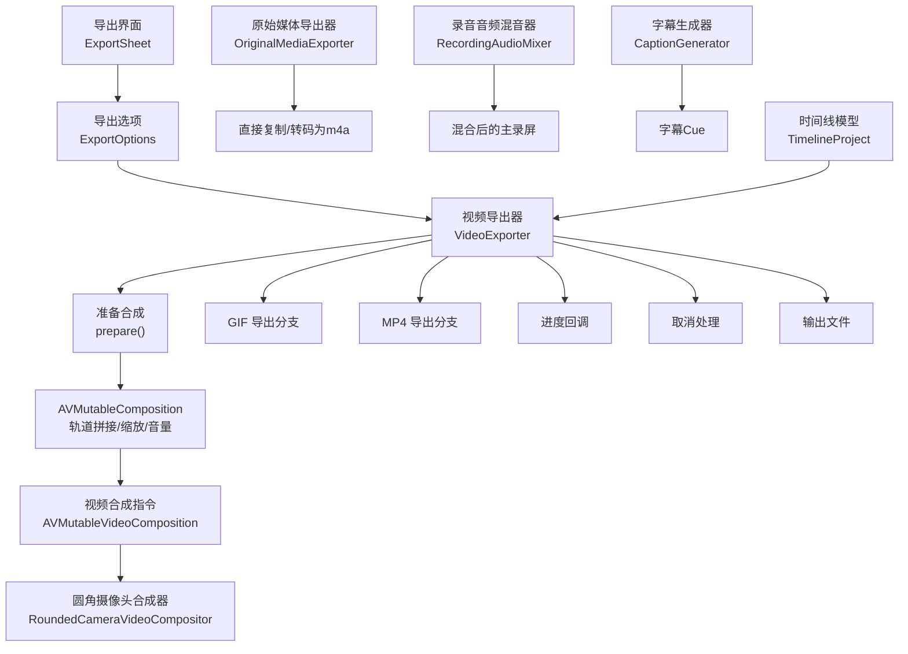
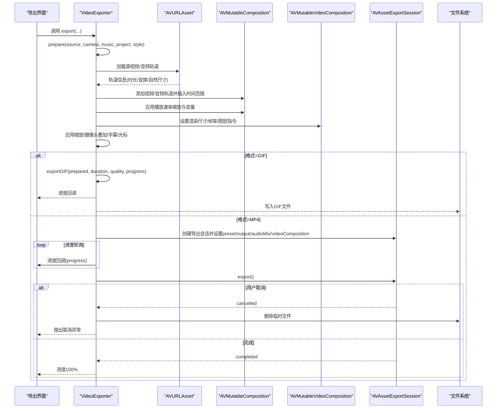
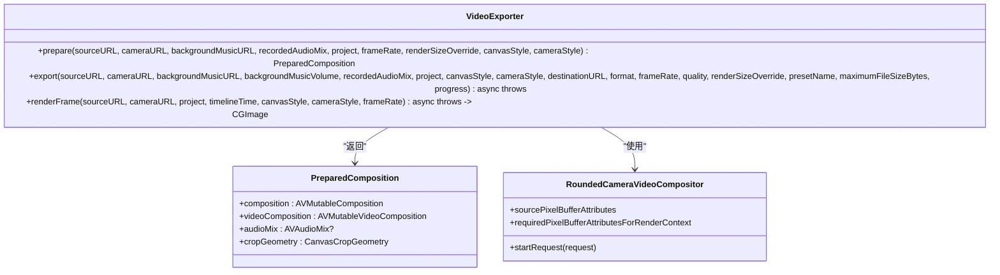
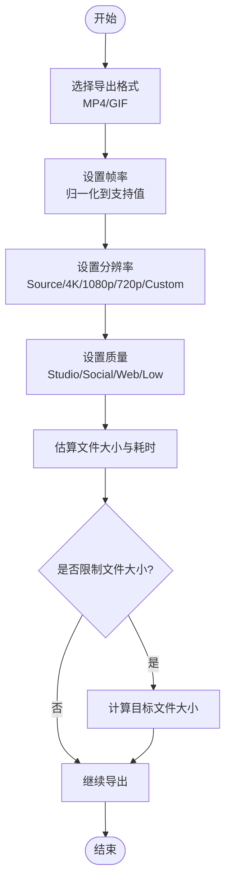
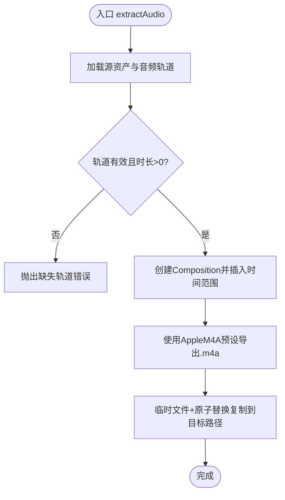
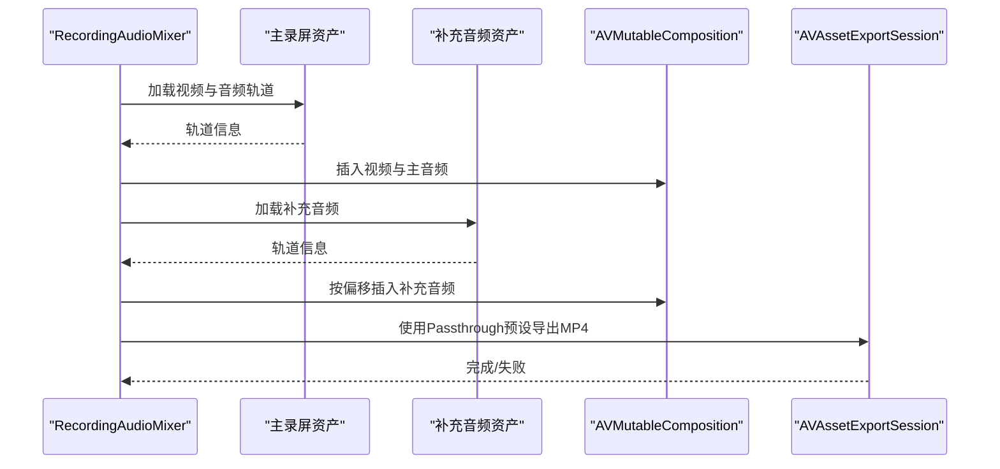
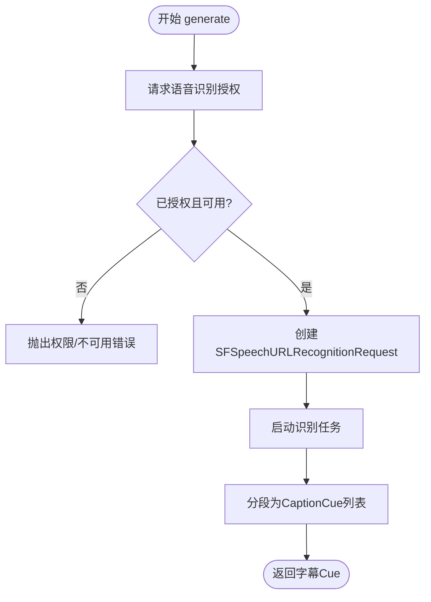
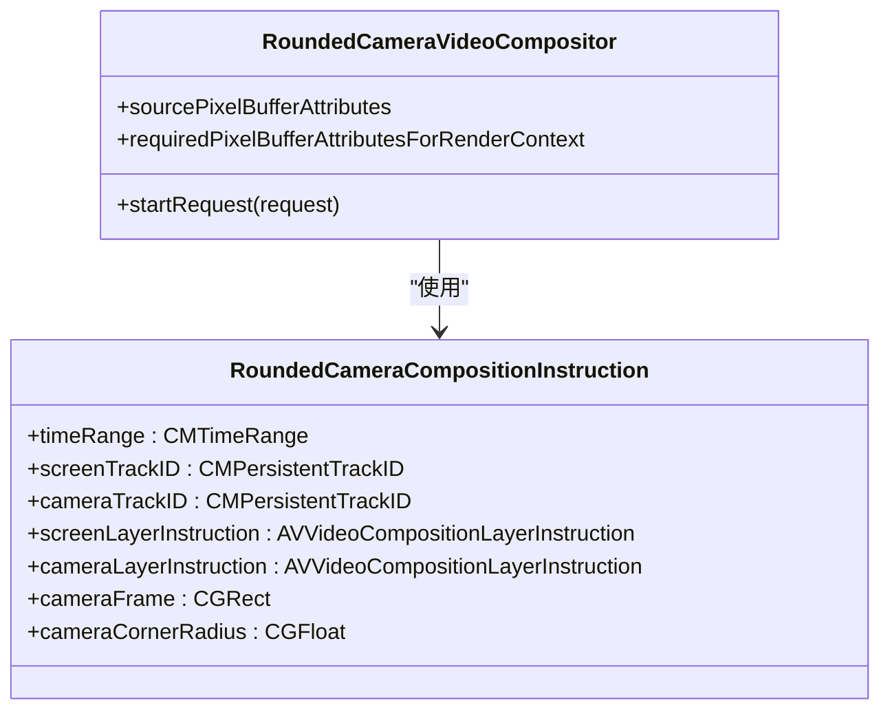
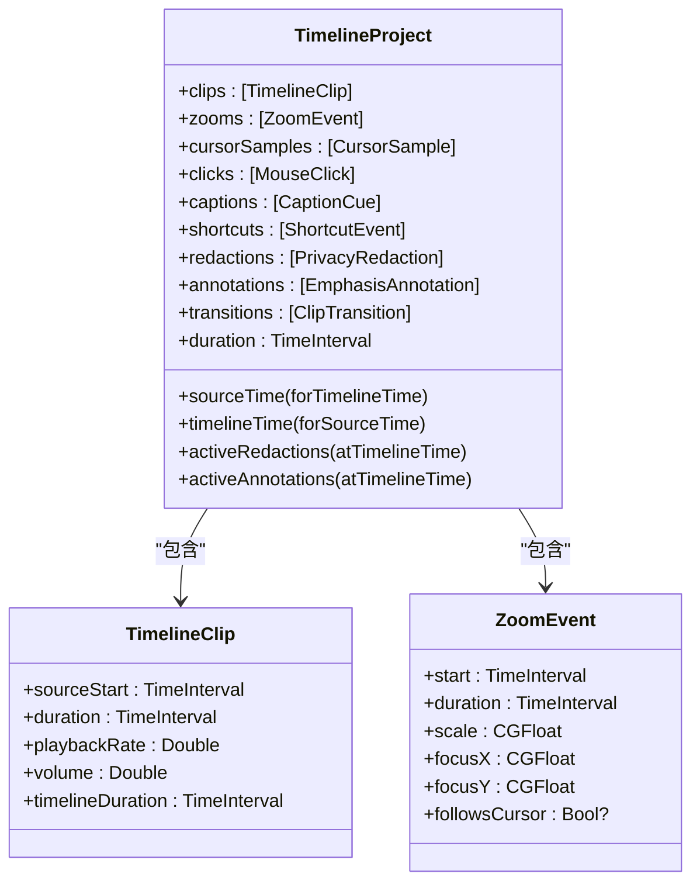
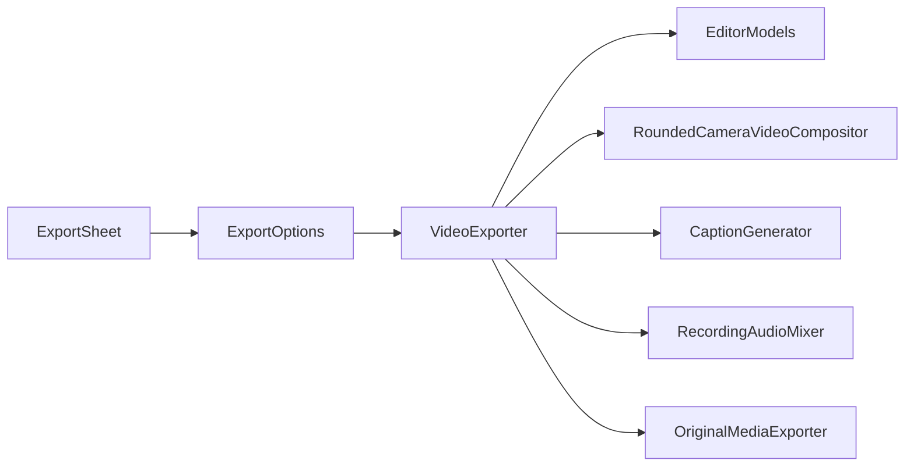

# 导出数据流

<cite>
**本文引用的文件**   
- [VideoExporter.swift](file://Sources/ScreenFree/VideoExporter.swift)
- [ExportOptions.swift](file://Sources/ScreenFree/ExportOptions.swift)
- [OriginalMediaExporter.swift](file://Sources/ScreenFree/OriginalMediaExporter.swift)
- [RecordingAudioMixer.swift](file://Sources/ScreenFree/RecordingAudioMixer.swift)
- [CaptionGenerator.swift](file://Sources/ScreenFree/CaptionGenerator.swift)
- [RoundedCameraVideoCompositor.swift](file://Sources/ScreenFree/RoundedCameraVideoCompositor.swift)
- [EditorModels.swift](file://Sources/ScreenFreeCore/EditorModels.swift)
- [ExportSheet.swift](file://Sources/ScreenFree/ExportSheet.swift)
</cite>

## 目录
1. [简介](#简介)
2. [项目结构](#项目结构)
3. [核心组件](#核心组件)
4. [架构总览](#架构总览)
5. [详细组件分析](#详细组件分析)
6. [依赖关系分析](#依赖关系分析)
7. [性能考量](#性能考量)
8. [故障排查指南](#故障排查指南)
9. [结论](#结论)
10. [附录](#附录)

## 简介
本文件系统化梳理 ScreenFree 的“导出数据流”，从项目数据（时间线、剪辑、字幕、鼠标轨迹等）到最终媒体文件的完整转换流程。重点说明：
- VideoExporter 如何构建可编辑时间线、合成视频与音频、渲染帧，并输出 MP4/GIF；
- ExportOptions 如何配置导出格式、分辨率、帧率、质量与预估；
- OriginalMediaExporter 如何直接复制原始录制文件以实现零编码的性能优化；
- 导出过程中的进度反馈、错误处理与取消机制；
- 通过数据流图展示导出管道的各阶段与数据转换过程。

## 项目结构
导出相关代码主要分布在 ScreenFree 模块中，核心由以下文件组成：
- 导出编排与渲染：VideoExporter.swift
- 导出参数与估算：ExportOptions.swift
- 原始媒体直通导出：OriginalMediaExporter.swift
- 音频混合：RecordingAudioMixer.swift
- 字幕生成：CaptionGenerator.swift
- 圆角摄像头叠加合成：RoundedCameraVideoCompositor.swift
- 时间线与事件模型：EditorModels.swift
- 导出界面与交互：ExportSheet.swift

图表来源
- [ExportSheet.swift:1-395](file://Sources/ScreenFree/ExportSheet.swift#L1-L395)
- [ExportOptions.swift:1-362](file://Sources/ScreenFree/ExportOptions.swift#L1-L362)
- [VideoExporter.swift:103-590](file://Sources/ScreenFree/VideoExporter.swift#L103-L590)
- [RoundedCameraVideoCompositor.swift:1-178](file://Sources/ScreenFree/RoundedCameraVideoCompositor.swift#L1-L178)
- [OriginalMediaExporter.swift:1-82](file://Sources/ScreenFree/OriginalMediaExporter.swift#L1-L82)
- [RecordingAudioMixer.swift:1-136](file://Sources/ScreenFree/RecordingAudioMixer.swift#L1-L136)
- [CaptionGenerator.swift:1-140](file://Sources/ScreenFree/CaptionGenerator.swift#L1-L140)
- [EditorModels.swift:274-306](file://Sources/ScreenFreeCore/EditorModels.swift#L274-L306)

章节来源
- [ExportSheet.swift:1-395](file://Sources/ScreenFree/ExportSheet.swift#L1-L395)
- [ExportOptions.swift:1-362](file://Sources/ScreenFree/ExportOptions.swift#L1-L362)
- [VideoExporter.swift:103-590](file://Sources/ScreenFree/VideoExporter.swift#L103-L590)
- [OriginalMediaExporter.swift:1-82](file://Sources/ScreenFree/OriginalMediaExporter.swift#L1-L82)
- [RecordingAudioMixer.swift:1-136](file://Sources/ScreenFree/RecordingAudioMixer.swift#L1-L136)
- [CaptionGenerator.swift:1-140](file://Sources/ScreenFree/CaptionGenerator.swift#L1-L140)
- [EditorModels.swift:274-306](file://Sources/ScreenFreeCore/EditorModels.swift#L274-L306)

## 核心组件
- VideoExporter：负责将 TimelineProject 转换为 AVMutableComposition/AVMutableVideoComposition，设置帧率、缩放、图层指令、音频混合，并执行 MP4/GIF 导出或单帧渲染。
- ExportOptions：定义导出格式、分辨率、帧率、质量预设、尺寸估算与目标文件大小策略。
- OriginalMediaExporter：对原始录制进行最小化处理（如提取音频为 m4a），或直接复制源文件避免重编码。
- RecordingAudioMixer：将主录屏与补充音频按时间对齐混合，输出新的 MP4。
- CaptionGenerator：基于本地语音识别生成字幕 Cue，供导出时叠加显示。
- RoundedCameraVideoCompositor：自定义视频合成器，实现圆角摄像头画面叠加。
- EditorModels：时间线、剪辑、缩放、字幕、快捷键、标注、隐私遮罩等数据结构与工具方法。

章节来源
- [VideoExporter.swift:95-590](file://Sources/ScreenFree/VideoExporter.swift#L95-L590)
- [ExportOptions.swift:79-362](file://Sources/ScreenFree/ExportOptions.swift#L79-L362)
- [OriginalMediaExporter.swift:24-82](file://Sources/ScreenFree/OriginalMediaExporter.swift#L24-L82)
- [RecordingAudioMixer.swift:29-136](file://Sources/ScreenFree/RecordingAudioMixer.swift#L29-L136)
- [CaptionGenerator.swift:49-140](file://Sources/ScreenFree/CaptionGenerator.swift#L49-L140)
- [RoundedCameraVideoCompositor.swift:45-178](file://Sources/ScreenFree/RoundedCameraVideoCompositor.swift#L45-L178)
- [EditorModels.swift:274-306](file://Sources/ScreenFreeCore/EditorModels.swift#L274-L306)

## 架构总览
导出管道分为“准备阶段”和“导出阶段”。准备阶段根据 TimelineProject 构建 Composition 与 VideoComposition，计算渲染尺寸、图层变换、缩放动画、摄像头叠加、字幕与光标等覆盖层；导出阶段根据格式选择 MP4 或 GIF 路径，设置 AVAssetExportSession 参数，轮询进度，支持取消与错误清理。

图表来源
- [VideoExporter.swift:488-590](file://Sources/ScreenFree/VideoExporter.swift#L488-L590)
- [ExportOptions.swift:79-125](file://Sources/ScreenFree/ExportOptions.swift#L79-L125)

## 详细组件分析

### VideoExporter：视频导出与帧渲染
- 准备阶段（prepare）
  - 加载源视频/音频轨道，创建 AVMutableComposition 并插入时间范围；
  - 根据 TimelineClip 的 sourceStart/duration/playbackRate/volume 计算插入与缩放；
  - 可选相机轨道叠加，计算显示尺寸与位置，支持镜像与圆角；
  - 设置 AVMutableVideoComposition 的 renderSize/frameDuration，应用缩放动画与覆盖层；
  - 构建 AVAudioMix 以合并多路音频（主录屏+背景乐）。
- 导出阶段（export）
  - GIF：限制帧率，使用 ImageIO 逐帧写入；
  - MP4：创建 AVAssetExportSession，设置 presetName、outputFileType、videoComposition、audioMix、shouldOptimizeForNetworkUse、fileLengthLimit；
  - 进度与取消：后台任务轮询 session.progress，withTaskCancellationHandler 在取消时调用 cancelExport，失败时清理输出文件。
- 单帧渲染（renderFrame）
  - 使用 AVAssetReader + AVAssetReaderVideoCompositionOutput 读取指定时间点的像素缓冲，再叠加光标、点击效果、字幕、快捷键、标注与动态模糊。

图表来源
- [VideoExporter.swift:95-590](file://Sources/ScreenFree/VideoExporter.swift#L95-L590)
- [RoundedCameraVideoCompositor.swift:45-178](file://Sources/ScreenFree/RoundedCameraVideoCompositor.swift#L45-L178)

章节来源
- [VideoExporter.swift:103-590](file://Sources/ScreenFree/VideoExporter.swift#L103-L590)
- [VideoExporter.swift:592-667](file://Sources/ScreenFree/VideoExporter.swift#L592-L667)
- [VideoExporter.swift:2462-2469](file://Sources/ScreenFree/VideoExporter.swift#L2462-L2469)

### ExportOptions：导出参数与质量配置
- 导出格式（ExportFormat）：MP4、GIF；
- 帧率（ExportFrameRateOptions）：MP4支持[24,25,30,50,60]，GIF支持[10,15,20]，并提供归一化函数；
- 分辨率（ExportResolution）：Source/4K/1080p/720p/Custom，映射到 AVAssetExportPreset*；
- 质量（ExportQuality）：Studio/Social/Web/Web(Low)，影响比特率、图像压缩质量、GIF量化级别；
- 估算（ExportEstimateCalculator）：根据时长、分辨率、帧率、格式与质量估算文件大小与处理时长，并可反推目标文件大小（MP4非Studio模式）。

图表来源
- [ExportOptions.swift:5-19](file://Sources/ScreenFree/ExportOptions.swift#L5-L19)
- [ExportOptions.swift:79-125](file://Sources/ScreenFree/ExportOptions.swift#L79-L125)
- [ExportOptions.swift:205-291](file://Sources/ScreenFree/ExportOptions.swift#L205-L291)
- [ExportOptions.swift:298-362](file://Sources/ScreenFree/ExportOptions.swift#L298-L362)

章节来源
- [ExportOptions.swift:79-362](file://Sources/ScreenFree/ExportOptions.swift#L79-L362)

### OriginalMediaExporter：原始媒体直通导出
- 提取音频：加载源资产音频轨道，创建 AVMutableComposition 并插入时间范围，使用 AppleM4A 预设导出为 .m4a；
- 安全交付：通过 OriginalRecordingDelivery 使用临时文件+原子替换的方式复制到目标路径，避免部分写入导致损坏；
- 适用场景：当不需要重新编码视频，仅需提取或复制原始媒体时使用，显著降低 CPU 占用与导出时间。

图表来源
- [OriginalMediaExporter.swift:24-82](file://Sources/ScreenFree/OriginalMediaExporter.swift#L24-L82)
- [ExportOptions.swift:48-77](file://Sources/ScreenFree/ExportOptions.swift#L48-L77)

章节来源
- [OriginalMediaExporter.swift:24-82](file://Sources/ScreenFree/OriginalMediaExporter.swift#L24-L82)

### RecordingAudioMixer：录音音频混合
- 主录屏保留视频轨道与所有音频轨道；
- 补充音频按首帧呈现时间与偏移量对齐插入；
- 使用 Passthrough 预设输出 MP4，避免额外编码开销；
- 适用于将系统/应用音频与屏幕录制合并为单一文件。

图表来源
- [RecordingAudioMixer.swift:29-136](file://Sources/ScreenFree/RecordingAudioMixer.swift#L29-L136)

章节来源
- [RecordingAudioMixer.swift:29-136](file://Sources/ScreenFree/RecordingAudioMixer.swift#L29-L136)

### CaptionGenerator：字幕生成
- 使用本地 SFSpeechRecognizer 进行离线识别，要求授权与设备能力；
- 将识别结果分段为 CaptionCue（起始时间、时长、文本），用于导出时叠加显示；
- 提供上下文词汇表以提升识别准确率。

图表来源
- [CaptionGenerator.swift:49-140](file://Sources/ScreenFree/CaptionGenerator.swift#L49-L140)

章节来源
- [CaptionGenerator.swift:49-140](file://Sources/ScreenFree/CaptionGenerator.swift#L49-L140)

### RoundedCameraVideoCompositor：圆角摄像头叠加
- 实现 AVVideoCompositing，接收屏幕与摄像头两路像素缓冲；
- 使用 CoreImage 生成圆角蒙版，将摄像头画面按指定位置与大小叠加到屏幕画面上；
- 支持图层变换插值，确保平滑过渡。

图表来源
- [RoundedCameraVideoCompositor.swift:1-178](file://Sources/ScreenFree/RoundedCameraVideoCompositor.swift#L1-L178)

章节来源
- [RoundedCameraVideoCompositor.swift:1-178](file://Sources/ScreenFree/RoundedCameraVideoCompositor.swift#L1-L178)

### EditorModels：时间线与事件模型
- TimelineProject 聚合 clips、zooms、cursorSamples、clicks、captions、shortcuts、redactions、annotations、transitions；
- 提供时间轴与源时间的双向映射、裁剪/合并/分割、缩放范围规范化、活动事件过滤等方法；
- 为导出器提供渲染所需的全部元数据。

图表来源
- [EditorModels.swift:274-306](file://Sources/ScreenFreeCore/EditorModels.swift#L274-L306)
- [EditorModels.swift:4-45](file://Sources/ScreenFreeCore/EditorModels.swift#L4-L45)
- [EditorModels.swift:109-138](file://Sources/ScreenFreeCore/EditorModels.swift#L109-L138)

章节来源
- [EditorModels.swift:274-306](file://Sources/ScreenFreeCore/EditorModels.swift#L274-L306)

## 依赖关系分析
- UI层（ExportSheet）驱动用户选择格式、帧率、分辨率、质量与目的地；
- 导出参数（ExportOptions）决定 AVAssetExportPreset、比特率、图像压缩与估算；
- VideoExporter 依赖 EditorModels 的时间线数据，组合 AVFoundation 对象进行渲染；
- 可选组件：RoundedCameraVideoCompositor（摄像头叠加）、CaptionGenerator（字幕）、RecordingAudioMixer（音频混合）、OriginalMediaExporter（直通导出）。

图表来源
- [ExportSheet.swift:1-395](file://Sources/ScreenFree/ExportSheet.swift#L1-L395)
- [ExportOptions.swift:1-362](file://Sources/ScreenFree/ExportOptions.swift#L1-L362)
- [VideoExporter.swift:103-590](file://Sources/ScreenFree/VideoExporter.swift#L103-L590)
- [EditorModels.swift:274-306](file://Sources/ScreenFreeCore/EditorModels.swift#L274-L306)

章节来源
- [ExportSheet.swift:1-395](file://Sources/ScreenFree/ExportSheet.swift#L1-L395)
- [ExportOptions.swift:1-362](file://Sources/ScreenFree/ExportOptions.swift#L1-L362)
- [VideoExporter.swift:103-590](file://Sources/ScreenFree/VideoExporter.swift#L103-L590)
- [EditorModels.swift:274-306](file://Sources/ScreenFreeCore/EditorModels.swift#L274-L306)

## 性能考量
- 直通导出优先：OriginalMediaExporter 使用 copyItem/replaceItemAt 原子替换，避免重编码；
- 音频混合使用 Passthrough 预设，减少编码开销；
- GIF 导出限制帧率（≤20 FPS）以降低渲染压力与文件大小；
- 质量预设与比特率控制：Studio 高保真但体积大，Web/Low 适合快速分享；
- 估算器提前预估文件大小与耗时，帮助用户做出合理选择。

## 故障排查指南
- 缺少视频轨道：检查源资产是否包含视频轨；
- 无法创建导出会话：确认 presetName 与输出类型匹配；
- 无法读取合成帧：检查 AVAssetReader 与输出设置；
- 导出失败：查看 session.error 并清理输出文件；
- 取消导出：确保 withTaskCancellationHandler 正确触发 cancelExport，并清理临时文件；
- 语音识别不可用：检查授权状态与设备能力。

章节来源
- [VideoExporter.swift:12-33](file://Sources/ScreenFree/VideoExporter.swift#L12-L33)
- [VideoExporter.swift:553-590](file://Sources/ScreenFree/VideoExporter.swift#L553-L590)
- [OriginalMediaExporter.swift:4-22](file://Sources/ScreenFree/OriginalMediaExporter.swift#L4-L22)
- [RecordingAudioMixer.swift:4-22](file://Sources/ScreenFree/RecordingAudioMixer.swift#L4-L22)
- [CaptionGenerator.swift:5-17](file://Sources/ScreenFree/CaptionGenerator.swift#L5-L17)

## 结论
ScreenFree 的导出管道以 VideoExporter 为核心，结合 ExportOptions 的参数化配置与 EditorModels 的结构化时间线数据，实现了灵活的 MP4/GIF 导出与高质量帧渲染。通过 OriginalMediaExporter 的直通复制与 RecordingAudioMixer 的高效混合，系统在性能与质量之间取得平衡。完善的进度反馈、错误处理与取消机制保障了用户体验。建议在高保真需求下选择 Studio 质量与 Source 分辨率，在分享场景下选择 Web/Low 与较低帧率以获得更优的体积与速度。

## 附录
- 关键路径参考：
  - 导出入口与进度回调：[VideoExporter.swift:488-590](file://Sources/ScreenFree/VideoExporter.swift#L488-L590)
  - 质量与分辨率映射：[ExportOptions.swift:103-182](file://Sources/ScreenFree/ExportOptions.swift#L103-L182)
  - 估算器逻辑：[ExportOptions.swift:298-362](file://Sources/ScreenFree/ExportOptions.swift#L298-L362)
  - 原始媒体导出：[OriginalMediaExporter.swift:24-82](file://Sources/ScreenFree/OriginalMediaExporter.swift#L24-L82)
  - 音频混合：[RecordingAudioMixer.swift:29-136](file://Sources/ScreenFree/RecordingAudioMixer.swift#L29-L136)
  - 字幕生成：[CaptionGenerator.swift:49-140](file://Sources/ScreenFree/CaptionGenerator.swift#L49-L140)
  - 圆角摄像头合成：[RoundedCameraVideoCompositor.swift:45-178](file://Sources/ScreenFree/RoundedCameraVideoCompositor.swift#L45-L178)
  - 时间线模型：[EditorModels.swift:274-306](file://Sources/ScreenFreeCore/EditorModels.swift#L274-L306)