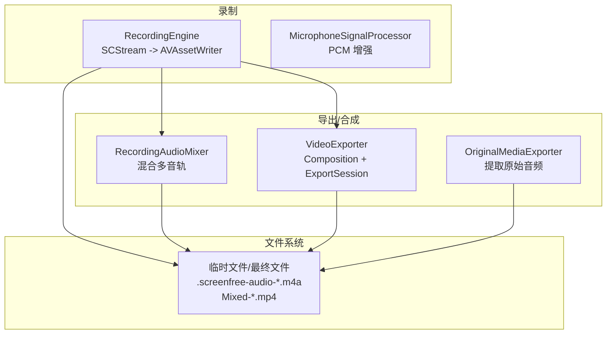
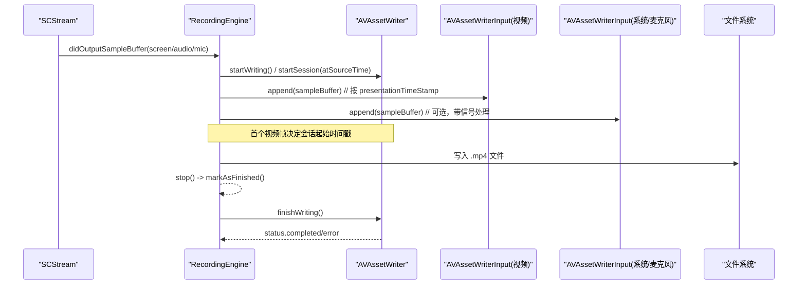
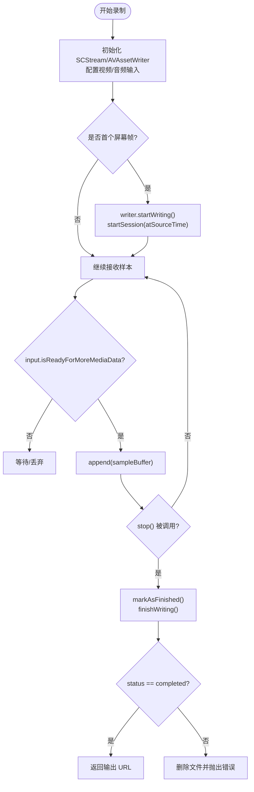
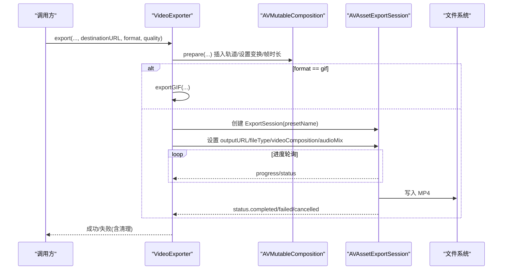
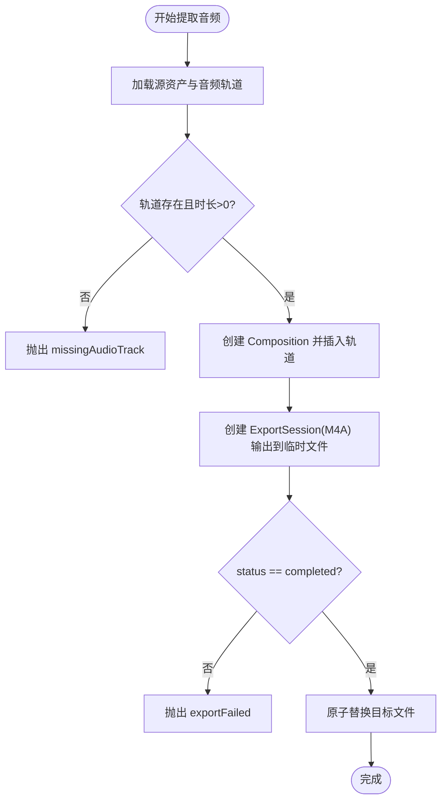
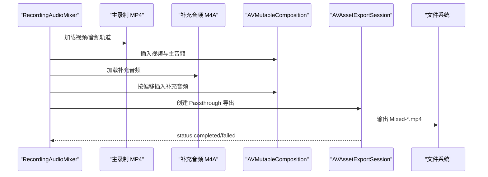
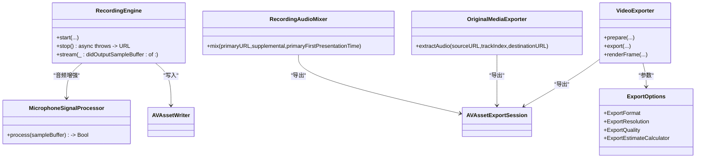

# 媒体写入数据流

<cite>
**本文引用的文件**   
- [RecordingEngine.swift](file://Sources/ScreenFree/RecordingEngine.swift)
- [VideoExporter.swift](file://Sources/ScreenFree/VideoExporter.swift)
- [OriginalMediaExporter.swift](file://Sources/ScreenFree/OriginalMediaExporter.swift)
- [RecordingAudioMixer.swift](file://Sources/ScreenFree/RecordingAudioMixer.swift)
- [MicrophoneSignalProcessor.swift](file://Sources/ScreenFree/MicrophoneSignalProcessor.swift)
- [ExportOptions.swift](file://Sources/ScreenFree/ExportOptions.swift)
</cite>

## 目录
1. [简介](#简介)
2. [项目结构](#项目结构)
3. [核心组件](#核心组件)
4. [架构总览](#架构总览)
5. [详细组件分析](#详细组件分析)
6. [依赖关系分析](#依赖关系分析)
7. [性能考量](#性能考量)
8. [故障排查指南](#故障排查指南)
9. [结论](#结论)
10. [附录](#附录)

## 简介
本文面向 ScreenFree 的“媒体写入数据流”，聚焦于 AVAssetWriter 的配置与使用、视频/音频编码器设置、输出文件管理、帧与样本的写入时序控制、时间戳同步机制、错误处理与重试逻辑，以及 OriginalMediaExporter 对原始媒体文件的导出流程。文档通过流程图与时序图展示从内存缓冲区到磁盘文件的完整写入过程，帮助读者快速理解并安全扩展该子系统。

## 项目结构
- 录制阶段：RecordingEngine 负责基于 SCStream 捕获屏幕与音频，创建并配置 AVAssetWriter/AVAssetWriterInput，按 CMSampleBuffer 的时间戳顺序写入。
- 后期导出：VideoExporter 基于 AVMutableComposition/AVAssetExportSession 进行合成与导出；OriginalMediaExporter 用于提取原始音频轨道；RecordingAudioMixer 将主录制的音视频与补充音频混合。
- 音频增强：MicrophoneSignalProcessor 在写入前对 PCM 数据进行降噪、自动增益、压缩等处理。
- 导出选项：ExportOptions 提供分辨率、质量、格式选择及目标文件大小估算。

图表来源
- [RecordingEngine.swift:283-326](file://Sources/ScreenFree/RecordingEngine.swift#L283-L326)
- [RecordingEngine.swift:445-489](file://Sources/ScreenFree/RecordingEngine.swift#L445-L489)
- [VideoExporter.swift:536-590](file://Sources/ScreenFree/VideoExporter.swift#L536-L590)
- [OriginalMediaExporter.swift:27-80](file://Sources/ScreenFree/OriginalMediaExporter.swift#L27-L80)
- [RecordingAudioMixer.swift:30-134](file://Sources/ScreenFree/RecordingAudioMixer.swift#L30-L134)
- [ExportOptions.swift:48-77](file://Sources/ScreenFree/ExportOptions.swift#L48-L77)

章节来源
- [RecordingEngine.swift:283-326](file://Sources/ScreenFree/RecordingEngine.swift#L283-L326)
- [VideoExporter.swift:536-590](file://Sources/ScreenFree/VideoExporter.swift#L536-L590)
- [OriginalMediaExporter.swift:27-80](file://Sources/ScreenFree/OriginalMediaExporter.swift#L27-L80)
- [RecordingAudioMixer.swift:30-134](file://Sources/ScreenFree/RecordingAudioMixer.swift#L30-L134)
- [ExportOptions.swift:48-77](file://Sources/ScreenFree/ExportOptions.swift#L48-L77)

## 核心组件
- RecordingEngine：构建 AVAssetWriter，配置 H.264 视频输入与 AAC 音频输入，维护首帧时间戳以启动会话，按 CMSampleBuffer.presentationTimeStamp 有序写入。
- VideoExporter：准备 AVMutableComposition（含视频/音频轨道、缩放、叠加、字幕、鼠标轨迹），通过 AVAssetExportSession 导出 MP4/GIF，支持进度回调与取消。
- OriginalMediaExporter：从源媒体中抽取指定音频轨道，生成临时 M4A 后拷贝至目标路径。
- RecordingAudioMixer：将主录制的音视频与补充应用音频按时间偏移对齐并混入同一 MP4。
- MicrophoneSignalProcessor：对 PCM 缓冲进行降噪、自动增益、压缩，保证音量稳定与动态范围可控。
- ExportOptions：定义导出格式、分辨率、质量预设与目标文件大小估算策略。

章节来源
- [RecordingEngine.swift:283-326](file://Sources/ScreenFree/RecordingEngine.swift#L283-L326)
- [VideoExporter.swift:103-486](file://Sources/ScreenFree/VideoExporter.swift#L103-L486)
- [OriginalMediaExporter.swift:27-80](file://Sources/ScreenFree/OriginalMediaExporter.swift#L27-L80)
- [RecordingAudioMixer.swift:30-134](file://Sources/ScreenFree/RecordingAudioMixer.swift#L30-L134)
- [MicrophoneSignalProcessor.swift:78-356](file://Sources/ScreenFree/MicrophoneSignalProcessor.swift#L78-L356)
- [ExportOptions.swift:79-362](file://Sources/ScreenFree/ExportOptions.swift#L79-L362)

## 架构总览
下图展示了从屏幕/音频采集到最终落盘的端到端数据流，包括实时写入与离线导出两条路径。

图表来源
- [RecordingEngine.swift:445-489](file://Sources/ScreenFree/RecordingEngine.swift#L445-L489)
- [RecordingEngine.swift:394-443](file://Sources/ScreenFree/RecordingEngine.swift#L394-L443)

章节来源
- [RecordingEngine.swift:445-489](file://Sources/ScreenFree/RecordingEngine.swift#L445-L489)
- [RecordingEngine.swift:394-443](file://Sources/ScreenFree/RecordingEngine.swift#L394-L443)

## 详细组件分析

### RecordingEngine：实时录制与写入
- 编码器配置
  - 视频：H.264，宽高来自 SCStreamConfiguration，比特率按分辨率自适应，关键帧间隔固定。
  - 音频：AAC，采样率 48kHz，双声道，码率 192kbps。
- 写入时序与时间戳同步
  - 首次收到屏幕帧时调用 writer.startWriting() 与 startSession(atSourceTime: presentationTimeStamp)。
  - 后续所有样本必须满足 presentationTimeStamp >= firstPresentationTime，避免早期音频导致永久失败。
  - 每个 input.append(sampleBuffer) 前检查 isReadyForMoreMediaData。
- 输出文件管理
  - 输出目录优先用户电影目录下的 ScreenFree，否则回退到临时目录。
  - 文件名包含日期与短 UUID，确保唯一性。
- 错误处理与收尾
  - stop() 中 markAsFinished() 所有输入，finishWriting() 异步完成，状态为 completed 才返回 URL。
  - 若异常或取消，清理目标文件。

图表来源
- [RecordingEngine.swift:283-326](file://Sources/ScreenFree/RecordingEngine.swift#L283-L326)
- [RecordingEngine.swift:445-489](file://Sources/ScreenFree/RecordingEngine.swift#L445-L489)
- [RecordingEngine.swift:394-443](file://Sources/ScreenFree/RecordingEngine.swift#L394-L443)

章节来源
- [RecordingEngine.swift:283-326](file://Sources/ScreenFree/RecordingEngine.swift#L283-L326)
- [RecordingEngine.swift:445-489](file://Sources/ScreenFree/RecordingEngine.swift#L445-L489)
- [RecordingEngine.swift:394-443](file://Sources/ScreenFree/RecordingEngine.swift#L394-L443)

### VideoExporter：合成与导出
- 合成准备
  - 构建 AVMutableComposition，插入源视频/音频轨道，必要时插入相机轨道与背景音乐。
  - 计算渲染尺寸与变换，设置 frameDuration 与 videoComposition.instructions。
  - 根据项目剪辑、缩放、字幕、光标轨迹等生成图层指令与自定义合成器。
- 导出流程
  - 非 GIF：创建 AVAssetExportSession，设置 outputURL/outputFileType/videoComposition/audioMix，支持最大文件大小限制。
  - 进度与取消：后台任务轮询 session.progress/status，支持取消并清理文件。
  - 结果校验：仅当 status == .completed 时成功，否则抛错并清理。
- 单帧渲染
  - 使用 AVAssetReader + AVAssetReaderVideoCompositionOutput 读取指定时间的像素缓冲，再叠加 UI 元素生成 CGImage。

图表来源
- [VideoExporter.swift:103-486](file://Sources/ScreenFree/VideoExporter.swift#L103-L486)
- [VideoExporter.swift:536-590](file://Sources/ScreenFree/VideoExporter.swift#L536-L590)

章节来源
- [VideoExporter.swift:103-486](file://Sources/ScreenFree/VideoExporter.swift#L103-L486)
- [VideoExporter.swift:536-590](file://Sources/ScreenFree/VideoExporter.swift#L536-L590)

### OriginalMediaExporter：原始音频提取
- 流程要点
  - 加载源 AVURLAsset 的音频轨道，校验索引与时间范围。
  - 使用 AVMutableComposition 复制音频轨道，创建 AVAssetExportSession(M4A)，输出到临时文件。
  - 成功后通过 OriginalRecordingDelivery.copy 原子替换目标文件。
- 错误处理
  - 缺失轨道、无法创建轨道/导出会话、导出失败均抛出明确错误类型。

图表来源
- [OriginalMediaExporter.swift:27-80](file://Sources/ScreenFree/OriginalMediaExporter.swift#L27-L80)
- [ExportOptions.swift:48-77](file://Sources/ScreenFree/ExportOptions.swift#L48-L77)

章节来源
- [OriginalMediaExporter.swift:27-80](file://Sources/ScreenFree/OriginalMediaExporter.swift#L27-L80)
- [ExportOptions.swift:48-77](file://Sources/ScreenFree/ExportOptions.swift#L48-L77)

### RecordingAudioMixer：多音轨混合
- 流程要点
  - 复制主视频的音视频轨道到 Composition。
  - 加载补充音频轨道，依据 firstPresentationTime 与主录制的首帧时间戳计算偏移，裁剪并插入对应时间段。
  - 使用 AVAssetExportSession(Passthrough) 输出新的 MP4。
- 错误处理
  - 缺失视频轨道、无法创建轨道/导出会话、导出失败均抛出明确错误类型。

图表来源
- [RecordingAudioMixer.swift:30-134](file://Sources/ScreenFree/RecordingAudioMixer.swift#L30-L134)

章节来源
- [RecordingAudioMixer.swift:30-134](file://Sources/ScreenFree/RecordingAudioMixer.swift#L30-L134)

### MicrophoneSignalProcessor：音频增强
- 功能
  - 支持降噪（高通滤波）、自动增益（RMS 目标值）、压缩（阈值与比率）与输出限幅。
  - 直接操作 PCM 缓冲（Float/Int16），保持通道数与采样率一致。
- 集成点
  - 在 RecordingEngine 的音频输入路径中，按需启用系统音频或麦克风的增强处理。

章节来源
- [MicrophoneSignalProcessor.swift:78-356](file://Sources/ScreenFree/MicrophoneSignalProcessor.swift#L78-L356)
- [RecordingEngine.swift:333-346](file://Sources/ScreenFree/RecordingEngine.swift#L333-L346)

## 依赖关系分析
- RecordingEngine 依赖 SCStream 获取 CMSampleBuffer，依赖 AVAssetWriter/AVAssetWriterInput 进行编码写入，依赖 MicrophoneSignalProcessor 进行音频增强。
- VideoExporter 依赖 AVMutableComposition/AVAssetExportSession 进行合成与导出，依赖 Canvas/Camera 样式与项目元数据生成视频指令。
- OriginalMediaExporter 依赖 AVURLAsset/AVAssetExportSession 与文件管理器进行原子替换。
- RecordingAudioMixer 依赖 AVURLAsset/AVMutableComposition/AVAssetExportSession 进行多轨混合。
- ExportOptions 提供导出参数与大小估算，影响 VideoExporter 的 preset 与 fileLengthLimit。

图表来源
- [RecordingEngine.swift:63-392](file://Sources/ScreenFree/RecordingEngine.swift#L63-L392)
- [VideoExporter.swift:95-590](file://Sources/ScreenFree/VideoExporter.swift#L95-L590)
- [OriginalMediaExporter.swift:24-81](file://Sources/ScreenFree/OriginalMediaExporter.swift#L24-L81)
- [RecordingAudioMixer.swift:29-136](file://Sources/ScreenFree/RecordingAudioMixer.swift#L29-L136)
- [ExportOptions.swift:79-362](file://Sources/ScreenFree/ExportOptions.swift#L79-L362)

章节来源
- [RecordingEngine.swift:63-392](file://Sources/ScreenFree/RecordingEngine.swift#L63-L392)
- [VideoExporter.swift:95-590](file://Sources/ScreenFree/VideoExporter.swift#L95-L590)
- [OriginalMediaExporter.swift:24-81](file://Sources/ScreenFree/OriginalMediaExporter.swift#L24-L81)
- [RecordingAudioMixer.swift:29-136](file://Sources/ScreenFree/RecordingAudioMixer.swift#L29-L136)
- [ExportOptions.swift:79-362](file://Sources/ScreenFree/ExportOptions.swift#L79-L362)

## 性能考量
- 编码器与队列
  - 视频 H.264 编码，关键帧间隔固定，比特率随分辨率自适应，减少卡顿与丢帧风险。
  - 音频 AAC 48kHz/立体声/192kbps，兼顾音质与体积。
  - SCStream queueDepth 与 minimumFrameInterval 平衡吞吐与延迟。
- 写入路径
  - 仅在 input.isReadyForMoreMediaData 时写入，避免阻塞与溢出。
  - 首帧时间戳严格作为会话起点，防止早期音频导致永久失败。
- 导出优化
  - shouldOptimizeForNetworkUse = true，利于网络分发。
  - 可设置 fileLengthLimit 控制文件大小，配合 ExportEstimateCalculator 预估。
- 内存与 I/O
  - 临时文件命名规范，原子替换避免损坏目标文件。
  - 导出完成后及时清理临时文件，降低磁盘占用。

[本节为通用指导，不直接分析具体文件]

## 故障排查指南
- 录制失败
  - cannotStartWriter：检查 canAdd(input) 与编码器参数是否合法。
  - writerFailed：finishWriting 后检查 status 与 error，常见为时间戳越界或输入未标记结束。
  - 时间戳问题：确保首个视频帧后才启动会话，且后续样本时间戳不小于首帧时间戳。
- 导出失败
  - cannotCreateExportSession：确认 composition 有效且 presetName 支持。
  - exportFailed：检查 session.status 与 error，必要时清理目标文件并重试。
- 音频问题
  - 音量不一致：检查 MicrophoneSignalProcessor 设置与自动增益曲线。
  - 音画不同步：核对 firstPresentationTime 与补充音频偏移计算。
- 文件问题
  - 目标文件不存在或被锁定：确保原子替换逻辑与权限正确。
  - 临时文件残留：检查 defer 与异常分支是否清理。

章节来源
- [RecordingEngine.swift:394-443](file://Sources/ScreenFree/RecordingEngine.swift#L394-L443)
- [VideoExporter.swift:536-590](file://Sources/ScreenFree/VideoExporter.swift#L536-L590)
- [OriginalMediaExporter.swift:27-80](file://Sources/ScreenFree/OriginalMediaExporter.swift#L27-L80)
- [RecordingAudioMixer.swift:30-134](file://Sources/ScreenFree/RecordingAudioMixer.swift#L30-L134)

## 结论
ScreenFree 的媒体写入数据流围绕 AVAssetWriter 与 AVAssetExportSession 构建，实现了高可靠性的实时录制与灵活的离线导出。通过严格的时间戳管理与输入就绪检查，保证了音画同步与稳定性；通过原子文件替换与完善的错误处理，提升了鲁棒性与用户体验。结合音频增强与导出参数估算，系统在音质、画质与体积之间取得良好平衡。

[本节为总结，不直接分析具体文件]

## 附录
- 关键 API 与常量
  - AVVideoCodecKey: h264
  - kAudioFormatMPEG4AAC: AAC 音频编码
  - AVAssetExportPresetHighestQuality/MediumQuality/LowQuality
  - shouldOptimizeForNetworkUse: true
  - fileLengthLimit: 最大文件大小限制
- 典型路径
  - 录制输出：~/Movies/ScreenFree/Recording-YYYY-MM-dd-HHmmss-xxxx.mp4
  - 临时音频：.screenfree-audio-*.m4a
  - 混合输出：Mixed-*.mp4

[本节为参考信息，不直接分析具体文件]