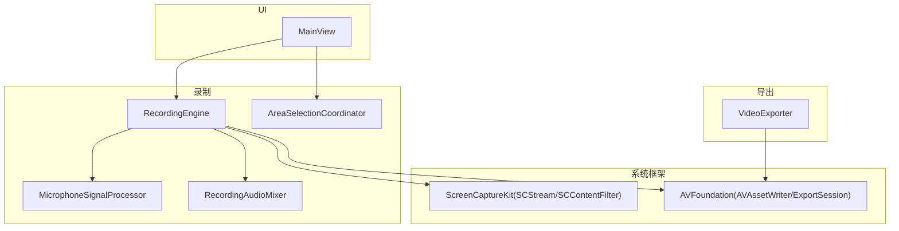
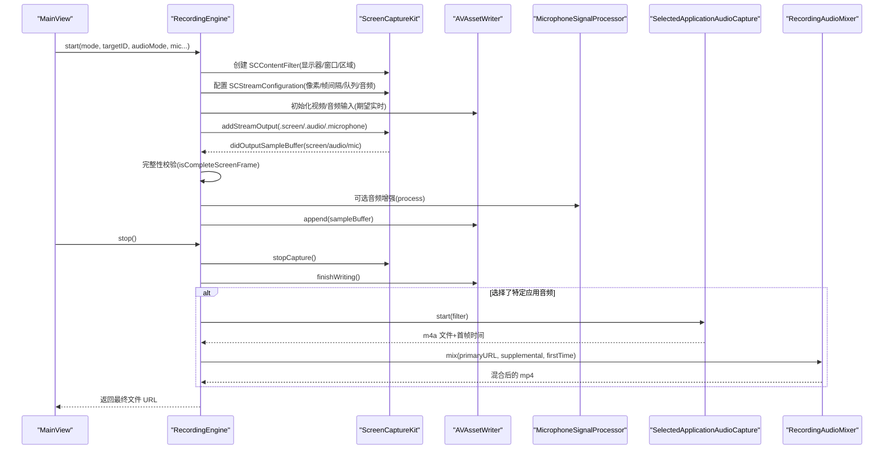
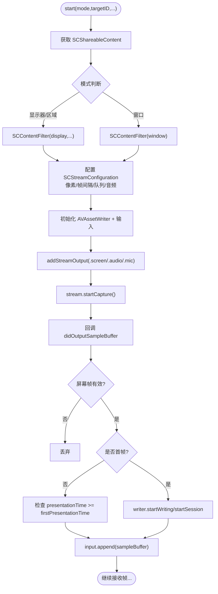
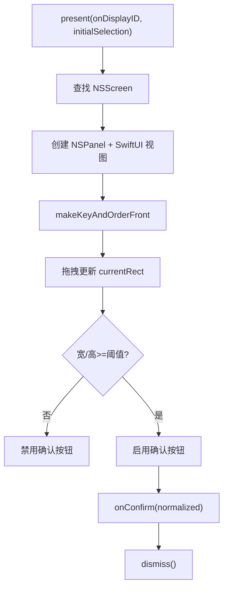
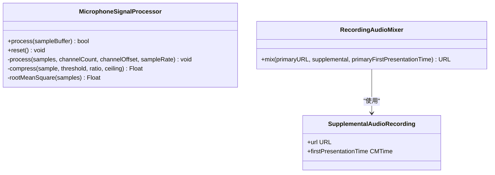
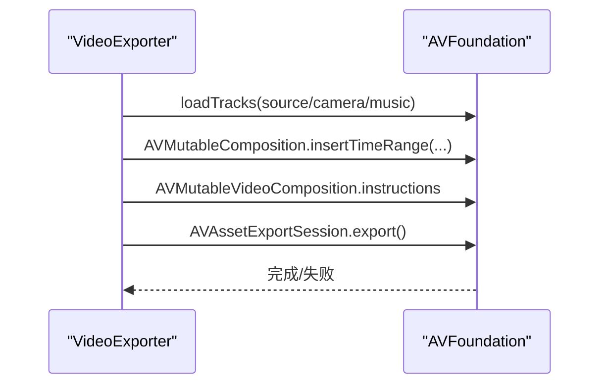
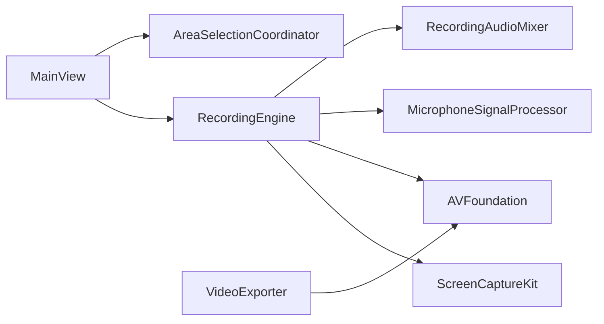

# 屏幕捕获数据流

<cite>
**本文引用的文件**   
- [RecordingEngine.swift](file://Sources/ScreenFree/RecordingEngine.swift)
- [AreaSelectionCoordinator.swift](file://Sources/ScreenFree/AreaSelectionCoordinator.swift)
- [MicrophoneSignalProcessor.swift](file://Sources/ScreenFree/MicrophoneSignalProcessor.swift)
- [RecordingAudioMixer.swift](file://Sources/ScreenFree/RecordingAudioMixer.swift)
- [VideoExporter.swift](file://Sources/ScreenFree/VideoExporter.swift)
- [MainView.swift](file://Sources/ScreenFree/MainView.swift)
</cite>

## 目录
1. [简介](#简介)
2. [项目结构](#项目结构)
3. [核心组件](#核心组件)
4. [架构总览](#架构总览)
5. [详细组件分析](#详细组件分析)
6. [依赖关系分析](#依赖关系分析)
7. [性能考量](#性能考量)
8. [故障排查指南](#故障排查指南)
9. [结论](#结论)

## 简介
本文面向 ScreenFree 的屏幕捕获数据流，系统性说明 RecordingEngine 如何基于系统 ScreenCaptureKit（SCStream、SCContentFilter）完成显示器、窗口、区域三种录制模式的帧采集与写入；阐述 AreaSelectionCoordinator 对选择区域的坐标转换与边界检测；并解释实时处理机制中的帧率控制、像素格式转换、完整性校验。文末提供从系统屏幕到媒体文件的完整数据流程图，便于理解端到端路径。

## 项目结构
- Sources/ScreenFree 包含 UI、录制引擎、音频处理、导出等关键模块。
- 屏幕捕获核心在 RecordingEngine.swift，区域选择在 AreaSelectionCoordinator.swift，音频增强在 MicrophoneSignalProcessor.swift，可选应用音频混音在 RecordingAudioMixer.swift，后期导出与合成在 VideoExporter.swift，主界面入口在 MainView.swift。

图表来源 
- [RecordingEngine.swift:174-392](file://Sources/ScreenFree/RecordingEngine.swift#L174-L392)
- [AreaSelectionCoordinator.swift:8-42](file://Sources/ScreenFree/AreaSelectionCoordinator.swift#L8-L42)
- [MicrophoneSignalProcessor.swift:78-106](file://Sources/ScreenFree/MicrophoneSignalProcessor.swift#L78-L106)
- [RecordingAudioMixer.swift:29-134](file://Sources/ScreenFree/RecordingAudioMixer.swift#L29-L134)
- [VideoExporter.swift:95-118](file://Sources/ScreenFree/VideoExporter.swift#L95-L118)
- [MainView.swift:296-328](file://Sources/ScreenFree/MainView.swift#L296-L328)

章节来源
- [RecordingEngine.swift:1-691](file://Sources/ScreenFree/RecordingEngine.swift#L1-L691)
- [AreaSelectionCoordinator.swift:1-184](file://Sources/ScreenFree/AreaSelectionCoordinator.swift#L1-L184)
- [MicrophoneSignalProcessor.swift:1-356](file://Sources/ScreenFree/MicrophoneSignalProcessor.swift#L1-L356)
- [RecordingAudioMixer.swift:1-136](file://Sources/ScreenFree/RecordingAudioMixer.swift#L1-L136)
- [VideoExporter.swift:1-800](file://Sources/ScreenFree/VideoExporter.swift#L1-L800)
- [MainView.swift:1-800](file://Sources/ScreenFree/MainView.swift#L1-L800)

## 核心组件
- RecordingEngine：封装 SCStream/SCContentFilter 配置，按模式创建内容过滤器，设置像素格式、帧间隔、队列深度，启动视频与音频输入，回调中完成帧完整性校验与写入。
- AreaSelectionCoordinator：全屏 NSPanel + SwiftUI 视图，负责拖拽选区、归一化坐标输出、最小尺寸限制与显示像素尺寸换算。
- MicrophoneSignalProcessor：对 PCM 音频进行降噪、自动增益、压缩与门限处理，支持 16/32bit 浮点或整型缓冲。
- RecordingAudioMixer：将“指定应用”的独立音频轨道与主录屏音视频合并，按首帧时间对齐偏移。
- VideoExporter：构建 AVMutableComposition，叠加摄像头画面、画布样式、字幕、光标、点击特效等，最终导出 MP4/GIF。
- MainView：UI 入口，触发录制、导出、历史管理等交互。

章节来源
- [RecordingEngine.swift:63-117](file://Sources/ScreenFree/RecordingEngine.swift#L63-L117)
- [AreaSelectionCoordinator.swift:5-42](file://Sources/ScreenFree/AreaSelectionCoordinator.swift#L5-L42)
- [MicrophoneSignalProcessor.swift:78-106](file://Sources/ScreenFree/MicrophoneSignalProcessor.swift#L78-L106)
- [RecordingAudioMixer.swift:29-134](file://Sources/ScreenFree/RecordingAudioMixer.swift#L29-L134)
- [VideoExporter.swift:95-118](file://Sources/ScreenFree/VideoExporter.swift#L95-L118)
- [MainView.swift:296-328](file://Sources/ScreenFree/MainView.swift#L296-L328)

## 架构总览
下图展示从用户操作到屏幕帧落盘的完整数据路径，涵盖三种录制模式与多路音频。

图表来源 
- [RecordingEngine.swift:174-392](file://Sources/ScreenFree/RecordingEngine.swift#L174-L392)
- [RecordingEngine.swift:445-489](file://Sources/ScreenFree/RecordingEngine.swift#L445-L489)
- [RecordingEngine.swift:533-674](file://Sources/ScreenFree/RecordingEngine.swift#L533-L674)
- [RecordingAudioMixer.swift:29-134](file://Sources/ScreenFree/RecordingAudioMixer.swift#L29-L134)

## 详细组件分析

### RecordingEngine：三种录制模式与数据流
- 目标发现与缩略图
  - 通过 SCShareableContent 枚举显示器与窗口，过滤可见且满足最小尺寸的窗口。
  - 缩略图使用 SCScreenshotManager 配合 SCContentFilter 快速生成预览图。
- 开始录制 start(...)
  - 像素格式：kCVPixelFormatType_32BGRA
  - 帧率控制：minimumFrameInterval=1/60s，queueDepth=8
  - 光标：source 视频不绘制光标，后续以元数据方式编辑
  - 音频：system audio（全部/指定应用）、麦克风（macOS 15+）
  - 内容过滤器：
    - 显示器/区域：SCContentFilter(display, excludingOwnApp)
    - 窗口：SCContentFilter(desktopIndependentWindow:)
    - 区域：设置 sourceRect 与 width/height，同时记录 sourceFrame 用于坐标映射
  - 写入器：AVAssetWriter + 视频/系统音频/麦克风输入，expectsMediaDataInRealTime=true
  - 可选：SelectedApplicationAudioCapture 单独录制指定应用音频为 m4a
- 帧回调 stream(_:didOutputSampleBuffer:of:)
  - 屏幕帧完整性校验：检查 CMSampleBuffer.imageBuffer 与 frameInfo.status==complete
  - 首帧时间：首次屏幕帧时调用 writer.startWriting/startSession，记录 firstPresentationTime
  - 音频时序保护：若音频早于首帧时间则丢弃，避免 AVAssetWriter 永久失败
  - 音频增强：根据类型走 system/microphone 处理器
  - 写入：仅当 input.isReadyForMoreMediaData 时 append
- 停止录制 stop()
  - 停止 SCStream，关闭 SelectedApplicationAudioCapture
  - markAsFinished 所有输入，finishWriting 等待完成
  - 若有补充音频，调用 RecordingAudioMixer 按首帧时间对齐混合

图表来源 
- [RecordingEngine.swift:174-392](file://Sources/ScreenFree/RecordingEngine.swift#L174-L392)
- [RecordingEngine.swift:445-489](file://Sources/ScreenFree/RecordingEngine.swift#L445-L489)

章节来源
- [RecordingEngine.swift:85-117](file://Sources/ScreenFree/RecordingEngine.swift#L85-L117)
- [RecordingEngine.swift:145-172](file://Sources/ScreenFree/RecordingEngine.swift#L145-L172)
- [RecordingEngine.swift:174-392](file://Sources/ScreenFree/RecordingEngine.swift#L174-L392)
- [RecordingEngine.swift:445-489](file://Sources/ScreenFree/RecordingEngine.swift#L445-L489)
- [RecordingEngine.swift:491-504](file://Sources/ScreenFree/RecordingEngine.swift#L491-L504)
- [RecordingEngine.swift:533-674](file://Sources/ScreenFree/RecordingEngine.swift#L533-L674)

### AreaSelectionCoordinator：区域选择与坐标转换
- 面板呈现
  - 基于 NSScreen 计算像素尺寸，使用 NSPanel + SwiftUI 覆盖全屏，层级设置为 screenSaver，透明背景。
- 拖拽选区
  - GeometryReader 内维护 dragStart/dragCurrent，计算当前矩形，限制最小宽高（如 80pt）。
  - 显示实际像素分辨率（结合 backingScaleFactor 与 CGDisplayPixelsWide/High）。
- 归一化坐标输出
  - 确认时将 selection 转换为 normalized CGRect（相对 geometry.size），供 RecordingEngine 转为 sourceRect。
- 边界检测
  - 通过 min/max 保证矩形不越界，宽度/高度取绝对值，确保稳定。

图表来源 
- [AreaSelectionCoordinator.swift:8-42](file://Sources/ScreenFree/AreaSelectionCoordinator.swift#L8-L42)
- [AreaSelectionCoordinator.swift:78-184](file://Sources/ScreenFree/AreaSelectionCoordinator.swift#L78-L184)

章节来源
- [AreaSelectionCoordinator.swift:49-72](file://Sources/ScreenFree/AreaSelectionCoordinator.swift#L49-L72)
- [AreaSelectionCoordinator.swift:78-184](file://Sources/ScreenFree/AreaSelectionCoordinator.swift#L78-L184)

### 音频增强与混音
- MicrophoneSignalProcessor
  - 支持 16/32bit 浮点或整型 PCM，先降噪（高通滤波），再自动增益（RMS 目标值+平滑），后压缩与门限。
  - 可配置降噪、音量归一化、目标 RMS、增益范围、压缩阈值与比例。
- RecordingAudioMixer
  - 将主录屏（mp4）与指定应用音频（m4a）合并，按首帧时间差 offset 对齐插入，输出新的 mp4。

图表来源 
- [MicrophoneSignalProcessor.swift:78-106](file://Sources/ScreenFree/MicrophoneSignalProcessor.swift#L78-L106)
- [MicrophoneSignalProcessor.swift:224-318](file://Sources/ScreenFree/MicrophoneSignalProcessor.swift#L224-L318)
- [RecordingAudioMixer.swift:29-134](file://Sources/ScreenFree/RecordingAudioMixer.swift#L29-L134)

章节来源
- [MicrophoneSignalProcessor.swift:78-106](file://Sources/ScreenFree/MicrophoneSignalProcessor.swift#L78-L106)
- [MicrophoneSignalProcessor.swift:224-318](file://Sources/ScreenFree/MicrophoneSignalProcessor.swift#L224-L318)
- [RecordingAudioMixer.swift:29-134](file://Sources/ScreenFree/RecordingAudioMixer.swift#L29-L134)

### 导出与合成（VideoExporter）
- 准备阶段 prepare(...)
  - 加载源视频/音频轨道，构建 AVMutableComposition，插入时间范围，支持变速缩放。
  - 可选摄像头轨道叠加，计算位置、缩放、镜像、圆角。
  - 计算 cropGeometry（按画布比例与内容模式），生成 baseTransform。
  - 设置 videoComposition.renderSize 与 frameDuration（frameRate 限制 15-120）。
- 导出 export(...)
  - 使用 AVAssetExportSession 导出 MP4，支持进度回调与取消。
- 单帧渲染 renderFrame(...)
  - 通过 AVAssetReader + AVAssetReaderVideoCompositionOutput 读取指定时间帧，CIContext 转 CGImage，叠加光标、点击、字幕、快捷键、隐私遮罩等。

图表来源 
- [VideoExporter.swift:103-118](file://Sources/ScreenFree/VideoExporter.swift#L103-L118)
- [VideoExporter.swift:488-590](file://Sources/ScreenFree/VideoExporter.swift#L488-L590)
- [VideoExporter.swift:592-667](file://Sources/ScreenFree/VideoExporter.swift#L592-L667)

章节来源
- [VideoExporter.swift:103-118](file://Sources/ScreenFree/VideoExporter.swift#L103-L118)
- [VideoExporter.swift:488-590](file://Sources/ScreenFree/VideoExporter.swift#L488-L590)
- [VideoExporter.swift:592-667](file://Sources/ScreenFree/VideoExporter.swift#L592-L667)

## 依赖关系分析
- RecordingEngine 依赖 ScreenCaptureKit 进行屏幕/音频捕获，依赖 AVFoundation 进行写入，依赖 MicrophoneSignalProcessor 做音频增强，依赖 RecordingAudioMixer 做补充音频混合。
- AreaSelectionCoordinator 依赖 AppKit/SwiftUI 实现全屏选择面板。
- VideoExporter 依赖 AVFoundation 进行合成与导出。
- MainView 作为 UI 入口，协调录制、导出、历史记录等流程。

图表来源 
- [RecordingEngine.swift:1-691](file://Sources/ScreenFree/RecordingEngine.swift#L1-L691)
- [AreaSelectionCoordinator.swift:1-184](file://Sources/ScreenFree/AreaSelectionCoordinator.swift#L1-L184)
- [VideoExporter.swift:1-800](file://Sources/ScreenFree/VideoExporter.swift#L1-L800)
- [MainView.swift:1-800](file://Sources/ScreenFree/MainView.swift#L1-L800)

章节来源
- [RecordingEngine.swift:1-691](file://Sources/ScreenFree/RecordingEngine.swift#L1-L691)
- [AreaSelectionCoordinator.swift:1-184](file://Sources/ScreenFree/AreaSelectionCoordinator.swift#L1-L184)
- [VideoExporter.swift:1-800](file://Sources/ScreenFree/VideoExporter.swift#L1-L800)
- [MainView.swift:1-800](file://Sources/ScreenFree/MainView.swift#L1-L800)

## 性能考量
- 帧率控制
  - minimumFrameInterval=1/60s，确保最高 60fps 采集；export 时 frameDuration 限制在 15-120fps。
- 像素格式与内存
  - 使用 kCVPixelFormatType_32BGRA，减少格式转换开销；导出帧读取时同样使用 BGRA 像素缓冲。
- 队列深度与实时性
  - queueDepth=8，降低丢帧风险；AVAssetWriterInput.expectsMediaDataInRealTime=true。
- 完整性校验
  - 屏幕帧需 status==complete，否则丢弃，避免损坏帧进入写入器。
- 音频时序保护
  - 首帧前到达的音频被丢弃，防止 AVAssetWriter 会话起始时间错误导致永久失败。
- 音频增强
  - 降噪与自动增益仅在启用时运行，避免不必要的 CPU 消耗。

[本节为通用指导，无需具体文件引用]

## 故障排查指南
- 无可用源
  - 现象：availableTargets 或 thumbnail 抛出 noSource。
  - 排查：确认至少有一个显示器或可见窗口；窗口尺寸需满足最小阈值。
- 无法启动写入器
  - 现象：cannotStartWriter。
  - 排查：检查 AVAssetWriter.canAdd(input)；确认输出目录权限与磁盘空间。
- 写入失败
  - 现象：writerFailed 或 cannotFinishWriter。
  - 排查：检查 finishWriting 状态与 error；确认输入已 markAsFinished。
- 音频缺失或错位
  - 现象：无系统音频或音画不同步。
  - 排查：确认 systemAudioMode 与 selectedAudioApplicationIDs；检查 firstPresentationTime 对齐逻辑。
- 区域选择无效
  - 现象：确认按钮禁用或选区过小。
  - 排查：确保拖拽宽度/高度大于阈值；检查 displayPixelSize 计算是否正确。

章节来源
- [RecordingEngine.swift:40-61](file://Sources/ScreenFree/RecordingEngine.swift#L40-L61)
- [RecordingEngine.swift:282-326](file://Sources/ScreenFree/RecordingEngine.swift#L282-L326)
- [RecordingEngine.swift:394-443](file://Sources/ScreenFree/RecordingEngine.swift#L394-L443)
- [RecordingEngine.swift:445-489](file://Sources/ScreenFree/RecordingEngine.swift#L445-L489)
- [AreaSelectionCoordinator.swift:141-152](file://Sources/ScreenFree/AreaSelectionCoordinator.swift#L141-L152)

## 结论
ScreenFree 的屏幕捕获数据流以 RecordingEngine 为核心，利用 ScreenCaptureKit 的 SCStream/SCContentFilter 灵活支持显示器、窗口、区域三种模式；通过严格的帧完整性校验与音频时序保护保障稳定性；借助 MicrophoneSignalProcessor 与 RecordingAudioMixer 提升音频质量与灵活性；最终由 VideoExporter 完成高质量合成与导出。AreaSelectionCoordinator 提供直观的区域选择与可靠的坐标转换，确保录制区域精确可控。整体架构清晰、扩展性强，适合在高负载场景下稳定运行。