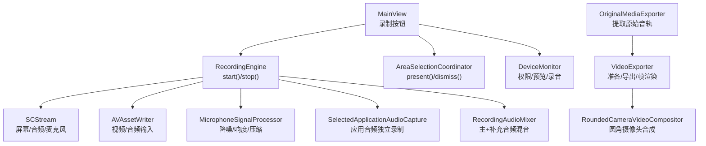
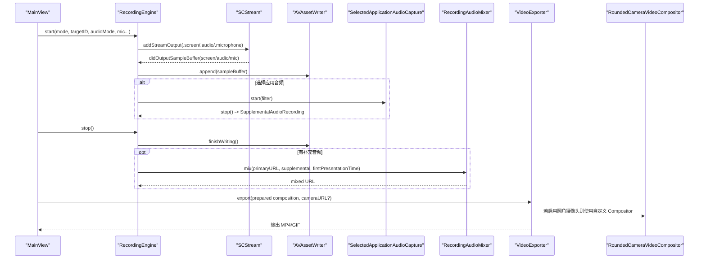
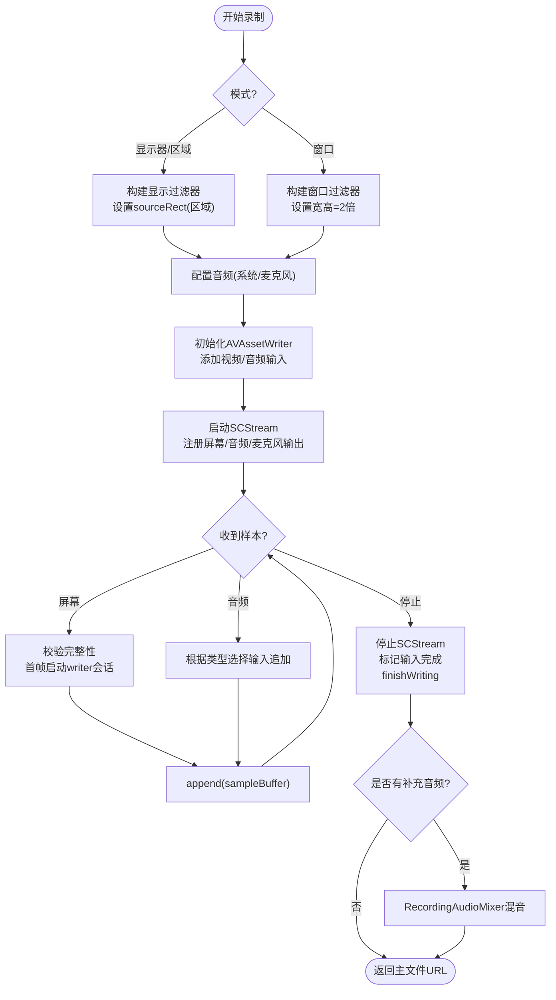
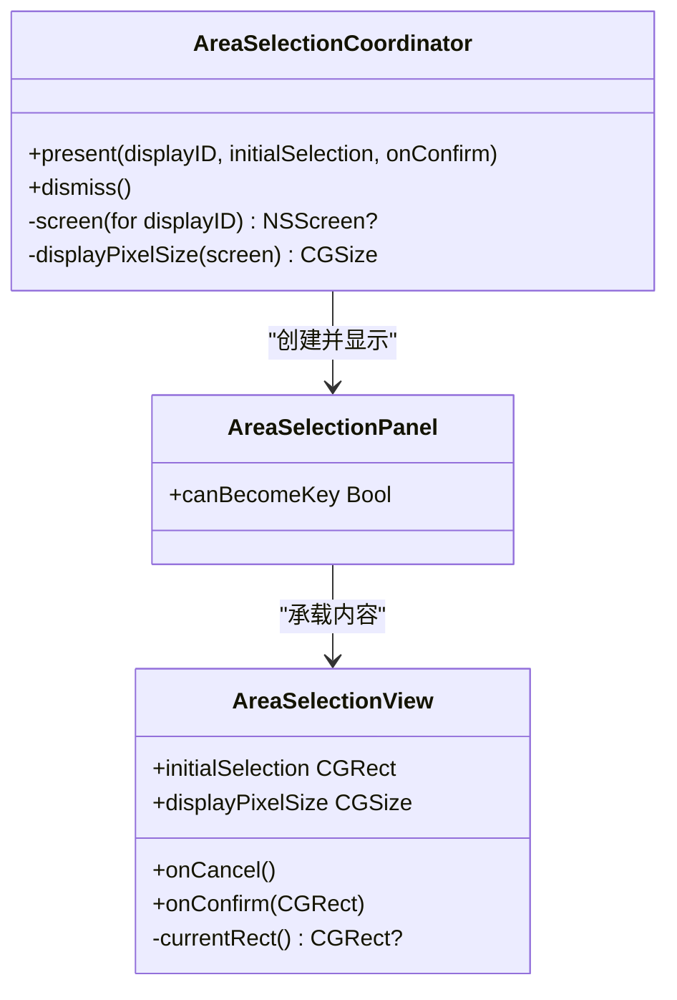
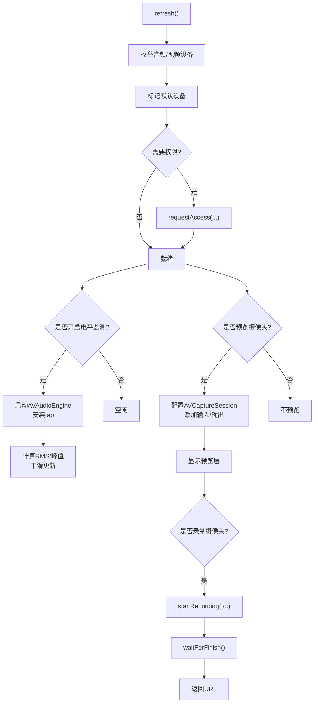
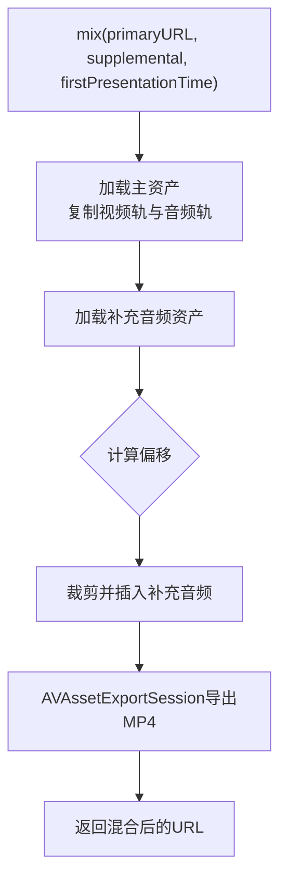
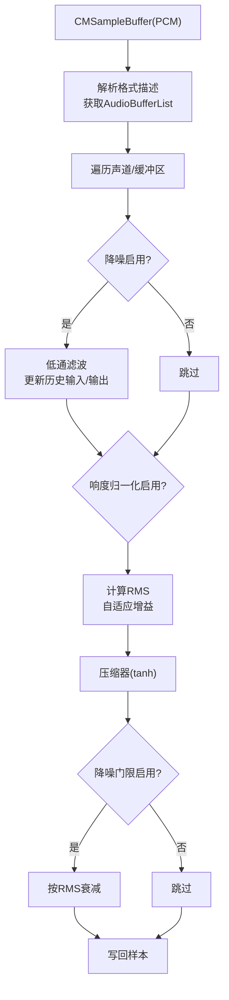
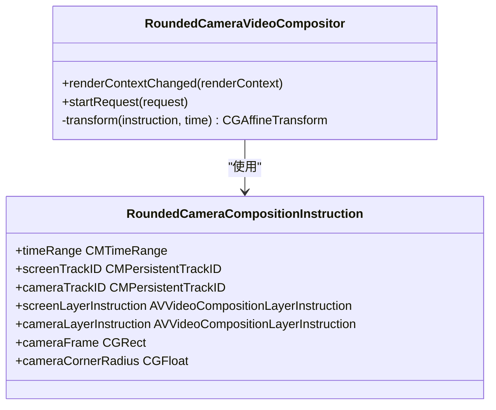
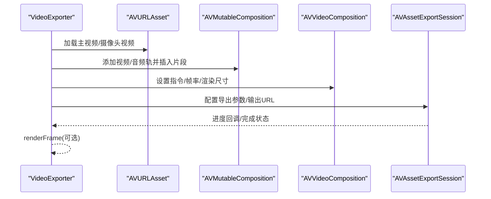
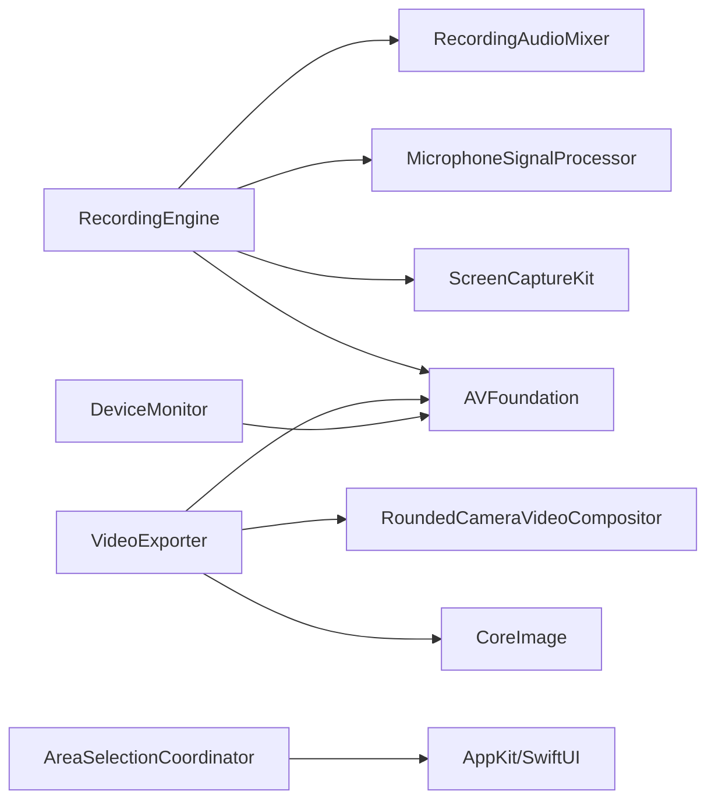

# 录制数据流

<cite>
**本文引用的文件**   
- [RecordingEngine.swift](file://Sources/ScreenFree/RecordingEngine.swift)
- [AreaSelectionCoordinator.swift](file://Sources/ScreenFree/AreaSelectionCoordinator.swift)
- [DeviceMonitor.swift](file://Sources/ScreenFree/DeviceMonitor.swift)
- [RecordingAudioMixer.swift](file://Sources/ScreenFree/RecordingAudioMixer.swift)
- [MicrophoneSignalProcessor.swift](file://Sources/ScreenFree/MicrophoneSignalProcessor.swift)
- [RoundedCameraVideoCompositor.swift](file://Sources/ScreenFree/RoundedCameraVideoCompositor.swift)
- [VideoExporter.swift](file://Sources/ScreenFree/VideoExporter.swift)
- [OriginalMediaExporter.swift](file://Sources/ScreenFree/OriginalMediaExporter.swift)
- [MainView.swift](file://Sources/ScreenFree/MainView.swift)
</cite>

## 目录
1. [简介](#简介)
2. [项目结构](#项目结构)
3. [核心组件](#核心组件)
4. [架构总览](#架构总览)
5. [详细组件分析](#详细组件分析)
6. [依赖关系分析](#依赖关系分析)
7. [性能考量](#性能考量)
8. [故障排查指南](#故障排查指南)
9. [结论](#结论)
10. [附录](#附录)

## 简介
本文件系统性梳理 ScreenFree 的“录制数据流”，从用户启动录制到媒体文件生成的完整路径，涵盖：
- 屏幕捕获数据的获取（显示器、窗口、区域）
- 系统音频与麦克风音频的混合处理
- 摄像头画面的合成与圆角叠加
- RecordingEngine 对多录制模式的数据流处理
- AreaSelectionCoordinator 的坐标转换与区域选择
- DeviceMonitor 的设备状态与权限监控
- 实时数据处理机制（帧率控制、编码参数、错误处理与重试逻辑）
- 数据流图展示各组件间的数据传递关系

## 项目结构
ScreenFree 采用模块化组织，录制相关能力集中在 Sources/ScreenFree 下：
- 录制引擎与流式写入：RecordingEngine.swift
- 区域选择与坐标归一化：AreaSelectionCoordinator.swift
- 设备与权限监控：DeviceMonitor.swift
- 音频混合与导出：RecordingAudioMixer.swift、OriginalMediaExporter.swift
- 音频信号增强：MicrophoneSignalProcessor.swift
- 摄像头画面合成：RoundedCameraVideoCompositor.swift
- 视频导出与渲染：VideoExporter.swift
- UI 入口与录制触发：MainView.swift

图表来源
- [RecordingEngine.swift:174-392](file://Sources/ScreenFree/RecordingEngine.swift#L174-L392)
- [AreaSelectionCoordinator.swift:8-42](file://Sources/ScreenFree/AreaSelectionCoordinator.swift#L8-L42)
- [DeviceMonitor.swift:69-112](file://Sources/ScreenFree/DeviceMonitor.swift#L69-L112)
- [RecordingAudioMixer.swift:30-134](file://Sources/ScreenFree/RecordingAudioMixer.swift#L30-L134)
- [MicrophoneSignalProcessor.swift:95-207](file://Sources/ScreenFree/MicrophoneSignalProcessor.swift#L95-L207)
- [RoundedCameraVideoCompositor.swift:68-144](file://Sources/ScreenFree/RoundedCameraVideoCompositor.swift#L68-L144)
- [VideoExporter.swift:103-486](file://Sources/ScreenFree/VideoExporter.swift#L103-L486)
- [OriginalMediaExporter.swift:27-80](file://Sources/ScreenFree/OriginalMediaExporter.swift#L27-L80)

章节来源
- [RecordingEngine.swift:1-691](file://Sources/ScreenFree/RecordingEngine.swift#L1-L691)
- [AreaSelectionCoordinator.swift:1-184](file://Sources/ScreenFree/AreaSelectionCoordinator.swift#L1-L184)
- [DeviceMonitor.swift:1-361](file://Sources/ScreenFree/DeviceMonitor.swift#L1-L361)
- [RecordingAudioMixer.swift:1-136](file://Sources/ScreenFree/RecordingAudioMixer.swift#L1-L136)
- [MicrophoneSignalProcessor.swift:1-356](file://Sources/ScreenFree/MicrophoneSignalProcessor.swift#L1-L356)
- [RoundedCameraVideoCompositor.swift:1-178](file://Sources/ScreenFree/RoundedCameraVideoCompositor.swift#L1-L178)
- [VideoExporter.swift:1-800](file://Sources/ScreenFree/VideoExporter.swift#L1-L800)
- [OriginalMediaExporter.swift:1-82](file://Sources/ScreenFree/OriginalMediaExporter.swift#L1-L82)
- [MainView.swift:285-318](file://Sources/ScreenFree/MainView.swift#L285-L318)

## 核心组件
- RecordingEngine：负责屏幕/窗口/区域三种模式的采集、音视频输入配置、实时写入、停止与收尾、可选的应用级音频单独录制与混音。
- AreaSelectionCoordinator：全屏覆盖的选择面板，将像素坐标转换为归一化矩形供录制使用。
- DeviceMonitor：管理麦克风和摄像头的权限、预览、录音，提供电平监测与错误提示。
- RecordingAudioMixer：将主录制的 MP4 与补充的 M4A（选定应用音频）按时间对齐混音输出。
- MicrophoneSignalProcessor：对 PCM 音频进行降噪、自动增益、压缩与门限处理。
- RoundedCameraVideoCompositor：在导出阶段将摄像头画面以圆角蒙版合成到屏幕画面上。
- VideoExporter：准备 AVMutableComposition、设置帧率、图层指令、导出为 MP4/GIF，并支持逐帧渲染。
- OriginalMediaExporter：从已录制文件中提取指定音轨为 M4A。

章节来源
- [RecordingEngine.swift:63-117](file://Sources/ScreenFree/RecordingEngine.swift#L63-L117)
- [AreaSelectionCoordinator.swift:5-42](file://Sources/ScreenFree/AreaSelectionCoordinator.swift#L5-L42)
- [DeviceMonitor.swift:44-112](file://Sources/ScreenFree/DeviceMonitor.swift#L44-L112)
- [RecordingAudioMixer.swift:29-134](file://Sources/ScreenFree/RecordingAudioMixer.swift#L29-L134)
- [MicrophoneSignalProcessor.swift:78-207](file://Sources/ScreenFree/MicrophoneSignalProcessor.swift#L78-L207)
- [RoundedCameraVideoCompositor.swift:45-144](file://Sources/ScreenFree/RoundedCameraVideoCompositor.swift#L45-L144)
- [VideoExporter.swift:95-486](file://Sources/ScreenFree/VideoExporter.swift#L95-L486)
- [OriginalMediaExporter.swift:24-80](file://Sources/ScreenFree/OriginalMediaExporter.swift#L24-L80)

## 架构总览
下图展示了从 UI 触发录制到最终文件输出的端到端数据流，包括屏幕捕获、音频流、摄像头合成与导出。

图表来源
- [RecordingEngine.swift:174-392](file://Sources/ScreenFree/RecordingEngine.swift#L174-L392)
- [RecordingEngine.swift:445-489](file://Sources/ScreenFree/RecordingEngine.swift#L445-L489)
- [RecordingEngine.swift:394-443](file://Sources/ScreenFree/RecordingEngine.swift#L394-L443)
- [RecordingAudioMixer.swift:30-134](file://Sources/ScreenFree/RecordingAudioMixer.swift#L30-L134)
- [VideoExporter.swift:103-486](file://Sources/ScreenFree/VideoExporter.swift#L103-L486)
- [RoundedCameraVideoCompositor.swift:68-144](file://Sources/ScreenFree/RoundedCameraVideoCompositor.swift#L68-L144)

## 详细组件分析

### RecordingEngine：多模式录制与实时写入
- 模式支持
  - 显示器：基于 SCDisplay 构建 SCContentFilter，设置分辨率与源矩形。
  - 窗口：基于窗口 ID 过滤，设置两倍分辨率以提升质量。
  - 区域：通过归一化矩形映射到显示像素坐标，设置 sourceRect 与宽高。
- 音频配置
  - 系统音频：全部应用或仅选中的应用；可开启音量归一化。
  - 麦克风：macOS 15+ 支持直接采集，并可做降噪与响度归一化。
- 实时写入
  - 使用 AVAssetWriter 创建视频与多个音频输入，设置 expectsMediaDataInRealTime。
  - 首次视频帧到来时启动 writer 会话，记录首帧时间戳用于后续同步。
  - 音频帧可能早于首帧视频，需跳过以避免 AVAssetWriter 永久失败。
- 错误处理
  - 定义 RecordingError，包含无源、无法启动/结束 writer、writer 失败等。
  - 捕获异常后回滚 SelectedApplicationAudioCapture 资源。
- 停止流程
  - 停止 SCStream，标记输入完成，等待 writer 完成，必要时进行音频混音。

图表来源
- [RecordingEngine.swift:174-392](file://Sources/ScreenFree/RecordingEngine.swift#L174-L392)
- [RecordingEngine.swift:445-489](file://Sources/ScreenFree/RecordingEngine.swift#L445-L489)
- [RecordingEngine.swift:394-443](file://Sources/ScreenFree/RecordingEngine.swift#L394-L443)

章节来源
- [RecordingEngine.swift:63-117](file://Sources/ScreenFree/RecordingEngine.swift#L63-L117)
- [RecordingEngine.swift:174-392](file://Sources/ScreenFree/RecordingEngine.swift#L174-L392)
- [RecordingEngine.swift:445-489](file://Sources/ScreenFree/RecordingEngine.swift#L445-L489)
- [RecordingEngine.swift:394-443](file://Sources/ScreenFree/RecordingEngine.swift#L394-L443)

### AreaSelectionCoordinator：区域选择与坐标转换
- 全屏面板：无边框 NSPanel 覆盖目标屏幕，承载 SwiftUI 视图。
- 拖拽选择：计算当前矩形，限制最小尺寸，禁用无效选择。
- 坐标转换：将像素坐标转换为归一化 CGRect（相对屏幕），供 RecordingEngine 使用。
- 显示像素尺寸：通过 CGDisplayPixelsWide/High 获取真实像素尺寸，避免缩放因子误差。

图表来源
- [AreaSelectionCoordinator.swift:5-42](file://Sources/ScreenFree/AreaSelectionCoordinator.swift#L5-L42)
- [AreaSelectionCoordinator.swift:74-76](file://Sources/ScreenFree/AreaSelectionCoordinator.swift#L74-L76)
- [AreaSelectionCoordinator.swift:78-184](file://Sources/ScreenFree/AreaSelectionCoordinator.swift#L78-L184)

章节来源
- [AreaSelectionCoordinator.swift:1-184](file://Sources/ScreenFree/AreaSelectionCoordinator.swift#L1-L184)

### DeviceMonitor：设备状态与权限监控
- 设备发现：枚举麦克风和摄像头，标记默认设备。
- 权限请求：分别请求音频与视频权限，刷新状态。
- 麦克风电平：通过 AVAudioEngine 安装 tap，计算 RMS 与峰值，平滑更新 UI。
- 摄像头预览：配置 AVCaptureSession，支持预览层与录制。
- 摄像头录制：启动/停止录制，等待完成回调，返回临时 MOV 文件。

图表来源
- [DeviceMonitor.swift:69-112](file://Sources/ScreenFree/DeviceMonitor.swift#L69-L112)
- [DeviceMonitor.swift:127-186](file://Sources/ScreenFree/DeviceMonitor.swift#L127-L186)
- [DeviceMonitor.swift:188-250](file://Sources/ScreenFree/DeviceMonitor.swift#L188-L250)
- [DeviceMonitor.swift:252-284](file://Sources/ScreenFree/DeviceMonitor.swift#L252-L284)

章节来源
- [DeviceMonitor.swift:44-112](file://Sources/ScreenFree/DeviceMonitor.swift#L44-L112)
- [DeviceMonitor.swift:127-186](file://Sources/ScreenFree/DeviceMonitor.swift#L127-L186)
- [DeviceMonitor.swift:188-250](file://Sources/ScreenFree/DeviceMonitor.swift#L188-L250)
- [DeviceMonitor.swift:252-284](file://Sources/ScreenFree/DeviceMonitor.swift#L252-L284)

### RecordingAudioMixer：主视频与补充音频混音
- 输入：主录制的 MP4（含视频与至少一个音频轨）、补充的 M4A（选定应用音频）。
- 步骤：
  - 加载主资产，复制视频轨与所有音频轨到组合轨道。
  - 加载补充音频，根据首帧时间差计算偏移，裁剪并插入对应时间段。
  - 使用 AVAssetExportSession 导出为新的 MP4。
- 错误处理：缺失视频轨、无法创建轨道、导出失败等。

图表来源
- [RecordingAudioMixer.swift:30-134](file://Sources/ScreenFree/RecordingAudioMixer.swift#L30-L134)

章节来源
- [RecordingAudioMixer.swift:1-136](file://Sources/ScreenFree/RecordingAudioMixer.swift#L1-L136)

### MicrophoneSignalProcessor：音频信号增强
- 功能：降噪（低通滤波）、自动增益（RMS目标值）、压缩（阈值与比率）、门限（抑制底噪）。
- 输入：CMSampleBuffer（PCM），支持 Float32 与 Int16 格式，多声道处理。
- 输出：原地修改音频缓冲，提升听感一致性。

图表来源
- [MicrophoneSignalProcessor.swift:95-207](file://Sources/ScreenFree/MicrophoneSignalProcessor.swift#L95-L207)
- [MicrophoneSignalProcessor.swift:224-318](file://Sources/ScreenFree/MicrophoneSignalProcessor.swift#L224-L318)

章节来源
- [MicrophoneSignalProcessor.swift:1-356](file://Sources/ScreenFree/MicrophoneSignalProcessor.swift#L1-L356)

### RoundedCameraVideoCompositor：摄像头画面圆角合成
- 职责：在导出阶段将摄像头画面以圆角蒙版合成到屏幕背景上。
- 实现：
  - 接收屏幕与摄像头两个像素缓冲，应用图层变换。
  - 生成圆角矩形掩膜，使用 CIBlendWithMask 合成。
  - 输出到渲染上下文的目标像素缓冲。

图表来源
- [RoundedCameraVideoCompositor.swift:4-43](file://Sources/ScreenFree/RoundedCameraVideoCompositor.swift#L4-L43)
- [RoundedCameraVideoCompositor.swift:68-144](file://Sources/ScreenFree/RoundedCameraVideoCompositor.swift#L68-L144)

章节来源
- [RoundedCameraVideoCompositor.swift:1-178](file://Sources/ScreenFree/RoundedCameraVideoCompositor.swift#L1-L178)

### VideoExporter：导出与帧渲染
- 准备阶段：
  - 加载主视频与可选摄像头视频，构建 AVMutableComposition。
  - 插入剪辑片段，应用缩放、旋转、裁剪几何与图层指令。
  - 若启用圆角摄像头，设置自定义 Compositor。
- 导出阶段：
  - 使用 AVAssetExportSession 导出 MP4/GIF，支持进度回调与取消。
- 帧渲染：
  - 读取指定时间点的合成帧，叠加光标、字幕、快捷键、标注等。

图表来源
- [VideoExporter.swift:103-486](file://Sources/ScreenFree/VideoExporter.swift#L103-L486)
- [VideoExporter.swift:488-590](file://Sources/ScreenFree/VideoExporter.swift#L488-L590)
- [VideoExporter.swift:592-667](file://Sources/ScreenFree/VideoExporter.swift#L592-L667)

章节来源
- [VideoExporter.swift:1-800](file://Sources/ScreenFree/VideoExporter.swift#L1-L800)

### OriginalMediaExporter：提取原始音轨
- 功能：从已录制文件中提取指定索引的音频轨为 M4A。
- 步骤：加载资产、复制音频轨、导出为临时 M4A、复制到目标路径。

章节来源
- [OriginalMediaExporter.swift:1-82](file://Sources/ScreenFree/OriginalMediaExporter.swift#L1-L82)

### MainView：录制触发入口
- 工具栏按钮调用 EditorStore.startOrStopRecording，进而驱动 RecordingEngine 的 start/stop。
- 界面元素包括语言切换、历史记录、导入、导出等。

章节来源
- [MainView.swift:285-318](file://Sources/ScreenFree/MainView.swift#L285-L318)

## 依赖关系分析
- RecordingEngine 依赖：
  - ScreenCaptureKit（SCStream、SCContentFilter、SCShareableContent）
  - AVFoundation（AVAssetWriter、AVAssetWriterInput）
  - MicrophoneSignalProcessor（音频增强）
  - RecordingAudioMixer（音频混音）
  - SelectedApplicationAudioCapture（应用音频单独录制）
- AreaSelectionCoordinator 依赖：
  - AppKit/SwiftUI（NSPanel、HostingView）
  - CoreGraphics（CGDisplayPixelsWide/High）
- DeviceMonitor 依赖：
  - AVFoundation（AVCaptureSession、AVAudioEngine）
- VideoExporter 依赖：
  - AVFoundation（AVAssetReader/Writer、AVAssetExportSession）
  - CoreImage（CIContext、滤镜）
  - RoundedCameraVideoCompositor（自定义合成器）

图表来源
- [RecordingEngine.swift:1-691](file://Sources/ScreenFree/RecordingEngine.swift#L1-L691)
- [AreaSelectionCoordinator.swift:1-184](file://Sources/ScreenFree/AreaSelectionCoordinator.swift#L1-L184)
- [DeviceMonitor.swift:1-361](file://Sources/ScreenFree/DeviceMonitor.swift#L1-L361)
- [VideoExporter.swift:1-800](file://Sources/ScreenFree/VideoExporter.swift#L1-L800)

章节来源
- [RecordingEngine.swift:1-691](file://Sources/ScreenFree/RecordingEngine.swift#L1-L691)
- [AreaSelectionCoordinator.swift:1-184](file://Sources/ScreenFree/AreaSelectionCoordinator.swift#L1-L184)
- [DeviceMonitor.swift:1-361](file://Sources/ScreenFree/DeviceMonitor.swift#L1-L361)
- [VideoExporter.swift:1-800](file://Sources/ScreenFree/VideoExporter.swift#L1-L800)

## 性能考量
- 帧率控制：
  - SCStreamConfiguration.minimumFrameInterval 设置为 1/60 秒，确保最高 60fps。
  - VideoExporter.frameDuration 根据导出帧率设置（15-120fps）。
- 队列深度：
  - 屏幕捕获队列深度为 8，应用音频为 3，平衡吞吐与延迟。
- 编码参数：
  - H.264 视频，比特率动态计算（宽度×高度×4，最低 6Mbps），关键帧间隔 120。
  - AAC 音频 48kHz 双声道 192kbps。
- 内存与线程：
  - 使用专用 captureQueue（userInteractive QoS）减少 UI 阻塞。
  - NSLock 保护共享状态（writer、inputs、URL）。
- 优化建议：
  - 高 DPI 显示器下适当降低导出分辨率或帧率。
  - 长录制时考虑分段写入与后台合并（当前为单文件）。
  - 音频增强参数可根据场景调优（降噪阈值、压缩比）。

[本节为通用指导，不直接分析具体文件]

## 故障排查指南
- 无可用源：
  - 检查显示器/窗口是否存在，确认目标 ID 正确。
  - 错误码：RecordingError.noSource。
- 音频应用未选择：
  - 选择至少一个应用用于系统音频。
  - 错误码：RecordingError.noAudioApplications。
- 写入器启动失败：
  - 检查 AVAssetWriter.canAdd(input)，确认格式兼容。
  - 错误码：RecordingError.cannotStartWriter。
- 写入器结束失败：
  - 检查 writer.status 与 error，确保所有输入已 markAsFinished。
  - 错误码：RecordingError.cannotFinishWriter / writerFailed。
- 摄像头未就绪：
  - 确保预览会话运行且权限已授权。
  - 错误码：DeviceMonitorError.cameraNotReady。
- 导出失败：
  - 检查 AVAssetExportSession.status 与 error，确认输出路径可写。
  - 错误码：VideoExportError.exportFailed / cannotCreateExportSession。

章节来源
- [RecordingEngine.swift:40-61](file://Sources/ScreenFree/RecordingEngine.swift#L40-L61)
- [RecordingEngine.swift:394-443](file://Sources/ScreenFree/RecordingEngine.swift#L394-L443)
- [DeviceMonitor.swift:32-41](file://Sources/ScreenFree/DeviceMonitor.swift#L32-L41)
- [VideoExporter.swift:12-33](file://Sources/ScreenFree/VideoExporter.swift#L12-L33)

## 结论
ScreenFree 的录制数据流以 RecordingEngine 为核心，结合 ScreenCaptureKit 与 AVFoundation 实现高保真、低延迟的屏幕/窗口/区域录制，并通过 MicrophoneSignalProcessor 与 RecordingAudioMixer 提供专业级音频处理能力。AreaSelectionCoordinator 与 DeviceMonitor 分别负责区域选择与设备权限管理，确保用户体验与稳定性。导出阶段由 VideoExporter 统一编排，支持摄像头圆角合成与多种输出格式。整体架构清晰、职责分离，具备良好的扩展性与可维护性。

[本节为总结，不直接分析具体文件]

## 附录
- 术语表：
  - SCStream：屏幕捕获流接口
  - AVAssetWriter：媒体写入器
  - AVAssetExportSession：媒体导出会话
  - CMSampleBuffer：媒体样本缓冲
  - CIContext：CoreImage 渲染上下文
- 参考路径：
  - 录制启动：[RecordingEngine.swift:174-392](file://Sources/ScreenFree/RecordingEngine.swift#L174-L392)
  - 区域选择：[AreaSelectionCoordinator.swift:8-42](file://Sources/ScreenFree/AreaSelectionCoordinator.swift#L8-L42)
  - 设备权限：[DeviceMonitor.swift:69-112](file://Sources/ScreenFree/DeviceMonitor.swift#L69-L112)
  - 音频混音：[RecordingAudioMixer.swift:30-134](file://Sources/ScreenFree/RecordingAudioMixer.swift#L30-L134)
  - 摄像头合成：[RoundedCameraVideoCompositor.swift:68-144](file://Sources/ScreenFree/RoundedCameraVideoCompositor.swift#L68-L144)
  - 视频导出：[VideoExporter.swift:103-486](file://Sources/ScreenFree/VideoExporter.swift#L103-L486)

[本节为附录，不直接分析具体文件]