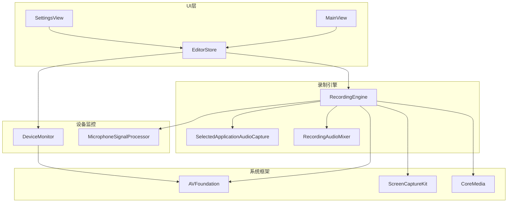
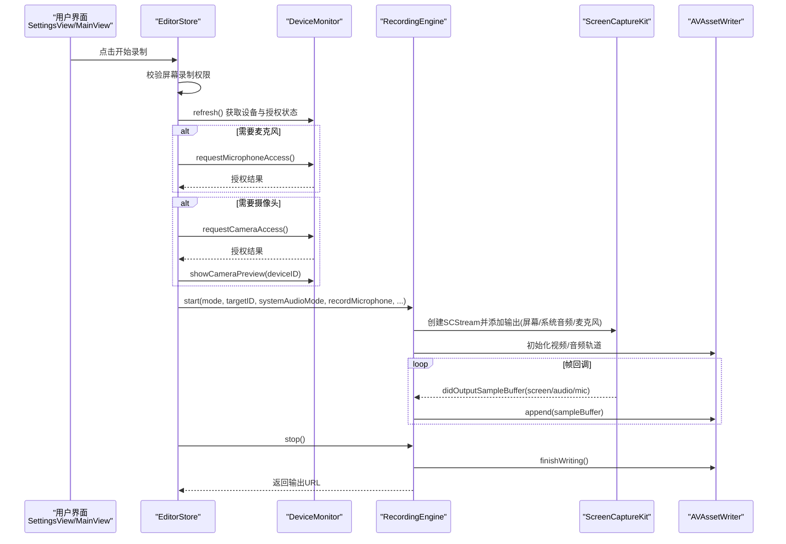
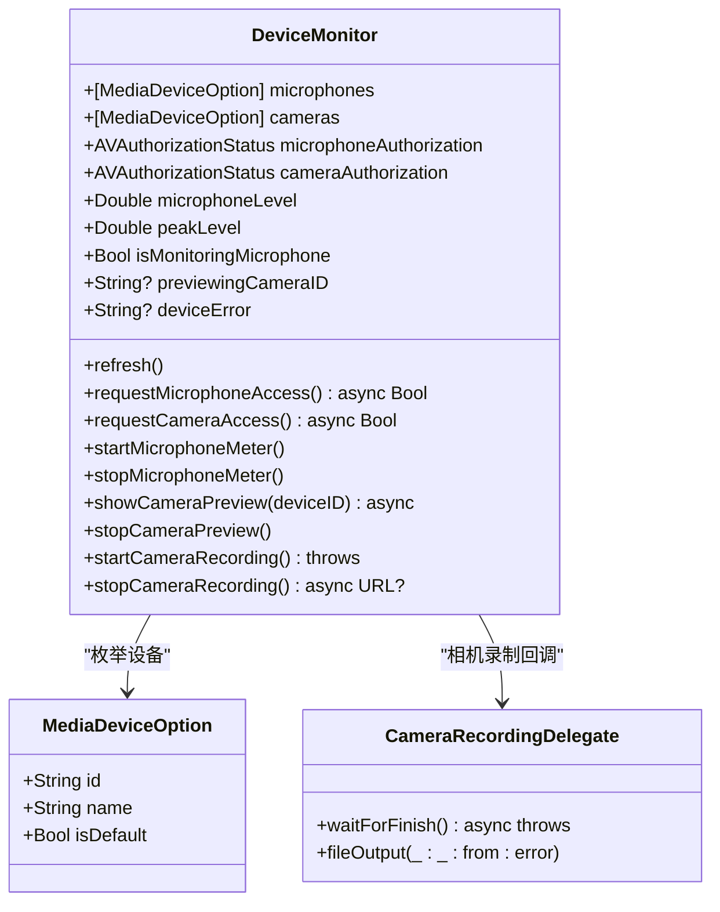
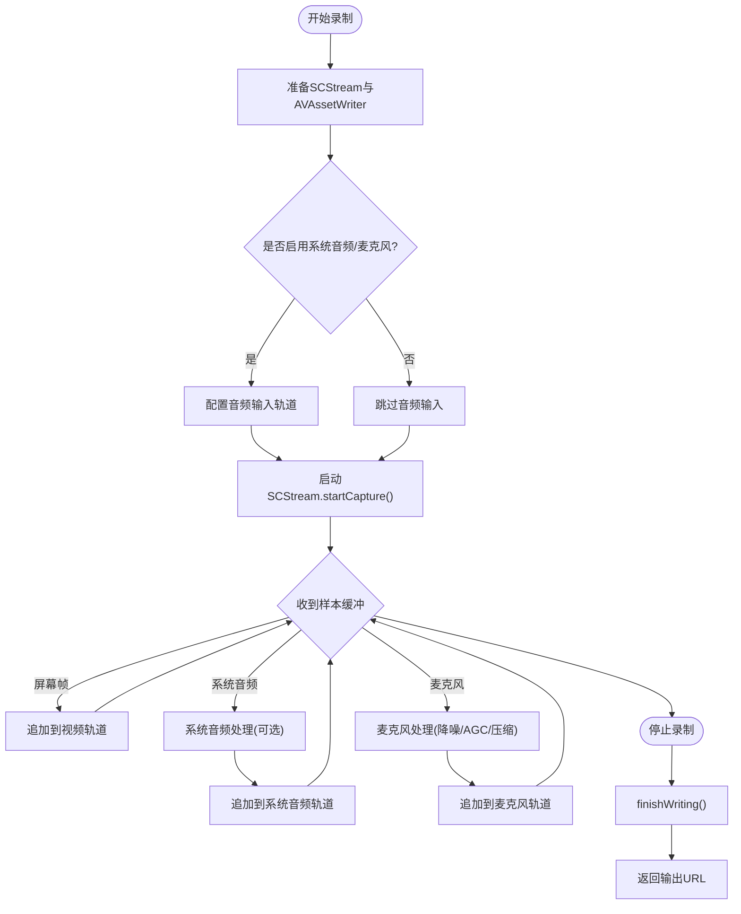
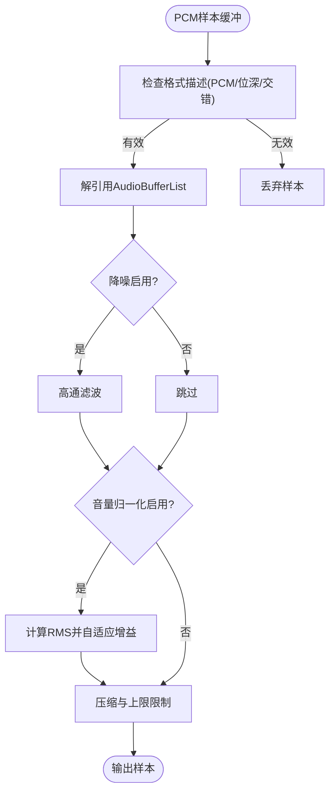
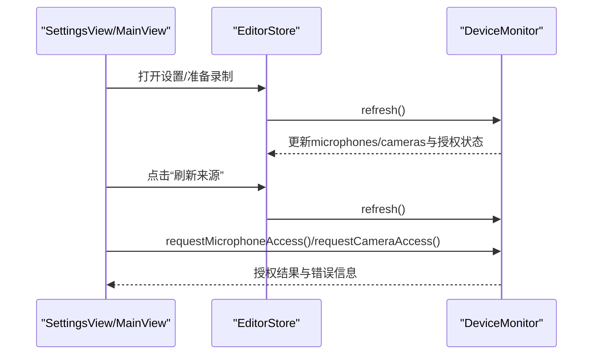
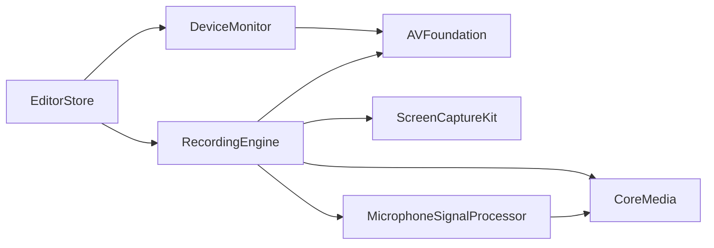
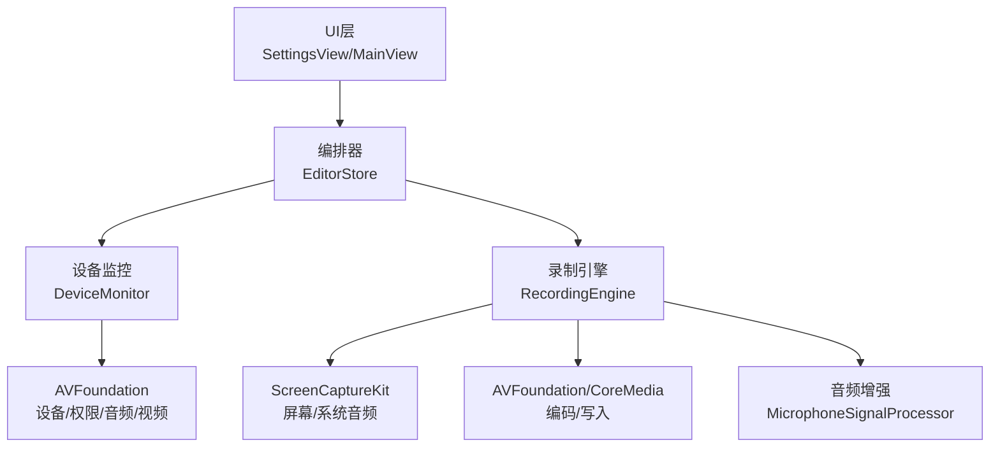

# 设备监控数据流

<cite>
**本文引用的文件**   
- [DeviceMonitor.swift](file://Sources/ScreenFree/DeviceMonitor.swift)
- [RecordingEngine.swift](file://Sources/ScreenFree/RecordingEngine.swift)
- [MicrophoneSignalProcessor.swift](file://Sources/ScreenFree/MicrophoneSignalProcessor.swift)
- [AudioAnalyzer.swift](file://Sources/ScreenFree/AudioAnalyzer.swift)
- [SettingsView.swift](file://Sources/ScreenFree/SettingsView.swift)
- [EditorStore.swift](file://Sources/ScreenFree/EditorStore.swift)
- [MainView.swift](file://Sources/ScreenFree/MainView.swift)
- [DeviceMonitorTests.swift](file://Tests/ScreenFreeMediaTests/DeviceMonitorTests.swift)
</cite>

## 目录
1. [简介](#简介)
2. [项目结构](#项目结构)
3. [核心组件](#核心组件)
4. [架构总览](#架构总览)
5. [详细组件分析](#详细组件分析)
6. [依赖关系分析](#依赖关系分析)
7. [性能考量](#性能考量)
8. [故障排查指南](#故障排查指南)
9. [结论](#结论)
10. [附录](#附录)

## 简介
本文件面向 ScreenFree 的设备监控与录制子系统，系统性说明 DeviceMonitor 如何监听并管理显示、音频（麦克风）、摄像头设备的状态变化与权限，以及 RecordingEngine 如何根据设备状态调整录制配置。文档包含：
- 设备连接断开、分辨率变化、权限变更等事件的处理流程
- 屏幕录制、系统音频、麦克风、摄像头的权限检查与请求路径
- 设备监控架构图与关键调用时序图
- 性能与错误处理建议

## 项目结构
本项目采用 SwiftUI + AVFoundation + ScreenCaptureKit 的组合：
- DeviceMonitor 负责媒体设备发现、权限管理与实时信号监测（麦克风电平、摄像头预览/录制）
- RecordingEngine 基于 SCStream 进行屏幕/窗口捕获，并通过 AVAssetWriter 写入音视频轨道
- MicrophoneSignalProcessor 提供降噪与自动增益/压缩等音频增强能力
- AudioAnalyzer 用于离线音频波形与峰值分析（辅助编辑与混音）
- EditorStore 协调 UI 与录制流程，统一发起权限检查与设备准备
- SettingsView 展示权限状态并提供刷新入口
- MainView 在启动前进行设备就绪性检查

图表来源
- [SettingsView.swift:26-62](file://Sources/ScreenFree/SettingsView.swift#L26-L62)
- [MainView.swift:2106-2137](file://Sources/ScreenFree/MainView.swift#L2106-L2137)
- [EditorStore.swift:500-699](file://Sources/ScreenFree/EditorStore.swift#L500-L699)
- [DeviceMonitor.swift:43-112](file://Sources/ScreenFree/DeviceMonitor.swift#L43-L112)
- [RecordingEngine.swift:63-117](file://Sources/ScreenFree/RecordingEngine.swift#L63-L117)

章节来源
- [SettingsView.swift:26-62](file://Sources/ScreenFree/SettingsView.swift#L26-L62)
- [MainView.swift:2106-2137](file://Sources/ScreenFree/MainView.swift#L2106-L2137)
- [EditorStore.swift:500-699](file://Sources/ScreenFree/EditorStore.swift#L500-L699)

## 核心组件
- DeviceMonitor
  - 职责：枚举可用麦克风和摄像头、维护授权状态、实时采集麦克风电平、摄像头预览与录制
  - 关键状态：microphones/cameras、microphoneAuthorization/cameraAuthorization、microphoneLevel/peakLevel、isMonitoringMicrophone、previewingCameraID、deviceError
  - 关键方法：refresh()、requestMicrophoneAccess()/requestCameraAccess()、startMicrophoneMeter()/stopMicrophoneMeter()、showCameraPreview()/stopCameraPreview()、startCameraRecording()/stopCameraRecording()
- RecordingEngine
  - 职责：基于 SCStream 捕获屏幕/窗口与系统音频，按需开启麦克风输入，使用 AVAssetWriter 写入 MP4，支持“按应用选择”的独立音频录制与后期混音
  - 关键方法：availableTargets(for:)、thumbnail(for:)、start(...)/stop()、SCStreamOutput.stream(_:didOutputSampleBuffer:of:)
- MicrophoneSignalProcessor
  - 职责：对 PCM 音频进行降噪、自动增益、压缩与门限处理，支持不同预设（系统音频响度、麦克风响度）
- AudioAnalyzer
  - 职责：离线分析音频文件的波形、RMS、峰值与时间轴包络，供编辑与混音使用

章节来源
- [DeviceMonitor.swift:43-112](file://Sources/ScreenFree/DeviceMonitor.swift#L43-L112)
- [RecordingEngine.swift:63-117](file://Sources/ScreenFree/RecordingEngine.swift#L63-L117)
- [MicrophoneSignalProcessor.swift:6-76](file://Sources/ScreenFree/MicrophoneSignalProcessor.swift#L6-L76)
- [AudioAnalyzer.swift:5-45](file://Sources/ScreenFree/AudioAnalyzer.swift#L5-L45)

## 架构总览
下图展示了从 UI 到设备监控与录制引擎的数据与控制流，包括权限检查、设备发现、流式采样与写入的关键路径。

图表来源
- [EditorStore.swift:500-699](file://Sources/ScreenFree/EditorStore.swift#L500-L699)
- [DeviceMonitor.swift:69-112](file://Sources/ScreenFree/DeviceMonitor.swift#L69-L112)
- [RecordingEngine.swift:174-392](file://Sources/ScreenFree/RecordingEngine.swift#L174-L392)
- [RecordingEngine.swift:445-489](file://Sources/ScreenFree/RecordingEngine.swift#L445-L489)

## 详细组件分析

### DeviceMonitor：设备监控与权限管理
- 设备发现与刷新
  - 通过 AVCaptureDevice.DiscoverySession 枚举麦克风和摄像头，标记默认设备
  - 每次刷新会更新 microphones/cameras 列表与授权状态
- 权限检查与请求
  - 使用 AVCaptureDevice.requestAccess(for:) 分别请求麦克风与摄像头权限
  - 设置 deviceError 提示用户当前操作所需的权限
- 麦克风信号监测
  - 使用 AVAudioEngine 的 inputNode 安装 tap，计算 RMS 与峰值，平滑后发布 microphoneLevel/peakLevel
  - 提供 audioSignalState 判断静音/良好/削波
- 摄像头预览与录制
  - 通过 AVCaptureSession 配置输入输出，支持预览与直接写入 .mov
  - 使用 CameraRecordingDelegate 异步等待录制完成

图表来源
- [DeviceMonitor.swift:43-112](file://Sources/ScreenFree/DeviceMonitor.swift#L43-L112)
- [DeviceMonitor.swift:287-324](file://Sources/ScreenFree/DeviceMonitor.swift#L287-L324)

章节来源
- [DeviceMonitor.swift:69-112](file://Sources/ScreenFree/DeviceMonitor.swift#L69-L112)
- [DeviceMonitor.swift:127-186](file://Sources/ScreenFree/DeviceMonitor.swift#L127-L186)
- [DeviceMonitor.swift:188-250](file://Sources/ScreenFree/DeviceMonitor.swift#L188-L250)
- [DeviceMonitor.swift:252-284](file://Sources/ScreenFree/DeviceMonitor.swift#L252-L284)
- [DeviceMonitorTests.swift:1-16](file://Tests/ScreenFreeMediaTests/DeviceMonitorTests.swift#L1-L16)

### RecordingEngine：屏幕/音频捕获与写入
- 目标发现与缩略图
  - 使用 SCShareableContent 枚举显示器与窗口，生成 CaptureTarget
  - 使用 SCScreenshotManager 生成缩略图
- 录制启动流程
  - 根据模式（全屏/区域/窗口）构建 SCContentFilter 与 SCStreamConfiguration
  - 初始化 AVAssetWriter 与视频/系统音频/麦克风输入轨道
  - 可选启用 SelectedApplicationAudioCapture 单独录制选定应用的音频
- 帧回调处理
  - 实现 SCStreamOutput.stream(_:didOutputSampleBuffer:of:)，将屏幕帧与音频样本追加到对应轨道
  - 首次视频帧时启动 writer 会话，确保时间戳顺序正确
- 停止与收尾
  - 停止 SCStream，关闭独立音频录制（如有），finishWriting 合并轨道并返回输出 URL

图表来源
- [RecordingEngine.swift:174-392](file://Sources/ScreenFree/RecordingEngine.swift#L174-L392)
- [RecordingEngine.swift:445-489](file://Sources/ScreenFree/RecordingEngine.swift#L445-L489)
- [RecordingEngine.swift:533-674](file://Sources/ScreenFree/RecordingEngine.swift#L533-L674)

章节来源
- [RecordingEngine.swift:85-117](file://Sources/ScreenFree/RecordingEngine.swift#L85-L117)
- [RecordingEngine.swift:174-392](file://Sources/ScreenFree/RecordingEngine.swift#L174-L392)
- [RecordingEngine.swift:445-489](file://Sources/ScreenFree/RecordingEngine.swift#L445-L489)
- [RecordingEngine.swift:533-674](file://Sources/ScreenFree/RecordingEngine.swift#L533-L674)

### MicrophoneSignalProcessor：音频增强管线
- 支持的增强项：降噪（高通滤波）、自动增益控制（AGC）、压缩与输出上限限制
- 输入格式兼容：支持 32-bit float 与 16-bit signed integer，非交错/交错布局
- 多通道状态维护：为每个声道维护历史输入/输出与自动增益状态

图表来源
- [MicrophoneSignalProcessor.swift:95-207](file://Sources/ScreenFree/MicrophoneSignalProcessor.swift#L95-L207)
- [MicrophoneSignalProcessor.swift:224-318](file://Sources/ScreenFree/MicrophoneSignalProcessor.swift#L224-L318)

章节来源
- [MicrophoneSignalProcessor.swift:6-76](file://Sources/ScreenFree/MicrophoneSignalProcessor.swift#L6-L76)
- [MicrophoneSignalProcessor.swift:95-207](file://Sources/ScreenFree/MicrophoneSignalProcessor.swift#L95-L207)
- [MicrophoneSignalProcessor.swift:224-318](file://Sources/ScreenFree/MicrophoneSignalProcessor.swift#L224-L318)

### 设备权限检查与请求流程
- 屏幕录制权限：由 EditorStore 在开始录制前检查，必要时触发系统授权
- 麦克风权限：DeviceMonitor.requestMicrophoneAccess() 调用系统授权；UI 中 SettingsView 展示授权状态
- 摄像头权限：DeviceMonitor.requestCameraAccess() 调用系统授权；如需画中画，需先 showCameraPreview 确认设备就绪
- 主界面检查：MainView 在启动前汇总各项权限与设备就绪情况

图表来源
- [SettingsView.swift:26-62](file://Sources/ScreenFree/SettingsView.swift#L26-L62)
- [MainView.swift:2106-2137](file://Sources/ScreenFree/MainView.swift#L2106-L2137)
- [EditorStore.swift:500-699](file://Sources/ScreenFree/EditorStore.swift#L500-L699)
- [DeviceMonitor.swift:69-112](file://Sources/ScreenFree/DeviceMonitor.swift#L69-L112)

章节来源
- [SettingsView.swift:26-62](file://Sources/ScreenFree/SettingsView.swift#L26-L62)
- [MainView.swift:2106-2137](file://Sources/ScreenFree/MainView.swift#L2106-L2137)
- [EditorStore.swift:500-699](file://Sources/ScreenFree/EditorStore.swift#L500-L699)
- [DeviceMonitor.swift:69-112](file://Sources/ScreenFree/DeviceMonitor.swift#L69-L112)

## 依赖关系分析
- DeviceMonitor 依赖 AVFoundation 进行设备枚举、权限查询与音频/视频采集
- RecordingEngine 依赖 ScreenCaptureKit 进行屏幕/窗口捕获与系统音频采集，依赖 AVFoundation/CoreMedia 进行编码与写入
- MicrophoneSignalProcessor 依赖 CoreMedia 与 AudioToolbox 进行 PCM 处理
- EditorStore 作为编排者，串联 UI、DeviceMonitor 与 RecordingEngine

图表来源
- [DeviceMonitor.swift:1-6](file://Sources/ScreenFree/DeviceMonitor.swift#L1-L6)
- [RecordingEngine.swift:1-5](file://Sources/ScreenFree/RecordingEngine.swift#L1-L5)
- [MicrophoneSignalProcessor.swift:1-5](file://Sources/ScreenFree/MicrophoneSignalProcessor.swift#L1-L5)

章节来源
- [DeviceMonitor.swift:1-6](file://Sources/ScreenFree/DeviceMonitor.swift#L1-L6)
- [RecordingEngine.swift:1-5](file://Sources/ScreenFree/RecordingEngine.swift#L1-L5)
- [MicrophoneSignalProcessor.swift:1-5](file://Sources/ScreenFree/MicrophoneSignalProcessor.swift#L1-L5)

## 性能考量
- 屏幕帧过滤：仅处理完整帧（SCFrameStatus.complete），避免不完整帧导致写入失败或画面撕裂
- 队列与线程：captureQueue 设置为 userInteractive QoS，保证低延迟；音频处理在专用队列中进行
- 音频处理优化：MicrophoneSignalProcessor 对浮点与整型样本分别处理，避免不必要的转换；AGC 使用指数平滑降低抖动
- 写入策略：首次视频帧才启动 writer 会话，确保时间戳对齐；音频样本可能早于首帧到达，需做时间戳校验
- 资源释放：停止录制时及时移除 tap、停止引擎、清理 session 输入输出，避免内存泄漏

[本节为通用性能指导，不直接分析具体文件]

## 故障排查指南
- 摄像头未就绪即尝试录制
  - 现象：抛出“所选摄像头未准备好”的错误
  - 排查：确保已调用 showCameraPreview 且 previewingCameraID 匹配；检查 cameraAuthorization 为 authorized
  - 参考：[DeviceMonitorTests.swift:1-16](file://Tests/ScreenFreeMediaTests/DeviceMonitorTests.swift#L1-L16)
- 麦克风权限不足
  - 现象：无法测试输入或录制麦克风
  - 排查：调用 requestMicrophoneAccess() 并刷新授权状态；UI 中查看“麦克风访问”状态
  - 参考：[DeviceMonitor.swift:102-112](file://Sources/ScreenFree/DeviceMonitor.swift#L102-L112)、[SettingsView.swift:26-62](file://Sources/ScreenFree/SettingsView.swift#L26-L62)
- 摄像头权限不足
  - 现象：无法预览或录制画中画
  - 排查：调用 requestCameraAccess()；若设备断开，refresh() 重新枚举
  - 参考：[DeviceMonitor.swift:108-112](file://Sources/ScreenFree/DeviceMonitor.swift#L108-L112)
- 录制无法结束或写入失败
  - 现象：stop() 抛出“无法完成写入”或 writerFailed
  - 排查：检查 writer.status 与 error；确认所有输入已 markAsFinished；确认时间戳顺序正确
  - 参考：[RecordingEngine.swift:394-443](file://Sources/ScreenFree/RecordingEngine.swift#L394-L443)
- 无可用屏幕或窗口源
  - 现象：availableTargets 为空或 start 抛出 noSource
  - 排查：确认至少有一个显示器或可见窗口；检查 onScreenWindowsOnly 过滤条件
  - 参考：[RecordingEngine.swift:85-117](file://Sources/ScreenFree/RecordingEngine.swift#L85-L117)

章节来源
- [DeviceMonitorTests.swift:1-16](file://Tests/ScreenFreeMediaTests/DeviceMonitorTests.swift#L1-L16)
- [DeviceMonitor.swift:102-112](file://Sources/ScreenFree/DeviceMonitor.swift#L102-L112)
- [SettingsView.swift:26-62](file://Sources/ScreenFree/SettingsView.swift#L26-L62)
- [RecordingEngine.swift:394-443](file://Sources/ScreenFree/RecordingEngine.swift#L394-L443)
- [RecordingEngine.swift:85-117](file://Sources/ScreenFree/RecordingEngine.swift#L85-L117)

## 结论
ScreenFree 的设备监控与录制子系统以 DeviceMonitor 和 RecordingEngine 为核心，前者负责设备枚举、权限管理与实时信号监测，后者负责屏幕/音频捕获与编码写入。EditorStore 作为编排者，统一驱动权限检查、设备准备与录制生命周期。通过清晰的权限流程、严格的帧与时间戳校验、以及可插拔的音频增强管线，系统在易用性与稳定性之间取得平衡。建议在复杂场景下增加设备热插拔监听与更细粒度的错误分类，以提升用户体验与可维护性。

[本节为总结性内容，不直接分析具体文件]

## 附录
- 设备监控架构图（概念）

[本图为概念性示意，不映射具体代码结构]