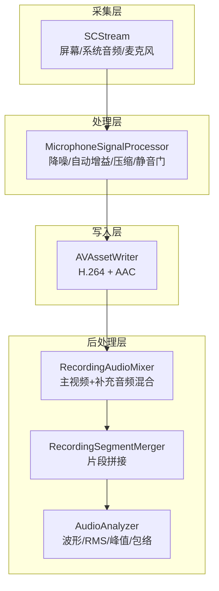
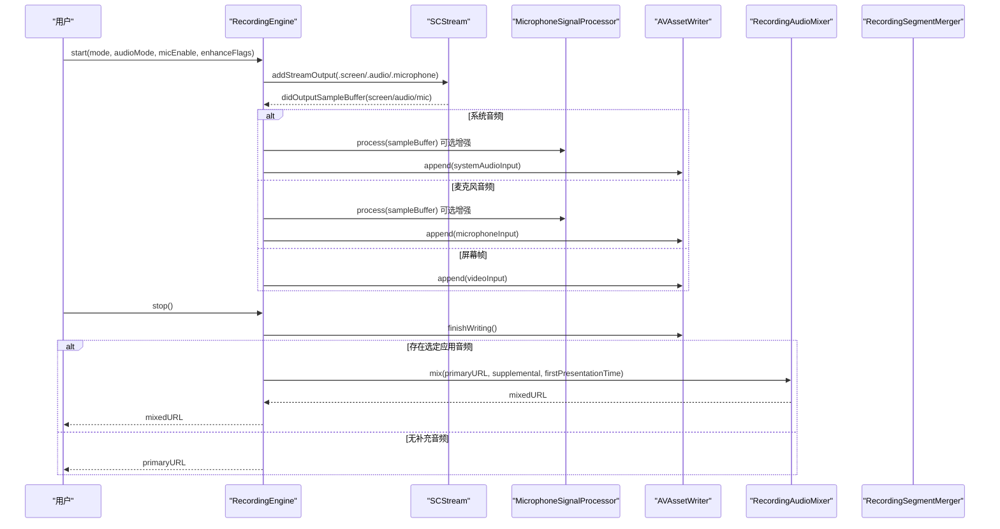
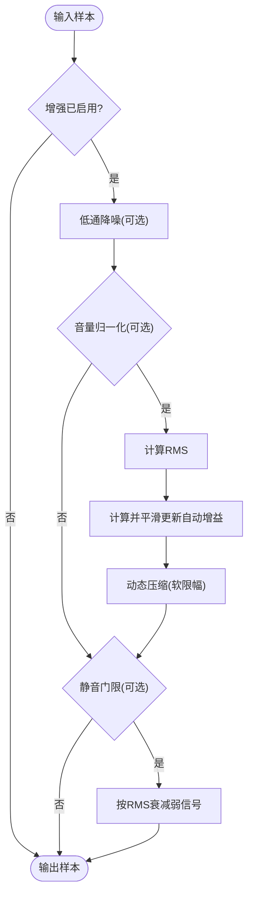
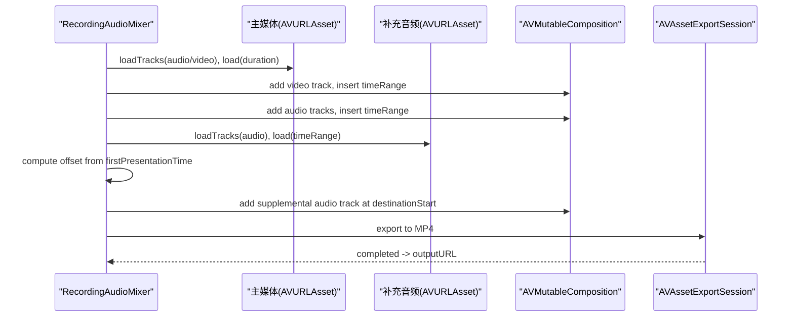
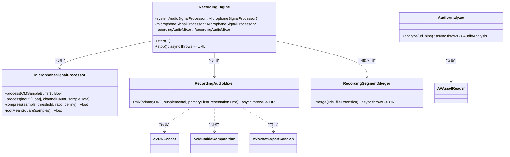

# 音频处理数据流

<cite>
**本文引用的文件**   
- [RecordingEngine.swift](file://Sources/ScreenFree/RecordingEngine.swift)
- [MicrophoneSignalProcessor.swift](file://Sources/ScreenFree/MicrophoneSignalProcessor.swift)
- [RecordingAudioMixer.swift](file://Sources/ScreenFree/RecordingAudioMixer.swift)
- [AudioAnalyzer.swift](file://Sources/ScreenFree/AudioAnalyzer.swift)
- [RecordingSegmentMerger.swift](file://Sources/ScreenFree/RecordingSegmentMerger.swift)
- [MicrophoneSignalProcessorTests.swift](file://Tests/ScreenFreeMediaTests/MicrophoneSignalProcessorTests.swift)
</cite>

## 目录
1. [简介](#简介)
2. [项目结构](#项目结构)
3. [核心组件](#核心组件)
4. [架构总览](#架构总览)
5. [详细组件分析](#详细组件分析)
6. [依赖关系分析](#依赖关系分析)
7. [性能考量](#性能考量)
8. [故障排查指南](#故障排查指南)
9. [结论](#结论)
10. [附录](#附录)

## 简介
本文件系统性梳理 ScreenFree 的音频处理数据流，覆盖系统音频、麦克风音频与“选定应用音频”的独立采集、实时增强与最终合成路径。重点说明：
- 采样率设置与音频格式编码（PCM 输入、AAC 编码输出）
- 实时信号处理流程（降噪、自动增益、压缩、静音门限）
- MicrophoneSignalProcessor 的增强管线实现
- RecordingAudioMixer 的多音轨混合与时戳同步策略
- 完整的音频处理管道图，展示从采集到合成的端到端流程

## 项目结构
与音频处理相关的关键源文件位于 Sources/ScreenFree 下，测试用例位于 Tests/ScreenFreeMediaTests。整体组织以功能模块划分：
- 录制引擎与流式写入：RecordingEngine.swift
- 音频增强处理器：MicrophoneSignalProcessor.swift
- 多音轨混音器：RecordingAudioMixer.swift
- 音频分析与波形统计：AudioAnalyzer.swift
- 片段合并工具：RecordingSegmentMerger.swift
- 处理器行为验证：MicrophoneSignalProcessorTests.swift

图表来源
- [RecordingEngine.swift:174-392](file://Sources/ScreenFree/RecordingEngine.swift#L174-L392)
- [MicrophoneSignalProcessor.swift:78-356](file://Sources/ScreenFree/MicrophoneSignalProcessor.swift#L78-L356)
- [RecordingAudioMixer.swift:29-136](file://Sources/ScreenFree/RecordingAudioMixer.swift#L29-L136)
- [RecordingSegmentMerger.swift:24-120](file://Sources/ScreenFree/RecordingSegmentMerger.swift#L24-L120)
- [AudioAnalyzer.swift:110-332](file://Sources/ScreenFree/AudioAnalyzer.swift#L110-L332)

章节来源
- [RecordingEngine.swift:174-392](file://Sources/ScreenFree/RecordingEngine.swift#L174-L392)
- [RecordingAudioMixer.swift:29-136](file://Sources/ScreenFree/RecordingAudioMixer.swift#L29-L136)
- [MicrophoneSignalProcessor.swift:78-356](file://Sources/ScreenFree/MicrophoneSignalProcessor.swift#L78-L356)
- [AudioAnalyzer.swift:110-332](file://Sources/ScreenFree/AudioAnalyzer.swift#L110-L332)
- [RecordingSegmentMerger.swift:24-120](file://Sources/ScreenFree/RecordingSegmentMerger.swift#L24-L120)

## 核心组件
- 录制引擎（RecordingEngine）
  - 负责创建 SCStream，配置屏幕、系统音频、麦克风的采集参数；初始化 AVAssetWriter 及多个 AVAssetWriterInput（视频、系统音频、麦克风音频）。
  - 在回调中按输出类型分发样本缓冲，必要时通过 MicrophoneSignalProcessor 进行实时增强，再写入对应输入轨道。
  - 支持“选定应用音频”的独立捕获与后期混合。
- 音频增强处理器（MicrophoneSignalProcessor）
  - 对 CMSampleBuffer 中的 PCM 数据进行通道解析与格式转换（Float32/Int16），执行降噪、自动增益、压缩与静音门限等增强步骤。
  - 提供可配置的增强设置（如降噪开关、音量归一化目标 RMS、增益上下限、压缩阈值与比例、输出上限等）。
- 混音器（RecordingAudioMixer）
  - 将主录制的 MP4（含视频与系统/麦克风音轨）与“选定应用音频”的 M4A 补充音轨进行时间对齐与混合，生成最终 MP4。
- 音频分析器（AudioAnalyzer）
  - 读取媒体文件的各音频轨道，计算 RMS、峰值、波形与每轨峰值包络，用于 UI 显示与后续处理建议。
- 片段合并器（RecordingSegmentMerger）
  - 将多次录制片段按时间顺序拼接为单一媒体文件，保持音视频轨道对齐。

章节来源
- [RecordingEngine.swift:174-392](file://Sources/ScreenFree/RecordingEngine.swift#L174-L392)
- [MicrophoneSignalProcessor.swift:78-356](file://Sources/ScreenFree/MicrophoneSignalProcessor.swift#L78-L356)
- [RecordingAudioMixer.swift:29-136](file://Sources/ScreenFree/RecordingAudioMixer.swift#L29-L136)
- [AudioAnalyzer.swift:110-332](file://Sources/ScreenFree/AudioAnalyzer.swift#L110-L332)
- [RecordingSegmentMerger.swift:24-120](file://Sources/ScreenFree/RecordingSegmentMerger.swift#L24-L120)

## 架构总览
下图展示了三种音频源的采集、处理与合成路径，以及关键的时间戳同步点。

图表来源
- [RecordingEngine.swift:174-392](file://Sources/ScreenFree/RecordingEngine.swift#L174-L392)
- [RecordingEngine.swift:445-489](file://Sources/ScreenFree/RecordingEngine.swift#L445-L489)
- [RecordingAudioMixer.swift:29-136](file://Sources/ScreenFree/RecordingAudioMixer.swift#L29-L136)

章节来源
- [RecordingEngine.swift:174-392](file://Sources/ScreenFree/RecordingEngine.swift#L174-L392)
- [RecordingEngine.swift:445-489](file://Sources/ScreenFree/RecordingEngine.swift#L445-L489)
- [RecordingAudioMixer.swift:29-136](file://Sources/ScreenFree/RecordingAudioMixer.swift#L29-L136)

## 详细组件分析

### 音频采样率与格式编码
- 采集阶段
  - 屏幕/系统音频/麦克风统一使用 48kHz、双声道、线性 PCM 作为内部处理格式（CMSampleBuffer 中的 AudioStreamBasicDescription 指示 kAudioFormatLinearPCM）。
  - SCStreamConfiguration.sampleRate 设置为 48_000，channelCount 设置为 2。
- 写入阶段
  - AVAssetWriterInput 的音频编码器设置为 MPEG4 AAC，采样率 48_000，声道数 2，比特率 192kbps。
  - 视频编码器为 H.264，分辨率由所选目标决定。
- 分析阶段
  - AudioAnalyzer 使用 AVAssetReaderTrackOutput 以 32-bit Float PCM 解码各轨道，计算 RMS、峰值与波形包络。

章节来源
- [RecordingEngine.swift:201-207](file://Sources/ScreenFree/RecordingEngine.swift#L201-L207)
- [RecordingEngine.swift:301-312](file://Sources/ScreenFree/RecordingEngine.swift#L301-L312)
- [AudioAnalyzer.swift:200-210](file://Sources/ScreenFree/AudioAnalyzer.swift#L200-L210)

### 系统音频、麦克风音频与应用程序音频的独立处理流程
- 系统音频
  - 当系统音频模式为“全部应用”时，SCStream 输出 .audio 类型的 CMSampleBuffer。
  - 若启用系统音频响度增强，则先经 MicrophoneSignalProcessor（使用 systemAudioLoudness 预设）处理，再写入系统音频输入轨道。
- 麦克风音频
  - 当开启麦克风录制时，SCStream 输出 .microphone 类型的 CMSampleBuffer。
  - 若启用降噪或音量归一化，则经 MicrophoneSignalProcessor（使用 microphoneLoudness 预设）处理，再写入麦克风输入轨道。
- 应用程序音频（选定应用）
  - 当系统音频模式为“选定应用”时，使用独立的 SelectedApplicationAudioCapture 单独捕获该应用的音频并写入 M4A 文件。
  - 录制结束后，通过 RecordingAudioMixer 将主录制的 MP4 与该补充音频进行时间对齐混合，得到最终输出。

章节来源
- [RecordingEngine.swift:174-392](file://Sources/ScreenFree/RecordingEngine.swift#L174-L392)
- [RecordingEngine.swift:445-489](file://Sources/ScreenFree/RecordingEngine.swift#L445-L489)
- [RecordingEngine.swift:533-674](file://Sources/ScreenFree/RecordingEngine.swift#L533-L674)
- [RecordingAudioMixer.swift:29-136](file://Sources/ScreenFree/RecordingAudioMixer.swift#L29-L136)

### MicrophoneSignalProcessor 增强管线
MicrophoneSignalProcessor 对每个通道的 Float 样本执行以下处理步骤（按顺序）：
1. 低通降噪（可选）
   - 基于 RC 滤波器的简单低通滤波器，截止频率约 80Hz，抑制低频噪声。
2. 自动增益与音量归一化（可选）
   - 计算当前块 RMS，根据目标 RMS 计算期望增益，采用平滑响应更新自动增益。
   - 对样本乘以自动增益，随后进入压缩器限制峰值。
3. 动态压缩（可选）
   - 使用 tanh 软压缩曲线，避免硬削波，输出上限由 ceiling 控制。
4. 静音门限扩展（可选）
   - 在自动增益之后，根据 RMS 与门限判断是否衰减弱信号，防止噪声被放大。

图表来源
- [MicrophoneSignalProcessor.swift:224-318](file://Sources/ScreenFree/MicrophoneSignalProcessor.swift#L224-L318)
- [MicrophoneSignalProcessor.swift:320-342](file://Sources/ScreenFree/MicrophoneSignalProcessor.swift#L320-L342)
- [MicrophoneSignalProcessor.swift:344-354](file://Sources/ScreenFree/MicrophoneSignalProcessor.swift#L344-L354)

章节来源
- [MicrophoneSignalProcessor.swift:78-356](file://Sources/ScreenFree/MicrophoneSignalProcessor.swift#L78-L356)
- [MicrophoneSignalProcessorTests.swift:7-150](file://Tests/ScreenFreeMediaTests/MicrophoneSignalProcessorTests.swift#L7-L150)

### RecordingAudioMixer 多音轨混合与时戳同步
- 输入
  - 主媒体 URL（MP4，包含视频与系统/麦克风音轨）
  - 补充音频记录（M4A，仅音频）及其首帧呈现时间
  - 主媒体的首帧呈现时间（可选）
- 处理
  - 复制主媒体视频轨道至新组合媒体。
  - 复制主媒体所有音频轨道至新组合媒体。
  - 计算补充音频相对于主媒体的偏移量（offset = 补充首帧时间 - 主首帧时间），裁剪与插入相应时间范围。
  - 使用 AVAssetExportSession 以 Passthrough 预设导出最终 MP4。
- 输出
  - 混合后的 MP4 文件 URL。

图表来源
- [RecordingAudioMixer.swift:29-136](file://Sources/ScreenFree/RecordingAudioMixer.swift#L29-L136)

章节来源
- [RecordingAudioMixer.swift:29-136](file://Sources/ScreenFree/RecordingAudioMixer.swift#L29-L136)

### 音频分析与波形可视化
- AudioAnalyzer 读取媒体文件的各音频轨道，逐块计算 RMS、峰值，并构建归一化的波形数组。
- 同时维护每轨的峰值包络（按 bins 分布），用于多轨并发峰值估计。
- 提供推荐增益建议，结合 RMS 与峰值限制，确保输出不削波且达到目标响度。

章节来源
- [AudioAnalyzer.swift:110-332](file://Sources/ScreenFree/AudioAnalyzer.swift#L110-L332)

### 片段合并
- RecordingSegmentMerger 将多个录制片段按时间顺序拼接，保持视频与音频轨道对齐，输出单一 MP4/MOV。

章节来源
- [RecordingSegmentMerger.swift:24-120](file://Sources/ScreenFree/RecordingSegmentMerger.swift#L24-L120)

## 依赖关系分析
- RecordingEngine 依赖：
  - SCStream（屏幕/音频/麦克风采集）
  - AVAssetWriter/AVAssetWriterInput（实时写入）
  - MicrophoneSignalProcessor（可选增强）
  - RecordingAudioMixer（可选混合）
  - SelectedApplicationAudioCapture（独立应用音频捕获）
- RecordingAudioMixer 依赖：
  - AVURLAsset、AVMutableComposition、AVAssetExportSession
- MicrophoneSignalProcessor 依赖：
  - CoreMedia/AudioToolbox（CMSampleBuffer、AudioStreamBasicDescription、CMBlockBuffer）
- AudioAnalyzer 依赖：
  - AVFoundation（AVAssetReader/AVAssetReaderTrackOutput）

图表来源
- [RecordingEngine.swift:63-82](file://Sources/ScreenFree/RecordingEngine.swift#L63-L82)
- [MicrophoneSignalProcessor.swift:78-356](file://Sources/ScreenFree/MicrophoneSignalProcessor.swift#L78-L356)
- [RecordingAudioMixer.swift:29-136](file://Sources/ScreenFree/RecordingAudioMixer.swift#L29-L136)
- [AudioAnalyzer.swift:110-332](file://Sources/ScreenFree/AudioAnalyzer.swift#L110-L332)
- [RecordingSegmentMerger.swift:24-120](file://Sources/ScreenFree/RecordingSegmentMerger.swift#L24-L120)

章节来源
- [RecordingEngine.swift:63-82](file://Sources/ScreenFree/RecordingEngine.swift#L63-L82)
- [RecordingAudioMixer.swift:29-136](file://Sources/ScreenFree/RecordingAudioMixer.swift#L29-L136)
- [MicrophoneSignalProcessor.swift:78-356](file://Sources/ScreenFree/MicrophoneSignalProcessor.swift#L78-L356)
- [AudioAnalyzer.swift:110-332](file://Sources/ScreenFree/AudioAnalyzer.swift#L110-L332)
- [RecordingSegmentMerger.swift:24-120](file://Sources/ScreenFree/RecordingSegmentMerger.swift#L24-L120)

## 性能考量
- 实时性
  - 所有音频处理均在采集回调队列中进行，避免阻塞 UI。
  - 使用 expectsMediaDataInRealTime 标记 AVAssetWriterInput，确保低延迟写入。
- 内存与拷贝
  - MicrophoneSignalProcessor 直接操作 CMSampleBuffer 的底层缓冲区，减少不必要的数据拷贝。
  - AudioAnalyzer 使用 AVAssetReaderTrackOutput 的零拷贝选项（alwaysCopiesSampleData = false）提升效率。
- 编码与比特率
  - AAC 192kbps 在音质与体积之间取得平衡；H.264 码率根据分辨率自适应调整。
- 峰值与响度
  - 动态压缩与输出上限防止削波；自动增益平滑响应避免突变。

[本节为通用指导，不直接分析具体文件]

## 故障排查指南
- 无法开始写入
  - 检查 AVAssetWriter.canAdd(input) 与 writer.startWriting() 返回值。
  - 确认首次呈现时间正确，避免早于会话起始时间的音频样本导致失败。
- 混合失败
  - 确认主媒体包含视频轨道；补充音频的首帧时间有效。
  - 检查 AVAssetExportSession 的状态与错误信息。
- 增强无效
  - 确认 MicrophoneEnhancementSettings 已启用所需功能。
  - 验证输入样本格式为 PCM（Float32/Int16），否则处理将被跳过。
- 片段合并失败
  - 确保至少有一个片段；检查各片段的音视频轨道时间范围。

章节来源
- [RecordingEngine.swift:301-326](file://Sources/ScreenFree/RecordingEngine.swift#L301-L326)
- [RecordingEngine.swift:445-489](file://Sources/ScreenFree/RecordingEngine.swift#L445-L489)
- [RecordingAudioMixer.swift:30-41](file://Sources/ScreenFree/RecordingAudioMixer.swift#L30-L41)
- [RecordingSegmentMerger.swift:24-32](file://Sources/ScreenFree/RecordingSegmentMerger.swift#L24-L32)

## 结论
ScreenFree 的音频处理数据流以高内聚、低耦合的方式组织：采集层通过 SCStream 统一获取屏幕、系统音频与麦克风音频；处理层通过 MicrophoneSignalProcessor 提供灵活的实时增强；写入层使用 AVAssetWriter 高效编码；后处理层通过 RecordingAudioMixer 与 RecordingSegmentMerger 完成混合与拼接。统一的 48kHz PCM 内部格式与 AAC 编码确保了音质与兼容性。整体设计兼顾实时性与可扩展性，适合复杂录制场景。

[本节为总结，不直接分析具体文件]

## 附录
- 关键参数参考
  - 采样率：48_000 Hz
  - 声道数：2
  - 输入格式：kAudioFormatLinearPCM（Float32/Int16）
  - 输出编码：kAudioFormatMPEG4AAC（192kbps）
  - 视频编码：H.264（码率自适应）
- 增强预设
  - systemAudioLoudness：提高对话响度，强压缩限制峰值
  - microphoneLoudness：针对人声优化，支持降噪与音量归一化

[本节为补充信息，不直接分析具体文件]