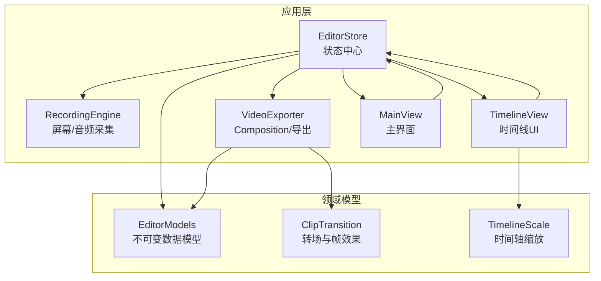
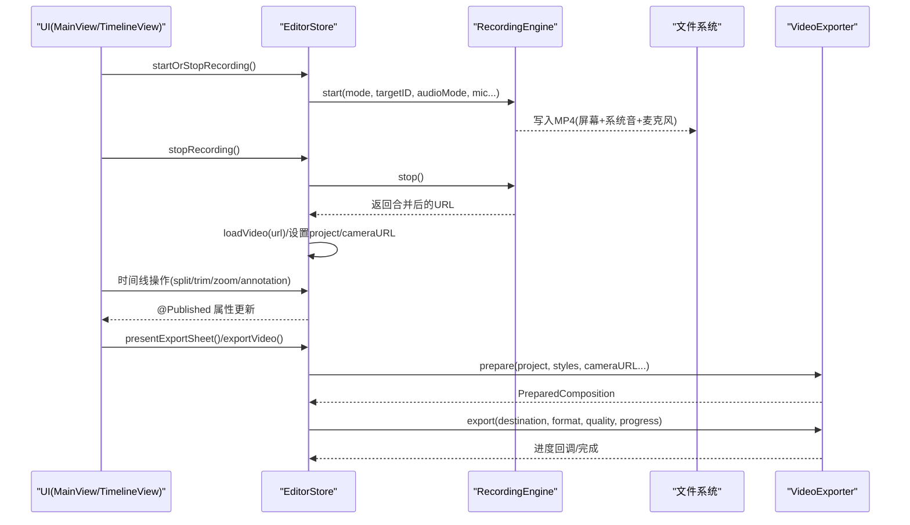
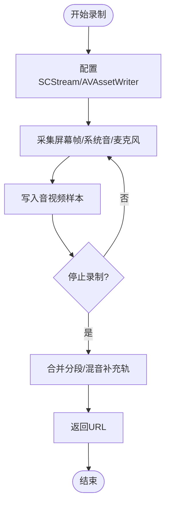
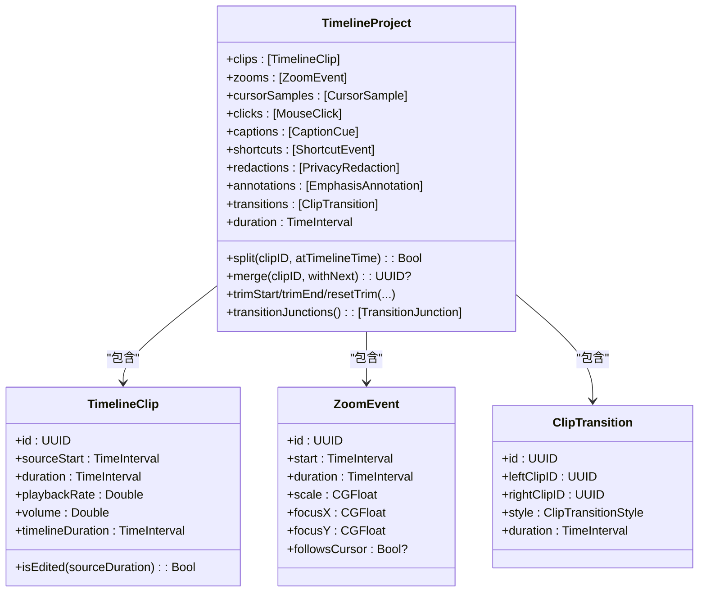
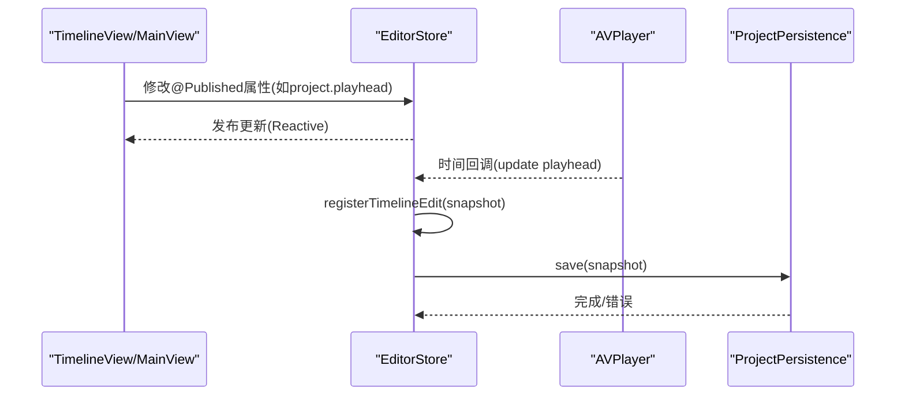
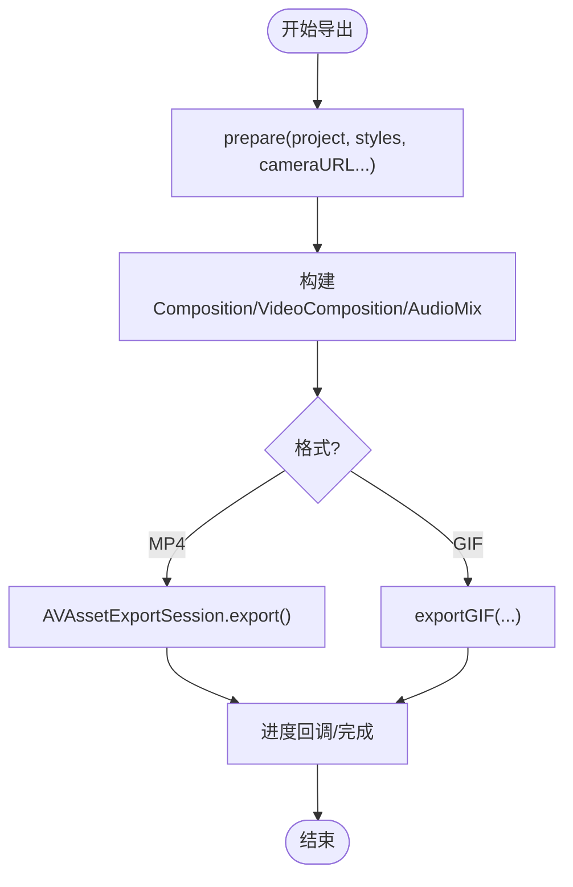
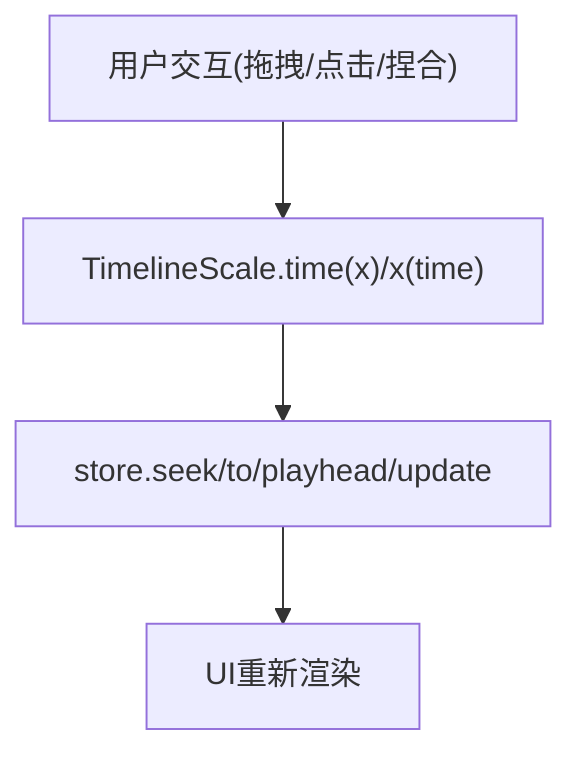
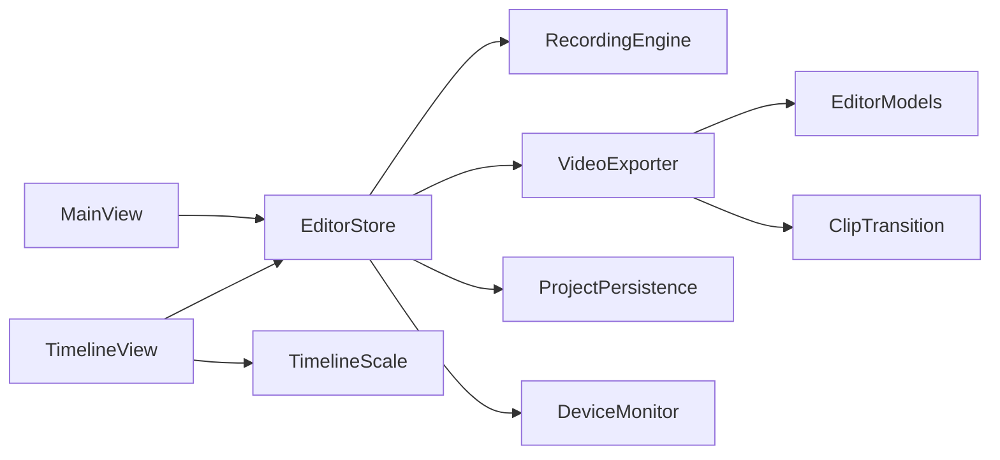

# 数据流设计

<cite>
**本文引用的文件**   
- [EditorStore.swift](file://Sources/ScreenFree/EditorStore.swift)
- [RecordingEngine.swift](file://Sources/ScreenFree/RecordingEngine.swift)
- [VideoExporter.swift](file://Sources/ScreenFree/VideoExporter.swift)
- [EditorModels.swift](file://Sources/ScreenFreeCore/EditorModels.swift)
- [ClipTransition.swift](file://Sources/ScreenFreeCore/ClipTransition.swift)
- [TimelineScale.swift](file://Sources/ScreenFreeCore/TimelineScale.swift)
- [ProjectPersistence.swift](file://Sources/ScreenFree/ProjectPersistence.swift)
- [TimelineView.swift](file://Sources/ScreenFree/TimelineView.swift)
- [MainView.swift](file://Sources/ScreenFree/MainView.swift)
</cite>

## 目录
1. [简介](#简介)
2. [项目结构](#项目结构)
3. [核心组件](#核心组件)
4. [架构总览](#架构总览)
5. [详细组件分析](#详细组件分析)
6. [依赖关系分析](#依赖关系分析)
7. [性能考量](#性能考量)
8. [故障排查指南](#故障排查指南)
9. [结论](#结论)
10. [附录](#附录)

## 简介
本文件面向 ScreenFree 的数据流设计，覆盖从“录制”到“时间线编辑”再到“导出”的完整数据路径。重点说明：
- 屏幕捕获数据的采集、编码与合并流程
- 基于不可变数据模型的时间线编辑与非破坏性编辑机制
- 状态管理与 @Published 属性的更新机制
- Combine 在响应式自动保存中的应用
- 导出阶段的数据转换（Composition、视频合成、音频混合、叠加层）
- 各组件间的数据传递与同步机制

## 项目结构
- ScreenFree（应用层）
  - EditorStore：全局状态中心，协调录制、播放、时间线、导出、持久化等
  - RecordingEngine：基于 ScreenCaptureKit 的实时采集与 AVAssetWriter 写入
  - VideoExporter：基于 AVFoundation 的 Composition 构建与导出
  - TimelineView / MainView：UI 层，通过 @ObservedObject 订阅 EditorStore
- ScreenFreeCore（领域模型）
  - EditorModels：TimelineProject、TimelineClip、ZoomEvent、CaptionCue、PrivacyRedaction、EmphasisAnnotation 等不可变数据结构
  - ClipTransition：转场模板与帧级效果计算
  - TimelineScale：时间轴缩放与坐标换算

图表来源
- [EditorStore.swift:30-376](file://Sources/ScreenFree/EditorStore.swift#L30-L376)
- [RecordingEngine.swift:63-117](file://Sources/ScreenFree/RecordingEngine.swift#L63-L117)
- [VideoExporter.swift:95-118](file://Sources/ScreenFree/VideoExporter.swift#L95-L118)
- [EditorModels.swift:274-306](file://Sources/ScreenFreeCore/EditorModels.swift#L274-L306)
- [ClipTransition.swift:1-42](file://Sources/ScreenFreeCore/ClipTransition.swift#L1-L42)
- [TimelineScale.swift:4-16](file://Sources/ScreenFreeCore/TimelineScale.swift#L4-L16)

章节来源
- [EditorStore.swift:30-376](file://Sources/ScreenFree/EditorStore.swift#L30-L376)
- [RecordingEngine.swift:63-117](file://Sources/ScreenFree/RecordingEngine.swift#L63-L117)
- [VideoExporter.swift:95-118](file://Sources/ScreenFree/VideoExporter.swift#L95-L118)
- [EditorModels.swift:274-306](file://Sources/ScreenFreeCore/EditorModels.swift#L274-L306)
- [ClipTransition.swift:1-42](file://Sources/ScreenFreeCore/ClipTransition.swift#L1-L42)
- [TimelineScale.swift:4-16](file://Sources/ScreenFreeCore/TimelineScale.swift#L4-L16)

## 核心组件
- EditorStore
  - 作为唯一的状态源，持有 project（TimelineProject）、sourceURL、cameraURL、playhead、isPlaying、export* 等大量 @Published 属性
  - 协调 RecordingEngine 进行录制，协调 VideoExporter 进行导出，协调 ProjectPersistence 进行自动保存
  - 维护时间线撤销/重做栈与连续编辑快照
- RecordingEngine
  - 使用 SCStream + AVAssetWriter 完成屏幕与系统/麦克风音频的实时写入
  - 支持区域/窗口/显示模式，可选独立应用音频流与音量归一化
- VideoExporter
  - 将 TimelineProject 转换为 AVMutableComposition，插入视频/音频轨道，应用缩放、转场、摄像头画中画、光标与字幕叠加
  - 提供 MP4/GIF 导出与逐帧渲染能力
- EditorModels（不可变数据）
  - TimelineProject 聚合 clips、zooms、captions、redactions、annotations、transitions 等
  - 所有编辑方法返回新实例或就地修改自身但保持内部一致性（如排序、裁剪、规范化）
- ClipTransition
  - 定义转场样式与按时间点计算的帧级效果（淡入淡出、闪白、缩放）
- TimelineScale
  - 统一时间轴时间与像素坐标的转换，支撑 UI 交互与滚动跟随策略

章节来源
- [EditorStore.swift:30-376](file://Sources/ScreenFree/EditorStore.swift#L30-L376)
- [RecordingEngine.swift:63-117](file://Sources/ScreenFree/RecordingEngine.swift#L63-L117)
- [VideoExporter.swift:95-118](file://Sources/ScreenFree/VideoExporter.swift#L95-L118)
- [EditorModels.swift:274-306](file://Sources/ScreenFreeCore/EditorModels.swift#L274-L306)
- [ClipTransition.swift:1-42](file://Sources/ScreenFreeCore/ClipTransition.swift#L1-L42)
- [TimelineScale.swift:4-16](file://Sources/ScreenFreeCore/TimelineScale.swift#L4-L16)

## 架构总览
整体数据流分为三个阶段：
- 录制阶段：EditorStore 驱动 RecordingEngine 采集屏幕与音频，输出原始媒体文件；结束后合并片段并加载为 sourceURL/cameraURL
- 编辑阶段：TimelineView 与 Inspector 通过 EditorStore 的 @Published 属性驱动不可变的 TimelineProject 变更；撤销/重做基于快照栈
- 导出阶段：VideoExporter 读取 sourceURL/cameraURL 与 TimelineProject，构建 Composition，应用转场与叠加层，输出最终文件

图表来源
- [EditorStore.swift:493-735](file://Sources/ScreenFree/EditorStore.swift#L493-L735)
- [RecordingEngine.swift:174-443](file://Sources/ScreenFree/RecordingEngine.swift#L174-L443)
- [VideoExporter.swift:103-590](file://Sources/ScreenFree/VideoExporter.swift#L103-L590)

章节来源
- [EditorStore.swift:493-735](file://Sources/ScreenFree/EditorStore.swift#L493-L735)
- [RecordingEngine.swift:174-443](file://Sources/ScreenFree/RecordingEngine.swift#L174-L443)
- [VideoExporter.swift:103-590](file://Sources/ScreenFree/VideoExporter.swift#L103-L590)

## 详细组件分析

### 录制数据流（屏幕与音频）
- 输入：用户选择捕获模式（显示/窗口/区域）、系统音频模式、是否录制麦克风、相机预览
- 处理：
  - RecordingEngine 配置 SCStream 与 AVAssetWriter，分别写入视频与多路音频
  - 可选独立应用音频流与音量归一化
  - 停止时合并分段，必要时混音系统音补充轨
- 输出：原始 MP4（可能包含多轨音频），供后续导入与导出

图表来源
- [RecordingEngine.swift:174-443](file://Sources/ScreenFree/RecordingEngine.swift#L174-L443)
- [RecordingEngine.swift:394-443](file://Sources/ScreenFree/RecordingEngine.swift#L394-L443)

章节来源
- [RecordingEngine.swift:174-443](file://Sources/ScreenFree/RecordingEngine.swift#L174-L443)

### 时间线编辑数据流（不可变模型与非破坏性编辑）
- 数据模型：TimelineProject 由多个不可变对象组成（clips、zooms、captions、redactions、annotations、transitions）
- 非破坏性编辑：
  - split/merge/trimStart/trimEnd/resetTrim 等方法不直接修改原素材，而是生成新的 TimelineClip 或调整范围
  - zooms/redactions/annotations/transitions 以时间区间形式存在，不影响源时间映射
- 撤销/重做：
  - EditorStore 维护 TimelineHistoryEntry 快照栈，记录 project 与选中项状态
  - 连续编辑（拖拽、范围调整）会合并为一次历史条目，避免碎片化

图表来源
- [EditorModels.swift:274-306](file://Sources/ScreenFreeCore/EditorModels.swift#L274-L306)
- [EditorModels.swift:467-522](file://Sources/ScreenFreeCore/EditorModels.swift#L467-L522)
- [ClipTransition.swift:22-42](file://Sources/ScreenFreeCore/ClipTransition.swift#L22-L42)

章节来源
- [EditorModels.swift:274-306](file://Sources/ScreenFreeCore/EditorModels.swift#L274-L306)
- [EditorModels.swift:467-522](file://Sources/ScreenFreeCore/EditorModels.swift#L467-L522)
- [ClipTransition.swift:22-42](file://Sources/ScreenFreeCore/ClipTransition.swift#L22-L42)

### 状态管理与 @Published 更新机制
- EditorStore 暴露大量 @Published 属性（project、playhead、isPlaying、export* 等），SwiftUI 视图通过 @ObservedObject 订阅
- 关键更新点：
  - 播放头：player 时间观察者驱动 playhead 更新
  - 录制状态：isRecording、isPreparingRecording、recordingCountdownRemaining
  - 导出状态：isExporting、exportProgress、isVideoExporting
  - 时间线工具：activeTimelineTool、selectedClipID、selectedZoomID 等
- 自动保存：
  - 使用 Combine 监听 @Published 变化，触发 ProjectPersistence.save，持久化 ScreenFreeProjectSnapshot

图表来源
- [EditorStore.swift:3397-3415](file://Sources/ScreenFree/EditorStore.swift#L3397-L3415)
- [EditorStore.swift:1693-1763](file://Sources/ScreenFree/EditorStore.swift#L1693-L1763)
- [ProjectPersistence.swift:94-120](file://Sources/ScreenFree/ProjectPersistence.swift#L94-L120)

章节来源
- [EditorStore.swift:3397-3415](file://Sources/ScreenFree/EditorStore.swift#L3397-L3415)
- [EditorStore.swift:1693-1763](file://Sources/ScreenFree/EditorStore.swift#L1693-L1763)
- [ProjectPersistence.swift:94-120](file://Sources/ScreenFree/ProjectPersistence.swift#L94-L120)

### 导出数据流（Composition 构建与渲染）
- 输入：sourceURL、cameraURL（可选）、backgroundMusicURL（可选）、CanvasRenderStyle、CameraOverlayStyle、TimelineProject
- 处理：
  - VideoExporter.prepare 构建 AVMutableComposition，插入视频/音频轨道，应用缩放、转场、画中画、光标与字幕叠加
  - 根据格式选择 MP4 或 GIF 导出路径
  - 进度回调通过 Task 轮询 AVAssetExportSession.progress
- 输出：目标文件（MP4/GIF），可带最大文件大小限制

图表来源
- [VideoExporter.swift:103-590](file://Sources/ScreenFree/VideoExporter.swift#L103-L590)

章节来源
- [VideoExporter.swift:103-590](file://Sources/ScreenFree/VideoExporter.swift#L103-L590)

### 时间线交互与缩放
- TimelineView 通过 TimelineScale 将时间转换为像素坐标，支持拖拽分割、范围创建、缩放控制
- 播放头跟随策略由 TimelinePlaybackFollowPolicy 决定，确保播放过程中时间轴滚动流畅

图表来源
- [TimelineScale.swift:18-40](file://Sources/ScreenFreeCore/TimelineScale.swift#L18-L40)
- [TimelineView.swift:16-115](file://Sources/ScreenFree/TimelineView.swift#L16-L115)

章节来源
- [TimelineScale.swift:18-40](file://Sources/ScreenFreeCore/TimelineScale.swift#L18-L40)
- [TimelineView.swift:16-115](file://Sources/ScreenFree/TimelineView.swift#L16-L115)

## 依赖关系分析
- EditorStore 依赖：
  - RecordingEngine（录制）
  - VideoExporter（导出）
  - ProjectPersistence（持久化）
  - DeviceMonitor（设备监控）
  - AVPlayer/AVPlayerItem（播放）
- 领域模型依赖：
  - EditorModels（不可变数据）
  - ClipTransition（转场计算）
  - TimelineScale（时间轴换算）
- UI 依赖：
  - MainView/TimelineView 通过 @ObservedObject 订阅 EditorStore

图表来源
- [EditorStore.swift:30-376](file://Sources/ScreenFree/EditorStore.swift#L30-L376)
- [VideoExporter.swift:95-118](file://Sources/ScreenFree/VideoExporter.swift#L95-L118)
- [ProjectPersistence.swift:81-120](file://Sources/ScreenFree/ProjectPersistence.swift#L81-L120)
- [TimelineScale.swift:4-16](file://Sources/ScreenFreeCore/TimelineScale.swift#L4-L16)

章节来源
- [EditorStore.swift:30-376](file://Sources/ScreenFree/EditorStore.swift#L30-L376)
- [VideoExporter.swift:95-118](file://Sources/ScreenFree/VideoExporter.swift#L95-L118)
- [ProjectPersistence.swift:81-120](file://Sources/ScreenFree/ProjectPersistence.swift#L81-L120)
- [TimelineScale.swift:4-16](file://Sources/ScreenFreeCore/TimelineScale.swift#L4-L16)

## 性能考量
- 录制阶段
  - 使用专用队列 captureQueue 与 NSLock 保护共享状态，避免并发写入冲突
  - 最小帧间隔与队列深度优化，减少丢帧
  - 可选独立应用音频流，避免主路径阻塞
- 编辑阶段
  - 不可变模型保证数据一致性，避免深拷贝开销
  - 撤销/重做栈限制长度（最多100条），防止内存膨胀
- 导出阶段
  - 使用 AVAssetExportSession 异步导出，Task 轮询进度，支持取消
  - 对 GIF 导出限制帧率以降低 CPU 占用
  - 自定义视频合成器（RoundedCameraVideoCompositor）仅在需要时启用

章节来源
- [RecordingEngine.swift:63-117](file://Sources/ScreenFree/RecordingEngine.swift#L63-L117)
- [RecordingEngine.swift:394-443](file://Sources/ScreenFree/RecordingEngine.swift#L394-L443)
- [EditorStore.swift:1718-1733](file://Sources/ScreenFree/EditorStore.swift#L1718-L1733)
- [VideoExporter.swift:524-590](file://Sources/ScreenFree/VideoExporter.swift#L524-L590)

## 故障排查指南
- 录制失败
  - 检查权限（屏幕录制、麦克风、相机）
  - 确认目标可用（显示器/窗口/区域）
  - 查看 RecordingError 描述定位具体原因
- 导出失败
  - 检查 sourceURL/cameraURL 是否存在
  - 确认 Composition 创建成功（track 添加、时间范围有效）
  - 查看 VideoExportError 与 AVAssetExportSession.status
- 时间线异常
  - 验证 clips 时间范围与 playbackRate 合理性
  - 检查 transitions 是否仍相邻（pruneTransitions）
  - 确认撤销/重做栈状态一致

章节来源
- [RecordingEngine.swift:40-61](file://Sources/ScreenFree/RecordingEngine.swift#L40-L61)
- [VideoExporter.swift:12-33](file://Sources/ScreenFree/VideoExporter.swift#L12-L33)
- [ClipTransition.swift:182-195](file://Sources/ScreenFreeCore/ClipTransition.swift#L182-L195)

## 结论
ScreenFree 的数据流设计以不可变模型为核心，结合 @Published 与 Combine 实现响应式状态管理，确保录制、编辑、导出三阶段的清晰分离与高内聚。通过严格的错误处理与性能优化，系统在复杂交互下仍能保持稳定与高效。未来可扩展更多叠加层与转场效果，同时保持数据流的简洁与可测试性。

## 附录
- 关键 API 参考
  - EditorStore.startRecording/stopRecording/exportVideo
  - RecordingEngine.start/stop
  - VideoExporter.prepare/export/renderFrame
  - TimelineProject.split/merge/trimStart/trimEnd/resetTrim
  - ClipTransitionResolver.frame(junctions, time)

章节来源
- [EditorStore.swift:493-735](file://Sources/ScreenFree/EditorStore.swift#L493-L735)
- [RecordingEngine.swift:174-443](file://Sources/ScreenFree/RecordingEngine.swift#L174-L443)
- [VideoExporter.swift:103-590](file://Sources/ScreenFree/VideoExporter.swift#L103-L590)
- [EditorModels.swift:467-522](file://Sources/ScreenFreeCore/EditorModels.swift#L467-L522)
- [ClipTransition.swift:95-130](file://Sources/ScreenFreeCore/ClipTransition.swift#L95-L130)