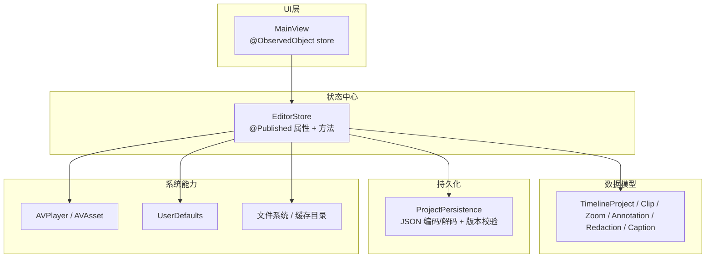
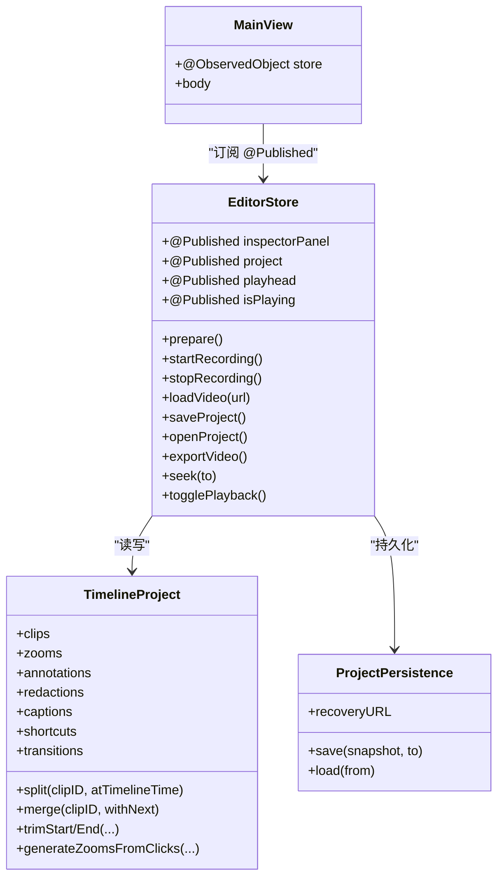
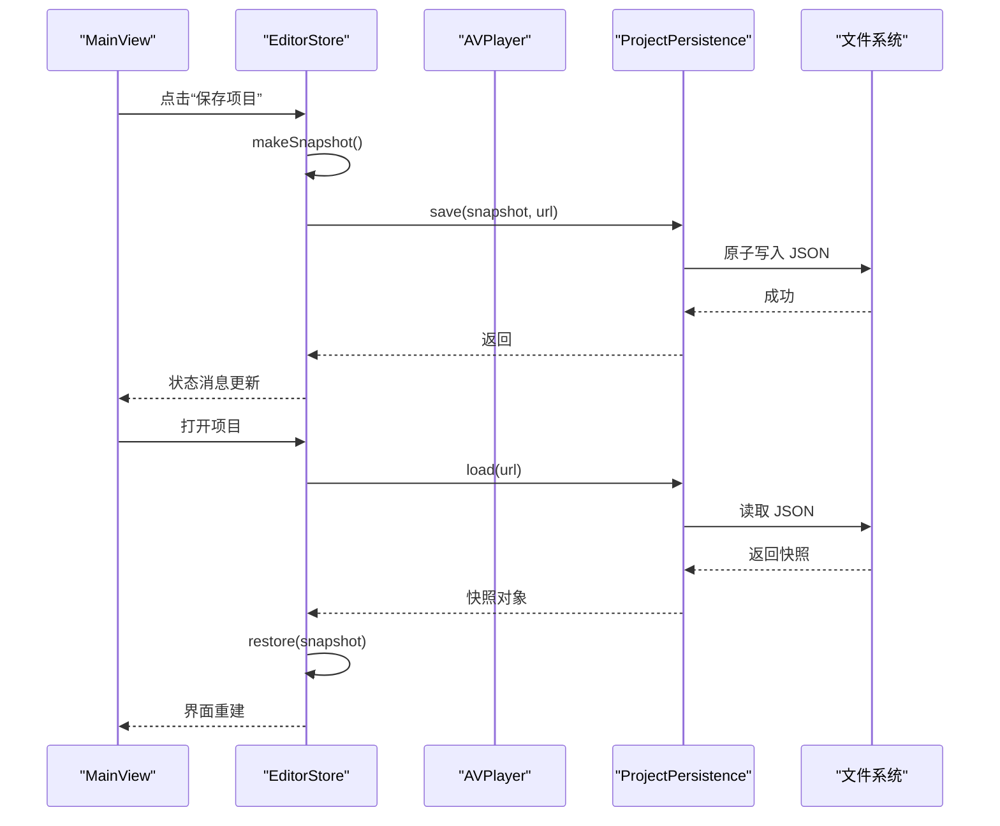
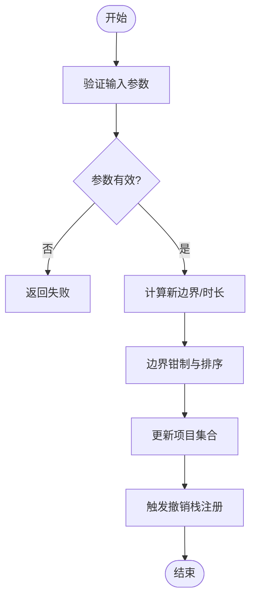
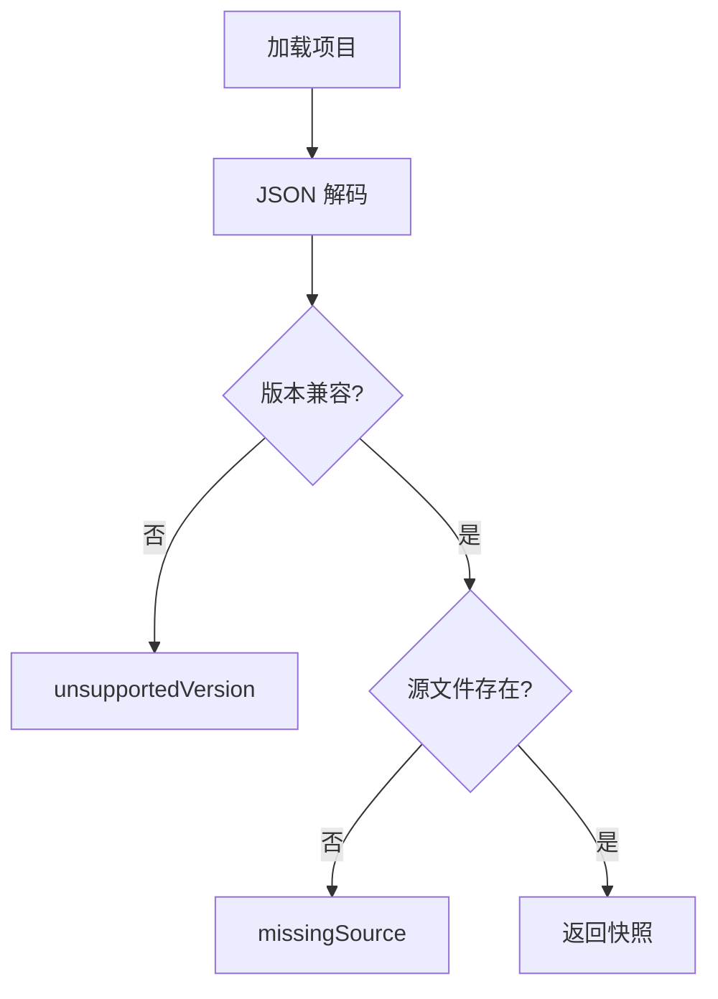
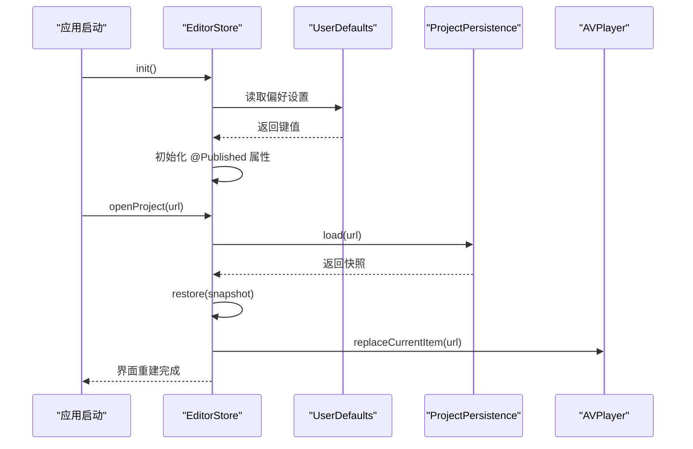
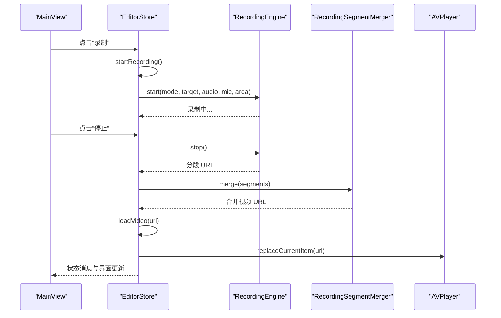
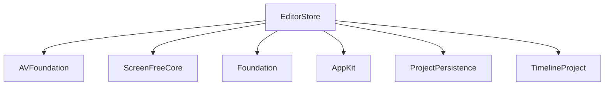

# 状态管理机制

<cite>
**本文引用的文件**   
- [EditorStore.swift](file://Sources/ScreenFree/EditorStore.swift)
- [ProjectPersistence.swift](file://Sources/ScreenFree/ProjectPersistence.swift)
- [EditorModels.swift](file://Sources/ScreenFreeCore/EditorModels.swift)
- [MainView.swift](file://Sources/ScreenFree/MainView.swift)
</cite>

## 目录
1. [简介](#简介)
2. [项目结构](#项目结构)
3. [核心组件](#核心组件)
4. [架构总览](#架构总览)
5. [详细组件分析](#详细组件分析)
6. [依赖关系分析](#依赖关系分析)
7. [性能考量](#性能考量)
8. [故障排查指南](#故障排查指南)
9. [结论](#结论)
10. [附录](#附录)

## 简介
本文件系统性梳理 ScreenFree 的状态管理机制，围绕 EditorStore 作为单一状态源的设计理念展开，解释 @Published 属性的自动更新机制与 SwiftUI 的响应式渲染链路；阐述 Combine 在事件监听、时间轴播放与后台任务中的使用方式；说明项目的持久化策略（自动保存、版本管理、冲突处理）；描述用户偏好设置的存储机制（UserDefaults 的使用模式与自定义类型序列化）；并给出应用重启后的状态恢复流程。文末包含状态流转图与事件处理流程图，帮助读者理解用户操作如何触发状态变更与 UI 更新。

## 项目结构
- 状态中心：EditorStore 集中管理录制、编辑、导出、播放器、设备监控等所有运行时状态，并通过 @Published 暴露给 SwiftUI 视图。
- 数据模型：ScreenFreeCore/EditorModels.swift 定义 TimelineProject、Clip、Zoom、Annotation、Redaction、Caption 等不可变或可序列化的数据结构。
- 持久化：ProjectPersistence.swift 负责项目快照的 JSON 编解码、版本校验与恢复路径管理。
- UI 绑定：MainView.swift 通过 @ObservedObject 订阅 EditorStore，实现状态到界面的自动刷新。

**图表来源** 
- [EditorStore.swift:36-428](file://Sources/ScreenFree/EditorStore.swift#L36-L428)
- [EditorModels.swift:274-372](file://Sources/ScreenFreeCore/EditorModels.swift#L274-L372)
- [ProjectPersistence.swift:81-120](file://Sources/ScreenFree/ProjectPersistence.swift#L81-L120)
- [MainView.swift:6-118](file://Sources/ScreenFree/MainView.swift#L6-L118)

**章节来源**
- [EditorStore.swift:36-428](file://Sources/ScreenFree/EditorStore.swift#L36-L428)
- [EditorModels.swift:274-372](file://Sources/ScreenFreeCore/EditorModels.swift#L274-L372)
- [ProjectPersistence.swift:81-120](file://Sources/ScreenFree/ProjectPersistence.swift#L81-L120)
- [MainView.swift:6-118](file://Sources/ScreenFree/MainView.swift#L6-L118)

## 核心组件
- EditorStore：单一状态源，封装录制、剪辑、转场、字幕、画布样式、导出、音频混音、设备权限等全部状态与方法。大量 @Published 属性驱动 SwiftUI 自动重绘。
- TimelineProject：时间线核心数据模型，维护 clips、zooms、annotations、redactions、captions、shortcuts、transitions 等集合，并提供裁剪、合并、分割、静音修剪、自动生成缩放等算法。
- ProjectPersistence：项目快照结构体与持久化服务，负责 JSON 序列化、版本控制、路径校验与错误分类。
- MainView：UI 入口，通过 @ObservedObject 绑定 EditorStore，将状态变化映射为界面更新。

**章节来源**
- [EditorStore.swift:36-428](file://Sources/ScreenFree/EditorStore.swift#L36-L428)
- [EditorModels.swift:274-372](file://Sources/ScreenFreeCore/EditorModels.swift#L274-L372)
- [ProjectPersistence.swift:1-120](file://Sources/ScreenFree/ProjectPersistence.swift#L1-L120)
- [MainView.swift:6-118](file://Sources/ScreenFree/MainView.swift#L6-L118)

## 架构总览
EditorStore 作为唯一状态源，对外暴露 @Published 属性与命令式方法。UI 层通过 SwiftUI 的响应式机制订阅这些属性，任何属性变更都会触发界面刷新。编辑器内部通过组合 AVFoundation 播放器、设备监控、媒体分析与导出管线完成业务逻辑。持久化层以 JSON 快照形式保存项目元数据与关键设置，支持版本兼容与恢复。

**图表来源** 
- [EditorStore.swift:36-428](file://Sources/ScreenFree/EditorStore.swift#L36-L428)
- [EditorModels.swift:274-372](file://Sources/ScreenFreeCore/EditorModels.swift#L274-L372)
- [ProjectPersistence.swift:81-120](file://Sources/ScreenFree/ProjectPersistence.swift#L81-L120)
- [MainView.swift:6-118](file://Sources/ScreenFree/MainView.swift#L6-L118)

## 详细组件分析

### EditorStore：单一状态源与响应式更新
- 设计理念：所有运行时状态集中在一个类中，避免分散状态导致的不一致问题。@Published 属性由 SwiftUI 自动观察，任何赋值都会触发 UI 重绘。
- 自动保存与恢复：初始化时从 UserDefaults 读取语言、降噪、音量归一化、隐藏图标等偏好；安装自动保存定时器；提供 open/save 项目接口。
- 播放与时间轴：基于 AVPlayer 与时间观察者，维护 playhead、isPlaying、sourceDuration、sourceFrameRate 等；提供 seek、stepFrame、togglePlayback 等方法。
- 录制流程：startRecording/stopRecording 协调 RecordingEngine、DeviceMonitor、RecordingWindowCoordinator，处理权限、倒计时、分段合并、相机片段、自动缩放生成等。
- 导出流程：exportVideo 根据当前项目与样式参数调用 VideoExporter，支持文件、剪贴板、分享链接三种目标，并更新进度与状态消息。
- 撤销/重做：维护 timelineUndoStack/redoStack，记录连续编辑快照，支持 undo/redo 与标题更新。

**图表来源** 
- [EditorStore.swift:1251-1308](file://Sources/ScreenFree/EditorStore.swift#L1251-L1308)
- [ProjectPersistence.swift:94-119](file://Sources/ScreenFree/ProjectPersistence.swift#L94-L119)

**章节来源**
- [EditorStore.swift:36-428](file://Sources/ScreenFree/EditorStore.swift#L36-L428)
- [EditorStore.swift:1251-1308](file://Sources/ScreenFree/EditorStore.swift#L1251-L1308)
- [EditorStore.swift:1445-1519](file://Sources/ScreenFree/EditorStore.swift#L1445-L1519)
- [EditorStore.swift:2809-2923](file://Sources/ScreenFree/EditorStore.swift#L2809-L2923)
- [EditorStore.swift:1733-1759](file://Sources/ScreenFree/EditorStore.swift#L1733-L1759)

### TimelineProject：时间线数据模型与算法
- 数据结构：clips、zooms、cursorSamples、clicks、captions、shortcuts、redactions、annotations、transitions。
- 常用算法：
  - split/merge/trim：对 clip 进行分割、合并、裁剪，保证相邻 clip 的连续性与时序约束。
  - clampTimedEventsToDuration：确保 zoom/redaction/annotation/transition 不越界。
  - generateZoomsFromClicks：根据鼠标点击自动生成跟随游标的缩放事件。
  - trimSilenceAtEdges：基于波形检测去除首尾静音片段。
- 复杂度：多数操作为 O(n) 线性扫描或排序，适合短视频时间线规模。

**图表来源** 
- [EditorModels.swift:467-522](file://Sources/ScreenFreeCore/EditorModels.swift#L467-L522)
- [EditorModels.swift:430-465](file://Sources/ScreenFreeCore/EditorModels.swift#L430-L465)
- [EditorModels.swift:2237-2253](file://Sources/ScreenFreeCore/EditorModels.swift#L2237-L2253)

**章节来源**
- [EditorModels.swift:274-372](file://Sources/ScreenFreeCore/EditorModels.swift#L274-L372)
- [EditorModels.swift:467-522](file://Sources/ScreenFreeCore/EditorModels.swift#L467-L522)
- [EditorModels.swift:430-465](file://Sources/ScreenFreeCore/EditorModels.swift#L430-L465)
- [EditorModels.swift:2237-2253](file://Sources/ScreenFreeCore/EditorModels.swift#L2237-L2253)

### ProjectPersistence：项目快照与版本管理
- 快照结构：ScreenFreeProjectSnapshot 包含 version、sourcePath、cameraPath、project、画布样式、光标样式、背景音乐、录制音频布局、字幕、缩放、运动模糊、相机覆盖等字段。
- 版本管理：currentVersion 用于向前兼容；加载时校验 snapshot.version <= currentVersion，否则抛出 unsupportedVersion。
- 冲突解决：检查 sourcePath 是否存在，不存在则抛出 missingSource；保存采用原子写入，避免部分写入导致的损坏。
- 恢复路径：recoveryURL 指向 Application Support 下的 Recovery.screenfree，便于崩溃恢复。

**图表来源** 
- [ProjectPersistence.swift:105-119](file://Sources/ScreenFree/ProjectPersistence.swift#L105-L119)

**章节来源**
- [ProjectPersistence.swift:1-120](file://Sources/ScreenFree/ProjectPersistence.swift#L1-L120)

### UserDefaults：用户偏好设置与自定义类型序列化
- 使用模式：EditorStore.init 中读取 appLanguage、reduceMicrophoneNoise、normalizeMicrophoneVolume、normalizeSystemAudioVolume、hideDockIconWhileRecording、hideDesktopIconsWhileRecording、hideCameraPreview、automaticallyCreateZooms、afterRecordingAction、showSpeakerNotes、speakerNotesText 等键值。
- 自定义类型序列化：AfterRecordingAction、AppLanguage 等枚举通过 rawValue 与字符串互转；Bool/Double/String 直接存取。
- didSet 钩子：多个 @Published 属性在 didSet 中同步写入 UserDefaults，保证内存状态与磁盘一致。

**章节来源**
- [EditorStore.swift:389-428](file://Sources/ScreenFree/EditorStore.swift#L389-L428)
- [EditorStore.swift:146-228](file://Sources/ScreenFree/EditorStore.swift#L146-L228)

### 状态恢复机制：应用重启后的状态重建
- 启动流程：init 中从 UserDefaults 恢复语言、降噪、音量归一化、隐藏图标、自动缩放、录制后动作、演讲者笔记等。
- 项目恢复：openProject/openExternalURL 调用 persistence.load 获取快照，随后 restore 重建 project、player、backgroundMusic、audioAnalysis 等。
- 播放器恢复：loadVideo 中根据 sourceURL 创建 AVPlayerItem，设置 sourceDuration、aspectRatio、frameRate，并异步分析音频波形。

**图表来源** 
- [EditorStore.swift:389-428](file://Sources/ScreenFree/EditorStore.swift#L389-L428)
- [EditorStore.swift:1251-1308](file://Sources/ScreenFree/EditorStore.swift#L1251-L1308)
- [EditorStore.swift:1445-1519](file://Sources/ScreenFree/EditorStore.swift#L1445-L1519)

**章节来源**
- [EditorStore.swift:389-428](file://Sources/ScreenFree/EditorStore.swift#L389-L428)
- [EditorStore.swift:1251-1308](file://Sources/ScreenFree/EditorStore.swift#L1251-L1308)
- [EditorStore.swift:1445-1519](file://Sources/ScreenFree/EditorStore.swift#L1445-L1519)

### 事件处理流程图：用户操作到状态变更与 UI 更新
- 录制事件：startOrStopRecording -> startRecording/stopRecording -> 权限检查 -> 设备准备 -> 分段录制 -> 合并 -> 导入时间线 -> 自动生成缩放 -> 状态消息更新。
- 播放事件：togglePlayback -> seek/toggle -> AVPlayer 播放/暂停 -> backgroundMusicPlayer 同步 -> isPlaying 更新。
- 导出事件：presentExportSheet -> exportVideo -> 选择目标 -> 调用 VideoExporter -> 回调进度 -> 更新 isExporting/exportProgress/statusMessage。

**图表来源** 
- [EditorStore.swift:502-744](file://Sources/ScreenFree/EditorStore.swift#L502-L744)
- [EditorStore.swift:1445-1519](file://Sources/ScreenFree/EditorStore.swift#L1445-L1519)

**章节来源**
- [EditorStore.swift:502-744](file://Sources/ScreenFree/EditorStore.swift#L502-L744)
- [EditorStore.swift:1445-1519](file://Sources/ScreenFree/EditorStore.swift#L1445-L1519)

## 依赖关系分析
- EditorStore 依赖：
  - AVFoundation：AVPlayer、AVAsset、AVAudioEngine 等用于媒体播放与分析。
  - ScreenFreeCore：TimelineProject 及相关数据结构。
  - Foundation：UserDefaults、FileManager、Task 等。
  - AppKit：NSOpenPanel/NSSavePanel、NSWorkspace、NSEvent 等。
- 耦合与内聚：
  - EditorStore 高内聚地组织录制、编辑、导出、播放器、设备监控等逻辑，降低模块间耦合。
  - ProjectPersistence 独立于 UI，仅关注数据序列化与版本兼容。
  - TimelineProject 纯数据模型，无副作用，便于测试与复用。

**图表来源** 
- [EditorStore.swift:1-7](file://Sources/ScreenFree/EditorStore.swift#L1-L7)
- [EditorModels.swift:1-3](file://Sources/ScreenFreeCore/EditorModels.swift#L1-L3)
- [ProjectPersistence.swift:1-3](file://Sources/ScreenFree/ProjectPersistence.swift#L1-L3)

**章节来源**
- [EditorStore.swift:1-7](file://Sources/ScreenFree/EditorStore.swift#L1-L7)
- [EditorModels.swift:1-3](file://Sources/ScreenFreeCore/EditorModels.swift#L1-L3)
- [ProjectPersistence.swift:1-3](file://Sources/ScreenFree/ProjectPersistence.swift#L1-L3)

## 性能考量
- 时间线缩略图生成：使用 Task 异步生成，限制帧数与间隔，避免阻塞主线程。
- 音频分析：loadVideo 中异步分析波形，减少初始加载延迟。
- 导出任务：exportVideo 使用 Task 与回调进度，支持取消与错误清理。
- 撤销栈：限制最大长度（如 100），防止内存膨胀。
- 播放器切换：seek 与 playImmediately 精确控制播放速率与同步，避免抖动。

[本节为通用指导，不直接分析具体文件]

## 故障排查指南
- 权限问题：屏幕录制、麦克风、摄像头权限未授权会导致 capturePermissionIssue、errorMessage 提示；可通过 openScreenRecordingSettings/openMicrophoneSettings/openCameraSettings 引导用户开启。
- 版本不兼容：ProjectPersistence.load 抛出 unsupportedVersion，需升级项目格式或降级应用版本。
- 源文件缺失：missingSource 表示 sourcePath 不存在，需检查文件路径或重新导入。
- 导出失败：exportVideo 捕获异常并清理临时文件，errorMessage 显示原因；可检查目标路径权限与格式支持。

**章节来源**
- [EditorStore.swift:1432-1443](file://Sources/ScreenFree/EditorStore.swift#L1432-L1443)
- [ProjectPersistence.swift:67-79](file://Sources/ScreenFree/ProjectPersistence.swift#L67-L79)
- [EditorStore.swift:2809-2923](file://Sources/ScreenFree/EditorStore.swift#L2809-L2923)

## 结论
ScreenFree 通过 EditorStore 作为单一状态源，结合 @Published 与 SwiftUI 的响应式机制，实现了清晰的状态管理与自动 UI 更新。ProjectPersistence 提供稳健的项目持久化与版本管理，UserDefaults 负责用户偏好设置。整体架构内聚且低耦合，易于扩展与维护。通过合理的异步处理与错误管理，保证了用户体验与系统稳定性。

[本节为总结性内容，不直接分析具体文件]

## 附录
- 关键方法路径参考：
  - 录制流程：[EditorStore.swift:502-744](file://Sources/ScreenFree/EditorStore.swift#L502-L744)
  - 播放控制：[EditorStore.swift:1588-1673](file://Sources/ScreenFree/EditorStore.swift#L1588-L1673)
  - 项目持久化：[ProjectPersistence.swift:94-119](file://Sources/ScreenFree/ProjectPersistence.swift#L94-L119)
  - 时间线模型：[EditorModels.swift:274-372](file://Sources/ScreenFreeCore/EditorModels.swift#L274-L372)
  - UI 绑定：[MainView.swift:6-118](file://Sources/ScreenFree/MainView.swift#L6-L118)

[本节为附录信息，不直接分析具体文件]