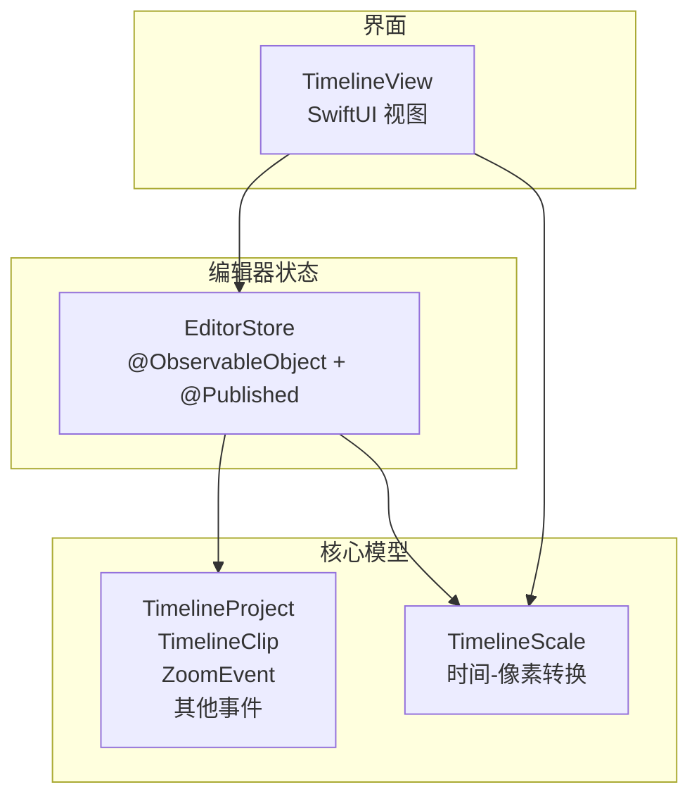
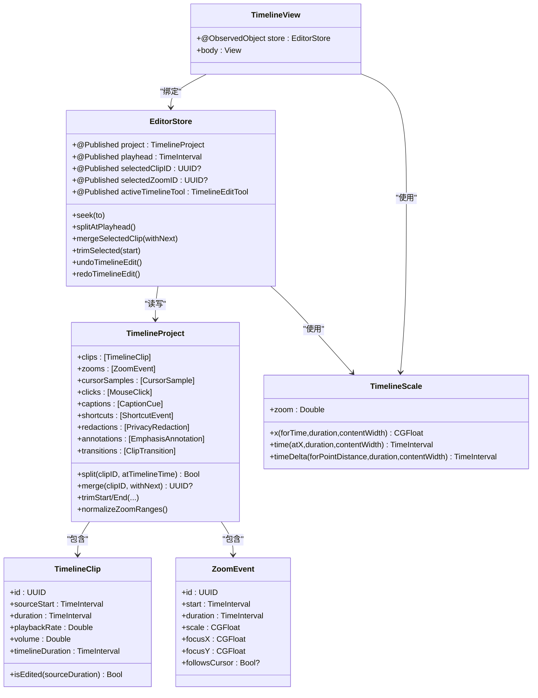
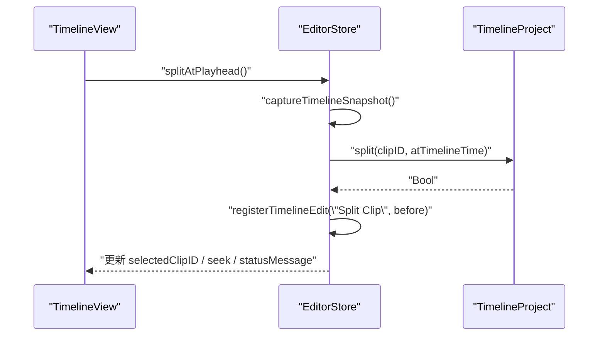
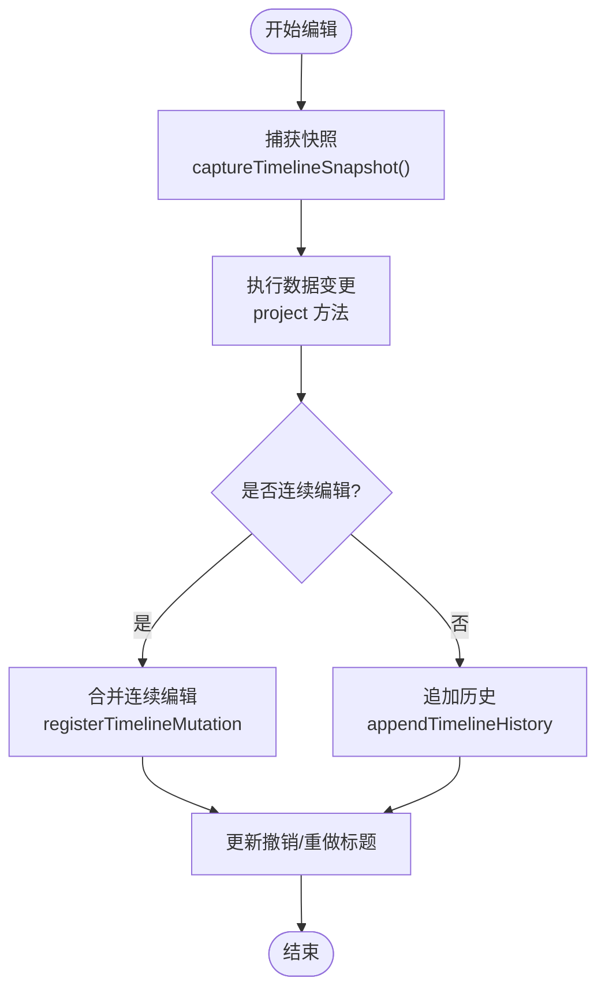
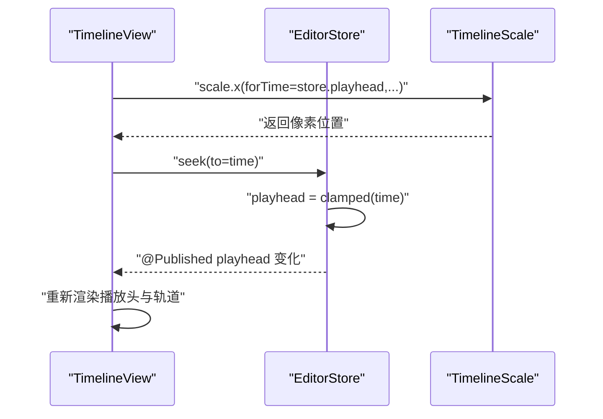
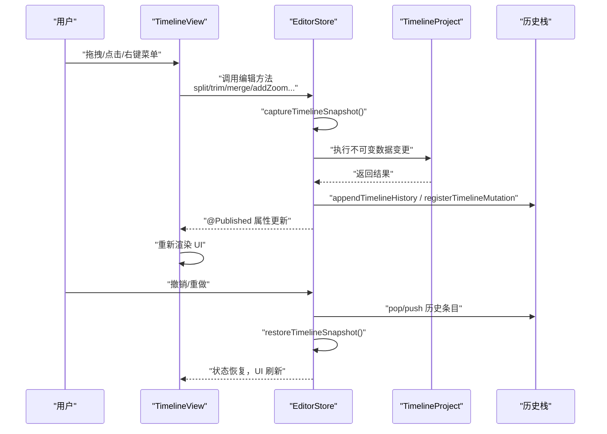
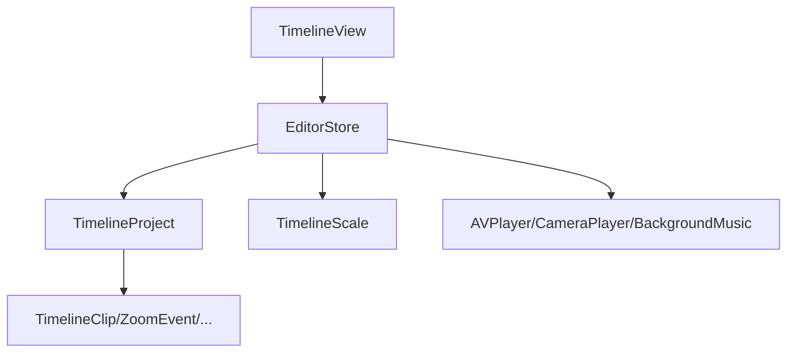

# 编辑数据流

<cite>
**本文引用的文件**   
- [EditorModels.swift](file://Sources/ScreenFreeCore/EditorModels.swift)
- [TimelineScale.swift](file://Sources/ScreenFreeCore/TimelineScale.swift)
- [EditorStore.swift](file://Sources/ScreenFree/EditorStore.swift)
- [TimelineView.swift](file://Sources/ScreenFree/TimelineView.swift)
</cite>

## 目录
1. [简介](#简介)
2. [项目结构](#项目结构)
3. [核心组件](#核心组件)
4. [架构总览](#架构总览)
5. [详细组件分析](#详细组件分析)
6. [依赖关系分析](#依赖关系分析)
7. [性能考量](#性能考量)
8. [故障排查指南](#故障排查指南)
9. [结论](#结论)

## 简介
本文件围绕 ScreenFree 的时间线编辑数据流展开，重点说明不可变数据模型设计、响应式状态管理、剪辑操作（分割、修剪、合并）的数据变更流程与撤销重做机制，以及时间线缩放、播放头位置、选中状态等 UI 状态的同步方式。文档通过类图、时序图和流程图展示编辑操作的完整生命周期，帮助读者从高层到代码级全面理解系统行为。

## 项目结构
- 核心数据模型位于 ScreenFreeCore：
  - TimelineProject、TimelineClip、ZoomEvent、CursorSample、MouseClick、PrivacyRedaction、EmphasisAnnotation、CaptionCue、ShortcutEvent、ClipTransition 等
- 编辑器状态管理与业务编排位于 ScreenFree：
  - EditorStore 作为 MVVM 的 ViewModel，集中管理 @Published 属性与时间线编辑历史
  - TimelineView 为 SwiftUI 视图层，负责交互与 UI 状态绑定
- 时间轴坐标与缩放逻辑位于 TimelineScale：
  - 统一时间与时序像素转换、自动跟随策略

图表来源
- [EditorModels.swift:274-306](file://Sources/ScreenFreeCore/EditorModels.swift#L274-L306)
- [TimelineScale.swift:5-50](file://Sources/ScreenFreeCore/TimelineScale.swift#L5-L50)
- [EditorStore.swift:31-244](file://Sources/ScreenFree/EditorStore.swift#L31-L244)
- [TimelineView.swift:5-130](file://Sources/ScreenFree/TimelineView.swift#L5-L130)

章节来源
- [EditorModels.swift:274-306](file://Sources/ScreenFreeCore/EditorModels.swift#L274-L306)
- [TimelineScale.swift:5-50](file://Sources/ScreenFreeCore/TimelineScale.swift#L5-L50)
- [EditorStore.swift:31-244](file://Sources/ScreenFree/EditorStore.swift#L31-L244)
- [TimelineView.swift:5-130](file://Sources/ScreenFree/TimelineView.swift#L5-L130)

## 核心组件
- TimelineProject：时间线不可变数据容器，包含 clips、zooms、cursorSamples、clicks、captions、shortcuts、redactions、annotations、transitions 等集合，并提供剪辑分割/合并、修剪、时间范围规范化、转场与事件裁剪等方法。
- TimelineClip：表示一个剪辑片段，包含 sourceStart、duration、playbackRate、volume 等字段，提供 timelineDuration、isEdited 等计算属性。
- ZoomEvent：表示一段放大区域，包含 start、duration、scale、focusX/Y、followsCursor 等。
- TimelineScale：时间轴缩放与时间-像素转换工具，支持 fitZoom、maximumZoom、stepFactor，以及播放头自动跟随策略。
- EditorStore：MVVM 中的 ViewModel，使用 @ObservableObject 暴露大量 @Published 属性，封装所有时间线编辑命令、撤销重做、播放控制、导出与持久化协调。
- TimelineView：SwiftUI 视图层，绑定 store 的 @Published 状态，处理用户交互并调用 store 的方法完成数据变更。

章节来源
- [EditorModels.swift:4-45](file://Sources/ScreenFreeCore/EditorModels.swift#L4-L45)
- [EditorModels.swift:109-138](file://Sources/ScreenFreeCore/EditorModels.swift#L109-L138)
- [EditorModels.swift:274-306](file://Sources/ScreenFreeCore/EditorModels.swift#L274-L306)
- [TimelineScale.swift:5-50](file://Sources/ScreenFreeCore/TimelineScale.swift#L5-L50)
- [EditorStore.swift:31-244](file://Sources/ScreenFree/EditorStore.swift#L31-L244)
- [TimelineView.swift:5-130](file://Sources/ScreenFree/TimelineView.swift#L5-L130)

## 架构总览
ScreenFree 采用 MVVM 架构：
- View（TimelineView）仅负责展示与交互，不持有业务逻辑
- ViewModel（EditorStore）集中管理状态与业务规则，通过 @Published 驱动 UI 更新
- Model（TimelineProject 及其子类型）为不可变数据结构，保证数据一致性
- TimelineScale 提供时间轴坐标转换与播放跟随策略

图表来源
- [EditorModels.swift:274-306](file://Sources/ScreenFreeCore/EditorModels.swift#L274-L306)
- [EditorModels.swift:4-45](file://Sources/ScreenFreeCore/EditorModels.swift#L4-L45)
- [EditorModels.swift:109-138](file://Sources/ScreenFreeCore/EditorModels.swift#L109-L138)
- [TimelineScale.swift:5-50](file://Sources/ScreenFreeCore/TimelineScale.swift#L5-L50)
- [EditorStore.swift:31-244](file://Sources/ScreenFree/EditorStore.swift#L31-L244)
- [TimelineView.swift:5-130](file://Sources/ScreenFree/TimelineView.swift#L5-L130)

## 详细组件分析

### 不可变数据模型与时间线结构
- TimelineProject 聚合所有时间线相关数据，构造时进行 normalizeZoomRanges，确保缩放区间合法且无重叠。
- TimelineClip 提供 timelineDuration 与 isEdited，用于渲染与判断是否被修改过。
- ZoomEvent 定义放大区间的起止、缩放比例与焦点，支持自动生成与手动编辑。
- 其他事件（光标采样、点击、隐私遮挡、标注、字幕、快捷键）均遵循不可变设计，便于快照与撤销重做。

章节来源
- [EditorModels.swift:274-306](file://Sources/ScreenFreeCore/EditorModels.swift#L274-L306)
- [EditorModels.swift:4-45](file://Sources/ScreenFreeCore/EditorModels.swift#L4-L45)
- [EditorModels.swift:109-138](file://Sources/ScreenFreeCore/EditorModels.swift#L109-L138)

### EditorStore 的响应式状态管理
- EditorStore 使用 @ObservableObject 暴露大量 @Published 属性，包括 project、playhead、selectedClipID、selectedZoomID、activeTimelineTool、timelineZoom 等。
- UI 通过 @ObservedObject 绑定这些属性，任何变化都会触发 SwiftUI 重新渲染。
- 所有时间线编辑方法在修改 project 后，通过 registerTimelineEdit/registerTimelineMutation 记录历史快照，支持撤销重做。
- 播放控制（seek、togglePlayback）会同步 AVPlayer、cameraPlayer 与背景音乐的播放状态，保持多轨一致。

章节来源
- [EditorStore.swift:31-244](file://Sources/ScreenFree/EditorStore.swift#L31-L244)
- [EditorStore.swift:1552-1584](file://Sources/ScreenFree/EditorStore.swift#L1552-L1584)

### 剪辑操作的数据变更流程（分割、修剪、合并）
- 分割 split：根据当前时间或播放头定位到目标 clip，将其拆分为两个新的 TimelineClip，替换原片段，并记录历史快照。
- 修剪 trimStart/trimEnd：按指定时长调整 sourceStart 与 duration，确保最小时长约束，必要时调用 clampTimedEventsToDuration。
- 合并 merge：检查相邻 clip 的源时间连续性、速度与音量一致性，满足条件则合并为一个新 clip。

图表来源
- [EditorStore.swift:1835-1851](file://Sources/ScreenFree/EditorStore.swift#L1835-L1851)
- [EditorModels.swift:467-489](file://Sources/ScreenFreeCore/EditorModels.swift#L467-L489)

章节来源
- [EditorStore.swift:1835-1851](file://Sources/ScreenFree/EditorStore.swift#L1835-L1851)
- [EditorStore.swift:1941-1972](file://Sources/ScreenFree/EditorStore.swift#L1941-L1972)
- [EditorModels.swift:467-546](file://Sources/ScreenFreeCore/EditorModels.swift#L467-L546)

### 撤销重做机制的实现原理
- EditorStore 维护 timelineUndoStack 与 timelineRedoStack，每个条目包含 actionName 与 TimelineEditorSnapshot（project、选择项、工具、播放头等）。
- 每次编辑前 captureTimelineSnapshot，编辑完成后 appendTimelineHistory；撤销/重做时 restoreTimelineSnapshot，恢复 project 与 UI 状态。
- 连续编辑（如拖拽缩放区间）通过 prepareTimelineMutation 与 registerTimelineMutation 合并多次变更，减少历史条目数量。
- 历史记录上限为 100 条，超出时移除最旧条目。

图表来源
- [EditorStore.swift:1679-1733](file://Sources/ScreenFree/EditorStore.swift#L1679-L1733)
- [EditorStore.swift:1644-1670](file://Sources/ScreenFree/EditorStore.swift#L1644-L1670)

章节来源
- [EditorStore.swift:1679-1733](file://Sources/ScreenFree/EditorStore.swift#L1679-L1733)
- [EditorStore.swift:1644-1670](file://Sources/ScreenFree/EditorStore.swift#L1644-L1670)

### 时间线缩放、播放头位置、选中状态的同步机制
- TimelineScale 提供 x/time/timeDelta 转换，TimelineView 基于 store.timelineZoom 计算内容宽度与元素位置。
- 播放头 playhead 由 EditorStore 管理，TimelineView 通过 @ObservedObject 绑定，拖动或点击即调用 store.seek/to 更新。
- 选中状态 selectedClipID/selectedZoomID/selectedRedactionID/selectedAnnotationID 在交互中设置，影响高亮与侧边栏面板。
- 播放时的自动跟随由 TimelinePlaybackFollowPolicy 决定，当播放头接近可视区域边缘时自动滚动以保持可见。

图表来源
- [TimelineScale.swift:22-49](file://Sources/ScreenFreeCore/TimelineScale.swift#L22-L49)
- [EditorStore.swift:1556-1584](file://Sources/ScreenFree/EditorStore.swift#L1556-L1584)
- [TimelineView.swift:48-66](file://Sources/ScreenFree/TimelineView.swift#L48-L66)

章节来源
- [TimelineScale.swift:22-49](file://Sources/ScreenFreeCore/TimelineScale.swift#L22-L49)
- [EditorStore.swift:1556-1584](file://Sources/ScreenFree/EditorStore.swift#L1556-L1584)
- [TimelineView.swift:48-66](file://Sources/ScreenFree/TimelineView.swift#L48-L66)

### 时间线编辑的完整生命周期（数据流图）

图表来源
- [EditorStore.swift:1679-1733](file://Sources/ScreenFree/EditorStore.swift#L1679-L1733)
- [EditorStore.swift:1644-1670](file://Sources/ScreenFree/EditorStore.swift#L1644-L1670)
- [EditorStore.swift:1556-1584](file://Sources/ScreenFree/EditorStore.swift#L1556-L1584)
- [TimelineView.swift:5-130](file://Sources/ScreenFree/TimelineView.swift#L5-L130)

## 依赖关系分析
- TimelineView 依赖 EditorStore 的 @Published 状态，并通过 @ObservedObject 订阅变化。
- EditorStore 依赖 TimelineProject 的不可变方法进行数据变更，依赖 TimelineScale 进行时间轴坐标转换。
- TimelineProject 内部依赖各事件类型的不可变结构与算法（如 normalizeZoomRanges、clampTimedEventsToDuration）。
- 播放控制依赖 AVPlayer、cameraPlayer、backgroundMusicPlayer，保证多轨同步。

图表来源
- [EditorStore.swift:31-244](file://Sources/ScreenFree/EditorStore.swift#L31-L244)
- [EditorModels.swift:274-306](file://Sources/ScreenFreeCore/EditorModels.swift#L274-L306)
- [TimelineScale.swift:5-50](file://Sources/ScreenFreeCore/TimelineScale.swift#L5-L50)
- [TimelineView.swift:5-130](file://Sources/ScreenFree/TimelineView.swift#L5-L130)

章节来源
- [EditorStore.swift:31-244](file://Sources/ScreenFree/EditorStore.swift#L31-L244)
- [EditorModels.swift:274-306](file://Sources/ScreenFreeCore/EditorModels.swift#L274-L306)
- [TimelineScale.swift:5-50](file://Sources/ScreenFreeCore/TimelineScale.swift#L5-L50)
- [TimelineView.swift:5-130](file://Sources/ScreenFree/TimelineView.swift#L5-L130)

## 性能考量
- 不可变数据模型避免共享可变状态带来的竞态与不一致问题，但频繁创建对象可能带来内存压力。建议对高频操作（如连续拖拽）使用合并策略减少历史条目。
- TimelineScale 的计算为 O(1)，但在渲染大量元素时需关注 ForEach 的性能，必要时可缓存计算结果。
- 播放跟随策略仅在播放状态下生效，避免不必要的滚动计算。
- 历史记录上限为 100 条，防止内存膨胀；对于超长编辑会话，建议定期清理或归档。

[本节为通用指导，无需具体文件引用]

## 故障排查指南
- 无法分割剪辑：检查是否在 clip 内部有效范围内点击，确保 localSource 不在边界附近。
- 无法合并剪辑：确认相邻 clip 的源时间连续性、速度与音量一致。
- 撤销/重做无效：检查是否有连续编辑未正确注册，或历史栈为空。
- 播放头不同步：确认 seek 调用是否正确，播放器速率是否与 clip.playbackRate 一致。
- 缩放区间重叠：normalizeZoomRanges 会自动去重与裁剪，若仍异常，检查插入前的边界校验。

章节来源
- [EditorStore.swift:1835-1851](file://Sources/ScreenFree/EditorStore.swift#L1835-L1851)
- [EditorStore.swift:1941-1972](file://Sources/ScreenFree/EditorStore.swift#L1941-L1972)
- [EditorStore.swift:1679-1733](file://Sources/ScreenFree/EditorStore.swift#L1679-L1733)
- [EditorStore.swift:1556-1584](file://Sources/ScreenFree/EditorStore.swift#L1556-L1584)
- [EditorModels.swift:861-902](file://Sources/ScreenFreeCore/EditorModels.swift#L861-L902)

## 结论
ScreenFree 的时间线编辑数据流以不可变数据模型为核心，结合 EditorStore 的响应式状态管理与撤销重做机制，实现了稳定、可追溯、易扩展的编辑体验。TimelineScale 提供了统一的坐标转换与播放跟随策略，TimelineView 将用户交互转化为 store 的方法调用，形成清晰的数据流闭环。该架构在保证性能的同时，提升了可维护性与用户体验。

[本节为总结性内容，无需具体文件引用]