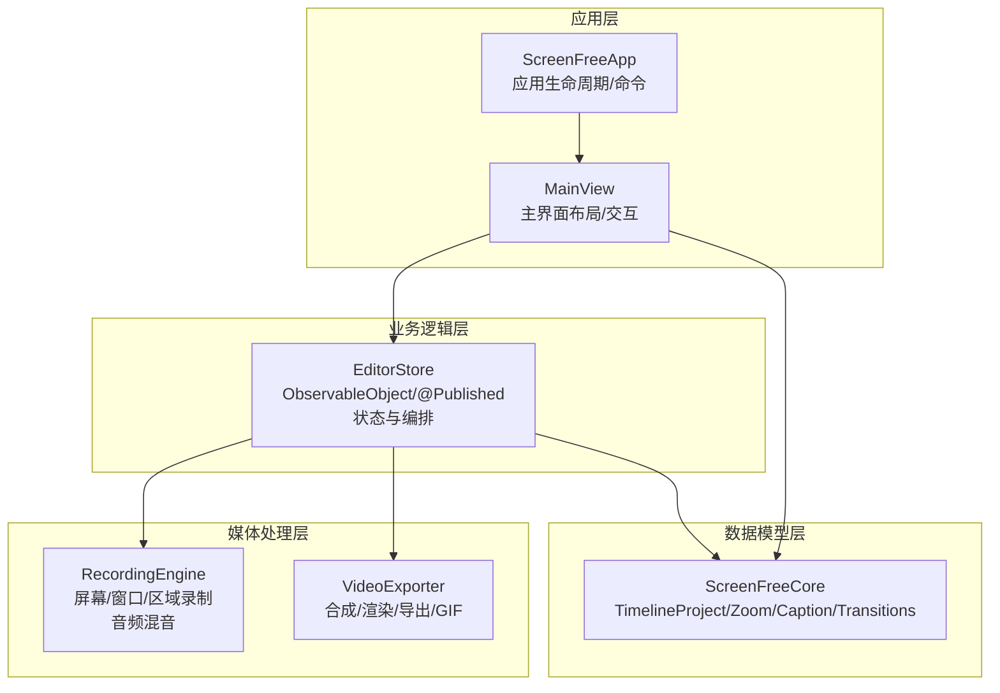
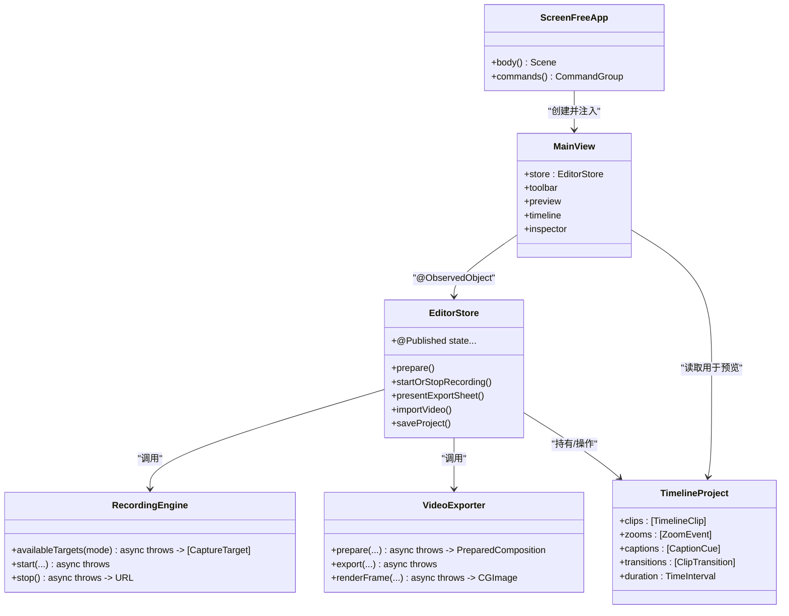
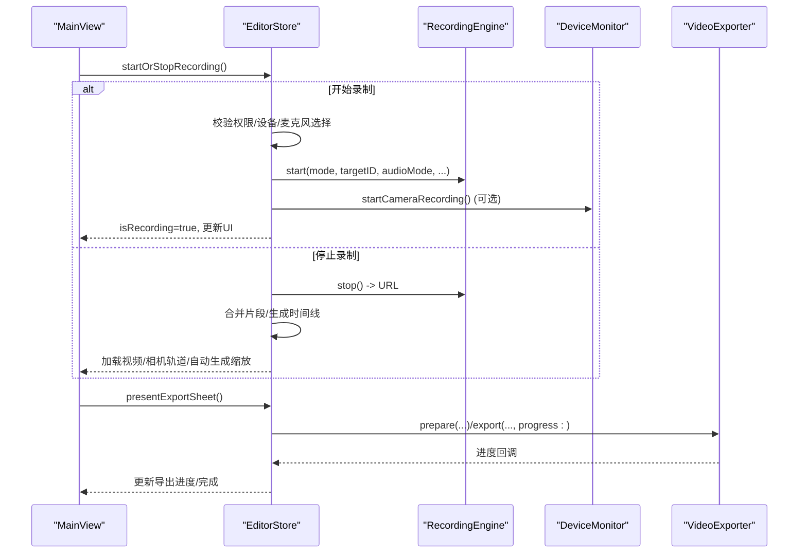
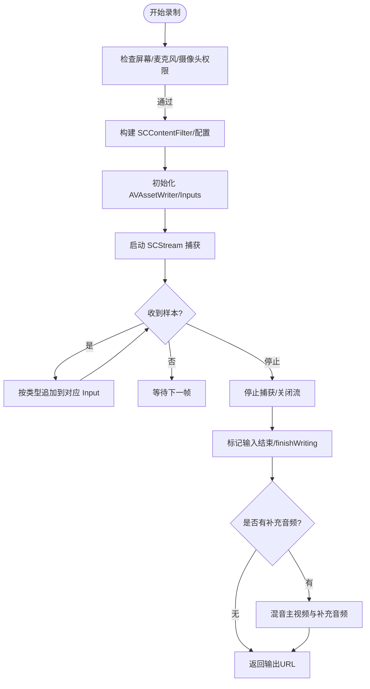
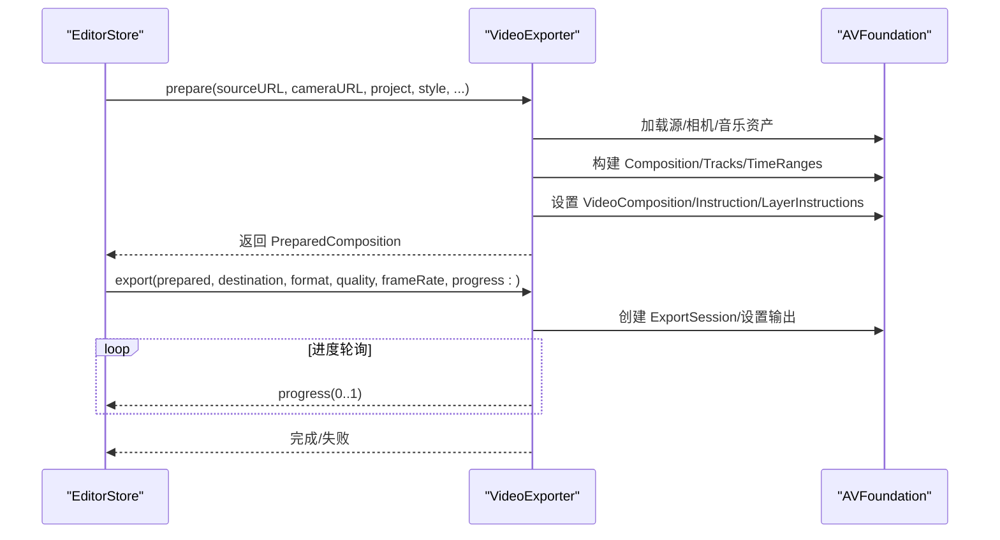
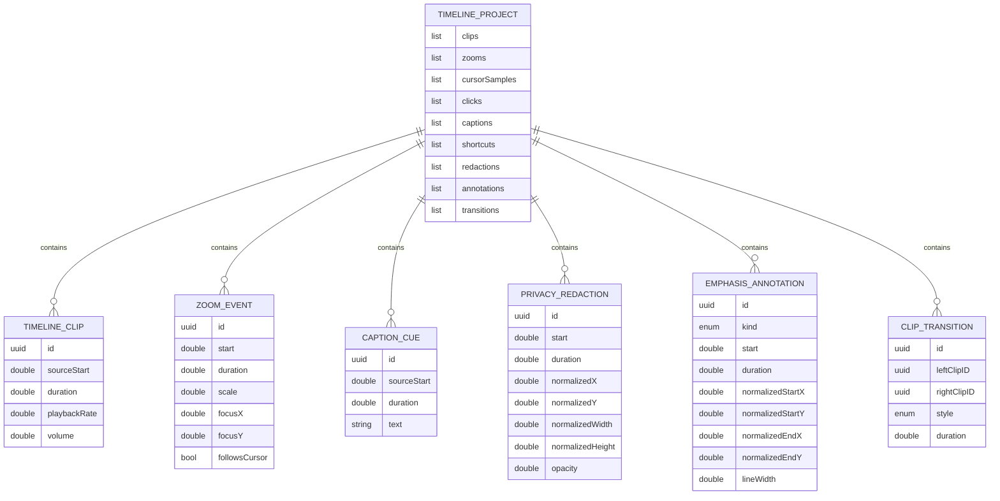
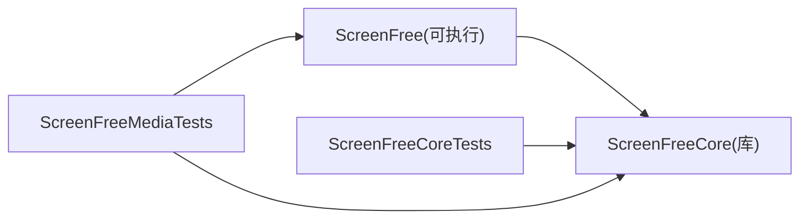

# 整体架构设计

<cite>
**本文引用的文件**   
- [ScreenFreeApp.swift](file://Sources/ScreenFree/ScreenFreeApp.swift)
- [MainView.swift](file://Sources/ScreenFree/MainView.swift)
- [EditorStore.swift](file://Sources/ScreenFree/EditorStore.swift)
- [RecordingEngine.swift](file://Sources/ScreenFree/RecordingEngine.swift)
- [VideoExporter.swift](file://Sources/ScreenFree/VideoExporter.swift)
- [EditorModels.swift](file://Sources/ScreenFreeCore/EditorModels.swift)
- [ClipTransition.swift](file://Sources/ScreenFreeCore/ClipTransition.swift)
- [TimelineScale.swift](file://Sources/ScreenFreeCore/TimelineScale.swift)
- [Package.swift](file://Package.swift)
</cite>

## 目录
1. [简介](#简介)
2. [项目结构](#项目结构)
3. [核心组件](#核心组件)
4. [架构总览](#架构总览)
5. [详细组件分析](#详细组件分析)
6. [依赖关系分析](#依赖关系分析)
7. [性能考量](#性能考量)
8. [故障排查指南](#故障排查指南)
9. [结论](#结论)
10. [附录](#附录)

## 简介
本文件为 ScreenFree 的整体架构设计文档，聚焦分层架构与 MVVM 模式实现、模块边界与数据模型独立性、以及 UI 层（SwiftUI）、业务逻辑层（EditorStore）与媒体处理层（RecordingEngine、VideoExporter）的职责分离。文档同时解释编辑器状态管理机制（@Published 与 ObservableObject）、模块化设计原则（ScreenFreeCore 的独立性与可测试性），并给出系统架构图、关键流程时序图与流程图，辅以技术栈选择与权衡说明。

## 项目结构
ScreenFree 采用 Swift Package 管理，包含两个主要目标：
- ScreenFree：应用入口、UI（SwiftUI）、业务编排与状态管理（EditorStore）、媒体采集与导出等。
- ScreenFreeCore：纯 Swift 数据模型与算法（时间线、转场、缩放、比例尺等），无 UI 依赖，便于单元测试与跨平台复用。

图表来源
- [ScreenFreeApp.swift:111-139](file://Sources/ScreenFree/ScreenFreeApp.swift#L111-L139)
- [MainView.swift:6-107](file://Sources/ScreenFree/MainView.swift#L6-L107)
- [EditorStore.swift:30-379](file://Sources/ScreenFree/EditorStore.swift#L30-L379)
- [RecordingEngine.swift:63-117](file://Sources/ScreenFree/RecordingEngine.swift#L63-L117)
- [VideoExporter.swift:95-118](file://Sources/ScreenFree/VideoExporter.swift#L95-L118)
- [EditorModels.swift:274-306](file://Sources/ScreenFreeCore/EditorModels.swift#L274-L306)

章节来源
- [Package.swift:1-35](file://Package.swift#L1-L35)
- [ScreenFreeApp.swift:111-139](file://Sources/ScreenFree/ScreenFreeApp.swift#L111-L139)

## 核心组件
- UI 层（SwiftUI）
  - ScreenFreeApp：应用入口、命令菜单、通知监听、全局快捷键路由。
  - MainView：主工作区布局（工具栏、预览、播放条、时间线、检查器面板），通过 @ObservedObject 绑定 EditorStore 状态。
- 业务逻辑层（EditorStore）
  - 作为 ViewModel，集中维护所有用户可见状态（@Published），协调录制、编辑、导出、设备权限、历史与持久化等。
- 媒体处理层
  - RecordingEngine：基于 ScreenCaptureKit + AVFoundation 的实时录制与多路音频混合。
  - VideoExporter：基于 AVAssetWriter/AVMutableComposition 的合成、渲染与导出（含 GIF）。
- 数据模型层（ScreenFreeCore）
  - TimelineProject、ZoomEvent、CaptionCue、PrivacyRedaction、EmphasisAnnotation、ClipTransition、TimelineScale 等，纯数据结构与算法，支持 Codable/Sendable，便于序列化与并发安全。

章节来源
- [ScreenFreeApp.swift:111-229](file://Sources/ScreenFree/ScreenFreeApp.swift#L111-L229)
- [MainView.swift:6-107](file://Sources/ScreenFree/MainView.swift#L6-L107)
- [EditorStore.swift:30-379](file://Sources/ScreenFree/EditorStore.swift#L30-L379)
- [RecordingEngine.swift:63-117](file://Sources/ScreenFree/RecordingEngine.swift#L63-L117)
- [VideoExporter.swift:95-118](file://Sources/ScreenFree/VideoExporter.swift#L95-L118)
- [EditorModels.swift:274-306](file://Sources/ScreenFreeCore/EditorModels.swift#L274-L306)

## 架构总览
ScreenFree 遵循清晰的 MVVM 分层：
- View（SwiftUI）仅负责展示与用户输入，不持有复杂逻辑。
- ViewModel（EditorStore）暴露 @Published 状态，响应视图事件，编排底层能力（录制、导出、设备、持久化）。
- 媒体处理层（RecordingEngine、VideoExporter）封装 AVFoundation/ScreenCaptureKit 细节，提供异步 API。
- 数据模型层（ScreenFreeCore）保持无副作用、可序列化的领域模型，供 UI 与媒体层共同消费。

图表来源
- [ScreenFreeApp.swift:111-139](file://Sources/ScreenFree/ScreenFreeApp.swift#L111-L139)
- [MainView.swift:6-107](file://Sources/ScreenFree/MainView.swift#L6-L107)
- [EditorStore.swift:30-379](file://Sources/ScreenFree/EditorStore.swift#L30-L379)
- [RecordingEngine.swift:63-117](file://Sources/ScreenFree/RecordingEngine.swift#L63-L117)
- [VideoExporter.swift:95-118](file://Sources/ScreenFree/VideoExporter.swift#L95-L118)
- [EditorModels.swift:274-306](file://Sources/ScreenFreeCore/EditorModels.swift#L274-L306)

## 详细组件分析

### MVVM 与状态管理（EditorStore）
- EditorStore 继承 ObservableObject，使用大量 @Published 属性驱动 SwiftUI 自动刷新。
- 关键职责：
  - 录制流程编排：准备、倒计时、权限校验、分段录制、合并、相机叠加、自动缩放生成。
  - 时间线编辑：剪辑分割/修剪/合并、缩放、隐私遮挡、标注、转场、撤销/重做快照。
  - 导出编排：参数收集、进度回调、格式选择（MP4/GIF）、质量与帧率控制。
  - 设备与权限：麦克风/摄像头枚举、授权请求、预览与录音电平监控。
  - 持久化与历史：项目保存/打开、样式预设、录制历史、自动保存。
- 状态同步策略：
  - 通过 Combine 订阅多个 @Published 变化，触发自动保存或资源重建。
  - 对耗时任务使用 Task 与异步方法，避免阻塞主线程。

图表来源
- [EditorStore.swift:493-735](file://Sources/ScreenFree/EditorStore.swift#L493-L735)
- [RecordingEngine.swift:174-443](file://Sources/ScreenFree/RecordingEngine.swift#L174-L443)
- [VideoExporter.swift:488-590](file://Sources/ScreenFree/VideoExporter.swift#L488-L590)

章节来源
- [EditorStore.swift:30-379](file://Sources/ScreenFree/EditorStore.swift#L30-L379)
- [EditorStore.swift:493-735](file://Sources/ScreenFree/EditorStore.swift#L493-L735)

### 媒体采集层（RecordingEngine）
- 基于 ScreenCaptureKit 获取屏幕/窗口/区域内容，AVAssetWriter 写入 H.264/AAC。
- 支持系统音频全量捕获与“选定应用”音频捕获（单独流后混音）。
- 支持麦克风录制（macOS 15+），并可进行降噪/音量归一化处理。
- 输出路径：临时目录下的 MP4/M4A，最终由 EditorStore 合并并进入时间线。

图表来源
- [RecordingEngine.swift:174-443](file://Sources/ScreenFree/RecordingEngine.swift#L174-L443)
- [RecordingEngine.swift:533-674](file://Sources/ScreenFree/RecordingEngine.swift#L533-L674)

章节来源
- [RecordingEngine.swift:63-117](file://Sources/ScreenFree/RecordingEngine.swift#L63-L117)
- [RecordingEngine.swift:174-443](file://Sources/ScreenFree/RecordingEngine.swift#L174-L443)

### 媒体导出层（VideoExporter）
- 将源视频、相机视频、背景乐与时间线项目（剪辑、缩放、字幕、遮罩、标注、转场）合成为 AVMutableComposition。
- 通过 AVMutableVideoComposition 与自定义指令（圆角相机、运动模糊、光标绘制、点击特效）逐帧渲染。
- 支持 MP4 与 GIF 导出，提供进度回调与取消支持。

图表来源
- [VideoExporter.swift:103-486](file://Sources/ScreenFree/VideoExporter.swift#L103-L486)
- [VideoExporter.swift:488-590](file://Sources/ScreenFree/VideoExporter.swift#L488-L590)

章节来源
- [VideoExporter.swift:95-118](file://Sources/ScreenFree/VideoExporter.swift#L95-L118)
- [VideoExporter.swift:488-590](file://Sources/ScreenFree/VideoExporter.swift#L488-L590)

### 数据模型层（ScreenFreeCore）
- TimelineProject：时间线核心，聚合 clips、zooms、cursorSamples、clicks、captions、shortcuts、redactions、annotations、transitions。
- ClipTransition：定义相邻剪辑间的过渡模板（淡入淡出/闪白/缩放），并提供帧级计算。
- TimelineScale：统一的时间轴缩放与滚动跟随策略。
- 所有模型均实现 Codable/Sendable，保证可序列化与并发安全。

图表来源
- [EditorModels.swift:274-306](file://Sources/ScreenFreeCore/EditorModels.swift#L274-L306)
- [ClipTransition.swift:1-130](file://Sources/ScreenFreeCore/ClipTransition.swift#L1-L130)
- [TimelineScale.swift:1-50](file://Sources/ScreenFreeCore/TimelineScale.swift#L1-L50)

章节来源
- [EditorModels.swift:274-306](file://Sources/ScreenFreeCore/EditorModels.swift#L274-L306)
- [ClipTransition.swift:1-130](file://Sources/ScreenFreeCore/ClipTransition.swift#L1-L130)
- [TimelineScale.swift:1-50](file://Sources/ScreenFreeCore/TimelineScale.swift#L1-L50)

### UI 层（MainView）与状态绑定
- MainView 通过 @ObservedObject store: EditorStore 绑定状态，响应键盘/鼠标事件，驱动录制、导入、导出等操作。
- 预览区根据 playhead、zoom、cursor、caption、annotation、redaction 等动态渲染。
- 检查器面板根据 inspectorPanel 切换不同编辑上下文。

章节来源
- [MainView.swift:6-107](file://Sources/ScreenFree/MainView.swift#L6-L107)
- [MainView.swift:415-800](file://Sources/ScreenFree/MainView.swift#L415-L800)

## 依赖关系分析
- 包结构与依赖
  - ScreenFree 依赖 ScreenFreeCore；测试目标分别依赖各自模块以隔离验证。
- 运行时依赖
  - UI 层依赖 EditorStore；EditorStore 依赖 RecordingEngine、VideoExporter、DeviceMonitor、ProjectPersistence 等。
  - ScreenFreeCore 无外部框架依赖（除 Foundation/CoreGraphics），确保高内聚低耦合。

图表来源
- [Package.swift:1-35](file://Package.swift#L1-L35)

章节来源
- [Package.swift:1-35](file://Package.swift#L1-L35)

## 性能考量
- 录制阶段
  - 使用专用队列 captureQueue 与 NSLock 保护共享状态，避免竞态。
  - 合理设置 minimumFrameInterval、queueDepth 与码率，平衡画质与 CPU/GPU 占用。
  - 音频流分轨处理，选择性启用降噪/归一化，减少不必要的信号处理开销。
- 导出阶段
  - 预合成（PreparedComposition）复用，避免重复构建。
  - 进度轮询间隔与取消机制，提升用户体验与资源释放效率。
  - 渲染尺寸与帧率限制，防止过高的 offscreen 渲染压力。
- UI 层
  - 通过 @Published 细粒度更新，避免整树重绘。
  - 预览时禁用部分昂贵效果（如点击特效、光标尾迹）以提升流畅度。

[本节为通用指导，不直接分析具体文件]

## 故障排查指南
- 录制失败
  - 检查屏幕录制权限与麦克风/摄像头授权状态。
  - 确认目标显示/窗口存在且尺寸合法。
  - 查看 writer 状态与错误信息（cannotStartWriter/cannotFinishWriter/writerFailed）。
- 导出失败
  - 确认源视频存在视频轨道。
  - 检查导出会话创建与输出路径权限。
  - 关注进度回调中的异常与取消状态。
- 时间线异常
  - 校验剪辑时长与时间映射（sourceTime/timelineTime）。
  - 检查转场/缩放/标注的时间范围是否越界。

章节来源
- [RecordingEngine.swift:40-61](file://Sources/ScreenFree/RecordingEngine.swift#L40-L61)
- [VideoExporter.swift:12-33](file://Sources/ScreenFree/VideoExporter.swift#L12-L33)
- [EditorStore.swift:441-451](file://Sources/ScreenFree/EditorStore.swift#L441-L451)

## 结论
ScreenFree 通过清晰的分层与 MVVM 模式实现了高内聚、低耦合的架构：
- UI 层专注展示与交互，ViewModel（EditorStore）承担状态管理与编排。
- 媒体处理层封装底层音视频能力，对外暴露简洁异步接口。
- 数据模型层（ScreenFreeCore）保持独立与可测试性，支撑编辑与导出管线。
该设计在功能扩展性、性能与可维护性之间取得良好平衡，适合持续迭代与团队协作。

[本节为总结性内容，不直接分析具体文件]

## 附录
- 技术栈选择与权衡
  - SwiftUI + Combine：声明式 UI 与响应式状态管理，降低样板代码，提高可维护性。
  - ScreenCaptureKit + AVFoundation：原生高性能屏幕捕获与编码，兼顾灵活性与稳定性。
  - Sendable + 结构化并发：保障跨线程数据安全，简化并发编程。
  - 模块化（ScreenFreeCore）：解耦领域模型与 UI/媒体实现，提升可测试性与复用性。
- 关键决策点
  - 录制分段与合并：提升长时录制的稳定性与容错能力。
  - 转场与缩放：基于时间线锚点的稳定映射，避免裁剪导致的时序错位。
  - 相机叠加与圆角：通过自定义指令与 CI 滤镜实现高质量合成。

[本节为补充信息，不直接分析具体文件]