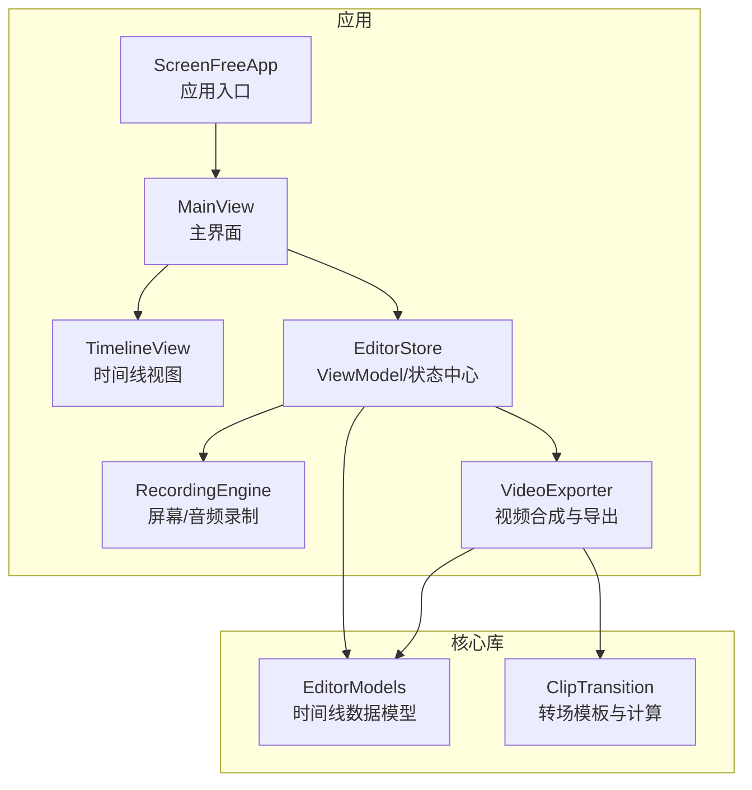
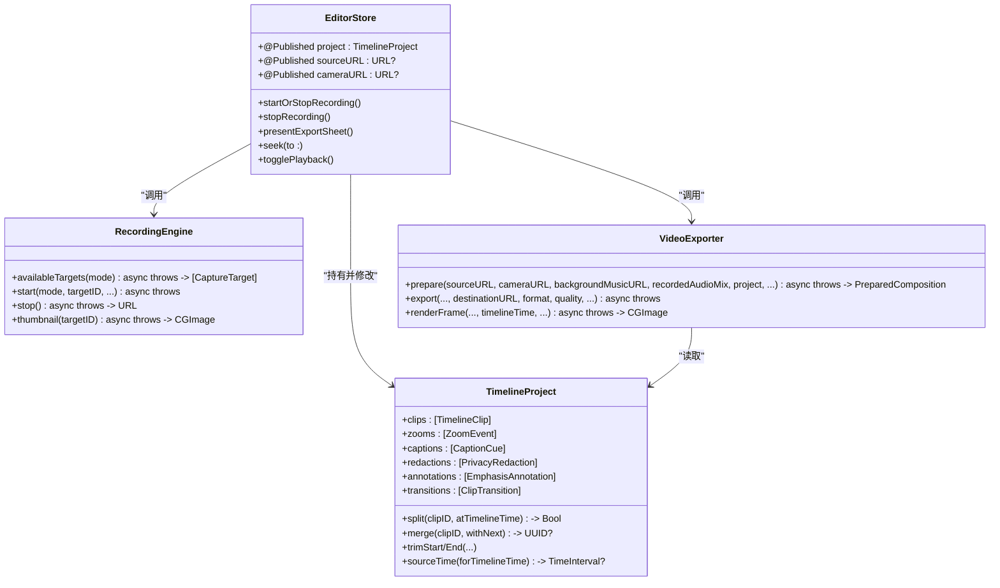
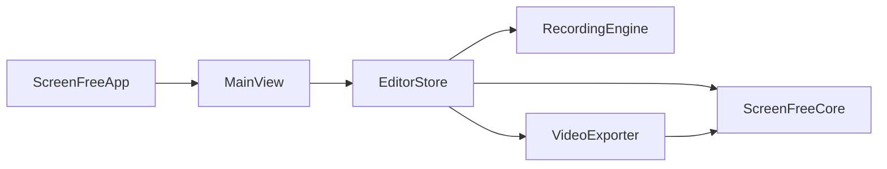
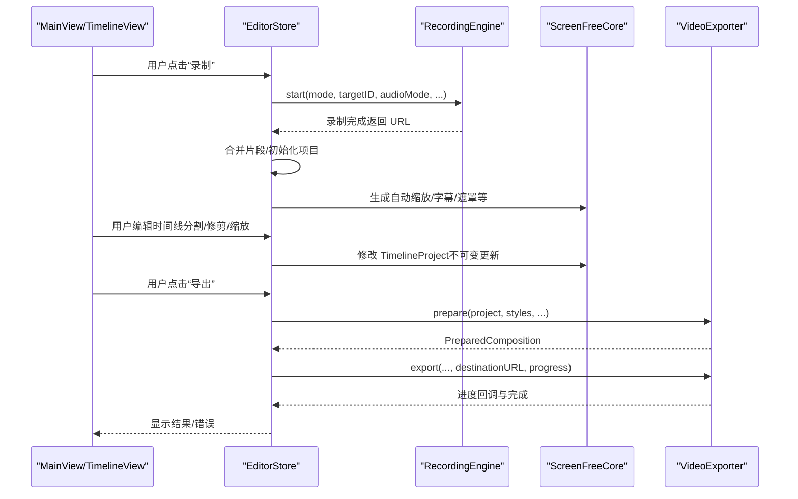
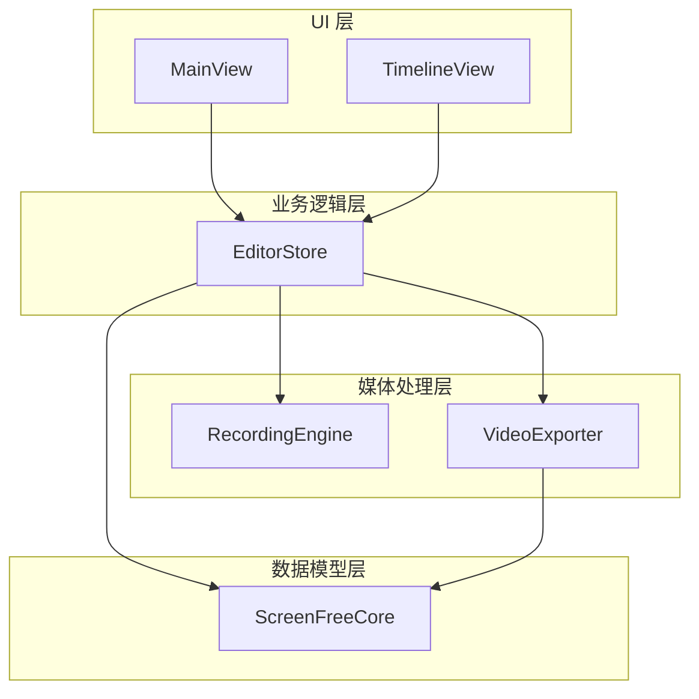

# 架构设计

<cite>
**本文引用的文件**   
- [ScreenFreeApp.swift](file://Sources/ScreenFree/ScreenFreeApp.swift)
- [MainView.swift](file://Sources/ScreenFree/MainView.swift)
- [EditorStore.swift](file://Sources/ScreenFree/EditorStore.swift)
- [TimelineView.swift](file://Sources/ScreenFree/TimelineView.swift)
- [RecordingEngine.swift](file://Sources/ScreenFree/RecordingEngine.swift)
- [VideoExporter.swift](file://Sources/ScreenFree/VideoExporter.swift)
- [EditorModels.swift](file://Sources/ScreenFreeCore/EditorModels.swift)
- [ClipTransition.swift](file://Sources/ScreenFreeCore/ClipTransition.swift)
- [ExportOptions.swift](file://Sources/ScreenFree/ExportOptions.swift)
- [Package.swift](file://Package.swift)
</cite>

## 目录
1. [简介](#简介)
2. [项目结构](#项目结构)
3. [核心组件](#核心组件)
4. [架构总览](#架构总览)
5. [详细组件分析](#详细组件分析)
6. [依赖关系分析](#依赖关系分析)
7. [性能考量](#性能考量)
8. [故障排查指南](#故障排查指南)
9. [结论](#结论)
10. [附录](#附录)

## 简介
本文件为 ScreenFree 的架构设计文档，面向开发者与产品工程师，系统化阐述应用的分层架构、MVVM 实现、数据流与不可变数据模型在时间线编辑中的应用。重点包括：
- UI 层（SwiftUI）与业务逻辑层（EditorStore）的职责分离
- 媒体处理层（RecordingEngine、VideoExporter）的职责边界
- MVVM 模式与 @Published / ObservableObject 的状态管理
- ScreenFreeCore 数据模型的独立性与模块间依赖
- 从录制到编辑再到导出的完整数据路径
- 不可变数据模型与非破坏性编辑的实现原理

## 项目结构
ScreenFree 采用 Swift Package Manager 组织，包含两个主要目标：
- ScreenFree：应用主工程，包含 SwiftUI 界面、编辑器状态、录制与导出等能力
- ScreenFreeCore：纯数据模型与算法库，提供时间线数据结构与剪辑过渡等能力

图表来源
- [ScreenFreeApp.swift:111-140](file://Sources/ScreenFree/ScreenFreeApp.swift#L111-L140)
- [MainView.swift:1-120](file://Sources/ScreenFree/MainView.swift#L1-L120)
- [EditorStore.swift:30-120](file://Sources/ScreenFree/EditorStore.swift#L30-L120)
- [RecordingEngine.swift:63-120](file://Sources/ScreenFree/RecordingEngine.swift#L63-L120)
- [VideoExporter.swift:95-120](file://Sources/ScreenFree/VideoExporter.swift#L95-L120)
- [EditorModels.swift:274-306](file://Sources/ScreenFreeCore/EditorModels.swift#L274-L306)
- [ClipTransition.swift:1-40](file://Sources/ScreenFreeCore/ClipTransition.swift#L1-L40)

章节来源
- [Package.swift:1-35](file://Package.swift#L1-L35)

## 核心组件
- EditorStore：作为 ViewModel，集中管理所有 UI 状态与业务编排，使用 @Published 暴露可观察属性，驱动 SwiftUI 自动刷新
- RecordingEngine：封装屏幕捕获、系统/麦克风音频采集与写入，输出原始媒体片段
- VideoExporter：基于 AVMutableComposition 构建可编辑时间线，叠加摄像头画面、字幕、光标、遮罩与转场，最终导出 MP4/GIF
- ScreenFreeCore：定义不可变的数据模型（TimelineProject、TimelineClip、ZoomEvent、CaptionCue、PrivacyRedaction、EmphasisAnnotation、ClipTransition 等），保证编辑过程非破坏性

章节来源
- [EditorStore.swift:30-120](file://Sources/ScreenFree/EditorStore.swift#L30-L120)
- [RecordingEngine.swift:63-120](file://Sources/ScreenFree/RecordingEngine.swift#L63-L120)
- [VideoExporter.swift:95-120](file://Sources/ScreenFree/VideoExporter.swift#L95-L120)
- [EditorModels.swift:274-306](file://Sources/ScreenFreeCore/EditorModels.swift#L274-L306)
- [ClipTransition.swift:1-40](file://Sources/ScreenFreeCore/ClipTransition.swift#L1-L40)

## 架构总览
ScreenFree 遵循清晰的 MVVM 分层：
- View 层（MainView、TimelineView 等）仅负责展示与用户交互，通过 @ObservedObject 订阅 EditorStore
- ViewModel 层（EditorStore）聚合业务逻辑、协调子系统（录制、导出、设备监控、持久化），并通过 @Published 暴露状态
- 媒体处理层（RecordingEngine、VideoExporter）专注于 I/O 与音视频管线，不感知 UI
- 数据模型层（ScreenFreeCore）提供不可变结构与算法，确保编辑结果可序列化、可测试、可复用

图表来源
- [EditorStore.swift:30-120](file://Sources/ScreenFree/EditorStore.swift#L30-L120)
- [RecordingEngine.swift:63-120](file://Sources/ScreenFree/RecordingEngine.swift#L63-L120)
- [VideoExporter.swift:95-120](file://Sources/ScreenFree/VideoExporter.swift#L95-L120)
- [EditorModels.swift:274-306](file://Sources/ScreenFreeCore/EditorModels.swift#L274-L306)

## 详细组件分析

### EditorStore：MVVM 的 ViewModel 与状态中枢
- 职责
  - 维护 UI 状态（播放头、选中项、工具、面板选择、导出参数、权限、设备信息等）
  - 编排录制流程（准备、倒计时、开始/停止、暂停恢复、合并片段）
  - 编排编辑流程（加载视频、生成自动缩放、分割/修剪/合并、撤销/重做）
  - 编排导出流程（准备 composition、进度回调、错误处理）
- 状态管理
  - 使用 @Published 暴露大量属性，配合 SwiftUI 的响应式更新
  - 使用 Combine 监听关键状态变化，实现自动保存与一致性校验
  - 内部维护时间线编辑快照栈，支持撤销/重做与连续编辑合并
- 关键方法
  - startOrStopRecording/startRecording/stopRecording/toggleRecordingPause
  - loadVideo/importVideo/presentExportSheet/export...
  - undoTimelineEdit/redoTimelineEdit/beginContinuousTimelineEdit/endContinuousTimelineEdit

章节来源
- [EditorStore.swift:30-120](file://Sources/ScreenFree/EditorStore.swift#L30-L120)
- [EditorStore.swift:429-451](file://Sources/ScreenFree/EditorStore.swift#L429-L451)
- [EditorStore.swift:493-643](file://Sources/ScreenFree/EditorStore.swift#L493-L643)
- [EditorStore.swift:653-735](file://Sources/ScreenFree/EditorStore.swift#L653-L735)
- [EditorStore.swift:3397-3415](file://Sources/ScreenFree/EditorStore.swift#L3397-L3415)

### RecordingEngine：屏幕与音频录制引擎
- 职责
  - 枚举可用捕获目标（显示器/窗口/区域）
  - 配置 SCStream 与 AVAssetWriter，写入视频与多路音频（系统音、麦克风、可选应用音）
  - 实时信号处理（降噪、音量归一化）
  - 输出原始媒体文件，供后续编辑与导出
- 关键点
  - 使用专用队列与锁保障并发安全
  - 支持区域裁剪、窗口独立捕获、排除当前进程音频
  - 失败时抛出明确错误类型，便于上层统一处理

章节来源
- [RecordingEngine.swift:63-120](file://Sources/ScreenFree/RecordingEngine.swift#L63-L120)
- [RecordingEngine.swift:174-392](file://Sources/ScreenFree/RecordingEngine.swift#L174-L392)
- [RecordingEngine.swift:394-443](file://Sources/ScreenFree/RecordingEngine.swift#L394-L443)

### VideoExporter：合成与导出管线
- 职责
  - 根据 TimelineProject 构建 AVMutableComposition，插入源视频/音频轨道、摄像头轨道、背景乐
  - 应用缩放、转场、遮罩、字幕、快捷键提示、光标绘制与运动模糊
  - 创建导出会话，支持 MP4/GIF 格式，提供进度回调与取消支持
- 关键点
  - 将渲染样式（CanvasRenderStyle）与时间线数据解耦，便于预览与导出一致
  - 对帧级渲染进行优化（按需绘制覆盖层、避免多余绘制）
  - 错误分类清晰，便于定位问题

章节来源
- [VideoExporter.swift:95-120](file://Sources/ScreenFree/VideoExporter.swift#L95-L120)
- [VideoExporter.swift:103-486](file://Sources/ScreenFree/VideoExporter.swift#L103-L486)
- [VideoExporter.swift:488-590](file://Sources/ScreenFree/VideoExporter.swift#L488-L590)

### ScreenFreeCore：不可变数据模型与算法
- 数据模型
  - TimelineProject：时间线根对象，包含片段、缩放事件、光标采样、点击、字幕、快捷键、隐私遮罩、标注、转场
  - TimelineClip：片段元数据（源起始、时长、速率、音量），支持 isEdited 判断是否偏离原始素材
  - ZoomEvent/CaptionCue/PrivacyRedaction/EmphasisAnnotation/ClipTransition：各编辑元素
- 算法
  - 时间线映射（sourceTime/timelineTime）、最近光标查找、插值平滑
  - 自动缩放生成策略、静音边缘裁剪、转场计算与帧生成
- 设计原则
  - 不可变结构体 + 方法返回新实例或就地变更受控集合，保证编辑历史可回溯
  - Codable/Sendable 支持序列化与跨线程传递

章节来源
- [EditorModels.swift:274-306](file://Sources/ScreenFreeCore/EditorModels.swift#L274-L306)
- [EditorModels.swift:467-522](file://Sources/ScreenFreeCore/EditorModels.swift#L467-L522)
- [EditorModels.swift:525-573](file://Sources/ScreenFreeCore/EditorModels.swift#L525-L573)
- [EditorModels.swift:766-787](file://Sources/ScreenFreeCore/EditorModels.swift#L766-L787)
- [ClipTransition.swift:1-40](file://Sources/ScreenFreeCore/ClipTransition.swift#L1-L40)
- [ClipTransition.swift:132-196](file://Sources/ScreenFreeCore/ClipTransition.swift#L132-L196)

### UI 层：SwiftUI 与状态绑定
- MainView：应用主布局，包含工具栏、预览区、时间线与检查器面板，通过 @ObservedObject store 订阅状态变化
- TimelineView：时间线可视化与交互（拖拽、缩放、分割工具、撤销/重做按钮）
- 键盘与通知：全局快捷键与 ESC/删除/撤销重做路由至 EditorStore

章节来源
- [MainView.swift:1-120](file://Sources/ScreenFree/MainView.swift#L1-L120)
- [TimelineView.swift:1-120](file://Sources/ScreenFree/TimelineView.swift#L1-L120)
- [ScreenFreeApp.swift:1-40](file://Sources/ScreenFree/ScreenFreeApp.swift#L1-L40)

## 依赖关系分析
- 模块依赖
  - ScreenFree 依赖 ScreenFreeCore（数据模型与算法）
  - ScreenFreeApp 注入 EditorStore 到 MainView，形成单一状态源
- 组件耦合
  - EditorStore 强依赖 RecordingEngine、VideoExporter、DeviceMonitor、ProjectPersistence 等
  - VideoExporter 依赖 ScreenFreeCore 的 TimelineProject 与 ClipTransition
- 外部集成
  - 屏幕捕获：SCStream/SCShareableContent
  - 音视频编码：AVAssetWriter/AVAssetExportSession
  - 文件系统：临时目录与用户媒体目录

图表来源
- [Package.swift:1-35](file://Package.swift#L1-L35)
- [ScreenFreeApp.swift:111-140](file://Sources/ScreenFree/ScreenFreeApp.swift#L111-L140)
- [MainView.swift:1-120](file://Sources/ScreenFree/MainView.swift#L1-L120)
- [EditorStore.swift:30-120](file://Sources/ScreenFree/EditorStore.swift#L30-L120)
- [VideoExporter.swift:95-120](file://Sources/ScreenFree/VideoExporter.swift#L95-L120)

章节来源
- [Package.swift:1-35](file://Package.swift#L1-L35)

## 性能考量
- 录制阶段
  - 使用专用队列与锁减少竞争；最小化帧缓冲深度；合理设置码率与关键帧间隔
  - 音频信号处理仅在启用时生效，避免不必要的 CPU 开销
- 导出阶段
  - 按需渲染覆盖层（光标、字幕、快捷键、遮罩），减少无效绘制
  - 使用 AVAssetExportSession 的预设质量与尺寸限制控制文件大小与耗时
  - 进度轮询与任务取消机制提升用户体验
- 时间线编辑
  - 不可变数据模型避免深拷贝与同步开销；撤销/重做使用快照与增量合并
  - 光标插值与抖动过滤降低渲染压力

[本节为通用指导，无需具体文件引用]

## 故障排查指南
- 录制失败
  - 检查屏幕录制权限与麦克风/相机授权
  - 确认目标设备存在且可访问（显示器/窗口/区域）
  - 查看 RecordingError 的具体原因（无源、无法启动写入器等）
- 导出失败
  - 检查源是否包含视频轨道、composition 创建是否成功
  - 关注导出会话状态与错误信息（无法创建会话、读取帧失败等）
- 时间线编辑异常
  - 验证片段相邻性与时间范围合法性
  - 检查转场锚点是否与片段 ID 匹配
  - 使用撤销/重做回滚到稳定状态

章节来源
- [RecordingEngine.swift:40-61](file://Sources/ScreenFree/RecordingEngine.swift#L40-L61)
- [VideoExporter.swift:12-33](file://Sources/ScreenFree/VideoExporter.swift#L12-L33)
- [EditorStore.swift:429-451](file://Sources/ScreenFree/EditorStore.swift#L429-L451)

## 结论
ScreenFree 通过清晰的 MVVM 分层与模块化设计，实现了从录制到编辑再到导出的完整闭环。EditorStore 作为唯一状态源，结合 @Published 与 SwiftUI 的响应式特性，保证了 UI 与逻辑的松耦合。ScreenFreeCore 的不可变数据模型确保了编辑过程的可追溯性与安全性。RecordingEngine 与 VideoExporter 分别承担 I/O 与合成职责，职责边界清晰，易于扩展与维护。整体架构兼顾性能与可维护性，适合持续迭代与功能增强。

[本节为总结性内容，无需具体文件引用]

## 附录

### 数据流图：从录制到编辑再到导出

图表来源
- [EditorStore.swift:493-643](file://Sources/ScreenFree/EditorStore.swift#L493-L643)
- [RecordingEngine.swift:174-392](file://Sources/ScreenFree/RecordingEngine.swift#L174-L392)
- [VideoExporter.swift:103-486](file://Sources/ScreenFree/VideoExporter.swift#L103-L486)
- [EditorModels.swift:274-306](file://Sources/ScreenFreeCore/EditorModels.swift#L274-L306)

### 不可变数据模型与非破坏性编辑
- TimelineClip 的 isEdited 方法用于判断是否偏离原始素材，从而决定是否需要重新编码或保留原片
- 分割/修剪/合并操作均基于不可变结构体，返回新的集合或就地变更受控字段，保持历史可回溯
- 时间线映射函数（sourceTime/timelineTime）确保编辑前后时间轴的一致性

章节来源
- [EditorModels.swift:34-44](file://Sources/ScreenFreeCore/EditorModels.swift#L34-L44)
- [EditorModels.swift:467-522](file://Sources/ScreenFreeCore/EditorModels.swift#L467-L522)
- [EditorModels.swift:525-573](file://Sources/ScreenFreeCore/EditorModels.swift#L525-L573)
- [EditorModels.swift:766-787](file://Sources/ScreenFreeCore/EditorModels.swift#L766-L787)

### 系统架构图

图表来源
- [MainView.swift:1-120](file://Sources/ScreenFree/MainView.swift#L1-L120)
- [TimelineView.swift:1-120](file://Sources/ScreenFree/TimelineView.swift#L1-L120)
- [EditorStore.swift:30-120](file://Sources/ScreenFree/EditorStore.swift#L30-L120)
- [RecordingEngine.swift:63-120](file://Sources/ScreenFree/RecordingEngine.swift#L63-L120)
- [VideoExporter.swift:95-120](file://Sources/ScreenFree/VideoExporter.swift#L95-L120)
- [EditorModels.swift:274-306](file://Sources/ScreenFreeCore/EditorModels.swift#L274-L306)