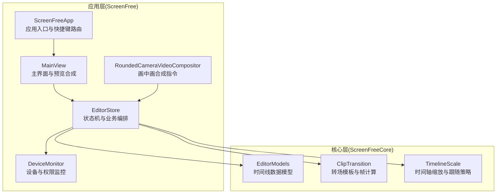
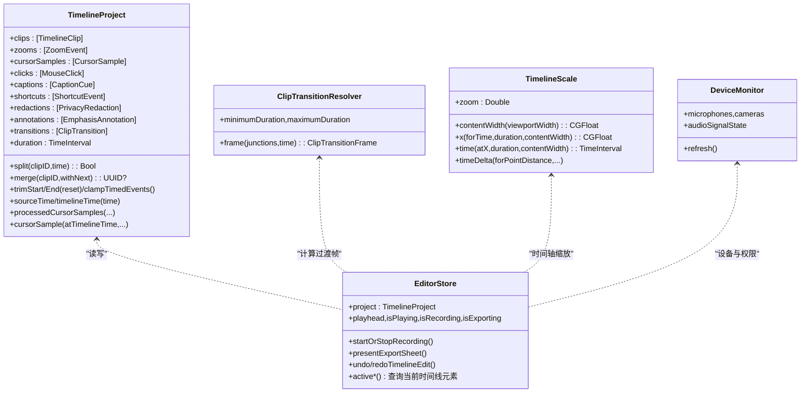
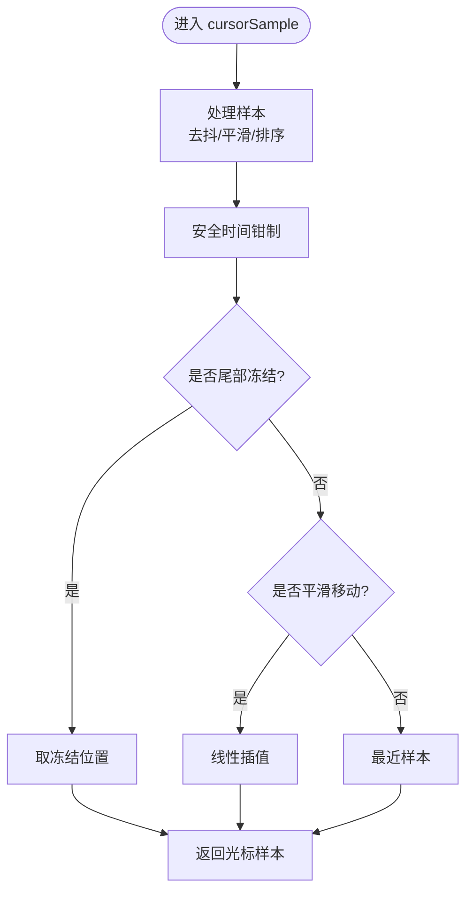
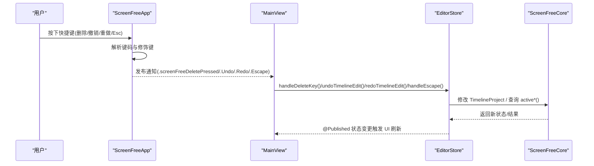
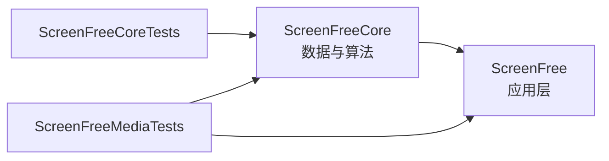
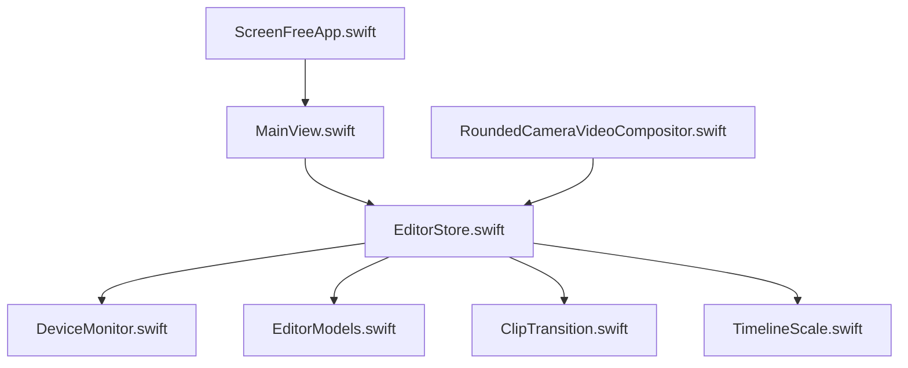

# 模块化设计

<cite>
**本文引用的文件**   
- [Package.swift](file://Package.swift)
- [README.md](file://README.md)
- [ScreenFreeApp.swift](file://Sources/ScreenFree/ScreenFreeApp.swift)
- [MainView.swift](file://Sources/ScreenFree/MainView.swift)
- [EditorStore.swift](file://Sources/ScreenFree/EditorStore.swift)
- [DeviceMonitor.swift](file://Sources/ScreenFree/DeviceMonitor.swift)
- [RoundedCameraVideoCompositor.swift](file://Sources/ScreenFree/RoundedCameraVideoCompositor.swift)
- [EditorModels.swift](file://Sources/ScreenFreeCore/EditorModels.swift)
- [ClipTransition.swift](file://Sources/ScreenFreeCore/ClipTransition.swift)
- [TimelineScale.swift](file://Sources/ScreenFreeCore/TimelineScale.swift)
- [TimelineProjectTests.swift](file://Tests/ScreenFreeCoreTests/TimelineProjectTests.swift)
</cite>

## 目录
1. [简介](#简介)
2. [项目结构](#项目结构)
3. [核心组件](#核心组件)
4. [架构总览](#架构总览)
5. [详细组件分析](#详细组件分析)
6. [依赖关系分析](#依赖关系分析)
7. [性能考量](#性能考量)
8. [故障排查指南](#故障排查指南)
9. [结论](#结论)
10. [附录](#附录)

## 简介
本设计文档围绕 ScreenFree 的模块化设计展开，重点阐述：
- 模块划分原则与职责边界
- ScreenFreeCore 数据模型的独立性
- 模块间依赖关系与松耦合实现（协议/接口）
- 模块化带来的复用性、可测试性与可维护性
- 模块依赖图与关键接口定义，支撑高内聚低耦合目标

## 项目结构
ScreenFree 采用 Swift Package Manager 组织为两个主要目标：
- ScreenFree：应用层（UI、交互、系统能力集成、导出与录制编排）
- ScreenFreeCore：纯数据模型与时间线算法（无 UI、无平台依赖）

图表来源 
- [Package.swift:11-31](file://Package.swift#L11-L31)
- [ScreenFreeApp.swift:111-139](file://Sources/ScreenFree/ScreenFreeApp.swift#L111-L139)
- [MainView.swift:1-10](file://Sources/ScreenFree/MainView.swift#L1-L10)
- [EditorStore.swift:30-120](file://Sources/ScreenFree/EditorStore.swift#L30-L120)
- [DeviceMonitor.swift:43-70](file://Sources/ScreenFree/DeviceMonitor.swift#L43-L70)
- [RoundedCameraVideoCompositor.swift:1-43](file://Sources/ScreenFree/RoundedCameraVideoCompositor.swift#L1-L43)
- [EditorModels.swift:1-10](file://Sources/ScreenFreeCore/EditorModels.swift#L1-L10)
- [ClipTransition.swift:1-20](file://Sources/ScreenFreeCore/ClipTransition.swift#L1-L20)
- [TimelineScale.swift:1-15](file://Sources/ScreenFreeCore/TimelineScale.swift#L1-L15)

章节来源
- [Package.swift:1-35](file://Package.swift#L1-L35)
- [README.md:1-120](file://README.md#L1-L120)

## 核心组件
- ScreenFreeCore（数据与算法层）
  - EditorModels：时间线剪辑、鼠标轨迹、点击事件、字幕、快捷键、隐私遮罩、强调标注等不可变数据结构，提供裁剪、合并、分割、静音边缘修剪、光标插值与平滑等算法。
  - ClipTransition：转场样式与过渡帧计算，保证在切点处对左右片段施加统一视觉变化。
  - TimelineScale：时间轴像素-时间映射与播放跟随策略，确保缩放与拖拽一致性。
- ScreenFree（应用层）
  - ScreenFreeApp：应用生命周期、全局快捷键捕获与分发。
  - MainView：主界面布局、预览合成、工具栏与面板控制。
  - EditorStore：全局状态机、录制/导出编排、媒体管线协调、撤销/重做历史、与 Core 数据模型的双向交互。
  - DeviceMonitor：麦克风/摄像头设备枚举、授权状态、实时电平监测。
  - RoundedCameraVideoCompositor：AVFoundation 视频合成指令，支持圆角画中画。

章节来源
- [EditorModels.swift:1-120](file://Sources/ScreenFreeCore/EditorModels.swift#L1-L120)
- [ClipTransition.swift:1-130](file://Sources/ScreenFreeCore/ClipTransition.swift#L1-L130)
- [TimelineScale.swift:1-115](file://Sources/ScreenFreeCore/TimelineScale.swift#L1-L115)
- [ScreenFreeApp.swift:1-110](file://Sources/ScreenFree/ScreenFreeApp.swift#L1-L110)
- [MainView.swift:1-120](file://Sources/ScreenFree/MainView.swift#L1-L120)
- [EditorStore.swift:1-200](file://Sources/ScreenFree/EditorStore.swift#L1-L200)
- [DeviceMonitor.swift:43-120](file://Sources/ScreenFree/DeviceMonitor.swift#L43-L120)
- [RoundedCameraVideoCompositor.swift:1-43](file://Sources/ScreenFree/RoundedCameraVideoCompositor.swift#L1-L43)

## 架构总览
ScreenFree 采用“应用层 + 核心数据层”的分层架构。应用层负责 UI、系统能力与业务流程编排；核心层仅提供纯 Swift 数据模型与算法，不依赖任何 UI 或平台框架，从而具备跨环境复用的能力。

图表来源 
- [EditorModels.swift:274-470](file://Sources/ScreenFreeCore/EditorModels.swift#L274-L470)
- [ClipTransition.swift:88-130](file://Sources/ScreenFreeCore/ClipTransition.swift#L88-L130)
- [TimelineScale.swift:5-50](file://Sources/ScreenFreeCore/TimelineScale.swift#L5-L50)
- [EditorStore.swift:30-120](file://Sources/ScreenFree/EditorStore.swift#L30-L120)
- [DeviceMonitor.swift:43-70](file://Sources/ScreenFree/DeviceMonitor.swift#L43-L70)

## 详细组件分析

### ScreenFreeCore：数据模型与算法
- 数据模型独立性
  - 所有类型均为 Sendable/Codable/Equatable，便于序列化、并发访问与比较。
  - 时间线操作（分割、合并、修剪、静音边缘裁剪）均基于不可变输入与确定性输出，避免副作用。
- 关键算法
  - 光标处理：抖动去除、快速变化优化、线性插值、尾部冻结与回退动画。
  - 转场计算：在切点窗口内按 smoothstep 曲线生成叠加透明度与缩放。
  - 时间轴缩放：内容宽度、时间-像素双向映射、播放跟随策略。

图表来源 
- [EditorModels.swift:590-758](file://Sources/ScreenFreeCore/EditorModels.swift#L590-L758)

章节来源
- [EditorModels.swift:1-200](file://Sources/ScreenFreeCore/EditorModels.swift#L1-L200)
- [ClipTransition.swift:1-130](file://Sources/ScreenFreeCore/ClipTransition.swift#L1-L130)
- [TimelineScale.swift:1-115](file://Sources/ScreenFreeCore/TimelineScale.swift#L1-L115)

### ScreenFree：应用编排与状态机
- ScreenFreeApp
  - 注册 NSApplicationDelegate，监听全局键盘事件，通过通知中心将删除、撤销/重做、Esc 等事件分发给 UI。
- MainView
  - 组合预览、时间线与检查器面板；根据 EditorStore 状态渲染转场叠加、字幕、快捷键提示、点击特效与光标替换。
- EditorStore
  - 集中管理录制、导出、播放器、设备、项目持久化、历史与撤销栈；对外暴露命令式 API，对内驱动 UI 状态更新。
  - 通过 Combine 与 @Published 属性驱动 SwiftUI 响应式更新。

图表来源 
- [ScreenFreeApp.swift:41-109](file://Sources/ScreenFree/ScreenFreeApp.swift#L41-L109)
- [MainView.swift:51-106](file://Sources/ScreenFree/MainView.swift#L51-L106)
- [EditorStore.swift:200-380](file://Sources/ScreenFree/EditorStore.swift#L200-L380)

章节来源
- [ScreenFreeApp.swift:1-110](file://Sources/ScreenFree/ScreenFreeApp.swift#L1-L110)
- [MainView.swift:1-200](file://Sources/ScreenFree/MainView.swift#L1-L200)
- [EditorStore.swift:1-200](file://Sources/ScreenFree/EditorStore.swift#L1-L200)

### 设备与权限监控（DeviceMonitor）
- 提供麦克风/摄像头枚举、授权状态、实时电平与信号质量判断。
- 与 EditorStore 协作，初始化默认设备并刷新可用列表。

章节来源
- [DeviceMonitor.swift:43-120](file://Sources/ScreenFree/DeviceMonitor.swift#L43-L120)

### 视频合成（RoundedCameraVideoCompositor）
- 实现 AVVideoCompositionInstructionProtocol，用于屏幕轨道与相机轨道的合成，支持圆角裁切与图层指令。

章节来源
- [RoundedCameraVideoCompositor.swift:1-43](file://Sources/ScreenFree/RoundedCameraVideoCompositor.swift#L1-L43)

## 依赖关系分析
- 编译期依赖
  - ScreenFree 依赖 ScreenFreeCore（数据与算法）。
  - 测试目标 ScreenFreeCoreTests 仅依赖 ScreenFreeCore；ScreenFreeMediaTests 同时依赖 ScreenFree 与 ScreenFreeCore。
- 运行时依赖
  - EditorStore 作为编排中枢，依赖 Core 数据模型进行时间线编辑与查询；依赖 DeviceMonitor 获取设备与权限；依赖 AVFoundation/AppKit 完成媒体与 UI。
  - MainView 仅消费 EditorStore 的 @Published 状态，不直接持有底层系统对象。

图表来源 
- [Package.swift:11-31](file://Package.swift#L11-L31)

章节来源
- [Package.swift:1-35](file://Package.swift#L1-L35)

## 性能考量
- 数据模型不可变与最小化拷贝：EditorModels 使用值类型与只读属性，减少状态同步开销。
- 时间轴缩放与跟随策略：TimelineScale 提供 O(1) 映射函数，避免频繁重算。
- 光标处理流水线：先过滤再插值，限制遍历次数与内存分配。
- 转场计算仅在切点附近生效，避免全片逐帧复杂运算。
- 导出路径：通过 VideoExporter 与 AVFoundation 管线，结合取消与原子写入，避免部分输出残留。

[本节为通用指导，无需代码引用]

## 故障排查指南
- 权限问题
  - 屏幕录制、麦克风、摄像头、输入监控等权限缺失会导致功能降级或失败。EditorStore.refreshPermissionState 会刷新并设置 capturePermissionIssue 标志。
- 设备不可用
  - DeviceMonitor.refresh 后若 microphones/cameras 为空，需检查系统权限与设备连接。
- 导出异常
  - ExportOptions 与 VideoExporter 的错误会在 store.exportProgress 与 errorMessage 中体现，建议检查分辨率、帧率与质量配置。
- 时间线编辑无效
  - split/merge/trim 等方法有前置条件（如相邻性、速度/音量一致），失败时返回 false 或 nil，应检查参数与上下文。

章节来源
- [EditorStore.swift:441-491](file://Sources/ScreenFree/EditorStore.swift#L441-L491)
- [DeviceMonitor.swift:69-120](file://Sources/ScreenFree/DeviceMonitor.swift#L69-L120)

## 结论
ScreenFree 通过清晰的模块边界与数据模型独立性，实现了高内聚低耦合的设计目标：
- ScreenFreeCore 专注数据与算法，易于单元测试与跨平台复用。
- ScreenFree 聚焦 UI、系统与媒体编排，通过 EditorStore 统一入口降低耦合。
- 借助协议/接口与值类型设计，模块间通信简洁稳定，测试与维护成本显著降低。

[本节为总结性内容，无需代码引用]

## 附录

### 模块依赖图（代码级）

图表来源 
- [ScreenFreeApp.swift:111-139](file://Sources/ScreenFree/ScreenFreeApp.swift#L111-L139)
- [MainView.swift:1-10](file://Sources/ScreenFree/MainView.swift#L1-L10)
- [EditorStore.swift:30-120](file://Sources/ScreenFree/EditorStore.swift#L30-L120)
- [DeviceMonitor.swift:43-70](file://Sources/ScreenFree/DeviceMonitor.swift#L43-L70)
- [EditorModels.swift:1-10](file://Sources/ScreenFreeCore/EditorModels.swift#L1-L10)
- [ClipTransition.swift:1-20](file://Sources/ScreenFreeCore/ClipTransition.swift#L1-L20)
- [TimelineScale.swift:1-15](file://Sources/ScreenFreeCore/TimelineScale.swift#L1-L15)
- [RoundedCameraVideoCompositor.swift:1-43](file://Sources/ScreenFree/RoundedCameraVideoCompositor.swift#L1-L43)

### 接口与协议要点（概念说明）
- 数据模型接口
  - TimelineProject：提供剪辑、转场、标注、字幕、快捷键、隐私遮罩等集合与时间线操作方法。
  - ClipTransitionResolver：根据切点与时间计算过渡帧。
  - TimelineScale：时间-像素映射与播放跟随决策。
- 应用层接口
  - EditorStore：对外暴露录制、导出、时间线编辑、语言切换、状态查询等命令式 API。
  - DeviceMonitor：设备枚举、授权状态、实时电平与信号质量。

[本节为概念说明，无需代码引用]

### 测试与验证
- ScreenFreeCoreTests：覆盖 TimelineProject 的时间线行为、转场与缩放映射。
- ScreenFreeMediaTests：覆盖音频分析、导出、本地化、设备监控、光标与转场等端到端场景。

章节来源
- [TimelineProjectTests.swift:1-200](file://Tests/ScreenFreeCoreTests/TimelineProjectTests.swift#L1-L200)