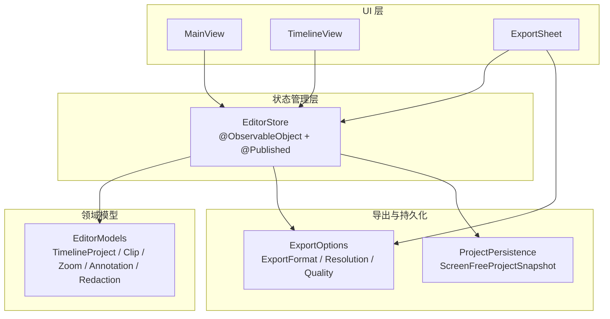
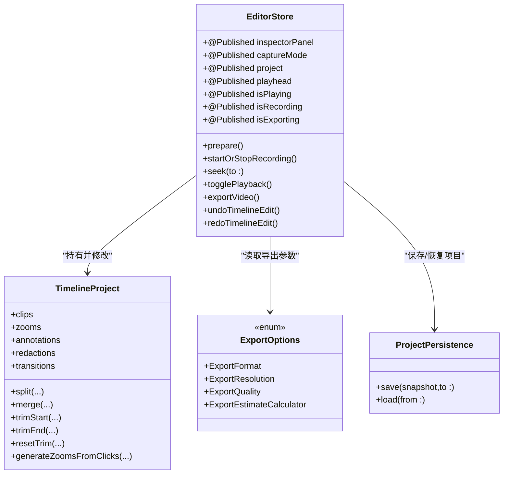
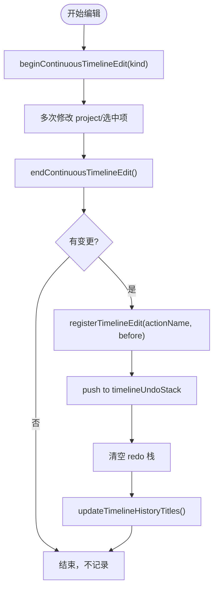
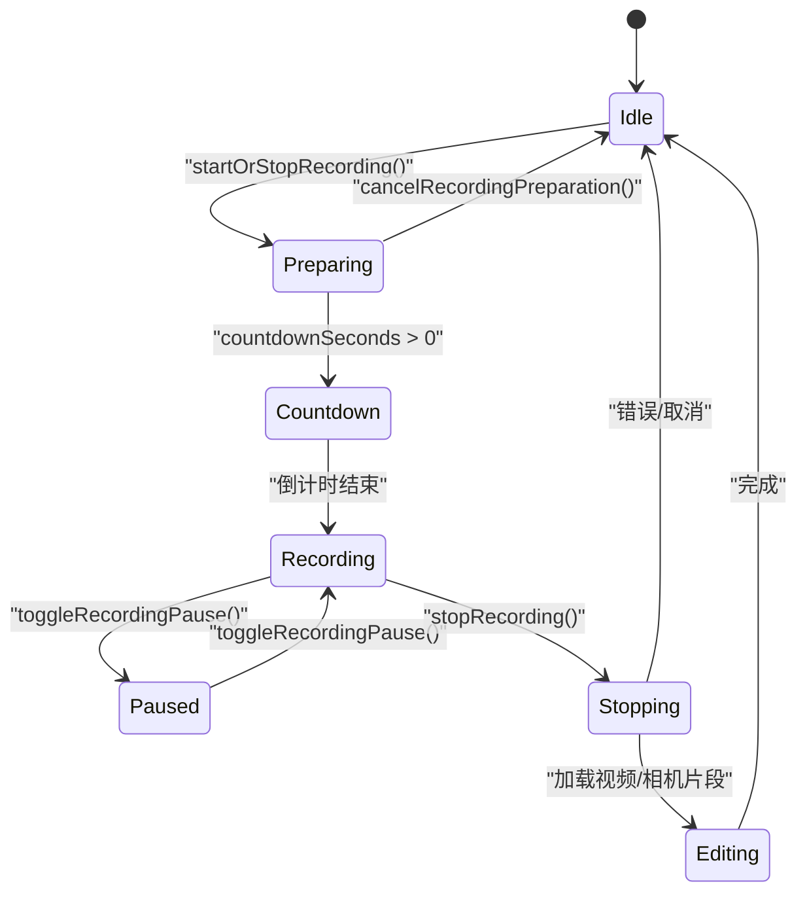
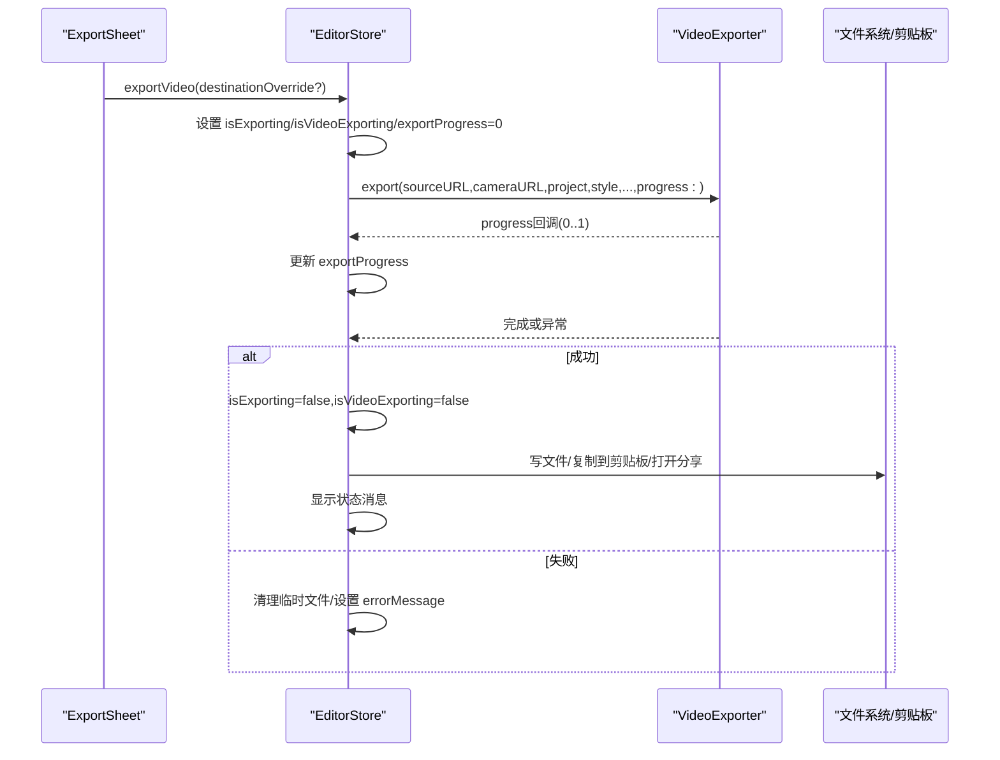
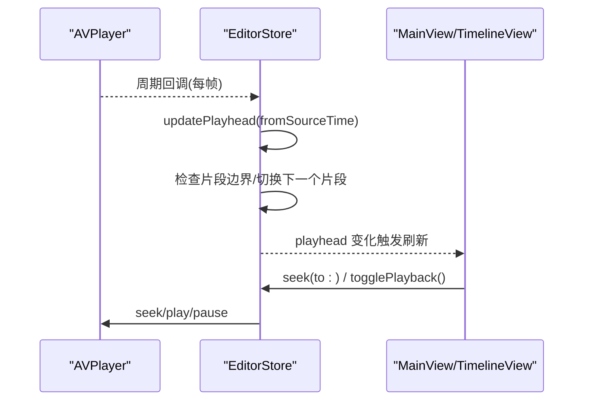
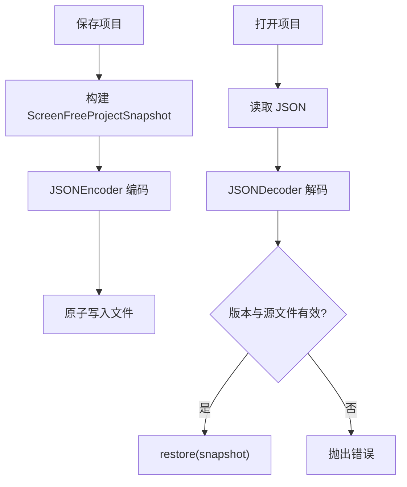
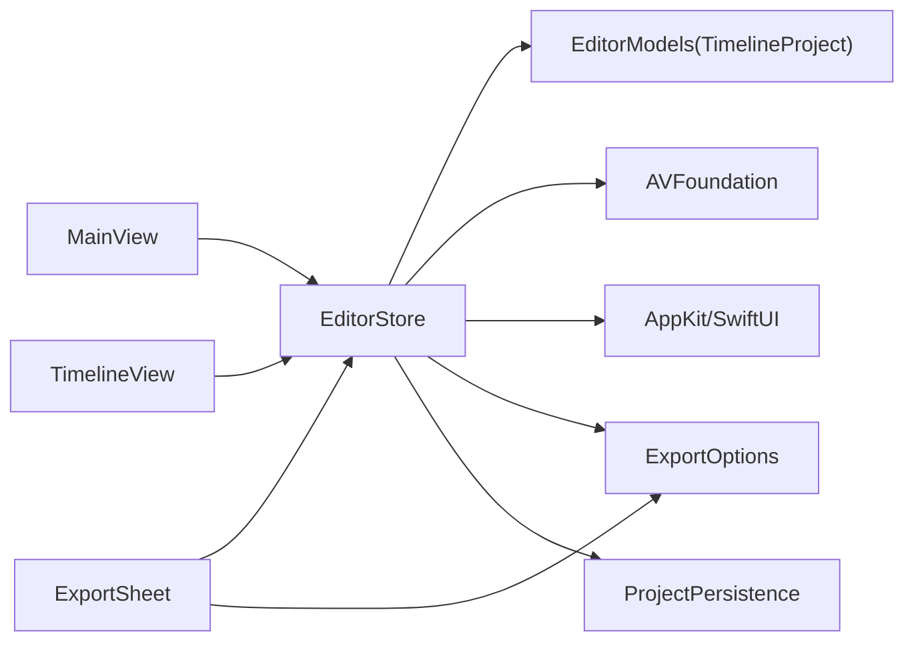

# 状态管理

<cite>
**本文引用的文件**   
- [EditorStore.swift](file://Sources/ScreenFree/EditorStore.swift)
- [EditorModels.swift](file://Sources/ScreenFreeCore/EditorModels.swift)
- [MainView.swift](file://Sources/ScreenFree/MainView.swift)
- [TimelineView.swift](file://Sources/ScreenFree/TimelineView.swift)
- [ExportSheet.swift](file://Sources/ScreenFree/ExportSheet.swift)
- [ExportOptions.swift](file://Sources/ScreenFree/ExportOptions.swift)
- [ProjectPersistence.swift](file://Sources/ScreenFree/ProjectPersistence.swift)
</cite>

## 目录
1. [简介](#简介)
2. [项目结构](#项目结构)
3. [核心组件](#核心组件)
4. [架构总览](#架构总览)
5. [详细组件分析](#详细组件分析)
6. [依赖关系分析](#依赖关系分析)
7. [性能考量](#性能考量)
8. [故障排查指南](#故障排查指南)
9. [结论](#结论)
10. [附录](#附录)

## 简介
本文件系统性阐述 ScreenFree 的状态管理设计，重点围绕 EditorStore 作为单一状态源（Single Source of Truth）的理念展开。文档解释 @Published 属性的使用模式、ObservableObject 协议的实现方式，以及录制状态、编辑状态、导出状态等关键状态的组织结构与更新机制。同时给出用户操作如何触发状态变更、状态变更如何驱动 SwiftUI UI 更新的完整流程，并包含状态转换图与最佳实践建议。

## 项目结构
ScreenFree 的状态管理以 EditorStore 为核心，结合 SwiftUI 的 @ObservedObject 绑定到视图层；时间线数据模型集中在 ScreenFreeCore 的 EditorModels.swift；导出配置与计算在 ExportOptions.swift；项目持久化由 ProjectPersistence.swift 负责。UI 层通过 MainView、TimelineView、ExportSheet 等视图订阅 EditorStore 的变化并响应交互。

**图表来源** 
- [EditorStore.swift:120-340](file://Sources/ScreenFree/EditorStore.swift#L120-L340)
- [EditorModels.swift:274-306](file://Sources/ScreenFreeCore/EditorModels.swift#L274-L306)
- [ExportOptions.swift:79-182](file://Sources/ScreenFree/ExportOptions.swift#L79-L182)
- [ProjectPersistence.swift:4-65](file://Sources/ScreenFree/ProjectPersistence.swift#L4-L65)

**章节来源**
- [EditorStore.swift:120-340](file://Sources/ScreenFree/EditorStore.swift#L120-L340)
- [EditorModels.swift:274-306](file://Sources/ScreenFreeCore/EditorModels.swift#L274-L306)
- [ExportOptions.swift:79-182](file://Sources/ScreenFree/ExportOptions.swift#L79-L182)
- [ProjectPersistence.swift:4-65](file://Sources/ScreenFree/ProjectPersistence.swift#L4-L65)

## 核心组件
- EditorStore：应用唯一状态源，持有所有 UI 可见状态与业务逻辑入口，采用 @MainActor 保证线程安全，并通过 @Published 暴露属性供 SwiftUI 自动刷新。
- TimelineProject（EditorModels）：时间线数据结构，封装片段、缩放、标注、隐私遮挡、转场等编辑对象及其算法。
- ExportOptions：导出格式、分辨率、质量、帧率等选项及估算器。
- ProjectPersistence：项目快照序列化与恢复。

关键职责划分：
- 状态定义与发布：EditorStore 中的 @Published 属性
- 状态变更方法：EditorStore 的异步/同步方法（如 startRecording、seek、exportVideo）
- 数据模型与算法：EditorModels 中的 TimelineProject 及相关结构体
- 导出策略与估算：ExportOptions
- 持久化：ProjectPersistence

**章节来源**
- [EditorStore.swift:120-340](file://Sources/ScreenFree/EditorStore.swift#L120-L340)
- [EditorModels.swift:274-306](file://Sources/ScreenFreeCore/EditorModels.swift#L274-L306)
- [ExportOptions.swift:79-182](file://Sources/ScreenFree/ExportOptions.swift#L79-L182)
- [ProjectPersistence.swift:4-65](file://Sources/ScreenFree/ProjectPersistence.swift#L4-L65)

## 架构总览
EditorStore 作为单一状态源，集中管理录制、播放、时间线编辑、导出、样式与设备权限等状态。UI 层通过 @ObservedObject 订阅这些 @Published 属性，任何状态变化都会自动触发对应视图的重新渲染。

**图表来源** 
- [EditorStore.swift:120-340](file://Sources/ScreenFree/EditorStore.swift#L120-L340)
- [EditorModels.swift:274-306](file://Sources/ScreenFreeCore/EditorModels.swift#L274-L306)
- [ExportOptions.swift:79-182](file://Sources/ScreenFree/ExportOptions.swift#L79-L182)
- [ProjectPersistence.swift:4-65](file://Sources/ScreenFree/ProjectPersistence.swift#L4-L65)

## 详细组件分析

### EditorStore：单一状态源与 @Published 模式
- 设计理念：所有可观察状态集中在 EditorStore，避免分散状态导致的不一致。
- 实现要点：
  - 类声明为 @MainActor final class EditorStore: ObservableObject，确保主线程安全与 SwiftUI 集成。
  - 大量 @Published 属性覆盖录制、播放、时间线选择、导出、样式、设备等维度。
  - 属性 setter 中常伴随副作用（如写入 UserDefaults、刷新播放器混音、更新状态消息）。
- 典型状态分组：
  - 录制状态：isRecording、isPreparingRecording、recordingCountdownRemaining、recordingElapsed、isRecordingPaused、isTransitioningRecording
  - 播放状态：playhead、isPlaying、sourceURL、sourceDuration、sourceAspectRatio、sourcePixelSize、sourceFrameRate
  - 时间线编辑：project、selectedClipID、selectedZoomID、selectedRedactionID、selectedAnnotationID、activeTimelineTool、timelineZoom、timelineUndoTitle、timelineRedoTitle
  - 导出状态：isExporting、isVideoExporting、exportProgress、exportDestination、exportFormat、exportResolution、exportQuality、exportFrameRate
  - 样式与效果：canvasAspectRatio、canvasContentMode、cursorSize、zoomScale、transitionStyle、motionBlurEnabled 等
  - 设备与权限：captureTargets、selectedTargetID、audioApplications、selectedAudioApplicationIDs、selectedMicrophoneID、selectedCameraID、inputMonitoringGranted、capturePermissionIssue

状态更新触发机制：
- 用户交互：按钮点击、拖拽、键盘快捷键等调用 EditorStore 的方法，修改 @Published 属性。
- 系统回调：AVPlayer 时间观察者周期性更新 playhead；设备监控更新麦克风/摄像头状态。
- 后台任务：导出、字幕生成、音频分析等异步任务完成后更新状态。

UI 驱动更新：
- SwiftUI 视图通过 @ObservedObject var store: EditorStore 订阅，任何 @Published 属性变化都会触发视图重建或局部刷新。
- 例如 TimelineView 监听 activeTimelineTool、timelineZoom、project.clips 等，实时更新轨道、游标、工具提示。

**章节来源**
- [EditorStore.swift:120-340](file://Sources/ScreenFree/EditorStore.swift#L120-L340)
- [MainView.swift:6-107](file://Sources/ScreenFree/MainView.swift#L6-L107)
- [TimelineView.swift:5-130](file://Sources/ScreenFree/TimelineView.swift#L5-L130)

### 时间线编辑与撤销/重做
- 时间线编辑包括剪辑分割、合并、修剪、速度/音量调整、缩放范围编辑、隐私遮挡、标注、转场等。
- 撤销/重做机制：
  - 使用内部快照 TimelineEditorSnapshot 记录 project、选中项、工具、播放头等。
  - beginContinuousTimelineEdit/endContinuousTimelineEdit 支持连续编辑聚合为一个撤销单元。
  - undoTimelineEdit/redoTimelineEdit 维护两个栈，限制最大长度，并在恢复时刷新音频混音与播放头。

**图表来源** 
- [EditorStore.swift:1623-1776](file://Sources/ScreenFree/EditorStore.swift#L1623-L1776)

**章节来源**
- [EditorStore.swift:1623-1776](file://Sources/ScreenFree/EditorStore.swift#L1623-L1776)

### 录制状态机与生命周期
录制状态涵盖准备、倒计时、运行、暂停、停止、错误恢复等阶段。关键状态变量：isPreparingRecording、recordingCountdownRemaining、isRecording、isRecordingPaused、isTransitioningRecording。

**图表来源** 
- [EditorStore.swift:493-735](file://Sources/ScreenFree/EditorStore.swift#L493-L735)

**章节来源**
- [EditorStore.swift:493-735](file://Sources/ScreenFree/EditorStore.swift#L493-L735)

### 导出流程与状态联动
导出涉及格式、分辨率、质量、帧率、目标位置等配置，导出过程中更新 isExporting、isVideoExporting、exportProgress，并在完成后根据目标执行不同动作（文件保存、剪贴板、分享链接）。

**图表来源** 
- [ExportSheet.swift:264-316](file://Sources/ScreenFree/ExportSheet.swift#L264-L316)
- [EditorStore.swift:2630-2744](file://Sources/ScreenFree/EditorStore.swift#L2630-L2744)

**章节来源**
- [ExportSheet.swift:264-316](file://Sources/ScreenFree/ExportSheet.swift#L264-L316)
- [EditorStore.swift:2630-2744](file://Sources/ScreenFree/EditorStore.swift#L2630-L2744)

### 播放与时间轴同步
播放状态由 AVPlayer 驱动，EditorStore 通过时间观察者周期性更新 playhead，并根据当前片段上下文决定播放速率与跨片段跳转。

**图表来源** 
- [EditorStore.swift:3163-3199](file://Sources/ScreenFree/EditorStore.swift#L3163-L3199)
- [MainView.swift:188-203](file://Sources/ScreenFree/MainView.swift#L188-L203)

**章节来源**
- [EditorStore.swift:3163-3199](file://Sources/ScreenFree/EditorStore.swift#L3163-L3199)
- [MainView.swift:188-203](file://Sources/ScreenFree/MainView.swift#L188-L203)

### 项目持久化与恢复
项目快照包含源路径、相机路径、时间线项目、画布样式、光标样式、背景音乐、录制音频布局、转场等。保存与加载过程校验版本与源文件存在性。

**图表来源** 
- [ProjectPersistence.swift:94-119](file://Sources/ScreenFree/ProjectPersistence.swift#L94-L119)
- [EditorStore.swift:1242-1259](file://Sources/ScreenFree/EditorStore.swift#L1242-L1259)

**章节来源**
- [ProjectPersistence.swift:94-119](file://Sources/ScreenFree/ProjectPersistence.swift#L94-L119)
- [EditorStore.swift:1242-1259](file://Sources/ScreenFree/EditorStore.swift#L1242-L1259)

## 依赖关系分析
- EditorStore 依赖：
  - ScreenFreeCore.EditorModels：时间线数据结构与算法
  - AVFoundation：播放器、音频混音、媒体处理
  - AppKit/SwiftUI：UI 交互、窗口协调器、粘贴板
  - Foundation：UserDefaults、文件管理、并发 Task
- 视图依赖：
  - MainView、TimelineView、ExportSheet 均通过 @ObservedObject 绑定 EditorStore
- 导出依赖：
  - ExportOptions 提供格式、分辨率、质量、估算器
  - VideoExporter（外部模块）执行实际渲染与输出

**图表来源** 
- [MainView.swift:6-107](file://Sources/ScreenFree/MainView.swift#L6-L107)
- [TimelineView.swift:5-130](file://Sources/ScreenFree/TimelineView.swift#L5-L130)
- [ExportSheet.swift:3-54](file://Sources/ScreenFree/ExportSheet.swift#L3-L54)
- [EditorStore.swift:120-340](file://Sources/ScreenFree/EditorStore.swift#L120-L340)

**章节来源**
- [MainView.swift:6-107](file://Sources/ScreenFree/MainView.swift#L6-L107)
- [TimelineView.swift:5-130](file://Sources/ScreenFree/TimelineView.swift#L5-L130)
- [ExportSheet.swift:3-54](file://Sources/ScreenFree/ExportSheet.swift#L3-L54)
- [EditorStore.swift:120-340](file://Sources/ScreenFree/EditorStore.swift#L120-L340)

## 性能考量
- 播放与时间轴：使用 AVPlayer 的时间观察者，按固定间隔更新 playhead，避免频繁 UI 刷新。
- 音频混音：refreshSourceAudioMix 使用 generation 计数防止竞态，仅在必要时机重建 AVMutableAudioMix。
- 导出进度：通过回调逐步更新 exportProgress，避免阻塞主线程。
- 撤销栈限制：最多保留 100 条历史，控制内存占用。
- 资源清理：deinit 中移除观察者、取消任务、释放定时器。

[本节为通用指导，无需具体文件引用]

## 故障排查指南
- 屏幕录制权限问题：
  - 现象：capturePermissionIssue=true，无法获取捕获目标
  - 处理：requestScreenRecordingPermission，引导用户开启权限
- 麦克风/摄像头授权：
  - 现象：errorMessage 提示需要授权
  - 处理：deviceMonitor.requestMicrophoneAccess/cameraAuthorization，必要时展示预览
- 导出失败：
  - 现象：isExporting=true 但无进度或报错
  - 处理：检查 destination 是否可写，查看 errorMessage，清理临时文件
- 时间线编辑无效：
  - 现象：split/merge/trim 无效果
  - 处理：确认 selectedClipID 有效、playhead 在片段范围内、project.duration>0

**章节来源**
- [EditorStore.swift:441-480](file://Sources/ScreenFree/EditorStore.swift#L441-L480)
- [EditorStore.swift:2630-2744](file://Sources/ScreenFree/EditorStore.swift#L2630-L2744)
- [EditorStore.swift:1436-1509](file://Sources/ScreenFree/EditorStore.swift#L1436-L1509)

## 结论
ScreenFree 的状态管理以 EditorStore 为中心，通过 @Published 与 ObservableObject 将状态变化透明地传递给 SwiftUI 视图，形成清晰的数据流与单向更新路径。录制、播放、时间线编辑、导出、样式与设备权限等状态被合理组织，配合撤销/重做、持久化与导出估算，构建了健壮且易扩展的状态管理体系。遵循单一状态源、最小副作用、明确状态转换的原则，有助于提升可维护性与用户体验。

[本节为总结，无需具体文件引用]

## 附录
- 常见状态管理模式最佳实践：
  - 将 UI 相关状态集中在 EditorStore，避免在多个视图间共享复杂状态
  - 使用 @Published 仅暴露必要的状态，内部状态保持私有
  - 对副作用（文件 IO、网络、系统 API）进行封装，统一错误处理
  - 使用快照与栈实现撤销/重做，限制历史长度
  - 导出与长耗时任务使用 Task 与回调，避免阻塞主线程
  - 通过常量/枚举表达状态与选项，提高可读性与类型安全

[本节为通用指导，无需具体文件引用]