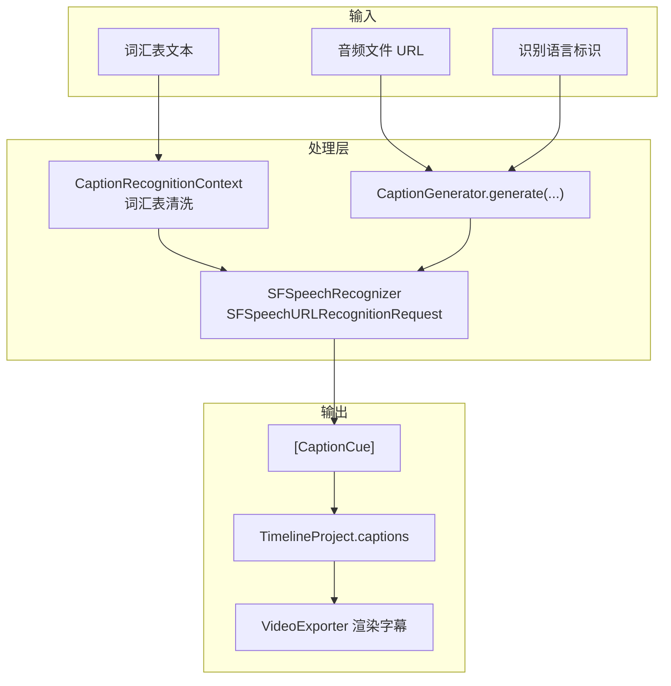
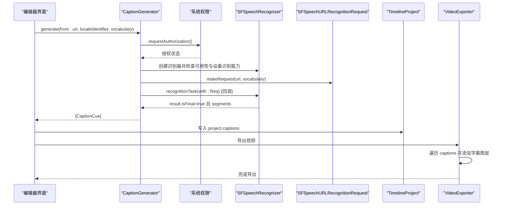
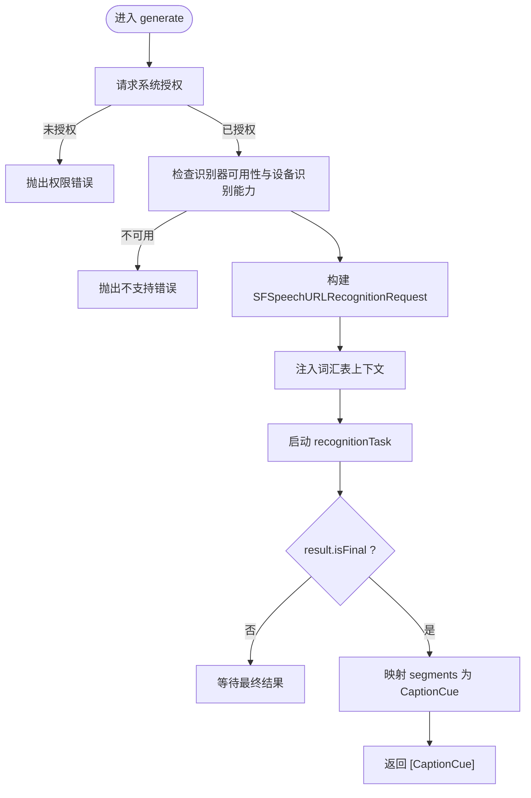
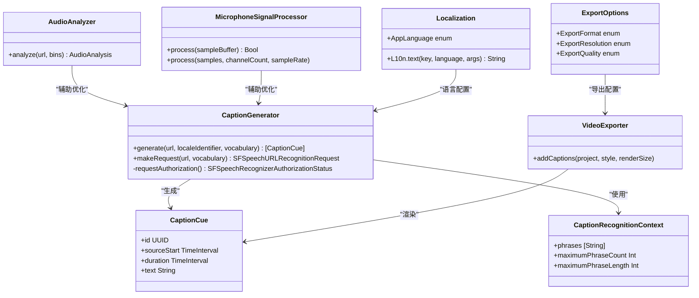

# 字幕生成功能

<cite>
**本文引用的文件**   
- [CaptionGenerator.swift](file://Sources/ScreenFree/CaptionGenerator.swift)
- [EditorModels.swift](file://Sources/ScreenFreeCore/EditorModels.swift)
- [VideoExporter.swift](file://Sources/ScreenFree/VideoExporter.swift)
- [AudioAnalyzer.swift](file://Sources/ScreenFree/AudioAnalyzer.swift)
- [MicrophoneSignalProcessor.swift](file://Sources/ScreenFree/MicrophoneSignalProcessor.swift)
- [Localization.swift](file://Sources/ScreenFree/Localization.swift)
- [ExportOptions.swift](file://Sources/ScreenFree/ExportOptions.swift)
- [CaptionGeneratorTests.swift](file://Tests/ScreenFreeMediaTests/CaptionGeneratorTests.swift)
- [Localizable.strings (en)](file://Sources/ScreenFree/Resources/en.lproj/Localizable.strings)
- [Localizable.strings (zh-Hans)](file://Sources/ScreenFree/Resources/zh-Hans.lproj/Localizable.strings)
</cite>

## 目录
1. [简介](#简介)
2. [项目结构](#项目结构)
3. [核心组件](#核心组件)
4. [架构总览](#架构总览)
5. [详细组件分析](#详细组件分析)
6. [依赖关系分析](#依赖关系分析)
7. [性能考量](#性能考量)
8. [故障排查指南](#故障排查指南)
9. [结论](#结论)
10. [附录：配置与示例](#附录配置与示例)

## 简介
本技术文档围绕 ScreenFree 的自动字幕生成功能，系统性阐述基于 Apple Speech 框架的语音识别实现、音频预处理、时间戳对齐、字幕编辑与导出等关键环节。重点解析 CaptionGenerator 类的工作流程、词汇表定制机制、多语言支持和本地化策略，并给出优化识别效果的参数配置建议。同时说明当前字幕在视频中的渲染方式以及可导出的格式选项。

## 项目结构
- 字幕生成核心位于 Sources/ScreenFree/CaptionGenerator.swift，使用 SFSpeechRecognizer 进行本地语音识别，输出带时间戳的字幕片段（CaptionCue）。
- 字幕数据模型定义于 Sources/ScreenFreeCore/EditorModels.swift，包含 CaptionCue 等关键类型。
- 字幕在视频导出时通过 CALayer 叠加到画面中，相关逻辑位于 Sources/ScreenFree/VideoExporter.swift。
- 音频分析与麦克风信号增强分别由 AudioAnalyzer.swift 和 MicrophoneSignalProcessor.swift 提供，用于提升识别质量。
- 多语言与本地化由 Localization.swift 与 Localizable.strings 资源文件管理。
- 导出选项与格式限制由 ExportOptions.swift 管理。

图表来源 
- [CaptionGenerator.swift:49-113](file://Sources/ScreenFree/CaptionGenerator.swift#L49-L113)
- [EditorModels.swift:146-163](file://Sources/ScreenFreeCore/EditorModels.swift#L146-L163)
- [VideoExporter.swift:1780-1834](file://Sources/ScreenFree/VideoExporter.swift#L1780-L1834)

章节来源
- [CaptionGenerator.swift:1-140](file://Sources/ScreenFree/CaptionGenerator.swift#L1-L140)
- [EditorModels.swift:146-163](file://Sources/ScreenFreeCore/EditorModels.swift#L146-L163)
- [VideoExporter.swift:1780-1834](file://Sources/ScreenFree/VideoExporter.swift#L1780-L1834)

## 核心组件
- CaptionGenerator：封装语音识别请求构建、授权检查、异步任务封装，将识别结果转换为 CaptionCue 序列。
- CaptionRecognitionContext：对词汇表进行清洗、去重、长度限制，作为 SFSpeechRecognizer 的上下文提示。
- CaptionCue：表示一条字幕，包含源时间起点、时长与文本。
- VideoExporter：在导出时将字幕以图层形式叠加到视频帧上，控制显示位置、透明度动画与字体样式。
- AudioAnalyzer：分析音频 RMS、峰值、波形，为后续增益与降噪提供参考。
- MicrophoneSignalProcessor：实时或离线对麦克风采样进行降噪、音量标准化与压缩，提高语音清晰度。
- Localization：统一语言选择与本地化字符串获取，影响界面文案与用户交互。
- ExportOptions：管理导出格式、分辨率、帧率与质量预设，间接影响字幕渲染尺寸与可读性。

章节来源
- [CaptionGenerator.swift:19-113](file://Sources/ScreenFree/CaptionGenerator.swift#L19-L113)
- [EditorModels.swift:146-163](file://Sources/ScreenFreeCore/EditorModels.swift#L146-L163)
- [VideoExporter.swift:1780-1834](file://Sources/ScreenFree/VideoExporter.swift#L1780-L1834)
- [AudioAnalyzer.swift:110-192](file://Sources/ScreenFree/AudioAnalyzer.swift#L110-L192)
- [MicrophoneSignalProcessor.swift:78-318](file://Sources/ScreenFree/MicrophoneSignalProcessor.swift#L78-L318)
- [Localization.swift:3-52](file://Sources/ScreenFree/Localization.swift#L3-L52)
- [ExportOptions.swift:79-182](file://Sources/ScreenFree/ExportOptions.swift#L79-L182)

## 架构总览
整体工作流从音频输入开始，经过权限校验与识别器可用性检查，构建 SFSpeechURLRecognitionRequest，启用设备端识别与词汇表上下文，最终返回带时间戳的字幕片段。随后，这些字幕被纳入 TimelineProject，并在导出阶段通过 CALayer 叠加到视频画面。

图表来源 
- [CaptionGenerator.swift:49-113](file://Sources/ScreenFree/CaptionGenerator.swift#L49-L113)
- [VideoExporter.swift:1780-1834](file://Sources/ScreenFree/VideoExporter.swift#L1780-L1834)

章节来源
- [CaptionGenerator.swift:49-113](file://Sources/ScreenFree/CaptionGenerator.swift#L49-L113)
- [VideoExporter.swift:1780-1834](file://Sources/ScreenFree/VideoExporter.swift#L1780-L1834)

## 详细组件分析

### CaptionGenerator 与语音识别实现
- 权限与可用性检查：调用系统授权接口，确保具备语音识别权限；验证 SFSpeechRecognizer 是否可用且支持设备端识别。
- 请求构建：使用 SFSpeechURLRecognitionRequest，设置 shouldReportPartialResults=false、requiresOnDeviceRecognition=true、taskHint=.dictation，并将词汇表短语注入 contextualStrings。
- 异步封装：通过 withCheckedThrowingContinuation 将回调式识别任务包装为 async/await 风格，保证线程安全与错误传播。
- 结果转换：将 SFSpeechRecognitionResult.bestTranscription.segments 映射为 CaptionCue，保留 sourceStart、duration 与 text，并对最小时长做下限保护。

图表来源 
- [CaptionGenerator.swift:49-113](file://Sources/ScreenFree/CaptionGenerator.swift#L49-L113)

章节来源
- [CaptionGenerator.swift:49-113](file://Sources/ScreenFree/CaptionGenerator.swift#L49-L113)
- [CaptionGeneratorTests.swift:6-36](file://Tests/ScreenFreeMediaTests/CaptionGeneratorTests.swift#L6-L36)

### 词汇表定制与上下文提示
- CaptionRecognitionContext 负责清洗用户输入的词汇表：按换行与中英文标点分割，去除空白，截断超长词，大小写与音调不敏感去重，限制最大短语数量与长度。
- 测试用例验证了长词截断、分隔符处理、最大短语数量限制，以及请求参数的正确性（设备端识别、禁用部分结果、听写模式）。

章节来源
- [CaptionGenerator.swift:19-47](file://Sources/ScreenFree/CaptionGenerator.swift#L19-L47)
- [CaptionGeneratorTests.swift:6-36](file://Tests/ScreenFreeMediaTests/CaptionGeneratorTests.swift#L6-L36)

### 时间戳对齐与字幕片段生成
- 识别结果中的每个 segment 提供 timestamp 与 duration，直接映射为 CaptionCue 的 sourceStart 与 duration。
- 最小时长保护：duration 不低于阈值，避免过短片段导致渲染闪烁。
- 导出阶段的时间映射：VideoExporter 通过 TimelineProject 的 timelineTime(forSourceTime:) 将源时间转换为时间线时间，确保字幕与剪辑后的时间轴一致。

章节来源
- [CaptionGenerator.swift:78-90](file://Sources/ScreenFree/CaptionGenerator.swift#L78-L90)
- [VideoExporter.swift:1780-1792](file://Sources/ScreenFree/VideoExporter.swift#L1780-L1792)
- [EditorModels.swift:766-787](file://Sources/ScreenFreeCore/EditorModels.swift#L766-L787)

### 字幕编辑功能
- 数据结构：CaptionCue 包含 id、sourceStart、duration、text，支持序列化与时间范围调整。
- 编辑操作：可在时间线上修改文本内容、调整起止时间与时长；项目级方法可对时间事件进行裁剪与边界约束，保证有效性。
- 可视化：编辑器界面允许增删字幕、调整大小与显示开关，相关状态由 EditorStore 管理（如 showCaptions、captionFontSize、captionLanguage、captionVocabulary）。

章节来源
- [EditorModels.swift:146-163](file://Sources/ScreenFreeCore/EditorModels.swift#L146-L163)
- [EditorModels.swift:430-465](file://Sources/ScreenFreeCore/EditorModels.swift#L430-L465)
- [EditorStore.swift:284-289](file://Sources/ScreenFree/EditorStore.swift#L284-L289)

### 多语言支持与本地化机制
- AppLanguage 枚举支持系统语言、英语与简体中文，并通过 Locale(identifier:) 指定语言环境。
- L10n.text 提供统一的本地化字符串获取接口，支持格式化参数。
- 字幕识别语言由 captionLanguage 控制，结合 SFSpeechRecognizer 的 locale 参数生效。
- 界面文案与提示信息通过 Localizable.strings 资源文件管理，覆盖英文与简体中文。

章节来源
- [Localization.swift:3-52](file://Sources/ScreenFree/Localization.swift#L3-L52)
- [Localizable.strings (en):227-236](file://Sources/ScreenFree/Resources/en.lproj/Localizable.strings#L227-L236)
- [Localizable.strings (zh-Hans):227-236](file://Sources/ScreenFree/Resources/zh-Hans.lproj/Localizable.strings#L227-L236)

### 音频预处理与识别效果优化
- AudioAnalyzer：计算 RMS、峰值、波形与轨道峰值包络，帮助判断是否需要增益与降噪。
- MicrophoneSignalProcessor：提供降噪、音量标准化、压缩与门限处理，提升语音清晰度与一致性。
- 推荐增益：根据 RMS 与峰值计算 safe gain，避免削波。
- 实际录制中，系统音轨与麦克风音轨独立处理，确保字幕识别质量。

章节来源
- [AudioAnalyzer.swift:110-192](file://Sources/ScreenFree/AudioAnalyzer.swift#L110-L192)
- [MicrophoneSignalProcessor.swift:78-318](file://Sources/ScreenFree/MicrophoneSignalProcessor.swift#L78-L318)
- [AudioAnalyzer.swift:36-45](file://Sources/ScreenFree/AudioAnalyzer.swift#L36-L45)

### 字幕渲染与导出选项
- 渲染：VideoExporter 为每条字幕创建背景层与文本层，设置字体、颜色、圆角与透明度动画，确保可读性与美观。
- 导出格式：当前导出主要面向 MP4 与 GIF，字幕作为视觉元素嵌入视频帧，而非独立的字幕文件（如 SRT/VTT）。
- 分辨率与帧率：ExportOptions 定义了支持的分辨率与帧率，影响字幕渲染尺寸与流畅度。

章节来源
- [VideoExporter.swift:1780-1834](file://Sources/ScreenFree/VideoExporter.swift#L1780-L1834)
- [ExportOptions.swift:79-182](file://Sources/ScreenFree/ExportOptions.swift#L79-L182)

## 依赖关系分析
- CaptionGenerator 依赖 Foundation、ScreenFreeCore（CaptionCue）、Speech（SFSpeechRecognizer）。
- VideoExporter 依赖 AVFoundation、AppKit（CALayer）进行字幕渲染。
- AudioAnalyzer 与 MicrophoneSignalProcessor 依赖 AVFoundation、CoreMedia、AudioToolbox 进行音频处理。
- Localization 依赖 Foundation 进行本地化字符串获取。
- ExportOptions 依赖 AVFoundation 与 AppKit 进行导出配置。

图表来源 
- [CaptionGenerator.swift:49-113](file://Sources/ScreenFree/CaptionGenerator.swift#L49-L113)
- [EditorModels.swift:146-163](file://Sources/ScreenFreeCore/EditorModels.swift#L146-L163)
- [VideoExporter.swift:1780-1834](file://Sources/ScreenFree/VideoExporter.swift#L1780-L1834)
- [AudioAnalyzer.swift:110-192](file://Sources/ScreenFree/AudioAnalyzer.swift#L110-L192)
- [MicrophoneSignalProcessor.swift:78-318](file://Sources/ScreenFree/MicrophoneSignalProcessor.swift#L78-L318)
- [Localization.swift:3-52](file://Sources/ScreenFree/Localization.swift#L3-L52)
- [ExportOptions.swift:79-182](file://Sources/ScreenFree/ExportOptions.swift#L79-L182)

章节来源
- [CaptionGenerator.swift:49-113](file://Sources/ScreenFree/CaptionGenerator.swift#L49-L113)
- [EditorModels.swift:146-163](file://Sources/ScreenFreeCore/EditorModels.swift#L146-L163)
- [VideoExporter.swift:1780-1834](file://Sources/ScreenFree/VideoExporter.swift#L1780-L1834)
- [AudioAnalyzer.swift:110-192](file://Sources/ScreenFree/AudioAnalyzer.swift#L110-L192)
- [MicrophoneSignalProcessor.swift:78-318](file://Sources/ScreenFree/MicrophoneSignalProcessor.swift#L78-L318)
- [Localization.swift:3-52](file://Sources/ScreenFree/Localization.swift#L3-L52)
- [ExportOptions.swift:79-182](file://Sources/ScreenFree/ExportOptions.swift#L79-L182)

## 性能考量
- 设备端识别：requiresOnDeviceRecognition=true 降低网络延迟与隐私风险，但受限于设备能力。
- 词汇表规模：maximumPhraseCount=100 与 maximumPhraseLength=80 限制上下文大小，避免识别器过载。
- 音频预处理：合理的 RMS 目标与峰值限制可减少削波，提升识别准确率。
- 渲染性能：字幕图层动画与字体缩放会影响导出速度，建议在高分辨率下谨慎调整字号与圆角。

[本节为通用指导，无需特定文件引用]

## 故障排查指南
- 权限问题：若授权失败，需检查系统设置中“屏幕与系统音频录制”与“麦克风”权限。
- 识别器不可用：确认设备支持所选语言的本地语音识别，必要时切换语言或更新系统。
- 无音频信号：确保导入或录制的媒体包含有效音频轨道，否则无法生成字幕。
- 词汇表无效：检查分隔符与长度限制，确保术语清晰且不重复。
- 渲染异常：检查导出分辨率与帧率设置，确保字幕可读性与流畅度。

章节来源
- [CaptionGenerator.swift:5-17](file://Sources/ScreenFree/CaptionGenerator.swift#L5-L17)
- [Localizable.strings (en):284-287](file://Sources/ScreenFree/Resources/en.lproj/Localizable.strings#L284-L287)
- [Localizable.strings (zh-Hans):284-287](file://Sources/ScreenFree/Resources/zh-Hans.lproj/Localizable.strings#L284-L287)

## 结论
ScreenFree 的自动字幕生成功能以 Apple Speech 框架为核心，结合音频预处理与词汇表定制，实现了高精度、低延迟的本地语音转文本。字幕数据模型简洁高效，导出阶段通过 CALayer 渲染确保视觉效果。尽管当前不支持导出独立字幕文件（如 SRT/VTT），但可通过视频内嵌字幕满足大多数场景需求。未来可扩展字幕文件格式支持与更精细的时间对齐算法。

[本节为总结性内容，无需特定文件引用]

## 附录：配置与示例
- 配置语音识别参数：
  - 语言标识：captionLanguage（如 "zh-CN"、"en"）
  - 词汇表：captionVocabulary（逗号或换行分隔的专业术语）
  - 识别模式：requiresOnDeviceRecognition=true、taskHint=.dictation
- 优化识别效果：
  - 启用麦克风降噪与音量标准化
  - 合理设置目标 RMS 与峰值限制
  - 控制词汇表长度与数量
- 导出选项：
  - 分辨率：source、p4K、p1080、p720、custom
  - 帧率：24、25、30、50、60（GIF 最高 20）
  - 质量：studio、social、web、webLow

章节来源
- [EditorStore.swift:284-289](file://Sources/ScreenFree/EditorStore.swift#L284-L289)
- [CaptionGenerator.swift:92-104](file://Sources/ScreenFree/CaptionGenerator.swift#L92-L104)
- [ExportOptions.swift:79-182](file://Sources/ScreenFree/ExportOptions.swift#L79-L182)
- [MicrophoneSignalProcessor.swift:44-71](file://Sources/ScreenFree/MicrophoneSignalProcessor.swift#L44-L71)