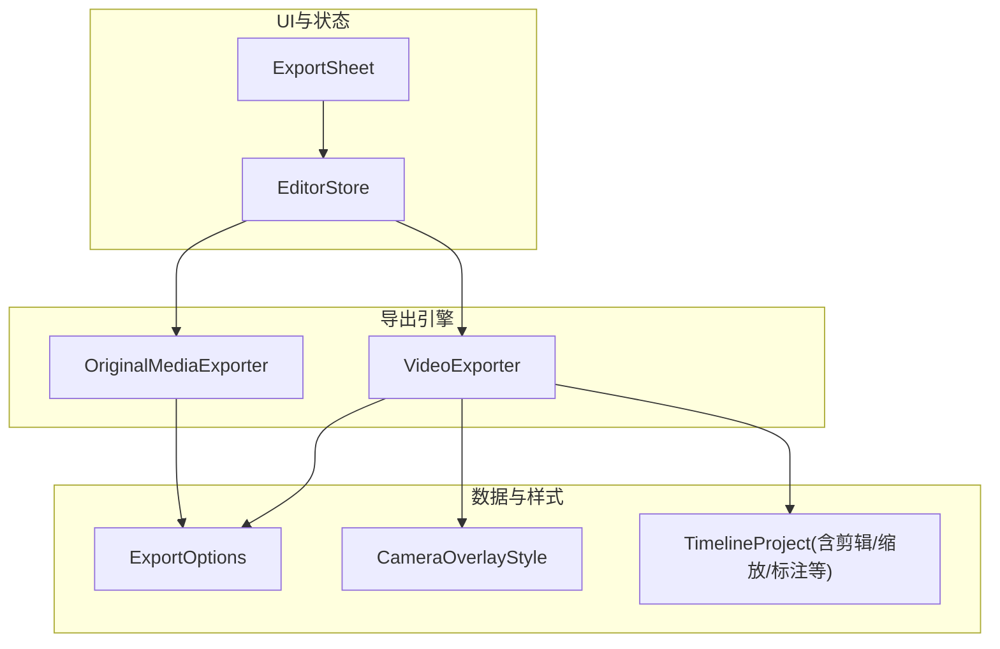
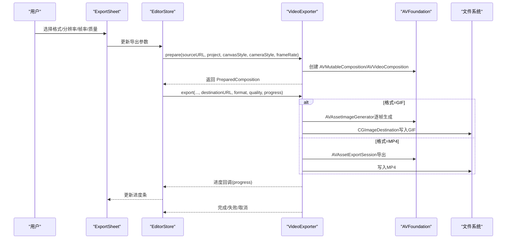
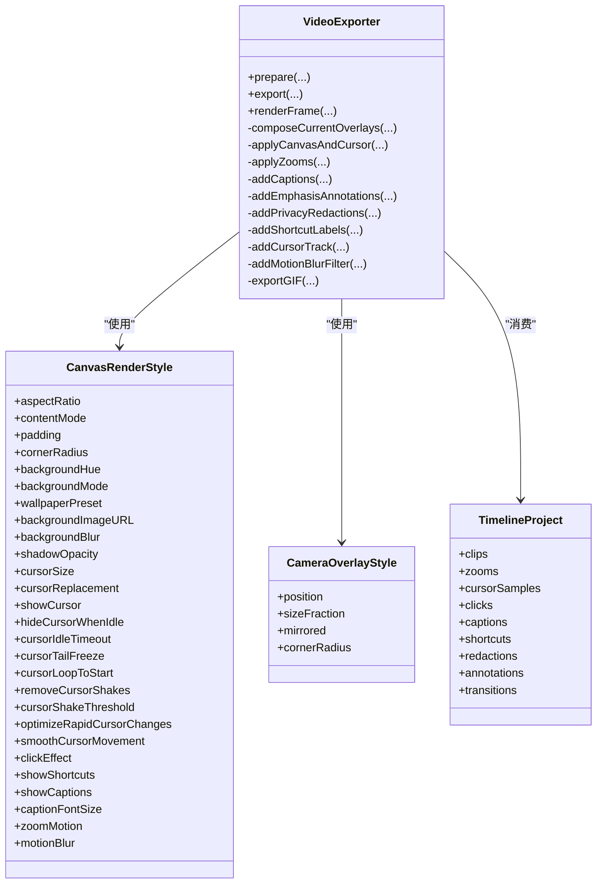
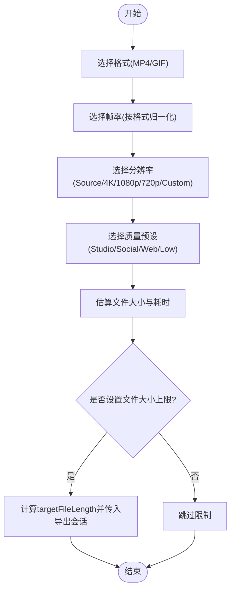
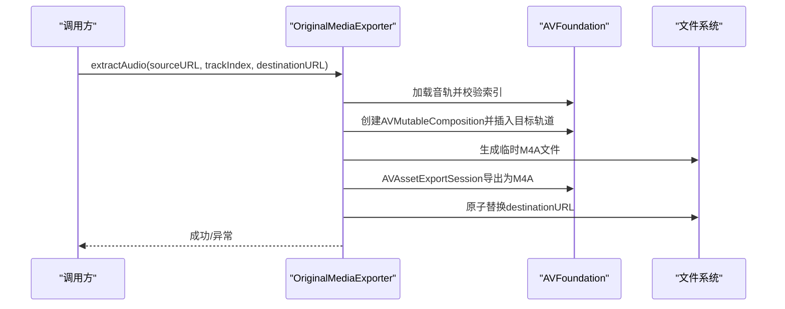
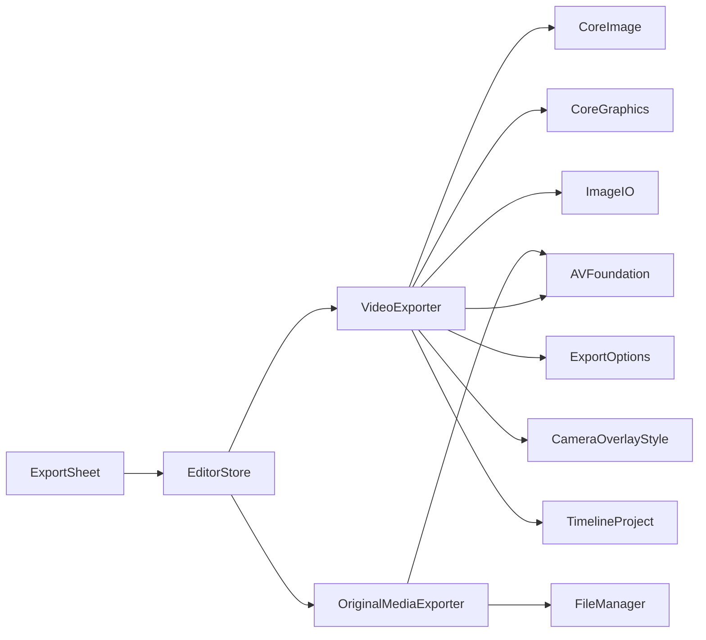

# 导出系统

<cite>
**本文引用的文件**   
- [VideoExporter.swift](file://Sources/ScreenFree/VideoExporter.swift)
- [ExportOptions.swift](file://Sources/ScreenFree/ExportOptions.swift)
- [OriginalMediaExporter.swift](file://Sources/ScreenFree/OriginalMediaExporter.swift)
- [ExportSheet.swift](file://Sources/ScreenFree/ExportSheet.swift)
- [EditorStore.swift](file://Sources/ScreenFree/EditorStore.swift)
- [CameraOverlayStyle.swift](file://Sources/ScreenFree/CameraOverlayStyle.swift)
- [EditorModels.swift](file://Sources/ScreenFreeCore/EditorModels.swift)
- [VideoExporterTests.swift](file://Tests/ScreenFreeMediaTests/VideoExporterTests.swift)
- [ExportOptionsTests.swift](file://Tests/ScreenFreeMediaTests/ExportOptionsTests.swift)
</cite>

## 目录
1. [简介](#简介)
2. [项目结构](#项目结构)
3. [核心组件](#核心组件)
4. [架构总览](#架构总览)
5. [详细组件分析](#详细组件分析)
6. [依赖关系分析](#依赖关系分析)
7. [性能考量](#性能考量)
8. [故障排查指南](#故障排查指南)
9. [结论](#结论)
10. [附录：配置与示例](#附录配置与示例)

## 简介
本技术文档围绕 ScreenFree 的导出系统，全面解析 VideoExporter 视频导出引擎、ExportOptions 配置体系、OriginalMediaExporter 原始媒体导出能力，以及导出流程的状态管理与进度反馈机制。文档同时涵盖格式支持（MP4、GIF）、分辨率与帧率控制、质量预设与比特率估算、错误处理与重试策略，并提供可操作的配置示例与优化建议。

## 项目结构
导出系统由以下关键模块组成：
- 导出引擎：VideoExporter（MP4/GIF 编码、合成与渲染）
- 导出选项：ExportOptions（分辨率、帧率、质量、目标大小估算等）
- 原始媒体导出：OriginalMediaExporter（无损提取音频轨道）
- UI 与状态：ExportSheet（导出界面）、EditorStore（导出参数与执行编排）
- 样式与模型：CanvasRenderStyle、CameraOverlayStyle、TimelineProject 等

图表来源 
- [ExportSheet.swift](file://Sources/ScreenFree/ExportSheet.swift)
- [EditorStore.swift](file://Sources/ScreenFree/EditorStore.swift)
- [VideoExporter.swift](file://Sources/ScreenFree/VideoExporter.swift)
- [OriginalMediaExporter.swift](file://Sources/ScreenFree/OriginalMediaExporter.swift)
- [ExportOptions.swift](file://Sources/ScreenFree/ExportOptions.swift)
- [CameraOverlayStyle.swift](file://Sources/ScreenFree/CameraOverlayStyle.swift)
- [EditorModels.swift](file://Sources/ScreenFreeCore/EditorModels.swift)

章节来源
- [ExportSheet.swift](file://Sources/ScreenFree/ExportSheet.swift)
- [EditorStore.swift](file://Sources/ScreenFree/EditorStore.swift)
- [VideoExporter.swift](file://Sources/ScreenFree/VideoExporter.swift)
- [OriginalMediaExporter.swift](file://Sources/ScreenFree/OriginalMediaExporter.swift)
- [ExportOptions.swift](file://Sources/ScreenFree/ExportOptions.swift)
- [CameraOverlayStyle.swift](file://Sources/ScreenFree/CameraOverlayStyle.swift)
- [EditorModels.swift](file://Sources/ScreenFreeCore/EditorModels.swift)

## 核心组件
- VideoExporter：负责准备时间线合成（AVMutableComposition）、视频/音频轨道拼接、缩放与转场、叠加层（字幕、快捷键、鼠标、点击特效、隐私遮罩、注释）、运动模糊、相机画中画，并输出 MP4 或 GIF。
- ExportOptions：定义导出格式、分辨率、帧率、质量预设、文件大小估算与目标长度限制等。
- OriginalMediaExporter：从多轨媒体中提取指定音频轨道为 M4A，用于无损导出或后续处理。
- ExportSheet / EditorStore：用户选择导出参数，计算预估耗时与大小，调用导出流程并展示进度。

章节来源
- [VideoExporter.swift](file://Sources/ScreenFree/VideoExporter.swift)
- [ExportOptions.swift](file://Sources/ScreenFree/ExportOptions.swift)
- [OriginalMediaExporter.swift](file://Sources/ScreenFree/OriginalMediaExporter.swift)
- [ExportSheet.swift](file://Sources/ScreenFree/ExportSheet.swift)
- [EditorStore.swift](file://Sources/ScreenFree/EditorStore.swift)

## 架构总览
导出流程的核心路径：
- UI 收集参数 → EditorStore 组装导出上下文 → VideoExporter.prepare 构建 AVMutableComposition 与 AVVideoComposition → export 分支 MP4/GIF → 进度回调与错误处理。

图表来源 
- [ExportSheet.swift](file://Sources/ScreenFree/ExportSheet.swift)
- [EditorStore.swift](file://Sources/ScreenFree/EditorStore.swift)
- [VideoExporter.swift](file://Sources/ScreenFree/VideoExporter.swift)

章节来源
- [ExportSheet.swift](file://Sources/ScreenFree/ExportSheet.swift)
- [EditorStore.swift](file://Sources/ScreenFree/EditorStore.swift)
- [VideoExporter.swift](file://Sources/ScreenFree/VideoExporter.swift)

## 详细组件分析

### VideoExporter：视频导出引擎
- 准备阶段（prepare）
  - 加载源视频/可选相机视频/可选背景音乐
  - 按 TimelineProject.clips 顺序插入音视频轨道，应用播放速率缩放与音量混合
  - 计算渲染尺寸与裁剪几何（CanvasCropGeometry），设置基础变换
  - 应用缩放动画（ZoomEvent）到图层指令
  - 构建 AVVideoComposition 与 AVAudioMix，必要时使用自定义合成器（圆角相机）
- 导出阶段（export）
  - GIF：使用 AVAssetImageGenerator 逐帧采样，CIContext 进行色阶压缩，CGImageDestination 写入 GIF
  - MP4：使用 AVAssetExportSession，设置输出类型、视频组合、音频混合、网络优化与文件大小上限；轮询进度并支持取消
- 单帧渲染（renderFrame）
  - 通过 AVAssetReader + AVAssetReaderVideoCompositionOutput 读取一帧，再叠加当前时刻的鼠标、点击、字幕、快捷键、隐私遮罩与注释，最终输出 CGImage

图表来源 
- [VideoExporter.swift](file://Sources/ScreenFree/VideoExporter.swift)
- [CameraOverlayStyle.swift](file://Sources/ScreenFree/CameraOverlayStyle.swift)
- [EditorModels.swift](file://Sources/ScreenFreeCore/EditorModels.swift)

章节来源
- [VideoExporter.swift](file://Sources/ScreenFree/VideoExporter.swift)
- [CameraOverlayStyle.swift](file://Sources/ScreenFree/CameraOverlayStyle.swift)
- [EditorModels.swift](file://Sources/ScreenFreeCore/EditorModels.swift)

### ExportOptions：导出配置与估算
- 帧率：ExportFrameRateOptions 提供 MP4 与 GIF 的可用帧率集合，并进行归一化
- 分辨率：ExportResolution 支持 Source/4K/1080p/720p/Custom，结合 CanvasAspectRatio 计算渲染尺寸
- 质量：ExportQuality 提供 Studio/Social/Web/Web(Low)，映射到 AVAssetExportPreset 名称与图像压缩质量、GIF 色阶、每像素比特率
- 估算：ExportEstimateCalculator 根据时长、分辨率、帧率、格式与质量估算文件大小与处理时长，并可计算目标文件大小上限

图表来源 
- [ExportOptions.swift](file://Sources/ScreenFree/ExportOptions.swift)

章节来源
- [ExportOptions.swift](file://Sources/ScreenFree/ExportOptions.swift)

### OriginalMediaExporter：原始媒体导出
- 功能：从多轨媒体中抽取指定索引的音频轨道，生成 M4A 临时文件后原子替换目标文件，确保一致性
- 错误处理：当轨道不存在或导出失败时抛出明确错误类型

图表来源 
- [OriginalMediaExporter.swift](file://Sources/ScreenFree/OriginalMediaExporter.swift)

章节来源
- [OriginalMediaExporter.swift](file://Sources/ScreenFree/OriginalMediaExporter.swift)

### 导出队列与并发处理策略
- 当前实现以单次导出为主，通过 Task 与 withTaskCancellationHandler 管理异步导出与取消
- 进度反馈通过闭包回调，周期性轮询 AVAssetExportSession 的进度与状态
- 如需队列与并发，可在上层（如 EditorStore）维护任务队列，串行或限流并发执行多个导出任务，避免资源竞争

章节来源
- [VideoExporter.swift](file://Sources/ScreenFree/VideoExporter.swift)
- [EditorStore.swift](file://Sources/ScreenFree/EditorStore.swift)

### 错误处理与重试机制
- 错误分类：VideoExportError（缺少视频轨、无法创建合成轨/导出会话、无法读取帧、导出失败）、OriginalMediaExportError（缺失音轨、无法创建导出会话、导出失败）
- 取消与清理：导出过程中支持取消，并在失败/取消时删除目标文件，保证一致性
- 重试建议：在调用侧捕获错误，对可恢复错误（如 I/O 失败）进行有限次重试，对不可恢复错误（如参数非法）直接上报

章节来源
- [VideoExporter.swift](file://Sources/ScreenFree/VideoExporter.swift)
- [OriginalMediaExporter.swift](file://Sources/ScreenFree/OriginalMediaExporter.swift)

## 依赖关系分析
- VideoExporter 依赖 AVFoundation（AVMutableComposition、AVAssetExportSession、AVAssetImageGenerator、AVAssetReader）、CoreImage/CoreGraphics（图像处理）、ImageIO（GIF 写入）
- ExportOptions 提供导出参数与估算逻辑，被 EditorStore 与 VideoExporter 使用
- OriginalMediaExporter 依赖 AVFoundation 与 FileManager
- ExportSheet 与 EditorStore 负责 UI 绑定与导出编排

图表来源 
- [VideoExporter.swift](file://Sources/ScreenFree/VideoExporter.swift)
- [ExportOptions.swift](file://Sources/ScreenFree/ExportOptions.swift)
- [OriginalMediaExporter.swift](file://Sources/ScreenFree/OriginalMediaExporter.swift)
- [ExportSheet.swift](file://Sources/ScreenFree/ExportSheet.swift)
- [EditorStore.swift](file://Sources/ScreenFree/EditorStore.swift)

章节来源
- [VideoExporter.swift](file://Sources/ScreenFree/VideoExporter.swift)
- [ExportOptions.swift](file://Sources/ScreenFree/ExportOptions.swift)
- [OriginalMediaExporter.swift](file://Sources/ScreenFree/OriginalMediaExporter.swift)
- [ExportSheet.swift](file://Sources/ScreenFree/ExportSheet.swift)
- [EditorStore.swift](file://Sources/ScreenFree/EditorStore.swift)

## 性能考量
- 帧率与分辨率：高帧率与高分辨率显著增加渲染与编码开销；GIF 帧率上限为 20 FPS
- 质量预设：Studio 最高保真但体积大；Social/Web/Low 逐步降低码率与图像质量以减小体积
- 运动模糊与叠加层：启用屏幕/鼠标运动模糊、字幕、快捷键、隐私遮罩、注释会增加 CPU/GPU 负载
- 导出会话优化：MP4 导出开启 shouldOptimizeForNetworkUse；GIF 导出禁用中间缓存以减少内存占用
- 估算与限制：通过 ExportEstimateCalculator 预估大小与耗时，必要时设置 fileLengthLimit 防止过大文件

章节来源
- [VideoExporter.swift](file://Sources/ScreenFree/VideoExporter.swift)
- [ExportOptions.swift](file://Sources/ScreenFree/ExportOptions.swift)

## 故障排查指南
- 常见错误
  - 缺少视频轨：检查源文件是否包含视频轨道
  - 无法创建合成轨/导出会话：确认输入参数与 AVFoundation 预设可用性
  - 无法读取合成帧：检查 AVAssetReader 配置与输出设置
  - 导出失败：查看 session.error 或 GIF 写入失败原因
- 调试步骤
  - 使用 renderFrame 验证单帧渲染是否正确（叠加层、缩放、模糊）
  - 缩小分辨率/帧率/质量以定位瓶颈
  - 关闭非必要叠加层（字幕、快捷键、隐私遮罩、注释）测试性能
  - 检查目标路径权限与磁盘空间
- 重试策略
  - 对 I/O 类错误进行有限次重试（如 2-3 次）
  - 对参数错误或资源不可用错误直接提示用户调整

章节来源
- [VideoExporter.swift](file://Sources/ScreenFree/VideoExporter.swift)
- [OriginalMediaExporter.swift](file://Sources/ScreenFree/OriginalMediaExporter.swift)

## 结论
ScreenFree 的导出系统以 VideoExporter 为核心，结合 ExportOptions 的配置与估算能力，实现了灵活的 MP4/GIF 导出与丰富的视觉叠加效果。OriginalMediaExporter 提供了无损音频提取能力。通过清晰的错误处理与进度反馈，系统在易用性与性能之间取得平衡。建议在大规模导出场景引入队列与并发控制，并根据目标平台选择合适的质量与分辨率预设。

## 附录：配置与示例
- 配置要点
  - 格式：MP4（推荐）或 GIF（帧率上限 20）
  - 分辨率：Source/4K/1080p/720p/Custom，结合 CanvasAspectRatio 计算
  - 帧率：MP4 支持 24/25/30/50/60；GIF 支持 10/15/20
  - 质量：Studio（最高保真）、Social（均衡）、Web（较小）、Web(Low)（最小）
  - 文件大小限制：非 Studio 质量下可设置 targetFileLength
- 示例（概念性说明，不展示代码内容）
  - 导出高质量 MP4：选择 Source 分辨率、60 FPS、Studio 质量，不设置文件大小限制
  - 导出社交分享 MP4：选择 1080p、30 FPS、Social 质量，设置合理文件大小上限
  - 导出 GIF：选择 720p、15 FPS、Web 质量，启用较低图像压缩质量与色阶
  - 提取麦克风轨道：指定 trackIndex=1，输出为 M4A，用于后期混音或单独分发
- 编解码器选择与配置
  - MP4：使用 AVAssetExportSession 预设（Highest/Medium/Low），自动选择合适编码器
  - GIF：使用 ImageIO 的 CGImageDestination，配合 CIContext 进行色阶压缩
  - 音频：MP4 导出合并多轨为单轨；M4A 导出使用 AppleM4A 预设

章节来源
- [ExportOptions.swift](file://Sources/ScreenFree/ExportOptions.swift)
- [VideoExporter.swift](file://Sources/ScreenFree/VideoExporter.swift)
- [OriginalMediaExporter.swift](file://Sources/ScreenFree/OriginalMediaExporter.swift)
- [ExportOptionsTests.swift](file://Tests/ScreenFreeMediaTests/ExportOptionsTests.swift)
- [VideoExporterTests.swift](file://Tests/ScreenFreeMediaTests/VideoExporterTests.swift)