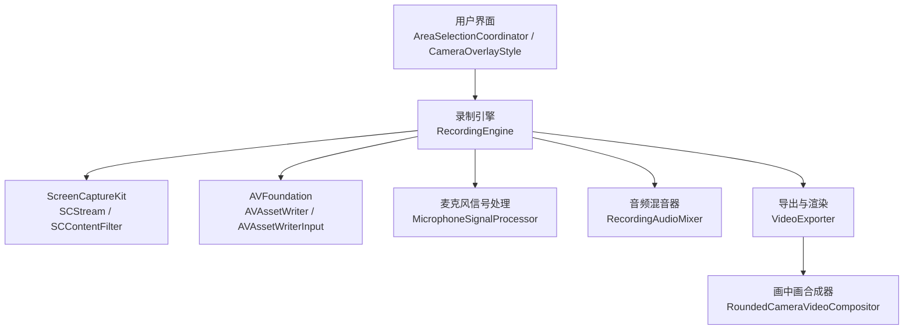
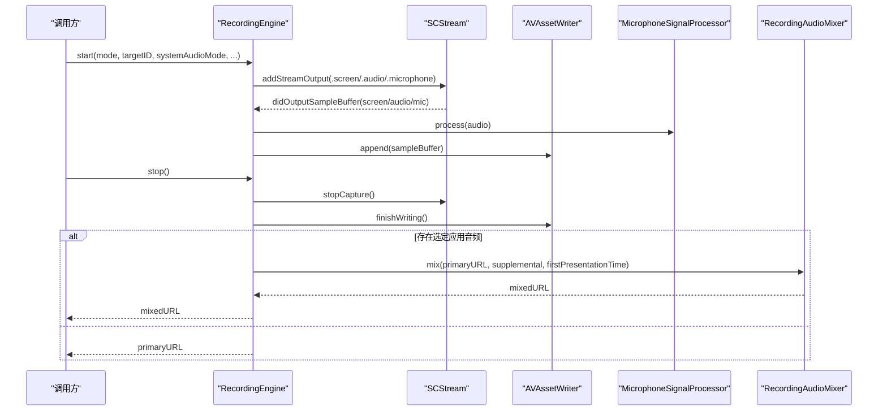
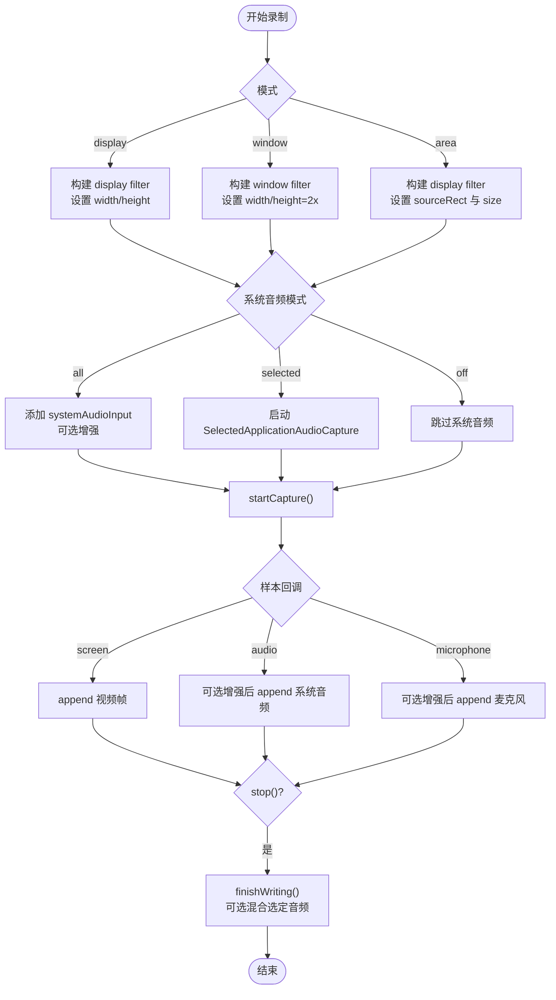
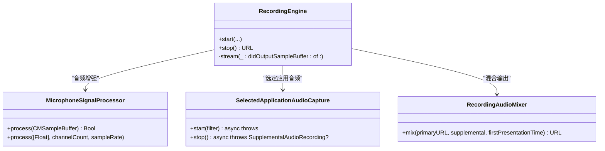
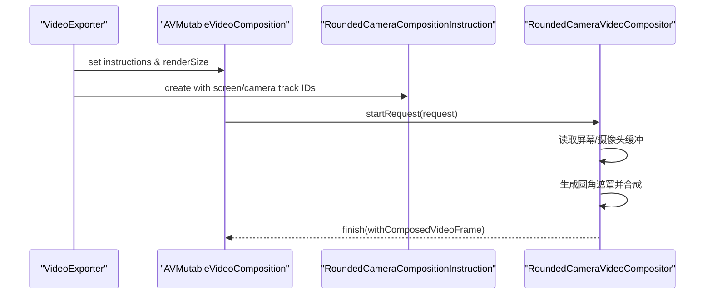
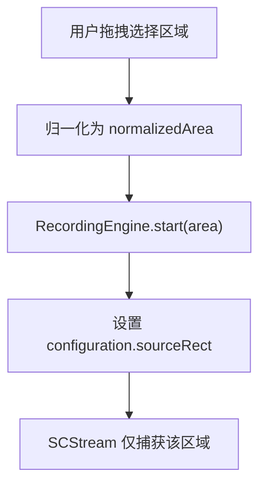
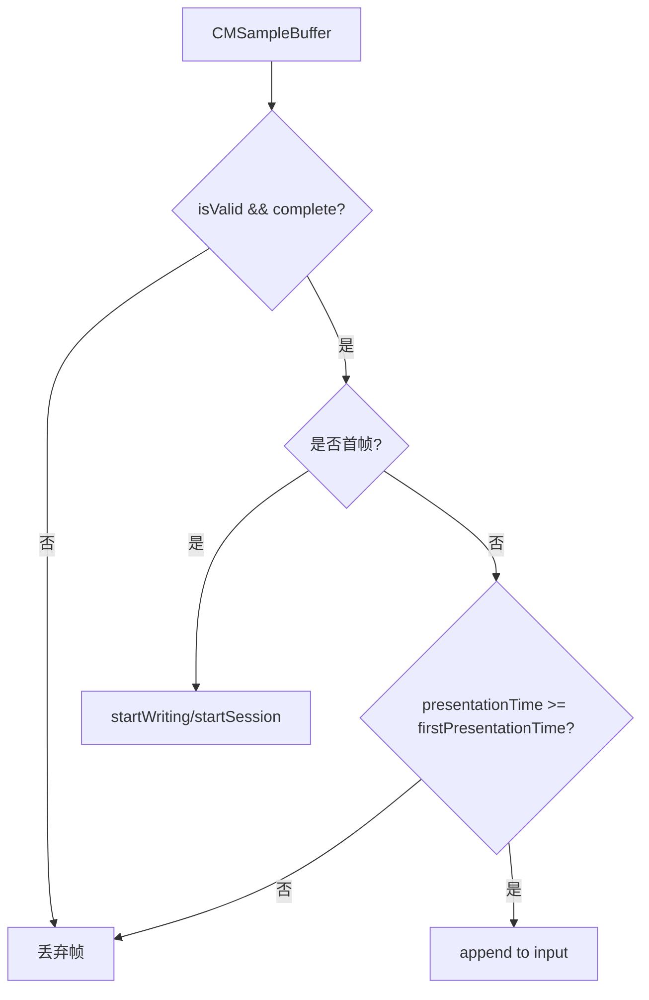
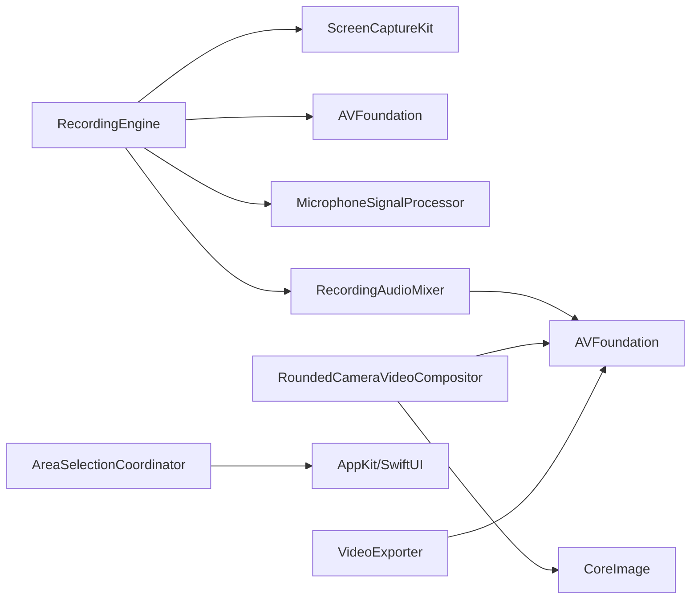

# 屏幕录制功能

<cite>
**本文引用的文件**   
- [RecordingEngine.swift](file://Sources/ScreenFree/RecordingEngine.swift)
- [MicrophoneSignalProcessor.swift](file://Sources/ScreenFree/MicrophoneSignalProcessor.swift)
- [AudioAnalyzer.swift](file://Sources/ScreenFree/AudioAnalyzer.swift)
- [RoundedCameraVideoCompositor.swift](file://Sources/ScreenFree/RoundedCameraVideoCompositor.swift)
- [RecordingAudioMixer.swift](file://Sources/ScreenFree/RecordingAudioMixer.swift)
- [AreaSelectionCoordinator.swift](file://Sources/ScreenFree/AreaSelectionCoordinator.swift)
- [CameraOverlayStyle.swift](file://Sources/ScreenFree/CameraOverlayStyle.swift)
- [VideoExporter.swift](file://Sources/ScreenFree/VideoExporter.swift)
- [README.md](file://README.md)
</cite>

## 目录
1. [简介](#简介)
2. [项目结构](#项目结构)
3. [核心组件](#核心组件)
4. [架构总览](#架构总览)
5. [详细组件分析](#详细组件分析)
6. [依赖关系分析](#依赖关系分析)
7. [性能考量](#性能考量)
8. [故障排查指南](#故障排查指南)
9. [结论](#结论)
10. [附录：配置示例与最佳实践](#附录配置示例与最佳实践)

## 简介
本技术文档聚焦 ScreenFree 的屏幕录制子系统，围绕 RecordingEngine 类展开，系统阐述基于 ScreenCaptureKit 的显示器、窗口与自由区域三种录制模式的技术原理与实现细节；同时覆盖音频录制系统（系统音频捕获模式、麦克风录制与增强）、摄像头画中画实时合成、错误处理与并发控制机制，以及与 AVFoundation 的集成和媒体数据流处理。文档旨在帮助开发者快速理解并扩展录制能力，确保高质量、低延迟、线程安全的录制体验。

## 项目结构
ScreenFree 采用 SwiftUI + AppKit 前端，核心录制逻辑位于 Sources/ScreenFree 下，关键模块包括：
- 录制引擎与流式采集：RecordingEngine.swift
- 音频分析与混音：AudioAnalyzer.swift、RecordingAudioMixer.swift
- 麦克风信号处理：MicrophoneSignalProcessor.swift
- 摄像头画中画合成：RoundedCameraVideoCompositor.swift
- 自由区域选择界面：AreaSelectionCoordinator.swift
- 摄像头叠加样式：CameraOverlayStyle.swift
- 导出与渲染管线：VideoExporter.swift
- 项目说明与权限要求：README.md

**图表来源** 
- [RecordingEngine.swift:174-392](file://Sources/ScreenFree/RecordingEngine.swift#L174-L392)
- [RecordingAudioMixer.swift:30-134](file://Sources/ScreenFree/RecordingAudioMixer.swift#L30-L134)
- [RoundedCameraVideoCompositor.swift:45-177](file://Sources/ScreenFree/RoundedCameraVideoCompositor.swift#L45-L177)
- [VideoExporter.swift:103-486](file://Sources/ScreenFree/VideoExporter.swift#L103-L486)

**章节来源**
- [RecordingEngine.swift:1-691](file://Sources/ScreenFree/RecordingEngine.swift#L1-L691)
- [README.md:1-211](file://README.md#L1-L211)

## 核心组件
- RecordingEngine：封装 SCStream 采集、AVAssetWriter 写入、多路音频输入（系统音频、麦克风）与可选“选定应用音频”独立录制，提供 display/window/area 三种模式启动与停止流程。
- MicrophoneSignalProcessor：对 PCM 样本进行降噪、自动增益、压缩与限幅，支持系统音频与麦克风的差异化增强策略。
- AudioAnalyzer：从已录制媒体中读取 PCM，计算波形、RMS、峰值与时间对齐的包络，用于可视化与后续混音。
- RecordingAudioMixer：将主视频与“选定应用音频”轨道按首帧时间戳对齐混合，输出最终 MP4。
- RoundedCameraVideoCompositor：自定义 AVVideoCompositing，将摄像头画面以圆角矩形叠加到屏幕画面，支持变换插值。
- AreaSelectionCoordinator：全屏遮罩选择面板，返回归一化坐标供 RecordingEngine 生成 sourceRect。
- CameraOverlayStyle：定义摄像头画中画位置、尺寸比例、镜像与圆角等样式。
- VideoExporter：构建 AVMutableComposition、设置帧率、分辨率、滤镜与画中画指令，完成导出。

**章节来源**
- [RecordingEngine.swift:63-531](file://Sources/ScreenFree/RecordingEngine.swift#L63-L531)
- [MicrophoneSignalProcessor.swift:6-356](file://Sources/ScreenFree/MicrophoneSignalProcessor.swift#L6-L356)
- [AudioAnalyzer.swift:5-332](file://Sources/ScreenFree/AudioAnalyzer.swift#L5-L332)
- [RecordingAudioMixer.swift:24-136](file://Sources/ScreenFree/RecordingAudioMixer.swift#L24-L136)
- [RoundedCameraVideoCompositor.swift:4-178](file://Sources/ScreenFree/RoundedCameraVideoCompositor.swift#L4-L178)
- [AreaSelectionCoordinator.swift:5-184](file://Sources/ScreenFree/AreaSelectionCoordinator.swift#L5-L184)
- [CameraOverlayStyle.swift:1-27](file://Sources/ScreenFree/CameraOverlayStyle.swift#L1-L27)
- [VideoExporter.swift:95-486](file://Sources/ScreenFree/VideoExporter.swift#L95-L486)

## 架构总览
录制系统由三层构成：
- 采集层：SCStream 通过 SCContentFilter 指定显示/窗口/区域过滤，输出 .screen/.audio/.microphone 三类样本。
- 处理层：MicrophoneSignalProcessor 对音频样本进行实时增强；SelectedApplicationAudioCapture 单独录制选定应用的音频。
- 写入层：AVAssetWriter 管理视频与多条音频轨，保证首帧同步与顺序写入；最终可经 RecordingAudioMixer 混合为单文件。

**图表来源** 
- [RecordingEngine.swift:174-443](file://Sources/ScreenFree/RecordingEngine.swift#L174-L443)
- [RecordingAudioMixer.swift:30-134](file://Sources/ScreenFree/RecordingAudioMixer.swift#L30-L134)

## 详细组件分析

### RecordingEngine 核心实现
- 三种录制模式
  - display：基于 SCContentFilter(display:)，sourceFrame 为整屏 frame，width/height 设为显示器分辨率。
  - window：基于 SCContentFilter(desktopIndependentWindow:)，sourceFrame 为窗口 frame，宽高放大至 2x 以提升清晰度。
  - area：在 display 基础上设置 configuration.sourceRect 为归一化 normalizedArea 转换后的像素矩形，并更新 sourceFrame 为绝对坐标。
- 音频系统
  - systemAudioMode=all：开启 capturesAudio，创建 systemAudioInput，并可启用 MicrophoneSignalProcessor 做响度提升。
  - systemAudioMode=selected：使用 SelectedApplicationAudioCapture 独立录制选定应用音频，结束后与主视频混合。
  - systemAudioMode=off：不添加系统音频轨。
  - 麦克风：macOS 15+ 可用 captureMicrophone，创建 microphoneInput，并可启用降噪与音量归一化。
- 编码参数
  - 视频：H.264，像素格式 BGRA，最小帧间隔 1/60s，队列深度 8，比特率按分辨率自适应，最大 GOP 120。
  - 音频：AAC，采样率 48kHz，双声道，码率 192kbps。
- 线程安全与并发
  - 使用 NSLock 保护 writer/inputs/url/finishing 等状态；captureQueue 串行处理样本；firstPresentationTime 确保会话起始顺序正确。
- 错误处理
  - 枚举 RecordingError 覆盖无源、无法启动/结束写入、writer 失败等场景；stop() 中统一检查 writer.status 并抛出具体错误。

**图表来源** 
- [RecordingEngine.swift:174-443](file://Sources/ScreenFree/RecordingEngine.swift#L174-L443)

**章节来源**
- [RecordingEngine.swift:85-392](file://Sources/ScreenFree/RecordingEngine.swift#L85-L392)
- [RecordingEngine.swift:445-531](file://Sources/ScreenFree/RecordingEngine.swift#L445-L531)

### 音频录制系统与增强
- 系统音频捕获模式
  - all：直接通过 SCStream 的 .audio 输出，进入主 AVAssetWriter 的 systemAudioInput。
  - selected：通过 SelectedApplicationAudioCapture 独立录制 m4a，记录首帧时间戳，最后与主视频混合。
  - off：不启用系统音频。
- 麦克风录制配置
  - macOS 15+ 启用 captureMicrophone，创建 microphoneInput。
  - 可选降噪（80Hz 高通滤波）、自动增益（目标 RMS、上下限）、压缩限幅（阈值、比率、上限）。
- 音频应用选择机制
  - availableAudioApplications() 获取除自身外的应用列表，去重并按名称排序，供 UI 选择 bundleIdentifier。
- 增强处理
  - MicrophoneSignalProcessor.process(CMSampleBuffer) 支持 Float32/Int16 通道处理，保持非交错/交错格式兼容。

**图表来源** 
- [RecordingEngine.swift:63-531](file://Sources/ScreenFree/RecordingEngine.swift#L63-L531)
- [MicrophoneSignalProcessor.swift:78-356](file://Sources/ScreenFree/MicrophoneSignalProcessor.swift#L78-L356)
- [RecordingAudioMixer.swift:29-136](file://Sources/ScreenFree/RecordingAudioMixer.swift#L29-L136)
- [RecordingEngine.swift:533-674](file://Sources/ScreenFree/RecordingEngine.swift#L533-L674)

**章节来源**
- [RecordingEngine.swift:119-143](file://Sources/ScreenFree/RecordingEngine.swift#L119-L143)
- [RecordingEngine.swift:301-392](file://Sources/ScreenFree/RecordingEngine.swift#L301-L392)
- [MicrophoneSignalProcessor.swift:6-76](file://Sources/ScreenFree/MicrophoneSignalProcessor.swift#L6-L76)
- [RecordingAudioMixer.swift:30-134](file://Sources/ScreenFree/RecordingAudioMixer.swift#L30-L134)

### 摄像头画中画实时合成
- 合成器 RoundedCameraVideoCompositor 实现 AVVideoComposition，接收屏幕与摄像头两路像素缓冲，按指令中的 cameraFrame 与圆角半径生成遮罩，使用 CoreImage 合成。
- 支持图层变换插值（缩放、平移），根据 compositionTime 计算当前变换矩阵。
- 与 VideoExporter 配合：prepare() 中根据 CameraOverlayStyle 计算相机轨道插入范围、变换与圆角，设置 customVideoCompositorClass。

**图表来源** 
- [VideoExporter.swift:352-458](file://Sources/ScreenFree/VideoExporter.swift#L352-L458)
- [RoundedCameraVideoCompositor.swift:4-177](file://Sources/ScreenFree/RoundedCameraVideoCompositor.swift#L4-L177)

**章节来源**
- [RoundedCameraVideoCompositor.swift:45-177](file://Sources/ScreenFree/RoundedCameraVideoCompositor.swift#L45-L177)
- [VideoExporter.swift:352-458](file://Sources/ScreenFree/VideoExporter.swift#L352-L458)

### 自由区域录制与选择
- AreaSelectionCoordinator 展示全屏遮罩面板，支持拖拽选择区域，返回归一化 CGRect（相对屏幕尺寸）。
- RecordingEngine.start(area) 将归一化坐标转换为 sourceRect 与像素宽高，确保录制区域精确映射。

**图表来源** 
- [AreaSelectionCoordinator.swift:8-42](file://Sources/ScreenFree/AreaSelectionCoordinator.swift#L8-L42)
- [RecordingEngine.swift:228-247](file://Sources/ScreenFree/RecordingEngine.swift#L228-L247)

**章节来源**
- [AreaSelectionCoordinator.swift:5-184](file://Sources/ScreenFree/AreaSelectionCoordinator.swift#L5-L184)
- [RecordingEngine.swift:228-247](file://Sources/ScreenFree/RecordingEngine.swift#L228-L247)

### 与 AVFoundation 的集成与媒体流处理
- 视频写入：AVAssetWriter + AVAssetWriterInput(.video)，expectsMediaDataInRealTime=true，首帧时 startWriting/startSession。
- 音频写入：systemAudioInput 与 microphoneInput 分别追加，必要时先经 MicrophoneSignalProcessor 处理。
- 帧完整性校验：isCompleteScreenFrame 检查 SCFrameStatus.complete，避免不完整帧导致写入失败。
- 首帧时间同步：firstPresentationTime 确保音频早于或等于首视频帧被丢弃，防止 AVAssetWriter 永久失败。

**图表来源** 
- [RecordingEngine.swift:445-504](file://Sources/ScreenFree/RecordingEngine.swift#L445-L504)

**章节来源**
- [RecordingEngine.swift:283-326](file://Sources/ScreenFree/RecordingEngine.swift#L283-L326)
- [RecordingEngine.swift:445-504](file://Sources/ScreenFree/RecordingEngine.swift#L445-L504)

## 依赖关系分析
- RecordingEngine 依赖 ScreenCaptureKit（SCStream/SCContentFilter）与 AVFoundation（AVAssetWriter/AVAssetWriterInput）。
- MicrophoneSignalProcessor 依赖 AudioToolbox/CoreMedia 进行 PCM 处理。
- RecordingAudioMixer 依赖 AVFoundation 进行轨道混合与导出。
- RoundedCameraVideoCompositor 依赖 AVFoundation 与 CoreImage 进行实时合成。
- AreaSelectionCoordinator 依赖 AppKit/SwiftUI 提供选择面板。
- VideoExporter 依赖 AVFoundation 构建 Composition 与导出。

**图表来源** 
- [RecordingEngine.swift:1-5](file://Sources/ScreenFree/RecordingEngine.swift#L1-L5)
- [MicrophoneSignalProcessor.swift:1-4](file://Sources/ScreenFree/MicrophoneSignalProcessor.swift#L1-L4)
- [RecordingAudioMixer.swift:1-3](file://Sources/ScreenFree/RecordingAudioMixer.swift#L1-L3)
- [RoundedCameraVideoCompositor.swift:1-3](file://Sources/ScreenFree/RoundedCameraVideoCompositor.swift#L1-L3)
- [AreaSelectionCoordinator.swift:1-3](file://Sources/ScreenFree/AreaSelectionCoordinator.swift#L1-L3)
- [VideoExporter.swift:1-10](file://Sources/ScreenFree/VideoExporter.swift#L1-L10)

**章节来源**
- [RecordingEngine.swift:1-5](file://Sources/ScreenFree/RecordingEngine.swift#L1-L5)
- [MicrophoneSignalProcessor.swift:1-4](file://Sources/ScreenFree/MicrophoneSignalProcessor.swift#L1-L4)
- [RecordingAudioMixer.swift:1-3](file://Sources/ScreenFree/RecordingAudioMixer.swift#L1-L3)
- [RoundedCameraVideoCompositor.swift:1-3](file://Sources/ScreenFree/RoundedCameraVideoCompositor.swift#L1-L3)
- [AreaSelectionCoordinator.swift:1-3](file://Sources/ScreenFree/AreaSelectionCoordinator.swift#L1-L3)
- [VideoExporter.swift:1-10](file://Sources/ScreenFree/VideoExporter.swift#L1-L10)

## 性能考量
- 队列与优先级：captureQueue 设置为 userInteractive，减少 UI 卡顿；SelectedApplicationAudioCapture 使用 userInitiated 队列。
- 帧间隔与队列深度：minimumFrameInterval=1/60s，queueDepth=8，平衡吞吐与内存占用。
- 编码器参数：H.264 自适应比特率，GOP 120，兼顾质量与文件大小。
- 音频处理：MicrophoneSignalProcessor 在采样级进行轻量滤波与增益，避免重采样开销。
- 合成路径：CIContext 复用，避免频繁创建上下文；圆角遮罩按需生成。

[本节为通用指导，无需特定文件引用]

## 故障排查指南
- 常见错误
  - noSource：未找到可录制的显示器/窗口。
  - noAudioApplications：选定应用模式下未选择任何应用。
  - cannotStartWriter/cannotFinishWriter：AVAssetWriter 初始化或结束失败。
  - writerFailed(details)：写入过程中出现底层错误。
- 调试建议
  - 检查 SCShareableContent 权限与 onScreenWindowsOnly 过滤。
  - 确认 firstPresentationTime 与样本时间戳顺序。
  - 验证 audioSettings 与 videoSettings 兼容性。
  - 查看 SelectedApplicationAudioCapture 的首帧时间戳是否与主视频对齐。

**章节来源**
- [RecordingEngine.swift:40-61](file://Sources/ScreenFree/RecordingEngine.swift#L40-L61)
- [RecordingEngine.swift:394-443](file://Sources/ScreenFree/RecordingEngine.swift#L394-L443)

## 结论
ScreenFree 的录制系统以 RecordingEngine 为核心，结合 ScreenCaptureKit 与 AVFoundation，实现了高可靠、低延迟、线程安全的屏幕/窗口/区域录制，以及灵活的音频录制与增强方案。摄像头画中画通过自定义合成器实现实时叠加，最终导出由 VideoExporter 统一管理。整体架构清晰、可扩展性强，适合进一步定制与优化。

[本节为总结性内容，无需特定文件引用]

## 附录：配置示例与最佳实践
- 显示器录制
  - 设置 mode=.display，targetID 为显示器 ID，systemAudioMode 根据需要选择 all/selected/off。
  - 分辨率与帧率：configuration.width/height 设为显示器分辨率，minimumFrameInterval=1/60。
- 窗口录制
  - 设置 mode=.window，targetID 为窗口 ID，宽高放大至 2x 提升清晰度。
- 自由区域录制
  - 设置 mode=.area，normalizedArea 为归一化矩形，engine 内部转换为 sourceRect。
- 音频配置
  - systemAudioMode=all：启用系统音频，可开启 normalizeSystemAudioVolume。
  - systemAudioMode=selected：选择应用 bundleIdentifier，结束后自动混合。
  - 麦克风：recordMicrophone=true，可选 reduceMicrophoneNoise 与 normalizeMicrophoneVolume。
- 编码参数
  - 视频：H.264，BGRA，比特率按分辨率自适应，GOP 120。
  - 音频：AAC，48kHz，2 声道，192kbps。
- 摄像头画中画
  - CameraOverlayStyle.position/sizeFraction/mirrored/cornerRadius 控制布局与外观。
  - VideoExporter.prepare() 中设置 frameDuration 与 renderSize。

[本节为操作指引，无需特定文件引用]