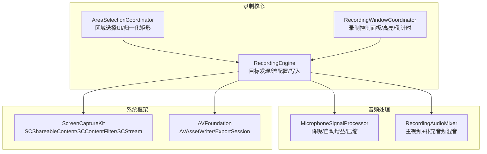
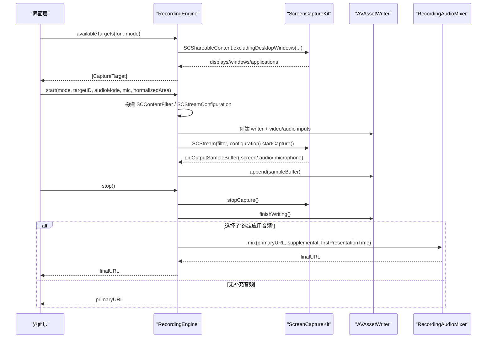
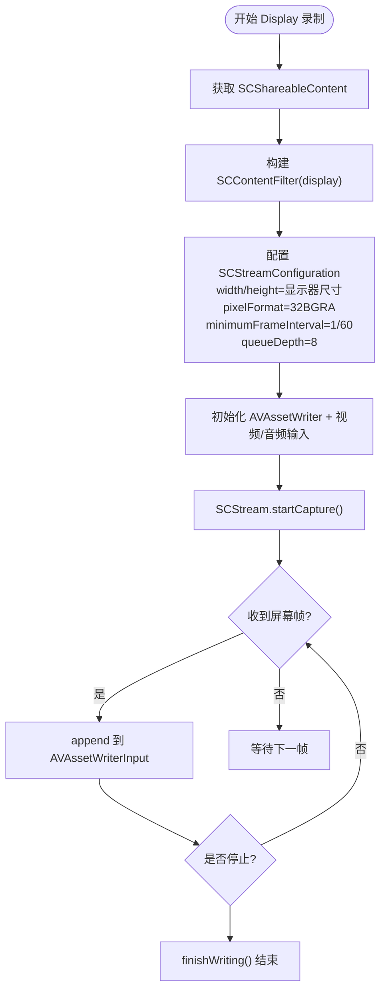
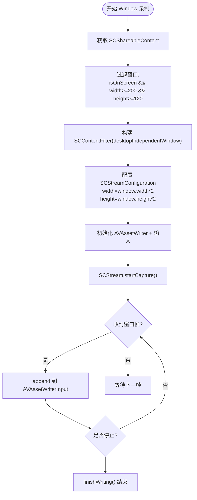
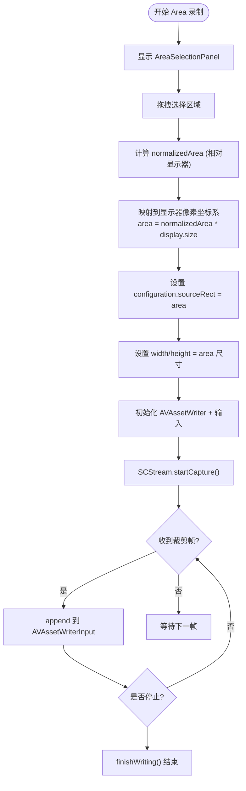
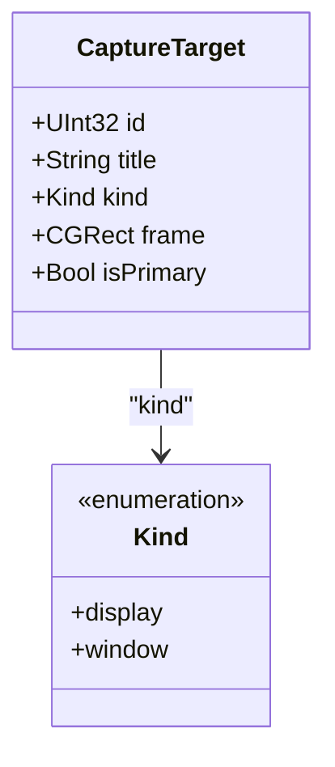
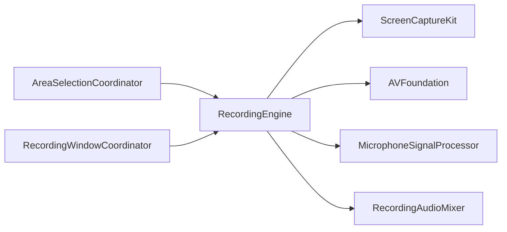

# 录制模式详解

<cite>
**本文引用的文件**   
- [RecordingEngine.swift](file://Sources/ScreenFree/RecordingEngine.swift)
- [AreaSelectionCoordinator.swift](file://Sources/ScreenFree/AreaSelectionCoordinator.swift)
- [RecordingWindowCoordinator.swift](file://Sources/ScreenFree/RecordingWindowCoordinator.swift)
- [MicrophoneSignalProcessor.swift](file://Sources/ScreenFree/MicrophoneSignalProcessor.swift)
- [RecordingAudioMixer.swift](file://Sources/ScreenFree/RecordingAudioMixer.swift)
- [README.md](file://README.md)
- [Package.swift](file://Package.swift)
</cite>

## 目录
1. [简介](#简介)
2. [项目结构](#项目结构)
3. [核心组件](#核心组件)
4. [架构总览](#架构总览)
5. [详细组件分析](#详细组件分析)
6. [依赖关系分析](#依赖关系分析)
7. [性能考量](#性能考量)
8. [故障排查指南](#故障排查指南)
9. [结论](#结论)
10. [附录](#附录)

## 简介
本技术文档聚焦 ScreenFree 的三种录制模式：Display（显示器）、Window（窗口）与 Area（自由区域）。文档深入解析每种模式的实现原理、数据流、错误处理以及与 ScreenCaptureKit 的集成方式，包括 SCContentFilter 的使用、多显示器支持、分辨率自适应、主显示器识别机制、窗口过滤与最小尺寸验证、坐标系统与区域选择算法等。同时给出配置帧率、像素格式与性能优化选项的实践要点。

## 项目结构
- 录制引擎与目标发现集中在 RecordingEngine.swift，负责 CaptureTarget 获取、SCStreamConfiguration 配置、SCContentFilter 构建、AVAssetWriter 初始化与媒体写入。
- 自由区域选择由 AreaSelectionCoordinator.swift 提供 UI 面板与归一化矩形计算。
- 窗口录制相关 UI 与控制面板由 RecordingWindowCoordinator.swift 管理。
- 音频增强与混音分别由 MicrophoneSignalProcessor.swift 与 RecordingAudioMixer.swift 实现。
- 平台与权限说明见 README.md；包定义见 Package.swift。

图表来源
- [RecordingEngine.swift:85-117](file://Sources/ScreenFree/RecordingEngine.swift#L85-L117)
- [AreaSelectionCoordinator.swift:8-42](file://Sources/ScreenFree/AreaSelectionCoordinator.swift#L8-L42)
- [RecordingWindowCoordinator.swift:19-73](file://Sources/ScreenFree/RecordingWindowCoordinator.swift#L19-L73)
- [MicrophoneSignalProcessor.swift:78-106](file://Sources/ScreenFree/MicrophoneSignalProcessor.swift#L78-L106)
- [RecordingAudioMixer.swift:29-41](file://Sources/ScreenFree/RecordingAudioMixer.swift#L29-L41)

章节来源
- [RecordingEngine.swift:85-117](file://Sources/ScreenFree/RecordingEngine.swift#L85-L117)
- [AreaSelectionCoordinator.swift:8-42](file://Sources/ScreenFree/AreaSelectionCoordinator.swift#L8-L42)
- [RecordingWindowCoordinator.swift:19-73](file://Sources/ScreenFree/RecordingWindowCoordinator.swift#L19-L73)
- [README.md:103-115](file://README.md#L103-L115)
- [Package.swift:1-34](file://Package.swift#L1-L34)

## 核心组件
- CaptureMode：枚举 Display、Window、Area，决定目标发现与流配置分支。
- CaptureTarget：统一的目标描述，包含 id、title、kind（display/window）、frame、isPrimary。
- RecordingEngine：核心录制引擎，负责：
  - 可用目标发现 availableTargets(for:)
  - 缩略图生成 thumbnail(for:)
  - 开始录制 start(...)
  - 停止录制 stop()
  - 回调 stream(_:didOutputSampleBuffer:of:) 写入媒体
- AreaSelectionCoordinator：呈现全屏选择面板，返回 normalizedArea（相对显示器的 CGRect）。
- RecordingWindowCoordinator：录制控制面板、倒计时、高亮框、演讲备注等 UI 协调。
- MicrophoneSignalProcessor：实时音频增强（降噪、自动增益、压缩）。
- RecordingAudioMixer：将主录制的 MP4 与单独录制的“选定应用音频” M4A 混合为最终 MP4。

章节来源
- [RecordingEngine.swift:6-38](file://Sources/ScreenFree/RecordingEngine.swift#L6-L38)
- [RecordingEngine.swift:85-117](file://Sources/ScreenFree/RecordingEngine.swift#L85-L117)
- [AreaSelectionCoordinator.swift:8-42](file://Sources/ScreenFree/AreaSelectionCoordinator.swift#L8-L42)
- [RecordingWindowCoordinator.swift:19-73](file://Sources/ScreenFree/RecordingWindowCoordinator.swift#L19-L73)
- [MicrophoneSignalProcessor.swift:78-106](file://Sources/ScreenFree/MicrophoneSignalProcessor.swift#L78-L106)
- [RecordingAudioMixer.swift:29-41](file://Sources/ScreenFree/RecordingAudioMixer.swift#L29-L41)

## 架构总览
以下序列图展示从用户选择录制模式到实际捕获并写入文件的完整流程，涵盖三种模式的关键差异点。

图表来源
- [RecordingEngine.swift:85-117](file://Sources/ScreenFree/RecordingEngine.swift#L85-L117)
- [RecordingEngine.swift:174-392](file://Sources/ScreenFree/RecordingEngine.swift#L174-L392)
- [RecordingEngine.swift:394-443](file://Sources/ScreenFree/RecordingEngine.swift#L394-L443)
- [RecordingAudioMixer.swift:29-134](file://Sources/ScreenFree/RecordingAudioMixer.swift#L29-L134)

## 详细组件分析

### Display（显示器）录制模式
- 多显示器支持：通过 SCShareableContent.displays 枚举所有显示器，每个显示器生成一个 CaptureTarget，包含 displayID、frame、width×height 标题。
- 主显示器识别：以 display.frame.origin == .zero 判断为主显示器。
- 分辨率自适应：SCStreamConfiguration.width/height 直接设置为显示器宽高；pixelFormat 设为 kCVPixelFormatType_32BGRA；minimumFrameInterval 设为 1/60 秒（约 60fps），queueDepth=8。
- SCContentFilter：基于 display 构建，排除自身进程以避免录制到编辑器界面。
- 源矩形：不设置 sourceRect，按整屏输出。
- 音频：当 systemAudioMode==.all 时启用 capturesAudio，并添加系统音频输入；否则关闭。

图表来源
- [RecordingEngine.swift:91-101](file://Sources/ScreenFree/RecordingEngine.swift#L91-L101)
- [RecordingEngine.swift:186-247](file://Sources/ScreenFree/RecordingEngine.swift#L186-L247)
- [RecordingEngine.swift:283-326](file://Sources/ScreenFree/RecordingEngine.swift#L283-L326)

章节来源
- [RecordingEngine.swift:91-101](file://Sources/ScreenFree/RecordingEngine.swift#L91-L101)
- [RecordingEngine.swift:186-247](file://Sources/ScreenFree/RecordingEngine.swift#L186-L247)
- [RecordingEngine.swift:283-326](file://Sources/ScreenFree/RecordingEngine.swift#L283-L326)

### Window（窗口）录制模式
- 窗口过滤逻辑：仅保留 isOnScreen=true 且 frame.width>=200、frame.height>=120 的窗口，避免过小或不可见窗口。
- 最小尺寸验证：宽度≥200、高度≥120 像素。
- 窗口内容捕获：使用 SCContentFilter(desktopIndependentWindow:) 针对独立窗口进行捕获。
- 分辨率自适应：configuration.width/height 设置为 window.frame.width*2 与 height*2，确保更高分辨率输出。
- 音频关联：根据窗口所在显示器选择 selectedAudioDisplay，用于后续“选定应用音频”过滤。

图表来源
- [RecordingEngine.swift:102-116](file://Sources/ScreenFree/RecordingEngine.swift#L102-L116)
- [RecordingEngine.swift:249-262](file://Sources/ScreenFree/RecordingEngine.swift#L249-L262)

章节来源
- [RecordingEngine.swift:102-116](file://Sources/ScreenFree/RecordingEngine.swift#L102-L116)
- [RecordingEngine.swift:249-262](file://Sources/ScreenFree/RecordingEngine.swift#L249-L262)

### Area（自由区域）录制模式
- 坐标系统：normalizedArea 为相对于显示器尺寸的 CGRect（minX/minY 在 0..1，width/height 在 0..1）。
- 区域选择算法：AreaSelectionCoordinator 提供全屏拖拽选择面板，返回 normalizedArea；内部将像素坐标转换为归一化坐标。
- 源矩形配置：将 normalizedArea 映射到显示器像素坐标系，设置 configuration.sourceRect，并按 area 的尺寸设置 width/height。
- 主显示器识别：与 Display 模式一致，通过 origin==.zero 判定。
- 分辨率自适应：sourceRect 精确裁剪，输出尺寸为 area 的整数像素尺寸。

图表来源
- [AreaSelectionCoordinator.swift:8-42](file://Sources/ScreenFree/AreaSelectionCoordinator.swift#L8-L42)
- [AreaSelectionCoordinator.swift:142-152](file://Sources/ScreenFree/AreaSelectionCoordinator.swift#L142-L152)
- [RecordingEngine.swift:228-247](file://Sources/ScreenFree/RecordingEngine.swift#L228-L247)

章节来源
- [AreaSelectionCoordinator.swift:8-42](file://Sources/ScreenFree/AreaSelectionCoordinator.swift#L8-L42)
- [AreaSelectionCoordinator.swift:142-152](file://Sources/ScreenFree/AreaSelectionCoordinator.swift#L142-L152)
- [RecordingEngine.swift:228-247](file://Sources/ScreenFree/RecordingEngine.swift#L228-L247)

### CaptureTarget 数据结构与可用目标获取流程
- CaptureTarget 字段：id（UInt32）、title（字符串）、kind（display/window）、frame（CGRect）、isPrimary（布尔）。
- 可用目标获取：
  - Display/Area：遍历 content.displays，构造 CaptureTarget，title 包含显示器序号与分辨率。
  - Window：过滤 on-screen 且满足最小尺寸的窗口，title 为“应用名 — 窗口标题”。
- 错误处理：若找不到对应目标，抛出 RecordingError.noSource。

图表来源
- [RecordingEngine.swift:27-38](file://Sources/ScreenFree/RecordingEngine.swift#L27-L38)
- [RecordingEngine.swift:85-117](file://Sources/ScreenFree/RecordingEngine.swift#L85-L117)

章节来源
- [RecordingEngine.swift:27-38](file://Sources/ScreenFree/RecordingEngine.swift#L27-L38)
- [RecordingEngine.swift:85-117](file://Sources/ScreenFree/RecordingEngine.swift#L85-L117)

### 与 ScreenCaptureKit 的集成与 SCContentFilter 使用
- SCShareableContent：用于获取 displays、windows、applications。
- SCContentFilter：
  - Display/Area：SCContentFilter(display:excludingApplications:exceptingWindows:)
  - Window：SCContentFilter(desktopIndependentWindow:)
  - 选定应用音频：SCContentFilter(display:including:exceptingWindows:)
- SCStreamConfiguration：
  - pixelFormat=kCVPixelFormatType_32BGRA
  - minimumFrameInterval=CMTime(1, 60)（约 60fps）
  - queueDepth=8
  - showsCursor=false（光标作为独立元数据轨道处理）
  - capturesAudio/excludesCurrentProcessAudio 控制系统音频采集
  - macOS 15+ captureMicrophone/microphoneCaptureDeviceID
- SCScreenshotManager.captureImage：用于生成缩略图。

章节来源
- [RecordingEngine.swift:145-172](file://Sources/ScreenFree/RecordingEngine.swift#L145-L172)
- [RecordingEngine.swift:186-247](file://Sources/ScreenFree/RecordingEngine.swift#L186-L247)
- [RecordingEngine.swift:264-280](file://Sources/ScreenFree/RecordingEngine.swift#L264-L280)

## 依赖关系分析
- RecordingEngine 依赖 ScreenCaptureKit 进行屏幕/窗口捕获与音频采集，依赖 AVFoundation 进行编码与写入。
- AreaSelectionCoordinator 依赖 AppKit/SwiftUI 提供选择面板。
- RecordingWindowCoordinator 依赖 AppKit/SwiftUI 提供录制控制 UI。
- MicrophoneSignalProcessor 依赖 AudioToolbox/CoreMedia 进行 PCM 处理。
- RecordingAudioMixer 依赖 AVFoundation 进行音视频混音与导出。

图表来源
- [RecordingEngine.swift:1-4](file://Sources/ScreenFree/RecordingEngine.swift#L1-L4)
- [MicrophoneSignalProcessor.swift:1-4](file://Sources/ScreenFree/MicrophoneSignalProcessor.swift#L1-L4)
- [RecordingAudioMixer.swift:1-3](file://Sources/ScreenFree/RecordingAudioMixer.swift#L1-L3)

章节来源
- [RecordingEngine.swift:1-4](file://Sources/ScreenFree/RecordingEngine.swift#L1-L4)
- [MicrophoneSignalProcessor.swift:1-4](file://Sources/ScreenFree/MicrophoneSignalProcessor.swift#L1-L4)
- [RecordingAudioMixer.swift:1-3](file://Sources/ScreenFree/RecordingAudioMixer.swift#L1-L3)

## 性能考量
- 帧率与队列深度：minimumFrameInterval=1/60 秒，queueDepth=8，平衡吞吐与延迟。
- 像素格式：kCVPixelFormatType_32BGRA，兼容 CGImage 与 AVAssetWriter。
- 编码器参数：H.264，动态比特率 max(6_000_000, width*height*4)，最大关键帧间隔 120。
- 音频采样：48kHz、双声道、AAC 192kbps。
- 光标处理：showsCursor=false，光标作为独立元数据轨道，便于编辑阶段缩放与对齐。
- 实时性：expectsMediaDataInRealTime=true，减少缓冲抖动。

章节来源
- [RecordingEngine.swift:191-207](file://Sources/ScreenFree/RecordingEngine.swift#L191-L207)
- [RecordingEngine.swift:283-295](file://Sources/ScreenFree/RecordingEngine.swift#L283-L295)
- [RecordingEngine.swift:301-314](file://Sources/ScreenFree/RecordingEngine.swift#L301-L314)

## 故障排查指南
- 常见错误类型：
  - noSource：未找到可录制的屏幕或窗口。
  - noAudioApplications：未选择任何应用进行系统音频录制。
  - cannotStartWriter：无法启动 AVAssetWriter。
  - cannotFinishWriter：无法完成录制收尾。
  - writerFailed(details)：写入失败详情。
- 典型场景：
  - 缩略图生成失败：检查 displayID 是否存在。
  - 停止录制后无法合并音频：检查 firstPresentationTime 与时间偏移。
  - 选定应用音频为空：确认 selectedAudioDisplay 与 applications 列表。

章节来源
- [RecordingEngine.swift:40-61](file://Sources/ScreenFree/RecordingEngine.swift#L40-L61)
- [RecordingEngine.swift:145-172](file://Sources/ScreenFree/RecordingEngine.swift#L145-L172)
- [RecordingEngine.swift:394-443](file://Sources/ScreenFree/RecordingEngine.swift#L394-L443)
- [RecordingAudioMixer.swift:4-22](file://Sources/ScreenFree/RecordingAudioMixer.swift#L4-L22)

## 结论
ScreenFree 的三种录制模式通过统一的 CaptureTarget 抽象与灵活的 SCContentFilter 配置，实现了多显示器、窗口与自由区域的精准捕获。Display 模式强调整屏与主显示器识别；Window 模式注重窗口过滤与最小尺寸验证；Area 模式提供归一化坐标系统与精确源矩形配置。结合 AVFoundation 的高性能编码与可选音频增强/混音能力，整体方案在保证质量的同时兼顾了易用性与扩展性。

## 附录
- 权限要求：屏幕与系统音频录制权限为必需；麦克风仅在启用麦克风录制或电平表时需要；相机仅在启用相机预览时需要；输入监控用于自动点击缩放。
- 平台版本：原生麦克风录制需 macOS 15+；编辑器与系统音频录制可在 macOS 14 运行。

章节来源
- [README.md:103-115](file://README.md#L103-L115)
- [Package.swift:8-10](file://Package.swift#L8-L10)