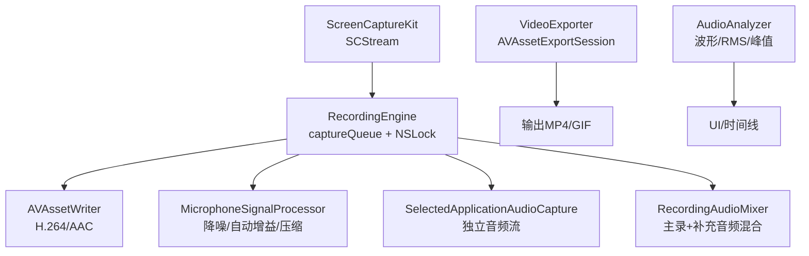
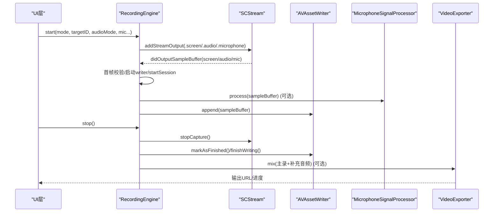
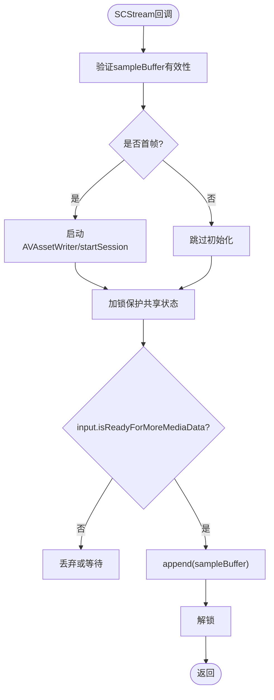
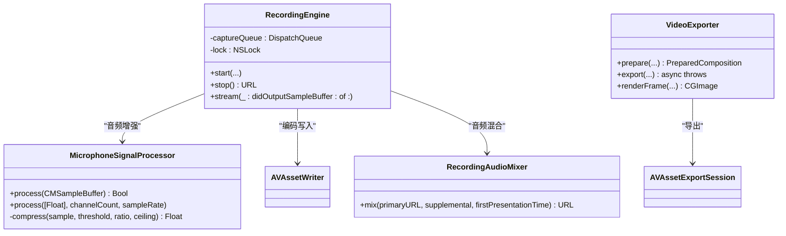

# 性能优化与最佳实践

<cite>
**本文引用的文件**   
- [RecordingEngine.swift](file://Sources/ScreenFree/RecordingEngine.swift)
- [VideoExporter.swift](file://Sources/ScreenFree/VideoExporter.swift)
- [AudioAnalyzer.swift](file://Sources/ScreenFree/AudioAnalyzer.swift)
- [MicrophoneSignalProcessor.swift](file://Sources/ScreenFree/MicrophoneSignalProcessor.swift)
- [RecordingAudioMixer.swift](file://Sources/ScreenFree/RecordingAudioMixer.swift)
- [ExportOptions.swift](file://Sources/ScreenFree/ExportOptions.swift)
- [README.md](file://README.md)
</cite>

## 目录
1. [简介](#简介)
2. [项目结构](#项目结构)
3. [核心组件](#核心组件)
4. [架构总览](#架构总览)
5. [详细组件分析](#详细组件分析)
6. [依赖关系分析](#依赖关系分析)
7. [性能考量](#性能考量)
8. [故障排查指南](#故障排查指南)
9. [结论](#结论)
10. [附录](#附录)

## 简介
本技术指南聚焦 ScreenFree 录制引擎的性能优化，围绕队列管理、内存管理、实时处理、编码参数调优、监控与调试、多线程同步等关键维度展开。文档基于源码实现进行深度剖析，提供可操作的优化建议与可视化流程图，帮助读者在保障音画质量的同时，获得稳定低延迟的录制体验。

## 项目结构
ScreenFree 采用 SwiftUI + AppKit 构建 UI，使用 ScreenCaptureKit 采集屏幕与系统音频，AVFoundation 完成编码与导出，CoreMedia/CoreAudio 处理底层媒体数据。核心录制流程由 RecordingEngine 驱动，视频导出由 VideoExporter 负责，音频分析与增强分别由 AudioAnalyzer 与 MicrophoneSignalProcessor 承担，可选的系统应用音频混音由 RecordingAudioMixer 完成，导出选项与估算由 ExportOptions 提供。

图表来源
- [RecordingEngine.swift:63-392](file://Sources/ScreenFree/RecordingEngine.swift#L63-L392)
- [VideoExporter.swift:95-590](file://Sources/ScreenFree/VideoExporter.swift#L95-L590)
- [AudioAnalyzer.swift:110-192](file://Sources/ScreenFree/AudioAnalyzer.swift#L110-L192)
- [MicrophoneSignalProcessor.swift:78-356](file://Sources/ScreenFree/MicrophoneSignalProcessor.swift#L78-L356)
- [RecordingAudioMixer.swift:29-136](file://Sources/ScreenFree/RecordingAudioMixer.swift#L29-L136)

章节来源
- [README.md:1-110](file://README.md#L1-L110)

## 核心组件
- 录制引擎（RecordingEngine）：封装 SCStream 配置、AVAssetWriter 初始化、音视频输入管线、首帧时序控制、停止与收尾流程。
- 视频导出（VideoExporter）：构建 AVMutableComposition、设置帧率与渲染尺寸、执行导出并支持进度回调与取消。
- 音频分析（AudioAnalyzer）：读取 PCM 样本计算 RMS、峰值、波形包络，支持多轨道合并与对齐。
- 麦克风信号处理（MicrophoneSignalProcessor）：实时降噪、自动增益、压缩限幅，支持 Float32/Int16 格式。
- 音频混音（RecordingAudioMixer）：将主录 MP4 与补充音频 M4A 按首帧时间对齐混合输出。
- 导出选项（ExportOptions）：质量档位、比特率估算、GIF 量化级别等。

章节来源
- [RecordingEngine.swift:63-392](file://Sources/ScreenFree/RecordingEngine.swift#L63-L392)
- [VideoExporter.swift:95-590](file://Sources/ScreenFree/VideoExporter.swift#L95-L590)
- [AudioAnalyzer.swift:110-192](file://Sources/ScreenFree/AudioAnalyzer.swift#L110-L192)
- [MicrophoneSignalProcessor.swift:78-356](file://Sources/ScreenFree/MicrophoneSignalProcessor.swift#L78-L356)
- [RecordingAudioMixer.swift:29-136](file://Sources/ScreenFree/RecordingAudioMixer.swift#L29-L136)
- [ExportOptions.swift:227-277](file://Sources/ScreenFree/ExportOptions.swift#L227-L277)

## 架构总览
录制与导出的端到端流程如下：

图表来源
- [RecordingEngine.swift:174-443](file://Sources/ScreenFree/RecordingEngine.swift#L174-L443)
- [RecordingEngine.swift:445-531](file://Sources/ScreenFree/RecordingEngine.swift#L445-L531)
- [RecordingAudioMixer.swift:29-136](file://Sources/ScreenFree/RecordingAudioMixer.swift#L29-L136)
- [VideoExporter.swift:488-590](file://Sources/ScreenFree/VideoExporter.swift#L488-L590)

## 详细组件分析

### 队列管理与任务调度（captureQueue）
- captureQueue 设计原则
  - 使用高优先级队列（userInteractive）确保采样回调及时响应，降低丢帧风险。
  - 通过 sampleHandlerQueue 统一接入 SCStream 回调，避免在主线程阻塞。
- QoS 级别选择
  - 主录制队列：userInteractive，保证交互流畅与低延迟。
  - 单独的应用音频捕获队列：userInitiated，兼顾实时性与资源占用。
- 任务调度优化
  - 最小化临界区：锁仅包裹状态切换与 writer 访问，append 前检查 isReadyForMoreMediaData。
  - 首帧时序控制：首次视频帧才启动 writer 会话，避免早期音频导致失败。
  - 队列深度与帧间隔：合理设置 queueDepth 与 minimumFrameInterval，平衡吞吐与延迟。

图表来源
- [RecordingEngine.swift:445-489](file://Sources/ScreenFree/RecordingEngine.swift#L445-L489)

章节来源
- [RecordingEngine.swift:63-117](file://Sources/ScreenFree/RecordingEngine.swift#L63-L117)
- [RecordingEngine.swift:174-392](file://Sources/ScreenFree/RecordingEngine.swift#L174-L392)
- [RecordingEngine.swift:445-531](file://Sources/ScreenFree/RecordingEngine.swift#L445-L531)

### 内存管理机制（CMSampleBuffer 与图像缓冲区）
- CMSampleBuffer 处理
  - 直接访问底层块缓冲（CMBlockBuffer），避免不必要拷贝；对 Float32/Int16 路径分别处理，减少转换开销。
  - 使用 retain 模式获取 AudioBufferList，释放时显式 dealloc，防止泄漏。
- 图像缓冲区优化
  - 像素格式固定为 32BGRA，配合 AVAssetWriterInput.expectsMediaDataInRealTime=true 提升写入效率。
  - 首帧完整性校验（SCFrameStatus.complete）避免不完整帧进入编码器。
- 垃圾回收策略
  - 利用 Swift ARC 与 Core Foundation 对象生命周期管理；避免强引用循环，使用弱引用或闭包捕获 self 时注意周期。
  - 测试中频繁创建临时 BlockBuffer，需确保 CMBlockBuffer 正确释放。

章节来源
- [MicrophoneSignalProcessor.swift:95-207](file://Sources/ScreenFree/MicrophoneSignalProcessor.swift#L95-L207)
- [RecordingEngine.swift:191-262](file://Sources/ScreenFree/RecordingEngine.swift#L191-L262)
- [RecordingEngine.swift:491-504](file://Sources/ScreenFree/RecordingEngine.swift#L491-L504)

### 实时处理关键技术（帧率、延迟、CPU）
- 帧率控制
  - SCStreamConfiguration.minimumFrameInterval 设置为 1/60s，限制最大帧率。
  - VideoExporter.frameDuration 根据目标帧率设置，确保导出一致性。
- 延迟优化
  - 减少锁竞争：仅在必要处加锁，避免长临界区。
  - 预分配与复用：AudioBufferList 存储按需分配，避免频繁 malloc/free。
- CPU 使用率监控
  - 通过 UI 层设备监控（MainView）展示麦克风授权、摄像头检测、音频信号状态，辅助定位瓶颈。

章节来源
- [RecordingEngine.swift:191-262](file://Sources/ScreenFree/RecordingEngine.swift#L191-L262)
- [VideoExporter.swift:450-486](file://Sources/ScreenFree/VideoExporter.swift#L450-L486)
- [MainView.swift:2106-2137](file://Sources/ScreenFree/MainView.swift#L2106-L2137)

### 编码参数调优（比特率、关键帧、压缩算法）
- H.264/AAC 设置
  - 视频平均比特率动态计算：max(6_000_000, width*height*4)，适配不同分辨率。
  - 关键帧间隔：AVVideoMaxKeyFrameIntervalKey=120，平衡随机访问与码率。
  - 音频：AAC，48kHz 立体声，192kbps。
- 质量档位
  - ExportQuality.studio/social/web/webLow 对应不同每像素比特率与 GIF 量化级别。
- 压缩算法选择
  - 默认 H.264 硬件加速友好；GIF 导出使用 ImageIO 与逐帧压缩。

章节来源
- [RecordingEngine.swift:283-326](file://Sources/ScreenFree/RecordingEngine.swift#L283-L326)
- [ExportOptions.swift:227-277](file://Sources/ScreenFree/ExportOptions.swift#L227-L277)

### 多线程同步与锁优化
- 锁策略
  - 使用 NSLock 保护 writer、inputs、firstPresentationTime 等共享状态。
  - withLock 扩展简化临界区代码，避免忘记解锁。
- 并发安全
  - SendableAssetWriter 包装 AVAssetWriter 以跨线程传递。
  - SelectedApplicationAudioCapture 独立线程处理补充音频，避免阻塞主录制。

章节来源
- [RecordingEngine.swift:328-350](file://Sources/ScreenFree/RecordingEngine.swift#L328-L350)
- [RecordingEngine.swift:676-690](file://Sources/ScreenFree/RecordingEngine.swift#L676-L690)
- [RecordingEngine.swift:533-674](file://Sources/ScreenFree/RecordingEngine.swift#L533-L674)

### 音频分析与增强
- AudioAnalyzer
  - 读取 PCM 样本，计算 RMS、峰值、波形包络，支持多轨道合并。
  - 归一化策略：绝对静音门限、自适应噪声底估计、平方根压缩视觉。
- MicrophoneSignalProcessor
  - 降噪：80Hz 高通滤波，低电平噪声门。
  - 自动增益：RMS 目标值、平滑响应、压缩限幅。
  - 支持 Float32/Int16 直通路径，零拷贝处理。

章节来源
- [AudioAnalyzer.swift:110-192](file://Sources/ScreenFree/AudioAnalyzer.swift#L110-L192)
- [MicrophoneSignalProcessor.swift:78-356](file://Sources/ScreenFree/MicrophoneSignalProcessor.swift#L78-L356)

## 依赖关系分析
- 录制阶段：SCStream -> RecordingEngine -> AVAssetWriter -> 文件系统
- 音频处理：MicrophoneSignalProcessor 作为中间件插入音频路径
- 导出阶段：VideoExporter -> AVAssetExportSession -> 输出文件
- 混音阶段：RecordingAudioMixer 将主录与补充音频对齐混合

图表来源
- [RecordingEngine.swift:63-392](file://Sources/ScreenFree/RecordingEngine.swift#L63-L392)
- [MicrophoneSignalProcessor.swift:78-356](file://Sources/ScreenFree/MicrophoneSignalProcessor.swift#L78-L356)
- [VideoExporter.swift:95-590](file://Sources/ScreenFree/VideoExporter.swift#L95-L590)
- [RecordingAudioMixer.swift:29-136](file://Sources/ScreenFree/RecordingAudioMixer.swift#L29-L136)

## 性能考量
- 队列深度与帧间隔
  - 调整 queueDepth 与 minimumFrameInterval 以匹配硬件能力，避免过深导致延迟累积。
- 锁粒度
  - 缩小临界区，减少锁持有时间，提高并发吞吐。
- 内存分配
  - 重用缓冲区，避免频繁分配；使用 retain 模式减少拷贝。
- 编码参数
  - 根据分辨率与用途调整比特率与关键帧间隔，平衡画质与文件大小。
- 实时监控
  - 通过 UI 层监控设备状态与信号质量，快速定位问题。

[本节为通用指导，不直接分析具体文件]

## 故障排查指南
- 常见问题
  - 无法启动 writer：检查 canAdd(input) 返回值与权限。
  - 首帧时序错误：确保首个视频帧后才启动 session，避免早期音频导致失败。
  - 音频不同步：核对 firstPresentationTime 对齐逻辑。
- 调试工具
  - 使用 Xcode Instruments 分析 CPU/内存/磁盘 I/O。
  - 启用 AVAssetWriter 状态检查，记录 status 与 error。
  - 通过 UI 层“Studio Check”验证权限与设备可用性。

章节来源
- [RecordingEngine.swift:283-326](file://Sources/ScreenFree/RecordingEngine.swift#L283-L326)
- [RecordingEngine.swift:445-489](file://Sources/ScreenFree/RecordingEngine.swift#L445-L489)
- [README.md:95-110](file://README.md#L95-L110)

## 结论
ScreenFree 录制引擎通过合理的队列管理、内存优化、实时处理与编码参数调优，实现了高性能、低延迟的屏幕录制体验。建议在部署时结合硬件特性调整队列深度与帧间隔，监控 CPU 与内存使用，持续优化锁粒度与缓冲区管理，以获得更稳定的录制效果。

[本节为总结性内容，不直接分析具体文件]

## 附录
- 性能测试建议
  - 使用不同分辨率与帧率组合测试编码性能。
  - 模拟高负载场景（多窗口、高刷新率）验证稳定性。
  - 对比开启/关闭音频增强对 CPU 的影响。
- 指标收集
  - 录制延迟：首帧到写入的时间差。
  - 丢帧率：SCStream 回调中无效帧比例。
  - 文件大小：单位时长比特率与实际大小对比。

[本节为通用指导，不直接分析具体文件]