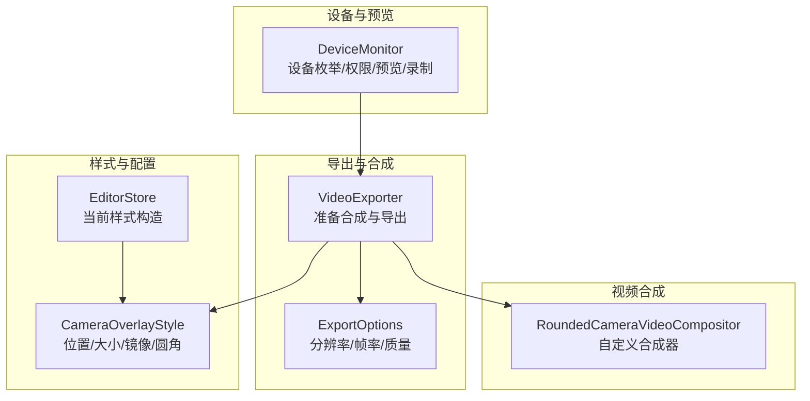
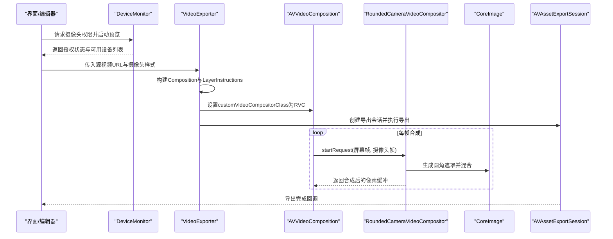
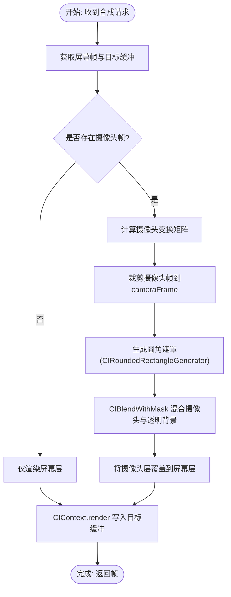
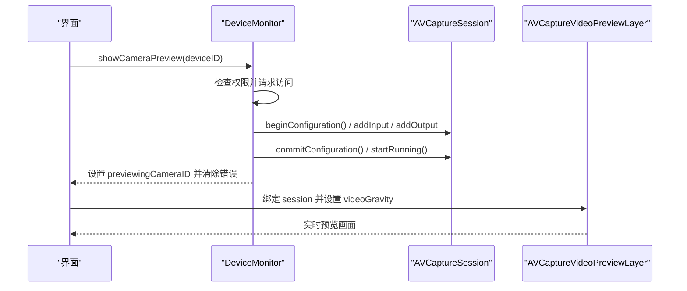
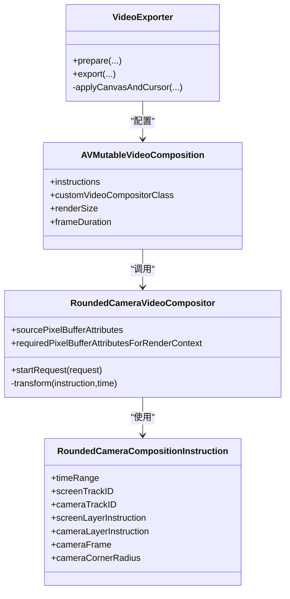
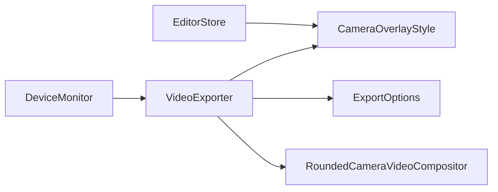

# 摄像头集成

<cite>
**本文引用的文件**
- [RoundedCameraVideoCompositor.swift](file://Sources/ScreenFree/RoundedCameraVideoCompositor.swift)
- [CameraOverlayStyle.swift](file://Sources/ScreenFree/CameraOverlayStyle.swift)
- [DeviceMonitor.swift](file://Sources/ScreenFree/DeviceMonitor.swift)
- [VideoExporter.swift](file://Sources/ScreenFree/VideoExporter.swift)
- [ExportOptions.swift](file://Sources/ScreenFree/ExportOptions.swift)
- [EditorStore.swift](file://Sources/ScreenFree/EditorStore.swift)
</cite>

## 目录
1. [简介](#简介)
2. [项目结构](#项目结构)
3. [核心组件](#核心组件)
4. [架构总览](#架构总览)
5. [详细组件分析](#详细组件分析)
6. [依赖关系分析](#依赖关系分析)
7. [性能考量](#性能考量)
8. [故障排查指南](#故障排查指南)
9. [结论](#结论)
10. [附录：配置示例与最佳实践](#附录配置示例与最佳实践)

## 简介
本技术文档围绕 ScreenFree 的摄像头画中画功能，系统性阐述以下方面：
- RoundedCameraVideoCompositor 的视频合成实现：摄像头视频流处理、圆角遮罩渲染与图层叠加算法。
- CameraOverlayStyle 的配置选项：位置、尺寸比例、镜像翻转、圆角半径等。
- 摄像头设备检测机制、权限管理与实时预览流程。
- 与 AVFoundation 的视频处理管道集成及实时渲染机制。
- 性能优化策略：硬件加速、内存管理、帧率控制与质量权衡。
- 具体配置示例与最佳实践，帮助开发者快速集成并调优。

## 项目结构
与摄像头画中画相关的核心代码分布在以下模块：
- 视频合成器：RoundedCameraVideoCompositor.swift（自定义 AVVideoCompositing）
- 样式配置：CameraOverlayStyle.swift（位置、大小、镜像、圆角）
- 设备与预览：DeviceMonitor.swift（AVCaptureSession、权限、预览、录制）
- 导出与合成管线：VideoExporter.swift（构建 AVMutableVideoComposition、设置自定义合成器）
- 导出参数与质量：ExportOptions.swift（分辨率、帧率、码率估算）
- 编辑器状态与样式注入：EditorStore.swift（当前样式生成与传递）

图表来源
- [VideoExporter.swift:340-486](file://Sources/ScreenFree/VideoExporter.swift#L340-L486)
- [ExportOptions.swift:103-182](file://Sources/ScreenFree/ExportOptions.swift#L103-L182)
- [CameraOverlayStyle.swift:1-27](file://Sources/ScreenFree/CameraOverlayStyle.swift#L1-L27)
- [EditorStore.swift:3033-3040](file://Sources/ScreenFree/EditorStore.swift#L3033-L3040)
- [DeviceMonitor.swift:188-250](file://Sources/ScreenFree/DeviceMonitor.swift#L188-L250)

章节来源
- [VideoExporter.swift:340-486](file://Sources/ScreenFree/VideoExporter.swift#L340-L486)
- [ExportOptions.swift:103-182](file://Sources/ScreenFree/ExportOptions.swift#L103-L182)
- [CameraOverlayStyle.swift:1-27](file://Sources/ScreenFree/CameraOverlayStyle.swift#L1-L27)
- [EditorStore.swift:3033-3040](file://Sources/ScreenFree/EditorStore.swift#L3033-L3040)
- [DeviceMonitor.swift:188-250](file://Sources/ScreenFree/DeviceMonitor.swift#L188-L250)

## 核心组件
- RoundedCameraVideoCompositor：实现 AVVideoCompositing，负责将屏幕层与摄像头层按时间线变换进行合成，并使用 CoreImage 生成圆角遮罩完成画中画效果。
- CameraOverlayStyle：描述摄像头叠加层的样式，包括位置、尺寸比例、是否镜像、圆角半径。
- DeviceMonitor：封装 AVCaptureSession，提供设备枚举、权限申请、预览显示与录制能力。
- VideoExporter：构建 AVMutableComposition、AVMutableVideoCompositionInstruction、设置自定义合成器类，并输出最终媒体。
- ExportOptions：定义导出分辨率、帧率、质量与文件大小估算。
- EditorStore：维护当前用户选择的摄像头样式，并在导出时注入到 VideoExporter。

章节来源
- [RoundedCameraVideoCompositor.swift:45-178](file://Sources/ScreenFree/RoundedCameraVideoCompositor.swift#L45-L178)
- [CameraOverlayStyle.swift:1-27](file://Sources/ScreenFree/CameraOverlayStyle.swift#L1-L27)
- [DeviceMonitor.swift:43-112](file://Sources/ScreenFree/DeviceMonitor.swift#L43-L112)
- [VideoExporter.swift:340-486](file://Sources/ScreenFree/VideoExporter.swift#L340-L486)
- [ExportOptions.swift:103-182](file://Sources/ScreenFree/ExportOptions.swift#L103-L182)
- [EditorStore.swift:3033-3040](file://Sources/ScreenFree/EditorStore.swift#L3033-L3040)

## 架构总览
下图展示了从设备采集到导出合成的整体数据流与控制流：

图表来源
- [DeviceMonitor.swift:188-250](file://Sources/ScreenFree/DeviceMonitor.swift#L188-L250)
- [VideoExporter.swift:340-486](file://Sources/ScreenFree/VideoExporter.swift#L340-L486)
- [RoundedCameraVideoCompositor.swift:68-144](file://Sources/ScreenFree/RoundedCameraVideoCompositor.swift#L68-L144)

## 详细组件分析

### RoundedCameraVideoCompositor 视频合成实现
- 输入与输出格式：声明 sourcePixelBufferAttributes 与 requiredPixelBufferAttributesForRenderContext 均为 32BGRA，确保与 AVFoundation 和 CoreImage 的高效路径一致。
- 合成流程：
  - 获取屏幕层像素缓冲并按 layer instruction 的时间相关变换计算 transform。
  - 若存在摄像头层，则同样计算其 transform，裁剪至 cameraFrame。
  - 使用 CIRoundedRectangleGenerator 生成圆角遮罩，并通过 CIBlendWithMask 将摄像头画面与透明背景混合，再覆盖到屏幕层上。
  - 通过 CIContext.render 将结果写入目标像素缓冲，完成一帧合成。
- 变换插值：transform 方法根据 time 在指令指定的时间范围内线性插值起始与结束变换矩阵，支持动画过渡。

图表来源
- [RoundedCameraVideoCompositor.swift:68-144](file://Sources/ScreenFree/RoundedCameraVideoCompositor.swift#L68-L144)
- [RoundedCameraVideoCompositor.swift:146-176](file://Sources/ScreenFree/RoundedCameraVideoCompositor.swift#L146-L176)

章节来源
- [RoundedCameraVideoCompositor.swift:45-178](file://Sources/ScreenFree/RoundedCameraVideoCompositor.swift#L45-L178)

### CameraOverlayStyle 配置项说明
- position：摄像头叠加位置（左上、右上、左下、右下），影响 origin 计算与 margin 布局。
- sizeFraction：摄像头显示尺寸占渲染尺寸的分数，限制在合理范围（如 0.12~0.5）。
- mirrored：是否对摄像头画面进行水平镜像，常用于前置摄像头自拍视角。
- cornerRadius：圆角半径，限制不超过画面宽高的一半，避免过度裁剪。

章节来源
- [CameraOverlayStyle.swift:1-27](file://Sources/ScreenFree/CameraOverlayStyle.swift#L1-L27)
- [VideoExporter.swift:374-445](file://Sources/ScreenFree/VideoExporter.swift#L374-L445)

### 设备检测、权限管理与实时预览
- 设备枚举：通过 AVCaptureDevice.DiscoverySession 枚举麦克风与摄像头设备，标记默认设备。
- 权限管理：分别请求音频与视频权限，更新授权状态；未授权时提示错误信息。
- 实时预览：创建 AVCaptureSession，添加输入与输出，设置 sessionPreset 为 high，启动运行；通过 AVCaptureVideoPreviewLayer 在 NSViewRepresentable 中显示。
- 录制：使用 AVCaptureMovieFileOutput 将摄像头流写入 .mov 文件，异步等待录制完成。

图表来源
- [DeviceMonitor.swift:188-250](file://Sources/ScreenFree/DeviceMonitor.swift#L188-L250)
- [DeviceMonitor.swift:334-361](file://Sources/ScreenFree/DeviceMonitor.swift#L334-L361)

章节来源
- [DeviceMonitor.swift:43-112](file://Sources/ScreenFree/DeviceMonitor.swift#L43-L112)
- [DeviceMonitor.swift:188-250](file://Sources/ScreenFree/DeviceMonitor.swift#L188-L250)
- [DeviceMonitor.swift:334-361](file://Sources/ScreenFree/DeviceMonitor.swift#L334-L361)

### 与 AVFoundation 的视频处理管道集成
- Composition 构建：VideoExporter 创建 AVMutableComposition，插入屏幕与摄像头轨道。
- Layer Instructions：为屏幕与摄像头分别创建 AVMutableVideoCompositionLayerInstruction，设置变换矩阵以定位与缩放摄像头画面。
- 自定义合成器：当需要圆角效果时，设置 AVMutableVideoComposition.customVideoCompositorClass 为 RoundedCameraVideoCompositor，并替换 instruction 为 RoundedCameraCompositionInstruction。
- 帧率与渲染尺寸：设置 frameDuration 与 renderSize，保证导出帧率与输出分辨率符合预期。

图表来源
- [VideoExporter.swift:340-486](file://Sources/ScreenFree/VideoExporter.swift#L340-L486)
- [RoundedCameraVideoCompositor.swift:4-43](file://Sources/ScreenFree/RoundedCameraVideoCompositor.swift#L4-L43)

章节来源
- [VideoExporter.swift:340-486](file://Sources/ScreenFree/VideoExporter.swift#L340-L486)

## 依赖关系分析
- VideoExporter 依赖 ExportOptions 决定分辨率、帧率与质量；依赖 CameraOverlayStyle 确定摄像头叠加样式。
- DeviceMonitor 独立于导出流程，提供设备与预览能力，供编辑器或录制流程调用。
- RoundedCameraVideoCompositor 依赖 CoreImage 进行遮罩生成与混合，依赖 AVFoundation 的像素缓冲接口。
- EditorStore 负责聚合用户选择并生成 currentCameraOverlayStyle，传递给 VideoExporter。

图表来源
- [EditorStore.swift:3033-3040](file://Sources/ScreenFree/EditorStore.swift#L3033-L3040)
- [VideoExporter.swift:340-486](file://Sources/ScreenFree/VideoExporter.swift#L340-L486)
- [ExportOptions.swift:103-182](file://Sources/ScreenFree/ExportOptions.swift#L103-L182)
- [RoundedCameraVideoCompositor.swift:45-178](file://Sources/ScreenFree/RoundedCameraVideoCompositor.swift#L45-L178)
- [DeviceMonitor.swift:188-250](file://Sources/ScreenFree/DeviceMonitor.swift#L188-L250)

章节来源
- [EditorStore.swift:3033-3040](file://Sources/ScreenFree/EditorStore.swift#L3033-L3040)
- [VideoExporter.swift:340-486](file://Sources/ScreenFree/VideoExporter.swift#L340-L486)
- [ExportOptions.swift:103-182](file://Sources/ScreenFree/ExportOptions.swift#L103-L182)
- [RoundedCameraVideoCompositor.swift:45-178](file://Sources/ScreenFree/RoundedCameraVideoCompositor.swift#L45-L178)
- [DeviceMonitor.swift:188-250](file://Sources/ScreenFree/DeviceMonitor.swift#L188-L250)

## 性能考量
- 像素格式一致性：统一使用 kCVPixelFormatType_32BGRA，减少格式转换开销，提升 GPU/CPU 协同效率。
- CoreImage 滤镜链：圆角遮罩与混合操作由 CoreImage 高效执行，避免逐像素 CPU 处理。
- 帧率控制：frameDuration 设置为 1/帧率，限制导出帧率范围（如 15~120），平衡流畅度与资源占用。
- 质量与码率：ExportOptions 提供不同质量档位，按像素与帧率估算文件大小与处理时长，便于用户权衡。
- 内存管理：CIContext 复用，避免频繁创建；像素缓冲按需分配，及时释放。
- 硬件加速：AVFoundation 与 CoreImage 在 macOS/iOS 上充分利用硬件编解码与图形加速。

[本节为通用指导，不直接分析具体文件]

## 故障排查指南
- 摄像头权限不足：
  - 现象：无法显示预览或录制失败。
  - 排查：确认 cameraAuthorization 状态，必要时调用 requestCameraAccess。
  - 参考：[DeviceMonitor.swift:108-112](file://Sources/ScreenFree/DeviceMonitor.swift#L108-L112)
- 设备不可用或断开：
  - 现象：showCameraPreview 失败并提示设备不再连接。
  - 排查：重新枚举设备并刷新列表。
  - 参考：[DeviceMonitor.swift:198-212](file://Sources/ScreenFree/DeviceMonitor.swift#L198-L212)
- 录制未就绪：
  - 现象：startCameraRecording 抛出 cameraNotReady。
  - 排查：确保已启动预览且 session 正在运行。
  - 参考：[DeviceMonitor.swift:252-255](file://Sources/ScreenFree/DeviceMonitor.swift#L252-L255)
- 合成失败：
  - 现象：RoundedCameraVideoCompositor 返回错误。
  - 排查：检查屏幕帧与摄像头帧是否有效，目标缓冲是否可分配。
  - 参考：[RoundedCameraVideoCompositor.swift:74-86](file://Sources/ScreenFree/RoundedCameraVideoCompositor.swift#L74-L86)

章节来源
- [DeviceMonitor.swift:108-112](file://Sources/ScreenFree/DeviceMonitor.swift#L108-L112)
- [DeviceMonitor.swift:198-212](file://Sources/ScreenFree/DeviceMonitor.swift#L198-L212)
- [DeviceMonitor.swift:252-255](file://Sources/ScreenFree/DeviceMonitor.swift#L252-L255)
- [RoundedCameraVideoCompositor.swift:74-86](file://Sources/ScreenFree/RoundedCameraVideoCompositor.swift#L74-L86)

## 结论
ScreenFree 的摄像头画中画功能通过 AVFoundation 与 CoreImage 的深度集成，实现了高性能、可配置的实时视频合成。RoundedCameraVideoCompositor 提供了灵活的圆角遮罩与图层叠加算法，CameraOverlayStyle 简化了样式配置，DeviceMonitor 完善了设备与权限管理。结合 ExportOptions 的质量与帧率控制，系统能够在不同场景下提供稳定、高效的导出体验。

[本节为总结性内容，不直接分析具体文件]

## 附录：配置示例与最佳实践
- 配置摄像头叠加样式：
  - 位置：选择四角之一，影响 origin 计算与边距。
  - 尺寸比例：建议设置在 0.12~0.5 之间，避免遮挡主画面。
  - 镜像：前置摄像头建议开启，以获得自然视角。
  - 圆角：根据画面大小调整，最大不超过宽高一半。
  - 参考：[CameraOverlayStyle.swift:1-27](file://Sources/ScreenFree/CameraOverlayStyle.swift#L1-L27)、[VideoExporter.swift:374-445](file://Sources/ScreenFree/VideoExporter.swift#L374-L445)
- 设置导出参数：
  - 分辨率：根据用途选择 Source/4K/1080p/720p/Custom。
  - 帧率：根据平台与需求选择 24/25/30/50/60。
  - 质量：Studio/Social/Web/WebLow，权衡文件大小与处理时长。
  - 参考：[ExportOptions.swift:103-182](file://Sources/ScreenFree/ExportOptions.swift#L103-L182)
- 启用摄像头预览与录制：
  - 先请求权限，再启动预览；录制前确保预览已运行。
  - 参考：[DeviceMonitor.swift:188-250](file://Sources/ScreenFree/DeviceMonitor.swift#L188-L250)
- 性能优化建议：
  - 保持像素格式一致，减少转换。
  - 复用 CIContext，避免频繁创建。
  - 合理设置 frameDuration 与 renderSize，控制资源占用。
  - 参考：[RoundedCameraVideoCompositor.swift:52-64](file://Sources/ScreenFree/RoundedCameraVideoCompositor.swift#L52-L64)、[VideoExporter.swift:459-462](file://Sources/ScreenFree/VideoExporter.swift#L459-L462)

章节来源
- [CameraOverlayStyle.swift:1-27](file://Sources/ScreenFree/CameraOverlayStyle.swift#L1-L27)
- [VideoExporter.swift:374-445](file://Sources/ScreenFree/VideoExporter.swift#L374-L445)
- [ExportOptions.swift:103-182](file://Sources/ScreenFree/ExportOptions.swift#L103-L182)
- [DeviceMonitor.swift:188-250](file://Sources/ScreenFree/DeviceMonitor.swift#L188-L250)
- [RoundedCameraVideoCompositor.swift:52-64](file://Sources/ScreenFree/RoundedCameraVideoCompositor.swift#L52-L64)
- [VideoExporter.swift:459-462](file://Sources/ScreenFree/VideoExporter.swift#L459-L462)