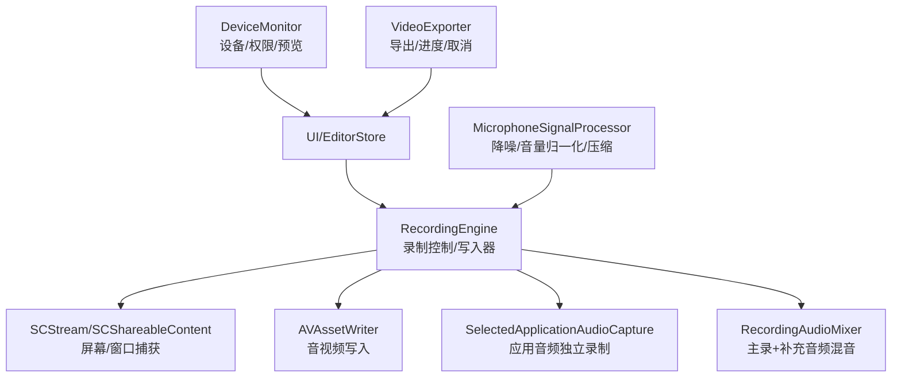
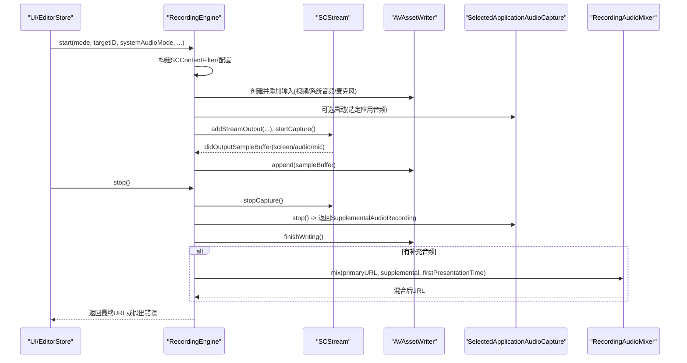
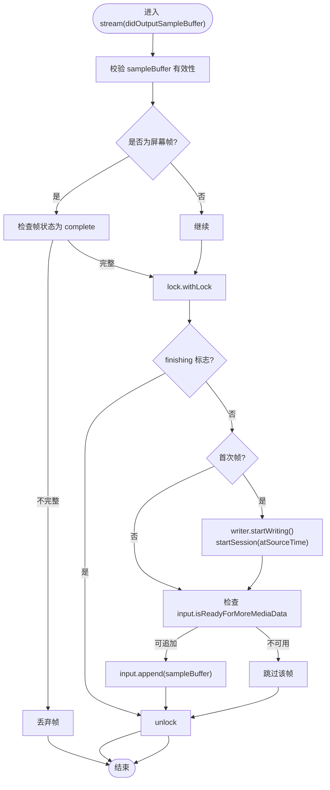
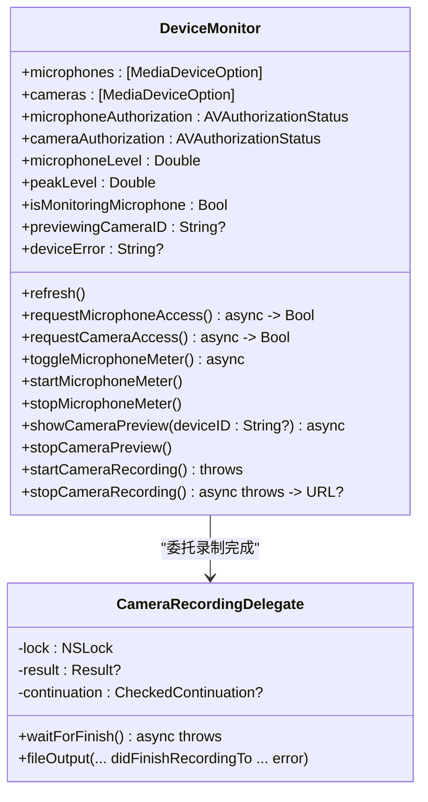
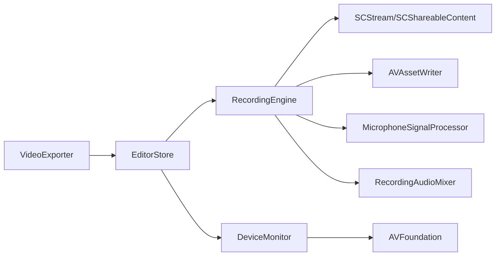

# 错误处理与调试

<cite>
**本文引用的文件**
- [RecordingEngine.swift](file://Sources/ScreenFree/RecordingEngine.swift)
- [DeviceMonitor.swift](file://Sources/ScreenFree/DeviceMonitor.swift)
- [MicrophoneSignalProcessor.swift](file://Sources/ScreenFree/MicrophoneSignalProcessor.swift)
- [RecordingAudioMixer.swift](file://Sources/ScreenFree/RecordingAudioMixer.swift)
- [EditorStore.swift](file://Sources/ScreenFree/EditorStore.swift)
- [VideoExporter.swift](file://Sources/ScreenFree/VideoExporter.swift)
</cite>

## 目录
1. [简介](#简介)
2. [项目结构](#项目结构)
3. [核心组件](#核心组件)
4. [架构总览](#架构总览)
5. [详细组件分析](#详细组件分析)
6. [依赖关系分析](#依赖关系分析)
7. [性能考量](#性能考量)
8. [故障排查指南](#故障排查指南)
9. [结论](#结论)
10. [附录：错误类型与恢复策略速查](#附录错误类型与恢复策略速查)

## 简介
本文件聚焦 ScreenFree 录制引擎的错误处理机制，系统性解析 RecordingError 枚举的每种错误类型、触发条件与恢复策略；深入说明线程安全机制（NSLock、并发队列、资源管理）；阐述设备监控系统（显示设备检测、音频设备状态监控、权限检查）；解释异步操作中的错误传播与异常处理最佳实践；并提供面向用户的错误提示与自动恢复策略的实践建议。

## 项目结构
围绕错误处理与调试的核心代码主要分布在以下模块：
- 录制引擎与写入器：RecordingEngine.swift
- 设备监控与权限：DeviceMonitor.swift
- 音频信号处理：MicrophoneSignalProcessor.swift
- 音频混音与导出：RecordingAudioMixer.swift
- 编辑器状态与用户交互：EditorStore.swift
- 视频导出与取消处理：VideoExporter.swift

图表来源
- [RecordingEngine.swift:63-531](file://Sources/ScreenFree/RecordingEngine.swift#L63-L531)
- [DeviceMonitor.swift:44-285](file://Sources/ScreenFree/DeviceMonitor.swift#L44-L285)
- [MicrophoneSignalProcessor.swift:78-356](file://Sources/ScreenFree/MicrophoneSignalProcessor.swift#L78-L356)
- [RecordingAudioMixer.swift:29-136](file://Sources/ScreenFree/RecordingAudioMixer.swift#L29-L136)
- [EditorStore.swift:1-200](file://Sources/ScreenFree/EditorStore.swift#L1-L200)
- [VideoExporter.swift:553-590](file://Sources/ScreenFree/VideoExporter.swift#L553-L590)

章节来源
- [RecordingEngine.swift:63-531](file://Sources/ScreenFree/RecordingEngine.swift#L63-L531)
- [DeviceMonitor.swift:44-285](file://Sources/ScreenFree/DeviceMonitor.swift#L44-L285)

## 核心组件
- RecordingEngine：负责屏幕/窗口/区域捕获、系统音频与麦克风采集、AVAssetWriter 初始化与数据写入、停止与收尾、以及选择应用音频的独立录制与混合。
- DeviceMonitor：负责麦克风与摄像头设备发现、授权请求、实时音频电平监测、摄像头预览与录制。
- MicrophoneSignalProcessor：对 PCM 音频进行降噪、自动增益、压缩与门限处理，提升语音质量。
- RecordingAudioMixer：将主录制与“选定应用音频”补充录音合并为最终输出。
- EditorStore：编排录制流程、展示状态消息与错误信息、协调 UI 行为。
- VideoExporter：导出任务、进度回调、取消处理与失败清理。

章节来源
- [RecordingEngine.swift:63-531](file://Sources/ScreenFree/RecordingEngine.swift#L63-L531)
- [DeviceMonitor.swift:44-285](file://Sources/ScreenFree/DeviceMonitor.swift#L44-L285)
- [MicrophoneSignalProcessor.swift:78-356](file://Sources/ScreenFree/MicrophoneSignalProcessor.swift#L78-L356)
- [RecordingAudioMixer.swift:29-136](file://Sources/ScreenFree/RecordingAudioMixer.swift#L29-L136)
- [EditorStore.swift:1-200](file://Sources/ScreenFree/EditorStore.swift#L1-L200)
- [VideoExporter.swift:553-590](file://Sources/ScreenFree/VideoExporter.swift#L553-L590)

## 架构总览
录制引擎采用“捕获流 + 写入器”的双通道架构：
- 屏幕/窗口/区域通过 SCStream 捕获帧与音频，回调在专用 captureQueue 上执行。
- AVAssetWriter 负责将样本缓冲写入 MP4/M4A，支持多输入（视频、系统音频、麦克风）。
- 可选的 SelectedApplicationAudioCapture 单独录制选定应用的音频，再与主录制混音。
- 错误通过 LocalizedError 枚举向上抛出，UI 层统一呈现本地化消息。

图表来源
- [RecordingEngine.swift:174-443](file://Sources/ScreenFree/RecordingEngine.swift#L174-L443)
- [RecordingEngine.swift:533-674](file://Sources/ScreenFree/RecordingEngine.swift#L533-L674)
- [RecordingAudioMixer.swift:30-134](file://Sources/ScreenFree/RecordingAudioMixer.swift#L30-L134)

## 详细组件分析

### RecordingError 枚举与错误语义
- noSource：未找到可录制的显示器或窗口。触发于 start/thumbnail 中找不到目标显示或窗口时。
- noAudioApplications：选择了“仅选定应用音频”但未选中任何应用或未找到对应显示。
- cannotStartWriter：AVAssetWriter 无法添加输入（canAdd 失败），常见于格式不匹配或资源不足。
- cannotFinishWriter：停止阶段缺少必要状态（如 writer/url 为空），或写入器未完成。
- writerFailed(details)：写入器完成时 status 非 completed，携带底层错误或状态码。

恢复策略建议：
- noSource：提示用户重新选择显示/窗口，或检查是否被遮挡/最小化。
- noAudioApplications：引导用户至少选择一个应用，或切换为“全部应用音频”。
- cannotStartWriter：检查分辨率/编码设置，释放其他占用资源的进程，重试一次。
- cannotFinishWriter：检查磁盘空间与权限，清理临时文件后重试。
- writerFailed(details)：记录详细信息，向用户提供可操作的修复建议（如更换编码器/降低码率）。

章节来源
- [RecordingEngine.swift:40-61](file://Sources/ScreenFree/RecordingEngine.swift#L40-L61)
- [RecordingEngine.swift:145-172](file://Sources/ScreenFree/RecordingEngine.swift#L145-L172)
- [RecordingEngine.swift:174-392](file://Sources/ScreenFree/RecordingEngine.swift#L174-L392)
- [RecordingEngine.swift:394-443](file://Sources/ScreenFree/RecordingEngine.swift#L394-L443)

### 线程安全与并发控制
- 专用队列 captureQueue：用于 SCStream 回调的高频样本处理，避免阻塞主线程。
- NSLock：保护共享状态（writer、inputs、outputURL、finishing、firstPresentationTime 等），确保 start/stop/append 的原子性。
- withLock 扩展：封装加锁/解锁，减少遗漏风险。
- SendableAssetWriter：包装 AVAssetWriter 以跨异步边界传递。
- 采样时间一致性：首帧时间戳用于 session 起始，避免早期音频导致永久失败。

图表来源
- [RecordingEngine.swift:445-504](file://Sources/ScreenFree/RecordingEngine.swift#L445-L504)
- [RecordingEngine.swift:684-690](file://Sources/ScreenFree/RecordingEngine.swift#L684-L690)

章节来源
- [RecordingEngine.swift:63-82](file://Sources/ScreenFree/RecordingEngine.swift#L63-L82)
- [RecordingEngine.swift:328-350](file://Sources/ScreenFree/RecordingEngine.swift#L328-L350)
- [RecordingEngine.swift:402-416](file://Sources/ScreenFree/RecordingEngine.swift#L402-L416)
- [RecordingEngine.swift:445-504](file://Sources/ScreenFree/RecordingEngine.swift#L445-L504)
- [RecordingEngine.swift:684-690](file://Sources/ScreenFree/RecordingEngine.swift#L684-L690)

### 设备监控系统（显示/音频/权限）
- 显示设备检测：通过 SCShareableContent.displays 枚举可用显示器，计算主屏与尺寸。
- 音频设备状态：AVAudioEngine 监听麦克风输入，计算 RMS 与峰值，提供静音/正常/削波状态。
- 权限检查：AVCaptureDevice.requestAccess(for:) 动态请求麦克风和摄像头权限，刷新设备列表。
- 摄像头预览与录制：AVCaptureSession 管理输入输出，支持预览与文件录制，使用委托与 CheckedContinuation 同步结果。

图表来源
- [DeviceMonitor.swift:44-285](file://Sources/ScreenFree/DeviceMonitor.swift#L44-L285)
- [DeviceMonitor.swift:287-332](file://Sources/ScreenFree/DeviceMonitor.swift#L287-L332)

章节来源
- [DeviceMonitor.swift:69-100](file://Sources/ScreenFree/DeviceMonitor.swift#L69-L100)
- [DeviceMonitor.swift:102-112](file://Sources/ScreenFree/DeviceMonitor.swift#L102-L112)
- [DeviceMonitor.swift:114-186](file://Sources/ScreenFree/DeviceMonitor.swift#L114-L186)
- [DeviceMonitor.swift:188-250](file://Sources/ScreenFree/DeviceMonitor.swift#L188-L250)
- [DeviceMonitor.swift:252-284](file://Sources/ScreenFree/DeviceMonitor.swift#L252-L284)
- [DeviceMonitor.swift:287-332](file://Sources/ScreenFree/DeviceMonitor.swift#L287-L332)

### 音频信号处理（降噪/归一化/压缩）
- 支持 16bit/32bit PCM 输入，按通道处理。
- 降噪：高通滤波抑制低频噪声。
- 自动增益：基于 RMS 的动态增益平滑调整，限制最小/最大增益。
- 压缩：软阈值压缩防止削波，输出上限限制。
- 门限：低电平衰减抑制背景噪声。

章节来源
- [MicrophoneSignalProcessor.swift:78-356](file://Sources/ScreenFree/MicrophoneSignalProcessor.swift#L78-L356)

### 音频混音与导出
- 主录制包含视频与多条音频轨，补充音频来自选定应用。
- 根据首帧时间戳对齐两路音频，裁剪重叠部分，生成混合输出。
- 失败路径：缺失视频轨、无法创建轨道/导出会话、导出失败等。

章节来源
- [RecordingAudioMixer.swift:29-136](file://Sources/ScreenFree/RecordingAudioMixer.swift#L29-L136)

### 异步错误传播与最佳实践
- 使用 withCheckedThrowingContinuation 桥接回调式 API（如 AVAssetWriter.finishWriting、相机录制委托）。
- 在 finally/defer 中确保资源释放（关闭流、移除临时文件、重置状态）。
- 统一通过 LocalizedError 抛出，UI 层读取 errorDescription 展示本地化消息。
- 取消处理：VideoExporter 中使用 Task 取消处理器，取消时清理中间文件并抛出 CancellationError。

章节来源
- [RecordingEngine.swift:418-443](file://Sources/ScreenFree/RecordingEngine.swift#L418-L443)
- [RecordingEngine.swift:626-645](file://Sources/ScreenFree/RecordingEngine.swift#L626-L645)
- [DeviceMonitor.swift:296-323](file://Sources/ScreenFree/DeviceMonitor.swift#L296-L323)
- [VideoExporter.swift:553-590](file://Sources/ScreenFree/VideoExporter.swift#L553-L590)

## 依赖关系分析
- RecordingEngine 依赖 SCStream/SCShareableContent（系统级捕获）、AVAssetWriter（写入）、MicrophoneSignalProcessor（音频增强）、RecordingAudioMixer（混音）。
- DeviceMonitor 依赖 AVFoundation（设备/会话/音频引擎）与 AppKit（预览层）。
- EditorStore 聚合录制与导出流程，驱动 UI 状态与用户交互。
- VideoExporter 依赖 AVAssetExportSession，提供进度与取消能力。

图表来源
- [RecordingEngine.swift:63-531](file://Sources/ScreenFree/RecordingEngine.swift#L63-L531)
- [DeviceMonitor.swift:44-285](file://Sources/ScreenFree/DeviceMonitor.swift#L44-L285)
- [EditorStore.swift:1-200](file://Sources/ScreenFree/EditorStore.swift#L1-L200)
- [VideoExporter.swift:553-590](file://Sources/ScreenFree/VideoExporter.swift#L553-L590)

章节来源
- [RecordingEngine.swift:63-531](file://Sources/ScreenFree/RecordingEngine.swift#L63-L531)
- [DeviceMonitor.swift:44-285](file://Sources/ScreenFree/DeviceMonitor.swift#L44-L285)
- [EditorStore.swift:1-200](file://Sources/ScreenFree/EditorStore.swift#L1-L200)
- [VideoExporter.swift:553-590](file://Sources/ScreenFree/VideoExporter.swift#L553-L590)

## 性能考量
- 高优先级队列 captureQueue（userInteractive）保障帧处理低延迟。
- 合理设置 queueDepth、minimumFrameInterval 与像素格式，平衡吞吐与内存。
- 音频处理仅在启用增强时运行，避免不必要的 CPU 开销。
- 写入器输入按需添加，减少无效 I/O。
- 混合阶段使用 Passthrough 预设，避免重复编码。

[本节为通用指导，不直接分析具体文件]

## 故障排查指南
- 无录制源（noSource）
  - 现象：start/thumbnail 抛出 noSource。
  - 排查：确认显示器/窗口可见且未被遮挡；检查目标 ID 是否正确；尝试切换 CaptureMode。
  - 恢复：提示用户重新选择目标，必要时重启捕获服务。

- 无音频应用（noAudioApplications）
  - 现象：选择“仅选定应用音频”但未选应用或无显示关联。
  - 排查：确认至少选择一个应用；检查应用是否在所选显示器上运行。
  - 恢复：引导用户选择应用或切换为“全部应用音频”。

- 无法启动写入器（cannotStartWriter）
  - 现象：AVAssetWriter.canAdd(input) 失败。
  - 排查：检查分辨率/编码参数；确认磁盘空间与权限；释放冲突进程。
  - 恢复：降级编码参数或分辨率后重试。

- 无法完成写入（cannotFinishWriter）
  - 现象：stop 阶段 writer/url 为空或 finishWriting 失败。
  - 排查：检查是否有有效首帧；确认写入器状态；清理临时文件。
  - 恢复：重试录制，若持续失败则提示用户检查系统媒体服务。

- 写入器失败（writerFailed）
  - 现象：finishWriting 回调中 status != completed。
  - 排查：记录 writer.error 与 status；检查磁盘/权限/编码兼容性。
  - 恢复：根据错误详情调整参数或提示用户修复环境。

- 设备权限问题
  - 现象：麦克风/摄像头权限未授予导致预览或录制失败。
  - 排查：调用 requestAccess 并刷新设备列表；检查系统设置。
  - 恢复：引导用户前往系统设置授予权限。

- 异步错误传播
  - 现象：withCheckedThrowingContinuation 未正确 resume 或忽略错误。
  - 排查：确保回调路径均能恢复 continuation；检查委托方法是否传递 error。
  - 恢复：修正回调逻辑，保证错误向上传播。

章节来源
- [RecordingEngine.swift:40-61](file://Sources/ScreenFree/RecordingEngine.swift#L40-L61)
- [RecordingEngine.swift:174-392](file://Sources/ScreenFree/RecordingEngine.swift#L174-L392)
- [RecordingEngine.swift:394-443](file://Sources/ScreenFree/RecordingEngine.swift#L394-L443)
- [DeviceMonitor.swift:102-112](file://Sources/ScreenFree/DeviceMonitor.swift#L102-L112)
- [DeviceMonitor.swift:252-284](file://Sources/ScreenFree/DeviceMonitor.swift#L252-L284)
- [VideoExporter.swift:553-590](file://Sources/ScreenFree/VideoExporter.swift#L553-L590)

## 结论
ScreenFree 的错误处理体系以明确的 LocalizedError 枚举为核心，结合严格的线程安全与异步错误传播机制，确保录制过程稳定可靠。设备监控与权限管理为用户提供友好的交互体验，而音频增强与混音模块提升了最终输出质量。遵循本文档的恢复策略与最佳实践，可有效降低录制失败率并提升用户体验。

[本节为总结性内容，不直接分析具体文件]

## 附录：错误类型与恢复策略速查
- noSource：重新选择显示/窗口，检查目标可见性与 ID。
- noAudioApplications：至少选择一个应用或切换为“全部应用音频”。
- cannotStartWriter：检查编码参数、磁盘空间与权限，降级参数重试。
- cannotFinishWriter：确保存在首帧与有效 writer/url，清理临时文件后重试。
- writerFailed(details)：记录错误详情，根据提示调整参数或修复环境。
- cameraNotReady：确保摄像头预览已启动且会话运行。
- exportFailed/cannotCreateTrack 等：检查资产可用性、轨道创建与导出会话状态。

章节来源
- [RecordingEngine.swift:40-61](file://Sources/ScreenFree/RecordingEngine.swift#L40-L61)
- [RecordingAudioMixer.swift:4-22](file://Sources/ScreenFree/RecordingAudioMixer.swift#L4-L22)
- [DeviceMonitor.swift:32-41](file://Sources/ScreenFree/DeviceMonitor.swift#L32-L41)