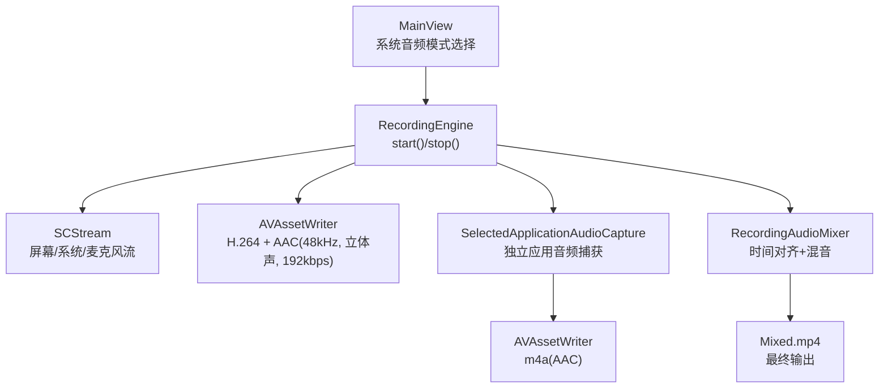
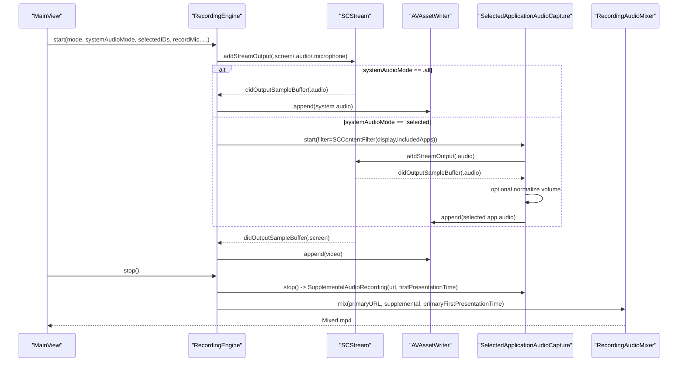
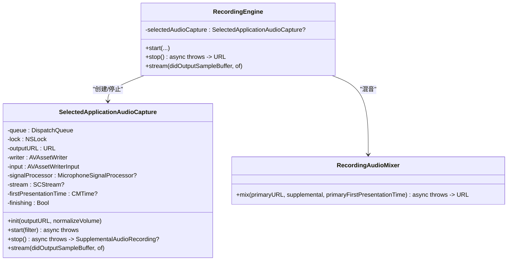
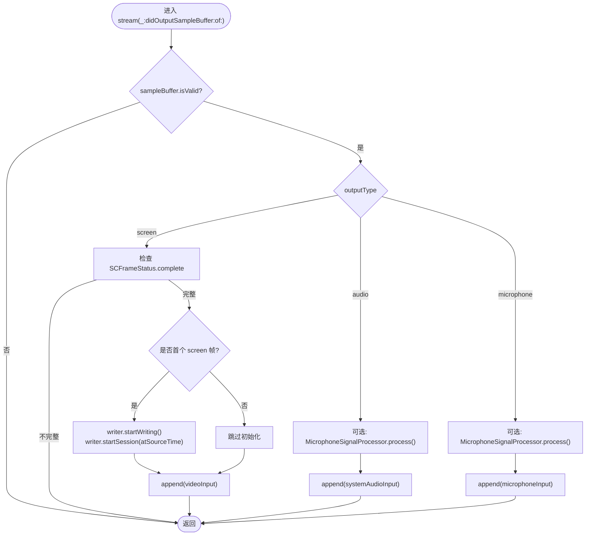
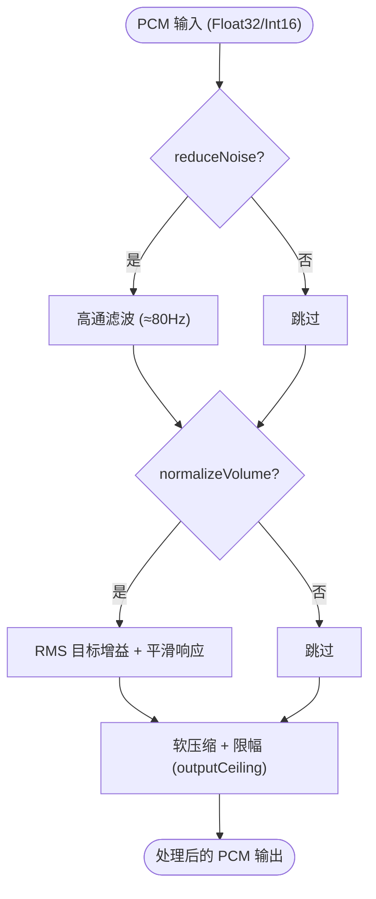
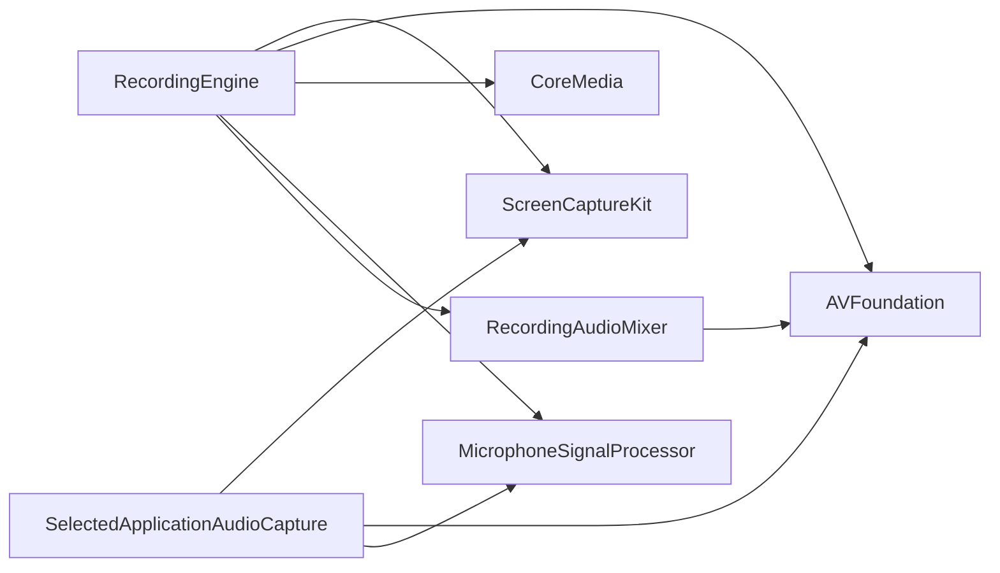

# 系统音频捕获

<cite>
**本文引用的文件**   
- [RecordingEngine.swift](file://Sources/ScreenFree/RecordingEngine.swift)
- [MicrophoneSignalProcessor.swift](file://Sources/ScreenFree/MicrophoneSignalProcessor.swift)
- [RecordingAudioMixer.swift](file://Sources/ScreenFree/RecordingAudioMixer.swift)
- [RecordedAudioLayout.swift](file://Sources/ScreenFree/RecordedAudioLayout.swift)
- [MainView.swift](file://Sources/ScreenFree/MainView.swift)
- [VideoExporterTests.swift](file://Tests/ScreenFreeMediaTests/VideoExporterTests.swift)
</cite>

## 目录
1. [简介](#简介)
2. [项目结构](#项目结构)
3. [核心组件](#核心组件)
4. [架构总览](#架构总览)
5. [详细组件分析](#详细组件分析)
6. [依赖关系分析](#依赖关系分析)
7. [性能考量](#性能考量)
8. [故障排查指南](#故障排查指南)
9. [结论](#结论)
10. [附录](#附录)

## 简介
本技术文档聚焦 ScreenFree 的系统音频捕获能力，系统性阐述 SystemAudioCaptureMode 的三种模式（All、Selected、Off）的实现差异与数据流；深入解析 SelectedApplicationAudioCapture 的独立音频捕获机制（应用级过滤、SCContentFilter 配置、音量归一化、多文件合成流程）；说明系统音频与屏幕捕获的同步机制（时间戳对齐与流处理）；并提供具体配置示例（采样率 48kHz、立体声、AAC 192kbps）。同时解释音频信号处理管道与实时处理能力（降噪、自动增益、峰值压缩等）。

## 项目结构
与系统音频捕获相关的核心代码集中在以下文件：
- RecordingEngine.swift：录制引擎，负责屏幕与系统音频采集、AVAssetWriter 初始化、流回调处理、停止时混合补充音频。
- MicrophoneSignalProcessor.swift：音频信号处理器，实现降噪、自动增益、压缩与限幅，支持 PCM 浮点与 16bit 整数输入。
- RecordingAudioMixer.swift：将“选定应用”的独立音频与主视频文件进行时间对齐与混音输出。
- RecordedAudioLayout.swift：根据录制模式决定系统音频与麦克风在最终轨道中的索引布局。
- MainView.swift：用户界面中系统音频模式选择与“选定应用”列表展示。
- VideoExporterTests.swift：验证不同模式下系统/麦克风的轨道索引布局。

图表来源
- [RecordingEngine.swift:174-392](file://Sources/ScreenFree/RecordingEngine.swift#L174-L392)
- [RecordingEngine.swift:533-674](file://Sources/ScreenFree/RecordingEngine.swift#L533-L674)
- [RecordingAudioMixer.swift:29-134](file://Sources/ScreenFree/RecordingAudioMixer.swift#L29-L134)

章节来源
- [RecordingEngine.swift:1-691](file://Sources/ScreenFree/RecordingEngine.swift#L1-L691)
- [RecordingAudioMixer.swift:1-136](file://Sources/ScreenFree/RecordingAudioMixer.swift#L1-L136)
- [MainView.swift:1528-1640](file://Sources/ScreenFree/MainView.swift#L1528-L1640)

## 核心组件
- SystemAudioCaptureMode：定义系统音频捕获的三种模式
  - All：启用系统音频直接写入主视频文件
  - Selected：通过独立的 SelectedApplicationAudioCapture 捕获指定应用的音频，最后与主视频混音
  - Off：不捕获系统音频
- SelectedApplicationAudioCapture：独立音频捕获器
  - 使用 SCContentFilter 按显示与应用白名单过滤
  - 以 48kHz、立体声、AAC 192kbps 编码为 m4a
  - 可选开启 MicrophoneSignalProcessor 进行音量归一化
  - 记录首帧 presentationTime 用于后续时间对齐
- RecordingEngine：录制主控
  - 配置 SCStreamConfiguration（像素格式、帧间隔、队列深度、是否捕获系统/麦克风、采样率、通道数、排除当前进程音频）
  - 创建并管理 AVAssetWriter 的视频与音频输入
  - 在 stream(_:didOutputSampleBuffer:of:) 回调中完成时间戳对齐与写入
  - 停止时调用 RecordingAudioMixer 将选定应用音频与主视频合成
- MicrophoneSignalProcessor：音频信号处理
  - 支持降噪（高通滤波）、自动增益（RMS 目标值、平滑增益）、压缩与限幅
  - 提供 systemAudioLoudness 与 microphoneLoudness 预设
- RecordedAudioLayout：轨道布局
  - 根据系统音频模式与麦克风开关，确定系统/麦克风在最终媒体中的索引顺序

章节来源
- [RecordingEngine.swift:14-21](file://Sources/ScreenFree/RecordingEngine.swift#L14-L21)
- [RecordingEngine.swift:174-392](file://Sources/ScreenFree/RecordingEngine.swift#L174-L392)
- [RecordingEngine.swift:533-674](file://Sources/ScreenFree/RecordingEngine.swift#L533-L674)
- [MicrophoneSignalProcessor.swift:6-76](file://Sources/ScreenFree/MicrophoneSignalProcessor.swift#L6-L76)
- [RecordedAudioLayout.swift:15-49](file://Sources/ScreenFree/RecordedAudioLayout.swift#L15-L49)

## 架构总览
下图展示了从 UI 到录制的完整数据流，包括三种系统音频模式的分支与时间同步机制。

图表来源
- [RecordingEngine.swift:174-392](file://Sources/ScreenFree/RecordingEngine.swift#L174-L392)
- [RecordingEngine.swift:445-489](file://Sources/ScreenFree/RecordingEngine.swift#L445-L489)
- [RecordingEngine.swift:533-674](file://Sources/ScreenFree/RecordingEngine.swift#L533-L674)
- [RecordingAudioMixer.swift:29-134](file://Sources/ScreenFree/RecordingAudioMixer.swift#L29-L134)

## 详细组件分析

### SystemAudioCaptureMode 三种模式实现
- All（所有应用音频）
  - 配置 SCStreamConfiguration.capturesAudio = true
  - 创建 AVAssetWriterInput(audioSettings) 并加入 writer
  - 在 stream 回调中将 .audio 样本直接写入 systemAudioInput
  - 可选对系统音频执行音量归一化（systemAudioLoudness 预设）
- Selected（选定应用音频）
  - 基于 SCContentFilter(display, including:selectedApplications) 构建过滤器
  - 启动独立的 SelectedApplicationAudioCapture，单独写 m4a(AAC)
  - 停止时通过 RecordingAudioMixer 将补充音频与主视频按时间对齐混音
- Off（关闭音频）
  - capturesAudio = false，不添加系统音频输入
  - 仅可能录制麦克风（若开启）

章节来源
- [RecordingEngine.swift:200-210](file://Sources/ScreenFree/RecordingEngine.swift#L200-L210)
- [RecordingEngine.swift:264-280](file://Sources/ScreenFree/RecordingEngine.swift#L264-L280)
- [RecordingEngine.swift:301-326](file://Sources/ScreenFree/RecordingEngine.swift#L301-L326)
- [RecordingEngine.swift:358-371](file://Sources/ScreenFree/RecordingEngine.swift#L358-L371)

### SelectedApplicationAudioCapture 独立音频捕获机制
- 应用级音频过滤
  - 使用 SCContentFilter(display, including: selectedApplications, exceptingWindows: [])
  - 确保只捕获所选应用的音频，排除桌面窗口与自身进程
- SCContentFilter 的配置与使用
  - 在 RecordingEngine.start 中根据 mode 与 selectedAudioApplicationIDs 构造 filter
  - 将 filter 传入 SelectedApplicationAudioCapture.start(filter:)
- 音量归一化处理
  - 可选启用 MicrophoneSignalProcessor(systemAudioLoudness) 对 PCM 数据进行 RMS 目标增益、压缩与限幅
- 多文件合成流程
  - 独立捕获生成 m4a(AAC)，记录 firstPresentationTime
  - 录制停止后，RecordingAudioMixer.mix 计算 offset = supplemental.firstPresentationTime - primaryFirstPresentationTime
  - 将补充音频插入到 composition 的正确时间位置，导出 Mixed.mp4

图表来源
- [RecordingEngine.swift:533-674](file://Sources/ScreenFree/RecordingEngine.swift#L533-L674)
- [RecordingEngine.swift:394-443](file://Sources/ScreenFree/RecordingEngine.swift#L394-L443)
- [RecordingAudioMixer.swift:29-134](file://Sources/ScreenFree/RecordingAudioMixer.swift#L29-L134)

章节来源
- [RecordingEngine.swift:264-280](file://Sources/ScreenFree/RecordingEngine.swift#L264-L280)
- [RecordingEngine.swift:374-391](file://Sources/ScreenFree/RecordingEngine.swift#L374-L391)
- [RecordingEngine.swift:533-674](file://Sources/ScreenFree/RecordingEngine.swift#L533-L674)
- [RecordingAudioMixer.swift:79-113](file://Sources/ScreenFree/RecordingAudioMixer.swift#L79-L113)

### 系统音频与屏幕捕获的同步机制
- 时间戳对齐
  - 首次收到 .screen 样本时，调用 writer.startWriting() 与 writer.startSession(atSourceTime: presentationTime)
  - 记录 firstPresentationTime，作为后续音频缓冲的时间基准
  - 对于早于首帧时间的音频缓冲，直接丢弃以避免 AVAssetWriter 失败
- 流处理
  - .screen 样本经完整性检查（SCFrameStatus.complete）后写入 videoInput
  - .audio 样本可选择经过 MicrophoneSignalProcessor 后再写入 systemAudioInput
  - .microphone 样本同理，写入 microphoneInput（若启用）

图表来源
- [RecordingEngine.swift:445-489](file://Sources/ScreenFree/RecordingEngine.swift#L445-L489)

章节来源
- [RecordingEngine.swift:445-489](file://Sources/ScreenFree/RecordingEngine.swift#L445-L489)

### 音频信号处理管道与实时处理能力
- 降噪
  - 高通滤波（截止频率约 80Hz），减少低频噪声
- 自动增益
  - 基于 RMS 的目标增益控制，平滑响应（下降更快、上升更缓）
  - 支持 minimumGain/maximumGain/initialGain/targetRMS 等参数
- 压缩与限幅
  - 软压缩（tanh 曲线）与输出上限（outputCeiling）防止削波
- 输入格式支持
  - 支持 Float32 与 Int16 PCM，非交错/交错格式均可处理
- 预设
  - systemAudioLoudness：针对系统音频的快速提升与强压缩
  - microphoneLoudness：针对麦克风的增强（可组合降噪与归一化）

图表来源
- [MicrophoneSignalProcessor.swift:254-318](file://Sources/ScreenFree/MicrophoneSignalProcessor.swift#L254-L318)
- [MicrophoneSignalProcessor.swift:320-342](file://Sources/ScreenFree/MicrophoneSignalProcessor.swift#L320-L342)
- [MicrophoneSignalProcessor.swift:344-355](file://Sources/ScreenFree/MicrophoneSignalProcessor.swift#L344-L355)

章节来源
- [MicrophoneSignalProcessor.swift:6-76](file://Sources/ScreenFree/MicrophoneSignalProcessor.swift#L6-L76)
- [MicrophoneSignalProcessor.swift:94-207](file://Sources/ScreenFree/MicrophoneSignalProcessor.swift#L94-L207)
- [MicrophoneSignalProcessor.swift:224-318](file://Sources/ScreenFree/MicrophoneSignalProcessor.swift#L224-L318)

### 配置示例与编码参数
- 采样率：48kHz
- 通道：立体声（2 通道）
- 编码：AAC（kAudioFormatMPEG4AAC），比特率 192kbps
- 屏幕捕获：H.264，动态码率（宽度×高度×4 的最小值不低于 6Mbps），关键帧间隔 120
- 排除当前进程音频：true（避免录制自身）
- 麦克风捕获：macOS 15.0+ 可用 captureMicrophone 与 microphoneCaptureDeviceID

章节来源
- [RecordingEngine.swift:200-210](file://Sources/ScreenFree/RecordingEngine.swift#L200-L210)
- [RecordingEngine.swift:284-326](file://Sources/ScreenFree/RecordingEngine.swift#L284-L326)
- [RecordingEngine.swift:562-576](file://Sources/ScreenFree/RecordingEngine.swift#L562-L576)

### 轨道布局与混音策略
- RecordedAudioLayout.recording 根据系统音频模式与麦克风开关决定系统/麦克风轨道索引
  - all + mic=false → 系统轨道 0
  - all + mic=true → 系统轨道 0，麦克风轨道 1
  - selected + mic=true → 麦克风轨道 0，系统轨道 1（因为系统音频来自补充文件）
  - off + mic=true → 麦克风轨道 0
  - off + mic=false → 无音频轨道
- RecordedAudioMixStyle 根据各轨道峰值包络与用户音量设置计算最终增益，避免混音削波

章节来源
- [RecordedAudioLayout.swift:15-49](file://Sources/ScreenFree/RecordedAudioLayout.swift#L15-L49)
- [RecordedAudioLayout.swift:52-195](file://Sources/ScreenFree/RecordedAudioLayout.swift#L52-L195)
- [VideoExporterTests.swift:366-405](file://Tests/ScreenFreeMediaTests/VideoExporterTests.swift#L366-L405)

## 依赖关系分析
- RecordingEngine 依赖：
  - ScreenCaptureKit（SCStream、SCContentFilter、SCShareableContent）
  - AVFoundation（AVAssetWriter、AVAssetExportSession）
  - CoreMedia（CMTime、CMSampleBuffer）
  - MicrophoneSignalProcessor（音频信号处理）
  - RecordingAudioMixer（补充音频混音）
- SelectedApplicationAudioCapture 依赖：
  - SCStream（音频流）
  - AVAssetWriter（m4a 输出）
  - MicrophoneSignalProcessor（可选）
- RecordingAudioMixer 依赖：
  - AVFoundation（AVMutableComposition、AVAssetExportSession）

图表来源
- [RecordingEngine.swift:1-5](file://Sources/ScreenFree/RecordingEngine.swift#L1-L5)
- [RecordingEngine.swift:533-548](file://Sources/ScreenFree/RecordingEngine.swift#L533-L548)
- [RecordingAudioMixer.swift:1-3](file://Sources/ScreenFree/RecordingAudioMixer.swift#L1-L3)

章节来源
- [RecordingEngine.swift:1-5](file://Sources/ScreenFree/RecordingEngine.swift#L1-L5)
- [RecordingAudioMixer.swift:1-3](file://Sources/ScreenFree/RecordingAudioMixer.swift#L1-L3)

## 性能考量
- 低延迟与稳定性
  - SCStreamConfiguration.queueDepth 设置为 8（主录制）或 3（独立音频），平衡吞吐与延迟
  - minimumFrameInterval 限制最小帧间隔，避免过载
- 实时处理
  - 音频处理在专用队列（captureQueue / userInitiated QoS）中进行
  - 使用 NSLock 保护共享状态（writer、inputs、firstPresentationTime）
- 内存与 CPU
  - 直接操作 UnsafeMutableBufferPointer，避免不必要的拷贝
  - 降噪与自动增益为轻量算法，适合实时处理
- 编码质量
  - H.264 动态码率与 AAC 192kbps 在画质与体积间取得平衡
  - 关键帧间隔 120 有利于后期编辑与随机访问

[本节为通用指导，无需特定文件引用]

## 故障排查指南
- 无可用源或无音频应用
  - 错误类型：noSource、noAudioApplications
  - 排查：确认目标显示器/窗口存在；Selected 模式下至少选择一个应用
- 写入器无法启动或结束失败
  - 错误类型：cannotStartWriter、cannotFinishWriter、writerFailed
  - 排查：检查 AVAssetWriter 状态与权限；确保 firstPresentationTime 正确设置
- 时间戳异常导致丢帧
  - 现象：早期音频缓冲被丢弃
  - 原因：早于首帧时间的音频缓冲会被忽略，避免 AVAssetWriter 失败
  - 解决：确保屏幕帧先到达；必要时调整队列深度与帧间隔
- 声音过小或削波
  - 现象：系统音频过轻或出现削波
  - 解决：启用 normalizeSystemAudioVolume（systemAudioLoudness 预设）；检查 outputCeiling 与压缩阈值

章节来源
- [RecordingEngine.swift:40-61](file://Sources/ScreenFree/RecordingEngine.swift#L40-L61)
- [RecordingEngine.swift:445-489](file://Sources/ScreenFree/RecordingEngine.swift#L445-L489)
- [RecordingAudioMixer.swift:4-22](file://Sources/ScreenFree/RecordingAudioMixer.swift#L4-L22)

## 结论
ScreenFree 的系统音频捕获通过灵活的 SystemAudioCaptureMode 与独立的 SelectedApplicationAudioCapture 机制，实现了高保真、低延迟且可控的音频录制。结合 MicrophoneSignalProcessor 的降噪与自动增益，以及 RecordingAudioMixer 的时间对齐与混音，系统在多种场景下都能提供稳定可靠的音频体验。合理的采样率、通道与编码参数确保了输出质量与体积的平衡。

[本节为总结性内容，无需特定文件引用]

## 附录
- 用户界面交互
  - 在 MainView 中选择系统音频模式（All/Selected/Off）
  - Selected 模式下展示可录制应用列表，支持多选与刷新
- 测试用例参考
  - VideoExporterTests 验证不同模式下系统/麦克风轨道索引布局

章节来源
- [MainView.swift:1528-1640](file://Sources/ScreenFree/MainView.swift#L1528-L1640)
- [VideoExporterTests.swift:366-405](file://Tests/ScreenFreeMediaTests/VideoExporterTests.swift#L366-L405)