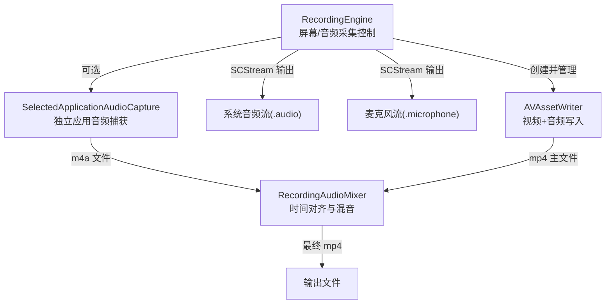
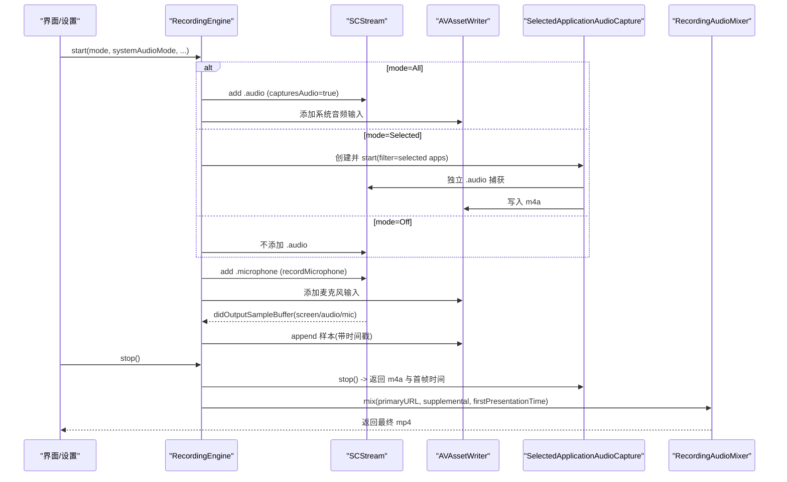
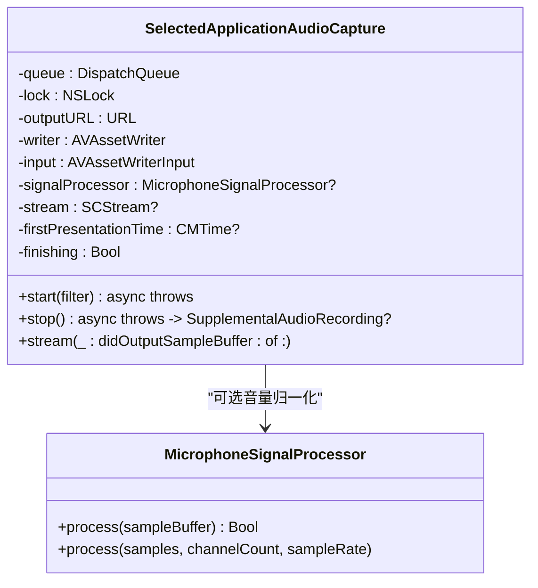
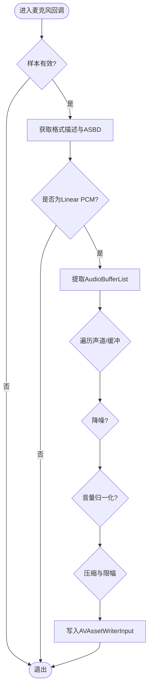
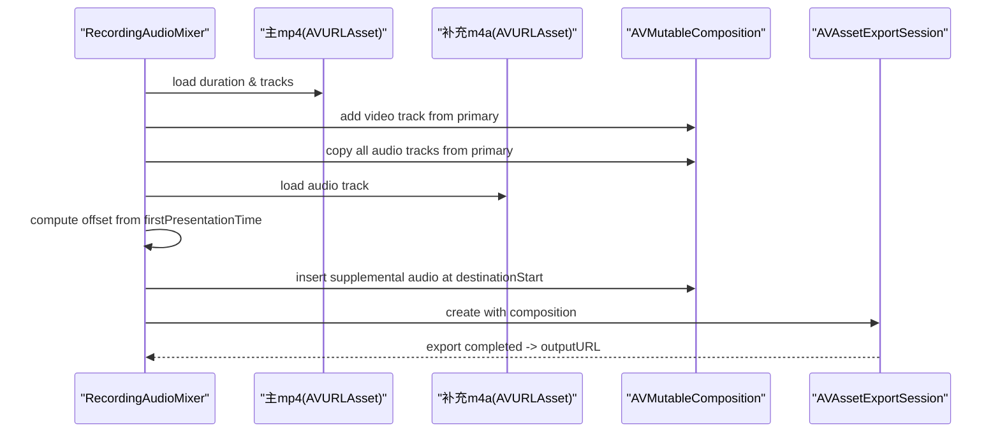
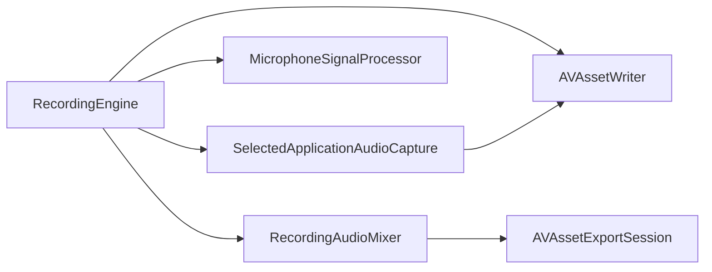

# 音频录制系统

<cite>
**本文引用的文件**   
- [RecordingEngine.swift](file://Sources/ScreenFree/RecordingEngine.swift)
- [RecordingAudioMixer.swift](file://Sources/ScreenFree/RecordingAudioMixer.swift)
- [MicrophoneSignalProcessor.swift](file://Sources/ScreenFree/MicrophoneSignalProcessor.swift)
- [AudioAnalyzer.swift](file://Sources/ScreenFree/AudioAnalyzer.swift)
- [RecordedAudioLayout.swift](file://Sources/ScreenFree/RecordedAudioLayout.swift)
</cite>

## 目录
1. [简介](#简介)
2. [项目结构](#项目结构)
3. [核心组件](#核心组件)
4. [架构总览](#架构总览)
5. [详细组件分析](#详细组件分析)
6. [依赖关系分析](#依赖关系分析)
7. [性能考量](#性能考量)
8. [故障排查指南](#故障排查指南)
9. [结论](#结论)
10. [附录：配置示例与最佳实践](#附录配置示例与最佳实践)

## 简介
本技术文档围绕 ScreenFree 的音频录制系统，系统性阐述以下要点：
- SystemAudioCaptureMode 枚举的三种模式（All、Selected、Off）的实现原理与数据流差异。
- SelectedApplicationAudioCapture 类的独立音频捕获机制，包括应用级过滤、音量归一化与多文件合成流程。
- 麦克风录制的实现细节：设备选择、降噪处理与音量增强。
- RecordingAudioMixer 的音频混合算法：时间同步、音轨合并与质量优化。
- 采样率、通道数与编码参数的配置方式，以及信号处理管道与实时处理能力。

## 项目结构
与音频录制相关的核心代码集中在 Sources/ScreenFree 目录下，关键文件如下：
- RecordingEngine.swift：屏幕与音频采集主控制器，负责创建 SCStream、AVAssetWriter 输入、启动/停止录制、回调分发与错误处理。
- MicrophoneSignalProcessor.swift：实时音频信号处理器，提供降噪、自动增益、压缩与限幅等效果。
- RecordingAudioMixer.swift：将“选定应用”的独立音频与主视频文件进行时间对齐与混音合成。
- AudioAnalyzer.swift：对已录制音频进行分析（波形、RMS、峰值、包络），用于后续混音风格与可视化。
- RecordedAudioLayout.swift：根据录制模式决定系统音频与麦克风的轨道布局与索引。

图表来源
- [RecordingEngine.swift:174-392](file://Sources/ScreenFree/RecordingEngine.swift#L174-L392)
- [RecordingEngine.swift:533-674](file://Sources/ScreenFree/RecordingEngine.swift#L533-L674)
- [RecordingAudioMixer.swift:29-135](file://Sources/ScreenFree/RecordingAudioMixer.swift#L29-L135)

章节来源
- [RecordingEngine.swift:1-691](file://Sources/ScreenFree/RecordingEngine.swift#L1-L691)
- [RecordingAudioMixer.swift:1-136](file://Sources/ScreenFree/RecordingAudioMixer.swift#L1-L136)
- [MicrophoneSignalProcessor.swift:1-356](file://Sources/ScreenFree/MicrophoneSignalProcessor.swift#L1-L356)
- [AudioAnalyzer.swift:1-332](file://Sources/ScreenFree/AudioAnalyzer.swift#L1-L332)
- [RecordedAudioLayout.swift:1-195](file://Sources/ScreenFree/RecordedAudioLayout.swift#L1-L195)

## 核心组件
- SystemAudioCaptureMode：定义系统音频捕获模式（All/Selected/Off），影响 SCStreamConfiguration.capturesAudio 与是否启用独立应用音频捕获。
- RecordingEngine：协调屏幕、系统音频、麦克风与可选的“选定应用音频”的采集与写入；维护首帧时间戳以保障时间同步。
- SelectedApplicationAudioCapture：独立的音频捕获器，基于 SCStream + AVAssetWriter 单独录制 m4a，支持可选的音量归一化。
- MicrophoneSignalProcessor：对 CMSampleBuffer 进行 PCM 处理，包含低通滤波降噪、自动增益、动态压缩与输出限幅。
- RecordingAudioMixer：读取主 mp4 与补充音频 m4a，按时间偏移对齐并合并为最终 mp4。
- AudioAnalyzer：离线分析音频文件的 RMS、峰值与包络，辅助混音策略与波形显示。
- RecordedAudioLayout：根据录制模式确定系统音频与麦克风的轨道索引顺序。

章节来源
- [RecordingEngine.swift:14-20](file://Sources/ScreenFree/RecordingEngine.swift#L14-L20)
- [RecordingEngine.swift:174-392](file://Sources/ScreenFree/RecordingEngine.swift#L174-L392)
- [RecordingEngine.swift:533-674](file://Sources/ScreenFree/RecordingEngine.swift#L533-L674)
- [RecordingAudioMixer.swift:29-135](file://Sources/ScreenFree/RecordingAudioMixer.swift#L29-L135)
- [MicrophoneSignalProcessor.swift:6-76](file://Sources/ScreenFree/MicrophoneSignalProcessor.swift#L6-L76)
- [AudioAnalyzer.swift:110-192](file://Sources/ScreenFree/AudioAnalyzer.swift#L110-L192)
- [RecordedAudioLayout.swift:15-49](file://Sources/ScreenFree/RecordedAudioLayout.swift#L15-L49)

## 架构总览
下图展示了不同 SystemAudioCaptureMode 下的数据流与控制路径：

图表来源
- [RecordingEngine.swift:174-392](file://Sources/ScreenFree/RecordingEngine.swift#L174-L392)
- [RecordingEngine.swift:445-489](file://Sources/ScreenFree/RecordingEngine.swift#L445-L489)
- [RecordingEngine.swift:533-674](file://Sources/ScreenFree/RecordingEngine.swift#L533-L674)
- [RecordingAudioMixer.swift:29-135](file://Sources/ScreenFree/RecordingAudioMixer.swift#L29-L135)

## 详细组件分析

### SystemAudioCaptureMode 三种模式的实现原理
- All（所有应用）
  - 通过 SCStreamConfiguration.capturesAudio = true 开启系统音频捕获。
  - 在 RecordingEngine 中创建系统音频 AVAssetWriterInput，并将 .audio 回调直接写入主 mp4。
  - 可启用 MicrophoneSignalProcessor（systemAudioLoudness 预设）进行自动增益与压缩限幅。
- Selected（选定应用）
  - 使用 SCContentFilter 仅包含指定 bundleIdentifier 的应用，构建独立的 SCStream。
  - 由 SelectedApplicationAudioCapture 单独录制 m4a，并在 stop 时返回文件 URL 与首帧时间戳。
  - 主录制仍可能包含麦克风轨道；最终通过 RecordingAudioMixer 将 m4a 与主 mp4 混合。
- Off（关闭）
  - capturesAudio = false，不添加任何系统音频输入；仅保留麦克风（若启用）。

章节来源
- [RecordingEngine.swift:174-210](file://Sources/ScreenFree/RecordingEngine.swift#L174-L210)
- [RecordingEngine.swift:264-280](file://Sources/ScreenFree/RecordingEngine.swift#L264-L280)
- [RecordingEngine.swift:301-326](file://Sources/ScreenFree/RecordingEngine.swift#L301-L326)
- [RecordingEngine.swift:358-392](file://Sources/ScreenFree/RecordingEngine.swift#L358-L392)
- [RecordedAudioLayout.swift:15-49](file://Sources/ScreenFree/RecordedAudioLayout.swift#L15-L49)

### SelectedApplicationAudioCapture 独立音频捕获机制
- 应用级音频过滤
  - 通过 SCContentFilter(display, including: selectedApplications) 精确限定要捕获的应用。
  - 独立 SCStream 仅订阅 .audio 类型输出，避免与主录制共享队列。
- 音量归一化处理
  - 可选启用 MicrophoneSignalProcessor(systemAudioLoudness)，在写入前对 PCM 进行自动增益与压缩限幅，提升对话清晰度并限制峰值。
- 多文件合成流程
  - 录制结束后，stop() 完成 AVAssetWriter 写入并返回 SupplementalAudioRecording（含 URL 与 firstPresentationTime）。
  - RecordingEngine.stop() 调用 RecordingAudioMixer.mix()，将 m4a 与主 mp4 按时间偏移对齐并导出最终 mp4。

图表来源
- [RecordingEngine.swift:533-674](file://Sources/ScreenFree/RecordingEngine.swift#L533-L674)
- [MicrophoneSignalProcessor.swift:94-207](file://Sources/ScreenFree/MicrophoneSignalProcessor.swift#L94-L207)

章节来源
- [RecordingEngine.swift:533-674](file://Sources/ScreenFree/RecordingEngine.swift#L533-L674)
- [RecordingEngine.swift:394-443](file://Sources/ScreenFree/RecordingEngine.swift#L394-L443)

### 麦克风录制功能实现
- 设备选择
  - 通过 SCStreamConfiguration.captureMicrophone 与 microphoneCaptureDeviceID 指定麦克风设备（macOS 15+）。
- 降噪处理
  - MicrophoneSignalProcessor 内置低通滤波降噪（截止频率约 80Hz），抑制低频噪声。
- 音量增强
  - 自动增益：基于 RMS 计算目标增益，平滑响应以避免突变；支持最小/最大增益限制。
  - 动态压缩与限幅：阈值与比率可调，输出上限防止削波。
- 实时处理
  - 在 stream(_:didOutputSampleBuffer:of:) 回调中对 .microphone 样本执行 process()，再写入 AVAssetWriterInput。

图表来源
- [RecordingEngine.swift:445-489](file://Sources/ScreenFree/RecordingEngine.swift#L445-L489)
- [MicrophoneSignalProcessor.swift:94-207](file://Sources/ScreenFree/MicrophoneSignalProcessor.swift#L94-L207)
- [MicrophoneSignalProcessor.swift:224-318](file://Sources/ScreenFree/MicrophoneSignalProcessor.swift#L224-L318)

章节来源
- [RecordingEngine.swift:301-326](file://Sources/ScreenFree/RecordingEngine.swift#L301-L326)
- [RecordingEngine.swift:445-489](file://Sources/ScreenFree/RecordingEngine.swift#L445-L489)
- [MicrophoneSignalProcessor.swift:6-76](file://Sources/ScreenFree/MicrophoneSignalProcessor.swift#L6-L76)
- [MicrophoneSignalProcessor.swift:224-318](file://Sources/ScreenFree/MicrophoneSignalProcessor.swift#L224-L318)

### RecordingAudioMixer 音频混合算法
- 时间同步
  - 使用 primaryFirstPresentationTime 与 supplemental.firstPresentationTime 计算偏移 offset，确保补充音频在主时间线上的正确位置。
  - 对源时间范围与目标可用范围求交集，裁剪多余部分。
- 音轨合并
  - 复制主视频的 video track 与所有 audio tracks。
  - 将补充音频作为新的 audio track 插入到 composition 中。
- 质量优化
  - 使用 AVAssetExportSession 的 Passthrough 预设，保持原始编码质量。
  - shouldOptimizeForNetworkUse = true 优化网络播放。
  - 输出为 mp4，文件名包含 UUID 避免冲突。

图表来源
- [RecordingAudioMixer.swift:29-135](file://Sources/ScreenFree/RecordingAudioMixer.swift#L29-L135)

章节来源
- [RecordingAudioMixer.swift:29-135](file://Sources/ScreenFree/RecordingAudioMixer.swift#L29-L135)

### 音频分析与混音样式
- AudioAnalyzer
  - 逐轨读取 PCM 样本，计算 RMS、峰值与时间对齐的峰值包络。
  - 提供波形归一化（去噪底、自适应门限、平方根缩放）用于可视化。
- RecordedAudioMixStyle
  - 根据系统/麦克风轨道的绝对峰值与包络，计算并发峰值并调整整体增益，避免混音削波。
  - 支持单轨或双轨场景的动态增益分配与静音控制。

章节来源
- [AudioAnalyzer.swift:110-192](file://Sources/ScreenFree/AudioAnalyzer.swift#L110-L192)
- [AudioAnalyzer.swift:194-331](file://Sources/ScreenFree/AudioAnalyzer.swift#L194-L331)
- [RecordedAudioLayout.swift:52-195](file://Sources/ScreenFree/RecordedAudioLayout.swift#L52-L195)

## 依赖关系分析
- RecordingEngine 依赖：
  - ScreenCaptureKit（SCStream、SCContentFilter、SCShareableContent）
  - AVFoundation（AVAssetWriter、AVAssetWriterInput、AVAssetExportSession）
  - CoreMedia（CMSampleBuffer、CMTime）
  - MicrophoneSignalProcessor（可选，用于系统音频与麦克风的实时增强）
  - SelectedApplicationAudioCapture（Selected 模式）
  - RecordingAudioMixer（Selected 模式合成）
- SelectedApplicationAudioCapture 依赖：
  - SCStream 与 AVAssetWriter 独立运行，输出 m4a
- RecordingAudioMixer 依赖：
  - AVURLAsset、AVMutableComposition、AVAssetExportSession

图表来源
- [RecordingEngine.swift:174-392](file://Sources/ScreenFree/RecordingEngine.swift#L174-L392)
- [RecordingEngine.swift:533-674](file://Sources/ScreenFree/RecordingEngine.swift#L533-L674)
- [RecordingAudioMixer.swift:29-135](file://Sources/ScreenFree/RecordingAudioMixer.swift#L29-L135)

章节来源
- [RecordingEngine.swift:1-691](file://Sources/ScreenFree/RecordingEngine.swift#L1-L691)
- [RecordingAudioMixer.swift:1-136](file://Sources/ScreenFree/RecordingAudioMixer.swift#L1-L136)

## 性能考量
- 实时性
  - SCStream 与 AVAssetWriterInput 均设置为 expectsMediaDataInRealTime = true，降低延迟。
  - 使用专用队列 captureQueue（userInteractive）与 SAC 的 queue（userInitiated）分离处理路径。
- 内存与拷贝
  - 音频缓冲采用 UnsafeRawPointer 与 UnsafeMutableBufferPointer 直接操作，减少不必要拷贝。
  - CMSampleBufferGetAudioBufferListWithRetainedBlockBuffer 复用块缓冲，降低分配开销。
- 编码与导出
  - 视频 H.264，比特率按分辨率动态计算；音频 AAC 192kbps 48kHz 立体声。
  - 导出使用 Passthrough 预设，避免重编码损失。
- 时间同步
  - 首帧时间戳记录与偏移计算确保多源音频对齐，避免跳变或重叠。

[本节为通用指导，无需具体文件引用]

## 故障排查指南
- 无可录制源
  - 检查 availableTargets(for:) 是否正确筛选显示器/窗口。
- 无可用音频应用
  - Selected 模式下需至少选择一个应用；availableAudioApplications() 会排除自身进程。
- 写入失败
  - cannotStartWriter/cannotFinishWriter/writerFailed：确认 AVAssetWriter 状态与输入 canAdd。
- 混合失败
  - missingPrimaryVideo/cannotCreateTrack/exportFailed：检查主文件是否包含视频轨、导出会话是否成功。
- 时间戳异常
  - 确保 firstPresentationTime 初始化后再写入音频；忽略早于首帧的音频样本。

章节来源
- [RecordingEngine.swift:40-61](file://Sources/ScreenFree/RecordingEngine.swift#L40-L61)
- [RecordingEngine.swift:394-443](file://Sources/ScreenFree/RecordingEngine.swift#L394-L443)
- [RecordingAudioMixer.swift:4-22](file://Sources/ScreenFree/RecordingAudioMixer.swift#L4-L22)

## 结论
ScreenFree 的音频录制系统通过灵活的 SystemAudioCaptureMode 与独立的 SelectedApplicationAudioCapture 机制，实现了从全系统音频到精准应用音频的多粒度捕获。结合 MicrophoneSignalProcessor 的实时降噪与音量增强，以及 RecordingAudioMixer 的时间对齐与混音能力，系统在保证高质量输出的同时兼顾了实时性与稳定性。AudioAnalyzer 与 RecordedAudioMixStyle 进一步提升了后期混音的可控性与一致性。

[本节为总结，无需具体文件引用]

## 附录：配置示例与最佳实践
以下为如何配置不同音频录制选项的实践要点（以路径引用代替代码片段）：
- 采样率与通道配置
  - 系统音频与麦克风统一使用 48kHz 立体声（见 [RecordingEngine.swift:301-306](file://Sources/ScreenFree/RecordingEngine.swift#L301-L306)、[RecordingEngine.swift:587-589](file://Sources/ScreenFree/RecordingEngine.swift#L587-L589)）。
- 编码参数
  - 视频 H.264，比特率按分辨率动态计算；音频 AAC 192kbps（见 [RecordingEngine.swift:284-295](file://Sources/ScreenFree/RecordingEngine.swift#L284-L295)、[RecordingEngine.swift:301-306](file://Sources/ScreenFree/RecordingEngine.swift#L301-L306)）。
- 麦克风设备选择
  - macOS 15+ 可通过 configuration.microphoneCaptureDeviceID 指定设备（见 [RecordingEngine.swift:204-207](file://Sources/ScreenFree/RecordingEngine.swift#L204-L207)）。
- 降噪与音量增强
  - 系统音频：启用 normalizeSystemAudioVolume 后使用 systemAudioLoudness 预设（见 [RecordingEngine.swift:333-338](file://Sources/ScreenFree/RecordingEngine.swift#L333-L338)）。
  - 麦克风：根据 reduceMicrophoneNoise 与 normalizeMicrophoneVolume 生成 microphoneLoudness 预设（见 [RecordingEngine.swift:339-346](file://Sources/ScreenFree/RecordingEngine.swift#L339-L346)）。
- 多文件合成
  - Selected 模式下，stop() 返回 m4a 与首帧时间，交由 RecordingAudioMixer.mix() 合成（见 [RecordingEngine.swift:394-443](file://Sources/ScreenFree/RecordingEngine.swift#L394-L443)、[RecordingAudioMixer.swift:29-135](file://Sources/ScreenFree/RecordingAudioMixer.swift#L29-L135)）。

章节来源
- [RecordingEngine.swift:204-207](file://Sources/ScreenFree/RecordingEngine.swift#L204-L207)
- [RecordingEngine.swift:284-306](file://Sources/ScreenFree/RecordingEngine.swift#L284-L306)
- [RecordingEngine.swift:333-346](file://Sources/ScreenFree/RecordingEngine.swift#L333-L346)
- [RecordingEngine.swift:394-443](file://Sources/ScreenFree/RecordingEngine.swift#L394-L443)
- [RecordingAudioMixer.swift:29-135](file://Sources/ScreenFree/RecordingAudioMixer.swift#L29-L135)